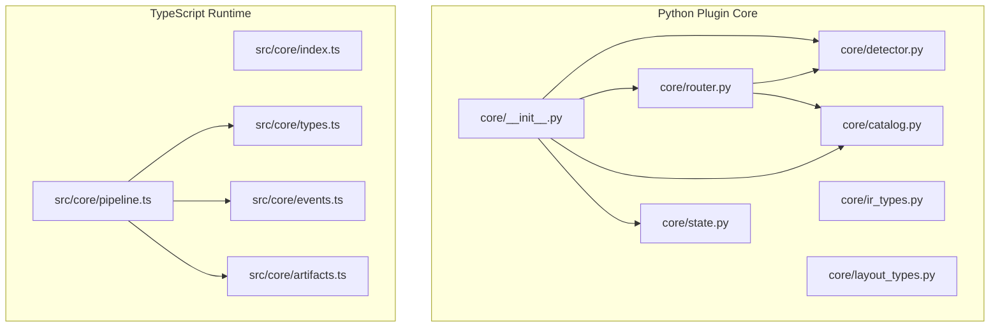
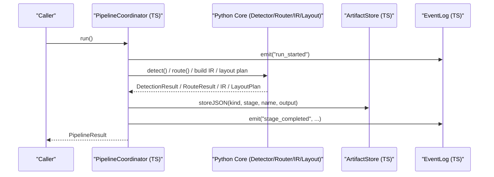
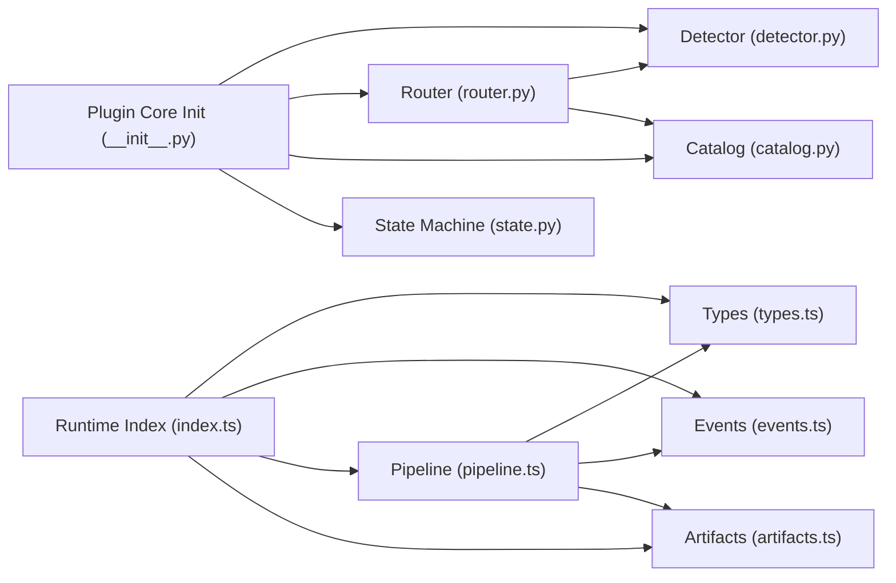

# API Reference

<cite>
**Referenced Files in This Document**
- [README.md](file://README.md)
- [package.json](file://package.json)
- [plugin/figmaforge/core/__init__.py](file://plugin/figmaforge/core/__init__.py)
- [plugin/figmaforge/core/detector.py](file://plugin/figmaforge/core/detector.py)
- [plugin/figmaforge/core/router.py](file://plugin/figmaforge/core/router.py)
- [plugin/figmaforge/core/catalog.py](file://plugin/figmaforge/core/catalog.py)
- [plugin/figmaforge/core/state.py](file://plugin/figmaforge/core/state.py)
- [plugin/figmaforge/core/ir_types.py](file://plugin/figmaforge/core/ir_types.py)
- [plugin/figmaforge/core/layout_types.py](file://plugin/figmaforge/core/layout_types.py)
- [runtime/src/core/index.ts](file://runtime/src/core/index.ts)
- [runtime/src/core/types.ts](file://runtime/src/core/types.ts)
- [runtime/src/core/events.ts](file://runtime/src/core/events.ts)
- [runtime/src/core/pipeline.ts](file://runtime/src/core/pipeline.ts)
- [runtime/src/core/artifacts.ts](file://runtime/src/core/artifacts.ts)
</cite>

## Table of Contents
1. Introduction
2. Project Structure
3. Core Components
4. Architecture Overview
5. Detailed Component Analysis
6. Dependency Analysis
7. Performance Considerations
8. Troubleshooting Guide
9. Conclusion
10. Appendices

## Introduction
This document provides a comprehensive API reference for FigmaForge’s public interfaces across Python and TypeScript runtimes. It covers:
- Python APIs: core classes, methods, data structures, events, and error handling
- TypeScript APIs: runtime exports, type definitions, interface specifications, and usage patterns
- Data models: design IR, layout plans, generation outputs, and runtime artifacts
- Method signatures, parameters, return values, exceptions, and example usage flows

FigmaForge converts normalized Figma design IR into framework-neutral layout plans and generates production-quality React/CSS output with deterministic pipelines, checkpoints, and audit trails.

**Section sources**
- [README.md:10-100](file://README.md#L10-L100)

## Project Structure
FigmaForge is organized into two primary runtime surfaces:
- Python plugin core under plugin/figmaforge/core (detector, router, catalog, lifecycle state machine, design IR, layout plan)
- TypeScript runtime under runtime/src/core (pipeline coordinator, types, events, artifacts, security, tools)

**Diagram sources**
- [plugin/figmaforge/core/__init__.py:1-21](file://plugin/figmaforge/core/__init__.py#L1-L21)
- [plugin/figmaforge/core/detector.py:122-216](file://plugin/figmaforge/core/detector.py#L122-L216)
- [plugin/figmaforge/core/router.py:27-117](file://plugin/figmaforge/core/router.py#L27-L117)
- [plugin/figmaforge/core/catalog.py:11-79](file://plugin/figmaforge/core/catalog.py#L11-L79)
- [plugin/figmaforge/core/state.py:125-172](file://plugin/figmaforge/core/state.py#L125-L172)
- [runtime/src/core/index.ts:1-18](file://runtime/src/core/index.ts#L1-L18)
- [runtime/src/core/types.ts:12-26](file://runtime/src/core/types.ts#L12-L26)
- [runtime/src/core/events.ts:66-138](file://runtime/src/core/events.ts#L66-L138)
- [runtime/src/core/pipeline.ts:82-139](file://runtime/src/core/pipeline.ts#L82-L139)
- [runtime/src/core/artifacts.ts:65-107](file://runtime/src/core/artifacts.ts#L65-L107)

**Section sources**
- [README.md:185-253](file://README.md#L185-L253)
- [package.json:1-8](file://package.json#L1-L8)

## Core Components
- Python
  - RepositoryDetector: evidence-based stack detection with thresholds and confidence scoring
  - Router: deterministic role selection and execution mode determination based on request triggers and detection results
  - Catalog: load/query 100-role catalog from roles.json
  - StateMachine: lifecycle state management with atomic writes, approvals, blockers, and replayable events
  - Design IR types: normalized, JSON-serializable representation of Figma files
  - Layout plan types: framework-neutral layout inference model with breakpoints, constraints, diagnostics
- TypeScript
  - PipelineCoordinator: orchestrates stages with retry, budgets, checkpoints, security, and artifact storage
  - Types: pipeline stages, configuration, provider interfaces, utilities
  - EventLog: append-only structured event log for audit and replay
  - ArtifactStore: content-addressed storage for pipeline outputs

**Section sources**
- [plugin/figmaforge/core/detector.py:122-216](file://plugin/figmaforge/core/detector.py#L122-L216)
- [plugin/figmaforge/core/router.py:27-117](file://plugin/figmaforge/core/router.py#L27-L117)
- [plugin/figmaforge/core/catalog.py:11-79](file://plugin/figmaforge/core/catalog.py#L11-L79)
- [plugin/figmaforge/core/state.py:125-172](file://plugin/figmaforge/core/state.py#L125-L172)
- [plugin/figmaforge/core/ir_types.py:724-784](file://plugin/figmaforge/core/ir_types.py#L724-L784)
- [plugin/figmaforge/core/layout_types.py:479-540](file://plugin/figmaforge/core/layout_types.py#L479-L540)
- [runtime/src/core/pipeline.ts:82-139](file://runtime/src/core/pipeline.ts#L82-L139)
- [runtime/src/core/types.ts:12-26](file://runtime/src/core/types.ts#L12-L26)
- [runtime/src/core/events.ts:66-138](file://runtime/src/core/events.ts#L66-L138)
- [runtime/src/core/artifacts.ts:65-107](file://runtime/src/core/artifacts.ts#L65-L107)

## Architecture Overview
The system integrates Python-based design processing with a TypeScript runtime that coordinates the full pipeline from ingestion to verification.

**Diagram sources**
- [runtime/src/core/pipeline.ts:137-207](file://runtime/src/core/pipeline.ts#L137-L207)
- [plugin/figmaforge/core/detector.py:139-216](file://plugin/figmaforge/core/detector.py#L139-L216)
- [plugin/figmaforge/core/router.py:44-117](file://plugin/figmaforge/core/router.py#L44-L117)
- [plugin/figmaforge/core/ir_types.py:724-784](file://plugin/figmaforge/core/ir_types.py#L724-L784)
- [plugin/figmaforge/core/layout_types.py:479-540](file://plugin/figmaforge/core/layout_types.py#L479-L540)
- [runtime/src/core/artifacts.ts:81-107](file://runtime/src/core/artifacts.ts#L81-L107)
- [runtime/src/core/events.ts:72-96](file://runtime/src/core/events.ts#L72-L96)

## Detailed Component Analysis

### Python API: Detector
- Class: RepositoryDetector
- Purpose: Evidence-based repository stack detection with configurable thresholds
- Key method: detect() -> Dict
  - Parameters: none (uses instance root and threshold)
  - Returns: detection result dictionary with languages, frameworks, package managers, test commands, CI providers, IaC tools, MCP/LSP configs, lsp_candidates, confidence, status, warnings, evidence
  - Exceptions: FileNotFoundError if root path does not exist
- Internal helpers: language/framework/package manager/CI/IaC detection, LSP candidate discovery via PATH, confidence calculation

Usage pattern:
- Initialize with repository root path and optional threshold
- Call detect() to obtain structured detection result
- Use results to inform routing or downstream steps

**Section sources**
- [plugin/figmaforge/core/detector.py:122-216](file://plugin/figmaforge/core/detector.py#L122-L216)
- [plugin/figmaforge/core/detector.py:228-336](file://plugin/figmaforge/core/detector.py#L228-L336)
- [plugin/figmaforge/core/detector.py:338-403](file://plugin/figmaforge/core/detector.py#L338-L403)

### Python API: Router
- Class: Router
- Purpose: Deterministic role selection and execution mode determination
- Key method: route(request, installed_capabilities?) -> RouteResult
  - Parameters:
    - request: natural language request string
    - installed_capabilities: optional list of capability references actually installed
  - Returns: RouteResult with phases, roles, external_skills, execution_mode, stack_status, approval_gates, unloaded_modules
- Scoring logic: trigger matches, lifecycle phase overlap, repository signal match, deliverable match, installed capability refs; penalties for unclassified stacks
- Execution modes: isolated_scout, isolated_planner, direct
- Approval gates: external_mutation, stack_selection, language_activation, project_approval

Usage pattern:
- Construct with Catalog and RepositoryDetector instances
- Call route() to get selected roles and execution strategy
- Use returned phases and gates to orchestrate lifecycle and safety checks

**Section sources**
- [plugin/figmaforge/core/router.py:27-117](file://plugin/figmaforge/core/router.py#L27-L117)
- [plugin/figmaforge/core/router.py:176-302](file://plugin/figmaforge/core/router.py#L176-L302)
- [plugin/figmaforge/core/router.py:304-409](file://plugin/figmaforge/core/router.py#L304-L409)

### Python API: Catalog
- Class: Catalog
- Purpose: Load and query the 100-role catalog from roles.json
- Methods:
  - get_role(role_id) -> Dict | None
  - get_roles_by_domain(domain_name) -> List[Dict]
  - get_all_roles() -> List[Dict]
  - get_domains() -> List[str]
  - get_trigger_roles(trigger) -> List[Dict]
  - get_domain_role_count() -> Dict[str, int]
- Initialization: loads roles.json from default or provided path; raises FileNotFoundError if missing

Usage pattern:
- Instantiate Catalog to access roles by domain or trigger keywords
- Combine with Router to score and select roles

**Section sources**
- [plugin/figmaforge/core/catalog.py:11-79](file://plugin/figmaforge/core/catalog.py#L11-L79)
- [plugin/figmaforge/core/catalog.py:89-116](file://plugin/figmaforge/core/catalog.py#L89-L116)

### Python API: Lifecycle State Machine
- Class: StateMachine
- Purpose: Manage lifecycle state with atomic writes and replayable events
- Key methods:
  - initialize(request, selected_roles, selected_capabilities) -> LifecycleState
  - advance_to(new_phase, risk?, artifacts?) -> LifecycleState
  - add_evidence(evidence) -> LifecycleState
  - add_validation(check, passed, details?) -> LifecycleState
  - request_approval(gate, reason) -> bool
  - grant_approval(gate, reason) -> bool
  - resolve_blocker(blocker_id) -> LifecycleState
  - set_blocker(blocker_id, message) -> LifecycleState
  - complete(risk?) -> LifecycleState
  - fail(risk?) -> LifecycleState
- Validation: enforces forward-only transitions between adjacent lifecycle phases
- Persistence: writes state.json under .figmaforge/runs/<run_id>/state.json

Usage pattern:
- Initialize with request and selected roles/capabilities
- Advance through phases with evidence-driven transitions
- Record validations, approvals, blockers, and completion/failure states

**Section sources**
- [plugin/figmaforge/core/state.py:125-172](file://plugin/figmaforge/core/state.py#L125-L172)
- [plugin/figmaforge/core/state.py:174-224](file://plugin/figmaforge/core/state.py#L174-L224)
- [plugin/figmaforge/core/state.py:226-315](file://plugin/figmaforge/core/state.py#L226-L315)
- [plugin/figmaforge/core/state.py:317-402](file://plugin/figmaforge/core/state.py#L317-L402)
- [plugin/figmaforge/core/state.py:404-452](file://plugin/figmaforge/core/state.py#L404-L452)

### Python API: Design IR Data Model
- Module: ir_types.py
- Purpose: Framework-neutral, normalized view of a Figma file
- Key types:
  - IRDocument: top-level container with schema_version, file_key, name, source, root, pages, components, styles, variables, assets, prototype_start_node
  - IRNode: normalized node with id, name, kind, node_type, source, visibility, opacity, dimensions, position, layout, style, typography, text, component, instance, tokens, responsive, prototype, annotations, asset, children, unknown, raw
  - Supporting value objects: IRColor, IRFill, IRBorder, IRShadow, IRBlur, IRStyle, IRSpacing, IRLayout, IRPosition, IRDimensions, IRTypography, IRTextContent, IRComponent, IRInstance, IRTokenRef, IRTokens, IResponsive, IRInteraction, IRPrototype, IRAnnotations, IRAssetRef, IRSource, IRToken
- Serialization: each object exposes to_dict(); helper functions ir_to_dict and ir_to_json provide deterministic serialization

Usage pattern:
- Build IRDocument from Figma ingestion layer
- Traverse nodes via walk() or all_nodes()
- Serialize for snapshots or downstream consumption

**Section sources**
- [plugin/figmaforge/core/ir_types.py:57-95](file://plugin/figmaforge/core/ir_types.py#L57-L95)
- [plugin/figmaforge/core/ir_types.py:116-262](file://plugin/figmaforge/core/ir_types.py#L116-L262)
- [plugin/figmaforge/core/ir_types.py:264-364](file://plugin/figmaforge/core/ir_types.py#L264-L364)
- [plugin/figmaforge/core/ir_types.py:366-428](file://plugin/figmaforge/core/ir_types.py#L366-L428)
- [plugin/figmaforge/core/ir_types.py:430-562](file://plugin/figmaforge/core/ir_types.py#L430-L562)
- [plugin/figmaforge/core/ir_types.py:564-612](file://plugin/figmaforge/core/ir_types.py#L564-L612)
- [plugin/figmaforge/core/ir_types.py:619-697](file://plugin/figmaforge/core/ir_types.py#L619-L697)
- [plugin/figmaforge/core/ir_types.py:699-784](file://plugin/figmaforge/core/ir_types.py#L699-L784)

### Python API: Layout Plan Data Model
- Module: layout_types.py
- Purpose: Framework-neutral layout plan describing how a Design IR should lay out at a given viewport
- Key types:
  - LayoutPlan: schema_version, file_key, viewport, base_width, source, screens, breakpoints, constraints, counts, confidence, diagnostics
  - LayoutNodePlan: per-node plan including display, direction, order, box, figma_box, bounds_delta, sizing, spacing, alignment, anchors, text, overflow, breakpoints, confidence, assumptions, constraints, diagnostics, children
  - BreakpointPlan: breakpoints, changes, no_change, counts
  - Supporting value objects: Box, AxisSizing, SizingSpec, EdgeOffsets, SpacingSpec, AlignmentSpec, Anchoring, OverflowSpec, TextModel, ConfidenceDecision, Diagnostic, ConstraintIssue, ConstraintReport
- Serialization: plan_to_dict and plan_to_json helpers

Usage pattern:
- Consume IR and produce LayoutPlan via analyzer/engine
- Inspect per-node plans and breakpoint changes
- Use diagnostics and constraints to guide repair or generator

**Section sources**
- [plugin/figmaforge/core/layout_types.py:33-81](file://plugin/figmaforge/core/layout_types.py#L33-L81)
- [plugin/figmaforge/core/layout_types.py:102-249](file://plugin/figmaforge/core/layout_types.py#L102-L249)
- [plugin/figmaforge/core/layout_types.py:251-351](file://plugin/figmaforge/core/layout_types.py#L251-L351)
- [plugin/figmaforge/core/layout_types.py:358-405](file://plugin/figmaforge/core/layout_types.py#L358-L405)
- [plugin/figmaforge/core/layout_types.py:412-540](file://plugin/figmaforge/core/layout_types.py#L412-L540)

### TypeScript API: Runtime Exports and Types
- Barrel export: index.ts re-exports core modules for consumers
- Types:
  - PIPELINE_STAGES: ordered list of deterministic pipeline stages
  - STAGE_INDEX: mapping from stage to index
  - RunId, TaskId: identifiers with makeRunId and makeTaskId utilities
  - RunStatus: lifecycle statuses for runs
  - RetryPolicy, Budgets, RuntimeConfig: configuration for retries, budgets, and runtime behavior
  - ModelProvider, ModelOptions, ModelResult: pluggable model interface and result shape
  - NullModelProvider: deterministic no-op provider for fully reproducible runs

Usage pattern:
- Import types and constants from runtime/src/core/index.ts
- Configure RuntimeConfig with approvedDirs, budgets, similarityThreshold, viewport, pythonBin, pluginDir
- Provide a ModelProvider implementation or use NullModelProvider for determinism

**Section sources**
- [runtime/src/core/index.ts:1-18](file://runtime/src/core/index.ts#L1-L18)
- [runtime/src/core/types.ts:12-26](file://runtime/src/core/types.ts#L12-L26)
- [runtime/src/core/types.ts:36-53](file://runtime/src/core/types.ts#L36-L53)
- [runtime/src/core/types.ts:59-66](file://runtime/src/core/types.ts#L59-L66)
- [runtime/src/core/types.ts:72-125](file://runtime/src/core/types.ts#L72-L125)
- [runtime/src/core/types.ts:131-159](file://runtime/src/core/types.ts#L131-L159)

### TypeScript API: Events
- EventLog class: append-only structured event log for audit and replay
- Event fields: seq, timestamp, level, kind, runId, taskId?, stage?, message, data?
- Event kinds include run lifecycle, stage lifecycle, checkpoint operations, retries, budget exceeded, approvals, repairs, tool invocations, artifacts, model invocations, security violations
- Methods: emit, all, byKind, byStage, byLevel, length, toJSON, fromJSON

Usage pattern:
- Create EventLog per run
- Emit events at key points (start, stage begin/end, failures, approvals)
- Persist or stream events for debugging and replay

**Section sources**
- [runtime/src/core/events.ts:14-60](file://runtime/src/core/events.ts#L14-L60)
- [runtime/src/core/events.ts:66-138](file://runtime/src/core/events.ts#L66-L138)

### TypeScript API: Pipeline Coordinator
- PipelineCoordinator: orchestrates the full pipeline with retry, budgets, checkpoints, security, and artifact storage
- Key methods:
  - onStage(stage, handler): register stage handlers
  - setAbortSignal(signal): enable cancellation
  - run(): execute pipeline stages in order, manage state transitions, handle errors, save artifacts, return PipelineResult
- Context: shared map for inter-stage data; security sandboxing; tool context
- Stage mapping: maps stages to artifact kinds for storage

Usage pattern:
- Construct with config, events, checkpoints, artifacts, tools, budget, optional approval callback
- Register handlers for each stage
- Call run() to execute; handle PipelineResult for outcomes

**Section sources**
- [runtime/src/core/pipeline.ts:32-76](file://runtime/src/core/pipeline.ts#L32-L76)
- [runtime/src/core/pipeline.ts:82-139](file://runtime/src/core/pipeline.ts#L82-L139)
- [runtime/src/core/pipeline.ts:137-207](file://runtime/src/core/pipeline.ts#L137-L207)
- [runtime/src/core/pipeline.ts:209-329](file://runtime/src/core/pipeline.ts#L209-L329)

### TypeScript API: Artifacts
- ArtifactStore: content-addressed storage for pipeline outputs
- Artifact fields: id, kind, stage, runId, path, hash, size, createdAt, label?
- Methods: init, storeJSON, storeBuffer, loadJSON, byStage, byKind, manifest, saveManifest, count, totalSize
- Kinds include figma_raw, design_ir, resolution_report, layout_plan, generated_code, asset_manifest, screenshot, render_meta, diff_report, repair_plan, repair_result, repair_history, event_log, checkpoint, metrics

Usage pattern:
- Store outputs from each stage using storeJSON/storeBuffer
- Retrieve artifacts by kind or stage
- Save manifest for provenance

**Section sources**
- [runtime/src/core/artifacts.ts:18-59](file://runtime/src/core/artifacts.ts#L18-L59)
- [runtime/src/core/artifacts.ts:65-176](file://runtime/src/core/artifacts.ts#L65-L176)

## Dependency Analysis

**Diagram sources**
- [plugin/figmaforge/core/__init__.py:10-20](file://plugin/figmaforge/core/__init__.py#L10-L20)
- [plugin/figmaforge/core/router.py:10-12](file://plugin/figmaforge/core/router.py#L10-L12)
- [runtime/src/core/index.ts:5-17](file://runtime/src/core/index.ts#L5-L17)
- [runtime/src/core/pipeline.ts:12-26](file://runtime/src/core/pipeline.ts#L12-L26)

**Section sources**
- [plugin/figmaforge/core/__init__.py:10-20](file://plugin/figmaforge/core/__init__.py#L10-L20)
- [runtime/src/core/index.ts:5-17](file://runtime/src/core/index.ts#L5-L17)

## Performance Considerations
- Deterministic serialization: IR and layout plan serializers use sort_keys for stable snapshots
- Efficient detection: detector uses pattern matching and PATH checks with timeouts to avoid blocking
- Pipeline efficiency:
  - Checkpoint resume avoids re-execution of completed stages
  - Retry with exponential backoff reduces transient failure impact
  - Budget tracking prevents runaway token/time/iteration usage
- Artifact storage: content-addressed hashing minimizes duplication and enables fast lookups

[No sources needed since this section provides general guidance]

## Troubleshooting Guide
Common issues and resolutions:
- Filesystem errors:
  - FileNotFoundError when catalog or detector root paths are missing; ensure correct paths exist before initialization
- Invalid state transitions:
  - ValueError raised when attempting invalid phase transitions; ensure evidence-driven advancement to next phase only
- Budget exceeded:
  - BudgetExceededError thrown when limits are hit; review budgets and adjust thresholds or optimize stages
- Missing stage handlers:
  - Stages without registered handlers are skipped; ensure all required stages have handlers
- Security violations:
  - SecurityGuard mechanisms may block unsafe operations; configure approved directories and secrets appropriately

**Section sources**
- [plugin/figmaforge/core/catalog.py:32-38](file://plugin/figmaforge/core/catalog.py#L32-L38)
- [plugin/figmaforge/core/detector.py:125-137](file://plugin/figmaforge/core/detector.py#L125-L137)
- [plugin/figmaforge/core/state.py:190-198](file://plugin/figmaforge/core/state.py#L190-L198)
- [runtime/src/core/pipeline.ts:167-181](file://runtime/src/core/pipeline.ts#L167-L181)
- [runtime/src/core/pipeline.ts:210-217](file://runtime/src/core/pipeline.ts#L210-L217)

## Conclusion
FigmaForge provides robust, deterministic APIs for converting Figma designs into production-ready code. The Python core offers strong typing and normalization for design IR and layout plans, while the TypeScript runtime coordinates the pipeline with comprehensive auditing, security, and resilience. Together, they enable reliable, repeatable workflows from design to verified output.

[No sources needed since this section summarizes without analyzing specific files]

## Appendices

### Example Usage Patterns

- Python: Detect and route
  - Initialize RepositoryDetector with repository root and threshold
  - Call detect() to obtain structured detection result
  - Initialize Router with Catalog and Detector
  - Call route() with user request and installed capabilities
  - Use returned phases, roles, execution_mode, and approval_gates to drive lifecycle

- Python: Lifecycle state management
  - Initialize StateMachine with request and selected roles/capabilities
  - Advance through phases with evidence-driven transitions
  - Record validations, approvals, blockers, and completion/failure states

- TypeScript: Run pipeline
  - Configure RuntimeConfig with runId, fileKey, outputDir, approvedDirs, budgets, similarityThreshold, viewport, pythonBin, pluginDir
  - Create EventLog, CheckpointManager, ArtifactStore, ToolRegistry, BudgetTracker
  - Construct PipelineCoordinator and register stage handlers
  - Call run() and process PipelineResult

- TypeScript: Artifacts and events
  - Store outputs from each stage using ArtifactStore.storeJSON/storeBuffer
  - Emit events via EventLog.emit for audit trail
  - Save manifest for provenance

[No sources needed since this section provides general guidance]