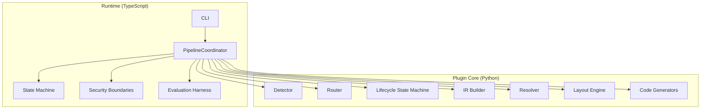
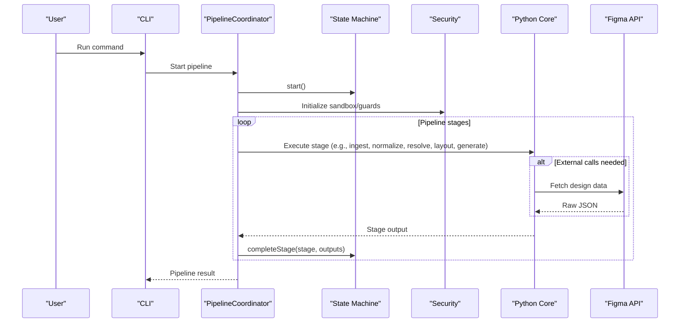
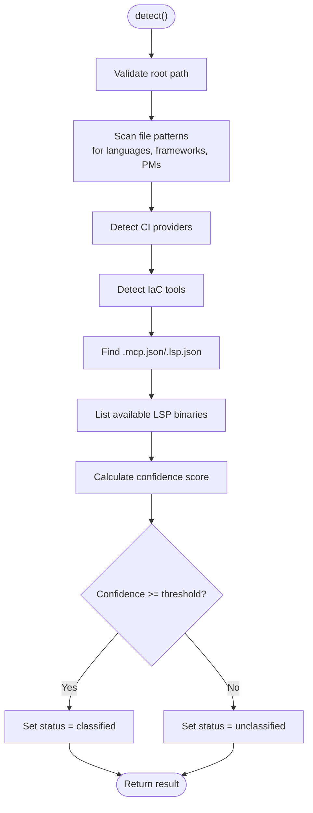
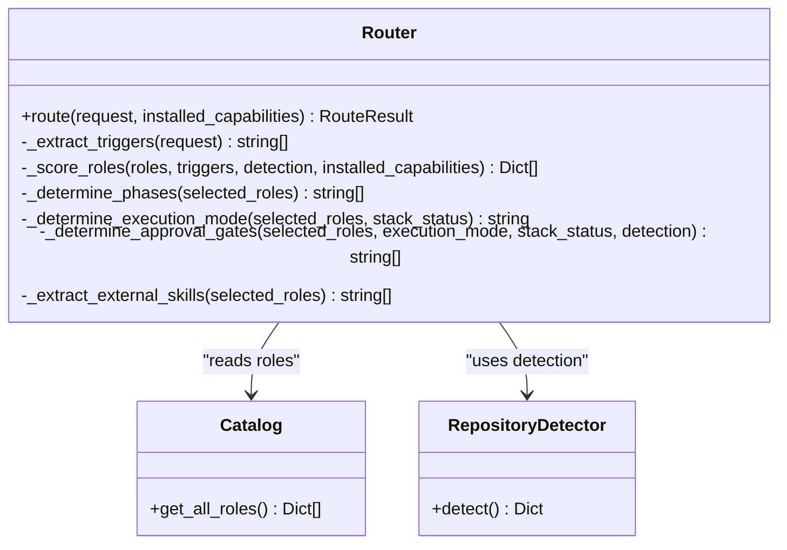
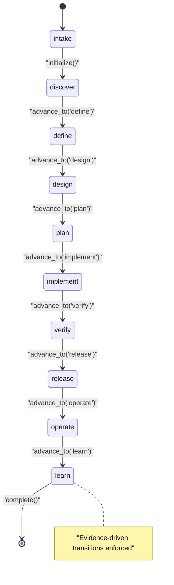
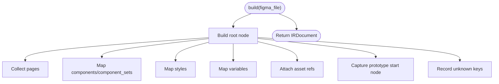
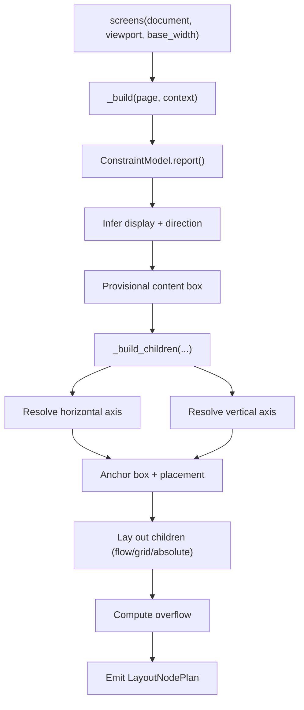
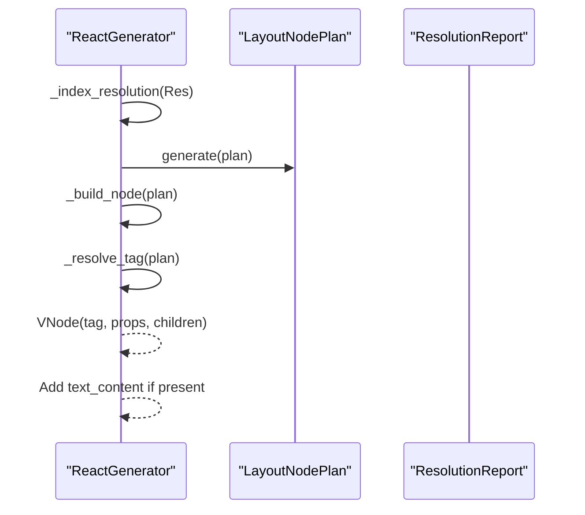
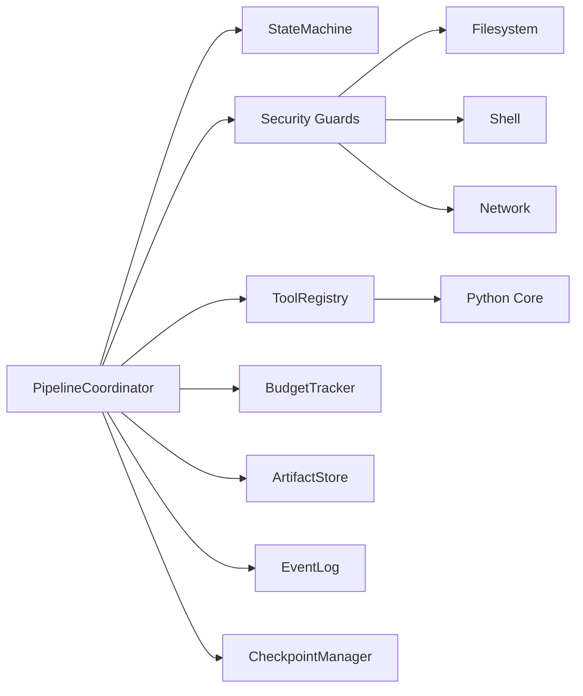

# Architecture Overview

<cite>
**Referenced Files in This Document**
- [README.md](file://README.md)
- [architecture.md](file://docs/architecture.md)
- [runtime-architecture.md](file://docs/runtime-architecture.md)
- [detector.py](file://plugin/figmaforge/core/detector.py)
- [router.py](file://plugin/figmaforge/core/router.py)
- [state.py](file://plugin/figmaforge/core/state.py)
- [ir_builder.py](file://plugin/figmaforge/core/ir_builder.py)
- [layout_engine.py](file://plugin/figmaforge/core/layout_engine.py)
- [react_generator.py](file://plugin/figmaforge/core/react_generator.py)
- [roles.json](file://plugin/figmaforge/catalog/roles.json)
- [pipeline.ts](file://runtime/src/core/pipeline.ts)
- [state.ts](file://runtime/src/core/state.ts)
</cite>

## Table of Contents
1. [Introduction](#introduction)
2. [Project Structure](#project-structure)
3. [Core Components](#core-components)
4. [Architecture Overview](#architecture-overview)
5. [Detailed Component Analysis](#detailed-component-analysis)
6. [Dependency Analysis](#dependency-analysis)
7. [Performance Considerations](#performance-considerations)
8. [Troubleshooting Guide](#troubleshooting-guide)
9. [Conclusion](#conclusion)
10. [Appendices](#appendices)

## Introduction
FigmaForge is a dual-language, adaptive platform that combines:
- A Python-based plugin core for repository detection, deterministic role routing, lifecycle state management, and design-to-code transformations (Design IR, layout inference, code generation).
- A TypeScript runtime orchestration layer that coordinates the full Figma-to-code pipeline with strict security, budgeting, checkpointing, and evaluation.

It integrates with Claude Code as a plugin and can call external systems such as the Figma API to ingest designs. The system enforces safety invariants, evidence-based decisions, and deterministic behavior across all phases.

**Section sources**
- [README.md:10-21](file://README.md#L10-L21)
- [architecture.md:11-18](file://docs/architecture.md#L11-L18)
- [runtime-architecture.md:1-13](file://docs/runtime-architecture.md#L1-L13)

## Project Structure
The repository is organized into two primary subsystems:
- Plugin core (Python): detector, router, catalog, lifecycle state machine, Design IR builder, resolver, layout engine, and code generators.
- Runtime (TypeScript): CLI, pipeline coordinator, state machine, security boundaries, tools bridge, and evaluation harness.

**Diagram sources**
- [pipeline.ts:82-124](file://runtime/src/core/pipeline.ts#L82-L124)
- [state.ts:48-100](file://runtime/src/core/state.ts#L48-L100)
- [detector.py:122-216](file://plugin/figmaforge/core/detector.py#L122-L216)
- [router.py:27-117](file://plugin/figmaforge/core/router.py#L27-L117)
- [state.py:125-224](file://plugin/figmaforge/core/state.py#L125-L224)
- [ir_builder.py:143-217](file://plugin/figmaforge/core/ir_builder.py#L143-L217)
- [layout_engine.py:236-390](file://plugin/figmaforge/core/layout_engine.py#L236-L390)
- [react_generator.py:32-91](file://plugin/figmaforge/core/react_generator.py#L32-L91)

**Section sources**
- [README.md:185-253](file://README.md#L185-L253)
- [runtime-architecture.md:15-51](file://docs/runtime-architecture.md#L15-L51)

## Core Components
- Detector: Evidence-based repository stack detection using file patterns, manifests, and tool presence.
- Router: Deterministic scoring and selection of roles and phases based on request triggers and detected evidence.
- Lifecycle State Machine: Atomic state writes and append-only events for replay; enforces valid phase transitions.
- Design IR Builder: Normalizes Figma ingestion models into a framework-neutral IR tree.
- Resolver: Matches components, variants, and tokens to the project library deterministically.
- Layout Engine: Infers flex/grid/absolute layouts, sizing, spacing, alignment, anchoring, and overflow from IR.
- Code Generators: Produce semantic VNode trees and style maps from the resolved layout plan.

**Section sources**
- [detector.py:122-216](file://plugin/figmaforge/core/detector.py#L122-L216)
- [router.py:27-117](file://plugin/figmaforge/core/router.py#L27-L117)
- [state.py:125-224](file://plugin/figmaforge/core/state.py#L125-L224)
- [ir_builder.py:143-217](file://plugin/figmaforge/core/ir_builder.py#L143-L217)
- [layout_engine.py:236-390](file://plugin/figmaforge/core/layout_engine.py#L236-L390)
- [react_generator.py:32-91](file://plugin/figmaforge/core/react_generator.py#L32-L91)

## Architecture Overview
FigmaForge operates as a dual-layer system:
- Python plugin core performs evidence-based detection, deterministic routing, lifecycle management, and design-to-code transformations.
- TypeScript runtime orchestrates the end-to-end pipeline with strict security, budgets, checkpoints, and evaluation.

**Diagram sources**
- [pipeline.ts:137-207](file://runtime/src/core/pipeline.ts#L137-L207)
- [state.ts:64-99](file://runtime/src/core/state.ts#L64-L99)
- [ir_builder.py:156-207](file://plugin/figmaforge/core/ir_builder.py#L156-L207)

**Section sources**
- [runtime-architecture.md:53-67](file://docs/runtime-architecture.md#L53-L67)
- [architecture.md:21-61](file://docs/architecture.md#L21-L61)

## Detailed Component Analysis

### Detector
The Detector inspects repository evidence to produce a structured assessment including languages, frameworks, package managers, test commands, CI providers, IaC tools, MCP/LSP configuration, and confidence. It uses pattern matching against known files and checks binary availability without auto-activating anything.

Key behaviors:
- Scans for language/framework manifests and lockfiles.
- Detects CI/IaC and existing MCP/LSP configs.
- Computes confidence and sets classification status based on threshold.

**Diagram sources**
- [detector.py:139-216](file://plugin/figmaforge/core/detector.py#L139-L216)
- [detector.py:309-364](file://plugin/figmaforge/core/detector.py#L309-L364)

**Section sources**
- [detector.py:122-216](file://plugin/figmaforge/core/detector.py#L122-L216)
- [detector.py:309-364](file://plugin/figmaforge/core/detector.py#L309-L364)

### Router
The Router scores candidate roles based on explicit trigger matches, lifecycle-phase overlap, repository signals, deliverable matches, installed capabilities, and penalties for stack conflicts or unclassified repos. It returns at most three top roles, inferred phases, execution mode, approval gates, and unloaded modules.

Scoring highlights:
- +4 for explicit trigger match.
- +3 for lifecycle-phase match.
- +3 for repository signal match.
- +2 for deliverable match.
- +1 for installed capability ref.
- Penalties for unclassified repo with stack-specific roles.

**Diagram sources**
- [router.py:27-117](file://plugin/figmaforge/core/router.py#L27-L117)
- [router.py:188-302](file://plugin/figmaforge/core/router.py#L188-L302)
- [router.py:304-409](file://plugin/figmaforge/core/router.py#L304-L409)

**Section sources**
- [router.py:27-117](file://plugin/figmaforge/core/router.py#L27-L117)
- [router.py:188-302](file://plugin/figmaforge/core/router.py#L188-L302)
- [router.py:304-409](file://plugin/figmaforge/core/router.py#L304-L409)

### Lifecycle State Machine (Plugin Core)
Manages atomic state writes and append-only events for replay. Enforces evidence-driven transitions between the 10 lifecycle phases: intake → discover → define → design → plan → implement → verify → release → operate → learn. Supports approvals, validations, blockers, and completion/failure states.

**Diagram sources**
- [state.py:138-224](file://plugin/figmaforge/core/state.py#L138-L224)
- [state.py:420-452](file://plugin/figmaforge/core/state.py#L420-L452)

**Section sources**
- [state.py:125-224](file://plugin/figmaforge/core/state.py#L125-L224)
- [state.py:420-452](file://plugin/figmaforge/core/state.py#L420-L452)

### Design IR Builder
Normalizes Figma ingestion models into a framework-neutral IR document tree. Preserves raw node payloads and unknown properties for debugging. Builds nodes recursively, mapping layout, dimensions, position, style, typography, text, components, instances, tokens, responsive constraints, prototype interactions, annotations, and assets.

**Diagram sources**
- [ir_builder.py:156-207](file://plugin/figmaforge/core/ir_builder.py#L156-L207)
- [ir_builder.py:219-272](file://plugin/figmaforge/core/ir_builder.py#L219-L272)

**Section sources**
- [ir_builder.py:143-217](file://plugin/figmaforge/core/ir_builder.py#L143-L217)
- [ir_builder.py:219-272](file://plugin/figmaforge/core/ir_builder.py#L219-L272)

### Layout Engine
Infers per-node layout plans from the Design IR, determining display type (flex/grid/absolute), sizing modes (fixed/fill/hug/percent), spacing, alignment, anchoring, text wrapping, overflow, and nested propagation. Uses constraint modeling and reports contradictions or underdetermined bounds rather than guessing.

**Diagram sources**
- [layout_engine.py:251-390](file://plugin/figmaforge/core/layout_engine.py#L251-L390)
- [layout_engine.py:392-709](file://plugin/figmaforge/core/layout_engine.py#L392-L709)

**Section sources**
- [layout_engine.py:236-390](file://plugin/figmaforge/core/layout_engine.py#L236-L390)
- [layout_engine.py:392-709](file://plugin/figmaforge/core/layout_engine.py#L392-L709)

### Code Generators
Transforms a fully-resolved LayoutPlan into a hierarchical VNode tree with semantic tag mapping and optional component resolution via the resolver report. Text nodes emit text content; containers map names to semantic tags when possible.

**Diagram sources**
- [react_generator.py:32-91](file://plugin/figmaforge/core/react_generator.py#L32-L91)
- [react_generator.py:93-121](file://plugin/figmaforge/core/react_generator.py#L93-L121)

**Section sources**
- [react_generator.py:32-91](file://plugin/figmaforge/core/react_generator.py#L32-L91)
- [react_generator.py:93-121](file://plugin/figmaforge/core/react_generator.py#L93-L121)

### Conceptual Overview
Conceptually, FigmaForge bridges design intent to production artifacts through normalized intermediates:
- Figma input → normalized IR → token/component resolution → layout inference → code generation → asset loading → browser rendering → visual comparison → source repair → final verification.

This conceptual flow emphasizes determinism, safety, and repeatability across runs.

[No sources needed since this diagram shows conceptual workflow, not actual code structure]

## Dependency Analysis
The runtime’s PipelineCoordinator composes multiple concerns:
- StateMachine enforces ordered stage transitions and emits events.
- Security boundaries (PathSandbox, SecretGuard, ShellGuard, AssetValidator, ApprovalGate) constrain operations.
- ToolRegistry bridges to Python core for detection and transformation steps.
- BudgetTracker limits tokens/time/iterations; retry logic wraps stage execution.
- ArtifactStore persists outputs; EventLog records audit trail.

**Diagram sources**
- [pipeline.ts:82-124](file://runtime/src/core/pipeline.ts#L82-L124)
- [state.ts:48-100](file://runtime/src/core/state.ts#L48-L100)

**Section sources**
- [pipeline.ts:82-124](file://runtime/src/core/pipeline.ts#L82-L124)
- [state.ts:48-100](file://runtime/src/core/state.ts#L48-L100)

## Performance Considerations
- Deterministic pipelines avoid randomness except controlled retry jitter.
- Checkpointing enables resume after crashes, skipping completed stages.
- Content-addressed artifacts improve deduplication and integrity.
- Budget enforcement prevents runaway token/time usage.
- Layout engine avoids expensive guesses; text measurement is heuristic but flagged approximate.
- Generator outputs are framework-neutral VNodes/VStyles, enabling efficient downstream rendering.

[No sources needed since this section provides general guidance]

## Troubleshooting Guide
Common issues and diagnostics:
- Underdetermined layout bounds: The layout engine reports warnings when sizes cannot be resolved; inspect assumptions and diagnostics in the layout plan.
- Contradictory constraints: Constraint model reports contradictions (e.g., min > max); adjust design inputs or constraints.
- Approval gates: Router may require explicit approvals for external mutations or stack selection; handle via approval flows.
- Budget exceeded: Runtime enforces token/time/iteration limits; reduce complexity or increase budgets carefully.
- Checkpoint resume: Use latest checkpoint to resume failed runs; verify next stage and metrics.

**Section sources**
- [layout_engine.py:353-370](file://plugin/figmaforge/core/layout_engine.py#L353-L370)
- [router.py:368-409](file://plugin/figmaforge/core/router.py#L368-L409)
- [pipeline.ts:167-181](file://runtime/src/core/pipeline.ts#L167-L181)
- [state.ts:189-206](file://runtime/src/core/state.ts#L189-L206)

## Conclusion
FigmaForge’s architecture combines a Python plugin core with a TypeScript runtime to deliver a safe, deterministic, and extensible platform for converting Figma designs into production-ready code. Its evidence-based detection, deterministic routing, atomic lifecycle state, and robust layout/code generation pipeline ensure reliability and traceability. Integration points with Claude Code and external systems like the Figma API are designed with strict safety invariants and clear extensibility points for future enhancements.

[No sources needed since this section summarizes without analyzing specific files]

## Appendices

### 10-Phase Lifecycle Model
Phases: intake → discover → define → design → plan → implement → verify → release → operate → learn. Transitions are evidence-driven and enforced by the state machine.

**Section sources**
- [architecture.md:139-162](file://docs/architecture.md#L139-L162)
- [state.py:420-452](file://plugin/figmaforge/core/state.py#L420-L452)

### Technology Stack Decisions
- Python stdlib-only detection and transformations where possible.
- TypeScript runtime with zero external runtime dependencies beyond Node.js.
- Framework-neutral intermediates (IR, LayoutPlan, VNode/VStyle) to decouple analysis from rendering.

**Section sources**
- [runtime-architecture.md:101-118](file://docs/runtime-architecture.md#L101-L118)
- [ir_builder.py:1-18](file://plugin/figmaforge/core/ir_builder.py#L1-L18)

### Security Invariants
- No automatic MCP/LSP activation.
- No stack inferred from repository name.
- Plaintext credentials never copied/printed/hashed/committed.
- Approval gates for external mutations and project changes.
- Path sandboxing, secret redaction, shell guard, asset validation.

**Section sources**
- [architecture.md:507-517](file://docs/architecture.md#L507-L517)
- [runtime-architecture.md:119-126](file://docs/runtime-architecture.md#L119-L126)

### Extensibility Points
- Replaceable ModelProvider interface in runtime.
- Role catalog expansion across domains.
- Generator adapters for CSS Modules/Tailwind/SCSS.
- Hook system for session start, mutation gating, and post-edit validation.

**Section sources**
- [runtime-architecture.md:127-138](file://docs/runtime-architecture.md#L127-L138)
- [architecture.md:295-346](file://docs/architecture.md#L295-L346)
- [roles.json:1-200](file://plugin/figmaforge/catalog/roles.json#L1-L200)