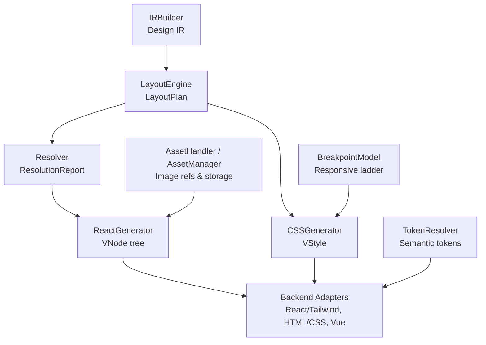
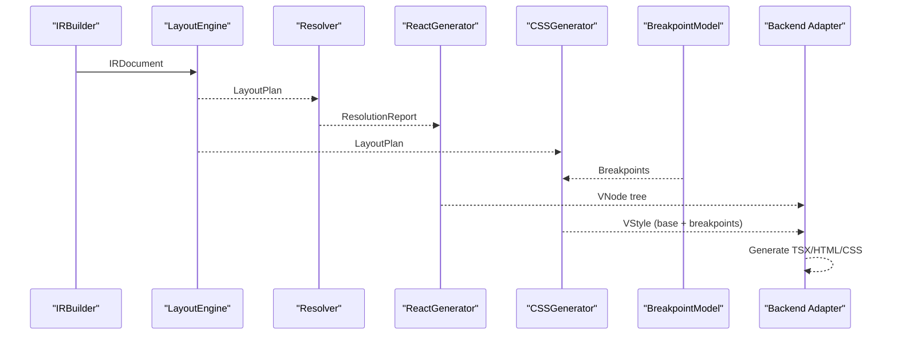
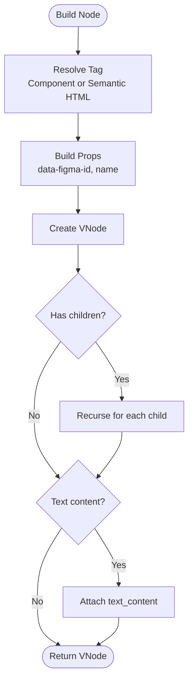
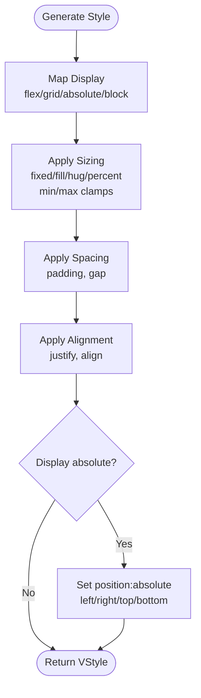
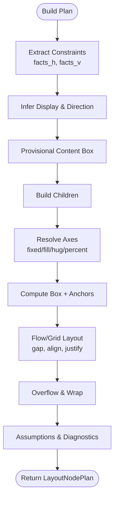
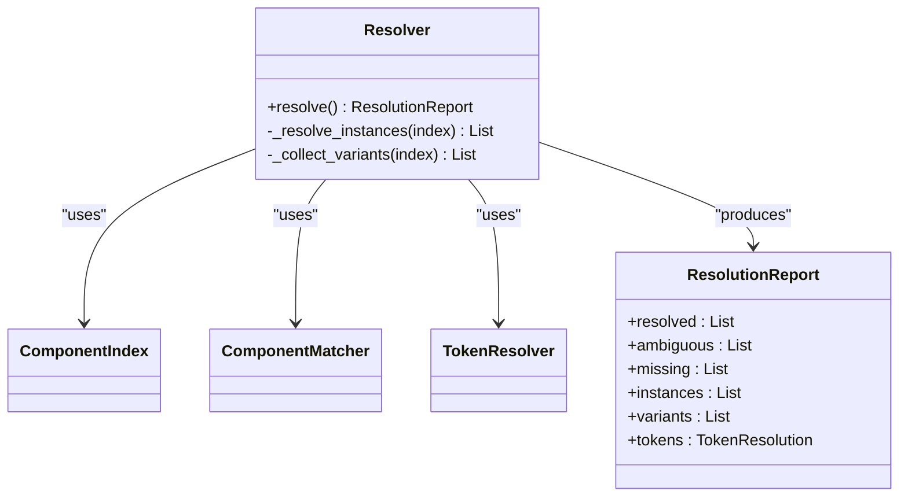
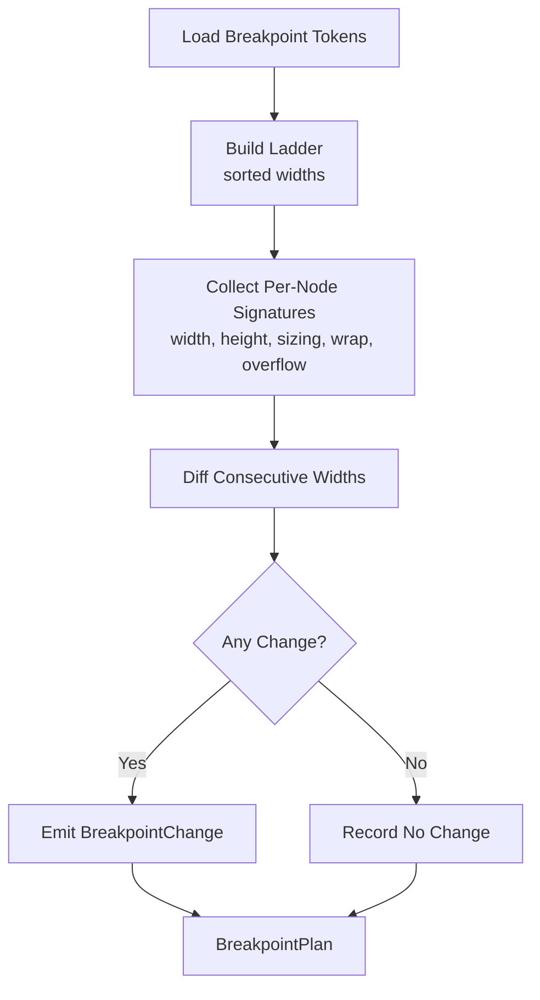
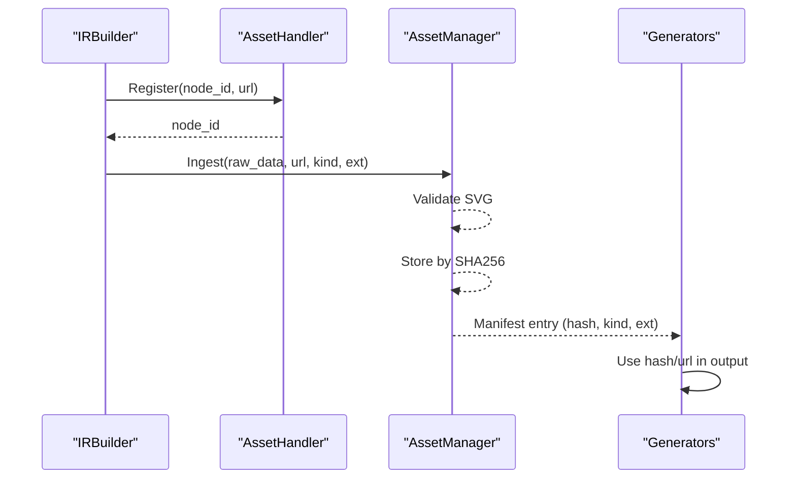
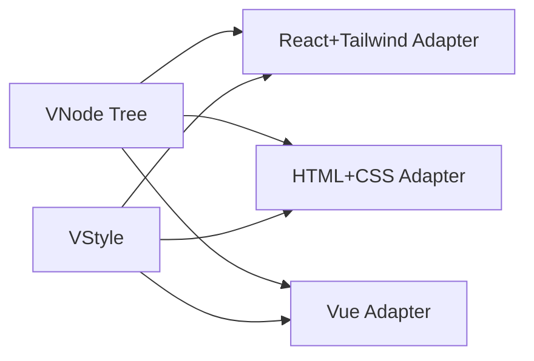
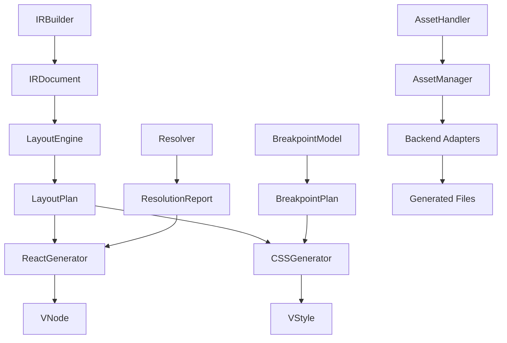

# Code Generation System

<cite>
**Referenced Files in This Document**
- [react_generator.py](file://plugin/figmaforge/core/react_generator.py)
- [css_generator.py](file://plugin/figmaforge/core/css_generator.py)
- [layout_engine.py](file://plugin/figmaforge/core/layout_engine.py)
- [ir_builder.py](file://plugin/figmaforge/core/ir_builder.py)
- [generator_types.py](file://plugin/figmaforge/core/generator_types.py)
- [layout_types.py](file://plugin/figmaforge/core/layout_types.py)
- [resolver.py](file://plugin/figmaforge/core/resolver.py)
- [breakpoint_model.py](file://plugin/figmaforge/core/breakpoint_model.py)
- [token_resolver.py](file://plugin/figmaforge/core/token_resolver.py)
- [asset_handler.py](file://plugin/figmaforge/core/asset_handler.py)
- [asset_manager.py](file://plugin/figmaforge/core/asset_manager.py)
- [library_types.py](file://plugin/figmaforge/core/library_types.py)
- [react_tailwind_backend.py](file://plugin/figmaforge/backends/react_tailwind/__init__.py)
- [html_css_backend.py](file://plugin/figmaforge/backends/html_css/__init__.py)
</cite>

## Table of Contents
1. Introduction
2. Project Structure
3. Core Components
4. Architecture Overview
5. Detailed Component Analysis
6. Dependency Analysis
7. Performance Considerations
8. Troubleshooting Guide
9. Conclusion
10. Appendices

## Introduction
This document explains FigmaForge’s code generation system that transforms a Design IR, a LayoutPlan, and a ResolutionReport into production-quality React components and CSS styles. It covers the VNode tree construction process, semantic tag mapping, component integration patterns, props and styling approaches, asset handling for images and media, modular CSS generation with breakpoint handling, naming conventions, specificity management, style adapter support (CSS Modules, Tailwind, SCSS), and the asset processing pipeline including image optimization, reference resolution, and fallback strategies. The system intentionally avoids framework dependencies in its core and avoids absolute positioning as the primary layout strategy.

## Project Structure
FigmaForge separates concerns across ingestion, normalization, layout inference, resolution, and code generation:
- Ingestion and normalization produce a framework-neutral Design IR.
- The layout engine infers a LayoutPlan per viewport using constraint solving and flow/grid/absolute classification.
- The resolver maps Figma components/instances to project library components and resolves tokens.
- Generators convert LayoutPlan + ResolutionReport into a framework-neutral VNode/VStyle model.
- Backend adapters render final files (React+Tailwind, HTML+CSS, Vue, etc.).

**Diagram sources**
- [ir_builder.py:156-207](file://plugin/figmaforge/core/ir_builder.py#L156-L207)
- [layout_engine.py:251-390](file://plugin/figmaforge/core/layout_engine.py#L251-L390)
- [resolver.py:80-109](file://plugin/figmaforge/core/resolver.py#L80-L109)
- [react_generator.py:32-121](file://plugin/figmaforge/core/react_generator.py#L32-L121)
- [css_generator.py:23-87](file://plugin/figmaforge/core/css_generator.py#L23-L87)
- [asset_handler.py:29-59](file://plugin/figmaforge/core/asset_handler.py#L29-L59)
- [asset_manager.py:15-58](file://plugin/figmaforge/core/asset_manager.py#L15-L58)
- [breakpoint_model.py:36-114](file://plugin/figmaforge/core/breakpoint_model.py#L36-L114)
- [token_resolver.py:124-146](file://plugin/figmaforge/core/token_resolver.py#L124-L146)
- [react_tailwind_backend.py:69-104](file://plugin/figmaforge/backends/react_tailwind/__init__.py#L69-L104)
- [html_css_backend.py:309-346](file://plugin/figmaforge/backends/html_css/__init__.py#L309-L346)

**Section sources**
- [ir_builder.py:156-207](file://plugin/figmaforge/core/ir_builder.py#L156-L207)
- [layout_engine.py:251-390](file://plugin/figmaforge/core/layout_engine.py#L251-L390)
- [resolver.py:80-109](file://plugin/figmaforge/core/resolver.py#L80-L109)
- [react_generator.py:32-121](file://plugin/figmaforge/core/react_generator.py#L32-L121)
- [css_generator.py:23-87](file://plugin/figmaforge/core/css_generator.py#L23-L87)
- [asset_handler.py:29-59](file://plugin/figmaforge/core/asset_handler.py#L29-L59)
- [asset_manager.py:15-58](file://plugin/figmaforge/core/asset_manager.py#L15-L58)
- [breakpoint_model.py:36-114](file://plugin/figmaforge/core/breakpoint_model.py#L36-L114)
- [token_resolver.py:124-146](file://plugin/figmaforge/core/token_resolver.py#L124-L146)
- [react_tailwind_backend.py:69-104](file://plugin/figmaforge/backends/react_tailwind/__init__.py#L69-L104)
- [html_css_backend.py:309-346](file://plugin/figmaforge/backends/html_css/__init__.py#L309-L346)

## Core Components
- Design IR builder: Normalizes Figma API responses into a typed, framework-neutral IR document with nodes, assets, tokens, and prototypes.
- Layout engine: Infers display mode (flex/grid/absolute), sizing per axis (fixed/fill/hug/percent), spacing, alignment, anchoring, overflow, and text wrapping; produces a LayoutPlan tree.
- Resolver: Matches Figma components/instances to project library components, extracts variants, and resolves semantic tokens.
- VNode/VStyle model: Framework-neutral intermediate representation for code emission.
- CSS generator: Converts LayoutPlan constraints into VStyle dictionaries (base and breakpoints).
- Breakpoint model: Builds a numeric breakpoint ladder from library tokens and infers responsive changes by comparing measured signatures across widths.
- Token resolver: Produces semantic tokens (color, typography, spacing, radius, shadow, opacity, breakpoint) and node-level token references.
- Asset handler/manager: Tracks Figma asset URLs, validates and stores content-addressed assets, and maintains a manifest.
- Backend adapters: Render VNode/VStyle into concrete outputs (React+Tailwind TSX, HTML+CSS, Vue SFC).

**Section sources**
- [ir_builder.py:156-207](file://plugin/figmaforge/core/ir_builder.py#L156-L207)
- [layout_engine.py:251-390](file://plugin/figmaforge/core/layout_engine.py#L251-L390)
- [resolver.py:80-109](file://plugin/figmaforge/core/resolver.py#L80-L109)
- [generator_types.py:15-72](file://plugin/figmaforge/core/generator_types.py#L15-L72)
- [css_generator.py:23-87](file://plugin/figmaforge/core/css_generator.py#L23-L87)
- [breakpoint_model.py:36-114](file://plugin/figmaforge/core/breakpoint_model.py#L36-L114)
- [token_resolver.py:124-146](file://plugin/figmaforge/core/token_resolver.py#L124-L146)
- [asset_handler.py:29-59](file://plugin/figmaforge/core/asset_handler.py#L29-L59)
- [asset_manager.py:15-58](file://plugin/figmaforge/core/asset_manager.py#L15-L58)
- [react_tailwind_backend.py:69-104](file://plugin/figmaforge/backends/react_tailwind/__init__.py#L69-L104)
- [html_css_backend.py:309-346](file://plugin/figmaforge/backends/html_css/__init__.py#L309-L346)

## Architecture Overview
The pipeline is layered and deterministic:
- IRBuilder converts raw Figma data into a normalized IRDocument.
- LayoutEngine analyzes each page at a given viewport to produce a LayoutNodePlan tree.
- Resolver matches components/instances and resolves tokens against the project library.
- ReactGenerator builds a VNode tree; CSSGenerator builds a VStyle tree.
- BreakpointModel infers responsive changes from measured differences across widths.
- Backend adapters consume VNode/VStyle to emit framework-specific files.

**Diagram sources**
- [ir_builder.py:156-207](file://plugin/figmaforge/core/ir_builder.py#L156-L207)
- [layout_engine.py:251-390](file://plugin/figmaforge/core/layout_engine.py#L251-L390)
- [resolver.py:80-109](file://plugin/figmaforge/core/resolver.py#L80-L109)
- [react_generator.py:32-121](file://plugin/figmaforge/core/react_generator.py#L32-L121)
- [css_generator.py:23-87](file://plugin/figmaforge/core/css_generator.py#L23-L87)
- [breakpoint_model.py:36-114](file://plugin/figmaforge/core/breakpoint_model.py#L36-L114)
- [react_tailwind_backend.py:69-104](file://plugin/figmaforge/backends/react_tailwind/__init__.py#L69-L104)

## Detailed Component Analysis

### VNode Tree Construction (ReactGenerator)
- Purpose: Convert a fully-resolved LayoutPlan into a hierarchical VNode tree representing the component structure.
- Semantic tag mapping: Text nodes map to span; containers with flex/grid layouts map to semantic tags based on name (header, nav, section, main, aside, footer); unknown containers fall back to div.
- Component integration: If a ResolutionReport is provided, nodes resolved to project components are emitted with is_component=True and the component name as the tag, enabling component reuse instead of inline markup.
- Props: Includes data-figma-id for traceability and name when present; children are recursively built; text content is attached for text nodes.

**Diagram sources**
- [react_generator.py:58-91](file://plugin/figmaforge/core/react_generator.py#L58-L91)
- [react_generator.py:93-121](file://plugin/figmaforge/core/react_generator.py#L93-L121)

**Section sources**
- [react_generator.py:32-121](file://plugin/figmaforge/core/react_generator.py#L32-L121)
- [generator_types.py:27-58](file://plugin/figmaforge/core/generator_types.py#L27-L58)

### CSS Generation (CSSGenerator)
- Purpose: Convert LayoutPlan constraints, sizing, spacing, and alignment into abstract VStyle dictionaries suitable for any backend adapter.
- Display mapping: Flex, grid, absolute, block; absolute positioning only used where the solver requires it.
- Sizing modes: Fixed, fill, hug, percent; min/max clamps applied; fill uses flex grow/shrink in flex contexts or width/height 100% otherwise.
- Spacing and alignment: Padding per edge, gap for flex/grid; justify/align mapped to standard CSS values.
- Absolute positioning: Only when display is absolute; anchors translate to left/right/top/bottom offsets relative to parent content box.

**Diagram sources**
- [css_generator.py:23-87](file://plugin/figmaforge/core/css_generator.py#L23-L87)
- [css_generator.py:91-159](file://plugin/figmaforge/core/css_generator.py#L91-L159)

**Section sources**
- [css_generator.py:23-87](file://plugin/figmaforge/core/css_generator.py#L23-L87)
- [css_generator.py:91-159](file://plugin/figmaforge/core/css_generator.py#L91-L159)
- [layout_types.py:36-75](file://plugin/figmaforge/core/layout_types.py#L36-L75)

### Layout Engine (LayoutEngine)
- Purpose: Infer layout semantics from the Design IR and produce a LayoutPlan tree per viewport.
- Key behaviors:
  - Prefers semantic layout (flex/grid) and uses absolute positioning only when required by IR constraints.
  - Resolves axes in order: cheap non-hug axes first, then children, then hug axes from content extents.
  - Handles text measurement heuristics, marking approximate measurements.
  - Computes anchors for absolute nodes relative to parent content boxes.
  - Lays out children in flow or grid with gap and alignment.
  - Records diagnostics, assumptions, and confidence metrics.

**Diagram sources**
- [layout_engine.py:274-390](file://plugin/figmaforge/core/layout_engine.py#L274-L390)
- [layout_engine.py:393-448](file://plugin/figmaforge/core/layout_engine.py#L393-L448)
- [layout_engine.py:465-570](file://plugin/figmaforge/core/layout_engine.py#L465-L570)
- [layout_engine.py:652-708](file://plugin/figmaforge/core/layout_engine.py#L652-L708)
- [layout_engine.py:736-800](file://plugin/figmaforge/core/layout_engine.py#L736-L800)

**Section sources**
- [layout_engine.py:251-390](file://plugin/figmaforge/core/layout_engine.py#L251-L390)
- [layout_engine.py:393-448](file://plugin/figmaforge/core/layout_engine.py#L393-L448)
- [layout_engine.py:465-570](file://plugin/figmaforge/core/layout_engine.py#L465-L570)
- [layout_engine.py:652-708](file://plugin/figmaforge/core/layout_engine.py#L652-L708)
- [layout_engine.py:736-800](file://plugin/figmaforge/core/layout_engine.py#L736-L800)

### Resolution and Component Integration (Resolver)
- Purpose: Match Figma components/instances to project library components, extract variants, and resolve semantic tokens.
- Outputs:
  - Resolved, ambiguous, missing matches.
  - Instance resolution details (status, resolved name/kind, variant properties).
  - Variant sets and defaults.
  - Token resolution results (semantic tokens and node-level references).
- Integration with generators: ReactGenerator uses the report to emit component tags for matched instances rather than generic HTML.

**Diagram sources**
- [resolver.py:80-109](file://plugin/figmaforge/core/resolver.py#L80-L109)
- [resolver.py:112-154](file://plugin/figmaforge/core/resolver.py#L112-L154)
- [token_resolver.py:124-146](file://plugin/figmaforge/core/token_resolver.py#L124-L146)

**Section sources**
- [resolver.py:80-109](file://plugin/figmaforge/core/resolver.py#L80-L109)
- [resolver.py:112-154](file://plugin/figmaforge/core/resolver.py#L112-L154)
- [token_resolver.py:124-146](file://plugin/figmaforge/core/token_resolver.py#L124-L146)

### Responsive Breakpoints (BreakpointModel)
- Purpose: Build a numeric breakpoint ladder from project library tokens (with documented defaults) and infer per-node responsive changes only from measured evidence.
- Behavior:
  - Reads breakpoint tokens and maps aliases (sm/md/lg/xl).
  - Compares per-node signatures across consecutive widths to detect changes in size, sizing mode, wrap, text lines, overflow.
  - Emits BreakpointChange entries and records nodes with no change.

**Diagram sources**
- [breakpoint_model.py:36-114](file://plugin/figmaforge/core/breakpoint_model.py#L36-L114)
- [breakpoint_model.py:117-171](file://plugin/figmaforge/core/breakpoint_model.py#L117-L171)

**Section sources**
- [breakpoint_model.py:36-114](file://plugin/figmaforge/core/breakpoint_model.py#L36-L114)
- [breakpoint_model.py:117-171](file://plugin/figmaforge/core/breakpoint_model.py#L117-L171)

### Asset Processing Pipeline
- AssetHandler: Tracks Figma image/URL references per node_id; supports registration, URL retrieval, download marking, and pending listing.
- AssetManager: Ingests raw bytes, validates SVG content, stores assets via content-addressed hashing (SHA256), and persists a manifest mapping hashes to metadata.
- IRBuilder: Attaches asset references to IR nodes when available from images mapping or paint image_ref.

**Diagram sources**
- [ir_builder.py:539-548](file://plugin/figmaforge/core/ir_builder.py#L539-L548)
- [asset_handler.py:29-59](file://plugin/figmaforge/core/asset_handler.py#L29-L59)
- [asset_manager.py:15-58](file://plugin/figmaforge/core/asset_manager.py#L15-L58)

**Section sources**
- [ir_builder.py:539-548](file://plugin/figmaforge/core/ir_builder.py#L539-L548)
- [asset_handler.py:29-59](file://plugin/figmaforge/core/asset_handler.py#L29-L59)
- [asset_manager.py:15-58](file://plugin/figmaforge/core/asset_manager.py#L15-L58)

### Backend Adapters and Styling Approaches
- React + Tailwind adapter:
  - Generates React functional components (TSX) styled with Tailwind utility classes.
  - Declares supported/partial/unsupported features and emits a Tailwind config extension placeholder for design tokens.
- HTML + CSS adapter:
  - Renders VNode trees to HTML with scoped class names derived from node IDs.
  - Emits CSS rules for base styles and @media blocks for breakpoint overrides.
- Vue adapter:
  - Generates Vue single-file components with scoped styles and design tokens mapped to CSS custom properties.

**Diagram sources**
- [react_tailwind_backend.py:69-104](file://plugin/figmaforge/backends/react_tailwind/__init__.py#L69-L104)
- [html_css_backend.py:309-346](file://plugin/figmaforge/backends/html_css/__init__.py#L309-L346)
- [vue/__init__.py:62-102](file://plugin/figmaforge/backends/vue/__init__.py#L62-L102)

**Section sources**
- [react_tailwind_backend.py:69-104](file://plugin/figmaforge/backends/react_tailwind/__init__.py#L69-L104)
- [html_css_backend.py:309-346](file://plugin/figmaforge/backends/html_css/__init__.py#L309-L346)
- [vue/__init__.py:62-102](file://plugin/figmaforge/backends/vue/__init__.py#L62-L102)

## Dependency Analysis
Key dependency relationships:
- IRBuilder depends on figma_types and ir_types to construct IRDocument.
- LayoutEngine depends on constraint_model and layout_types to compute LayoutPlan.
- Resolver depends on ComponentIndex, ComponentMatcher, and TokenResolver to produce ResolutionReport.
- ReactGenerator consumes LayoutPlan and optional ResolutionReport to build VNode trees.
- CSSGenerator consumes LayoutPlan to build VStyle dictionaries.
- BreakpointModel consumes LayoutPlan signatures to infer responsive changes.
- AssetHandler/AssetManager manage asset references and storage consumed by generators/adapters.
- Backend adapters depend on protocol types and core models to generate final files.

**Diagram sources**
- [ir_builder.py:156-207](file://plugin/figmaforge/core/ir_builder.py#L156-L207)
- [layout_engine.py:251-390](file://plugin/figmaforge/core/layout_engine.py#L251-L390)
- [resolver.py:80-109](file://plugin/figmaforge/core/resolver.py#L80-L109)
- [react_generator.py:32-121](file://plugin/figmaforge/core/react_generator.py#L32-L121)
- [css_generator.py:23-87](file://plugin/figmaforge/core/css_generator.py#L23-L87)
- [breakpoint_model.py:36-114](file://plugin/figmaforge/core/breakpoint_model.py#L36-L114)
- [asset_handler.py:29-59](file://plugin/figmaforge/core/asset_handler.py#L29-L59)
- [asset_manager.py:15-58](file://plugin/figmaforge/core/asset_manager.py#L15-L58)

**Section sources**
- [ir_builder.py:156-207](file://plugin/figmaforge/core/ir_builder.py#L156-L207)
- [layout_engine.py:251-390](file://plugin/figmaforge/core/layout_engine.py#L251-L390)
- [resolver.py:80-109](file://plugin/figmaforge/core/resolver.py#L80-L109)
- [react_generator.py:32-121](file://plugin/figmaforge/core/react_generator.py#L32-L121)
- [css_generator.py:23-87](file://plugin/figmaforge/core/css_generator.py#L23-L87)
- [breakpoint_model.py:36-114](file://plugin/figmaforge/core/breakpoint_model.py#L36-L114)
- [asset_handler.py:29-59](file://plugin/figmaforge/core/asset_handler.py#L29-L59)
- [asset_manager.py:15-58](file://plugin/figmaforge/core/asset_manager.py#L15-L58)

## Performance Considerations
- Deterministic and stdlib-only core modules avoid heavy dependencies, improving reproducibility and performance.
- Layout engine computes provisional content boxes early to minimize reflows and ensures hug axes are resolved after children exist.
- Text measurement uses heuristics marked approximate; this avoids expensive font metric lookups while providing reasonable estimates.
- Content-addressed asset storage deduplicates identical assets via SHA256 hashing, reducing storage and network usage.
- Breakpoint inference diffs compact signatures across widths, avoiding unnecessary recomputation and focusing on actual changes.

[No sources needed since this section provides general guidance]

## Troubleshooting Guide
Common issues and diagnostics:
- Underdetermined sizing: When an axis cannot be resolved (e.g., hug with no measurable content or unresolved parent), the layout engine records warnings and assumptions.
- Absolute without anchors: Nodes positioned absolutely without anchors are flagged; ensure anchors are defined or rely on flow/grid layouts.
- Scale anchor approximation: Scale anchors may be approximated as minimum sizes; review assumptions and adjust constraints if needed.
- Fill or percent in hug container: Percent/fill inside hug containers can be underdetermined; consider explicit sizing or container adjustments.
- Grid hug approximation: Grid hug sizing is approximated; verify visual fidelity and adjust column counts or gaps.
- Unsupported tokens: Token resolver reports unsupported variable/style types explicitly; update library mappings or remove unsupported bindings.
- Unsafe SVG: Asset manager rejects SVGs containing dangerous patterns; sanitize or replace unsafe assets.

**Section sources**
- [layout_engine.py:353-370](file://plugin/figmaforge/core/layout_engine.py#L353-L370)
- [layout_engine.py:94-99](file://plugin/figmaforge/core/layout_engine.py#L94-L99)
- [token_resolver.py:149-163](file://plugin/figmaforge/core/token_resolver.py#L149-L163)
- [asset_manager.py:60-81](file://plugin/figmaforge/core/asset_manager.py#L60-L81)

## Conclusion
FigmaForge’s code generation system cleanly separates concerns: normalization to IR, layout inference to LayoutPlan, component/token resolution to ResolutionReport, and framework-neutral generation to VNode/VStyle. Backend adapters render these intermediates into production-ready React components and CSS styles while maintaining separation between generated and handwritten code. The system avoids absolute positioning as the primary layout strategy, prefers semantic HTML tags, and supports multiple styling systems through adapters. Assets are handled deterministically with content-addressed storage and validation, ensuring reliability and maintainability.

[No sources needed since this section summarizes without analyzing specific files]

## Appendices

### Naming Conventions and Specificity Management
- VNode tags: Semantic HTML tags for containers when possible; component names for resolved instances.
- Class naming in HTML+CSS backend: Scoped class names derived from node IDs (e.g., n-{node-id}) to limit scope and reduce specificity conflicts.
- Breakpoint classes/rules: Emitted as @media blocks with max-width queries for responsive overrides.
- Tailwind: Utility classes compose styles; design tokens extend the Tailwind theme configuration.

**Section sources**
- [html_css_backend.py:318-338](file://plugin/figmaforge/backends/html_css/__init__.py#L318-L338)
- [react_tailwind_backend.py:162-184](file://plugin/figmaforge/backends/react_tailwind/__init__.py#L162-L184)

### Example Outputs (Paths to Implementations)
- Generated React components (TSX): See backend adapter generation logic.
- Generated CSS rules and @media blocks: See HTML+CSS adapter rendering.
- VNode/VStyle structures: See generator types and generator implementations.

**Section sources**
- [react_tailwind_backend.py:97-159](file://plugin/figmaforge/backends/react_tailwind/__init__.py#L97-L159)
- [html_css_backend.py:309-346](file://plugin/figmaforge/backends/html_css/__init__.py#L309-L346)
- [generator_types.py:15-72](file://plugin/figmaforge/core/generator_types.py#L15-L72)