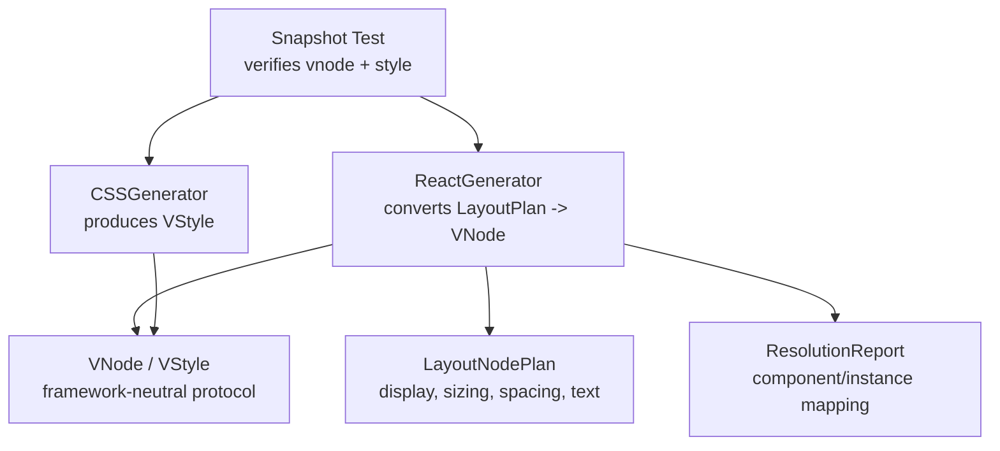
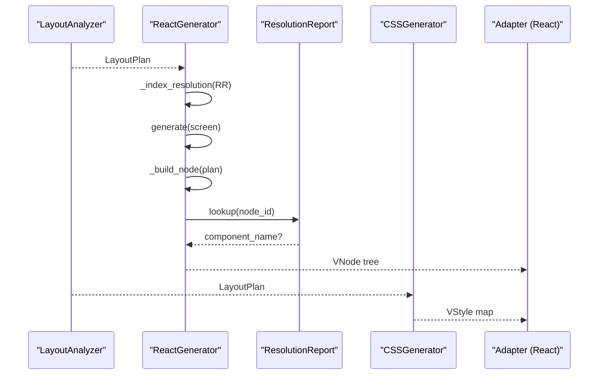
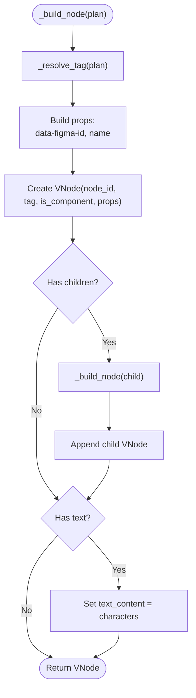
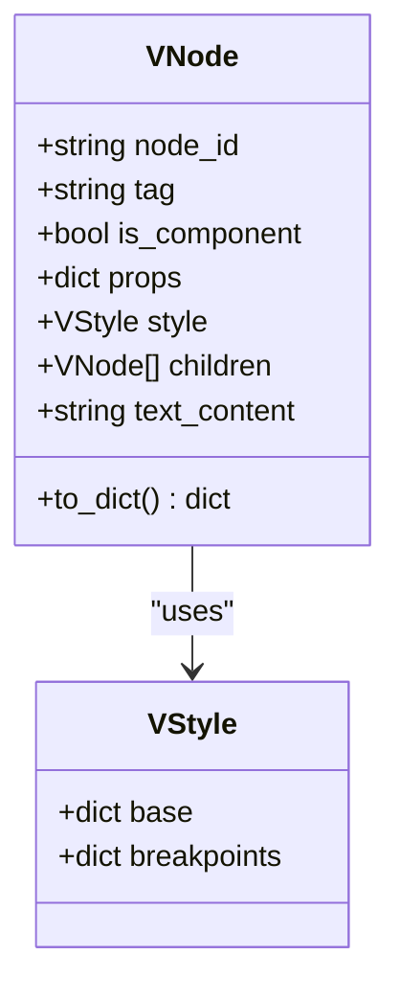
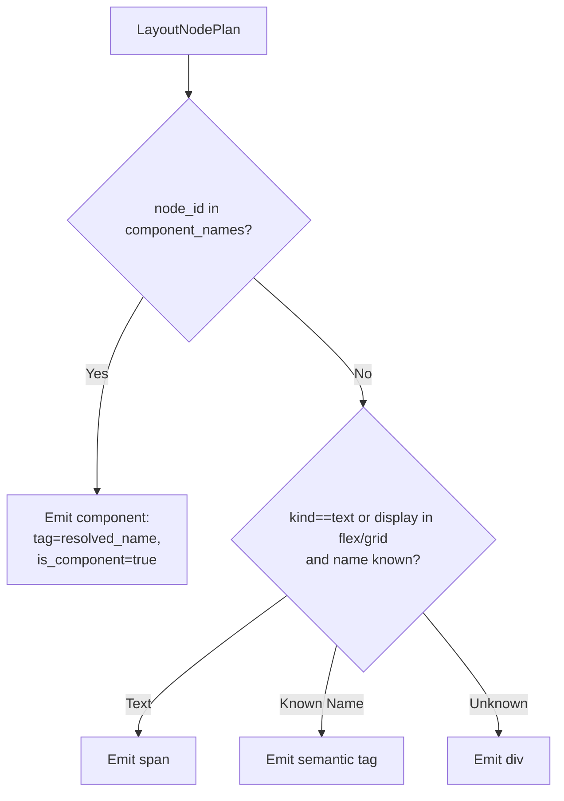
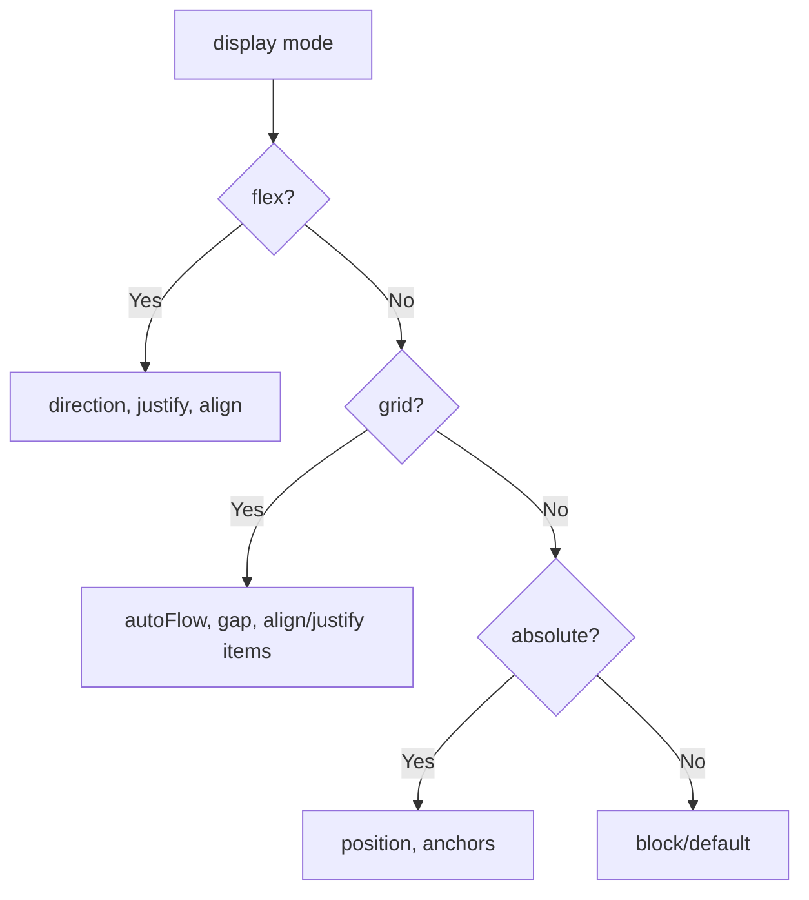
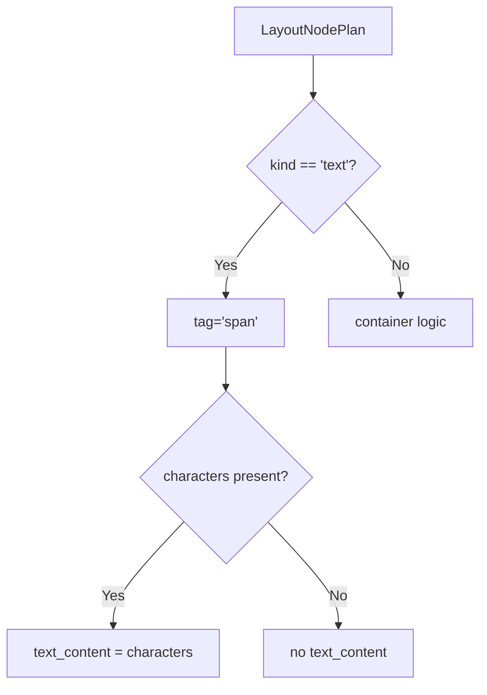
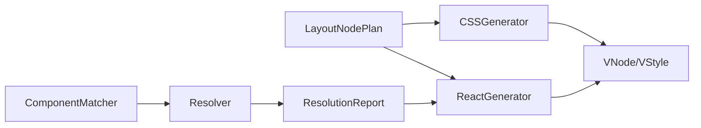

# React Component Generator

<cite>
**Referenced Files in This Document**
- [react_generator.py](file://plugin/figmaforge/core/react_generator.py)
- [generator_types.py](file://plugin/figmaforge/core/generator_types.py)
- [layout_types.py](file://plugin/figmaforge/core/layout_types.py)
- [resolver.py](file://plugin/figmaforge/core/resolver.py)
- [css_generator.py](file://plugin/figmaforge/core/css_generator.py)
- [matcher.py](file://plugin/figmaforge/core/matcher.py)
- [test_generator_snapshot.py](file://plugin/figmaforge/tests/test_generator_snapshot.py)
- [desktop-gen.json](file://plugin/figmaforge/tests/snapshots/generator/desktop-gen.json)
- [layout-plan.json](file://plugin/figmaforge/tests/snapshots/layout-plan.json)
- [resolution-report.json](file://plugin/figmaforge/tests/snapshots/resolution-report.json)
</cite>

## Table of Contents
1. [Introduction](#introduction)
2. [Project Structure](#project-structure)
3. [Core Components](#core-components)
4. [Architecture Overview](#architecture-overview)
5. [Detailed Component Analysis](#detailed-component-analysis)
6. [Dependency Analysis](#dependency-analysis)
7. [Performance Considerations](#performance-considerations)
8. [Troubleshooting Guide](#troubleshooting-guide)
9. [Conclusion](#conclusion)
10. [Appendices](#appendices)

## Introduction
This document explains the React component generator that converts a fully resolved LayoutPlan into a framework-neutral VNode tree and integrates with a resolution report to emit semantic React components. It covers:
- Recursive traversal of LayoutPlan structures
- Semantic HTML tag mapping via a name-based dictionary
- Component integration through ResolutionReport lookups
- Props generation including debug attributes and names
- Text content handling
- The VNode protocol definition
- Handling of different layout types (flex, grid, absolute positioning)
- Framework neutrality and production-ready output patterns

## Project Structure
The generator lives in the core module alongside type definitions for the VNode protocol and layout plan models. Tests validate deterministic output against golden snapshots.

**Diagram sources**
- [react_generator.py:32-121](file://plugin/figmaforge/core/react_generator.py#L32-L121)
- [generator_types.py:15-72](file://plugin/figmaforge/core/generator_types.py#L15-L72)
- [layout_types.py:412-477](file://plugin/figmaforge/core/layout_types.py#L412-L477)
- [resolver.py:34-77](file://plugin/figmaforge/core/resolver.py#L34-L77)
- [css_generator.py:23-87](file://plugin/figmaforge/core/css_generator.py#L23-L87)
- [test_generator_snapshot.py:36-51](file://plugin/figmaforge/tests/test_generator_snapshot.py#L36-L51)

**Section sources**
- [react_generator.py:1-121](file://plugin/figmaforge/core/react_generator.py#L1-L121)
- [generator_types.py:1-72](file://plugin/figmaforge/core/generator_types.py#L1-L72)
- [layout_types.py:1-540](file://plugin/figmaforge/core/layout_types.py#L1-L540)
- [resolver.py:1-161](file://plugin/figmaforge/core/resolver.py#L1-L161)
- [css_generator.py:1-159](file://plugin/figmaforge/core/css_generator.py#L1-L159)
- [test_generator_snapshot.py:1-110](file://plugin/figmaforge/tests/test_generator_snapshot.py#L1-L110)

## Core Components
- ReactGenerator: Orchestrates conversion from LayoutPlan to VNode trees, resolves tags/components, builds props, and attaches children/text.
- VNode/VStyle: Framework-neutral protocol describing nodes, styles, and breakpoints; consumed by downstream adapters to produce React code and CSS.
- LayoutNodePlan: Describes display modes (flex/grid/absolute), sizing, spacing, alignment, anchors, overflow, and text content.
- ResolutionReport: Provides mappings from Figma node IDs to project component names and instance resolutions used to emit component nodes.
- CSSGenerator: Produces VStyle dictionaries from LayoutPlan constraints, sizing, spacing, and alignment.

Key behaviors:
- Semantic tag mapping uses a dictionary keyed by normalized container names to map to semantic HTML elements.
- When a ResolutionReport is provided, nodes mapped to project components are emitted as component nodes rather than plain HTML tags.
- Debug attributes include data-figma-id on every node and name when available.
- Text nodes render as span with text_content populated from the layout plan’s text model.

**Section sources**
- [react_generator.py:16-29](file://plugin/figmaforge/core/react_generator.py#L16-L29)
- [react_generator.py:32-121](file://plugin/figmaforge/core/react_generator.py#L32-L121)
- [generator_types.py:15-72](file://plugin/figmaforge/core/generator_types.py#L15-L72)
- [layout_types.py:412-477](file://plugin/figmaforge/core/layout_types.py#L412-L477)
- [resolver.py:34-77](file://plugin/figmaforge/core/resolver.py#L34-L77)
- [css_generator.py:23-87](file://plugin/figmaforge/core/css_generator.py#L23-L87)

## Architecture Overview
The generator sits between the layout analysis stage and the code emission stage. It consumes a LayoutPlan and optionally a ResolutionReport to build a VNode tree. A separate CSS generator produces VStyle maps for styling. Together they form a framework-neutral intermediate representation that can be adapted to React or other targets.

**Diagram sources**
- [react_generator.py:35-60](file://plugin/figmaforge/core/react_generator.py#L35-L60)
- [react_generator.py:62-91](file://plugin/figmaforge/core/react_generator.py#L62-L91)
- [react_generator.py:93-121](file://plugin/figmaforge/core/react_generator.py#L93-L121)
- [resolver.py:80-109](file://plugin/figmaforge/core/resolver.py#L80-L109)
- [css_generator.py:26-87](file://plugin/figmaforge/core/css_generator.py#L26-L87)

## Detailed Component Analysis

### ReactGenerator: Recursive VNode Construction
- Entry point generate() delegates to _build_node(), which recursively processes each LayoutNodePlan.
- Tag resolution prioritizes component mapping from ResolutionReport; otherwise falls back to semantic tag mapping based on container name or defaults to div.
- Props include data-figma-id for debugging and name when present.
- Children are built recursively; text nodes set text_content from the plan’s text model.

**Diagram sources**
- [react_generator.py:62-91](file://plugin/figmaforge/core/react_generator.py#L62-L91)
- [react_generator.py:93-121](file://plugin/figmaforge/core/react_generator.py#L93-L121)

**Section sources**
- [react_generator.py:32-121](file://plugin/figmaforge/core/react_generator.py#L32-L121)

### VNode Protocol Definition
- VNode fields:
  - node_id: unique identifier for tracing back to Figma
  - tag: HTML tag or component name
  - is_component: true when tag references a React component
  - props: key-value pairs including data-figma-id and name
  - style: VStyle object with base and breakpoint-specific styles
  - children: array of VNode
  - text_content: string for text nodes
- Serialization ensures deterministic snapshotting by omitting empty fields and preserving booleans/integers/floats.

**Diagram sources**
- [generator_types.py:15-72](file://plugin/figmaforge/core/generator_types.py#L15-L72)

**Section sources**
- [generator_types.py:1-72](file://plugin/figmaforge/core/generator_types.py#L1-L72)

### Semantic Tag Mapping and Component Integration
- Semantic tag mapping:
  - Uses a dictionary to map container names like header, nav, hero, main, section, card, aside, footer to semantic HTML tags.
  - Text nodes map to span.
  - Unknown containers default to div.
- Component integration:
  - If a ResolutionReport is provided, the generator indexes resolved components and instances.
  - Nodes whose node_id matches a resolved component or instance are emitted as components (is_component=true) with the resolved name as the tag.
  - Otherwise, semantic tag mapping applies.

**Diagram sources**
- [react_generator.py:46-57](file://plugin/figmaforge/core/react_generator.py#L46-L57)
- [react_generator.py:93-121](file://plugin/figmaforge/core/react_generator.py#L93-L121)

**Section sources**
- [react_generator.py:16-29](file://plugin/figmaforge/core/react_generator.py#L16-L29)
- [react_generator.py:46-57](file://plugin/figmaforge/core/react_generator.py#L46-L57)
- [react_generator.py:93-121](file://plugin/figmaforge/core/react_generator.py#L93-L121)
- [resolver.py:34-77](file://plugin/figmaforge/core/resolver.py#L34-L77)

### Layout Types Handling
- Flex layout:
  - Direction and alignment are captured in the layout plan; CSS generator maps these to flexDirection, justifyContent, alignItems.
- Grid layout:
  - Auto flow and gaps are handled; alignment maps to justifyItems and alignItems.
- Absolute positioning:
  - Positioning and anchors translate to position and top/left/right/bottom properties.
- Sizing modes:
  - Fixed, fill, hug, percent map to width/height/flex values and min/max clamps.

**Diagram sources**
- [css_generator.py:26-87](file://plugin/figmaforge/core/css_generator.py#L26-L87)
- [css_generator.py:91-150](file://plugin/figmaforge/core/css_generator.py#L91-L150)

**Section sources**
- [css_generator.py:23-159](file://plugin/figmaforge/core/css_generator.py#L23-L159)
- [layout_types.py:36-40](file://plugin/figmaforge/core/layout_types.py#L36-L40)
- [layout_types.py:120-156](file://plugin/figmaforge/core/layout_types.py#L120-L156)
- [layout_types.py:211-248](file://plugin/figmaforge/core/layout_types.py#L211-L248)

### Text Content Handling
- Text nodes have kind=text and carry a TextModel with characters, font size, measured dimensions, wrap behavior, and lines.
- The generator sets text_content on the corresponding VNode when characters exist.
- Snapshot tests verify text nodes render as span with correct text_content.

**Diagram sources**
- [react_generator.py:114-121](file://plugin/figmaforge/core/react_generator.py#L114-L121)
- [layout_types.py:251-273](file://plugin/figmaforge/core/layout_types.py#L251-L273)

**Section sources**
- [react_generator.py:87-91](file://plugin/figmaforge/core/react_generator.py#L87-L91)
- [layout_types.py:251-273](file://plugin/figmaforge/core/layout_types.py#L251-L273)
- [desktop-gen.json:10-32](file://plugin/figmaforge/tests/snapshots/generator/desktop-gen.json#L10-L32)

### Example Output Patterns
- Header/Footer semantic tags:
  - Containers named Header/Footer map to <header>/<footer>.
- Text nodes:
  - Rendered as  with text_content containing the characters.
- Debug attributes:
  - Every node includes data-figma-id; name is included when present.
- Component composition:
  - When ResolutionReport maps a node to a project component, the VNode emits is_component=true and uses the resolved name as the tag, enabling composition of existing React components.

Evidence from snapshots:
- Header/Footer semantic tags appear in the generated VNode tree.
- Text nodes show span tags with text_content.
- data-figma-id appears on all nodes; name appears on containers.

**Section sources**
- [desktop-gen.json:10-67](file://plugin/figmaforge/tests/snapshots/generator/desktop-gen.json#L10-L67)
- [test_generator_snapshot.py:83-95](file://plugin/figmaforge/tests/test_generator_snapshot.py#L83-L95)

## Dependency Analysis
- ReactGenerator depends on:
  - LayoutNodePlan for structure and semantics
  - ResolutionReport for component mapping
  - VNode/VStyle for output protocol
- CSSGenerator depends on:
  - LayoutNodePlan for constraints and sizing
  - VStyle for output protocol
- Matcher provides component matching logic used by Resolver to populate ResolutionReport.

**Diagram sources**
- [react_generator.py:12-14](file://plugin/figmaforge/core/react_generator.py#L12-L14)
- [css_generator.py:10-20](file://plugin/figmaforge/core/css_generator.py#L10-L20)
- [matcher.py:51-128](file://plugin/figmaforge/core/matcher.py#L51-L128)
- [resolver.py:80-109](file://plugin/figmaforge/core/resolver.py#L80-L109)

**Section sources**
- [matcher.py:1-128](file://plugin/figmaforge/core/matcher.py#L1-L128)
- [resolver.py:1-161](file://plugin/figmaforge/core/resolver.py#L1-L161)

## Performance Considerations
- The generator performs a single recursive pass over the LayoutPlan tree, making it O(N) in the number of nodes.
- ResolutionReport indexing is done once at initialization; subsequent tag resolution is O(1) per node using a hash map.
- CSS generation also traverses the tree once and computes style properties without heavy computation.
- Deterministic serialization avoids unnecessary recomputation and supports stable snapshots.

[No sources needed since this section provides general guidance]

## Troubleshooting Guide
Common issues and diagnostics:
- Underdetermined absolute nodes:
  - The layout plan may report underdetermined constraints for absolute positioning if no explicit box or anchors are provided. These warnings indicate placement cannot be solved reliably.
- Unsupported token types:
  - Token resolution may flag unsupported token kinds; these do not block generation but should be reviewed.
- Missing components:
  - If a Figma component does not match any project component, the matcher reports missing status; ensure library mappings or explicit overrides exist.
- Ambiguous matches:
  - Multiple project components match a Figma component; the resolver refuses to guess and reports ambiguity. Disambiguate by refining names or adding explicit figma_keys.

Debugging tips:
- Inspect the layout plan JSON for constraint issues and confidence metrics.
- Review the resolution report counts and lists for ambiguous/missing entries.
- Use snapshot tests to detect unintended changes in generated VNode trees.

**Section sources**
- [layout-plan.json:41-58](file://plugin/figmaforge/tests/snapshots/layout-plan.json#L41-L58)
- [layout-plan.json:571-597](file://plugin/figmaforge/tests/snapshots/layout-plan.json#L571-L597)
- [resolution-report.json:14-24](file://plugin/figmaforge/tests/snapshots/resolution-report.json#L14-L24)
- [resolution-report.json:43-50](file://plugin/figmaforge/tests/snapshots/resolution-report.json#L43-L50)
- [resolution-report.json:225-233](file://plugin/figmaforge/tests/snapshots/resolution-report.json#L225-L233)

## Conclusion
The React component generator transforms a framework-neutral LayoutPlan into a VNode tree with semantic tags, component integration, and debug attributes. It maintains separation between layout analysis and code emission, enabling production-ready React output while remaining adaptable to other frameworks. The combination of semantic tag mapping, resolution-driven component emission, and robust CSS generation ensures reliable, maintainable code generation pipelines.

[No sources needed since this section summarizes without analyzing specific files]

## Appendices

### Appendix A: VNode Field Reference
- node_id: string identifier for traceability
- tag: HTML tag or component name
- is_component: boolean indicating component usage
- props: dictionary including data-figma-id and name
- style: VStyle with base and breakpoint styles
- children: array of VNode
- text_content: string for text nodes

**Section sources**
- [generator_types.py:15-72](file://plugin/figmaforge/core/generator_types.py#L15-L72)

### Appendix B: Semantic Tag Dictionary
- header -> header
- nav -> nav
- hero -> section
- main -> main
- content -> main
- section -> section
- card -> section
- aside -> aside
- footer -> footer

**Section sources**
- [react_generator.py:16-29](file://plugin/figmaforge/core/react_generator.py#L16-L29)

### Appendix C: Generated Output Examples
- Header/Footer semantic tags confirmed in snapshot output.
- Text nodes rendered as span with text_content.
- data-figma-id present on all nodes; name present on containers.

**Section sources**
- [desktop-gen.json:10-67](file://plugin/figmaforge/tests/snapshots/generator/desktop-gen.json#L10-L67)
- [test_generator_snapshot.py:83-95](file://plugin/figmaforge/tests/test_generator_snapshot.py#L83-L95)