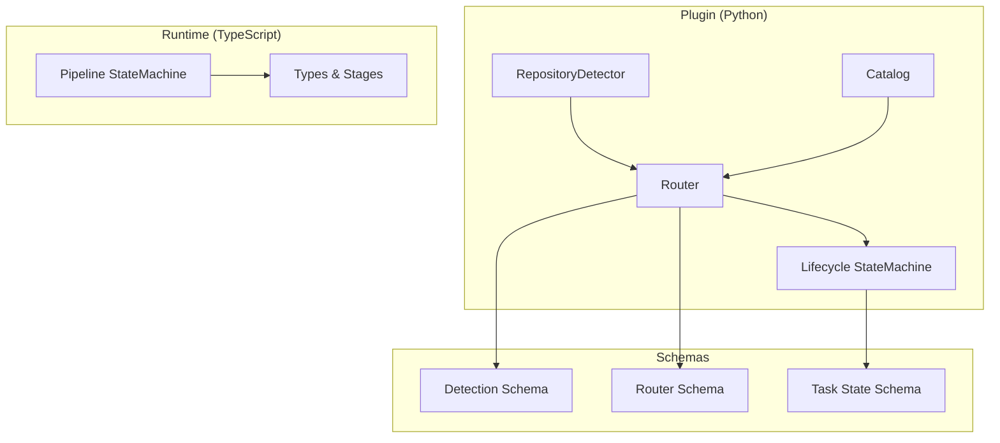
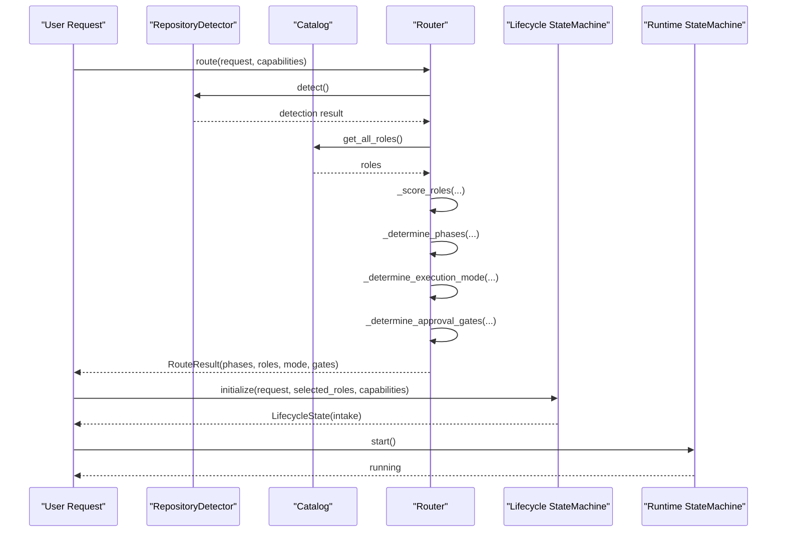
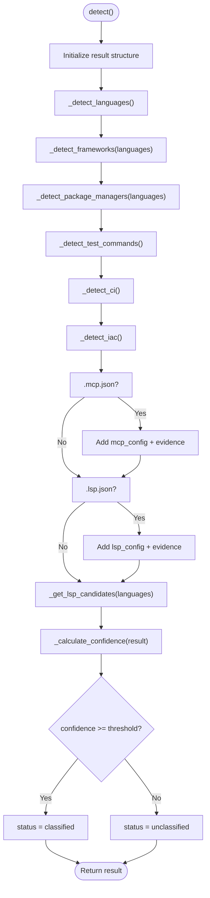
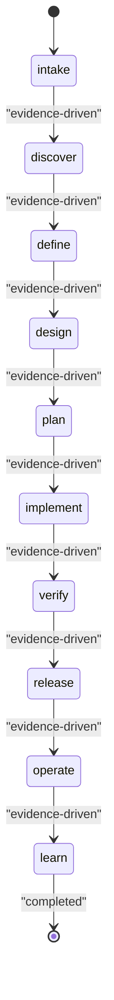
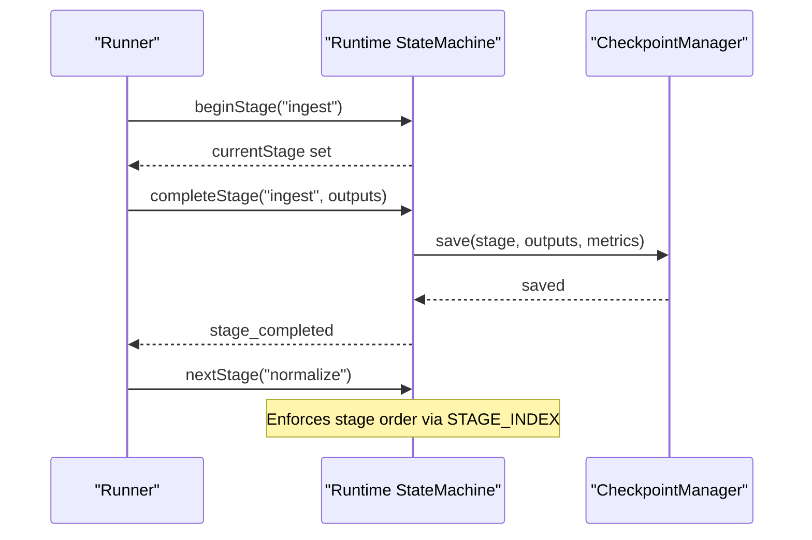
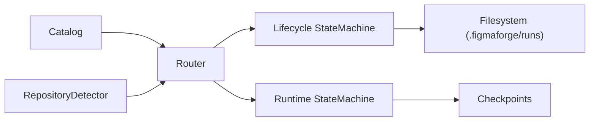

# Core Platform Components

<cite>
**Referenced Files in This Document**
- [detector.py](file://plugin/figmaforge/core/detector.py)
- [router.py](file://plugin/figmaforge/core/router.py)
- [catalog.py](file://plugin/figmaforge/core/catalog.py)
- [roles.json](file://plugin/figmaforge/catalog/roles.json)
- [state.py](file://plugin/figmaforge/core/state.py)
- [types.ts](file://runtime/src/core/types.ts)
- [state.ts](file://runtime/src/core/state.ts)
- [detection.schema.json](file://plugin/figmaforge/schemas/detection.schema.json)
- [router.schema.json](file://plugin/figmaforge/schemas/router.schema.json)
- [task-state.schema.json](file://plugin/figmaforge/schemas/task-state.schema.json)
- [test_detector.py](file://plugin/figmaforge/tests/test_detector.py)
- [test_router.py](file://plugin/figmaforge/tests/test_router.py)
- [test_state_machine.py](file://plugin/figmaforge/tests/test_state_machine.py)
</cite>

## Table of Contents
1. [Introduction](#introduction)
2. [Project Structure](#project-structure)
3. [Core Components](#core-components)
4. [Architecture Overview](#architecture-overview)
5. [Detailed Component Analysis](#detailed-component-analysis)
6. [Dependency Analysis](#dependency-analysis)
7. [Performance Considerations](#performance-considerations)
8. [Troubleshooting Guide](#troubleshooting-guide)
9. [Conclusion](#conclusion)

## Introduction
This document explains FigmaForge’s core platform components that make the system technology-agnostic and safety-first:
- Evidence-based repository detection that inspects manifests, lockfiles, source extensions, and configuration files to infer languages, frameworks, package managers, CI/IaC, and LSP availability.
- A deterministic role routing engine that scores roles from a 100-role catalog across 10 domains using explicit trigger matches, lifecycle-phase alignment, repository signals, deliverables, installed capabilities, and penalties for unclassified stacks.
- A 10-phase lifecycle state machine with atomic state writes and append-only event logging, enforcing forward-only transitions and approval gates for high-risk actions.
- A runtime pipeline state machine that orchestrates deterministic stages (ingest → normalize → resolve → layout → generate → assets → render → compare → repair → verify) with checkpoints and metrics.

These components work together to route requests to appropriate engineering roles, enforce safety through approval gates, and persist evidence-backed decisions for auditability and replay.

## Project Structure
FigmaForge separates concerns into plugin-side Python components for detection, routing, and lifecycle management, and a TypeScript runtime for deterministic pipeline orchestration. Schemas define contracts for detection results, router outputs, and task state. Tests validate behavior.

**Diagram sources**
- [detector.py:122-216](file://plugin/figmaforge/core/detector.py#L122-L216)
- [router.py:27-117](file://plugin/figmaforge/core/router.py#L27-L117)
- [catalog.py:11-79](file://plugin/figmaforge/core/catalog.py#L11-L79)
- [state.py:125-452](file://plugin/figmaforge/core/state.py#L125-L452)
- [types.ts:13-24](file://runtime/src/core/types.ts#L13-L24)
- [state.ts:48-229](file://runtime/src/core/state.ts#L48-L229)
- [detection.schema.json:1-96](file://plugin/figmaforge/schemas/detection.schema.json#L1-L96)
- [router.schema.json:1-98](file://plugin/figmaforge/schemas/router.schema.json#L1-L98)
- [task-state.schema.json:1-133](file://plugin/figmaforge/schemas/task-state.schema.json#L1-L133)

**Section sources**
- [detector.py:122-216](file://plugin/figmaforge/core/detector.py#L122-L216)
- [router.py:27-117](file://plugin/figmaforge/core/router.py#L27-L117)
- [catalog.py:11-79](file://plugin/figmaforge/core/catalog.py#L11-L79)
- [state.py:125-452](file://plugin/figmaforge/core/state.py#L125-L452)
- [types.ts:13-24](file://runtime/src/core/types.ts#L13-L24)
- [state.ts:48-229](file://runtime/src/core/state.ts#L48-L229)
- [detection.schema.json:1-96](file://plugin/figmaforge/schemas/detection.schema.json#L1-L96)
- [router.schema.json:1-98](file://plugin/figmaforge/schemas/router.schema.json#L1-L98)
- [task-state.schema.json:1-133](file://plugin/figmaforge/schemas/task-state.schema.json#L1-L133)

## Core Components
- RepositoryDetector scans the workspace to collect evidence about languages, frameworks, package managers, test runners, CI providers, IaC tools, MCP/LSP configs, and available language servers. It computes a confidence score and classifies the repo as classified or unclassified.
- Catalog loads the 100-role catalog organized by domain and provides queries for roles by ID, domain, triggers, and counts.
- Router performs deterministic role selection by scoring roles against request triggers, lifecycle phases, repository signals, deliverables, installed capabilities, and stack classification, then determines execution mode and approval gates.
- Lifecycle StateMachine enforces a 10-phase lifecycle with atomic state writes and append-only events, capturing decisions, validations, approvals, blockers, and artifacts.
- Runtime Pipeline StateMachine manages deterministic stages with checkpointing, retries, metrics, and approval pause/resume semantics.

**Section sources**
- [detector.py:122-216](file://plugin/figmaforge/core/detector.py#L122-L216)
- [catalog.py:11-79](file://plugin/figmaforge/core/catalog.py#L11-L79)
- [router.py:27-117](file://plugin/figmaforge/core/router.py#L27-L117)
- [state.py:125-452](file://plugin/figmaforge/core/state.py#L125-L452)
- [state.ts:48-229](file://runtime/src/core/state.ts#L48-L229)

## Architecture Overview
The platform composes three layers:
- Detection layer: RepositoryDetector produces structured evidence used downstream.
- Routing layer: Router consumes detection + request to select roles, phases, execution mode, and gates.
- Execution layer: Lifecycle StateMachine and Runtime Pipeline StateMachine coordinate phased work with safety gates and persistence.

**Diagram sources**
- [router.py:44-117](file://plugin/figmaforge/core/router.py#L44-L117)
- [detector.py:139-216](file://plugin/figmaforge/core/detector.py#L139-L216)
- [catalog.py:70-79](file://plugin/figmaforge/core/catalog.py#L70-L79)
- [state.py:138-172](file://plugin/figmaforge/core/state.py#L138-L172)
- [state.ts:64-79](file://runtime/src/core/state.ts#L64-L79)

## Detailed Component Analysis

### Evidence-Based Repository Detection
The detector walks the repository root, matching file patterns for languages, frameworks, package managers, test frameworks, CI providers, IaC tools, and LSP candidates. It records evidence items and computes a confidence score based on counts of detected signals. The result is validated against a JSON schema.

Key behaviors:
- Scans for language-specific files and configurations to infer languages.
- Detects frameworks via known directories/configs.
- Identifies package managers by lockfiles and manifests.
- Infers test commands from common config files.
- Detects CI providers and IaC tools by presence of specific files/directories.
- Finds MCP and LSP configs; enumerates available LSP binaries without auto-activating them.
- Computes confidence and sets status to classified if above threshold.

**Diagram sources**
- [detector.py:139-216](file://plugin/figmaforge/core/detector.py#L139-L216)
- [detector.py:228-336](file://plugin/figmaforge/core/detector.py#L228-L336)
- [detector.py:338-403](file://plugin/figmaforge/core/detector.py#L338-L403)

Concrete example of evidence collection:
- If package.json exists, node_modules present, and react directory found, the detector may add framework matches like React and package manager npm, increasing confidence.
- If pyproject.toml and poetry.lock exist, it detects Python and Poetry, adding to confidence.
- If .github/workflows exists, CI provider GitHub Actions is recorded.

Safety note: LSP candidate detection does not activate language servers; it only reports availability.

**Section sources**
- [detector.py:16-103](file://plugin/figmaforge/core/detector.py#L16-L103)
- [detector.py:139-216](file://plugin/figmaforge/core/detector.py#L139-L216)
- [detector.py:228-336](file://plugin/figmaforge/core/detector.py#L228-L336)
- [detector.py:338-403](file://plugin/figmaforge/core/detector.py#L338-L403)
- [detection.schema.json:1-96](file://plugin/figmaforge/schemas/detection.schema.json#L1-L96)

### Deterministic Role Routing Engine
The router scores roles from the catalog using a deterministic algorithm:
- +4 for explicit trigger match (request keywords align with role triggers).
- +3 for lifecycle-phase match (request triggers imply phases; role operates in those phases).
- +3 for repository signal match (detected languages map to relevant domains; role’s domain matches).
- +2 for deliverable match (role deliverables appear in request context).
- +1 for installed capability reference match (capability refs actually installed).
- Penalties: -5 when unclassified and role requires a concrete stack domain; -3 when unclassified and no languages detected. These are mutually exclusive to avoid double penalty.

It selects up to top-3 roles, derives phases in lifecycle order, determines execution mode (direct, isolated_scout, isolated_planner), and identifies approval gates.

```mermaid
flowchart TD
Start(["_score_roles(roles, triggers, detection)"]) --> Phases["Derive request phases from triggers"]
Phases --> Domains["Derive relevant domains from languages"]
Domains --> ForEach{"For each role"}
ForEach --> Trigger{"Explicit trigger match?"}
Trigger --> |Yes| Add4["+4"]
Trigger --> |No| PhaseMatch{"Lifecycle-phase overlap?"}
Add4 --> PhaseMatch
PhaseMatch --> |Yes| Add3p["+3 phase match"]
PhaseMatch --> |No| DomainMatch{"Domain relevant?"}
Add3p --> DomainMatch
DomainMatch --> |Yes| Add3d["+3 domain match"]
DomainMatch --> |No| Deliverable{"Deliverable match?"}
Add3d --> Deliverable
Deliverable --> |Yes| Add2["+2 deliverable"]
Deliverable --> |No| Capability{"Installed capability ref?"}
Add2 --> Capability
Capability --> |Yes| Add1["+1 capability"]
Capability --> |No| Penalty{"Unclassified penalty?"}
Add1 --> Penalty
Penalty --> |Yes| ApplyPenalty["Apply -5 or -3"]
Penalty --> |No| Record["Record score + reasons"]
ApplyPenalty --> Record
Record --> Next{"More roles?"}
Next --> |Yes| ForEach
Next --> |No| Fallback{"Single trigger fallback?"}
Fallback --> |Yes| IncludeFallback["Include trigger-matching role with score 0"]
Fallback --> |No| End(["Return scored roles"])
IncludeFallback --> End
```

**Diagram sources**
- [router.py:188-302](file://plugin/figmaforge/core/router.py#L188-L302)

Concrete scoring example:
- Request: “Design the UI for a React app”
  - Triggers: design, ui
  - Phases implied: design
  - Languages detected: javascript/typescript → domains: experience, application
  - Role: UI Designer (phases include design, domain experience)
    - +3 lifecycle-phase match (design)
    - +3 repository signal match (experience)
    - +2 deliverable match (if deliverables like component library/tokens appear)
    - Score: 8
- Role: Backend Engineer (phases implement/verify, domain application)
  - +3 repository signal match (application)
  - Score: 3

Execution mode determination:
- Unclassified → isolated_scout
- Roles with planning phases → isolated_planner
- Otherwise → direct

Approval gates:
- External mutation gate if triggers include deploy/push/release/migration
- Stack selection gate if unclassified
- Language activation gate if LSP candidates exist
- Project approval gate if execution mode is direct

**Section sources**
- [router.py:119-174](file://plugin/figmaforge/core/router.py#L119-L174)
- [router.py:188-302](file://plugin/figmaforge/core/router.py#L188-L302)
- [router.py:304-409](file://plugin/figmaforge/core/router.py#L304-L409)
- [router.schema.json:1-98](file://plugin/figmaforge/schemas/router.schema.json#L1-L98)
- [test_router.py:29-126](file://plugin/figmaforge/tests/test_router.py#L29-L126)

### 10-Phase Lifecycle State Machine
The lifecycle state machine enforces a strict 10-phase progression: intake → discover → define → design → plan → implement → verify → release → operate → learn. Transitions must be forward-only to the immediately next phase, validated at runtime. Each transition records a decision, updates risk/artifacts, persists state atomically, and appends an event log entry.

Key operations:
- Initialize run with request, selected roles, and capabilities.
- Advance to next phase with evidence-driven validation.
- Add evidence, validations, approvals, blockers.
- Complete or fail run, moving to learn phase on completion.
- Persist state to disk under .figmaforge/runs/<run_id>/state.json.

**Diagram sources**
- [state.py:420-452](file://plugin/figmaforge/core/state.py#L420-L452)

Concrete transition rules:
- From intake to discover is valid; skipping to define raises an error.
- Backward transitions (e.g., discover to intake) are rejected.
- Completion moves status to completed and phase to learn.

Safety invariants:
- Forward-only transitions enforced by index comparison.
- Atomic writes ensure consistent state snapshots.
- Append-only event log captures all transitions and approvals for auditability.

**Section sources**
- [state.py:125-452](file://plugin/figmaforge/core/state.py#L125-L452)
- [task-state.schema.json:1-133](file://plugin/figmaforge/schemas/task-state.schema.json#L1-L133)
- [test_state_machine.py:23-77](file://plugin/figmaforge/tests/test_state_machine.py#L23-L77)

### Runtime Pipeline State Machine
The runtime orchestrates a deterministic sequence of stages: ingest → normalize → resolve → layout → generate → assets → render → compare → repair → verify. It maintains run state, tracks completed stages, saves checkpoints after stage completion, supports retries, and allows pausing for approvals.

Key behaviors:
- Begin stage validates order against completed stages.
- Complete stage saves checkpoint with outputs and metrics.
- Fail stage emits failure events.
- Pause/resume support approval workflows.
- Resume from checkpoint restores completed stages and metrics.

**Diagram sources**
- [state.ts:72-99](file://runtime/src/core/state.ts#L72-L99)
- [types.ts:13-24](file://runtime/src/core/types.ts#L13-L24)

**Section sources**
- [state.ts:48-229](file://runtime/src/core/state.ts#L48-L229)
- [types.ts:13-24](file://runtime/src/core/types.ts#L13-L24)

## Dependency Analysis
Components interact through well-defined interfaces and schemas:
- Router depends on Catalog and RepositoryDetector; it uses detection results to score roles and determine execution mode and gates.
- Lifecycle StateMachine persists state and logs events; it is independent of detection but consumes selected roles and capabilities.
- Runtime StateMachine coordinates pipeline stages and integrates with checkpointing and event logging.

**Diagram sources**
- [router.py:27-117](file://plugin/figmaforge/core/router.py#L27-L117)
- [catalog.py:11-79](file://plugin/figmaforge/core/catalog.py#L11-L79)
- [detector.py:122-216](file://plugin/figmaforge/core/detector.py#L122-L216)
- [state.py:404-418](file://plugin/figmaforge/core/state.py#L404-L418)
- [state.ts:92-99](file://runtime/src/core/state.ts#L92-L99)

**Section sources**
- [router.py:27-117](file://plugin/figmaforge/core/router.py#L27-L117)
- [catalog.py:11-79](file://plugin/figmaforge/core/catalog.py#L11-L79)
- [detector.py:122-216](file://plugin/figmaforge/core/detector.py#L122-L216)
- [state.py:404-418](file://plugin/figmaforge/core/state.py#L404-L418)
- [state.ts:92-99](file://runtime/src/core/state.ts#L92-L99)

## Performance Considerations
- Detection scanning walks the repository root; large repos may incur I/O overhead. Pattern matching is efficient but can be optimized by limiting scan depth or caching results.
- Router scoring iterates over all roles; with 100 roles, this is negligible, but pre-filtering by triggers could reduce work.
- LSP candidate detection invokes external binaries; timeouts prevent blocking.
- Lifecycle state writes are atomic per operation; frequent transitions should batch where possible.
- Runtime checkpointing saves outputs after each stage; consider compression for large artifacts.

[No sources needed since this section provides general guidance]

## Troubleshooting Guide
Common issues and resolutions:
- Invalid phase transition: Ensure advancing to the immediately next phase; skipping or backward transitions raise errors.
- Unclassified repository: Increase detection confidence by ensuring manifests/lockfiles are present; otherwise, expect isolated execution and stack selection gates.
- Approval gates triggered: External mutation gates require explicit approval; project approval required for direct execution mode.
- LSP candidates present but modules unloaded: Language modules without evidence are marked unloaded; load corresponding modules explicitly if needed.

Validation checks:
- Use tests to verify detector initialization and pattern definitions.
- Validate router scoring logic including trigger extraction, phase mapping, signal matching, penalty logic, and execution modes.
- Confirm lifecycle state machine enforces forward-only transitions and full lifecycle walk.

**Section sources**
- [test_detector.py:14-36](file://plugin/figmaforge/tests/test_detector.py#L14-L36)
- [test_router.py:29-126](file://plugin/figmaforge/tests/test_router.py#L29-L126)
- [test_state_machine.py:23-77](file://plugin/figmaforge/tests/test_state_machine.py#L23-L77)

## Conclusion
FigmaForge’s core platform combines evidence-based detection, deterministic role routing, and a robust lifecycle state machine to provide technology-agnostic capabilities with strong safety guarantees. The system infers project characteristics from repository artifacts, selects appropriate engineering roles using a transparent scoring algorithm, and enforces forward-only phase transitions with approval gates for high-risk actions. The runtime pipeline ensures deterministic execution with checkpointing and metrics. Together, these components enable reliable, auditable, and safe automation across diverse tech stacks.

[No sources needed since this section summarizes without analyzing specific files]