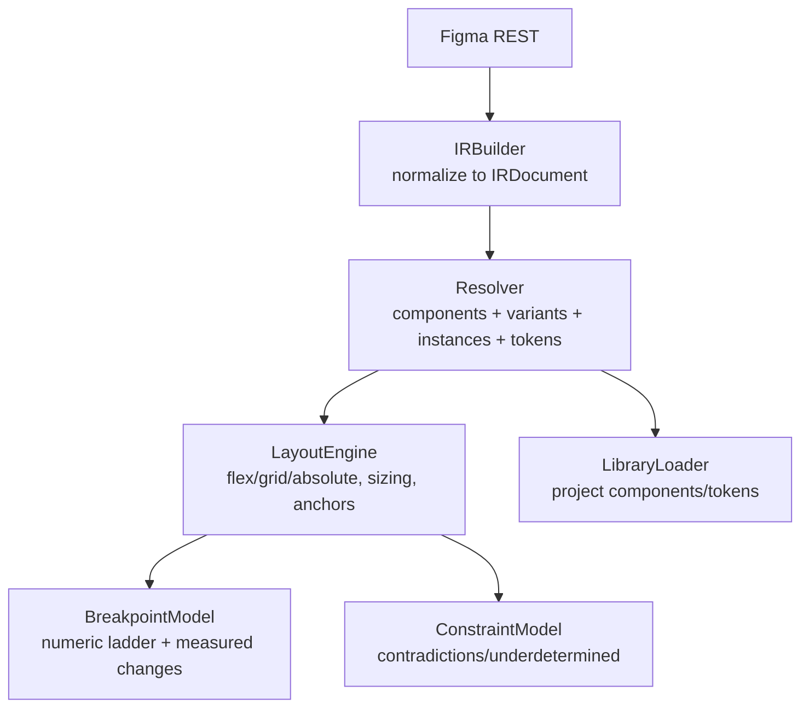
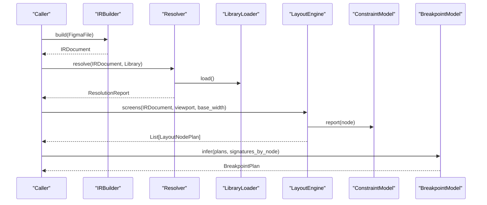
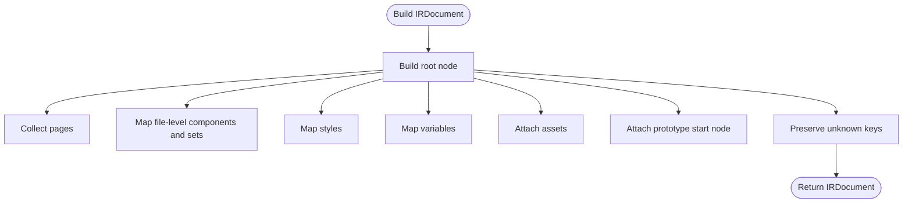
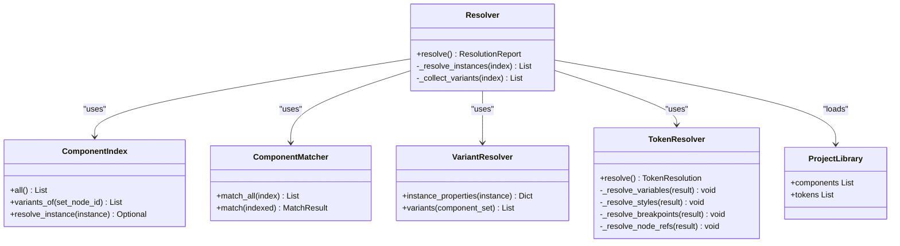
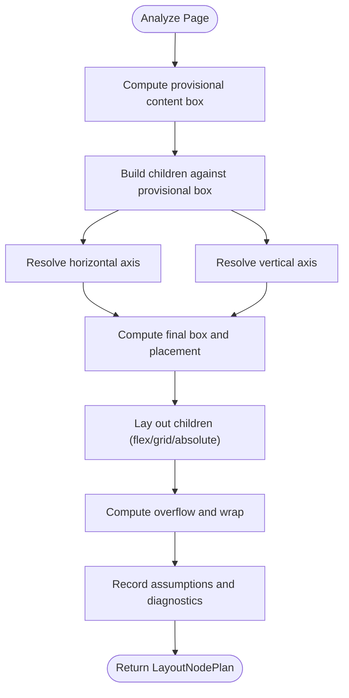
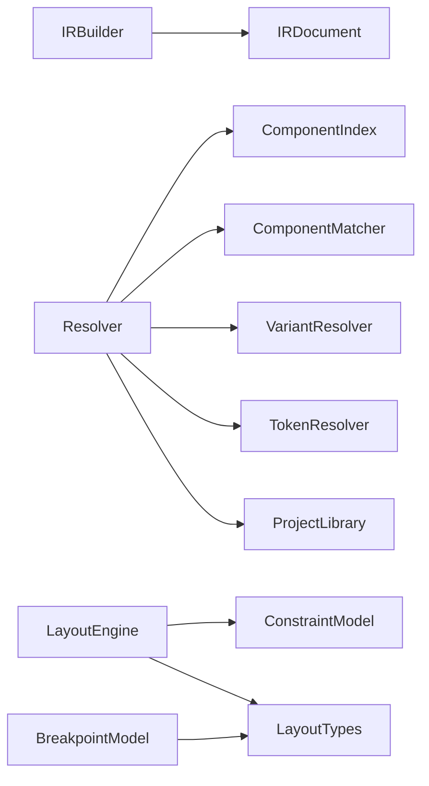

# Design Processing Pipeline

<cite>
**Referenced Files in This Document**
- [ir_builder.py](file://plugin/figmaforge/core/ir_builder.py)
- [ir_types.py](file://plugin/figmaforge/core/ir_types.py)
- [resolver.py](file://plugin/figmaforge/core/resolver.py)
- [matcher.py](file://plugin/figmaforge/core/matcher.py)
- [component_index.py](file://plugin/figmaforge/core/component_index.py)
- [variant_resolver.py](file://plugin/figmaforge/core/variant_resolver.py)
- [token_resolver.py](file://plugin/figmaforge/core/token_resolver.py)
- [library_types.py](file://plugin/figmaforge/core/library_types.py)
- [layout_engine.py](file://plugin/figmaforge/core/layout_engine.py)
- [constraint_model.py](file://plugin/figmaforge/core/constraint_model.py)
- [layout_types.py](file://plugin/figmaforge/core/layout_types.py)
- [breakpoint_model.py](file://plugin/figmaforge/core/breakpoint_model.py)
- [design-ir.md](file://docs/design-ir.md)
- [layout.md](file://docs/layout.md)
</cite>

## Table of Contents
1. [Introduction](#introduction)
2. [Project Structure](#project-structure)
3. [Core Components](#core-components)
4. [Architecture Overview](#architecture-overview)
5. [Detailed Component Analysis](#detailed-component-analysis)
6. [Dependency Analysis](#dependency-analysis)
7. [Performance Considerations](#performance-considerations)
8. [Troubleshooting Guide](#troubleshooting-guide)
9. [Conclusion](#conclusion)
10. [Appendices](#appendices)

## Introduction
This document explains FigmaForge’s design processing pipeline that transforms Figma designs into framework-neutral representations and then resolves components, tokens, and responsive layout behavior. The pipeline is intentionally separated into distinct phases:
- Design IR Builder normalizes Figma API responses into typed IRDocument structures covering 15 areas (frames, text, components, auto-layout, positioning, dimensions, spacing, style, typography, tokens, assets, responsive behavior, prototype links, annotations).
- Component & Token Resolution maps Figma components and variants onto existing project libraries using deterministic matching strategies and emits a resolution report with resolved, ambiguous, and missing mappings.
- Responsive Layout & Constraint Solver computes per-node layout plans with flex/grid inference, per-axis sizing, breakpoint management, and constraint validation, surfacing approximations and underdetermined cases explicitly.

The output at each stage is JSON-serializable, schema-validated where applicable, and designed to be consumed by future code generators without embedding framework-specific logic.

## Project Structure
FigmaForge organizes the pipeline into focused modules under plugin/figmaforge/core:
- IR normalization: ir_builder.py + ir_types.py
- Component & token resolution: resolver.py, matcher.py, component_index.py, variant_resolver.py, token_resolver.py, library_types.py
- Layout inference and constraints: layout_engine.py, constraint_model.py, layout_types.py, breakpoint_model.py
- Documentation and schemas: docs/design-ir.md, docs/layout.md, schemas/*

**Diagram sources**
- [ir_builder.py:156-207](file://plugin/figmaforge/core/ir_builder.py#L156-L207)
- [resolver.py:88-109](file://plugin/figmaforge/core/resolver.py#L88-L109)
- [layout_engine.py:251-271](file://plugin/figmaforge/core/layout_engine.py#L251-L271)
- [breakpoint_model.py:90-114](file://plugin/figmaforge/core/breakpoint_model.py#L90-L114)
- [library_types.py:181-216](file://plugin/figmaforge/core/library_types.py#L181-L216)
- [constraint_model.py:116-127](file://plugin/figmaforge/core/constraint_model.py#L116-L127)

**Section sources**
- [design-ir.md:1-206](file://docs/design-ir.md#L1-L206)
- [layout.md:1-242](file://docs/layout.md#L1-L242)

## Core Components
- IRBuilder builds an IRDocument from normalized FigmaFile inputs, mapping raw node fields into typed IRNode trees with source metadata, unknown keys preserved, and asset references attached. It covers all 15 modeled areas documented in the IR spec.
- Resolver orchestrates component/variant/instance matching against the project library and semantic token resolution, producing a ResolutionReport with counts and detailed entries for resolved, ambiguous, and missing matches.
- LayoutEngine infers display modes (flex/grid/absolute), resolves per-axis sizing (fixed/fill/hug/percent), computes boxes and placement, and propagates layout through nested children. It records assumptions, diagnostics, and confidence.
- ConstraintModel extracts constraints per axis, detects contradictions and underdetermination, and provides pure arithmetic primitives via BoxSolver used by the engine.
- BreakpointModel converts library breakpoint tokens into a numeric ladder and diffs measured signatures across widths to emit evidence-backed breakpoint changes.

**Section sources**
- [ir_builder.py:156-207](file://plugin/figmaforge/core/ir_builder.py#L156-L207)
- [ir_types.py:23-41](file://plugin/figmaforge/core/ir_types.py#L23-L41)
- [resolver.py:80-109](file://plugin/figmaforge/core/resolver.py#L80-L109)
- [layout_engine.py:236-390](file://plugin/figmaforge/core/layout_engine.py#L236-L390)
- [constraint_model.py:108-127](file://plugin/figmaforge/core/constraint_model.py#L108-L127)
- [breakpoint_model.py:36-114](file://plugin/figmaforge/core/breakpoint_model.py#L36-L114)

## Architecture Overview
The pipeline separates concerns cleanly:
- Normalization phase produces a stable IRDocument with typed fields and preserved raw data for debugging.
- Resolution phase maps design artifacts to existing project definitions deterministically, avoiding duplication and surfacing ambiguity.
- Layout phase computes a framework-neutral plan describing how nodes should lay out at given viewports, including responsive breakpoints inferred from measured differences.

**Diagram sources**
- [ir_builder.py:156-207](file://plugin/figmaforge/core/ir_builder.py#L156-L207)
- [resolver.py:88-109](file://plugin/figmaforge/core/resolver.py#L88-L109)
- [library_types.py:181-216](file://plugin/figmaforge/core/library_types.py#L181-L216)
- [layout_engine.py:251-271](file://plugin/figmaforge/core/layout_engine.py#L251-L271)
- [constraint_model.py:116-127](file://plugin/figmaforge/core/constraint_model.py#L116-L127)
- [breakpoint_model.py:90-114](file://plugin/figmaforge/core/breakpoint_model.py#L90-L114)

## Detailed Component Analysis

### Design IR Builder
IRBuilder consumes normalized ingestion models and constructs an IRDocument tree. It maps raw Figma node keys into typed fields while preserving unmapped keys under unknown and retaining the complete raw payload for debugging. It also attaches asset references from images mappings and builds file-level component sets, styles, variables, and prototype start node metadata.

Key behaviors:
- Consumed key sets for nodes and files ensure only known fields are mapped; everything else is preserved.
- Auto-layout detection sets mode to auto or grid based on layoutGrids pattern.
- Typography captures bound variable IDs for font properties.
- Tokens collect both bound variables and style references per node.
- Prototype captures URL, links, and interactions.

**Diagram sources**
- [ir_builder.py:156-207](file://plugin/figmaforge/core/ir_builder.py#L156-L207)

**Section sources**
- [ir_builder.py:66-100](file://plugin/figmaforge/core/ir_builder.py#L66-L100)
- [ir_builder.py:219-272](file://plugin/figmaforge/core/ir_builder.py#L219-L272)
- [ir_builder.py:275-316](file://plugin/figmaforge/core/ir_builder.py#L275-L316)
- [ir_builder.py:414-436](file://plugin/figmaforge/core/ir_builder.py#L414-L436)
- [ir_builder.py:471-486](file://plugin/figmaforge/core/ir_builder.py#L471-L486)
- [ir_builder.py:503-518](file://plugin/figmaforge/core/ir_builder.py#L503-L518)
- [ir_builder.py:529-548](file://plugin/figmaforge/core/ir_builder.py#L529-L548)
- [ir_types.py:23-41](file://plugin/figmaforge/core/ir_types.py#L23-L41)
- [design-ir.md:39-68](file://docs/design-ir.md#L39-L68)

### Component & Token Resolution System
Resolver coordinates three sub-processes:
- ComponentIndex indexes components and component-sets, tracks variants, and resolves instances to their source components.
- ComponentMatcher maps indexed components to existing project components using explicit overrides first, then normalized name/alias matching. Outcomes are strictly resolved, ambiguous, or missing.
- VariantResolver extracts variant properties from instance payloads and parses component-set variant names into property maps.
- TokenResolver classifies Figma variables and styles into semantic categories, prefers existing library tokens by name/value, and emits node-level token references pointing into the semantic token table.

**Diagram sources**
- [resolver.py:80-109](file://plugin/figmaforge/core/resolver.py#L80-L109)
- [component_index.py:54-102](file://plugin/figmaforge/core/component_index.py#L54-L102)
- [matcher.py:51-109](file://plugin/figmaforge/core/matcher.py#L51-L109)
- [variant_resolver.py:44-80](file://plugin/figmaforge/core/variant_resolver.py#L44-L80)
- [token_resolver.py:124-146](file://plugin/figmaforge/core/token_resolver.py#L124-L146)
- [library_types.py:147-178](file://plugin/figmaforge/core/library_types.py#L147-L178)

**Section sources**
- [resolver.py:88-109](file://plugin/figmaforge/core/resolver.py#L88-L109)
- [component_index.py:82-102](file://plugin/figmaforge/core/component_index.py#L82-L102)
- [matcher.py:72-109](file://plugin/figmaforge/core/matcher.py#L72-L109)
- [variant_resolver.py:47-80](file://plugin/figmaforge/core/variant_resolver.py#L47-L80)
- [token_resolver.py:140-146](file://plugin/figmaforge/core/token_resolver.py#L140-L146)
- [token_resolver.py:149-164](file://plugin/figmaforge/core/token_resolver.py#L149-L164)
- [token_resolver.py:166-207](file://plugin/figmaforge/core/token_resolver.py#L166-L207)
- [token_resolver.py:210-247](file://plugin/figmaforge/core/token_resolver.py#L210-L247)
- [token_resolver.py:250-282](file://plugin/figmaforge/core/token_resolver.py#L250-L282)
- [library_types.py:46-69](file://plugin/figmaforge/core/library_types.py#L46-L69)

### Responsive Layout & Constraint Solver
LayoutEngine reads the IR and builds per-node LayoutNodePlan trees. It infers display modes (flex/grid/absolute), resolves per-axis sizing (fixed/fill/hug/percent), computes content boxes, lays out children, and records anchoring, overflow, and diagnostics. Text measurement uses a heuristic and is flagged approximate.

ConstraintModel extracts constraints per axis and reports contradictions (e.g., min > max) and underdetermined cases (e.g., hug with no measurable content). BoxSolver provides pure arithmetic for clamping, content-box math, and size derivation.

BreakpointModel converts library breakpoint tokens into a numeric ladder and diffs measured signatures across widths to emit evidence-backed breakpoint changes. Nodes with no change are recorded explicitly.

**Diagram sources**
- [layout_engine.py:274-390](file://plugin/figmaforge/core/layout_engine.py#L274-L390)
- [constraint_model.py:116-127](file://plugin/figmaforge/core/constraint_model.py#L116-L127)
- [breakpoint_model.py:90-114](file://plugin/figmaforge/core/breakpoint_model.py#L90-L114)

**Section sources**
- [layout_engine.py:236-390](file://plugin/figmaforge/core/layout_engine.py#L236-L390)
- [layout_engine.py:393-448](file://plugin/figmaforge/core/layout_engine.py#L393-L448)
- [layout_engine.py:465-552](file://plugin/figmaforge/core/layout_engine.py#L465-L552)
- [layout_engine.py:554-602](file://plugin/figmaforge/core/layout_engine.py#L554-L602)
- [layout_engine.py:652-708](file://plugin/figmaforge/core/layout_engine.py#L652-L708)
- [constraint_model.py:108-127](file://plugin/figmaforge/core/constraint_model.py#L108-L127)
- [constraint_model.py:184-235](file://plugin/figmaforge/core/constraint_model.py#L184-L235)
- [constraint_model.py:237-275](file://plugin/figmaforge/core/constraint_model.py#L237-L275)
- [breakpoint_model.py:36-114](file://plugin/figmaforge/core/breakpoint_model.py#L36-L114)
- [layout.md:26-62](file://docs/layout.md#L26-L62)

### Examples

#### IR Construction Example
A frame with auto-layout, fills, strokes, effects, and bound variables becomes an IRNode with:
- layout.mode set to auto and direction derived from layoutMode
- dimensions capturing width/height and sizing modes
- style containing fills, borders, shadows, blurs, radius, and opacity
- tokens capturing bound variable references
- asset reference if image fills are present
- unknown keys preserved for unmapped legacy fields

See example paths:
- [ir_builder.py:275-316](file://plugin/figmaforge/core/ir_builder.py#L275-L316)
- [ir_builder.py:344-361](file://plugin/figmaforge/core/ir_builder.py#L344-L361)
- [ir_builder.py:414-436](file://plugin/figmaforge/core/ir_builder.py#L414-L436)
- [ir_builder.py:471-486](file://plugin/figmaforge/core/ir_builder.py#L471-L486)
- [ir_builder.py:539-548](file://plugin/figmaforge/core/ir_builder.py#L539-L548)
- [design-ir.md:88-173](file://docs/design-ir.md#L88-L173)

#### Component Resolution Workflow
- Index components and component-ets from the IR.
- Match each indexed component against the project library:
  - Explicit override via figma_keys
  - Normalized name/alias match
- Report outcomes:
  - Resolved when exactly one project component matches
  - Ambiguous when multiple match (never guessed)
  - Missing when none match

See paths:
- [component_index.py:54-102](file://plugin/figmaforge/core/component_index.py#L54-L102)
- [matcher.py:72-109](file://plugin/figmaforge/core/matcher.py#L72-L109)
- [resolver.py:88-109](file://plugin/figmaforge/core/resolver.py#L88-L109)

#### Layout Constraint Solving Example
For a Header frame with horizontal auto-layout and fill sizing:
- Display inferred as flex with row direction
- Horizontal sizing resolved as fill against parent content box
- Vertical sizing fixed to recorded height
- Text child measured heuristically and wrapped if needed
- Predicted bounds compared to Figma bounds; delta recorded

See paths:
- [layout_engine.py:274-390](file://plugin/figmaforge/core/layout_engine.py#L274-L390)
- [layout.md:118-186](file://docs/layout.md#L118-L186)

### Handling Ambiguity, Approximation Flags, and Separation of Phases
- Ambiguity: ComponentMatcher refuses to guess when multiple project components match; results are reported as ambiguous with reasons.
- Approximation flags: Text measurement is always marked approximate due to heuristic glyph widths; this lowers confidence and appears in diagnostics.
- Separation: IR normalization, resolution, and layout planning are separate phases with clear inputs/outputs. No code generation occurs in these phases; outputs are consumed by future generators.

See paths:
- [matcher.py:72-109](file://plugin/figmaforge/core/matcher.py#L72-L109)
- [layout_engine.py:137-188](file://plugin/figmaforge/core/layout_engine.py#L137-L188)
- [layout.md:43-62](file://docs/layout.md#L43-L62)
- [design-ir.md:1-20](file://docs/design-ir.md#L1-L20)

## Dependency Analysis
The pipeline exhibits low coupling between phases and high cohesion within modules:
- IRBuilder depends on figma_types and ir_types; it has no I/O.
- Resolver depends on component_index, matcher, variant_resolver, token_resolver, and library_types; it orchestrates but does not generate code.
- LayoutEngine depends on constraint_model and layout_types; it performs inference and produces plans.
- BreakpointModel depends on layout_types and library_types; it diffs measured signatures.

**Diagram sources**
- [ir_builder.py:156-207](file://plugin/figmaforge/core/ir_builder.py#L156-L207)
- [resolver.py:88-109](file://plugin/figmaforge/core/resolver.py#L88-L109)
- [layout_engine.py:236-390](file://plugin/figmaforge/core/layout_engine.py#L236-L390)
- [breakpoint_model.py:90-114](file://plugin/figmaforge/core/breakpoint_model.py#L90-L114)

**Section sources**
- [ir_builder.py:25-63](file://plugin/figmaforge/core/ir_builder.py#L25-L63)
- [resolver.py:24-29](file://plugin/figmaforge/core/resolver.py#L24-L29)
- [layout_engine.py:39-73](file://plugin/figmaforge/core/layout_engine.py#L39-L73)
- [breakpoint_model.py:23-24](file://plugin/figmaforge/core/breakpoint_model.py#L23-L24)

## Performance Considerations
- IRBuilder is pure and deterministic; complexity scales with node count due to recursive traversal.
- Resolver performs indexing and matching; matching is string-based and deterministic, avoiding expensive fuzzy logic.
- LayoutEngine computes provisional boxes first to minimize rework; text measurement is heuristic and constant-time relative to character count.
- ConstraintModel extracts constraints linearly per node and detects issues in O(1) per axis.
- BreakpointModel diffs signatures across widths; performance depends on number of breakpoints and nodes analyzed.

[No sources needed since this section provides general guidance]

## Troubleshooting Guide
Common issues and how they are surfaced:
- Unsupported properties: IRBuilder.unsupported_properties() returns unmapped raw keys per node; inspect IRNode.unknown for details.
- Contradictions: ConstraintModel.report() lists contradictions such as min > max or fixed values outside ranges; these zero confidence and require design fixes.
- Underdetermined bounds: Engine marks axes as underdetermined when hug containers have no measurable content or percent/fill sizing lacks a resolved parent; plans record diagnostics and null boxes.
- Ambiguous component matches: Matcher reports ambiguous matches with candidate list; add explicit figma_keys or disambiguate aliases.
- Unresolved tokens: TokenResolver emits unsupported tokens and unresolved node refs with reasons; map Figma variables/styles to library tokens or update naming.

**Section sources**
- [ir_builder.py:209-216](file://plugin/figmaforge/core/ir_builder.py#L209-L216)
- [constraint_model.py:184-235](file://plugin/figmaforge/core/constraint_model.py#L184-L235)
- [constraint_model.py:237-275](file://plugin/figmaforge/core/constraint_model.py#L237-L275)
- [matcher.py:72-109](file://plugin/figmaforge/core/matcher.py#L72-L109)
- [token_resolver.py:149-164](file://plugin/figmaforge/core/token_resolver.py#L149-L164)
- [token_resolver.py:250-282](file://plugin/figmaforge/core/token_resolver.py#L250-L282)

## Conclusion
FigmaForge’s design processing pipeline delivers a robust, framework-neutral transformation from Figma designs to typed IR, deterministic component and token resolution, and evidence-backed responsive layout planning. It prioritizes honesty over guessing: ambiguities, contradictions, and approximations are explicitly reported, enabling reliable downstream code generation and maintenance.

[No sources needed since this section summarizes without analyzing specific files]

## Appendices

### IR Areas Coverage
The IR covers 15 areas, each mapped to typed fields:
- Documents/pages, frames/sections, text, components/instances, auto-layout, flex/grid/absolute positioning, dimensions, spacing, style, typography, tokens, assets, responsive constraints, prototype links, annotations.

**Section sources**
- [ir_types.py:23-41](file://plugin/figmaforge/core/ir_types.py#L23-L41)
- [design-ir.md:39-68](file://docs/design-ir.md#L39-L68)

### Layout Requirements Mapping
The layout solver addresses 12 requirements including auto-layout to flex/grid, per-axis sizing, min/max constraints, padding/gaps, alignment, absolute positioning, anchoring, breakpoints, text wrapping, overflow, nested propagation, and confidence scoring.

**Section sources**
- [layout.md:26-62](file://docs/layout.md#L26-L62)