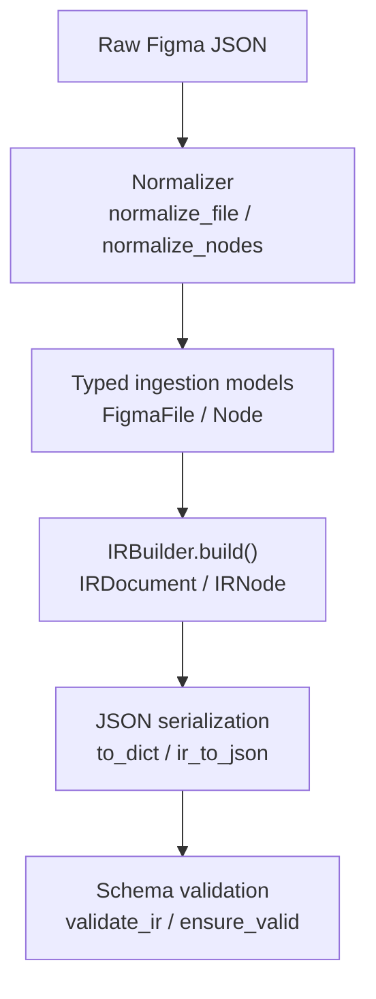
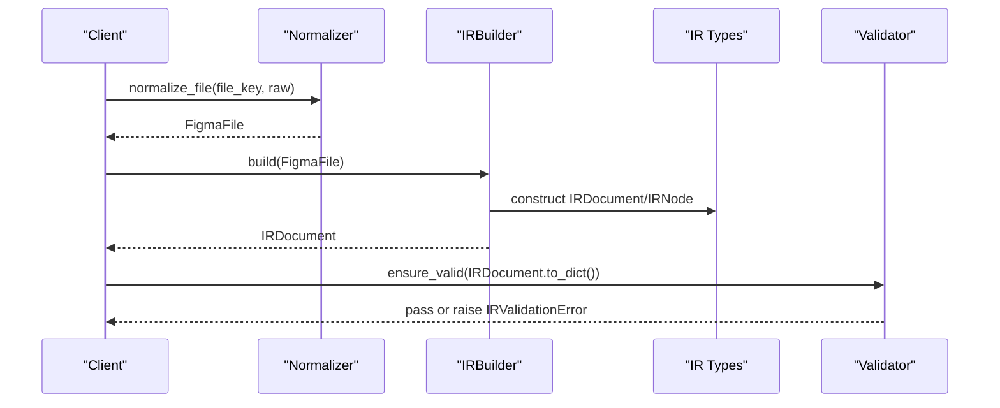
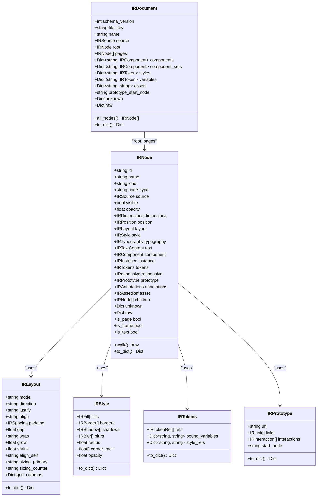
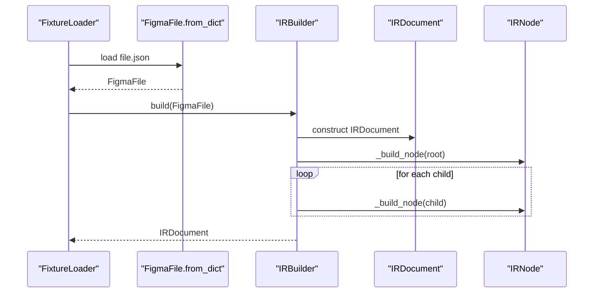
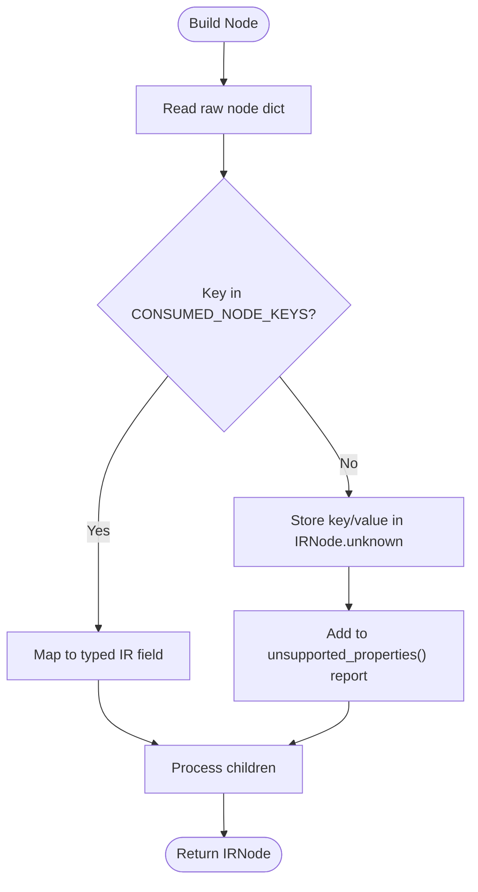
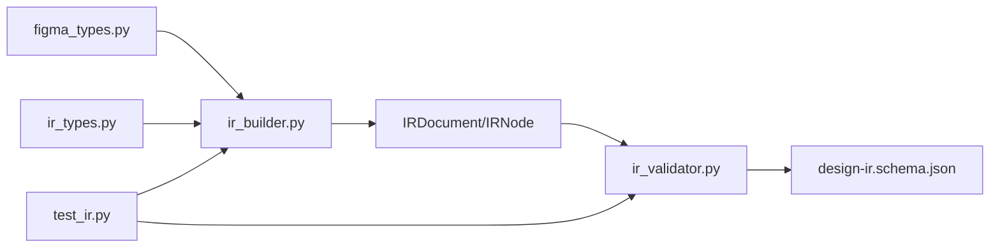

# Intermediate Representation (IR)

<cite>
**Referenced Files in This Document**
- [ir_types.py](file://plugin/figmaforge/core/ir_types.py)
- [ir_builder.py](file://plugin/figmaforge/core/ir_builder.py)
- [normalizer.py](file://plugin/figmaforge/core/normalizer.py)
- [ir_validator.py](file://plugin/figmaforge/core/ir_validator.py)
- [design-ir.schema.json](file://plugin/figmaforge/schemas/design-ir.schema.json)
- [test_ir.py](file://plugin/figmaforge/tests/test_ir.py)
- [figma_types.py](file://plugin/figmaforge/core/figma_types.py)
- [design-ir.md](file://docs/design-ir.md)
</cite>

## Table of Contents
1. [Introduction](#introduction)
2. [Project Structure](#project-structure)
3. [Core Components](#core-components)
4. [Architecture Overview](#architecture-overview)
5. [Detailed Component Analysis](#detailed-component-analysis)
6. [Dependency Analysis](#dependency-analysis)
7. [Performance Considerations](#performance-considerations)
8. [Troubleshooting Guide](#troubleshooting-guide)
9. [Conclusion](#conclusion)
10. [Appendices](#appendices)

## Introduction
This document explains the Intermediate Representation (IR) system that provides a framework-neutral view of Figma designs. It covers the IRDocument and IRNode type definitions across all 15 design areas, the normalization process from ingestion-layer types to IR, preservation guarantees for node IDs and source paths, handling of unsupported properties, JSON serialization, validation rules, and how the IR serves as the stable foundation for subsequent processing stages.

The IR is intentionally decoupled from any code-generation target (React, CSS, etc.) and focuses on normalized, typed semantics with deterministic serialization and schema validation.

## Project Structure
At a high level:
- Ingestion layer converts raw Figma REST responses into typed models (FigmaFile, Node).
- The IR builder transforms those typed models into a normalized IR tree (IRDocument, IRNode).
- A lightweight validator enforces a JSON Schema for serialized IR payloads.
- Tests exercise all 15 modeled areas and validate determinism and schema compliance.

**Diagram sources**
- [normalizer.py:35-52](file://plugin/figmaforge/core/normalizer.py#L35-L52)
- [ir_builder.py:143-216](file://plugin/figmaforge/core/ir_builder.py#L143-L216)
- [ir_types.py:724-784](file://plugin/figmaforge/core/ir_types.py#L724-L784)
- [ir_validator.py:140-183](file://plugin/figmaforge/core/ir_validator.py#L140-L183)

**Section sources**
- [normalizer.py:1-99](file://plugin/figmaforge/core/normalizer.py#L1-L99)
- [ir_builder.py:1-598](file://plugin/figmaforge/core/ir_builder.py#L1-L598)
- [ir_types.py:1-784](file://plugin/figmaforge/core/ir_types.py#L1-L784)
- [ir_validator.py:1-183](file://plugin/figmaforge/core/ir_validator.py#L1-L183)
- [design-ir.md:1-206](file://docs/design-ir.md#L1-L206)

## Core Components
- IRDocument: Top-level container holding file metadata, root node, pages, component maps, style/variable tokens, assets, prototype start node, plus unknown/raw payloads.
- IRNode: Normalized node representing any element in the design tree, carrying identity, kind, source location, layout, dimensions, position, style, typography, text, components/instances, tokens, responsive constraints, prototype links, annotations, asset references, children, unknown keys, and raw payload.
- Value objects: IRColor, IRFill, IRBorder, IRShadow, IRBlur, IRSpacing, IRLayout, IRPosition, IRDimensions, IRTypography, IRTextContent, IRComponent, IRInstance, IRTokenRef, IRTokens, IResponsive, IRLink, IRInteraction, IRPrototype, IRAnnotations, IRAssetRef, IRSource, IRToken.

Key behaviors:
- Deterministic serialization via to_dict() and ir_to_json(sort_keys=True).
- Preservation of original Figma node ids and parent-child structure.
- Source-location metadata (file_key, node_id, node_type, ancestor path) attached to every node.
- Unknown/unmapped properties preserved under IRNode.unknown and reported by IRBuilder.unsupported_properties().

**Section sources**
- [ir_types.py:57-95](file://plugin/figmaforge/core/ir_types.py#L57-L95)
- [ir_types.py:116-784](file://plugin/figmaforge/core/ir_types.py#L116-L784)
- [ir_builder.py:156-216](file://plugin/figmaforge/core/ir_builder.py#L156-L216)

## Architecture Overview
The IR pipeline is pure and deterministic:
- Input: FigmaFile/Node (ingestion layer).
- Transformation: IRBuilder builds IRDocument/IRNode trees.
- Output: JSON-serializable dict or string; validated against a JSON Schema.

**Diagram sources**
- [normalizer.py:35-52](file://plugin/figmaforge/core/normalizer.py#L35-L52)
- [ir_builder.py:156-216](file://plugin/figmaforge/core/ir_builder.py#L156-L216)
- [ir_types.py:724-784](file://plugin/figmaforge/core/ir_types.py#L724-L784)
- [ir_validator.py:140-183](file://plugin/figmaforge/core/ir_validator.py#L140-L183)

## Detailed Component Analysis

### IRDocument and IRNode: 15 Design Areas
The IR explicitly models 15 design areas. Each area is represented by specific types and fields on IRNode/IRDocument.

1) Documents/pages
- IRDocument holds file_key, name, root, pages, and source metadata.
- IRNode.kind distinguishes "document" and "page".

2) Frames and sections
- IRNode.kind includes "frame", "group", "section".
- Layout and positioning are captured per node.

3) Text nodes
- IRNode.kind "text" with IRTextContent (characters, hyperlink).
- Typography via IRTypography.

4) Components/instances
- IRComponent and IRInstance capture component definitions and instantiation relationships.
- File-level maps (components, component_sets) provide authoritative metadata.

5) Auto-layout
- IRLayout.mode "auto" when layoutMode != "NONE".
- Direction, justify, align, padding, gap, wrap, sizing modes.

6) Flex/grid/absolute positioning
- IRLayout supports grid_columns and flex-like grow/shrink/align_self.
- IRPosition.mode "auto" | "absolute" | "relative" with x/y/left/right/top/bottom.

7) Dimensions
- IRDimensions captures width, height, min/max constraints, and sizing modes.

8) Spacing
- IRSpacing for top/right/bottom/left; IRLayout.gap for item spacing.

9) Style
- IRStyle aggregates fills, borders, shadows, blurs, radius/corner_radii, opacity.
- IRFill, IRBorder, IRShadow, IRBlur model visual effects.

10) Typography
- IRTypography captures font family, weight, size, line height, letter spacing, text case/decoration/alignment/auto resize, and token refs.

11) Tokens
- IRTokens captures bound variables and style refs; IRTokenRef enumerates property-to-token mappings.
- IRDocument.styles and IRDocument.variables hold file-level tokens.

12) Assets
- IRAssetRef attaches node_id, url, image_ref, local_path.
- IRDocument.assets maps node_id to rendered asset URLs.

13) Responsive behavior
- IResponsive captures horizontal/vertical constraints and sizing hints.

14) Prototype links
- IRPrototype holds url, links, interactions, and start_node.
- IRLink and IRInteraction model targets and transitions.

15) Annotations
- IRAnnotations captures annotation strings and developer_metadata.

Validation and serialization:
- Every object implements to_dict(); IRDocument.to_dict() serializes the full tree.
- ir_to_json produces deterministic JSON with sort_keys=True.
- Schema validation ensures structural correctness.

**Section sources**
- [ir_types.py:57-95](file://plugin/figmaforge/core/ir_types.py#L57-L95)
- [ir_types.py:116-784](file://plugin/figmaforge/core/ir_types.py#L116-L784)
- [design-ir.schema.json:1-336](file://plugin/figmaforge/schemas/design-ir.schema.json#L1-L336)
- [test_ir.py:46-298](file://plugin/figmaforge/tests/test_ir.py#L46-L298)

### Normalization Process: From FigmaFile/Node to IR
IRBuilder consumes FigmaFile and Node (from figma_types) and constructs IRDocument/IRNode. Key aspects:
- Builds root and pages; collects component/component_set maps; populates styles and variables.
- For each node:
  - Computes kind via kind_for(node.type).
  - Captures source metadata (file_key, node_id, node_type, ancestor path).
  - Builds layout, position, dimensions, style, typography, text, component/instance, tokens, responsive, prototype, annotations, asset.
  - Preserves unknown keys not mapped by CONSUMED_NODE_KEYS.
  - Recursively processes children.

Unsupported properties:
- CONSUMED_NODE_KEYS defines which raw keys are consumed; anything else goes to IRNode.unknown.
- IRBuilder.unsupported_properties() returns a map of node_id -> list of unmapped keys.

Example flow:
- Build layout mode "auto" vs "none" based on layoutMode.
- Map fills/strokes/effects to IRStyle subtypes.
- Extract boundVariables and styles into IRTokens.
- Attach asset URL if available from images mapping.

**Section sources**
- [ir_builder.py:66-100](file://plugin/figmaforge/core/ir_builder.py#L66-L100)
- [ir_builder.py:156-216](file://plugin/figmaforge/core/ir_builder.py#L156-L216)
- [ir_builder.py:219-272](file://plugin/figmaforge/core/ir_builder.py#L219-L272)
- [ir_builder.py:275-549](file://plugin/figmaforge/core/ir_builder.py#L275-L549)
- [ir_builder.py:551-598](file://plugin/figmaforge/core/ir_builder.py#L551-L598)

### JSON Serialization and Validation
Serialization:
- IRDocument.to_dict() and IRNode.to_dict() produce plain dicts suitable for JSON.
- ir_to_json(document, indent=2) serializes with sort_keys=True for deterministic snapshots.

Validation:
- ir_validator implements a subset of JSON Schema (draft-07): type, required, properties, items, enum/const, additionalProperties, minimum/maximum, minItems/maxItems, $ref (local only).
- validate_ir(ir_dict, schema) returns error list; ensure_valid raises IRValidationError on failure.
- Default schema path points to design-ir.schema.json.

Schema coverage:
- Defines required fields for IRDocument and IRNode.
- Enumerates allowed kinds, modes, and link types.
- Enforces structure for style, typography, tokens, responsive, prototype, annotations, assets.

**Section sources**
- [ir_types.py:772-784](file://plugin/figmaforge/core/ir_types.py#L772-L784)
- [ir_validator.py:1-183](file://plugin/figmaforge/core/ir_validator.py#L1-L183)
- [design-ir.schema.json:1-336](file://plugin/figmaforge/schemas/design-ir.schema.json#L1-L336)
- [test_ir.py:247-298](file://plugin/figmaforge/tests/test_ir.py#L247-L298)

### Examples of IR Construction, Validation Rules, and Framework Neutrality
Construction example (conceptual steps):
- Load raw Figma response and parse into FigmaFile using normalizer.
- Optionally load images mapping from /v1/images endpoint.
- Call IRBuilder(images=images_map).build(figma_file) to get IRDocument.
- Validate with ensure_valid(IRDocument.to_dict()).
- Serialize with ir_to_json(document) for snapshots or downstream consumption.

Validation rules enforced:
- Required fields present (schema_version, file_key, name, root, pages, components, component_sets, styles, variables, assets).
- Node kind must be one of the enumerated values.
- Position and layout modes must be valid enums.
- Colors must have r/g/b/a numbers; typography fields must match expected types.

Framework neutrality:
- IR contains no rendering logic or framework-specific constructs.
- All fields describe design semantics (layout, style, tokens, responsiveness, prototypes).
- Downstream generators can consume IR without coupling to Figma internals.

**Section sources**
- [design-ir.md:71-86](file://docs/design-ir.md#L71-L86)
- [test_ir.py:37-44](file://plugin/figmaforge/tests/test_ir.py#L37-L44)
- [test_ir.py:265-298](file://plugin/figmaforge/tests/test_ir.py#L265-L298)

### Class Diagram: IR Core Types

**Diagram sources**
- [ir_types.py:578-784](file://plugin/figmaforge/core/ir_types.py#L578-L784)

### Sequence Diagram: Building an IRDocument

**Diagram sources**
- [ir_builder.py:156-216](file://plugin/figmaforge/core/ir_builder.py#L156-L216)
- [ir_builder.py:219-272](file://plugin/figmaforge/core/ir_builder.py#L219-L272)
- [figma_types.py:488-521](file://plugin/figmaforge/core/figma_types.py#L488-L521)

### Flowchart: Unsupported Properties Handling

**Diagram sources**
- [ir_builder.py:66-100](file://plugin/figmaforge/core/ir_builder.py#L66-L100)
- [ir_builder.py:219-272](file://plugin/figmaforge/core/ir_builder.py#L219-L272)
- [ir_builder.py:592-598](file://plugin/figmaforge/core/ir_builder.py#L592-L598)

## Dependency Analysis
- IRBuilder depends on:
  - figma_types (FigmaFile, Node, Paint, Effect, Color, StyleRef) for ingestion models.
  - ir_types (IR* classes) for output models.
- IRValidator depends on:
  - JSON Schema file (design-ir.schema.json) for validation rules.
- Tests depend on:
  - FixtureLoader to load sample files and images.
  - IRBuilder, IR types, and validator to assert behavior and schema compliance.

**Diagram sources**
- [ir_builder.py:25-62](file://plugin/figmaforge/core/ir_builder.py#L25-L62)
- [ir_validator.py:32-32](file://plugin/figmaforge/core/ir_validator.py#L32-L32)
- [test_ir.py:18-34](file://plugin/figmaforge/tests/test_ir.py#L18-L34)

**Section sources**
- [ir_builder.py:25-62](file://plugin/figmaforge/core/ir_builder.py#L25-L62)
- [ir_validator.py:1-183](file://plugin/figmaforge/core/ir_validator.py#L1-L183)
- [test_ir.py:18-34](file://plugin/figmaforge/tests/test_ir.py#L18-L34)

## Performance Considerations
- IRBuilder is pure and deterministic; it performs linear traversal over the node tree.
- Serialization uses compact helpers to drop None values and round floats for stability.
- Schema validation operates on a subset of JSON Schema keywords, avoiding heavy dependencies.
- Asset attachment requires an external images mapping; avoid unnecessary network calls by preloading images when needed.

[No sources needed since this section provides general guidance]

## Troubleshooting Guide
Common issues and diagnostics:
- Missing required fields: ensure_valid will raise IRValidationError listing missing keys.
- Invalid enum values: e.g., wrong kind or mode; validator reports mismatched values.
- Unmapped properties: use IRBuilder.unsupported_properties() to identify raw keys not modeled; they are preserved in IRNode.unknown.
- Determinism: ir_to_json sorts keys; regenerate snapshots only when fixture or IR shape changes.

Diagnostic steps:
- Validate IRDocument.to_dict() against the schema to catch structural errors early.
- Inspect IRNode.unknown and raw to understand unmapped or legacy Figma properties.
- Use test fixtures to reproduce issues locally before integrating with real files.

**Section sources**
- [ir_validator.py:140-183](file://plugin/figmaforge/core/ir_validator.py#L140-L183)
- [ir_builder.py:209-216](file://plugin/figmaforge/core/ir_builder.py#L209-L216)
- [test_ir.py:226-244](file://plugin/figmaforge/tests/test_ir.py#L226-L244)
- [design-ir.md:174-192](file://docs/design-ir.md#L174-L192)

## Conclusion
The IR system delivers a robust, framework-neutral representation of Figma designs, capturing all 15 design areas with typed, normalized structures. It preserves original identifiers and source paths, surfaces unsupported properties transparently, and provides deterministic serialization with schema validation. This stable foundation enables reliable downstream processing—whether for code generation, analysis, or tooling—without coupling to Figma’s internal formats or any specific framework.

[No sources needed since this section summarizes without analyzing specific files]

## Appendices

### Appendix A: Usage Pattern Reference
Conceptual usage pattern:
- Parse raw Figma response into FigmaFile.
- Build IRDocument via IRBuilder.
- Validate with ensure_valid.
- Serialize with ir_to_json for snapshots or API responses.
- Query IRDocument.pages/root/all_nodes for downstream processing.

**Section sources**
- [design-ir.md:71-86](file://docs/design-ir.md#L71-L86)
- [test_ir.py:37-44](file://plugin/figmaforge/tests/test_ir.py#L37-L44)

### Appendix B: Mapping Summary Across 15 Areas
- Documents/pages: IRDocument, IRNode.kind "document"/"page".
- Frames/sections: IRNode.kind "frame"/"group"/"section".
- Text: IRNode.kind "text", IRTextContent, IRTypography.
- Components/instances: IRComponent, IRInstance; file-level maps.
- Auto-layout: IRLayout.mode "auto", direction, justify, align, padding, gap.
- Flex/grid/absolute: IRLayout (wrap/grow/shrink, grid_columns), IRPosition.
- Dimensions: IRDimensions (width/height/min/max, sizing modes).
- Spacing: IRSpacing, IRLayout.gap.
- Style: IRStyle (fills, borders, shadows, blurs, radius, opacity).
- Typography: IRTypography (font family/weight/size, alignment, auto resize, token refs).
- Tokens: IRTokens (refs, bound_variables, style_refs); IRToken.
- Assets: IRAssetRef; IRDocument.assets.
- Responsive: IResponsive (constraints, sizing, min/max).
- Prototype: IRPrototype (url, links, interactions, start_node).
- Annotations: IRAnnotations (annotation, developer_metadata).

**Section sources**
- [ir_types.py:57-95](file://plugin/figmaforge/core/ir_types.py#L57-L95)
- [ir_types.py:116-784](file://plugin/figmaforge/core/ir_types.py#L116-L784)
- [design-ir.md:39-57](file://docs/design-ir.md#L39-L57)