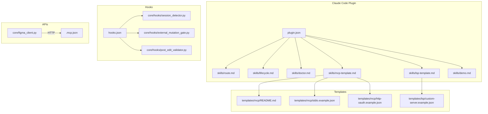
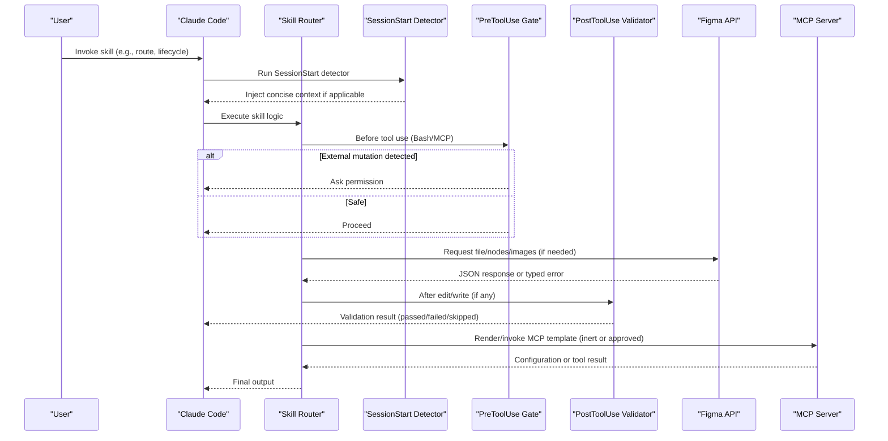
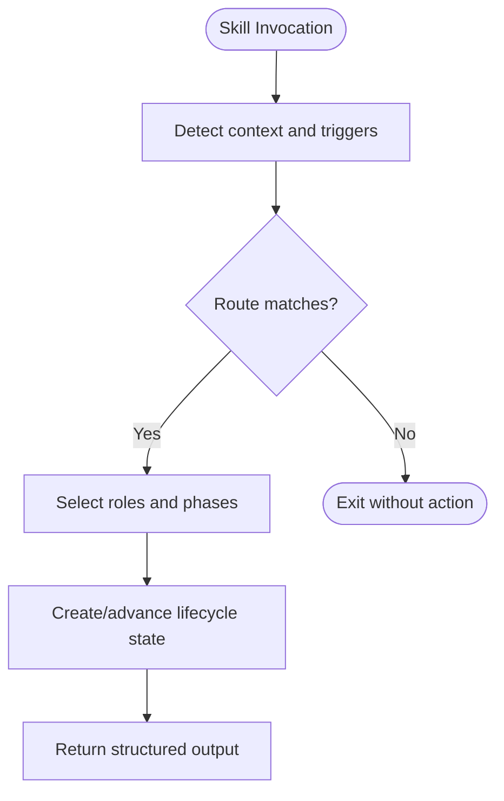
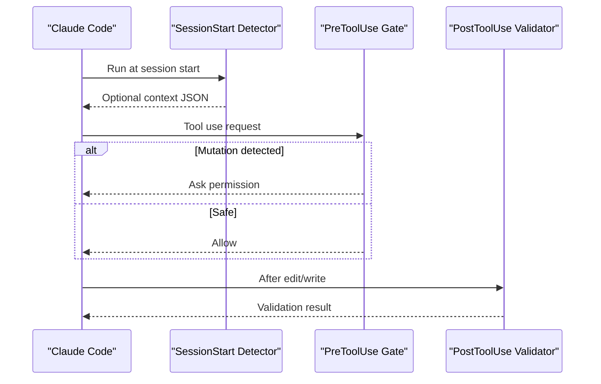
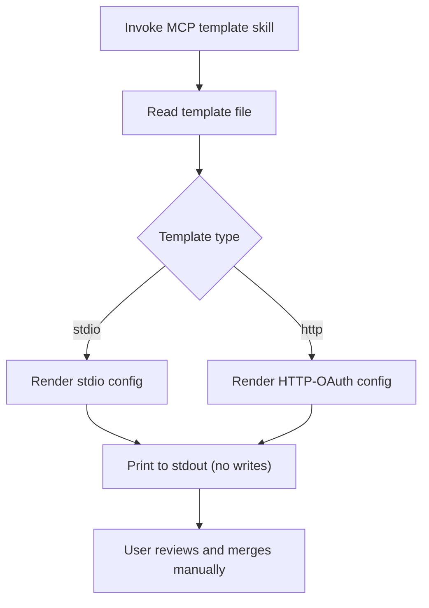
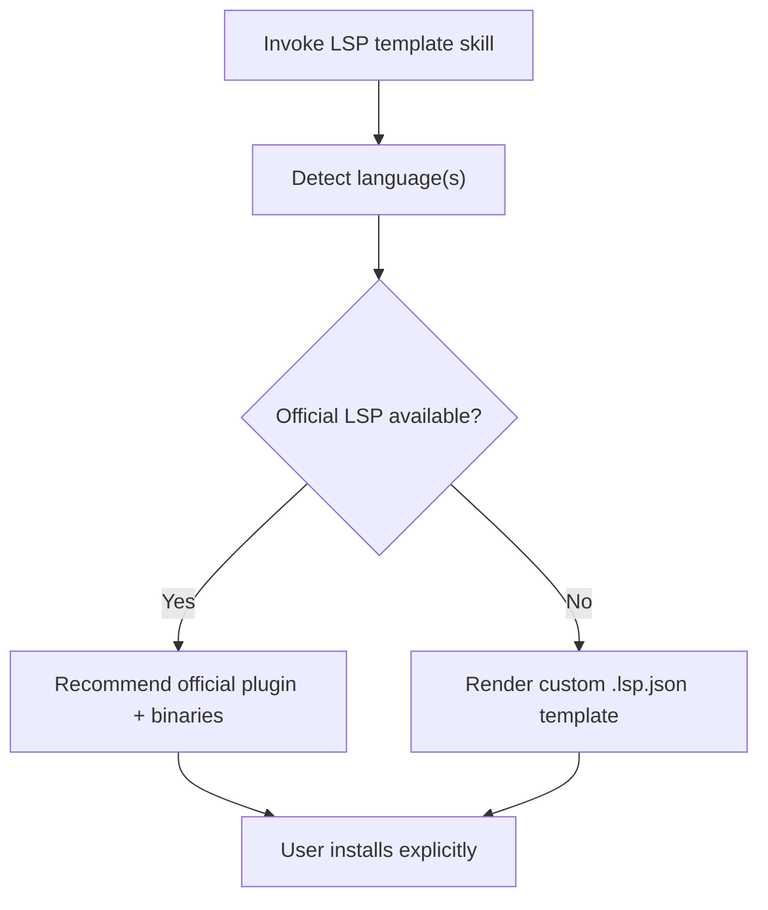
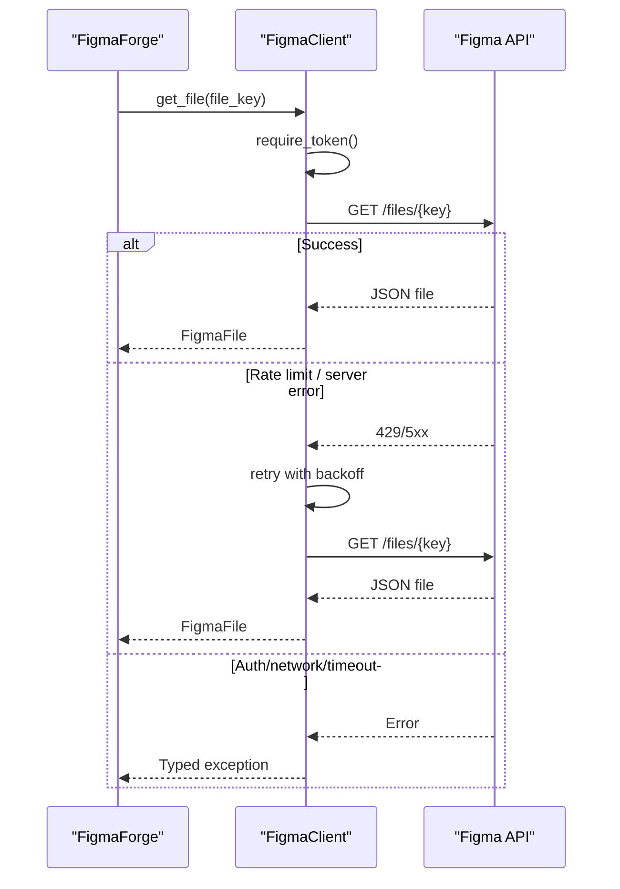
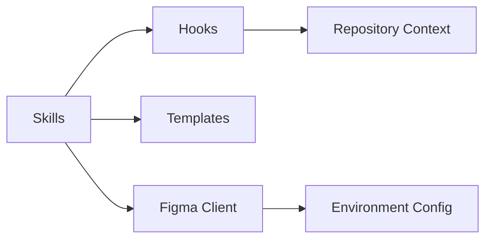

# Integration Points

<cite>
**Referenced Files in This Document**
- [plugin.json](file://plugin/figmaforge/.claude-plugin/plugin.json)
- [route.md](file://plugin/figmaforge/skills/route.md)
- [lifecycle.md](file://plugin/figmaforge/skills/lifecycle.md)
- [doctor.md](file://plugin/figmaforge/skills/doctor.md)
- [mcp-template.md](file://plugin/figmaforge/skills/mcp-template.md)
- [lsp-template.md](file://plugin/figmaforge/skills/lsp-template.md)
- [demo.md](file://plugin/figmaforge/skills/demo.md)
- [session_detector.py](file://plugin/figmaforge/core/hooks/session_detector.py)
- [external_mutation_gate.py](file://plugin/figmaforge/core/hooks/external_mutation_gate.py)
- [post_edit_validator.py](file://plugin/figmaforge/core/hooks/post_edit_validator.py)
- [hooks.json](file://plugin/figmaforge/hooks/hooks.json)
- [figma_client.py](file://plugin/figmaforge/core/figma_client.py)
- [http-oauth.example.json](file://plugin/figmaforge/templates/mcp/http-oauth.example.json)
- [stdio.example.json](file://plugin/figmaforge/templates/mcp/stdio.example.json)
- [README.md](file://plugin/figmaforge/templates/mcp/README.md)
- [custom-server.example.json](file://plugin/figmaforge/templates/lsp/custom-server.example.json)
- [.mcp.json](file://.mcp.json)
</cite>

## Table of Contents
1. Introduction
2. Project Structure
3. Core Components
4. Architecture Overview
5. Detailed Component Analysis
6. Dependency Analysis
7. Performance Considerations
8. Troubleshooting Guide
9. Conclusion

## Introduction
This document explains FigmaForge’s integration points with Claude Code, external APIs, and third-party tools. It covers:
- The Claude Code plugin interface and skill definitions for route, lifecycle, doctor, mcp-template, lsp-template, and demo operations.
- The hook system that extends behavior via SessionStart detection, PreToolUse mutation gating, and PostToolUse validation.
- MCP template consumption for Model Context Protocol integration and LSP templates for language server protocol support.
- Figma API integration for design file access, authentication, data retrieval, rate limiting, retries, and error handling.
- Security considerations, safe defaults, and best practices for integrating with external systems.

## Project Structure
FigmaForge organizes integrations around:
- Skills under plugin/figmaforge/skills that define capabilities and constraints.
- Hooks under plugin/figmaforge/core/hooks that intercept session and tool usage events.
- Templates under plugin/figmaforge/templates for MCP and LSP configuration examples.
- A Figma client under plugin/figmaforge/core for secure, retry-aware API calls.
- A root .mcp.json for MCP server registration.

**Diagram sources**
- [plugin.json:1-21](file://plugin/figmaforge/.claude-plugin/plugin.json#L1-L21)
- [hooks.json:1-26](file://plugin/figmaforge/hooks/hooks.json#L1-L26)
- [session_detector.py:1-60](file://plugin/figmaforge/core/hooks/session_detector.py#L1-L60)
- [external_mutation_gate.py:1-132](file://plugin/figmaforge/core/hooks/external_mutation_gate.py#L1-L132)
- [post_edit_validator.py:1-148](file://plugin/figmaforge/core/hooks/post_edit_validator.py#L1-L148)
- [figma_client.py:1-325](file://plugin/figmaforge/core/figma_client.py#L1-L325)
- [http-oauth.example.json:1-12](file://plugin/figmaforge/templates/mcp/http-oauth.example.json#L1-L12)
- [stdio.example.json:1-12](file://plugin/figmaforge/templates/mcp/stdio.example.json#L1-L12)
- [README.md:1-34](file://plugin/figmaforge/templates/mcp/README.md#L1-L34)
- [custom-server.example.json:1-16](file://plugin/figmaforge/templates/lsp/custom-server.example.json#L1-L16)
- [.mcp.json:1-12](file://.mcp.json#L1-L12)

**Section sources**
- [plugin.json:1-21](file://plugin/figmaforge/.claude-plugin/plugin.json#L1-L21)
- [hooks.json:1-26](file://plugin/figmaforge/hooks/hooks.json#L1-L26)

## Core Components
- Claude Code plugin manifest defines the plugin identity and metadata.
- Skills declare capabilities, triggers, outputs, and safety constraints:
  - Route: context detection and role selection.
  - Lifecycle: evidence-driven task state transitions.
  - Doctor: read-only health inspection and cost reporting.
  - MCP Template: inert rendering and guidance without executing or writing user configs.
  - LSP Template: recommendations and inert custom templates; no auto-installation.
  - Demo: bounded offline smoke test to validate behavior deterministically.
- Hook system:
  - SessionStart detector injects concise repo context when actionable.
  - PreToolUse gate asks permission for external mutations (Bash/MCP).
  - PostToolUse validator runs toolchain checks on edits/writes.
- Figma API client:
  - Secure token handling, typed errors, retries/backoff, rate limiting, and image/node/file retrieval.

**Section sources**
- [route.md:1-29](file://plugin/figmaforge/skills/route.md#L1-L29)
- [lifecycle.md:1-27](file://plugin/figmaforge/skills/lifecycle.md#L1-L27)
- [doctor.md:1-29](file://plugin/figmaforge/skills/doctor.md#L1-L29)
- [mcp-template.md:1-31](file://plugin/figmaforge/skills/mcp-template.md#L1-L31)
- [lsp-template.md:1-31](file://plugin/figmaforge/skills/lsp-template.md#L1-L31)
- [demo.md:1-35](file://plugin/figmaforge/skills/demo.md#L1-L35)
- [session_detector.py:1-60](file://plugin/figmaforge/core/hooks/session_detector.py#L1-L60)
- [external_mutation_gate.py:1-132](file://plugin/figmaforge/core/hooks/external_mutation_gate.py#L1-L132)
- [post_edit_validator.py:1-148](file://plugin/figmaforge/core/hooks/post_edit_validator.py#L1-L148)
- [figma_client.py:1-325](file://plugin/figmaforge/core/figma_client.py#L1-L325)

## Architecture Overview
The integration architecture connects Claude Code skills and hooks to external services through safe, auditable boundaries.

**Diagram sources**
- [hooks.json:1-26](file://plugin/figmaforge/hooks/hooks.json#L1-L26)
- [session_detector.py:1-60](file://plugin/figmaforge/core/hooks/session_detector.py#L1-L60)
- [external_mutation_gate.py:1-132](file://plugin/figmaforge/core/hooks/external_mutation_gate.py#L1-L132)
- [post_edit_validator.py:1-148](file://plugin/figmaforge/core/hooks/post_edit_validator.py#L1-L148)
- [figma_client.py:1-325](file://plugin/figmaforge/core/figma_client.py#L1-L325)
- [mcp-template.md:1-31](file://plugin/figmaforge/skills/mcp-template.md#L1-L31)
- [lsp-template.md:1-31](file://plugin/figmaforge/skills/lsp-template.md#L1-L31)

## Detailed Component Analysis

### Claude Code Plugin Interface and Skills
- Plugin manifest declares name, version, description, and keywords for discovery.
- Skills define:
  - Triggers that activate them.
  - Outputs describing expected results.
  - Constraints ensuring safety (read-only, no auto-installs, no network unless explicitly allowed).
- Example usage patterns:
  - Route: detect repository signals and select roles/phases.
  - Lifecycle: create/advance runs with evidence-backed transitions.
  - Doctor: inspect plugin structure and report projected context costs.
  - MCP Template: render inert templates to stdout; guide manual merge into .mcp.json.
  - LSP Template: recommend official plugins or render inert custom templates.
  - Demo: run a bounded offline smoke test validating detection, routing, lifecycle, hooks, and template inertness.

**Diagram sources**
- [route.md:1-29](file://plugin/figmaforge/skills/route.md#L1-L29)
- [lifecycle.md:1-27](file://plugin/figmaforge/skills/lifecycle.md#L1-L27)
- [demo.md:1-35](file://plugin/figmaforge/skills/demo.md#L1-L35)

**Section sources**
- [plugin.json:1-21](file://plugin/figmaforge/.claude-plugin/plugin.json#L1-L21)
- [route.md:1-29](file://plugin/figmaforge/skills/route.md#L1-L29)
- [lifecycle.md:1-27](file://plugin/figmaforge/skills/lifecycle.md#L1-L27)
- [doctor.md:1-29](file://plugin/figmaforge/skills/doctor.md#L1-L29)
- [mcp-template.md:1-31](file://plugin/figmaforge/skills/mcp-template.md#L1-L31)
- [lsp-template.md:1-31](file://plugin/figmaforge/skills/lsp-template.md#L1-L31)
- [demo.md:1-35](file://plugin/figmaforge/skills/demo.md#L1-L35)

### Hook System: SessionStart, PreToolUse, PostToolUse
- SessionStart detector:
  - Runs repository detection and injects concise context only when confidence is sufficient.
  - Exits safely when not in a repository or when no actionable evidence exists.
- PreToolUse external-mutation gate:
  - Inspects Bash commands and MCP tool names for risky operations.
  - Returns an ask-permission decision when potential external mutations are detected.
- PostToolUse validator:
  - On Edit/Write, selects a validator based on file type and executes it with timeouts.
  - Reports passed/failed/skipped/error outcomes without blocking when toolchains are missing.

**Diagram sources**
- [hooks.json:1-26](file://plugin/figmaforge/hooks/hooks.json#L1-L26)
- [session_detector.py:1-60](file://plugin/figmaforge/core/hooks/session_detector.py#L1-L60)
- [external_mutation_gate.py:1-132](file://plugin/figmaforge/core/hooks/external_mutation_gate.py#L1-L132)
- [post_edit_validator.py:1-148](file://plugin/figmaforge/core/hooks/post_edit_validator.py#L1-L148)

**Section sources**
- [hooks.json:1-26](file://plugin/figmaforge/hooks/hooks.json#L1-L26)
- [session_detector.py:1-60](file://plugin/figmaforge/core/hooks/session_detector.py#L1-L60)
- [external_mutation_gate.py:1-132](file://plugin/figmaforge/core/hooks/external_mutation_gate.py#L1-L132)
- [post_edit_validator.py:1-148](file://plugin/figmaforge/core/hooks/post_edit_validator.py#L1-L148)

### MCP Template Consumption
- The MCP template skill renders templates from templates/mcp to stdout without executing or writing user files.
- Templates include stdio and HTTP-OAuth examples using placeholder values and example.invalid URLs.
- Guidance emphasizes manual review and merging into .mcp.json by the user.

**Diagram sources**
- [mcp-template.md:1-31](file://plugin/figmaforge/skills/mcp-template.md#L1-L31)
- [stdio.example.json:1-12](file://plugin/figmaforge/templates/mcp/stdio.example.json#L1-L12)
- [http-oauth.example.json:1-12](file://plugin/figmaforge/templates/mcp/http-oauth.example.json#L1-L12)
- [README.md:1-34](file://plugin/figmaforge/templates/mcp/README.md#L1-L34)
- [.mcp.json:1-12](file://.mcp.json#L1-L12)

**Section sources**
- [mcp-template.md:1-31](file://plugin/figmaforge/skills/mcp-template.md#L1-L31)
- [README.md:1-34](file://plugin/figmaforge/templates/mcp/README.md#L1-L34)
- [stdio.example.json:1-12](file://plugin/figmaforge/templates/mcp/stdio.example.json#L1-L12)
- [http-oauth.example.json:1-12](file://plugin/figmaforge/templates/mcp/http-oauth.example.json#L1-L12)
- [.mcp.json:1-12](file://.mcp.json#L1-L12)

### LSP Template Support
- The LSP template skill recommends official LSP plugins for detected languages and requires explicit user action for installation.
- For unsupported languages, it renders an inert custom .lsp.json template with placeholders and guidance.

**Diagram sources**
- [lsp-template.md:1-31](file://plugin/figmaforge/skills/lsp-template.md#L1-L31)
- [custom-server.example.json:1-16](file://plugin/figmaforge/templates/lsp/custom-server.example.json#L1-L16)

**Section sources**
- [lsp-template.md:1-31](file://plugin/figmaforge/skills/lsp-template.md#L1-L31)
- [custom-server.example.json:1-16](file://plugin/figmaforge/templates/lsp/custom-server.example.json#L1-L16)

### Figma API Integration
- Authentication:
  - Token sourced from environment variable and never logged or echoed.
  - Explicit requirement check before making requests.
- Data retrieval:
  - Get full file, specific nodes, and images with validated inputs.
- Reliability:
  - Retries with exponential backoff and Retry-After support.
  - Client-side minimum delay between requests to respect rate limits.
- Error handling:
  - Typed exceptions for auth, network, timeout, validation, server, and rate limit errors.
  - Non-JSON responses mapped to response errors.

**Diagram sources**
- [figma_client.py:1-325](file://plugin/figmaforge/core/figma_client.py#L1-L325)

**Section sources**
- [figma_client.py:1-325](file://plugin/figmaforge/core/figma_client.py#L1-L325)

## Dependency Analysis
- Skills depend on detectors and catalogs to inform routing and lifecycle decisions.
- Hooks depend on repository context and toolchain availability; they are decoupled from business logic.
- Figma client depends on environment configuration and standard library networking; it abstracts retries and error mapping.
- Templates are inert references consumed by skills to guide user actions.

[No sources needed since this diagram shows conceptual relationships]

## Performance Considerations
- Use SessionStart detector to avoid injecting unnecessary context; only act when confidence thresholds are met.
- Configure appropriate timeouts and retry counts in the Figma client to balance responsiveness and resilience.
- Respect rate-limit delays to minimize throttling and reduce wasted retries.
- Keep PostToolUse validators fast; skip when toolchains are missing to avoid blocking workflows.
- Prefer node-specific queries (/nodes) and targeted image formats to reduce payload sizes.

[No sources needed since this section provides general guidance]

## Troubleshooting Guide
- Authentication failures:
  - Ensure the token is configured and present; verify token source and re-run with correct environment.
- Network issues:
  - Check connectivity and DNS; inspect network error messages and consider increasing timeout or retries.
- Rate limiting:
  - Observe Retry-After headers; adjust client-side delay to comply with service quotas.
- Validation failures:
  - Install required toolchains (e.g., tsc, pyright, rustfmt) or accept skipped status when unavailable.
- Hook errors:
  - SessionStart exits non-fatally when not in a repository; confirm working directory and plugin path.
  - PreToolUse may ask permission for certain commands; review and approve only intended actions.
  - PostToolUse may time out; reduce complexity or exclude heavy checks.

**Section sources**
- [figma_client.py:1-325](file://plugin/figmaforge/core/figma_client.py#L1-L325)
- [session_detector.py:1-60](file://plugin/figmaforge/core/hooks/session_detector.py#L1-L60)
- [external_mutation_gate.py:1-132](file://plugin/figmaforge/core/hooks/external_mutation_gate.py#L1-L132)
- [post_edit_validator.py:1-148](file://plugin/figmaforge/core/hooks/post_edit_validator.py#L1-L148)

## Conclusion
FigmaForge integrates with Claude Code through well-defined skills and hooks that enforce safety, clarity, and extensibility. MCP and LSP templates provide inert, reviewable configurations for third-party integrations. The Figma client offers robust, secure access to design assets with strong error handling and rate-limit awareness. Together, these components enable reliable, auditable workflows for design-to-code pipelines while minimizing risk and maximizing developer control.