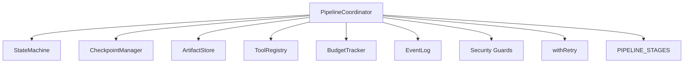
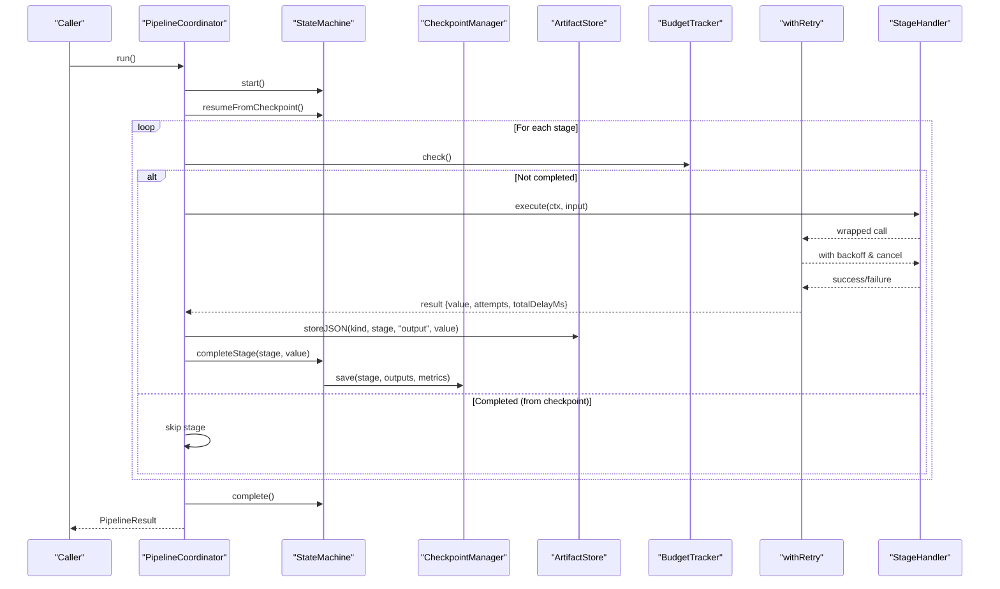
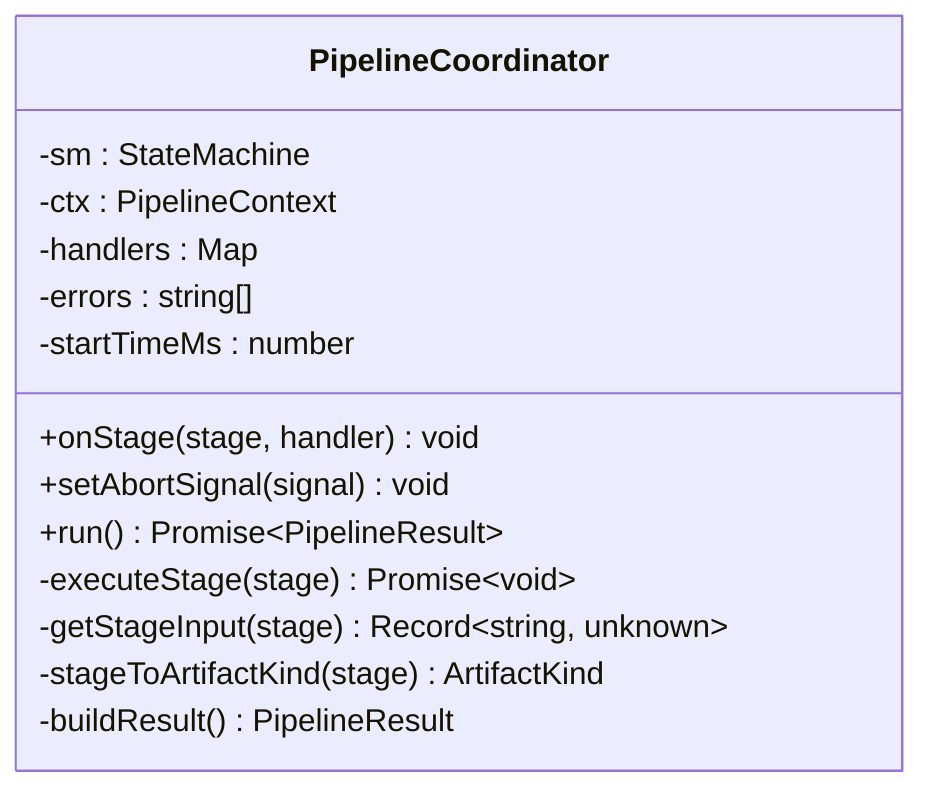
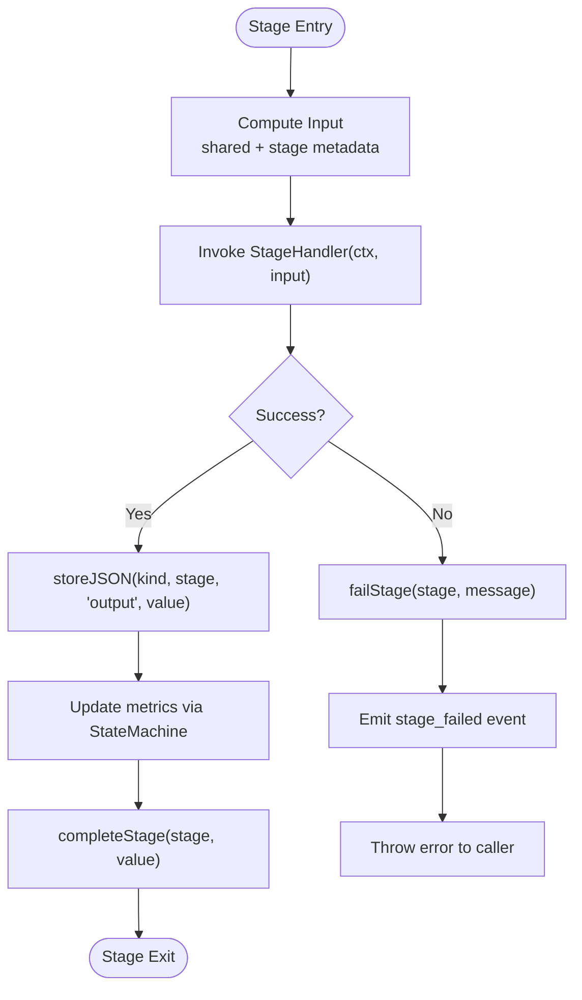
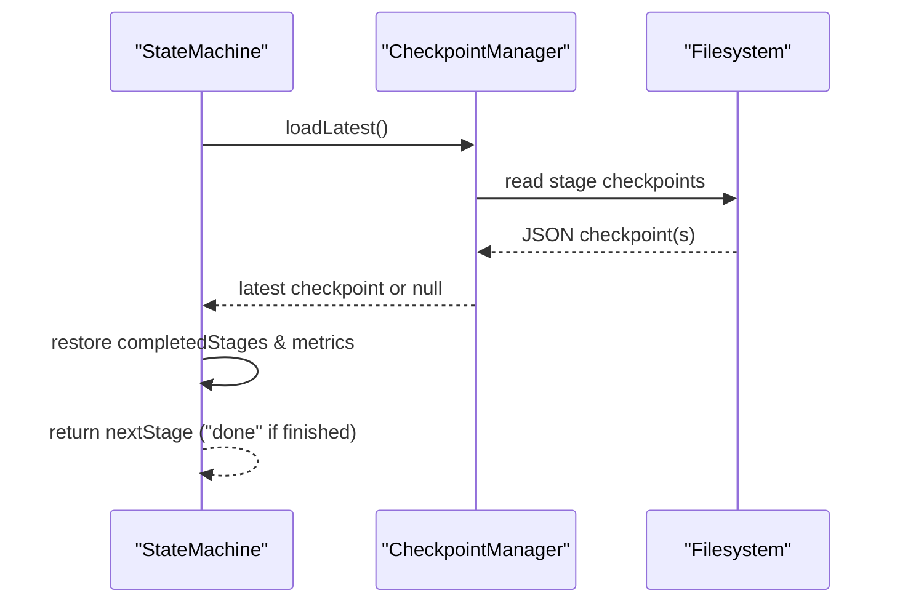
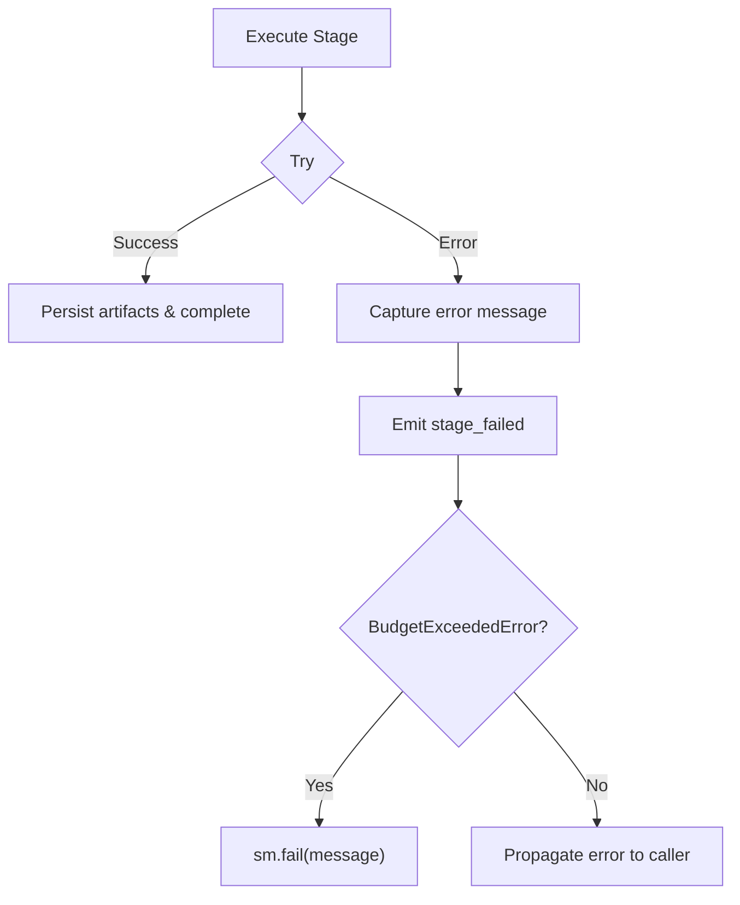
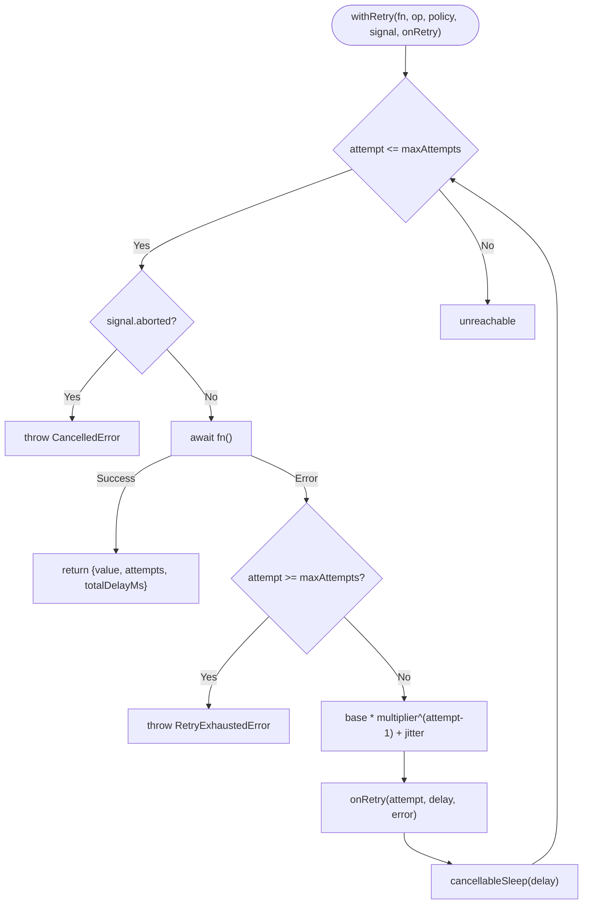
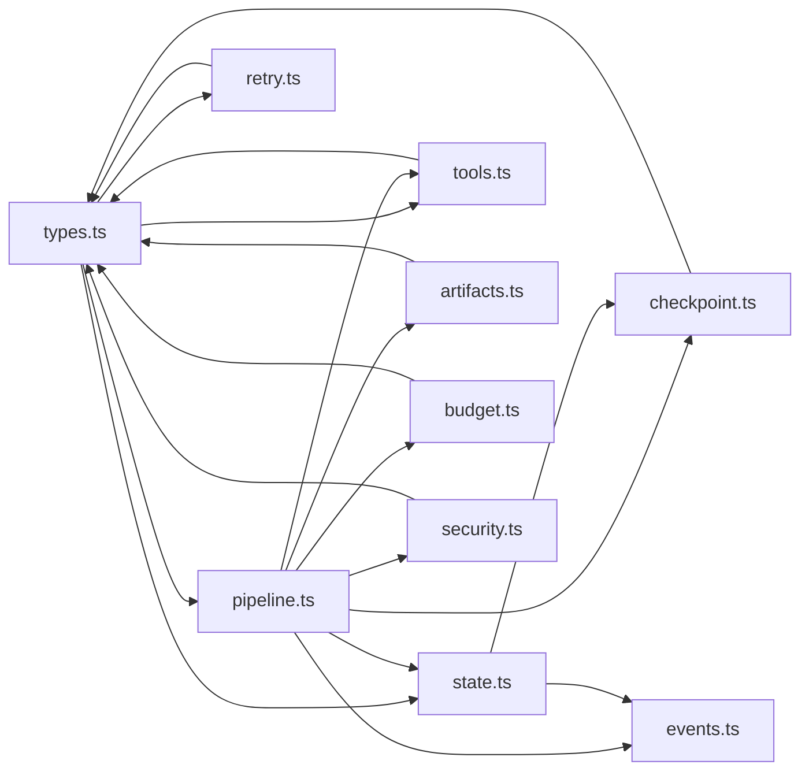

# Pipeline Orchestration

<cite>
**Referenced Files in This Document**
- [pipeline.ts](file://runtime/src/core/pipeline.ts)
- [types.ts](file://runtime/src/core/types.ts)
- [state.ts](file://runtime/src/core/state.ts)
- [checkpoint.ts](file://runtime/src/core/checkpoint.ts)
- [retry.ts](file://runtime/src/core/retry.ts)
- [budget.ts](file://runtime/src/core/budget.ts)
- [events.ts](file://runtime/src/core/events.ts)
- [artifacts.ts](file://runtime/src/core/artifacts.ts)
- [tools.ts](file://runtime/src/core/tools.ts)
- [security.ts](file://runtime/src/core/security.ts)
- [evaluation.ts](file://runtime/src/core/evaluation.ts)
</cite>

## Table of Contents
1. [Introduction](#introduction)
2. [Project Structure](#project-structure)
3. [Core Components](#core-components)
4. [Architecture Overview](#architecture-overview)
5. [Detailed Component Analysis](#detailed-component-analysis)
6. [Dependency Analysis](#dependency-analysis)
7. [Performance Considerations](#performance-considerations)
8. [Troubleshooting Guide](#troubleshooting-guide)
9. [Conclusion](#conclusion)
10. [Appendices](#appendices)

## Introduction
This document explains the pipeline orchestration system that coordinates FigmaForge’s multi-stage evaluation workflow from Figma input through final verification. It focuses on the PipelineCoordinator class, the stage handler pattern, context passing via PipelineContext, checkpoint management for resumability, error handling and budget enforcement, retry logic with exponential backoff, abort signal handling for cancellation, and monitoring approaches for long-running evaluations.

## Project Structure
The runtime core provides a deterministic, observable, and resumable pipeline:
- Types define stages, configuration, and defaults.
- StateMachine enforces lifecycle transitions and emits events.
- CheckpointManager persists stage outputs and metrics to resume interrupted runs.
- BudgetTracker enforces token/time/iteration limits and raises explicit errors when exceeded.
- Retry utilities wrap stage execution with exponential backoff and cancellation support.
- EventLog records an append-only audit trail for every action.
- ArtifactStore persists JSON and binary outputs with content addressing.
- ToolRegistry and tools provide typed, traceable operations (including Python bridging).
- Security boundaries enforce filesystem, shell, asset, and approval policies.

**Diagram sources**
- [pipeline.ts:82-124](file://runtime/src/core/pipeline.ts#L82-L124)
- [state.ts:48-100](file://runtime/src/core/state.ts#L48-L100)
- [checkpoint.ts:57-98](file://runtime/src/core/checkpoint.ts#L57-L98)
- [artifacts.ts:65-107](file://runtime/src/core/artifacts.ts#L65-L107)
- [tools.ts:66-130](file://runtime/src/core/tools.ts#L66-L130)
- [budget.ts:47-102](file://runtime/src/core/budget.ts#L47-L102)
- [events.ts:66-96](file://runtime/src/core/events.ts#L66-L96)
- [retry.ts:56-102](file://runtime/src/core/retry.ts#L56-L102)
- [types.ts:13-24](file://runtime/src/core/types.ts#L13-L24)

**Section sources**
- [pipeline.ts:1-124](file://runtime/src/core/pipeline.ts#L1-L124)
- [types.ts:13-24](file://runtime/src/core/types.ts#L13-L24)

## Core Components
- PipelineCoordinator: Orchestrates run lifecycle, stage execution, retries, budgets, checkpoints, artifacts, security, and event emission.
- StageHandler type: A function receiving PipelineContext and input, returning output used as stage result and artifact.
- PipelineContext: Shared runtime environment passed to each stage (config, events, checkpoints, artifacts, tools, budget, security, toolCtx, shared state, optional abort signal).
- StateMachine: Enforces ordered stage transitions, tracks attempts, updates metrics, and coordinates checkpointing.
- CheckpointManager: Persists per-stage outputs and metrics; supports loading latest or specific stage checkpoints and listing/clearing.
- BudgetTracker: Tracks tokens, time, iterations, repair iterations; throws BudgetExceededError when limits are breached.
- Retry utilities: withRetry wraps stage execution with exponential backoff, jitter, cancellation, and attempt callbacks.
- EventLog: Append-only structured log of all pipeline actions for auditing and replay.
- ArtifactStore: Content-addressed storage for JSON and binary outputs; maintains manifest.
- Tools: Typed registry and invocations; includes Python bridge tool for existing backend steps.
- Security: Path sandbox, secret redaction, shell command allowlist, asset validation, and approval gate.

**Section sources**
- [pipeline.ts:49-76](file://runtime/src/core/pipeline.ts#L49-L76)
- [state.ts:19-42](file://runtime/src/core/state.ts#L19-L42)
- [checkpoint.ts:20-51](file://runtime/src/core/checkpoint.ts#L20-L51)
- [budget.ts:14-41](file://runtime/src/core/budget.ts#L14-L41)
- [retry.ts:15-41](file://runtime/src/core/retry.ts#L15-L41)
- [events.ts:41-60](file://runtime/src/core/events.ts#L41-L60)
- [artifacts.ts:18-59](file://runtime/src/core/artifacts.ts#L18-L59)
- [tools.ts:19-51](file://runtime/src/core/tools.ts#L19-L51)
- [security.ts:18-26](file://runtime/src/core/security.ts#L18-L26)

## Architecture Overview
The coordinator drives a fixed sequence of stages defined by PIPELINE_STAGES. Each stage is executed with retry and budget checks, produces artifacts, and saves checkpoints. The state machine ensures correct ordering and status transitions. Events capture the full audit trail.

**Diagram sources**
- [pipeline.ts:138-207](file://runtime/src/core/pipeline.ts#L138-L207)
- [pipeline.ts:209-281](file://runtime/src/core/pipeline.ts#L209-L281)
- [state.ts:64-99](file://runtime/src/core/state.ts#L64-L99)
- [checkpoint.ts:72-98](file://runtime/src/core/checkpoint.ts#L72-L98)
- [retry.ts:56-102](file://runtime/src/core/retry.ts#L56-L102)
- [types.ts:13-24](file://runtime/src/core/types.ts#L13-L24)

## Detailed Component Analysis

### PipelineCoordinator
Responsibilities:
- Initialize state machine, security guards, tool context, and shared context.
- Register stage handlers via onStage.
- Run the pipeline: start, resume from checkpoint, iterate stages, enforce budgets, execute with retry, persist artifacts, update metrics, handle completion/failure.
- Build final result including runId, status, similarity score, repair iterations, duration, tokens, artifacts count, events, checkpoints, and errors.

Key behaviors:
- Abort signal propagation to both coordinator and tools for cancellation.
- Skip already-completed stages after resume.
- Emit detailed events for stage lifecycle, retries, and failures.

**Diagram sources**
- [pipeline.ts:82-124](file://runtime/src/core/pipeline.ts#L82-L124)
- [pipeline.ts:126-135](file://runtime/src/core/pipeline.ts#L126-L135)
- [pipeline.ts:138-207](file://runtime/src/core/pipeline.ts#L138-L207)
- [pipeline.ts:209-327](file://runtime/src/core/pipeline.ts#L209-L327)

**Section sources**
- [pipeline.ts:82-124](file://runtime/src/core/pipeline.ts#L82-L124)
- [pipeline.ts:126-135](file://runtime/src/core/pipeline.ts#L126-L135)
- [pipeline.ts:138-207](file://runtime/src/core/pipeline.ts#L138-L207)
- [pipeline.ts:209-327](file://runtime/src/core/pipeline.ts#L209-L327)

### Stage Handler Pattern and Context Passing
- StageHandler receives PipelineContext and a computed input object containing shared data plus stage metadata (stage, runId, fileKey, viewport).
- Outputs are stored as artifacts and passed to the next stage via shared context or artifact store.
- PipelineContext exposes config, events, checkpoints, artifacts, tools, budget, security guards, toolCtx, optional abortSignal, and a shared Map for cross-stage data.

**Diagram sources**
- [pipeline.ts:209-281](file://runtime/src/core/pipeline.ts#L209-L281)
- [pipeline.ts:283-294](file://runtime/src/core/pipeline.ts#L283-L294)
- [state.ts:82-109](file://runtime/src/core/state.ts#L82-L109)

**Section sources**
- [pipeline.ts:49-76](file://runtime/src/core/pipeline.ts#L49-L76)
- [pipeline.ts:283-294](file://runtime/src/core/pipeline.ts#L283-L294)

### Checkpoint Management
- After each successful stage, CheckpointManager.save writes a JSON checkpoint containing runId, stage, status, timestamp, outputs, metrics, and nextStage.
- On run start, StateMachine.resumeFromCheckpoint loads the latest valid checkpoint, restores completed stages and metrics, and returns the next stage to execute.
- Utilities support loading specific stage checkpoints, listing all, checking completion, and clearing checkpoints.

**Diagram sources**
- [checkpoint.ts:72-125](file://runtime/src/core/checkpoint.ts#L72-L125)
- [state.ts:189-206](file://runtime/src/core/state.ts#L189-L206)

**Section sources**
- [checkpoint.ts:20-51](file://runtime/src/core/checkpoint.ts#L20-L51)
- [checkpoint.ts:72-125](file://runtime/src/core/checkpoint.ts#L72-L125)
- [state.ts:189-206](file://runtime/src/core/state.ts#L189-L206)

### Error Handling Strategies
- Try-catch around stage execution captures errors, marks stage failed, emits stage_failed events, and propagates errors up.
- BudgetExceededError is caught at the stage boundary; emits budget_exceeded event and fails the run.
- Retry utilities throw RetryExhaustedError when maxAttempts reached; withTimeout throws CancelledError on timeout.
- Security violations raise SecurityViolation for path, shell, or approval issues.

**Diagram sources**
- [pipeline.ts:167-181](file://runtime/src/core/pipeline.ts#L167-L181)
- [pipeline.ts:267-280](file://runtime/src/core/pipeline.ts#L267-L280)
- [budget.ts:32-41](file://runtime/src/core/budget.ts#L32-L41)
- [retry.ts:25-41](file://runtime/src/core/retry.ts#L25-L41)
- [security.ts:18-26](file://runtime/src/core/security.ts#L18-L26)

**Section sources**
- [pipeline.ts:167-181](file://runtime/src/core/pipeline.ts#L167-L181)
- [pipeline.ts:267-280](file://runtime/src/core/pipeline.ts#L267-L280)
- [budget.ts:32-41](file://runtime/src/core/budget.ts#L32-L41)
- [retry.ts:25-41](file://runtime/src/core/retry.ts#L25-L41)
- [security.ts:18-26](file://runtime/src/core/security.ts#L18-L26)

### Retry Logic and Exponential Backoff
- withRetry executes the provided async function with configurable maxAttempts, baseDelayMs, backoffMultiplier, and maxDelayMs.
- Jitter is applied to avoid thundering herds.
- Cancellation is supported via AbortSignal; sleeps are cancellable.
- onRetry callback enables tracking of attempts and delays.

**Diagram sources**
- [retry.ts:56-102](file://runtime/src/core/retry.ts#L56-L102)
- [retry.ts:104-128](file://runtime/src/core/retry.ts#L104-L128)
- [types.ts:72-77](file://runtime/src/core/types.ts#L72-L77)
- [types.ts:236-241](file://runtime/src/core/types.ts#L236-L241)

**Section sources**
- [retry.ts:56-102](file://runtime/src/core/retry.ts#L56-L102)
- [retry.ts:104-128](file://runtime/src/core/retry.ts#L104-L128)
- [types.ts:72-77](file://runtime/src/core/types.ts#L72-L77)
- [types.ts:236-241](file://runtime/src/core/types.ts#L236-L241)

### Configuration and Stage Registration
- RuntimeConfig defines run parameters including retry policy, budgets, thresholds, viewport, target framework/styling, and paths.
- Defaults are provided for retry, budgets, and common settings.
- Stages are registered using onStage with a StageHandler that implements the required behavior.

Example usage patterns:
- Create a PipelineCoordinator with config, events, checkpoints, artifacts, tools, budget, and optional approval callback.
- Register handlers for each stage via onStage.
- Optionally set an AbortSignal for cancellation.
- Call run() to execute the pipeline and obtain a PipelineResult.

**Section sources**
- [types.ts:205-261](file://runtime/src/core/types.ts#L205-L261)
- [pipeline.ts:126-135](file://runtime/src/core/pipeline.ts#L126-L135)

### Abort Signal Handling
- setAbortSignal attaches an AbortSignal to both the pipeline context and tool context.
- The coordinator checks abort before each stage and cancels the run if signaled.
- Retry sleeps are cancellable; tools spawned via PythonTool receive the signal.

**Section sources**
- [pipeline.ts:131-135](file://runtime/src/core/pipeline.ts#L131-L135)
- [pipeline.ts:161-165](file://runtime/src/core/pipeline.ts#L161-L165)
- [retry.ts:66-69](file://runtime/src/core/retry.ts#L66-L69)
- [tools.ts:169-178](file://runtime/src/core/tools.ts#L169-L178)

### Monitoring Approaches
- EventLog emits structured events for run lifecycle, stage transitions, retries, budget violations, approvals, tool invocations, and artifacts.
- Artifacts include an event_log saved at the end of the run for post-mortem analysis.
- Metrics are updated per stage and persisted in checkpoints and final result.

**Section sources**
- [events.ts:41-60](file://runtime/src/core/events.ts#L41-L60)
- [events.ts:66-96](file://runtime/src/core/events.ts#L66-L96)
- [pipeline.ts:202-206](file://runtime/src/core/pipeline.ts#L202-L206)
- [pipeline.ts:248-266](file://runtime/src/core/pipeline.ts#L248-L266)

## Dependency Analysis
High-level dependencies among core modules:

**Diagram sources**
- [types.ts:13-24](file://runtime/src/core/types.ts#L13-L24)
- [pipeline.ts:12-26](file://runtime/src/core/pipeline.ts#L12-L26)
- [state.ts:9-13](file://runtime/src/core/state.ts#L9-L13)
- [checkpoint.ts:11-15](file://runtime/src/core/checkpoint.ts#L11-L15)
- [retry.ts:8-9](file://runtime/src/core/retry.ts#L8-L9)
- [budget.ts:8-9](file://runtime/src/core/budget.ts#L8-L9)
- [artifacts.ts:9-13](file://runtime/src/core/artifacts.ts#L9-L13)
- [tools.ts:13-14](file://runtime/src/core/tools.ts#L13-L14)
- [security.ts:11-13](file://runtime/src/core/security.ts#L11-L13)

**Section sources**
- [pipeline.ts:12-26](file://runtime/src/core/pipeline.ts#L12-L26)
- [state.ts:9-13](file://runtime/src/core/state.ts#L9-L13)
- [checkpoint.ts:11-15](file://runtime/src/core/checkpoint.ts#L11-L15)
- [retry.ts:8-9](file://runtime/src/core/retry.ts#L8-L9)
- [budget.ts:8-9](file://runtime/src/core/budget.ts#L8-L9)
- [artifacts.ts:9-13](file://runtime/src/core/artifacts.ts#L9-L13)
- [tools.ts:13-14](file://runtime/src/core/tools.ts#L13-L14)
- [security.ts:11-13](file://runtime/src/core/security.ts#L11-L13)

## Performance Considerations
- Use reasonable retry policies to balance resilience and latency; default values provide moderate backoff.
- Avoid excessive artifact sizes; prefer streaming or chunking where possible.
- Monitor budget dimensions to prevent long-running runs from exceeding time or iteration limits.
- Leverage checkpoints to reduce rework after interruptions.
- Prefer deterministic stages to minimize variability and improve reproducibility.

[No sources needed since this section provides general guidance]

## Troubleshooting Guide
Common issues and remedies:
- Budget exceeded: Inspect tokens/time/iterations/repair iterations; adjust budgets or optimize stages.
- Retry exhaustion: Review transient failures; tune retry policy or fix underlying instability.
- Checkpoint corruption: LoadLatest skips corrupt files; ensure stable serialization and disk access.
- Security violations: Validate approved directories, allowed commands, and asset types; configure approval gates appropriately.
- Aborted runs: Ensure callers propagate AbortSignal correctly and handle CancelledError gracefully.

**Section sources**
- [budget.ts:97-131](file://runtime/src/core/budget.ts#L97-L131)
- [retry.ts:25-41](file://runtime/src/core/retry.ts#L25-L41)
- [checkpoint.ts:101-125](file://runtime/src/core/checkpoint.ts#L101-L125)
- [security.ts:47-71](file://runtime/src/core/security.ts#L47-L71)
- [security.ts:208-238](file://runtime/src/core/security.ts#L208-L238)
- [security.ts:370-394](file://runtime/src/core/security.ts#L370-L394)

## Conclusion
The pipeline orchestration system provides a robust, observable, and resumable execution model for FigmaForge’s evaluation workflow. PipelineCoordinator centralizes control flow while delegating concerns to specialized components: state management, checkpointing, budgeting, retrying, artifact storage, tool invocation, and security enforcement. Together, these enable reliable long-running evaluations with clear monitoring and graceful failure modes.

[No sources needed since this section summarizes without analyzing specific files]

## Appendices

### Example: Pipeline Configuration and Stage Registration
- Construct RuntimeConfig with desired retry policy, budgets, thresholds, viewport, target framework/styling, and paths.
- Instantiate PipelineCoordinator with config, events, checkpoints, artifacts, tools, budget, and optional approval callback.
- Register handlers for each stage using onStage.
- Optionally set an AbortSignal for cancellation.
- Invoke run() to execute and retrieve PipelineResult.

**Section sources**
- [types.ts:205-261](file://runtime/src/core/types.ts#L205-L261)
- [pipeline.ts:82-124](file://runtime/src/core/pipeline.ts#L82-L124)
- [pipeline.ts:126-135](file://runtime/src/core/pipeline.ts#L126-L135)
- [pipeline.ts:138-207](file://runtime/src/core/pipeline.ts#L138-L207)

### Example: Evaluation Harness Integration
- Use evaluation utilities to manage golden fixtures, compare snapshots, inject failures, and collect metrics for testing pipelines end-to-end.

**Section sources**
- [evaluation.ts:21-46](file://runtime/src/core/evaluation.ts#L21-L46)
- [evaluation.ts:82-117](file://runtime/src/core/evaluation.ts#L82-L117)
- [evaluation.ts:169-224](file://runtime/src/core/evaluation.ts#L169-L224)
- [evaluation.ts:299-355](file://runtime/src/core/evaluation.ts#L299-L355)