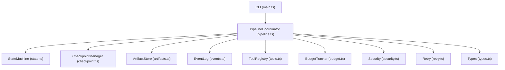
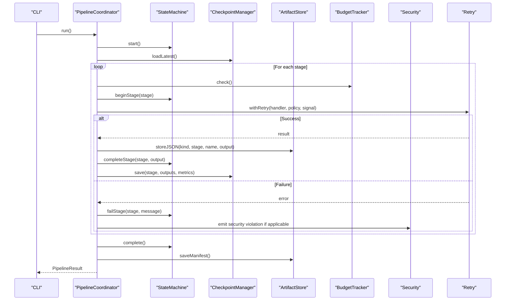
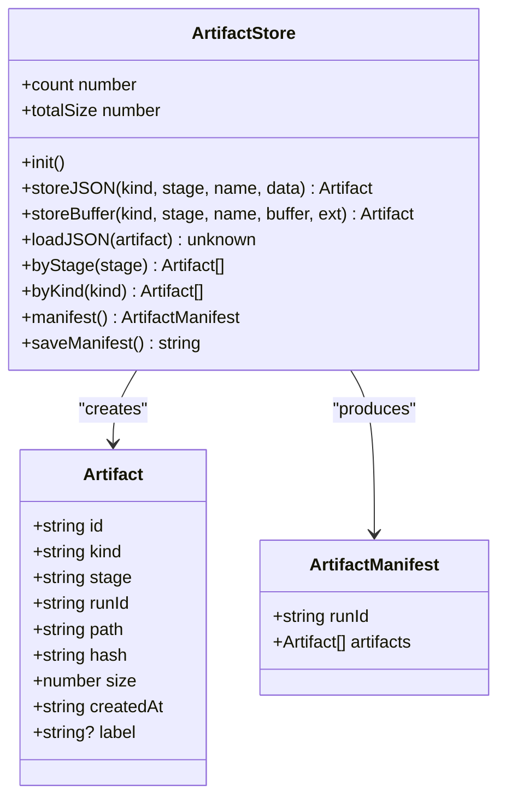
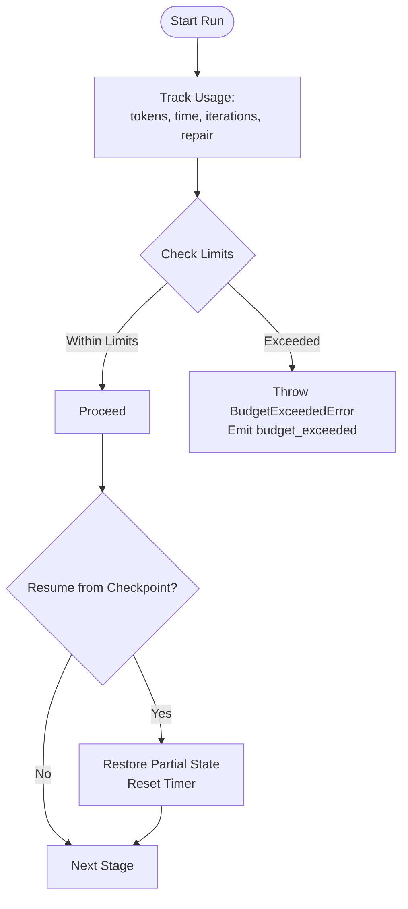
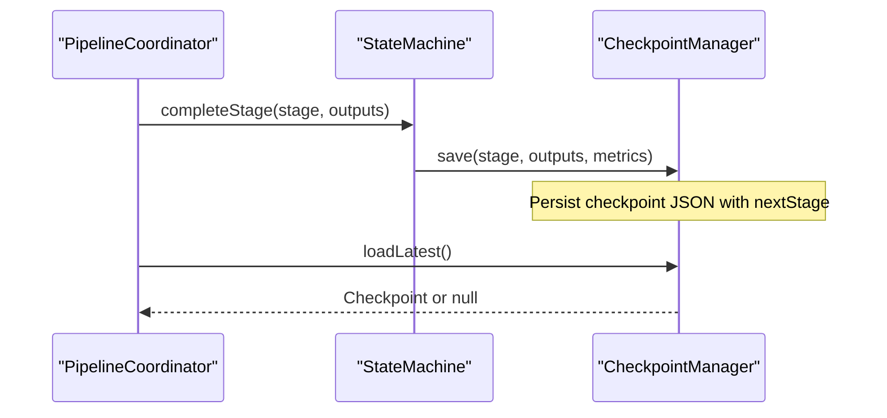
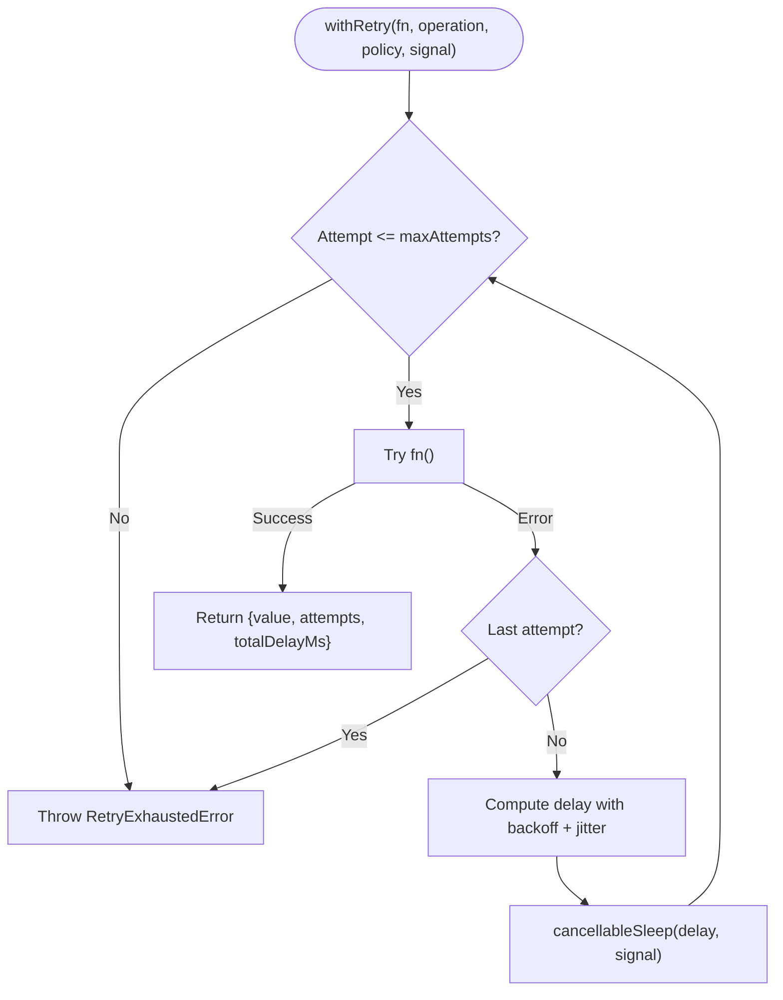
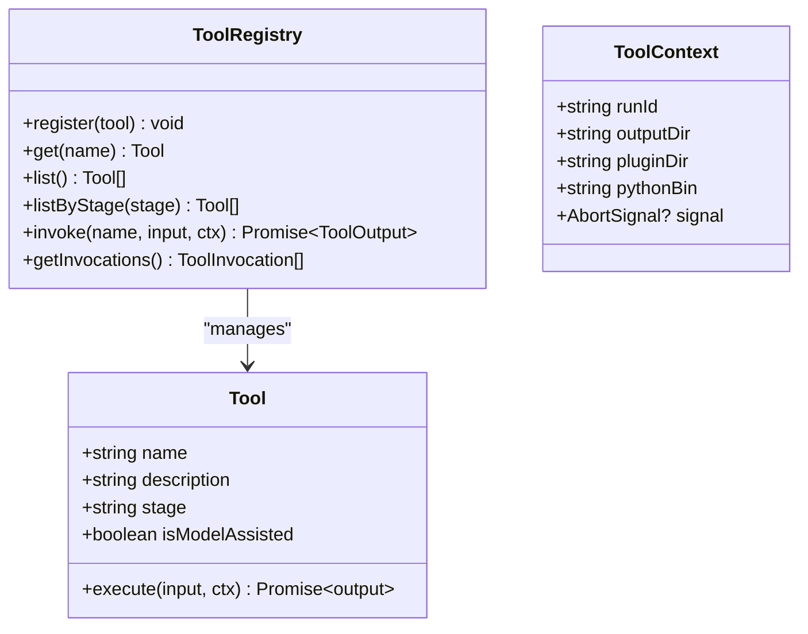
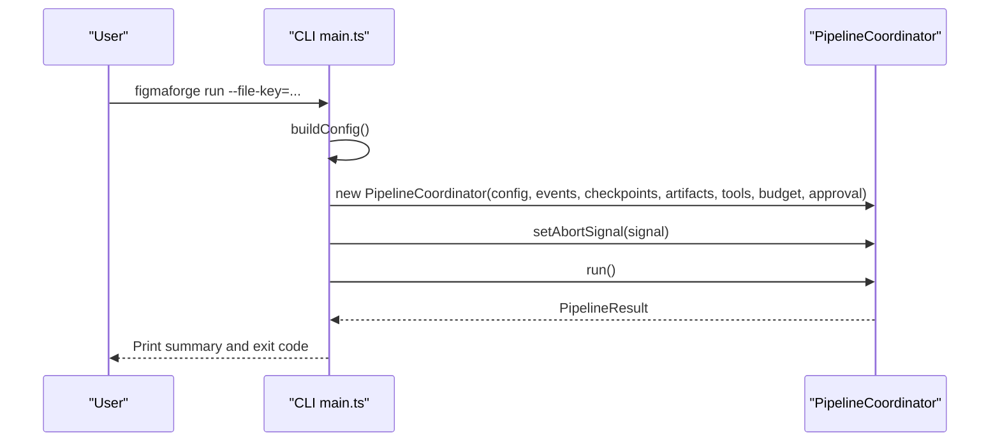
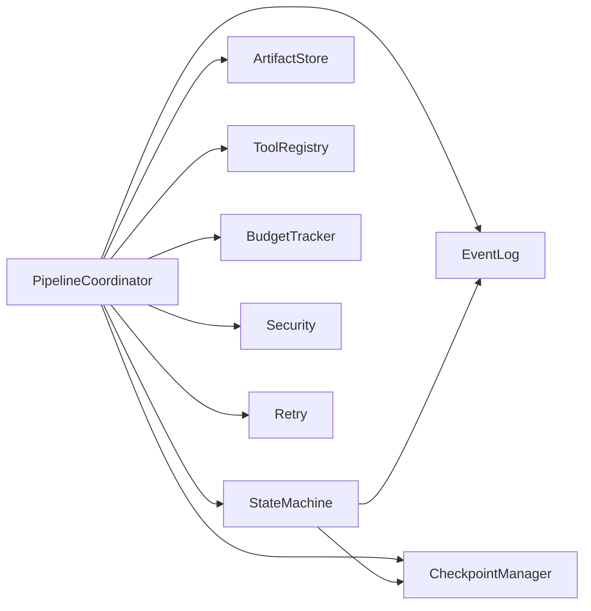

# Runtime Evaluation System

<cite>
**Referenced Files in This Document**
- [pipeline.ts](file://runtime/src/core/pipeline.ts)
- [artifacts.ts](file://runtime/src/core/artifacts.ts)
- [security.ts](file://runtime/src/core/security.ts)
- [budget.ts](file://runtime/src/core/budget.ts)
- [checkpoint.ts](file://runtime/src/core/checkpoint.ts)
- [types.ts](file://runtime/src/core/types.ts)
- [state.ts](file://runtime/src/core/state.ts)
- [retry.ts](file://runtime/src/core/retry.ts)
- [events.ts](file://runtime/src/core/events.ts)
- [tools.ts](file://runtime/src/core/tools.ts)
- [main.ts](file://runtime/src/cli/main.ts)
- [package.json](file://runtime/package.json)
</cite>

## Table of Contents
1. [Introduction](#introduction)
2. [Project Structure](#project-structure)
3. [Core Components](#core-components)
4. [Architecture Overview](#architecture-overview)
5. [Detailed Component Analysis](#detailed-component-analysis)
6. [Dependency Analysis](#dependency-analysis)
7. [Performance Considerations](#performance-considerations)
8. [Troubleshooting Guide](#troubleshooting-guide)
9. [Conclusion](#conclusion)
10. [Appendices](#appendices)

## Introduction
This document describes FigmaForge’s runtime evaluation system built in TypeScript. It orchestrates a deterministic pipeline that transforms Figma input into generated code, renders and compares outputs, and iteratively repairs differences while enforcing security controls and budget limits. The system provides:
- Pipeline orchestration with checkpoint management, error handling, and retry logic
- Artifact management with versioning via content hashing, metadata tracking, storage strategies, and retrieval methods
- Security controls including approval gates, resource monitoring, sandboxed execution environments, and audit logging
- Budget tracking for tokens, time, iterations, and repair iterations
- CLI entry points to run, inspect, replay, render, compare, and repair stages

## Project Structure
The runtime is organized under runtime/src with core modules providing the orchestration, state, artifacts, security, budgets, events, tools, and retry utilities. A CLI module wires configuration and commands to the core components.



**Diagram sources**
- [main.ts:185-227](file://runtime/src/cli/main.ts#L185-L227)
- [pipeline.ts:82-124](file://runtime/src/core/pipeline.ts#L82-L124)
- [state.ts:48-57](file://runtime/src/core/state.ts#L48-L57)
- [checkpoint.ts:57-65](file://runtime/src/core/checkpoint.ts#L57-L65)
- [artifacts.ts:65-74](file://runtime/src/core/artifacts.ts#L65-L74)
- [events.ts:66-70](file://runtime/src/core/events.ts#L66-L70)
- [tools.ts:66-76](file://runtime/src/core/tools.ts#L66-L76)
- [budget.ts:47-54](file://runtime/src/core/budget.ts#L47-L54)
- [security.ts:32-401](file://runtime/src/core/security.ts#L32-L401)
- [retry.ts:56-102](file://runtime/src/core/retry.ts#L56-L102)
- [types.ts:13-24](file://runtime/src/core/types.ts#L13-L24)

**Section sources**
- [main.ts:185-227](file://runtime/src/cli/main.ts#L185-L227)
- [pipeline.ts:82-124](file://runtime/src/core/pipeline.ts#L82-L124)
- [types.ts:13-24](file://runtime/src/core/types.ts#L13-L24)

## Core Components
- PipelineCoordinator: Orchestrates stage execution, integrates state machine, checkpoints, artifacts, tools, budget, and security; handles retries and metrics updates.
- StateMachine: Manages run lifecycle, stage transitions, status changes, and checkpoint coordination.
- CheckpointManager: Persists per-stage checkpoints enabling resume from latest valid state.
- ArtifactStore: Content-addressed storage for JSON and binary artifacts with manifest generation.
- EventLog: Append-only structured event log for auditability and replay.
- ToolRegistry: Typed tool registry and invocation tracking; includes Python bridge tool.
- BudgetTracker: Tracks token usage, elapsed time, iterations, and repair iterations; enforces limits.
- Security: PathSandbox, SecretGuard, ShellGuard, AssetValidator, ApprovalGate enforce safe execution.
- Retry: Exponential backoff with jitter, cancellation support, and timeout helpers.
- Types: Defines pipeline stages, config, budgets, retry policy, framework/styling targets, and defaults.

**Section sources**
- [pipeline.ts:82-124](file://runtime/src/core/pipeline.ts#L82-L124)
- [state.ts:48-57](file://runtime/src/core/state.ts#L48-L57)
- [checkpoint.ts:57-65](file://runtime/src/core/checkpoint.ts#L57-L65)
- [artifacts.ts:65-74](file://runtime/src/core/artifacts.ts#L65-L74)
- [events.ts:66-70](file://runtime/src/core/events.ts#L66-L70)
- [tools.ts:66-76](file://runtime/src/core/tools.ts#L66-L76)
- [budget.ts:47-54](file://runtime/src/core/budget.ts#L47-L54)
- [security.ts:32-401](file://runtime/src/core/security.ts#L32-L401)
- [retry.ts:56-102](file://runtime/src/core/retry.ts#L56-L102)
- [types.ts:13-24](file://runtime/src/core/types.ts#L13-L24)

## Architecture Overview
The runtime executes a fixed sequence of stages defined by types. Each stage is wrapped with retry logic, budget checks, and emits events. Outputs are stored as artifacts and checkpoints are saved after each stage to enable resumption.



**Diagram sources**
- [pipeline.ts:138-207](file://runtime/src/core/pipeline.ts#L138-L207)
- [pipeline.ts:209-281](file://runtime/src/core/pipeline.ts#L209-L281)
- [state.ts:64-99](file://runtime/src/core/state.ts#L64-L99)
- [checkpoint.ts:72-98](file://runtime/src/core/checkpoint.ts#L72-L98)
- [artifacts.ts:81-107](file://runtime/src/core/artifacts.ts#L81-L107)
- [retry.ts:56-102](file://runtime/src/core/retry.ts#L56-L102)

## Detailed Component Analysis

### Pipeline Orchestration
- Stage execution order is enforced by a fixed list of stages.
- Each stage handler receives a shared context with config, events, checkpoints, artifacts, tools, budget, and security boundaries.
- Stages are executed with retry using exponential backoff and jitter; attempts are tracked and reported via events.
- After successful completion, outputs are stored as artifacts and checkpoints are persisted with cumulative metrics.
- Budget checks occur before each stage; exceeding limits triggers failure and appropriate events.

```mermaid
flowchart TD
Start(["Run Pipeline"]) --> Init["Initialize StateMachine<br/>Load Checkpoints"]
Init --> Loop{"Next Stage?"}
Loop --> |Yes| CheckBudget["Budget.check()"]
CheckBudget --> |Exceeded| Fail["Fail Run<br/>Emit budget_exceeded"]
CheckBudget --> |OK| Begin["Begin Stage"]
Begin --> Execute["Execute Handler with Retry"]
Execute --> |Success| Store["Store Artifact<br/>Update Metrics"]
Store --> Checkpoint["Save Checkpoint"]
Checkpoint --> Next["Complete Stage"]
Next --> Loop
Execute --> |Failure| FailStage["Fail Stage<br/>Emit stage_failed"]
FailStage --> Loop
Loop --> |No| Complete["Complete Run<br/>Save Manifest"]
Complete --> End(["Pipeline Result"])
```



**Diagram sources**
- [pipeline.ts:138-207](file://runtime/src/core/pipeline.ts#L138-L207)
- [pipeline.ts:209-281](file://runtime/src/core/pipeline.ts#L209-L281)
- [state.ts:64-99](file://runtime/src/core/state.ts#L64-L99)
- [checkpoint.ts:72-98](file://runtime/src/core/checkpoint.ts#L72-L98)
- [budget.ts:96-131](file://runtime/src/core/budget.ts#L96-L131)

**Section sources**
- [pipeline.ts:138-207](file://runtime/src/core/pipeline.ts#L138-L207)
- [pipeline.ts:209-281](file://runtime/src/core/pipeline.ts#L209-L281)
- [state.ts:64-99](file://runtime/src/core/state.ts#L64-L99)
- [checkpoint.ts:72-98](file://runtime/src/core/checkpoint.ts#L72-L98)
- [budget.ts:96-131](file://runtime/src/core/budget.ts#L96-L131)

### Artifact Management
- Artifacts are content-addressed using SHA-256 hashes derived from serialized JSON or raw buffers.
- Each artifact records kind, stage, runId, path, hash, size, timestamp, and optional label.
- Storage strategy:
  - JSON artifacts: written as .json files named with stage, name, and hash.
  - Binary artifacts: written with extension and hashed buffer.
- Retrieval:
  - Load by artifact object path.
  - Query by stage or kind.
  - Full manifest listing and persistence for auditing.



**Diagram sources**
- [artifacts.ts:65-176](file://runtime/src/core/artifacts.ts#L65-L176)

**Section sources**
- [artifacts.ts:65-176](file://runtime/src/core/artifacts.ts#L65-L176)

### Security Controls
- PathSandbox: Restricts filesystem access to approved directories; validates paths before read/write operations.
- SecretGuard: Detects and redacts secrets in text and objects using regex patterns; supports custom patterns and placeholders.
- ShellGuard: Whitelists allowed commands and rejects dangerous argument patterns (e.g., chaining operators).
- AssetValidator: Validates external assets by size, MIME type proxy via extension, and emptiness checks.
- ApprovalGate: Requires explicit user consent for destructive actions; supports pre-approvals and session caching.

```mermaid
classDiagram
class PathSandbox {
+approve(dir) void
+assertAllowed(filePath) void
+isAllowed(filePath) boolean
+readFileSync(filePath, encoding) string
+writeFileSync(filePath, data) void
+getApprovedDirs() string[]
}
class SecretGuard {
+addPattern(pattern) void
+setPlaceholder(text) void
+containsSecrets(text) boolean
+redact(text) string
+redactObject(obj) unknown
}
class ShellGuard {
+allow(command) void
+assertAllowed(command, args) void
+isAllowed(command, args) boolean
}
class AssetValidator {
+validateFile(filePath) {valid, error?}
+validateBuffer(buffer, ext) {valid, error?}
}
class ApprovalGate {
+setCallback(callback) void
+preApprove(action) void
+assertApproved(request) Promise<void>
+resetApprovals() void
}
class SecurityViolation {
+string rule
}
```

**Diagram sources**
- [security.ts:18-103](file://runtime/src/core/security.ts#L18-L103)
- [security.ts:121-179](file://runtime/src/core/security.ts#L121-L179)
- [security.ts:196-239](file://runtime/src/core/security.ts#L196-L239)
- [security.ts:262-328](file://runtime/src/core/security.ts#L262-L328)
- [security.ts:351-400](file://runtime/src/core/security.ts#L351-L400)

**Section sources**
- [security.ts:18-103](file://runtime/src/core/security.ts#L18-L103)
- [security.ts:121-179](file://runtime/src/core/security.ts#L121-L179)
- [security.ts:196-239](file://runtime/src/core/security.ts#L196-L239)
- [security.ts:262-328](file://runtime/src/core/security.ts#L262-L328)
- [security.ts:351-400](file://runtime/src/core/security.ts#L351-L400)

### Budget Tracking
- Tracks tokens used, elapsed time, general iterations, and repair iterations.
- Enforces limits per dimension; throws a specific error when exceeded.
- Supports restoring partial state from checkpoints and resetting timers on resume.
- Provides remaining budget fractions for monitoring.



**Diagram sources**
- [budget.ts:47-148](file://runtime/src/core/budget.ts#L47-L148)
- [pipeline.ts:167-181](file://runtime/src/core/pipeline.ts#L167-L181)

**Section sources**
- [budget.ts:47-148](file://runtime/src/core/budget.ts#L47-L148)
- [pipeline.ts:167-181](file://runtime/src/core/pipeline.ts#L167-L181)

### Checkpoint Management
- Saves a checkpoint after each stage completes, including outputs and cumulative metrics.
- Loads the latest valid checkpoint to resume runs; skips corrupt checkpoints gracefully.
- Lists all checkpoints for a run and clears them when needed.



**Diagram sources**
- [state.ts:82-99](file://runtime/src/core/state.ts#L82-L99)
- [checkpoint.ts:72-98](file://runtime/src/core/checkpoint.ts#L72-L98)
- [checkpoint.ts:100-125](file://runtime/src/core/checkpoint.ts#L100-L125)

**Section sources**
- [state.ts:82-99](file://runtime/src/core/state.ts#L82-L99)
- [checkpoint.ts:72-98](file://runtime/src/core/checkpoint.ts#L72-L98)
- [checkpoint.ts:100-125](file://runtime/src/core/checkpoint.ts#L100-L125)

### Retry Logic
- Wraps async functions with configurable retry policies.
- Implements exponential backoff with jitter and supports cancellation via AbortSignal.
- Emits retry attempts through callbacks and tracks total delay.



**Diagram sources**
- [retry.ts:56-102](file://runtime/src/core/retry.ts#L56-L102)
- [retry.ts:104-128](file://runtime/src/core/retry.ts#L104-L128)

**Section sources**
- [retry.ts:56-102](file://runtime/src/core/retry.ts#L56-L102)
- [retry.ts:104-128](file://runtime/src/core/retry.ts#L104-L128)

### Tools and Python Bridge
- ToolRegistry manages typed tools with unique names, descriptions, stages, and model-assisted flags.
- Invocations are tracked with timing and error details for auditability.
- Python bridge tool spawns python3 processes within plugin directory, captures stdout/stderr, and parses JSON output when available.



**Diagram sources**
- [tools.ts:66-130](file://runtime/src/core/tools.ts#L66-L130)
- [tools.ts:158-202](file://runtime/src/core/tools.ts#L158-L202)

**Section sources**
- [tools.ts:66-130](file://runtime/src/core/tools.ts#L66-L130)
- [tools.ts:158-202](file://runtime/src/core/tools.ts#L158-L202)

### CLI Entry Points
- Commands: run, inspect, render, compare, repair, replay.
- Builds RuntimeConfig from flags, sets up approval callback, abort signals, and invokes PipelineCoordinator.
- Inspect and replay provide visibility into artifacts, checkpoints, and event logs.



**Diagram sources**
- [main.ts:112-157](file://runtime/src/cli/main.ts#L112-L157)
- [main.ts:185-227](file://runtime/src/cli/main.ts#L185-L227)

**Section sources**
- [main.ts:112-157](file://runtime/src/cli/main.ts#L112-L157)
- [main.ts:185-227](file://runtime/src/cli/main.ts#L185-L227)

## Dependency Analysis
The runtime exhibits clear separation of concerns:
- PipelineCoordinator depends on StateMachine, CheckpointManager, ArtifactStore, EventLog, ToolRegistry, BudgetTracker, and Security components.
- StateMachine coordinates with EventLog and CheckpointManager for lifecycle and persistence.
- ArtifactStore persists outputs and manifests; does not depend on orchestration logic.
- Security components are independent utilities composed into the pipeline context.
- Retry utilities are pure functions used by PipelineCoordinator.



**Diagram sources**
- [pipeline.ts:82-124](file://runtime/src/core/pipeline.ts#L82-L124)
- [state.ts:48-57](file://runtime/src/core/state.ts#L48-L57)

**Section sources**
- [pipeline.ts:82-124](file://runtime/src/core/pipeline.ts#L82-L124)
- [state.ts:48-57](file://runtime/src/core/state.ts#L48-L57)

## Performance Considerations
- Retry with exponential backoff and jitter reduces contention and transient failures impact.
- Checkpointing enables resumable runs, minimizing rework after interruptions.
- Budget checks prevent runaway resource consumption; monitor remaining fractions for proactive throttling.
- Artifact hashing ensures deduplication and integrity verification; consider pruning old artifacts to manage disk usage.
- Tool invocations are timed and logged; use this data to identify slow stages and optimize handlers.

[No sources needed since this section provides general guidance]

## Troubleshooting Guide
Common issues and diagnostics:
- Budget exceeded: Review BudgetTracker checks and adjust limits; inspect budget_exceeded events for dimension details.
- Stage failures: Use stage_failed events and error messages; leverage retry logs to understand transient vs persistent errors.
- Security violations: PathSandbox, ShellGuard, or ApprovalGate may block operations; verify approved directories, allowed commands, and approval callbacks.
- Missing artifacts: Ensure ArtifactStore stores outputs per stage; check manifest and artifact kinds.
- Checkpoint corruption: CheckpointManager skips invalid checkpoints; ensure JSON writes succeed and disk space is sufficient.

**Section sources**
- [budget.ts:96-131](file://runtime/src/core/budget.ts#L96-L131)
- [events.ts:16-39](file://runtime/src/core/events.ts#L16-L39)
- [security.ts:18-103](file://runtime/src/core/security.ts#L18-L103)
- [security.ts:196-239](file://runtime/src/core/security.ts#L196-L239)
- [security.ts:351-400](file://runtime/src/core/security.ts#L351-L400)
- [artifacts.ts:81-107](file://runtime/src/core/artifacts.ts#L81-L107)
- [checkpoint.ts:100-125](file://runtime/src/core/checkpoint.ts#L100-L125)

## Conclusion
FigmaForge’s runtime evaluation system provides a robust, secure, and auditable pipeline for transforming design inputs into verified outputs. Its modular architecture separates orchestration, state, artifacts, security, budgets, and tools, enabling extensibility and maintainability. With checkpointing, retry logic, and comprehensive event logging, it supports resilient execution and detailed troubleshooting.

[No sources needed since this section summarizes without analyzing specific files]

## Appendices

### Example: Pipeline Execution Flow
- Configure RuntimeConfig via CLI flags (run-id, file-key, thresholds, viewport, budgets).
- Initialize EventLog, CheckpointManager, ArtifactStore, ToolRegistry, BudgetTracker.
- Set approval callback based on requireApproval flag.
- Create AbortController for cancellation and pass signal to PipelineCoordinator.
- Execute run(); collect PipelineResult and print summary.

**Section sources**
- [main.ts:112-157](file://runtime/src/cli/main.ts#L112-L157)
- [main.ts:185-227](file://runtime/src/cli/main.ts#L185-L227)

### Example: Artifact Versioning
- Each artifact is identified by a content hash derived from serialized data or buffer.
- Files are named with stage, name, and hash to ensure uniqueness and traceability.
- Manifest lists all artifacts for a run, supporting retrieval by kind or stage.

**Section sources**
- [artifacts.ts:81-107](file://runtime/src/core/artifacts.ts#L81-L107)
- [artifacts.ts:143-164](file://runtime/src/core/artifacts.ts#L143-L164)

### Example: Security Gate Configuration
- PathSandbox initialized with approved directories; dynamically approve additional dirs at runtime.
- ShellGuard restricts commands to a whitelist and blocks dangerous arguments.
- ApprovalGate requires explicit consent for destructive actions; can be bypassed via CLI flag.

**Section sources**
- [security.ts:32-103](file://runtime/src/core/security.ts#L32-L103)
- [security.ts:196-239](file://runtime/src/core/security.ts#L196-L239)
- [security.ts:351-400](file://runtime/src/core/security.ts#L351-L400)
- [main.ts:124-143](file://runtime/src/cli/main.ts#L124-L143)

### Example: Performance Monitoring Approaches
- Use EventLog to aggregate stage durations, retry counts, and errors.
- Monitor BudgetTracker.remaining() to proactively adjust workloads.
- Analyze ToolRegistry invocations for latency and failure rates.

**Section sources**
- [events.ts:66-138](file://runtime/src/core/events.ts#L66-L138)
- [budget.ts:133-148](file://runtime/src/core/budget.ts#L133-L148)
- [tools.ts:93-130](file://runtime/src/core/tools.ts#L93-L130)