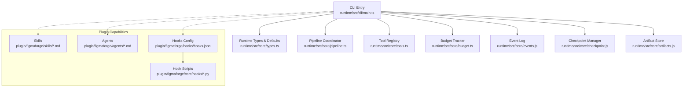
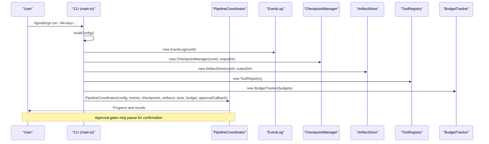
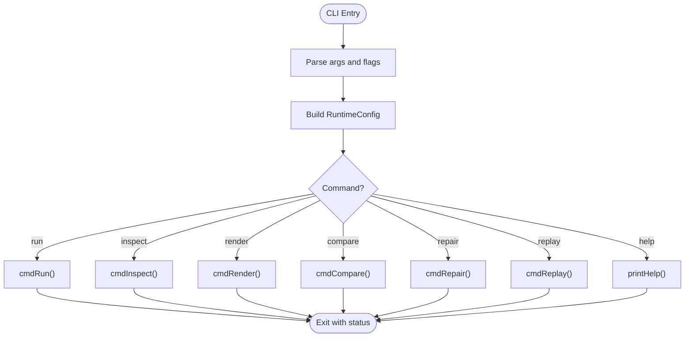
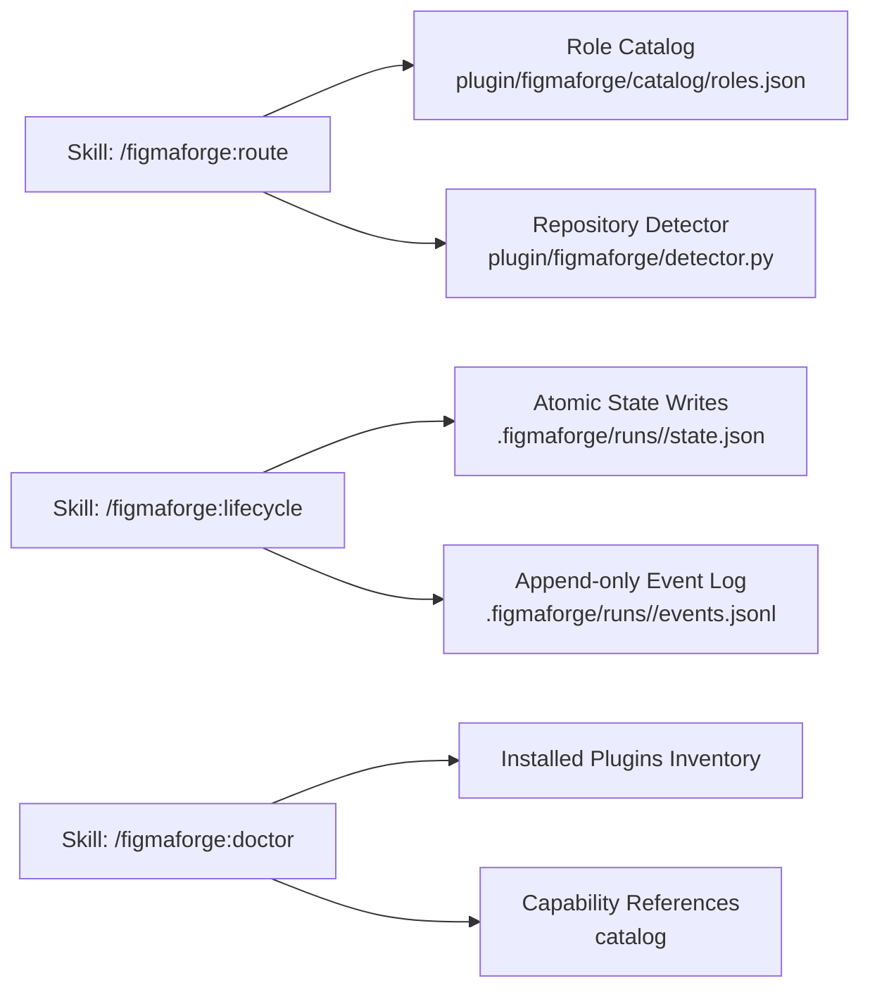
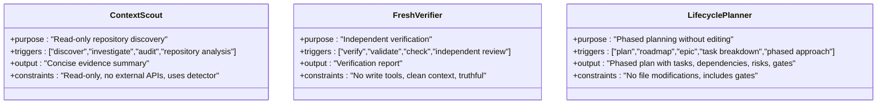
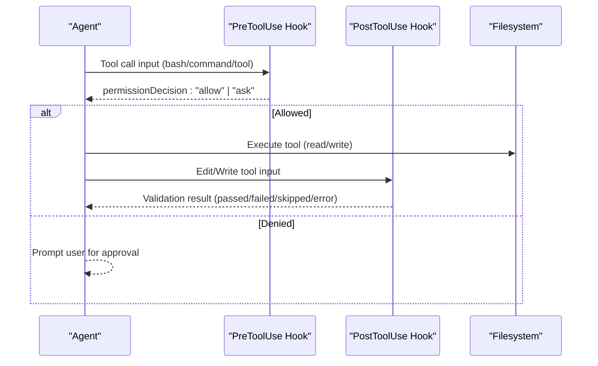
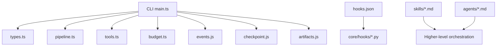

# CLI and User Interface

<cite>
**Referenced Files in This Document**
- [main.ts](file://runtime/src/cli/main.ts)
- [types.ts](file://runtime/src/core/types.ts)
- [route.md](file://plugin/figmaforge/skills/route.md)
- [lifecycle.md](file://plugin/figmaforge/skills/lifecycle.md)
- [doctor.md](file://plugin/figmaforge/skills/doctor.md)
- [context-scout.md](file://plugin/figmaforge/agents/context-scout.md)
- [fresh-verifier.md](file://plugin/figmaforge/agents/fresh-verifier.md)
- [lifecycle-planner.md](file://plugin/figmaforge/agents/lifecycle-planner.md)
- [hooks.json](file://plugin/figmaforge/hooks/hooks.json)
- [session_detector.py](file://plugin/figmaforge/core/hooks/session_detector.py)
- [external_mutation_gate.py](file://plugin/figmaforge/core/hooks/external_mutation_gate.py)
- [post_edit_validator.py](file://plugin/figmaforge/core/hooks/post_edit_validator.py)
- [plugin.json](file://plugin/figmaforge/.claude-plugin/plugin.json)
</cite>

## Table of Contents
1. Introduction
2. Project Structure
3. Core Components
4. Architecture Overview
5. Detailed Component Analysis
6. Dependency Analysis
7. Performance Considerations
8. Troubleshooting Guide
9. Conclusion
10. Appendices

## Introduction
This document explains FigmaForge’s command line interface (CLI), user interactions, and Claude Code integration via skills and agents. It covers all available commands (run, inspect, render, compare, repair, replay), their options and flags, output formats, and how to use them in common workflows. It also documents the skill definitions for routing, lifecycle management, and health checks; agent behaviors for context scouting, verification, and planning; the hook system that enforces safety and validation; and plugin configuration for extending behavior with custom skills and agents.

## Project Structure
FigmaForge exposes a Node-based CLI that orchestrates a deterministic pipeline and integrates with Python-based hooks and detectors. The runtime CLI lives under runtime/src/cli, while plugin capabilities (skills, agents, hooks, catalog) live under plugin/figmaforge.

**Diagram sources**
- [main.ts:1-12](file://runtime/src/cli/main.ts#L1-L12)
- [types.ts:12-24](file://runtime/src/core/types.ts#L12-L24)
- [hooks.json:1-26](file://plugin/figmaforge/hooks/hooks.json#L1-L26)

**Section sources**
- [main.ts:1-12](file://runtime/src/cli/main.ts#L1-L12)
- [types.ts:12-24](file://runtime/src/core/types.ts#L12-L24)
- [hooks.json:1-26](file://plugin/figmaforge/hooks/hooks.json#L1-L26)

## Core Components
- CLI entry point: parses arguments, builds runtime configuration, and dispatches commands.
- Runtime types: defines pipeline stages, budgets, retry policy, viewport, and model provider interfaces.
- Plugin skills: declarative metadata describing what each skill does, triggers, outputs, and constraints.
- Plugin agents: declarative metadata describing specialized subagents for discovery, verification, and planning.
- Hook system: pre/post tool-use hooks implemented in Python to enforce safety and validate edits.
- Plugin manifest: identifies the plugin package and its purpose.

Key responsibilities:
- run: execute full pipeline from ingestion to verification with optional approval gates.
- inspect: summarize artifacts, checkpoints, and events for a given run.
- render: generate HTML from generated code artifacts and optionally capture screenshots.
- compare: report similarity metrics and mismatches from diff reports or screenshots.
- repair: analyze mismatches and guide iterative patching via the full pipeline.
- replay: print event log entries for a previous run.

**Section sources**
- [main.ts:29-144](file://runtime/src/cli/main.ts#L29-L144)
- [types.ts:69-125](file://runtime/src/core/types.ts#L69-L125)
- [route.md:1-29](file://plugin/figmaforge/skills/route.md#L1-L29)
- [lifecycle.md:1-27](file://plugin/figmaforge/skills/lifecycle.md#L1-L27)
- [doctor.md:1-29](file://plugin/figmaforge/skills/doctor.md#L1-L29)
- [context-scout.md:1-28](file://plugin/figmaforge/agents/context-scout.md#L1-L28)
- [fresh-verifier.md:1-28](file://plugin/figmaforge/agents/fresh-verifier.md#L1-L28)
- [lifecycle-planner.md:1-27](file://plugin/figmaforge/agents/lifecycle-planner.md#L1-L27)
- [hooks.json:1-26](file://plugin/figmaforge/hooks/hooks.json#L1-L26)
- [plugin.json:1-21](file://plugin/figmaforge/.claude-plugin/plugin.json#L1-L21)

## Architecture Overview
The CLI constructs a runtime configuration and delegates execution to a pipeline coordinator. During runs, it uses an event log, checkpoint manager, artifact store, tool registry, and budget tracker. Optional approval gates can pause execution for human review. Hooks intercept tool usage to enforce safety and validate changes.

**Diagram sources**
- [main.ts:172-234](file://runtime/src/cli/main.ts#L172-L234)
- [types.ts:86-125](file://runtime/src/core/types.ts#L86-L125)

## Detailed Component Analysis

### CLI Commands and Options
- run
  - Purpose: Execute the full pipeline on a Figma file.
  - Required flags: --file-key.
  - Common flags: --output-dir, --run-id, --resume, --threshold, --max-iterations, --max-repair, --max-time, --viewport, --no-approval, --approve-dir, --verbose, --help.
  - Behavior: Builds config, initializes subsystems, sets up cancellation, runs pipeline, prints summary, exits non-zero on failure.
  - Output: Console summary including status, duration, score, repairs, tokens, artifacts, events, and errors.
- inspect
  - Purpose: Inspect a previous run’s artifacts, checkpoints, and events.
  - Flags: --run-id, --output-dir, --verbose.
  - Output: Lists artifacts, checkpoints with stage transitions and scores, and event summaries with error/warning counts and details.
- render
  - Purpose: Render generated code into HTML and optionally capture a screenshot.
  - Flags: --run-id, --output-dir, --viewport, --python-bin (via config).
  - Output: Writes render.html and attempts screenshot.png using Playwright via Python; falls back to HTML-only if unavailable.
- compare
  - Purpose: Compare rendered output against design using diff reports or screenshots.
  - Flags: --run-id, --output-dir.
  - Output: Similarity score, categories, mismatch count, or guidance to run the full pipeline first.
- repair
  - Purpose: Analyze mismatches and guide repair iterations.
  - Flags: --run-id, --output-dir.
  - Output: Mismatch counts by category and recommendation to run the full pipeline for automated patch generation.
- replay
  - Purpose: Replay a previous run’s event log.
  - Flags: --run-id, --output-dir, --verbose.
  - Output: Timestamped event lines with level prefixes and optional verbose data.

**Diagram sources**
- [main.ts:35-101](file://runtime/src/cli/main.ts#L35-L101)
- [main.ts:172-460](file://runtime/src/cli/main.ts#L172-L460)

**Section sources**
- [main.ts:35-101](file://runtime/src/cli/main.ts#L35-L101)
- [main.ts:172-460](file://runtime/src/cli/main.ts#L172-L460)

### Skill Definitions and Claude Code Integration
- /figmaforge:route
  - Role: Detect context and select phases, roles, existing skills, and execution mode.
  - Triggers: detect, route, adapt, detect context, select roles.
  - Output: Route result with selected lifecycle phases, top roles with scores/reasons, external skill references, execution mode, stack status, approval gates, and unloaded modules.
  - Constraints: Uses detector and role catalog; never installs plugins or connects MCP servers; deterministic and bounded before interpretation.
- /figmaforge:lifecycle
  - Role: Create or advance an evidence-backed task run.
  - Triggers: lifecycle, run, task, state, phase.
  - Output: Initialized run state with run_id, request, selected_roles; advances through phases; writes atomic state and append-only event logs.
  - Constraints: Evidence-driven transitions; explicit approval gates for external mutations; no gitignored directories created.
- /figmaforge:doctor
  - Role: Inspect plugin structure, context cost, dependencies, and dormant integrations.
  - Triggers: doctor, check, validate, inspect, audit, plugin health.
  - Output: Health report verifying structure, reading installed plugins inventory, resolving optional capability references, identifying missing capabilities, reporting projected context cost, warning on duplication, suggesting disabling unrelated user plugins.
  - Constraints: Read-only only; never installs dependencies or modifies user configuration; handles missing optional skills gracefully; reports context cost in tokens; must not vendor/copy/wrap user skills.

**Diagram sources**
- [route.md:1-29](file://plugin/figmaforge/skills/route.md#L1-L29)
- [lifecycle.md:1-27](file://plugin/figmaforge/skills/lifecycle.md#L1-L27)
- [doctor.md:1-29](file://plugin/figmaforge/skills/doctor.md#L1-L29)

**Section sources**
- [route.md:1-29](file://plugin/figmaforge/skills/route.md#L1-L29)
- [lifecycle.md:1-27](file://plugin/figmaforge/skills/lifecycle.md#L1-L27)
- [doctor.md:1-29](file://plugin/figmaforge/skills/doctor.md#L1-L29)

### Agent Implementations
- Context Scout
  - Purpose: Read-only repository discovery returning a concise evidence summary.
  - Triggers: discover, investigate, audit, repository analysis.
  - Output: Detected languages/frameworks, package managers, testing/build configs, CI/CD/IaC tools, existing Claude/MCP/LSP configurations, current repo state.
  - Constraints: Read-only; concise summary; no external API calls; uses detector internally.
- Fresh Verifier
  - Purpose: Independently verifies claims using a clean context and no write tools.
  - Triggers: verify, validate, check, independent review.
  - Output: Verification report reconstructing request, identifying claims, cross-referencing evidence, reporting verified vs unverified items, flagging inconsistencies.
  - Constraints: No write tools; read-only tools only; clean context; agnostic to original decisions; truthful output.
- Lifecycle Planner
  - Purpose: Convert complex requests into phased work and gates without editing.
  - Triggers: plan, roadmap, epic, task breakdown, phased approach.
  - Output: Phased implementation plan with ordered phases, subtasks, dependencies, risks, and evidence requirements.
  - Constraints: No file modifications or tool invocations; produces executable plan; includes gates/approval points; based on 10-phase lifecycle model.

**Diagram sources**
- [context-scout.md:1-28](file://plugin/figmaforge/agents/context-scout.md#L1-L28)
- [fresh-verifier.md:1-28](file://plugin/figmaforge/agents/fresh-verifier.md#L1-L28)
- [lifecycle-planner.md:1-27](file://plugin/figmaforge/agents/lifecycle-planner.md#L1-L27)

**Section sources**
- [context-scout.md:1-28](file://plugin/figmaforge/agents/context-scout.md#L1-L28)
- [fresh-verifier.md:1-28](file://plugin/figmaforge/agents/fresh-verifier.md#L1-L28)
- [lifecycle-planner.md:1-27](file://plugin/figmaforge/agents/lifecycle-planner.md#L1-L27)

### Hook System and Safety Controls
- SessionStart hook
  - Script: session_detector.py
  - Behavior: Runs repository detector; injects concise additional context when actionable evidence exists; exits cleanly for empty repos or nonblocking failures.
- PreToolUse hook
  - Script: external_mutation_gate.py
  - Behavior: Inspects Bash commands and MCP tool names for external mutations; returns permission decision to ask when risky patterns are detected; safe otherwise.
- PostToolUse hook
  - Script: post_edit_validator.py
  - Behavior: On Edit/Write, selects appropriate validator per file type (e.g., tsc, pyright, rustfmt); executes validator with timeout; reports pass/fail/skipped/error; skips if toolchain not installed.

**Diagram sources**
- [hooks.json:1-26](file://plugin/figmaforge/hooks/hooks.json#L1-L26)
- [session_detector.py:17-59](file://plugin/figmaforge/core/hooks/session_detector.py#L17-L59)
- [external_mutation_gate.py:87-131](file://plugin/figmaforge/core/hooks/external_mutation_gate.py#L87-L131)
- [post_edit_validator.py:66-147](file://plugin/figmaforge/core/hooks/post_edit_validator.py#L66-L147)

**Section sources**
- [hooks.json:1-26](file://plugin/figmaforge/hooks/hooks.json#L1-L26)
- [session_detector.py:17-59](file://plugin/figmaforge/core/hooks/session_detector.py#L17-L59)
- [external_mutation_gate.py:87-131](file://plugin/figmaforge/core/hooks/external_mutation_gate.py#L87-L131)
- [post_edit_validator.py:66-147](file://plugin/figmaforge/core/hooks/post_edit_validator.py#L66-L147)

### Plugin Configuration and Extension Points
- Plugin manifest
  - Identifies the plugin name, version, description, license, author, homepage, repository, and keywords.
- Skills and agents
  - Declared as Markdown files with frontmatter defining id, scope, role, triggers, outputs, and constraints.
- Hooks
  - Configured in hooks.json mapping hook points to Python scripts; scripts implement detection, gating, and validation logic.
- Extensibility
  - Add new skills by creating new .md files under skills with clear triggers and outputs.
  - Add new agents by creating new .md files under agents with precise constraints.
  - Extend hooks by adding new Python scripts and referencing them in hooks.json.
  - Use the role catalog to define new roles and capability references for advanced routing.

**Section sources**
- [plugin.json:1-21](file://plugin/figmaforge/.claude-plugin/plugin.json#L1-L21)
- [route.md:1-29](file://plugin/figmaforge/skills/route.md#L1-L29)
- [lifecycle.md:1-27](file://plugin/figmaforge/skills/lifecycle.md#L1-L27)
- [doctor.md:1-29](file://plugin/figmaforge/skills/doctor.md#L1-L29)
- [hooks.json:1-26](file://plugin/figmaforge/hooks/hooks.json#L1-L26)

## Dependency Analysis
The CLI depends on core runtime types and orchestrates multiple subsystems. Skills and agents are declarative and consumed by higher-level orchestration layers. Hooks are invoked around tool usage to enforce safety and quality.

**Diagram sources**
- [main.ts:1-24](file://runtime/src/cli/main.ts#L1-L24)
- [types.ts:12-24](file://runtime/src/core/types.ts#L12-L24)
- [hooks.json:1-26](file://plugin/figmaforge/hooks/hooks.json#L1-L26)

**Section sources**
- [main.ts:1-24](file://runtime/src/cli/main.ts#L1-L24)
- [types.ts:12-24](file://runtime/src/core/types.ts#L12-L24)
- [hooks.json:1-26](file://plugin/figmaforge/hooks/hooks.json#L1-L26)

## Performance Considerations
- Budgets and retries: Configure max time, iterations, and repair iterations to control resource usage.
- Viewport sizing: Adjust viewport to balance rendering fidelity and performance.
- Approval gates: Disable interactive approvals in non-interactive modes to avoid stalls.
- Hook timeouts: Post-edit validators have timeouts to prevent long-running checks from blocking workflow.
- Deterministic runs: Use null model provider for fully deterministic runs when needed.

[No sources needed since this section provides general guidance]

## Troubleshooting Guide
- Missing file key for run
  - Symptom: Error message indicating required flag.
  - Resolution: Provide --file-key.
- No artifacts for replay or compare
  - Symptom: Messages indicating no artifacts or event logs found.
  - Resolution: Run the full pipeline first to generate artifacts and event logs.
- Playwright not available
  - Symptom: Screenshot generation fails; HTML-only render is produced.
  - Resolution: Install Playwright via Python environment configured by pythonBin; ensure browser binaries are installed.
- Hook failures or skipped validations
  - Symptom: Validation skipped due to missing toolchain or timeout.
  - Resolution: Install required toolchains (e.g., tsc, pyright, rustfmt) or adjust environment PATH; increase timeouts if necessary.
- External mutation gate prompts
  - Symptom: Permission decision asks for approval on risky commands or MCP tools.
  - Resolution: Review and approve or modify commands to avoid external mutations.

**Section sources**
- [main.ts:172-234](file://runtime/src/cli/main.ts#L172-L234)
- [main.ts:236-328](file://runtime/src/cli/main.ts#L236-L328)
- [main.ts:330-460](file://runtime/src/cli/main.ts#L330-L460)
- [external_mutation_gate.py:87-131](file://plugin/figmaforge/core/hooks/external_mutation_gate.py#L87-L131)
- [post_edit_validator.py:66-147](file://plugin/figmaforge/core/hooks/post_edit_validator.py#L66-L147)

## Conclusion
FigmaForge’s CLI provides a comprehensive set of commands to run, inspect, render, compare, repair, and replay design-to-code pipelines. Skills and agents offer structured, constraint-bound behaviors for routing, lifecycle management, and health checks. The hook system ensures safety and code quality during tool usage. Users can extend the platform by adding skills, agents, and hooks, leveraging the role catalog and detector for intelligent adaptation.

[No sources needed since this section summarizes without analyzing specific files]

## Appendices

### Practical Workflows and Command Combinations
- Full pipeline with approval disabled
  - Example: figmaforge run --file-key=<key> --output-dir=./output --no-approval
- Inspect a previous run
  - Example: figmaforge inspect --run-id=<id> --output-dir=./output
- Render and screenshot
  - Example: figmaforge render --run-id=<id> --output-dir=./output
- Compare and repair
  - Example: figmaforge compare --run-id=<id> --output-dir=./output
  - Then: figmaforge repair --run-id=<id> --output-dir=./output
- Replay events
  - Example: figmaforge replay --run-id=<id> --output-dir=./output --verbose

[No sources needed since this section provides general guidance]

### Data Models and Outputs
- Runtime configuration fields
  - runId, fileKey, outputDir, approvedDirs, requireApproval, retry, budgets, similarityThreshold, minProgress, viewport, pythonBin, pluginDir.
- Pipeline stages
  - ingest, normalize, resolve, layout, generate, assets, render, compare, repair, verify.
- Run statuses
  - pending, running, paused, completed, failed, cancelled, rolled_back.

**Section sources**
- [types.ts:69-125](file://runtime/src/core/types.ts#L69-L125)
- [types.ts:12-24](file://runtime/src/core/types.ts#L12-L24)