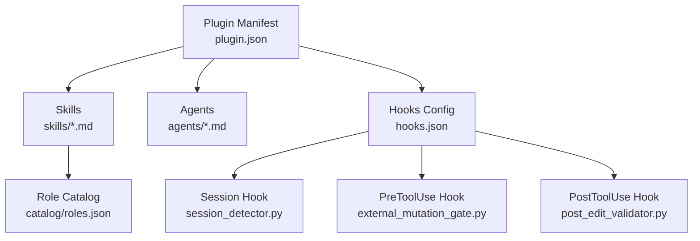
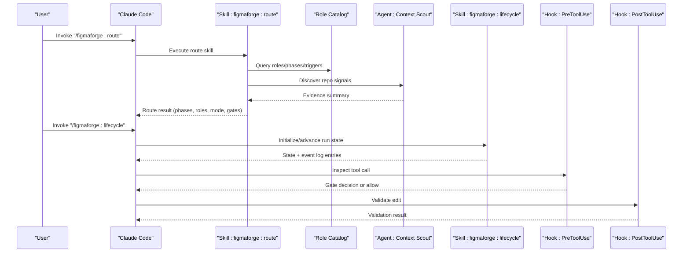
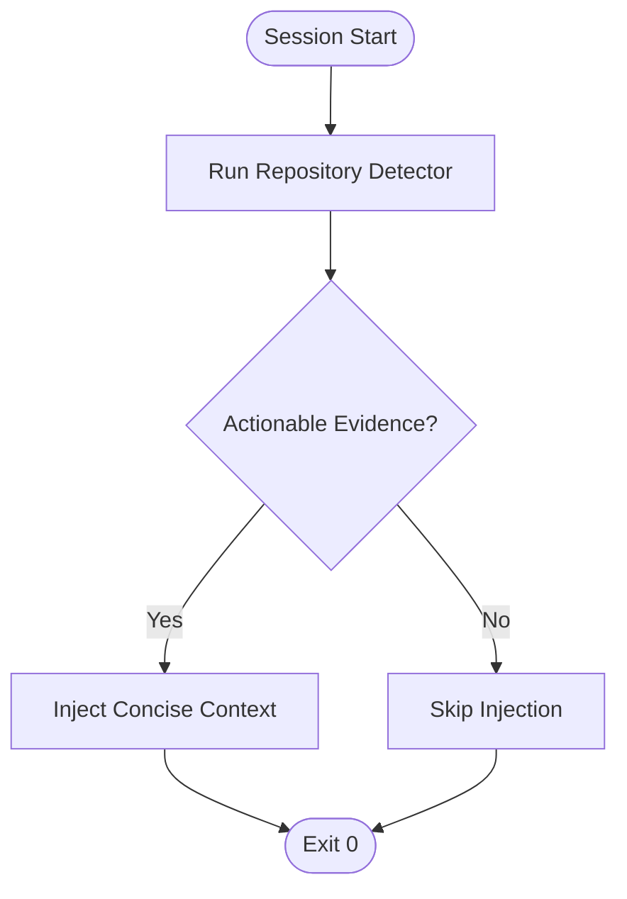
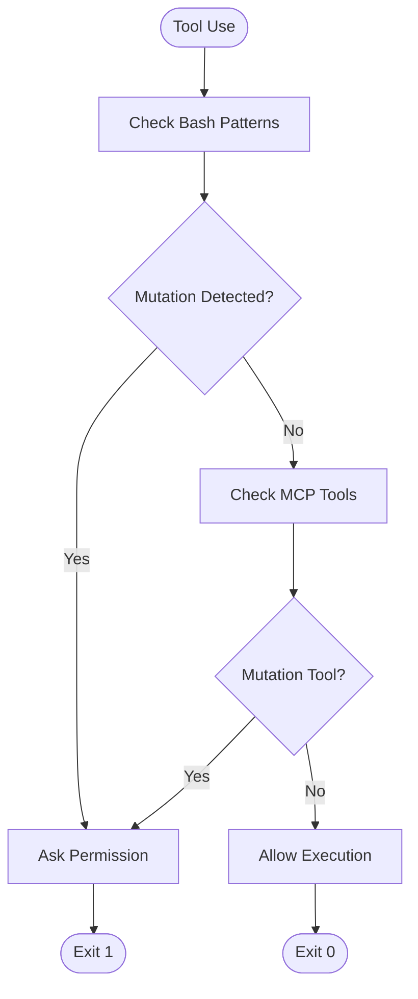
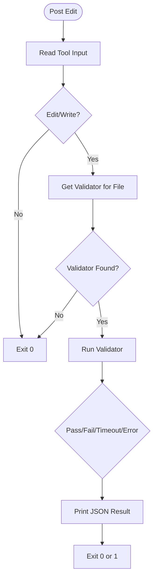
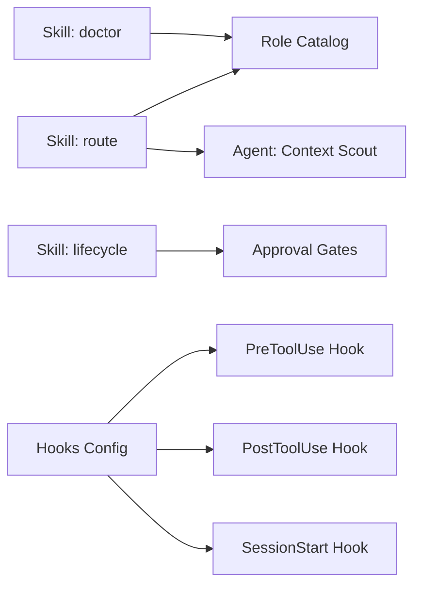

# Claude Code Integration

<cite>
**Referenced Files in This Document**
- [plugin.json](file://plugin/figmaforge/.claude-plugin/plugin.json)
- [settings.json](file://.claude/settings.json)
- [route.md](file://plugin/figmaforge/skills/route.md)
- [lifecycle.md](file://plugin/figmaforge/skills/lifecycle.md)
- [doctor.md](file://plugin/figmaforge/skills/doctor.md)
- [context-scout.md](file://plugin/figmaforge/agents/context-scout.md)
- [fresh-verifier.md](file://plugin/figmaforge/agents/fresh-verifier.md)
- [lifecycle-planner.md](file://plugin/figmaforge/agents/lifecycle-planner.md)
- [session_detector.py](file://plugin/figmaforge/core/hooks/session_detector.py)
- [external_mutation_gate.py](file://plugin/figmaforge/core/hooks/external_mutation_gate.py)
- [post_edit_validator.py](file://plugin/figmaforge/core/hooks/post_edit_validator.py)
- [hooks.json](file://plugin/figmaforge/hooks/hooks.json)
- [roles.json](file://plugin/figmaforge/catalog/roles.json)
</cite>

## Table of Contents
1. [Introduction](#introduction)
2. [Project Structure](#project-structure)
3. [Core Components](#core-components)
4. [Architecture Overview](#architecture-overview)
5. [Detailed Component Analysis](#detailed-component-analysis)
6. [Dependency Analysis](#dependency-analysis)
7. [Performance Considerations](#performance-considerations)
8. [Troubleshooting Guide](#troubleshooting-guide)
9. [Conclusion](#conclusion)
10. [Appendices](#appendices)

## Introduction
This document explains FigmaForge’s integration with Claude Code, focusing on the plugin manifest, capability declarations, and configuration. It details the skill system (including /figmaforge:route, /figmaforge:lifecycle, and /figmaforge:doctor), agent implementations, and the hook system for session and mutation events. It also provides guidance on extending functionality with custom skills and agents, along with practical examples of invoking skills, passing parameters, and processing results.

## Project Structure
FigmaForge’s Claude Code integration is organized under the plugin directory with a clear separation between metadata, skills, agents, core hooks, and catalogs:
- Plugin manifest defines identity and capabilities.
- Skills define user-facing commands and their outputs/constraints.
- Agents define specialized subagents for discovery, verification, and planning.
- Hooks integrate runtime behavior into Claude Code sessions.
- Catalogs provide role definitions used by routing and lifecycle logic.

**Diagram sources**
- [plugin.json:1-21](file://plugin/figmaforge/.claude-plugin/plugin.json#L1-L21)
- [hooks.json:1-26](file://plugin/figmaforge/hooks/hooks.json#L1-L26)
- [session_detector.py:1-60](file://plugin/figmaforge/core/hooks/session_detector.py#L1-L60)
- [external_mutation_gate.py:1-132](file://plugin/figmaforge/core/hooks/external_mutation_gate.py#L1-L132)
- [post_edit_validator.py:1-148](file://plugin/figmaforge/core/hooks/post_edit_validator.py#L1-L148)
- [roles.json:1-800](file://plugin/figmaforge/catalog/roles.json#L1-L800)

**Section sources**
- [plugin.json:1-21](file://plugin/figmaforge/.claude-plugin/plugin.json#L1-L21)
- [hooks.json:1-26](file://plugin/figmaforge/hooks/hooks.json#L1-L26)

## Core Components
- Plugin manifest: Declares name, version, description, license, author, homepage, repository, and keywords to identify the plugin within Claude Code.
- Settings: Provides a schema reference for Claude Code settings at the project root.
- Skills: Define command-like behaviors with triggers, outputs, and constraints.
- Agents: Specialized subagents that perform read-only discovery, independent verification, and phased planning without editing.
- Hooks: Runtime integrations that inject context, gate external mutations, and validate edits post-tool use.
- Role catalog: A large set of roles with phases, triggers, deliverables, signals, and capability references used by routing and lifecycle logic.

**Section sources**
- [plugin.json:1-21](file://plugin/figmaforge/.claude-plugin/plugin.json#L1-L21)
- [settings.json:1-4](file://.claude/settings.json#L1-L4)
- [route.md:1-29](file://plugin/figmaforge/skills/route.md#L1-L29)
- [lifecycle.md:1-27](file://plugin/figmaforge/skills/lifecycle.md#L1-L27)
- [doctor.md:1-29](file://plugin/figmaforge/skills/doctor.md#L1-L29)
- [context-scout.md:1-28](file://plugin/figmaforge/agents/context-scout.md#L1-L28)
- [fresh-verifier.md:1-28](file://plugin/figmaforge/agents/fresh-verifier.md#L1-L28)
- [lifecycle-planner.md:1-27](file://plugin/figmaforge/agents/lifecycle-planner.md#L1-L27)
- [roles.json:1-800](file://plugin/figmaforge/catalog/roles.json#L1-L800)

## Architecture Overview
The integration combines declarative skills and agents with runtime hooks to create an adaptive workflow:
- The route skill detects context and selects roles/phases and execution mode using repository signals and the role catalog.
- The lifecycle skill manages state transitions across a 10-phase lifecycle with evidence-driven moves and approval gates.
- The doctor skill audits plugin health, optional capabilities, and projected context cost without modifying anything.
- Hooks enhance each session with concise context, guard risky operations, and validate edits.

**Diagram sources**
- [route.md:1-29](file://plugin/figmaforge/skills/route.md#L1-L29)
- [lifecycle.md:1-27](file://plugin/figmaforge/skills/lifecycle.md#L1-L27)
- [context-scout.md:1-28](file://plugin/figmaforge/agents/context-scout.md#L1-L28)
- [external_mutation_gate.py:1-132](file://plugin/figmaforge/core/hooks/external_mutation_gate.py#L1-L132)
- [post_edit_validator.py:1-148](file://plugin/figmaforge/core/hooks/post_edit_validator.py#L1-L148)
- [roles.json:1-800](file://plugin/figmaforge/catalog/roles.json#L1-L800)

## Detailed Component Analysis

### Plugin Manifest and Configuration
- The plugin manifest declares identity and keywords that help Claude Code discover and describe the plugin.
- The project-level settings file references the schema for Claude Code settings, enabling validation and IDE support.

Practical notes:
- Keep the manifest up-to-date when adding new capabilities or changing scope.
- Use the settings schema to enforce consistent configuration across environments.

**Section sources**
- [plugin.json:1-21](file://plugin/figmaforge/.claude-plugin/plugin.json#L1-L21)
- [settings.json:1-4](file://.claude/settings.json#L1-L4)

### Skill: /figmaforge:route (Repository Analysis and Role Routing)
Purpose:
- Detects repository context and selects lifecycle phases, roles, execution mode, and approval gates.

Key behaviors:
- Uses repository detection to gather signals (languages, frameworks, package managers).
- Queries the role catalog to score and select up to three roles with reasons.
- Returns a deterministic route result before interpretation.

Constraints:
- No plugin installation or MCP connection during routing.
- Deterministic and bounded pre-processing.

Invocation example:
- Trigger: “/figmaforge:route”
- Parameters: request text, optional filters (e.g., focus on frontend/backend)
- Result: selected phases, top roles with scores/reasons, execution mode, stack status, approval gates, unloaded modules

**Section sources**
- [route.md:1-29](file://plugin/figmaforge/skills/route.md#L1-L29)
- [roles.json:1-800](file://plugin/figmaforge/catalog/roles.json#L1-L800)

### Skill: /figmaforge:lifecycle (State Management Workflows)
Purpose:
- Creates or advances an evidence-backed task run through a 10-phase lifecycle.

Key behaviors:
- Initializes run state with run_id, request, and selected roles.
- Advances phases based on evidence (not prose claims).
- Writes atomic state updates and appends events to an event log.

Constraints:
- Requires explicit approval gates for external mutations.
- Atomic writes only; never creates directories that should be gitignored.

Invocation example:
- Trigger: “/figmaforge:lifecycle”
- Parameters: action (initialize | advance), phase target, evidence payload
- Result: updated state snapshot and appended event entries

**Section sources**
- [lifecycle.md:1-27](file://plugin/figmaforge/skills/lifecycle.md#L1-L27)

### Skill: /figmaforge:doctor (Diagnostic Capabilities)
Purpose:
- Audits plugin structure, context cost, dependencies, and dormant integrations.

Key behaviors:
- Verifies plugin structure and reads installed plugins inventory (read-only).
- Resolves optional capability references from the catalog.
- Reports missing capabilities and projected context cost in tokens.
- Suggests disabling unrelated user plugins if duplication is detected.

Constraints:
- Read-only operations only; no installs or config modifications.
- Gracefully handles missing optional external skills.

Invocation example:
- Trigger: “/figmaforge:doctor”
- Parameters: none (or optional verbosity flag)
- Result: health report including structure checks, capability resolution, token cost estimates, and suggestions

**Section sources**
- [doctor.md:1-29](file://plugin/figmaforge/skills/doctor.md#L1-L29)

### Agents: Context Scout, Fresh Verifier, Lifecycle Planner
- Context Scout: Read-only repository discovery returning a concise evidence summary (languages, frameworks, tools, current state).
- Fresh Verifier: Independent verification using clean context and read-only tools; flags inconsistencies and unverified claims.
- Lifecycle Planner: Converts complex requests into phased work with gates and evidence requirements, without editing files.

These agents are invoked by skills or orchestrators to produce structured outputs consumed by routing and lifecycle management.

**Section sources**
- [context-scout.md:1-28](file://plugin/figmaforge/agents/context-scout.md#L1-L28)
- [fresh-verifier.md:1-28](file://plugin/figmaforge/agents/fresh-verifier.md#L1-L28)
- [lifecycle-planner.md:1-27](file://plugin/figmaforge/agents/lifecycle-planner.md#L1-L27)

### Hook System: Session Start, PreToolUse, PostToolUse
- SessionStart hook: Runs repository detection and injects concise additional context when actionable evidence exists.
- PreToolUse hook: Inspects Bash commands and MCP tool names for potential external mutations; asks for permission when needed.
- PostToolUse hook: Validates edited files using appropriate toolchain validators; reports pass/fail/skip/error.

**Diagram sources**
- [session_detector.py:1-60](file://plugin/figmaforge/core/hooks/session_detector.py#L1-L60)

**Diagram sources**
- [external_mutation_gate.py:1-132](file://plugin/figmaforge/core/hooks/external_mutation_gate.py#L1-L132)

**Diagram sources**
- [post_edit_validator.py:1-148](file://plugin/figmaforge/core/hooks/post_edit_validator.py#L1-L148)

**Section sources**
- [hooks.json:1-26](file://plugin/figmaforge/hooks/hooks.json#L1-L26)
- [session_detector.py:1-60](file://plugin/figmaforge/core/hooks/session_detector.py#L1-L60)
- [external_mutation_gate.py:1-132](file://plugin/figmaforge/core/hooks/external_mutation_gate.py#L1-L132)
- [post_edit_validator.py:1-148](file://plugin/figmaforge/core/hooks/post_edit_validator.py#L1-L148)

### Practical Examples: Invocation, Parameters, and Results
- Route invocation:
  - Command: “/figmaforge:route”
  - Parameters: request text, optional domain filter
  - Processing: detector runs, roles scored via catalog, execution mode selected
  - Result: phases, roles with scores/reasons, mode, stack status, gates, unloaded modules

- Lifecycle invocation:
  - Command: “/figmaforge:lifecycle”
  - Parameters: action (initialize/advance), target phase, evidence payload
  - Processing: validates evidence, writes atomic state, appends event
  - Result: updated state snapshot and event log entries

- Doctor invocation:
  - Command: “/figmaforge:doctor”
  - Parameters: none
  - Processing: reads plugin structure, resolves capabilities, estimates token cost
  - Result: health report with findings and suggestions

- Agent usage:
  - Context Scout: invoked by route to collect repository signals
  - Fresh Verifier: invoked after implementation to independently verify claims
  - Lifecycle Planner: invoked to break down complex requests into phased tasks

**Section sources**
- [route.md:1-29](file://plugin/figmaforge/skills/route.md#L1-L29)
- [lifecycle.md:1-27](file://plugin/figmaforge/skills/lifecycle.md#L1-L27)
- [doctor.md:1-29](file://plugin/figmaforge/skills/doctor.md#L1-L29)
- [context-scout.md:1-28](file://plugin/figmaforge/agents/context-scout.md#L1-L28)
- [fresh-verifier.md:1-28](file://plugin/figmaforge/agents/fresh-verifier.md#L1-L28)
- [lifecycle-planner.md:1-27](file://plugin/figmaforge/agents/lifecycle-planner.md#L1-L27)

## Dependency Analysis
- Skills depend on the role catalog for scoring and selection.
- Hooks depend on repository detection and external toolchains available on PATH.
- Agents operate read-only and feed structured outputs back to skills/orchestrators.

**Diagram sources**
- [route.md:1-29](file://plugin/figmaforge/skills/route.md#L1-L29)
- [lifecycle.md:1-27](file://plugin/figmaforge/skills/lifecycle.md#L1-L27)
- [doctor.md:1-29](file://plugin/figmaforge/skills/doctor.md#L1-L29)
- [hooks.json:1-26](file://plugin/figmaforge/hooks/hooks.json#L1-L26)
- [roles.json:1-800](file://plugin/figmaforge/catalog/roles.json#L1-L800)

**Section sources**
- [hooks.json:1-26](file://plugin/figmaforge/hooks/hooks.json#L1-L26)
- [roles.json:1-800](file://plugin/figmaforge/catalog/roles.json#L1-L800)

## Performance Considerations
- Keep repository detection lightweight; only inject concise context when actionable evidence exists.
- Avoid heavy tool invocations in hooks; timeouts are enforced for validators.
- Prefer read-only operations in agents to minimize overhead and risk.
- Use the doctor skill to estimate projected context cost and adjust accordingly.

[No sources needed since this section provides general guidance]

## Troubleshooting Guide
Common issues and resolutions:
- Missing toolchain binaries:
  - Validators like tsc, pyright, rustfmt may not be on PATH; the post-edit validator will skip checks and report the reason.
- Hook failures:
  - Session detector exits non-zero on critical errors; check stderr for messages.
  - External mutation gate may ask for permission; review the reason and approve/deny as needed.
- Duplicate capabilities:
  - Doctor may warn about duplication between user plugins and FigmaForge; consider disabling unrelated user plugins locally.

**Section sources**
- [post_edit_validator.py:1-148](file://plugin/figmaforge/core/hooks/post_edit_validator.py#L1-L148)
- [session_detector.py:1-60](file://plugin/figmaforge/core/hooks/session_detector.py#L1-L60)
- [external_mutation_gate.py:1-132](file://plugin/figmaforge/core/hooks/external_mutation_gate.py#L1-L132)
- [doctor.md:1-29](file://plugin/figmaforge/skills/doctor.md#L1-L29)

## Conclusion
FigmaForge’s Claude Code integration provides a robust, extensible framework for adaptive engineering workflows. Skills define high-level commands, agents supply specialized capabilities, and hooks ensure safe and efficient session behavior. With a rich role catalog and evidence-driven lifecycle management, teams can tailor routing, planning, and verification to their projects while maintaining safety and performance.

[No sources needed since this section summarizes without analyzing specific files]

## Appendices

### Extending Functionality: Custom Skills and Agents
- Add a new skill by creating a markdown file under skills with id, triggers, output, and constraints.
- Add a new agent by creating a markdown file under agents describing purpose, triggers, output, and constraints.
- Register hooks in hooks.json to integrate session start, pre-tool-use, and post-tool-use behaviors.
- Update the role catalog to include new roles/phases/capability references if needed.

**Section sources**
- [route.md:1-29](file://plugin/figmaforge/skills/route.md#L1-L29)
- [lifecycle.md:1-27](file://plugin/figmaforge/skills/lifecycle.md#L1-L27)
- [doctor.md:1-29](file://plugin/figmaforge/skills/doctor.md#L1-L29)
- [context-scout.md:1-28](file://plugin/figmaforge/agents/context-scout.md#L1-L28)
- [fresh-verifier.md:1-28](file://plugin/figmaforge/agents/fresh-verifier.md#L1-L28)
- [lifecycle-planner.md:1-27](file://plugin/figmaforge/agents/lifecycle-planner.md#L1-L27)
- [hooks.json:1-26](file://plugin/figmaforge/hooks/hooks.json#L1-L26)
- [roles.json:1-800](file://plugin/figmaforge/catalog/roles.json#L1-L800)