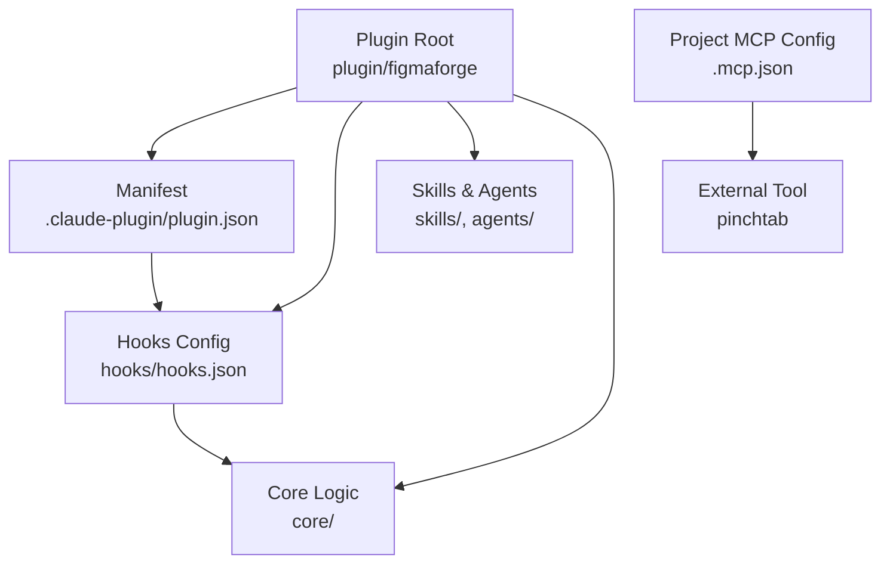
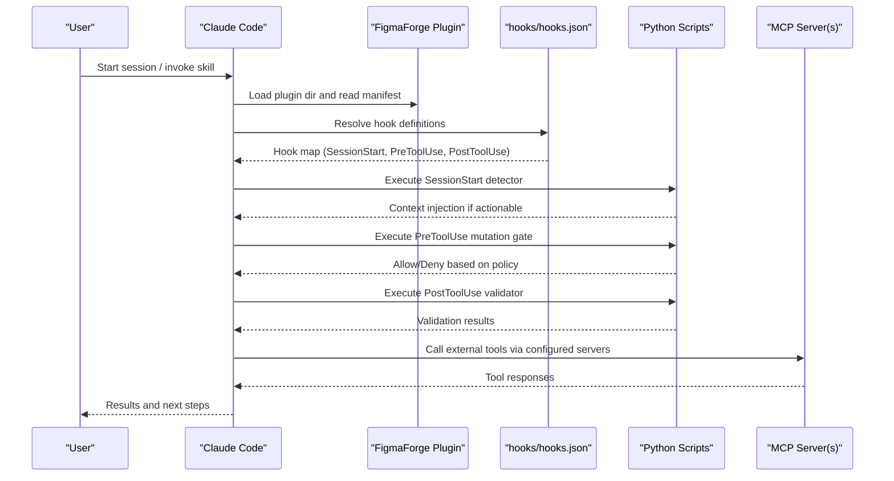
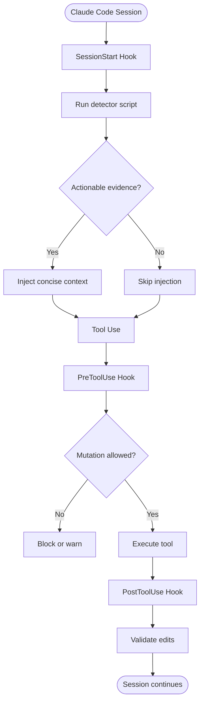
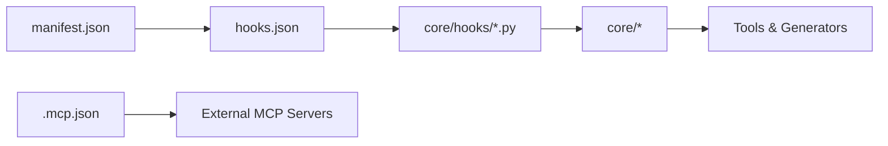

# Plugin Manifest and Configuration

<cite>
**Referenced Files in This Document**
- [plugin.json](file://plugin/figmaforge/.claude-plugin/plugin.json)
- [hooks.json](file://plugin/figmaforge/hooks/hooks.json)
- [.mcp.json](file://.mcp.json)
- [CLAUDE.md](file://CLAUDE.md)
- [README.md](file://README.md)
</cite>

## Table of Contents
1. [Introduction](#introduction)
2. [Project Structure](#project-structure)
3. [Core Components](#core-components)
4. [Architecture Overview](#architecture-overview)
5. [Detailed Component Analysis](#detailed-component-analysis)
6. [Dependency Analysis](#dependency-analysis)
7. [Performance Considerations](#performance-considerations)
8. [Troubleshooting Guide](#troubleshooting-guide)
9. [Conclusion](#conclusion)
10. [Appendices](#appendices)

## Introduction
This document explains FigmaForge’s Claude Code plugin manifest structure and configuration, focusing on the plugin.json metadata file and how it integrates with Claude Code. It covers required and optional fields (name, version, description, license, author, homepage, repository, keywords), how capabilities and integration points are declared via hooks and MCP configuration, and best practices for versioning and metadata hygiene. It also provides guidance for extending the manifest with custom configurations and environment-specific settings.

## Project Structure
FigmaForge is implemented as a Claude Code plugin located under plugin/figmaforge. The plugin manifest resides at .claude-plugin/plugin.json and declares identity and metadata. Integration points include:
- Hooks configuration that wires session and tool-use lifecycle events to Python scripts.
- MCP server configuration at the project root for external tool integrations.

**Diagram sources**
- [plugin.json:1-21](file://plugin/figmaforge/.claude-plugin/plugin.json#L1-L21)
- [hooks.json:1-26](file://plugin/figmaforge/hooks/hooks.json#L1-L26)
- [.mcp.json:1-12](file://.mcp.json#L1-L12)

**Section sources**
- [plugin.json:1-21](file://plugin/figmaforge/.claude-plugin/plugin.json#L1-L21)
- [hooks.json:1-26](file://plugin/figmaforge/hooks/hooks.json#L1-L26)
- [.mcp.json:1-12](file://.mcp.json#L1-L12)
- [CLAUDE.md:19-43](file://CLAUDE.md#L19-L43)

## Core Components
- Plugin manifest (plugin.json): Declares plugin identity and metadata used by Claude Code.
- Hooks configuration (hooks.json): Declares lifecycle hooks that run Python scripts during sessions and tool usage.
- MCP configuration (.mcp.json): Declares external MCP servers available to the plugin runtime.

Key responsibilities:
- Identity and discoverability: name, version, description, license, author, homepage, repository, keywords.
- Capability declaration: hooks define when and how the plugin participates in Claude Code sessions.
- Integration points: MCP servers provide additional tools/services invoked by the plugin or skills.

**Section sources**
- [plugin.json:1-21](file://plugin/figmaforge/.claude-plugin/plugin.json#L1-L21)
- [hooks.json:1-26](file://plugin/figmaforge/hooks/hooks.json#L1-L26)
- [.mcp.json:1-12](file://.mcp.json#L1-L12)

## Architecture Overview
The plugin manifest acts as the entrypoint metadata for Claude Code. At runtime, Claude Code loads the plugin directory, reads the manifest, and uses the hooks configuration to execute lifecycle scripts. External services can be integrated via MCP configuration at the project level.

**Diagram sources**
- [plugin.json:1-21](file://plugin/figmaforge/.claude-plugin/plugin.json#L1-L21)
- [hooks.json:1-26](file://plugin/figmaforge/hooks/hooks.json#L1-L26)
- [.mcp.json:1-12](file://.mcp.json#L1-L12)

## Detailed Component Analysis

### Plugin Manifest (plugin.json)
The manifest defines the plugin’s identity and metadata. Fields present in this project include:
- name: Unique identifier for the plugin.
- version: Semantic version string indicating the current release.
- description: Human-readable summary of the plugin’s purpose and scope.
- license: SPDX-style license identifier.
- author: Object containing the author’s name.
- homepage: URL to the plugin’s documentation or project page.
- repository: URL to the source code repository.
- keywords: Array of search tags to improve discoverability.

Best practices:
- Keep name concise and unique within the Claude Code plugin ecosystem.
- Use semantic versioning for version to enable clear upgrade paths.
- Maintain an up-to-date description aligned with current capabilities.
- Set license to match your project’s legal terms.
- Provide accurate author, homepage, and repository links for support and attribution.
- Curate keywords to reflect core features and use cases without overstuffing.

Version management strategies:
- Align plugin version with major feature releases and breaking changes.
- Use pre-release suffixes (e.g., -dev) during development; remove before stable releases.
- Track changes in a changelog and update version consistently across docs and tests.

Extending the manifest:
- Add new metadata fields only if supported by Claude Code’s plugin schema.
- For environment-specific behavior, prefer external config files (e.g., per-environment JSON) rather than embedding secrets or environment flags in the manifest.
- If you need custom configuration, store it in a dedicated config file and reference it from hooks or skills.

**Section sources**
- [plugin.json:1-21](file://plugin/figmaforge/.claude-plugin/plugin.json#L1-L21)

### Hooks Configuration (hooks.json)
Hooks declare when Claude Code should execute plugin logic:
- SessionStart: Runs once per session to detect context and inject concise information when actionable.
- PreToolUse: Inspects upcoming tool calls to prevent unintended mutations.
- PostToolUse: Validates edits after tool execution using manifest-aware checks.

Each hook entry includes:
- command: The executable script to run.
- description: Purpose of the hook.
- hooks: Nested hook references (if any).

Integration points:
- Commands typically call Python scripts under core/hooks that implement detection, gating, and validation logic.
- These hooks integrate tightly with Claude Code’s session lifecycle and tool-use pipeline.

**Diagram sources**
- [hooks.json:1-26](file://plugin/figmaforge/hooks/hooks.json#L1-L26)

**Section sources**
- [hooks.json:1-26](file://plugin/figmaforge/hooks/hooks.json#L1-L26)

### MCP Configuration (.mcp.json)
The project-level MCP configuration declares external servers that can be used by the plugin or skills. In this project:
- A stdio-based server named pinchtab is configured with its command and arguments.
- Environment variables can be provided via env for server processes.

Usage:
- Skills or commands may invoke MCP tools through the configured servers.
- Keep credentials out of this file; use secure environment variable injection where necessary.

**Section sources**
- [.mcp.json:1-12](file://.mcp.json#L1-L12)

### Integration Points with Claude Code
- Plugin loading: Claude Code discovers and loads plugins from specified directories.
- Manifest reading: The plugin.json provides identity and metadata for discovery and display.
- Hook execution: Lifecycle hooks are executed at defined points in the session and tool-use flow.
- MCP invocation: External tools are called via configured MCP servers.

Operational notes:
- Use claude plugin validate --strict to verify plugin structure and metadata compliance.
- Load the plugin in development mode with the appropriate CLI flag to test changes quickly.

**Section sources**
- [CLAUDE.md:66-83](file://CLAUDE.md#L66-L83)
- [README.md:39-47](file://README.md#L39-L47)

## Dependency Analysis
- Internal dependencies:
  - Hooks depend on Python scripts under core/hooks.
  - Skills and agents rely on core modules for routing, detection, and generation.
- External dependencies:
  - MCP servers (e.g., pinchtab) are configured at the project level and invoked as needed.
- Coupling:
  - The manifest is decoupled from implementation details; it primarily exposes metadata.
  - Hooks introduce explicit coupling to specific scripts and their expected environments.

**Diagram sources**
- [plugin.json:1-21](file://plugin/figmaforge/.claude-plugin/plugin.json#L1-L21)
- [hooks.json:1-26](file://plugin/figmaforge/hooks/hooks.json#L1-L26)
- [.mcp.json:1-12](file://.mcp.json#L1-L12)

**Section sources**
- [CLAUDE.md:19-43](file://CLAUDE.md#L19-L43)

## Performance Considerations
- Keep hook scripts lightweight; avoid heavy computations in SessionStart to minimize startup latency.
- Cache expensive detections between runs when safe to do so.
- Limit injected context to actionable items to reduce token usage and improve response times.
- Prefer deterministic logic in hooks to ensure consistent performance.

[No sources needed since this section provides general guidance]

## Troubleshooting Guide
Common issues and resolutions:
- Plugin not loading:
  - Verify the plugin directory path passed to Claude Code matches the location of plugin.json.
  - Run the strict validation command to catch structural issues early.
- Hooks failing:
  - Ensure Python is available on PATH and scripts are executable.
  - Check that hook commands resolve correctly relative to the plugin directory.
- MCP server errors:
  - Confirm the server binary exists and arguments are correct.
  - Validate environment variables and permissions for the server process.

Validation and diagnostics:
- Use the doctor skill to inspect plugin structure, dependencies, and dormant integrations.
- Review hook descriptions and outputs to identify misconfigurations.

**Section sources**
- [README.md:78-82](file://README.md#L78-L82)
- [CLAUDE.md:66-83](file://CLAUDE.md#L66-L83)

## Conclusion
FigmaForge’s plugin manifest provides a clean, minimal metadata layer that identifies the plugin and describes its capabilities. Integration points are explicitly declared via hooks and MCP configuration, enabling robust lifecycle participation and external tool usage. Follow the best practices outlined here for versioning, metadata hygiene, and extensibility to maintain a healthy, discoverable, and reliable plugin.

[No sources needed since this section summarizes without analyzing specific files]

## Appendices

### Appendix A: Manifest Field Reference
- name: String; unique plugin identifier.
- version: String; semantic version with optional pre-release suffix.
- description: String; concise summary of functionality.
- license: String; SPDX identifier.
- author: Object; contains name and optionally other contact info.
- homepage: String; URL to documentation or project site.
- repository: String; URL to source code repository.
- keywords: Array of strings; tags for discoverability.

**Section sources**
- [plugin.json:1-21](file://plugin/figmaforge/.claude-plugin/plugin.json#L1-L21)

### Appendix B: Hook Entry Reference
- command: String; executable path or command to run.
- description: String; human-readable explanation of the hook’s purpose.
- hooks: Array; nested hook references if applicable.

**Section sources**
- [hooks.json:1-26](file://plugin/figmaforge/hooks/hooks.json#L1-L26)

### Appendix C: MCP Server Entry Reference
- type: String; transport type (e.g., stdio).
- command: String; server executable.
- args: Array; arguments passed to the server.
- env: Object; environment variables for the server process.

**Section sources**
- [.mcp.json:1-12](file://.mcp.json#L1-L12)