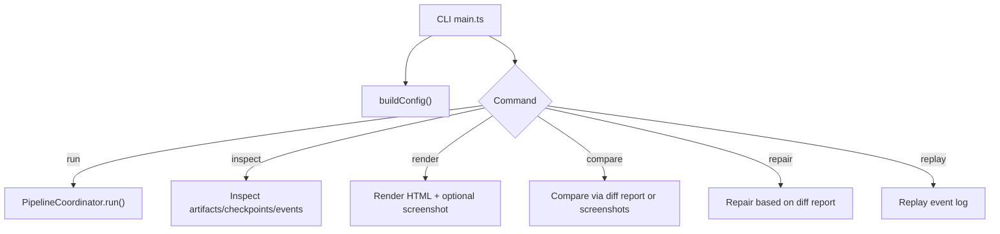
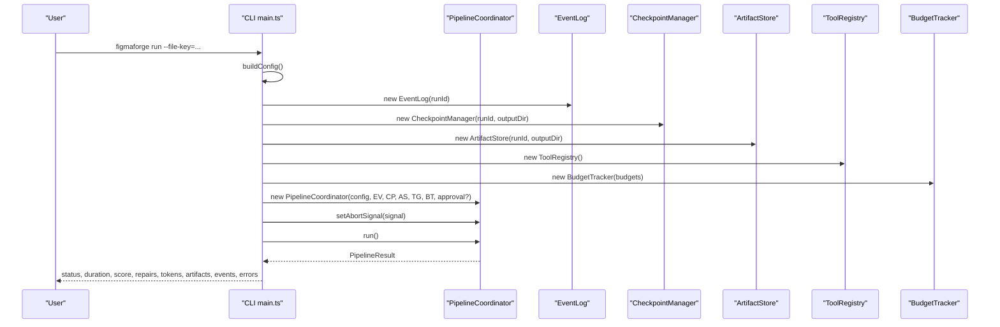
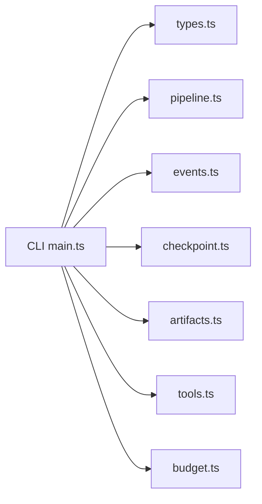

# Command Line Interface

<cite>
**Referenced Files in This Document**
- [main.ts](file://runtime/src/cli/main.ts)
- [types.ts](file://runtime/src/core/types.ts)
- [pipeline.ts](file://runtime/src/core/pipeline.ts)
- [runtime-architecture.md](file://docs/runtime-architecture.md)
- [runtime-troubleshooting.md](file://docs/runtime-troubleshooting.md)
</cite>

## Table of Contents
1. [Introduction](#introduction)
2. [Project Structure](#project-structure)
3. [Core Components](#core-components)
4. [Architecture Overview](#architecture-overview)
5. [Detailed Component Analysis](#detailed-component-analysis)
6. [Dependency Analysis](#dependency-analysis)
7. [Performance Considerations](#performance-considerations)
8. [Troubleshooting Guide](#troubleshooting-guide)
9. [Conclusion](#conclusion)
10. [Appendices](#appendices)

## Introduction
This document describes FigmaForge’s command line interface (CLI). It explains all available commands, their options and flags, output formats, error handling behavior, and how the CLI integrates with the runtime system to execute the full design-to-code pipeline or individual stages.

The CLI supports:
- run: Execute the full pipeline end-to-end for a Figma file
- inspect: Examine artifacts, checkpoints, and events from a previous run
- render: Standalone rendering stage using generated code from a prior run
- compare: Visual comparison stage using diff reports or screenshots from a prior run
- repair: Automated repair stage driven by diff reports from a prior run
- replay: Replay event logs from a previous run for debugging and auditing

## Project Structure
The CLI is implemented as a Node.js entry point that parses arguments, builds a runtime configuration, and dispatches to command handlers. Each command either runs the full pipeline or operates on artifacts produced by previous runs.

**Diagram sources**
- [main.ts:35-153](file://runtime/src/cli/main.ts#L35-L153)
- [main.ts:181-469](file://runtime/src/cli/main.ts#L181-L469)
- [pipeline.ts:137-207](file://runtime/src/core/pipeline.ts#L137-L207)

**Section sources**
- [main.ts:1-153](file://runtime/src/cli/main.ts#L1-L153)
- [runtime-architecture.md:153-169](file://docs/runtime-architecture.md#L153-L169)

## Core Components
- Argument parsing and help: Parses positional commands and flags; prints usage and examples.
- Configuration builder: Converts CLI flags into a RuntimeConfig consumed by the pipeline and utilities.
- Command handlers: Implement per-command logic for run, inspect, render, compare, repair, and replay.
- Pipeline integration: The run command constructs and executes the PipelineCoordinator with security, budgeting, checkpointing, and artifact storage.

Key behaviors:
- Default output directory: ./figmaforge-output unless overridden.
- Default viewport: 1440x900 unless overridden.
- Default similarity threshold: 0.95 unless overridden.
- Default targets: html_css; other supported targets include react_css, react_tailwind, vue, svelte, swiftui, flutter.
- Approval gates: Enabled by default; can be skipped with --no-approval.

**Section sources**
- [main.ts:35-153](file://runtime/src/cli/main.ts#L35-L153)
- [types.ts:86-178](file://runtime/src/core/types.ts#L86-L178)

## Architecture Overview
The CLI orchestrates a deterministic, staged pipeline. The run command initializes core services (event logging, checkpoints, artifacts, tools, budgets), sets up an approval callback when required, and delegates execution to the PipelineCoordinator. Individual stage commands operate on persisted artifacts from previous runs.

**Diagram sources**
- [main.ts:181-243](file://runtime/src/cli/main.ts#L181-L243)
- [pipeline.ts:82-135](file://runtime/src/core/pipeline.ts#L82-L135)
- [pipeline.ts:137-207](file://runtime/src/core/pipeline.ts#L137-L207)

**Section sources**
- [main.ts:181-243](file://runtime/src/cli/main.ts#L181-L243)
- [pipeline.ts:137-207](file://runtime/src/core/pipeline.ts#L137-L207)

## Detailed Component Analysis

### Global Options and Flags
These flags are recognized across commands where applicable. They are parsed and converted into a RuntimeConfig used by the pipeline and utilities.

- --file-key=<key>
  - Purpose: Figma file key required for the run command.
  - Behavior: If missing during run, the CLI exits with an error.
  - Example: --file-key=abc123

- --output-dir=<path>
  - Purpose: Base directory for outputs, artifacts, checkpoints, and renders.
  - Default: ./figmaforge-output
  - Example: --output-dir=./output

- --target=<target>
  - Purpose: Code generation target backend.
  - Allowed values: html_css, react_css, react_tailwind, vue, svelte, swiftui, flutter
  - Behavior: Unknown targets cause an error and exit.
  - Example: --target=react_tailwind

- --run-id=<id>
  - Purpose: Run identifier. Auto-generated if not provided.
  - Usage: Required for replay; optional for others to target a specific run.
  - Example: --run-id=run-abc

- --resume
  - Purpose: Resume from latest checkpoint when running the pipeline.
  - Behavior: Skips already completed stages and restores metrics.

- --threshold=<0.0-1.0>
  - Purpose: Similarity threshold for visual comparison.
  - Default: 0.95
  - Example: --threshold=0.9

- --max-iterations=<n>
  - Purpose: Maximum pipeline iterations.
  - Default: 20
  - Example: --max-iterations=10

- --max-repair=<n>
  - Purpose: Maximum repair iterations.
  - Default: 10
  - Example: --max-repair=5

- --max-time=<ms>
  - Purpose: Max time in milliseconds for the run.
  - Default: 300000 (5 minutes)
  - Example: --max-time=600000

- --viewport=<WxH>
  - Purpose: Viewport size for rendering.
  - Default: 1440x900
  - Example: --viewport=1920x1080

- --no-approval
  - Purpose: Skip approval gates for non-interactive runs.
  - Behavior: Without this flag, approval requests are auto-denied in non-interactive mode.

- --approve-dir=<path>
  - Purpose: Add an approved filesystem directory (repeatable).
  - Behavior: Used by PathSandbox to allow read/write within allowed paths.

- --verbose
  - Purpose: Enable verbose output (e.g., detailed event data in replay).

- --help
  - Purpose: Show help message with commands and examples.

Practical examples:
- Full pipeline run: figmaforge run --file-key=abc123 --output-dir=./output --target=react_tailwind --threshold=0.9 --max-iterations=10 --max-repair=5 --max-time=600000 --viewport=1920x1080 --no-approval
- Inspect a run: figmaforge inspect --run-id=run-abc --output-dir=./output
- Render standalone: figmaforge render --run-id=run-abc --output-dir=./output
- Compare standalone: figmaforge compare --run-id=run-abc --output-dir=./output
- Repair standalone: figmaforge repair --run-id=run-abc --output-dir=./output
- Replay events: figmaforge replay --run-id=run-abc --output-dir=./output --verbose

**Section sources**
- [main.ts:68-103](file://runtime/src/cli/main.ts#L68-L103)
- [main.ts:110-153](file://runtime/src/cli/main.ts#L110-L153)
- [types.ts:121-178](file://runtime/src/core/types.ts#L121-L178)

### Command: run
Executes the full pipeline end-to-end for a Figma file.

- Requirements:
  - --file-key is required; otherwise, the CLI exits with an error.
- Behavior:
  - Initializes EventLog, CheckpointManager, ArtifactStore, ToolRegistry, BudgetTracker.
  - Sets up approval callback when requireApproval is true; in non-interactive mode, approvals are auto-denied.
  - Configures cancellation via AbortController for SIGINT.
  - Executes PipelineCoordinator.run(), which iterates through pipeline stages with retry and budget checks.
  - Prints summary including status, duration, similarity score, repair iterations, tokens used, artifacts count, events count, and any errors.
  - Exits with non-zero status if the pipeline did not complete successfully.

Output:
- Console summary printed to stdout.
- Artifacts stored under <output-dir>/<run-id>/artifacts/.
- Checkpoints stored under <output-dir>/<run-id>/checkpoints/.
- Event log saved as part of final artifacts.

Common usage patterns:
- Single run: figmaforge run --file-key=abc123 --output-dir=./output
- Resume interrupted run: figmaforge run --file-key=abc123 --output-dir=./output --resume
- Non-interactive CI run: figmaforge run --file-key=abc123 --output-dir=./ci-out --no-approval --max-time=600000

Error handling:
- Missing --file-key causes immediate exit.
- Budget exceeded triggers failure with details in event log.
- Security violations (path sandbox, shell guard) stop execution and log errors.
- Stage failures are recorded and reported in the result.

Integration with runtime:
- Uses PipelineCoordinator to orchestrate stages deterministically.
- Leverages StateMachine for transitions, EventLog for audit trail, CheckpointManager for resumption, ArtifactStore for content-addressed outputs, BudgetTracker for limits, and ToolRegistry for tool invocation.

**Section sources**
- [main.ts:181-243](file://runtime/src/cli/main.ts#L181-L243)
- [pipeline.ts:137-207](file://runtime/src/core/pipeline.ts#L137-L207)
- [pipeline.ts:209-281](file://runtime/src/core/pipeline.ts#L209-L281)

### Command: inspect
Examines artifacts, checkpoints, and events from a previous run.

- Requirements:
  - --run-id optionally specifies the run to inspect; defaults to the configured run ID.
- Behavior:
  - Loads manifest.json from the run’s artifacts directory and lists artifacts with kind, label/path, and size.
  - Reads checkpoint files and prints stage progression and similarity scores.
  - Finds event log files and summarizes counts of errors and warnings; prints up to 10 error details.

Output:
- Human-readable console listing of artifacts, checkpoints, and event summaries.

Common usage patterns:
- Inspect latest run: figmaforge inspect --output-dir=./output
- Inspect specific run: figmaforge inspect --run-id=run-abc --output-dir=./output

Troubleshooting tips:
- If no manifest found, verify the run completed and artifacts were written.
- If no checkpoints found, check that the process was not killed mid-stage.

**Section sources**
- [main.ts:245-298](file://runtime/src/cli/main.ts#L245-L298)

### Command: render
Runs only the render stage for a specified run.

- Requirements:
  - --run-id optionally specifies the run; defaults to configured run ID.
- Behavior:
  - Looks for generated code artifact under <output-dir>/<run-id>/artifacts/ and loads it if present.
  - Creates <output-dir>/<run-id>/renders/ and writes render.html.
  - Attempts to take a screenshot via Playwright using python3; if unavailable, falls back to HTML-only render.

Output:
- Console messages indicating loaded artifacts and written files.
- render.html always written; screenshot.png written if Playwright succeeds.

Common usage patterns:
- Render without screenshot: figmaforge render --run-id=run-abc --output-dir=./output
- With custom viewport: figmaforge render --run-id=run-abc --output-dir=./output --viewport=1920x1080

Troubleshooting tips:
- If no generated code found, ensure the pipeline ran at least through generate.
- If Playwright fails, install Python dependencies or use HTML-only inspection.

**Section sources**
- [main.ts:339-403](file://runtime/src/cli/main.ts#L339-L403)

### Command: compare
Runs only the compare stage for a specified run.

- Requirements:
  - --run-id optionally specifies the run; defaults to configured run ID.
- Behavior:
  - Looks for a diff report under <output-dir>/<run-id>/artifacts/ and prints similarity score, categories, and mismatch count.
  - If no diff report exists, looks for a screenshot under <output-dir>/<run-id>/renders/ and informs about lack of reference image.
  - If neither exists, instructs to run the full pipeline first.

Output:
- Console summary of similarity and mismatches or guidance to run the pipeline.

Common usage patterns:
- Compare after full run: figmaforge compare --run-id=run-abc --output-dir=./output

Troubleshooting tips:
- Ensure the pipeline reached compare stage and artifacts were saved.
- For meaningful comparisons, ensure a reference image or diff report exists.

**Section sources**
- [main.ts:405-433](file://runtime/src/cli/main.ts#L405-L433)

### Command: repair
Runs only the repair stage for a specified run.

- Requirements:
  - --run-id optionally specifies the run; defaults to configured run ID.
- Behavior:
  - Looks for a diff report under <output-dir>/<run-id>/artifacts/ and prints mismatch counts and similarity score.
  - Categorizes mismatches by type and suggests running the full pipeline for automated patch generation and re-rendering.
  - If no diff report exists, instructs to run the full pipeline first.

Output:
- Console summary of mismatches and categories; guidance to run full pipeline for repair loop.

Common usage patterns:
- Analyze mismatches: figmaforge repair --run-id=run-abc --output-dir=./output
- After fixes, rerun full pipeline: figmaforge run --file-key=abc123 --output-dir=./output

Troubleshooting tips:
- If no mismatches found, the render matches the design within threshold.
- Use inspect to review event logs for underlying issues before repairing.

**Section sources**
- [main.ts:435-469](file://runtime/src/cli/main.ts#L435-L469)

### Command: replay
Replays a previous run from its event log.

- Requirements:
  - --run-id is required; otherwise, the CLI exits with an error.
- Behavior:
  - Locates event log files under <output-dir>/<run-id>/artifacts/ and prints each event with timestamp, level, kind, and message.
  - With --verbose, includes truncated event data.

Output:
- Console replay of events suitable for debugging and auditing.

Common usage patterns:
- Replay events: figmaforge replay --run-id=run-abc --output-dir=./output
- Verbose replay: figmaforge replay --run-id=run-abc --output-dir=./output --verbose

Troubleshooting tips:
- If no event log found, verify the run completed and artifacts were written.
- Use inspect to confirm presence of event log files.

**Section sources**
- [main.ts:300-337](file://runtime/src/cli/main.ts#L300-L337)

## Dependency Analysis
The CLI depends on core runtime modules to provide pipeline orchestration, security, budgeting, and persistence.

- Types define pipeline stages, config, targets, and defaults.
- PipelineCoordinator coordinates stages, state machine, retries, and budgets.
- Events, checkpoints, artifacts, tools, and budgets support observability, resumability, storage, execution, and limits.

**Diagram sources**
- [main.ts:14-23](file://runtime/src/cli/main.ts#L14-L23)
- [types.ts:12-26](file://runtime/src/core/types.ts#L12-L26)
- [pipeline.ts:12-26](file://runtime/src/core/pipeline.ts#L12-L26)

**Section sources**
- [main.ts:14-23](file://runtime/src/cli/main.ts#L14-L23)
- [types.ts:12-26](file://runtime/src/core/types.ts#L12-L26)
- [pipeline.ts:12-26](file://runtime/src/core/pipeline.ts#L12-L26)

## Performance Considerations
- Adjust thresholds and iteration limits to balance quality and speed:
  - Lower --max-iterations and --max-repair for faster runs.
  - Tune --threshold to accept lower similarity if needed.
- Reduce viewport size to speed up rendering when appropriate.
- Use --no-approval in automated environments to avoid interactive prompts.
- Clean old artifacts periodically to manage disk usage.
- Increase --max-time for complex designs or slower environments.

[No sources needed since this section provides general guidance]

## Troubleshooting Guide
Common issues and resolutions:
- Budget exceeded: Increase token/time budgets or reduce complexity. See runtime troubleshooting for details.
- Security violation (path sandbox): Add directories via --approve-dir.
- Security violation (shell guard): Only pre-approved commands are allowed; adjust environment accordingly.
- Approval required but no callback: Use --no-approval for non-interactive runs.
- Retry exhausted: Inspect event logs for underlying errors; increase retry attempts programmatically if needed.
- Checkpoint issues: Use unique run IDs or separate output directories; corrupt checkpoints are automatically skipped.

Debugging steps:
- Inspect runs: figmaforge inspect --run-id=<id> --output-dir=./output
- Replay events: figmaforge replay --run-id=<id> --output-dir=./output --verbose
- Check checkpoints and artifacts under <output-dir>/<run-id>/checkpoints/ and /artifacts/

**Section sources**
- [runtime-troubleshooting.md:35-108](file://docs/runtime-troubleshooting.md#L35-L108)
- [runtime-troubleshooting.md:127-157](file://docs/runtime-troubleshooting.md#L127-L157)

## Conclusion
FigmaForge’s CLI provides a streamlined interface to execute the full design-to-code pipeline or operate on individual stages using previously generated artifacts. It supports robust configuration via flags, deterministic execution with checkpoints and event logs, and safety mechanisms like approval gates and sandboxing. Use run for end-to-end processing, and inspect/compare/repair/replay for targeted workflows and debugging.

[No sources needed since this section summarizes without analyzing specific files]

## Appendices

### Output Formats and Locations
- Artifacts: <output-dir>/<run-id>/artifacts/
  - Contains generated code, asset manifests, diff reports, screenshots, and event logs.
- Checkpoints: <output-dir>/<run-id>/checkpoints/
  - JSON files per stage for resuming runs.
- Renders: <output-dir>/<run-id>/renders/
  - render.html and optional screenshot.png.
- Manifest: <output-dir>/<run-id>/artifacts/../manifest.json
  - Lists artifacts with kind, label/path, and size.

**Section sources**
- [main.ts:245-298](file://runtime/src/cli/main.ts#L245-L298)
- [runtime-troubleshooting.md:144-157](file://docs/runtime-troubleshooting.md#L144-L157)

### Error Handling Summary
- Validation errors (e.g., missing --file-key) cause immediate exit with descriptive messages.
- Pipeline errors are captured in the event log and surfaced in the run summary.
- Budget exceeded results in failure with dimension-specific details.
- Security violations halt execution and log precise reasons.

**Section sources**
- [main.ts:181-243](file://runtime/src/cli/main.ts#L181-L243)
- [pipeline.ts:167-181](file://runtime/src/core/pipeline.ts#L167-L181)
- [runtime-troubleshooting.md:35-90](file://docs/runtime-troubleshooting.md#L35-L90)