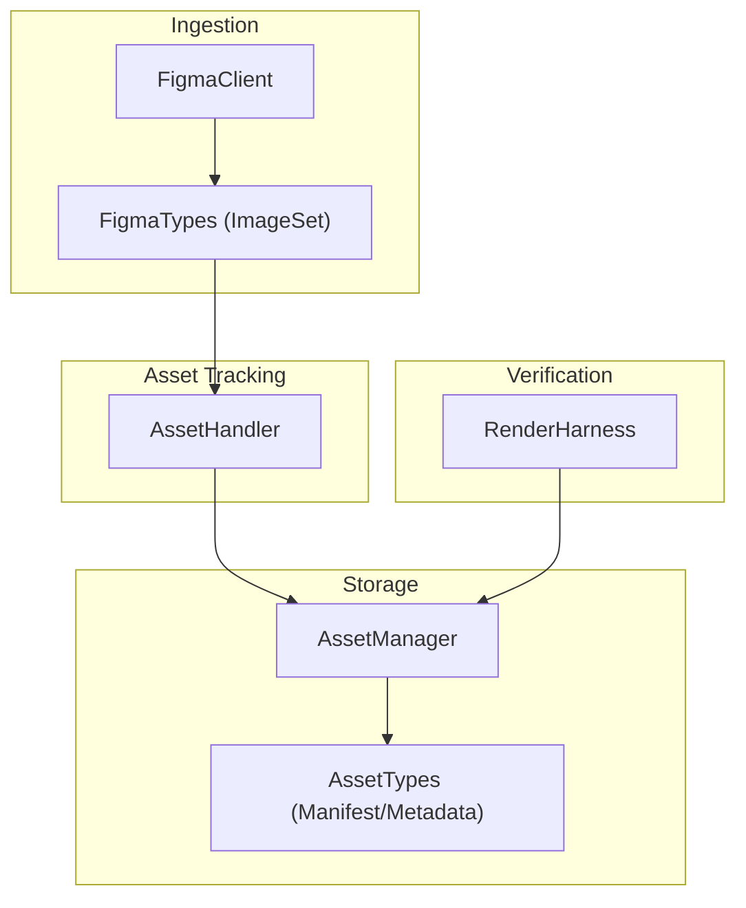
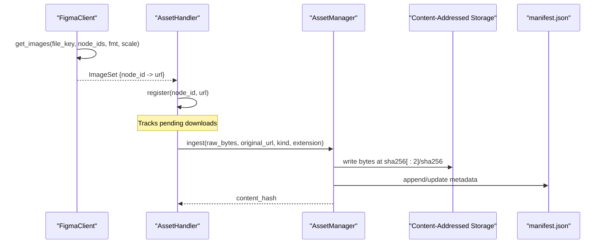
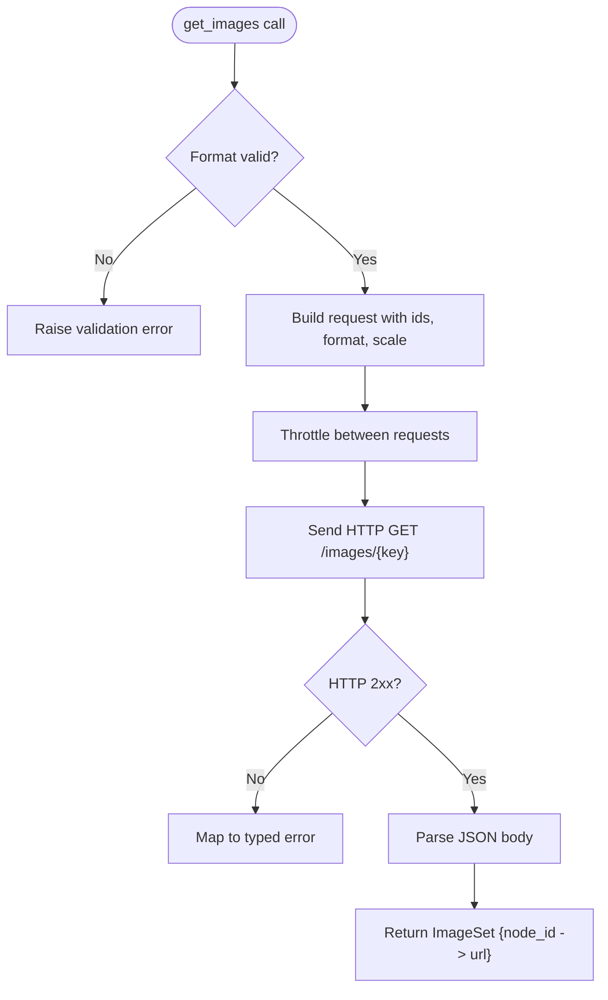
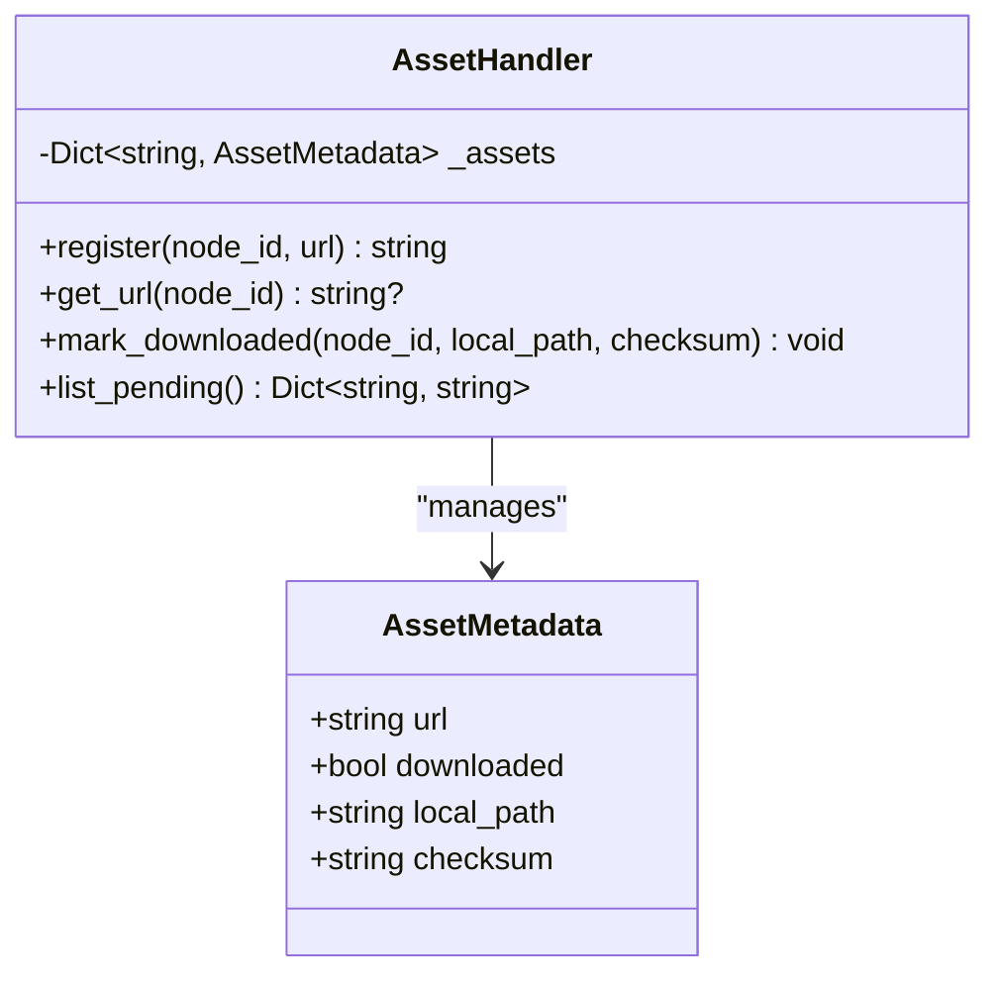
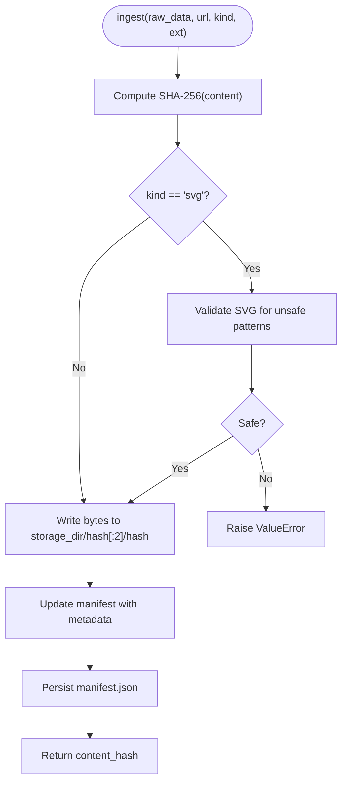
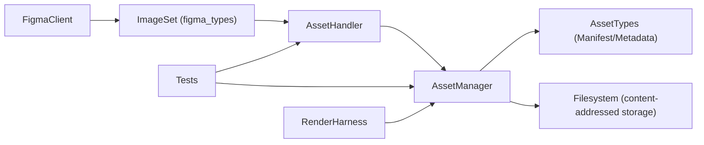

# Asset Processing

<cite>
**Referenced Files in This Document**
- [asset_manager.py](file://plugin/figmaforge/core/asset_manager.py)
- [asset_handler.py](file://plugin/figmaforge/core/asset_handler.py)
- [asset_types.py](file://plugin/figmaforge/core/asset_types.py)
- [figma_client.py](file://plugin/figmaforge/core/figma_client.py)
- [figma_types.py](file://plugin/figmaforge/core/figma_types.py)
- [test_asset_handler.py](file://plugin/figmaforge/tests/test_asset_handler.py)
- [images.json](file://plugin/figmaforge/fixtures/figma/images.json)
- [render_harness.py](file://plugin/figmaforge/core/render_harness.py)
- [main.ts](file://runtime/src/cli/main.ts)
</cite>

## Table of Contents
1. [Introduction](#introduction)
2. [Project Structure](#project-structure)
3. [Core Components](#core-components)
4. [Architecture Overview](#architecture-overview)
5. [Detailed Component Analysis](#detailed-component-analysis)
6. [Dependency Analysis](#dependency-analysis)
7. [Performance Considerations](#performance-considerations)
8. [Troubleshooting Guide](#troubleshooting-guide)
9. [Conclusion](#conclusion)
10. [Appendices](#appendices)

## Introduction
This document explains the Asset Processing system that handles images, media files, and other assets derived from Figma designs. It covers how asset references are extracted from Figma API responses, how assets are tracked and stored, how references are resolved for generated code, and how missing or broken assets are handled. It also documents the asset manager’s role in dependency tracking, caching via content-addressed storage, and storage organization. Finally, it provides examples of workflows, configuration options relevant to optimization, integration patterns with build systems, security considerations, performance guidance for large asset libraries, and troubleshooting steps.

## Project Structure
The asset processing subsystem spans several modules:
- Figma client and types define how image URLs are obtained from Figma.
- Asset handler tracks per-node asset references and download status.
- Asset manager stores downloaded bytes using content addressing and maintains a manifest.
- Types define the data structures used across the pipeline.
- Tests and fixtures validate behavior and provide sample payloads.
- Render harness integrates with browser rendering for verification.
- Runtime CLI exposes build-time configuration flags that influence output and behavior.

**Diagram sources**
- [figma_client.py:134-163](file://plugin/figmaforge/core/figma_client.py#L134-L163)
- [figma_types.py:545-553](file://plugin/figmaforge/core/figma_types.py#L545-L553)
- [asset_handler.py:29-59](file://plugin/figmaforge/core/asset_handler.py#L29-L59)
- [asset_manager.py:15-58](file://plugin/figmaforge/core/asset_manager.py#L15-L58)
- [asset_types.py:13-45](file://plugin/figmaforge/core/asset_types.py#L13-L45)
- [render_harness.py:19-43](file://plugin/figmaforge/core/render_harness.py#L19-L43)

**Section sources**
- [figma_client.py:1-325](file://plugin/figmaforge/core/figma_client.py#L1-L325)
- [figma_types.py:1-567](file://plugin/figmaforge/core/figma_types.py#L1-L567)
- [asset_handler.py:1-60](file://plugin/figmaforge/core/asset_handler.py#L1-L60)
- [asset_manager.py:1-81](file://plugin/figmaforge/core/asset_manager.py#L1-L81)
- [asset_types.py:1-46](file://plugin/figmaforge/core/asset_types.py#L1-L46)
- [render_harness.py:1-44](file://plugin/figmaforge/core/render_harness.py#L1-L44)

## Core Components
- FigmaClient: Retrieves file metadata, nodes, and image URLs from the Figma API. The image endpoint returns URLs only; actual downloading is delegated elsewhere.
- ImageSet: Typed container for node-id-to-URL mappings returned by the images endpoint.
- AssetHandler: In-memory registry mapping Figma node IDs to asset URLs and their download state. It does not perform network I/O itself.
- AssetManager: Persists downloaded asset bytes using SHA-256 content addressing, validates SVGs, and maintains a persistent manifest of ingested assets.
- AssetTypes: Data models for manifests and metadata describing each asset’s provenance and type.
- RenderHarness: Placeholder harness for browser-based rendering and screenshot capture during verification.

Key responsibilities:
- Extracting asset references from Figma API responses.
- Tracking which assets have been downloaded and where they are stored.
- Ensuring safe ingestion of SVGs and deterministic storage via content hashing.
- Maintaining a manifest for reproducible builds and dependency resolution.

**Section sources**
- [figma_client.py:111-163](file://plugin/figmaforge/core/figma_client.py#L111-L163)
- [figma_types.py:545-553](file://plugin/figmaforge/core/figma_types.py#L545-L553)
- [asset_handler.py:19-59](file://plugin/figmaforge/core/asset_handler.py#L19-L59)
- [asset_manager.py:15-81](file://plugin/figmaforge/core/asset_manager.py#L15-L81)
- [asset_types.py:13-45](file://plugin/figmaforge/core/asset_types.py#L13-L45)
- [render_harness.py:19-43](file://plugin/figmaforge/core/render_harness.py#L19-L43)

## Architecture Overview
The asset processing pipeline follows these stages:
1. Fetch image URLs from Figma using the images endpoint.
2. Register discovered URLs against node IDs in the asset handler.
3. Download assets (external to this layer), then mark them as downloaded with local paths and checksums.
4. Ingest asset bytes into the asset manager to compute content hashes, validate SVGs, store bytes in a content-addressed layout, and update the manifest.
5. Use the manifest to resolve references when generating code or verifying outputs.

**Diagram sources**
- [figma_client.py:134-163](file://plugin/figmaforge/core/figma_client.py#L134-L163)
- [asset_handler.py:35-59](file://plugin/figmaforge/core/asset_handler.py#L35-L59)
- [asset_manager.py:37-58](file://plugin/figmaforge/core/asset_manager.py#L37-L58)
- [asset_types.py:13-45](file://plugin/figmaforge/core/asset_types.py#L13-L45)

## Detailed Component Analysis

### FigmaClient and Image Retrieval
- Purpose: Request renderable asset URLs for specific nodes. Returns URL references only; callers decide whether to download.
- Format selection: Accepts png, svg, pdf, jpg, webp. Invalid formats raise a validation error.
- Scale parameter: Allows requesting different scales for raster outputs.
- Error handling: Retries on transient errors, respects Retry-After headers, maps HTTP statuses to typed exceptions.

**Diagram sources**
- [figma_client.py:134-163](file://plugin/figmaforge/core/figma_client.py#L134-L163)
- [figma_client.py:166-205](file://plugin/figmaforge/core/figma_client.py#L166-L205)
- [figma_client.py:231-248](file://plugin/figmaforge/core/figma_client.py#L231-L248)
- [figma_client.py:303-324](file://plugin/figmaforge/core/figma_client.py#L303-L324)

**Section sources**
- [figma_client.py:134-163](file://plugin/figmaforge/core/figma_client.py#L134-L163)
- [figma_client.py:166-205](file://plugin/figmaforge/core/figma_client.py#L166-L205)
- [figma_client.py:231-248](file://plugin/figmaforge/core/figma_client.py#L231-L248)
- [figma_client.py:303-324](file://plugin/figmaforge/core/figma_client.py#L303-L324)

### AssetHandler: Reference Registry and Download State
- Purpose: Maintain a map from Figma node IDs to asset URLs and track download progress.
- Registration: Idempotent; first registration wins.
- Pending list: Exposes all URLs not yet downloaded.
- Marking downloaded: Records local path and checksum; removes from pending. Unknown node IDs log a warning.

**Diagram sources**
- [asset_handler.py:19-59](file://plugin/figmaforge/core/asset_handler.py#L19-L59)

**Section sources**
- [asset_handler.py:19-59](file://plugin/figmaforge/core/asset_handler.py#L19-L59)
- [test_asset_handler.py:22-110](file://plugin/figmaforge/tests/test_asset_handler.py#L22-L110)

### AssetManager: Content-Addressed Storage and Validation
- Purpose: Ingest raw asset bytes, compute SHA-256 hash, validate SVGs, store bytes deterministically, and persist a manifest.
- Storage layout: Two-level prefix directory based on the first two characters of the hash to avoid flat directories.
- Manifest: Stores original URL, content hash, kind, and extension for each asset.
- SVG validation: Rejects unsafe SVG content containing scripts or dangerous attributes.

**Diagram sources**
- [asset_manager.py:37-58](file://plugin/figmaforge/core/asset_manager.py#L37-L58)
- [asset_manager.py:60-81](file://plugin/figmaforge/core/asset_manager.py#L60-L81)

**Section sources**
- [asset_manager.py:15-81](file://plugin/figmaforge/core/asset_manager.py#L15-L81)
- [asset_types.py:13-45](file://plugin/figmaforge/core/asset_types.py#L13-L45)
- [test_render_pipeline.py:21-35](file://plugin/figmaforge/tests/test_render_pipeline.py#L21-L35)

### AssetTypes: Manifest and Metadata Models
- AssetManifest: Holds a dictionary mapping content hashes to AssetMetadata.
- AssetMetadata: Captures original URL, content hash, kind (image/svg/font), extension, license, and source.

These models enable reproducible builds and clear provenance for each asset.

**Section sources**
- [asset_types.py:13-45](file://plugin/figmaforge/core/asset_types.py#L13-L45)

### Rendering Integration
- RenderHarness: Provides a deterministic interface for rendering HTML to screenshots and extracting layout metadata. Currently a placeholder suitable for integration with Playwright.

**Section sources**
- [render_harness.py:19-43](file://plugin/figmaforge/core/render_harness.py#L19-L43)

## Dependency Analysis
The following diagram shows how components depend on each other during asset processing:

**Diagram sources**
- [figma_client.py:134-163](file://plugin/figmaforge/core/figma_client.py#L134-L163)
- [figma_types.py:545-553](file://plugin/figmaforge/core/figma_types.py#L545-L553)
- [asset_handler.py:29-59](file://plugin/figmaforge/core/asset_handler.py#L29-L59)
- [asset_manager.py:15-58](file://plugin/figmaforge/core/asset_manager.py#L15-L58)
- [asset_types.py:13-45](file://plugin/figmaforge/core/asset_types.py#L13-L45)
- [test_asset_handler.py:18-110](file://plugin/figmaforge/tests/test_asset_handler.py#L18-L110)
- [render_harness.py:19-43](file://plugin/figmaforge/core/render_harness.py#L19-L43)

**Section sources**
- [figma_client.py:134-163](file://plugin/figmaforge/core/figma_client.py#L134-L163)
- [asset_handler.py:29-59](file://plugin/figmaforge/core/asset_handler.py#L29-L59)
- [asset_manager.py:15-58](file://plugin/figmaforge/core/asset_manager.py#L15-L58)
- [asset_types.py:13-45](file://plugin/figmaforge/core/asset_types.py#L13-L45)

## Performance Considerations
- Content-addressed storage: Using SHA-256 ensures deduplication and fast lookups by hash. Two-level prefix directories prevent filesystem bottlenecks with many files.
- Manifest persistence: On-disk manifest enables incremental builds and avoids reprocessing identical assets.
- Network efficiency: The Figma client supports retries, backoff, and respects Retry-After headers to reduce wasted requests under rate limits.
- Format selection: Choosing appropriate formats (e.g., webp, svg) can reduce payload sizes and improve load times.
- Large libraries: For large asset sets, consider batching node ID queries to the images endpoint and parallelizing downloads while respecting rate limits.

[No sources needed since this section provides general guidance]

## Troubleshooting Guide
Common issues and resolutions:
- Missing or broken asset references:
  - Ensure the node IDs used to fetch images match those present in the Figma file.
  - Verify the images endpoint returns URLs for the requested node IDs.
  - Confirm the asset handler has registered each node ID before marking downloads.
- Authentication failures:
  - Ensure the Figma token is configured via environment variable or constructor argument.
  - Handle typed authentication errors raised by the client.
- Rate limiting:
  - Respect Retry-After headers and use built-in retry/backoff logic.
  - Adjust rate limit delay if necessary.
- Unsafe SVG content:
  - If SVG ingestion fails due to unsafe patterns, sanitize or replace the asset.
- Partial downloads:
  - Use the pending list to identify assets not yet downloaded and complete the process.

**Section sources**
- [figma_client.py:91-108](file://plugin/figmaforge/core/figma_client.py#L91-L108)
- [figma_client.py:166-205](file://plugin/figmaforge/core/figma_client.py#L166-L205)
- [asset_manager.py:60-81](file://plugin/figmaforge/core/asset_manager.py#L60-L81)
- [asset_handler.py:46-59](file://plugin/figmaforge/core/asset_handler.py#L46-L59)
- [test_asset_handler.py:76-88](file://plugin/figmaforge/tests/test_asset_handler.py#L76-L88)

## Conclusion
The Asset Processing system separates concerns cleanly:
- FigmaClient retrieves asset URLs from Figma with robust error handling.
- AssetHandler tracks references and download state without performing I/O.
- AssetManager persists assets deterministically, validates SVGs, and maintains a manifest for reproducibility.
Together, these components provide a reliable foundation for building design-driven code generation pipelines with strong guarantees around asset provenance, safety, and performance.

[No sources needed since this section summarizes without analyzing specific files]

## Appendices

### Example Workflows
- End-to-end asset workflow:
  1. Call get_images with file key and node IDs to obtain URLs.
  2. Register each node ID and URL in AssetHandler.
  3. Download assets externally, then mark them as downloaded with local paths and checksums.
  4. Ingest bytes into AssetManager to compute hashes, validate SVGs, store content, and update the manifest.
  5. Use the manifest to resolve asset references in generated code.

- Fixture-based testing:
  - Use images fixture to simulate Figma image responses.
  - Assert registration, pending lists, and download marking behavior.

**Section sources**
- [figma_client.py:134-163](file://plugin/figmaforge/core/figma_client.py#L134-L163)
- [asset_handler.py:35-59](file://plugin/figmaforge/core/asset_handler.py#L35-L59)
- [asset_manager.py:37-58](file://plugin/figmaforge/core/asset_manager.py#L37-L58)
- [images.json:1-14](file://plugin/figmaforge/fixtures/figma/images.json#L1-L14)
- [test_asset_handler.py:91-110](file://plugin/figmaforge/tests/test_asset_handler.py#L91-L110)

### Configuration Options Relevant to Optimization
- Image format and scale:
  - Choose among png, svg, pdf, jpg, webp via the images endpoint.
  - Adjust scale to balance quality and size.
- Build-time flags:
  - Output directory, target platform, viewport dimensions, thresholds, and iteration limits can be set via CLI flags. These influence how assets are referenced and rendered in generated outputs.

**Section sources**
- [figma_client.py:134-163](file://plugin/figmaforge/core/figma_client.py#L134-L163)
- [main.ts:112-135](file://runtime/src/cli/main.ts#L112-L135)

### Security Considerations
- SVG sanitization:
  - Reject SVGs containing script tags, event handlers, embedded objects, or data URIs that could execute code.
- Token handling:
  - Do not log tokens or include them in error messages. Retrieve from environment variables or constructor arguments.
- Network safety:
  - Use timeouts and handle network errors gracefully.

**Section sources**
- [asset_manager.py:60-81](file://plugin/figmaforge/core/asset_manager.py#L60-L81)
- [figma_client.py:6-15](file://plugin/figmaforge/core/figma_client.py#L6-L15)
- [figma_client.py:91-108](file://plugin/figmaforge/core/figma_client.py#L91-L108)

### Integration Patterns with Build Systems
- Asset reference resolution:
  - After ingestion, use the manifest to map node IDs to content hashes and generate stable references in code outputs.
- Deterministic outputs:
  - Content-addressed storage ensures identical inputs produce identical outputs, enabling reproducible builds.
- Verification:
  - Use RenderHarness to capture screenshots and compare outputs across runs.

**Section sources**
- [asset_manager.py:15-58](file://plugin/figmaforge/core/asset_manager.py#L15-L58)
- [asset_types.py:13-45](file://plugin/figmaforge/core/asset_types.py#L13-L45)
- [render_harness.py:19-43](file://plugin/figmaforge/core/render_harness.py#L19-L43)