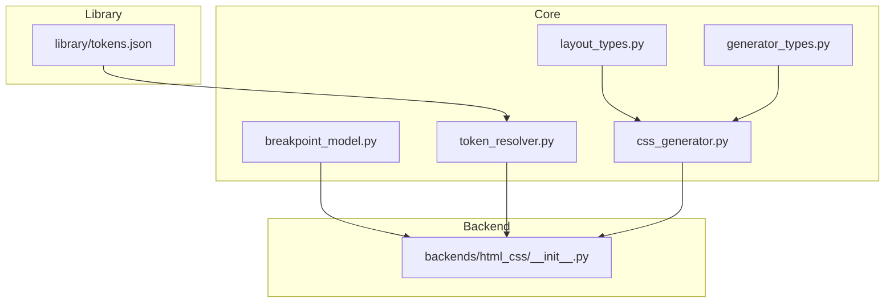
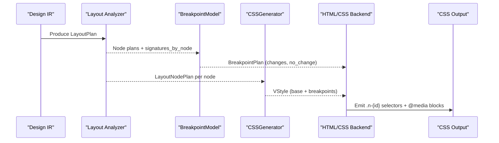
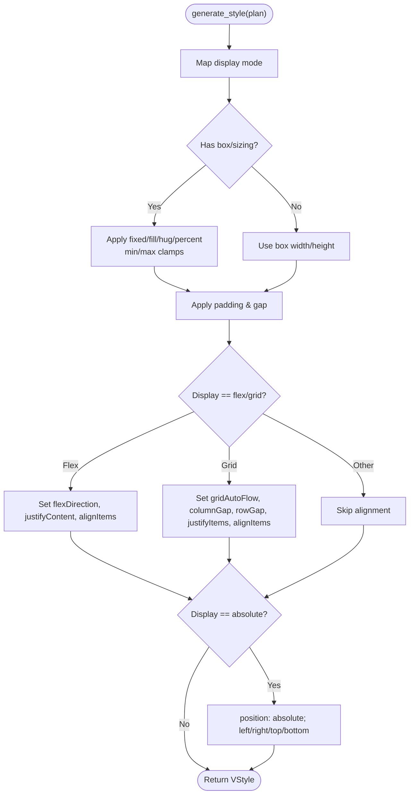
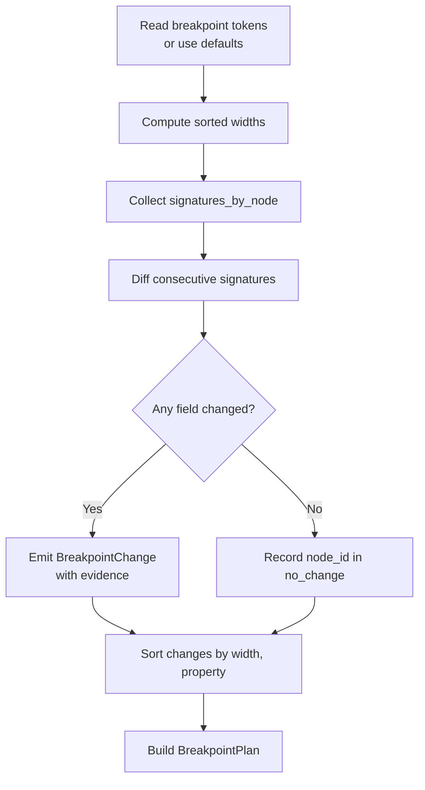
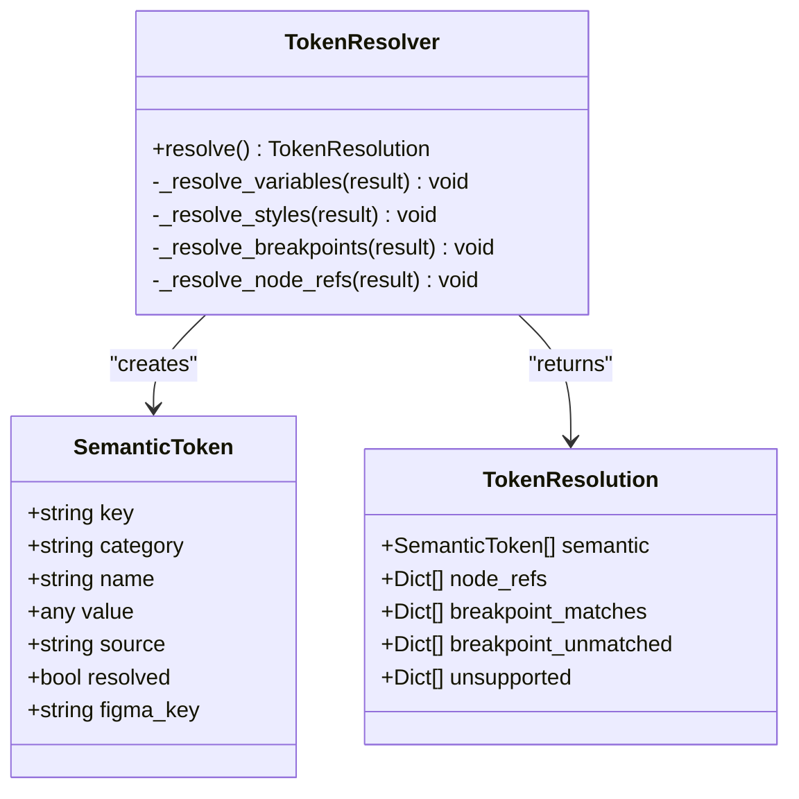
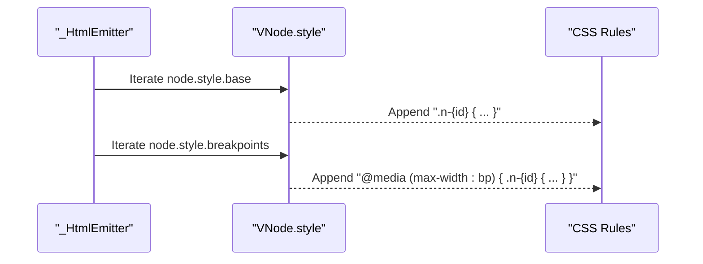
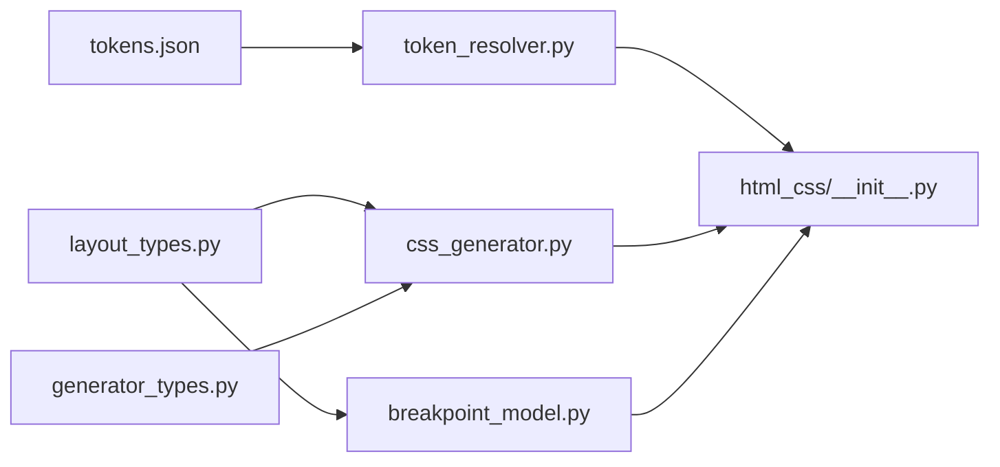

# CSS Style Generator

<cite>
**Referenced Files in This Document**
- [css_generator.py](file://plugin/figmaforge/core/css_generator.py)
- [breakpoint_model.py](file://plugin/figmaforge/core/breakpoint_model.py)
- [layout_types.py](file://plugin/figmaforge/core/layout_types.py)
- [generator_types.py](file://plugin/figmaforge/core/generator_types.py)
- [token_resolver.py](file://plugin/figmaforge/core/token_resolver.py)
- [tokens.json](file://plugin/figmaforge/library/tokens.json)
- [__init__.py (HTML/CSS backend)](file://plugin/figmaforge/backends/html_css/__init__.py)
- [test_css_generator.py](file://plugin/figmaforge/tests/test_css_generator.py)
</cite>

## Table of Contents
1. [Introduction](#introduction)
2. [Project Structure](#project-structure)
3. [Core Components](#core-components)
4. [Architecture Overview](#architecture-overview)
5. [Detailed Component Analysis](#detailed-component-analysis)
6. [Dependency Analysis](#dependency-analysis)
7. [Performance Considerations](#performance-considerations)
8. [Troubleshooting Guide](#troubleshooting-guide)
9. [Conclusion](#conclusion)
10. [Appendices](#appendices)

## Introduction
This document explains the CSS Style Generator that transforms layout plans into modular, responsive CSS output. It covers how the generator:
- Extracts styles from layout properties (display, sizing, spacing, alignment, anchoring).
- Produces responsive styles with breakpoint handling and media queries.
- Implements naming conventions for consistent class generation.
- Manages CSS specificity to avoid conflicts.
- Converts design tokens to CSS variables via token resolution.
- Generates media queries for different screen sizes based on measured evidence.
It also includes examples of generated modules, breakpoint configurations, styling patterns, performance considerations, and integration guidance for CSS-in-JS or traditional stylesheets.

## Project Structure
The CSS generation pipeline is split across core abstractions and a concrete HTML/CSS backend:
- Core types define the framework-neutral layout plan and virtual style structures consumed by generators.
- The CSS generator converts layout plans into VStyle dictionaries.
- The breakpoint model infers responsive changes from measured layout signatures.
- The token resolver maps Figma variables/styles to semantic tokens and breakpoints.
- The HTML/CSS backend renders VNode trees into HTML + CSS, including class names and media queries.

**Diagram sources**
- [css_generator.py:23-87](file://plugin/figmaforge/core/css_generator.py#L23-L87)
- [breakpoint_model.py:36-114](file://plugin/figmaforge/core/breakpoint_model.py#L36-L114)
- [layout_types.py:412-521](file://plugin/figmaforge/core/layout_types.py#L412-L521)
- [generator_types.py:15-58](file://plugin/figmaforge/core/generator_types.py#L15-L58)
- [token_resolver.py:124-146](file://plugin/figmaforge/core/token_resolver.py#L124-L146)
- [__init__.py (HTML/CSS backend):110-164](file://plugin/figmaforge/backends/html_css/__init__.py#L110-L164)
- [tokens.json:1-19](file://plugin/figmaforge/library/tokens.json#L1-L19)

**Section sources**
- [css_generator.py:23-87](file://plugin/figmaforge/core/css_generator.py#L23-L87)
- [breakpoint_model.py:36-114](file://plugin/figmaforge/core/breakpoint_model.py#L36-L114)
- [layout_types.py:412-521](file://plugin/figmaforge/core/layout_types.py#L412-L521)
- [generator_types.py:15-58](file://plugin/figmaforge/core/generator_types.py#L15-L58)
- [token_resolver.py:124-146](file://plugin/figmaforge/core/token_resolver.py#L124-L146)
- [__init__.py (HTML/CSS backend):110-164](file://plugin/figmaforge/backends/html_css/__init__.py#L110-L164)
- [tokens.json:1-19](file://plugin/figmaforge/library/tokens.json#L1-L19)

## Core Components
- LayoutPlan and LayoutNodePlan describe display modes, sizing, spacing, alignment, anchors, overflow, text wrapping, and per-node confidence/diagnostics.
- VStyle abstracts base and breakpoint-specific CSS property maps used by adapters.
- CSSGenerator converts a LayoutNodePlan into a VStyle dictionary, mapping display, sizing, spacing, alignment, and absolute positioning to CSS properties.
- BreakpointModel builds a numeric breakpoint ladder from library tokens and infers responsive changes only when measured evidence shows differences between consecutive widths.
- TokenResolver resolves Figma variables/styles into semantic tokens and breakpoint matches, preferring existing library tokens and emitting references rather than duplicating values.
- HTML/CSS backend emits HTML nodes with scoped class names and generates CSS rules, including media queries for breakpoint overrides.

**Section sources**
- [layout_types.py:412-521](file://plugin/figmaforge/core/layout_types.py#L412-L521)
- [generator_types.py:15-58](file://plugin/figmaforge/core/generator_types.py#L15-L58)
- [css_generator.py:23-87](file://plugin/figmaforge/core/css_generator.py#L23-L87)
- [breakpoint_model.py:36-114](file://plugin/figmaforge/core/breakpoint_model.py#L36-L114)
- [token_resolver.py:124-146](file://plugin/figmaforge/core/token_resolver.py#L124-L146)
- [__init__.py (HTML/CSS backend):110-164](file://plugin/figmaforge/backends/html_css/__init__.py#L110-L164)

## Architecture Overview
The pipeline flows from Design IR to LayoutPlan, then to VStyle, and finally to CSS output. Responsive behavior is inferred from measured layout signatures at multiple viewport widths and emitted as media queries.

**Diagram sources**
- [layout_types.py:412-521](file://plugin/figmaforge/core/layout_types.py#L412-L521)
- [breakpoint_model.py:90-114](file://plugin/figmaforge/core/breakpoint_model.py#L90-L114)
- [css_generator.py:23-87](file://plugin/figmaforge/core/css_generator.py#L23-L87)
- [__init__.py (HTML/CSS backend):318-337](file://plugin/figmaforge/backends/html_css/__init__.py#L318-L337)

## Detailed Component Analysis

### CSSGenerator: From Layout Plan to VStyle
- Entry point generate_style constructs a VStyle and applies:
  - Display mapping (flex/grid/absolute/block).
  - Sizing modes (fixed/fill/hug/percent) with min/max clamps.
  - Spacing (padding edges and gap).
  - Flex/Grid alignment and direction.
  - Absolute positioning with anchor offsets.
- Mapping helpers translate internal alignment constants to CSS values.

**Diagram sources**
- [css_generator.py:23-87](file://plugin/figmaforge/core/css_generator.py#L23-L87)
- [css_generator.py:91-159](file://plugin/figmaforge/core/css_generator.py#L91-L159)

**Section sources**
- [css_generator.py:23-87](file://plugin/figmaforge/core/css_generator.py#L23-L87)
- [css_generator.py:91-159](file://plugin/figmaforge/core/css_generator.py#L91-L159)
- [test_css_generator.py:53-197](file://plugin/figmaforge/tests/test_css_generator.py#L53-L197)

### BreakpointModel: Evidence-Based Responsive Changes
- Builds a numeric breakpoint ladder from library tokens (with defaults if none provided).
- Infers per-node responsive changes by comparing layout signatures at consecutive widths.
- Emits BreakpointChange entries only when there is measurable difference; nodes without change are explicitly recorded.

**Diagram sources**
- [breakpoint_model.py:36-114](file://plugin/figmaforge/core/breakpoint_model.py#L36-L114)
- [breakpoint_model.py:117-171](file://plugin/figmaforge/core/breakpoint_model.py#L117-L171)

**Section sources**
- [breakpoint_model.py:36-114](file://plugin/figmaforge/core/breakpoint_model.py#L36-L114)
- [breakpoint_model.py:117-171](file://plugin/figmaforge/core/breakpoint_model.py#L117-L171)

### TokenResolver: Semantic Tokens and Breakpoints
- Resolves Figma variables/styles into semantic tokens across categories (color, typography, spacing, radius, shadow, opacity, breakpoint).
- Prefers existing library tokens and emits references instead of duplicating values.
- Maps frames/pages to breakpoints using alias matching and records matched/unmatched nodes.

**Diagram sources**
- [token_resolver.py:80-121](file://plugin/figmaforge/core/token_resolver.py#L80-L121)
- [token_resolver.py:124-146](file://plugin/figmaforge/core/token_resolver.py#L124-L146)
- [token_resolver.py:149-283](file://plugin/figmaforge/core/token_resolver.py#L149-L283)

**Section sources**
- [token_resolver.py:124-146](file://plugin/figmaforge/core/token_resolver.py#L124-L146)
- [token_resolver.py:149-283](file://plugin/figmaforge/core/token_resolver.py#L149-L283)
- [tokens.json:1-19](file://plugin/figmaforge/library/tokens.json#L1-L19)

### HTML/CSS Backend: Class Naming, Specificity, and Media Queries
- Generates unique class names per node using a deterministic prefix derived from the node id.
- Emits base CSS rules for each node’s VStyle.base.
- For each breakpoint override in VStyle.breakpoints, emits an @media block targeting max-width thresholds.
- Uses simple class selectors to keep specificity low and predictable, avoiding conflicts.

**Diagram sources**
- [__init__.py (HTML/CSS backend):318-337](file://plugin/figmaforge/backends/html_css/__init__.py#L318-L337)

**Section sources**
- [__init__.py (HTML/CSS backend):318-337](file://plugin/figmaforge/backends/html_css/__init__.py#L318-L337)

## Dependency Analysis
- CSSGenerator depends on layout_types for plan models and constants, and generator_types for VStyle.
- BreakpointModel depends on layout_types for breakpoint data structures and library_tokens for breakpoint sizes.
- TokenResolver depends on ir_types and library_types to resolve variables/styles and map breakpoints.
- HTML/CSS backend consumes VNode/VStyle and emits CSS, relying on layout_types for display/sizing constants.

**Diagram sources**
- [layout_types.py:412-521](file://plugin/figmaforge/core/layout_types.py#L412-L521)
- [generator_types.py:15-58](file://plugin/figmaforge/core/generator_types.py#L15-L58)
- [css_generator.py:23-87](file://plugin/figmaforge/core/css_generator.py#L23-L87)
- [breakpoint_model.py:36-114](file://plugin/figmaforge/core/breakpoint_model.py#L36-L114)
- [token_resolver.py:124-146](file://plugin/figmaforge/core/token_resolver.py#L124-L146)
- [__init__.py (HTML/CSS backend):110-164](file://plugin/figmaforge/backends/html_css/__init__.py#L110-L164)

**Section sources**
- [layout_types.py:412-521](file://plugin/figmaforge/core/layout_types.py#L412-L521)
- [generator_types.py:15-58](file://plugin/figmaforge/core/generator_types.py#L15-L58)
- [css_generator.py:23-87](file://plugin/figmaforge/core/css_generator.py#L23-L87)
- [breakpoint_model.py:36-114](file://plugin/figmaforge/core/breakpoint_model.py#L36-L114)
- [token_resolver.py:124-146](file://plugin/figmaforge/core/token_resolver.py#L124-L146)
- [__init__.py (HTML/CSS backend):110-164](file://plugin/figmaforge/backends/html_css/__init__.py#L110-L164)

## Performance Considerations
- Minimal selector specificity: Using single-class selectors (.n-{id}) keeps specificity low, reducing cascade complexity and improving maintainability.
- Evidence-based breakpoints: Only emit responsive changes when measured differences exist, minimizing unnecessary media queries.
- Compact VStyle: Base and breakpoint styles are aggregated per node, enabling efficient rendering and fewer duplicate rules.
- Library token reuse: Prefer existing tokens to avoid duplication and reduce token table size.

[No sources needed since this section provides general guidance]

## Troubleshooting Guide
- Unexpected sizing: Verify AxisSizing.mode and ensure min/max constraints are set where needed; tests cover fixed/fill/hug/percent behaviors.
- Missing alignment: Confirm display mode is flex or grid and that alignment fields are present; mapping helpers convert internal constants to CSS values.
- Breakpoint anomalies: Check signatures_by_node and ensure measurements differ between widths; nodes without changes appear in no_change.
- Token mismatches: Ensure library tokens exist for expected categories; unresolved tokens are reported under unsupported and node_refs with reasons.

**Section sources**
- [test_css_generator.py:53-197](file://plugin/figmaforge/tests/test_css_generator.py#L53-L197)
- [breakpoint_model.py:90-114](file://plugin/figmaforge/core/breakpoint_model.py#L90-L114)
- [token_resolver.py:149-283](file://plugin/figmaforge/core/token_resolver.py#L149-L283)

## Conclusion
The CSS Style Generator produces modular, responsive CSS from layout plans by:
- Translating layout properties into VStyle dictionaries.
- Generating scoped classes and media queries based on measured responsive changes.
- Leveraging semantic tokens to avoid duplication and maintain consistency.
- Keeping specificity low through simple class selectors.
This approach supports both traditional stylesheets and can be adapted to CSS-in-JS solutions by consuming the same VStyle and breakpoint structures.

[No sources needed since this section summarizes without analyzing specific files]

## Appendices

### Examples of Generated CSS Modules
- Base rule example: A container with flex display, padding, and gap becomes a single class selector with corresponding properties.
- Responsive override example: At a breakpoint threshold, the same class receives overridden properties inside an @media block.

[No sources needed since this section provides conceptual examples]

### Breakpoint Configurations
- Breakpoint ladder derived from library tokens (e.g., sm/md/lg) or defaults when not defined.
- Changes are emitted only when layout signatures differ between consecutive widths.

**Section sources**
- [breakpoint_model.py:36-114](file://plugin/figmaforge/core/breakpoint_model.py#L36-L114)
- [tokens.json:1-19](file://plugin/figmaforge/library/tokens.json#L1-L19)

### Styling Patterns
- Flex layouts: flexDirection, justifyContent, alignItems mapped from alignment specs.
- Grid layouts: gridAutoFlow, columnGap, rowGap, justifyItems, alignItems mapped from direction and alignment specs.
- Absolute positioning: position and anchor offsets applied when required by the solver.

**Section sources**
- [css_generator.py:48-87](file://plugin/figmaforge/core/css_generator.py#L48-L87)
- [css_generator.py:91-159](file://plugin/figmaforge/core/css_generator.py#L91-L159)

### Integration with CSS-in-JS or Traditional Stylesheets
- Consume VStyle.base and VStyle.breakpoints to generate inline styles, CSS Modules, or Tailwind utility mappings.
- Use breakpoint keys to wrap overrides in theme-aware media queries or conditional styles.
- Leverage token references to bind CSS variables or theme tokens in your runtime.

[No sources needed since this section provides general guidance]