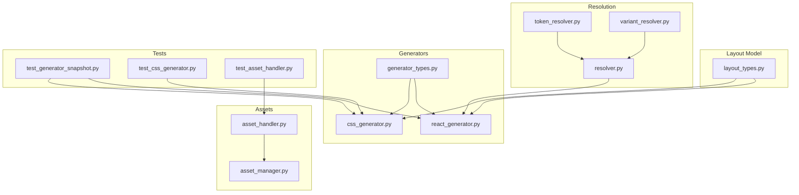
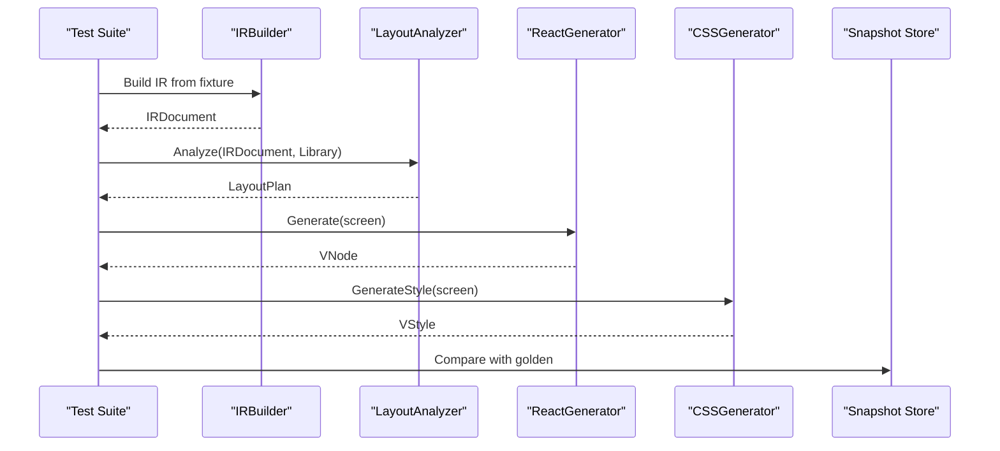
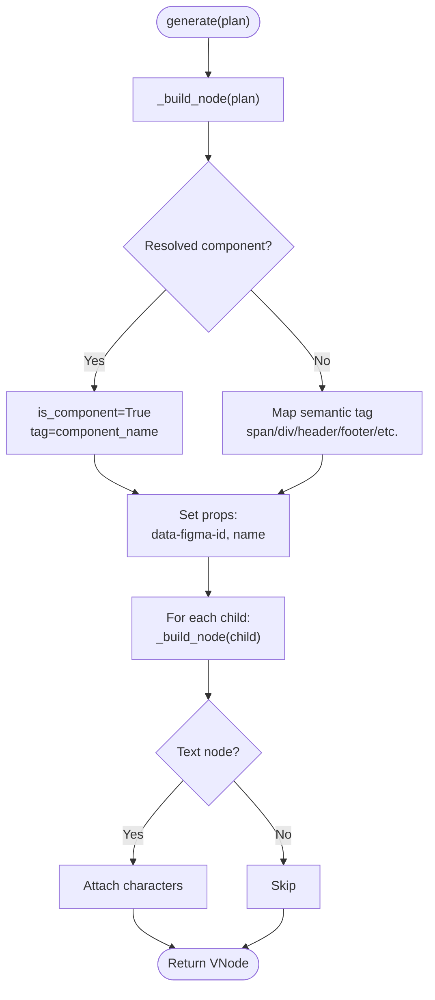
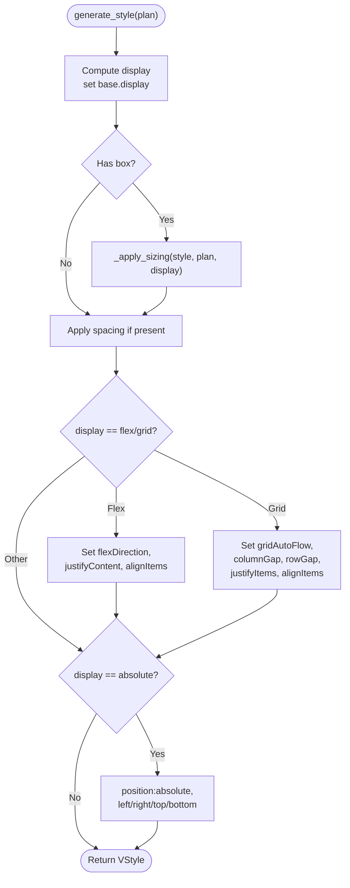
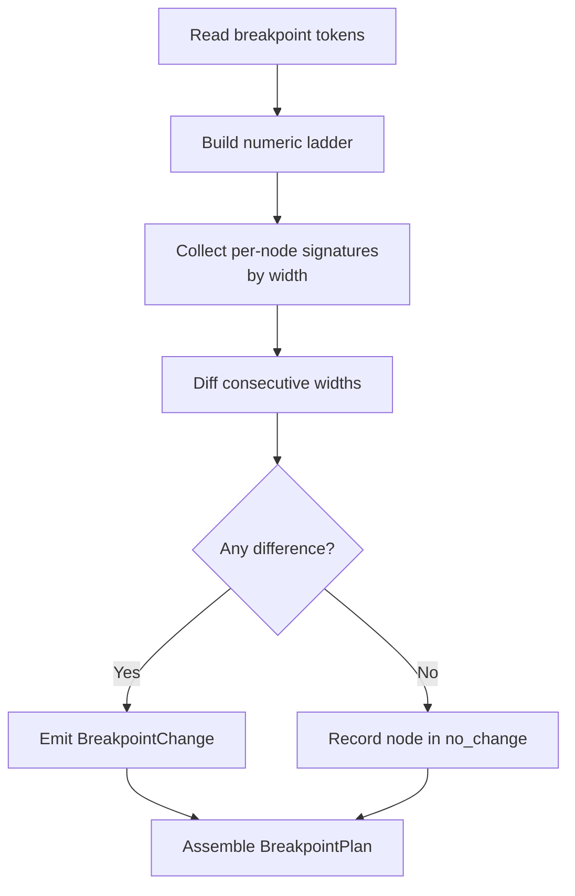
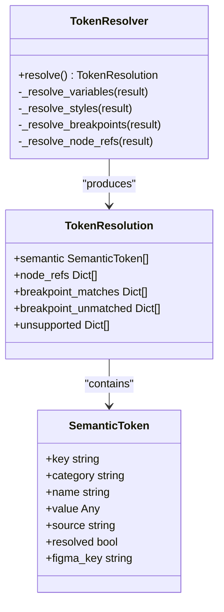
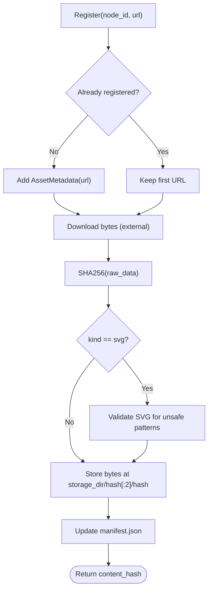
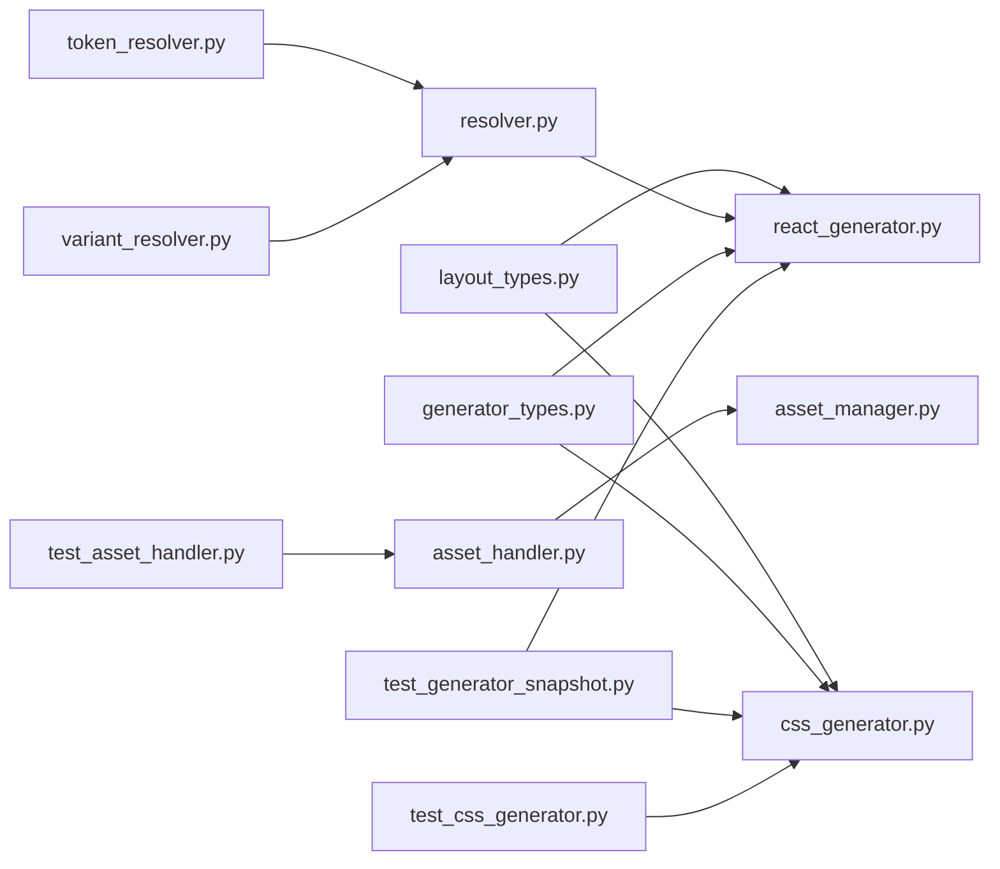

# Code Generation System

<cite>
**Referenced Files in This Document**
- [react_generator.py](file://plugin/figmaforge/core/react_generator.py)
- [css_generator.py](file://plugin/figmaforge/core/css_generator.py)
- [generator_types.py](file://plugin/figmaforge/core/generator_types.py)
- [layout_types.py](file://plugin/figmaforge/core/layout_types.py)
- [resolver.py](file://plugin/figmaforge/core/resolver.py)
- [breakpoint_model.py](file://plugin/figmaforge/core/breakpoint_model.py)
- [token_resolver.py](file://plugin/figmaforge/core/token_resolver.py)
- [variant_resolver.py](file://plugin/figmaforge/core/variant_resolver.py)
- [asset_handler.py](file://plugin/figmaforge/core/asset_handler.py)
- [asset_manager.py](file://plugin/figmaforge/core/asset_manager.py)
- [test_generator_snapshot.py](file://plugin/figmaforge/tests/test_generator_snapshot.py)
- [test_css_generator.py](file://plugin/figmaforge/tests/test_css_generator.py)
- [test_asset_handler.py](file://plugin/figmaforge/tests/test_asset_handler.py)
</cite>

## Table of Contents
1. [Introduction](#introduction)
2. [Project Structure](#project-structure)
3. [Core Components](#core-components)
4. [Architecture Overview](#architecture-overview)
5. [Detailed Component Analysis](#detailed-component-analysis)
6. [Dependency Analysis](#dependency-analysis)
7. [Performance Considerations](#performance-considerations)
8. [Troubleshooting Guide](#troubleshooting-guide)
9. [Conclusion](#conclusion)
10. [Appendices](#appendices)

## Introduction
This document explains FigmaForge’s code generation system that transforms layout plans into production-quality React components and modular CSS output. It covers:
- The React Component Generator that builds a framework-neutral VNode tree, maps semantic tags, integrates project components, and manages props and styling.
- The CSS Style Generator that produces modular styles with breakpoint handling, naming conventions, and specificity management.
- The Asset Processing system for image/media handling, optimization, reference resolution, and fallback strategies.
It also includes examples of generated artifacts (via snapshot tests), customization options, and extension points for different frameworks and styling approaches.

## Project Structure
The code generation pipeline is implemented in the plugin core under plugin/figmaforge/core. Key modules include:
- Layout plan model and types (framework-neutral)
- Resolution pipeline (components, variants, instances, tokens)
- Generators (React VNode, CSS style dictionaries)
- Asset handlers and managers (reference mapping and content-addressed storage)
- Tests and snapshots validating deterministic outputs

**Diagram sources**
- [layout_types.py:1-120](file://plugin/figmaforge/core/layout_types.py#L1-L120)
- [resolver.py:1-161](file://plugin/figmaforge/core/resolver.py#L1-L161)
- [token_resolver.py:1-120](file://plugin/figmaforge/core/token_resolver.py#L1-L120)
- [variant_resolver.py:1-101](file://plugin/figmaforge/core/variant_resolver.py#L1-L101)
- [react_generator.py:1-121](file://plugin/figmaforge/core/react_generator.py#L1-L121)
- [css_generator.py:1-159](file://plugin/figmaforge/core/css_generator.py#L1-L159)
- [generator_types.py:1-72](file://plugin/figmaforge/core/generator_types.py#L1-L72)
- [asset_handler.py:1-60](file://plugin/figmaforge/core/asset_handler.py#L1-L60)
- [asset_manager.py:1-81](file://plugin/figmaforge/core/asset_manager.py#L1-L81)
- [test_generator_snapshot.py:1-110](file://plugin/figmaforge/tests/test_generator_snapshot.py#L1-L110)
- [test_css_generator.py:1-202](file://plugin/figmaforge/tests/test_css_generator.py#L1-L202)
- [test_asset_handler.py:1-115](file://plugin/figmaforge/tests/test_asset_handler.py#L1-L115)

**Section sources**
- [layout_types.py:1-120](file://plugin/figmaforge/core/layout_types.py#L1-L120)
- [react_generator.py:1-121](file://plugin/figmaforge/core/react_generator.py#L1-L121)
- [css_generator.py:1-159](file://plugin/figmaforge/core/css_generator.py#L1-L159)
- [generator_types.py:1-72](file://plugin/figmaforge/core/generator_types.py#L1-L72)
- [resolver.py:1-161](file://plugin/figmaforge/core/resolver.py#L1-L161)
- [asset_handler.py:1-60](file://plugin/figmaforge/core/asset_handler.py#L1-L60)
- [asset_manager.py:1-81](file://plugin/figmaforge/core/asset_manager.py#L1-L81)
- [test_generator_snapshot.py:1-110](file://plugin/figmaforge/tests/test_generator_snapshot.py#L1-L110)
- [test_css_generator.py:1-202](file://plugin/figmaforge/tests/test_css_generator.py#L1-L202)
- [test_asset_handler.py:1-115](file://plugin/figmaforge/tests/test_asset_handler.py#L1-L115)

## Core Components
- LayoutPlan and LayoutNodePlan define a framework-neutral description of layout, sizing, spacing, alignment, anchors, overflow, text, breakpoints, confidence, diagnostics, and children.
- ResolutionReport aggregates component matching, instance resolution, variant extraction, and token resolution results consumed by generators.
- VNode and VStyle are framework-neutral intermediate representations used by generators to produce final code via adapters.
- AssetHandler tracks Figma asset URL references; AssetManager stores assets by content hash and validates SVGs.

Key responsibilities:
- ReactGenerator: converts LayoutNodePlan into VNode trees, resolves semantic tags or project components, sets props, and attaches styles.
- CSSGenerator: converts LayoutNodePlan constraints into VStyle dictionaries with display, sizing, spacing, alignment, and absolute positioning.
- BreakpointModel: infers responsive changes from measured layout signatures across widths.
- TokenResolver: normalizes Figma variables/styles into semantic tokens and node-level references.
- VariantResolver: extracts variant properties from instances and component sets.

**Section sources**
- [layout_types.py:102-540](file://plugin/figmaforge/core/layout_types.py#L102-L540)
- [resolver.py:34-161](file://plugin/figmaforge/core/resolver.py#L34-L161)
- [generator_types.py:15-72](file://plugin/figmaforge/core/generator_types.py#L15-L72)
- [asset_handler.py:19-60](file://plugin/figmaforge/core/asset_handler.py#L19-L60)
- [asset_manager.py:15-81](file://plugin/figmaforge/core/asset_manager.py#L15-L81)

## Architecture Overview
The code generation pipeline takes a resolved design IR and produces a VNode tree and style map per screen. A snapshot test demonstrates the full flow: build IR, analyze layout, generate VNode and VStyle, and compare against golden snapshots.

**Diagram sources**
- [test_generator_snapshot.py:36-51](file://plugin/figmaforge/tests/test_generator_snapshot.py#L36-L51)
- [react_generator.py:58-91](file://plugin/figmaforge/core/react_generator.py#L58-L91)
- [css_generator.py:26-87](file://plugin/figmaforge/core/css_generator.py#L26-L87)

## Detailed Component Analysis

### React Component Generator
Responsibilities:
- Builds a hierarchical VNode tree from LayoutNodePlan.
- Resolves whether a node should be a project component or an HTML tag using a resolution report.
- Maps semantic names to HTML tags (header, nav, section, main, aside, footer).
- Emits props such as data-figma-id and name, and handles text content.

Key behaviors:
- If a node_id maps to a resolved component, emits is_component=True and uses the component name as tag.
- Otherwise, falls back to semantic tag mapping based on kind and display/name.
- Recursively processes children and attaches text content for text nodes.

**Diagram sources**
- [react_generator.py:58-121](file://plugin/figmaforge/core/react_generator.py#L58-L121)

**Section sources**
- [react_generator.py:16-121](file://plugin/figmaforge/core/react_generator.py#L16-L121)
- [resolver.py:34-109](file://plugin/figmaforge/core/resolver.py#L34-L109)
- [test_generator_snapshot.py:83-95](file://plugin/figmaforge/tests/test_generator_snapshot.py#L83-L95)

### CSS Style Generator
Responsibilities:
- Converts layout constraints into VStyle dictionaries suitable for adapters (inline styles, CSS Modules, Tailwind).
- Handles display modes (flex, grid, absolute, block).
- Applies sizing modes (fixed, fill, hug, percent) with min/max clamps.
- Sets padding, gap, alignment, and absolute positioning anchors.

Key behaviors:
- Flex direction and alignment mapped to justifyContent/alignItems.
- Grid auto-flow set based on direction; column/row gap aliases applied.
- Absolute positioning only when solver requires it; left/right/top/bottom set from anchors.
- Sizing mode logic ensures correct CSS property emission per axis.

**Diagram sources**
- [css_generator.py:26-159](file://plugin/figmaforge/core/css_generator.py#L26-L159)

**Section sources**
- [css_generator.py:23-159](file://plugin/figmaforge/core/css_generator.py#L23-L159)
- [test_css_generator.py:53-202](file://plugin/figmaforge/tests/test_css_generator.py#L53-L202)

### Breakpoint Handling and Responsive Changes
Responsibilities:
- Reads breakpoint tokens from library or defaults to create a numeric ladder.
- Infers per-node responsive changes by comparing layout signatures at consecutive widths.
- Records explicit no-change nodes to avoid silent assumptions.

Key behaviors:
- Ladder derived from library tokens; fallback to sm/md/lg/xl defaults.
- Signature compares width, height, sizing modes, wrap, text lines, overflow.
- Emission only when evidence shows change between widths.

**Diagram sources**
- [breakpoint_model.py:36-171](file://plugin/figmaforge/core/breakpoint_model.py#L36-L171)

**Section sources**
- [breakpoint_model.py:26-171](file://plugin/figmaforge/core/breakpoint_model.py#L26-L171)
- [layout_types.py:358-405](file://plugin/figmaforge/core/layout_types.py#L358-L405)

### Token Resolution and Semantic Tokens
Responsibilities:
- Normalizes Figma variables and styles into semantic tokens (color, typography, spacing, radius, shadow, opacity, breakpoint).
- Prefers existing library tokens; otherwise creates new tokens with references.
- Emits node-level bindings as token references rather than duplicated values.

Key behaviors:
- Classifies float variables by name fragments into categories.
- Matches frames/pages to breakpoint tokens by aliasing rules.
- Tracks unresolved tokens and unsupported types explicitly.

**Diagram sources**
- [token_resolver.py:80-122](file://plugin/figmaforge/core/token_resolver.py#L80-L122)
- [token_resolver.py:124-146](file://plugin/figmaforge/core/token_resolver.py#L124-L146)

**Section sources**
- [token_resolver.py:1-374](file://plugin/figmaforge/core/token_resolver.py#L1-L374)

### Variant Resolution
Responsibilities:
- Extracts variant properties from instances and component sets deterministically.
- Parses Prop=Value segments from variant names; falls back to a single variant label when unparseable.

Key behaviors:
- Instance properties sourced from raw payload componentProperties.
- Component-set variants parsed from child component names and defaultVariant id.

**Section sources**
- [variant_resolver.py:1-101](file://plugin/figmaforge/core/variant_resolver.py#L1-L101)

### Asset Processing System
Responsibilities:
- AssetHandler manages mappings from Figma node IDs to URLs and tracks download status.
- AssetManager performs content-addressed storage using SHA256, validates SVGs, and persists a manifest.

Key behaviors:
- Register/get URL operations; mark downloaded with local path and checksum.
- Content-addressed storage with two-level prefix directories; manifest.json tracks metadata.
- SVG validation rejects dangerous patterns (scripts, event handlers, embedded media).

**Diagram sources**
- [asset_handler.py:29-60](file://plugin/figmaforge/core/asset_handler.py#L29-L60)
- [asset_manager.py:15-81](file://plugin/figmaforge/core/asset_manager.py#L15-L81)

**Section sources**
- [asset_handler.py:1-60](file://plugin/figmaforge/core/asset_handler.py#L1-L60)
- [asset_manager.py:1-81](file://plugin/figmaforge/core/asset_manager.py#L1-L81)
- [test_asset_handler.py:22-115](file://plugin/figmaforge/tests/test_asset_handler.py#L22-L115)

## Dependency Analysis
Generators depend on the layout plan model and optional resolution reports. Asset processing is decoupled from layout but integrated via node IDs. Tests validate deterministic outputs and behavior.

**Diagram sources**
- [layout_types.py:102-540](file://plugin/figmaforge/core/layout_types.py#L102-L540)
- [react_generator.py:1-121](file://plugin/figmaforge/core/react_generator.py#L1-L121)
- [css_generator.py:1-159](file://plugin/figmaforge/core/css_generator.py#L1-L159)
- [resolver.py:1-161](file://plugin/figmaforge/core/resolver.py#L1-L161)
- [token_resolver.py:1-374](file://plugin/figmaforge/core/token_resolver.py#L1-L374)
- [variant_resolver.py:1-101](file://plugin/figmaforge/core/variant_resolver.py#L1-L101)
- [generator_types.py:1-72](file://plugin/figmaforge/core/generator_types.py#L1-L72)
- [asset_handler.py:1-60](file://plugin/figmaforge/core/asset_handler.py#L1-L60)
- [asset_manager.py:1-81](file://plugin/figmaforge/core/asset_manager.py#L1-L81)
- [test_generator_snapshot.py:1-110](file://plugin/figmaforge/tests/test_generator_snapshot.py#L1-L110)
- [test_css_generator.py:1-202](file://plugin/figmaforge/tests/test_css_generator.py#L1-L202)
- [test_asset_handler.py:1-115](file://plugin/figmaforge/tests/test_asset_handler.py#L1-L115)

**Section sources**
- [layout_types.py:102-540](file://plugin/figmaforge/core/layout_types.py#L102-L540)
- [react_generator.py:1-121](file://plugin/figmaforge/core/react_generator.py#L1-L121)
- [css_generator.py:1-159](file://plugin/figmaforge/core/css_generator.py#L1-L159)
- [resolver.py:1-161](file://plugin/figmaforge/core/resolver.py#L1-L161)
- [token_resolver.py:1-374](file://plugin/figmaforge/core/token_resolver.py#L1-L374)
- [variant_resolver.py:1-101](file://plugin/figmaforge/core/variant_resolver.py#L1-L101)
- [generator_types.py:1-72](file://plugin/figmaforge/core/generator_types.py#L1-L72)
- [asset_handler.py:1-60](file://plugin/figmaforge/core/asset_handler.py#L1-L60)
- [asset_manager.py:1-81](file://plugin/figmaforge/core/asset_manager.py#L1-L81)
- [test_generator_snapshot.py:1-110](file://plugin/figmaforge/tests/test_generator_snapshot.py#L1-L110)
- [test_css_generator.py:1-202](file://plugin/figmaforge/tests/test_css_generator.py#L1-L202)
- [test_asset_handler.py:1-115](file://plugin/figmaforge/tests/test_asset_handler.py#L1-L115)

## Performance Considerations
- Deterministic serialization: All generator outputs use stable keys and rounding to ensure reproducible snapshots and diffs.
- Minimal branching in CSS mapping: Display and sizing modes are mapped directly to CSS properties to reduce overhead.
- Content-addressed asset storage: Avoids duplicate downloads and enables fast lookups via hashes.
- Evidence-based breakpoints: Only emit responsive changes when measured differences exist, preventing unnecessary CSS bloat.

[No sources needed since this section provides general guidance]

## Troubleshooting Guide
Common issues and resolutions:
- Missing snapshot files: Run the generator snapshot test with environment variable enabled to regenerate golden files and review diffs.
- Unexpected tag mapping: Ensure node names match semantic tag table or adjust naming conventions; verify resolution report mapping for components.
- CSS property mismatches: Confirm sizing mode and display settings align with expected CSS emission; check min/max clamps and gap/padding values.
- Asset download failures: Verify registration order and pending list; ensure mark_downloaded is called with correct node_id and metadata; inspect logs for unknown node warnings.
- SVG security errors: Remove unsafe patterns from SVG content (scripts, event handlers, embedded media) before ingestion.

**Section sources**
- [test_generator_snapshot.py:58-78](file://plugin/figmaforge/tests/test_generator_snapshot.py#L58-L78)
- [react_generator.py:93-121](file://plugin/figmaforge/core/react_generator.py#L93-L121)
- [css_generator.py:91-159](file://plugin/figmaforge/core/css_generator.py#L91-L159)
- [asset_handler.py:46-59](file://plugin/figmaforge/core/asset_handler.py#L46-L59)
- [asset_manager.py:60-81](file://plugin/figmaforge/core/asset_manager.py#L60-L81)

## Conclusion
FigmaForge’s code generation system provides a robust, framework-neutral pipeline that transforms layout plans into structured VNode trees and modular CSS style dictionaries. It integrates component resolution, semantic tokenization, variant handling, and asset processing while ensuring deterministic outputs and clear diagnostics. The architecture supports extensibility through adapters for different frameworks and styling approaches, enabling production-quality React components and scalable CSS.

[No sources needed since this section summarizes without analyzing specific files]

## Appendices

### Examples of Generated Artifacts
- VNode tree and base style map per screen are produced and compared against golden snapshots in tests.
- Snapshot regeneration is supported via an environment flag to update checked-in expectations when changes are intentional.

**Section sources**
- [test_generator_snapshot.py:36-51](file://plugin/figmaforge/tests/test_generator_snapshot.py#L36-L51)
- [test_generator_snapshot.py:58-78](file://plugin/figmaforge/tests/test_generator_snapshot.py#L58-L78)

### Customization Options and Extension Points
- Semantic tag mapping: Extend _SEMANTIC_TAG_BY_NAME to support additional container names mapping to semantic HTML tags.
- Display and alignment mapping: Customize CSSGenerator._map_display and alignment mappers to adapt to different CSS frameworks.
- Breakpoint ladder: Override library tokens or named sizes to tailor responsive behavior to project needs.
- Token categories: Extend TokenResolver classification to support additional variable types or custom naming conventions.
- Asset validation: Extend SVG safety checks in AssetManager to enforce stricter policies or support additional formats.

**Section sources**
- [react_generator.py:16-29](file://plugin/figmaforge/core/react_generator.py#L16-L29)
- [css_generator.py:146-159](file://plugin/figmaforge/core/css_generator.py#L146-L159)
- [breakpoint_model.py:26-62](file://plugin/figmaforge/core/breakpoint_model.py#L26-L62)
- [token_resolver.py:40-55](file://plugin/figmaforge/core/token_resolver.py#L40-L55)
- [asset_manager.py:60-81](file://plugin/figmaforge/core/asset_manager.py#L60-L81)