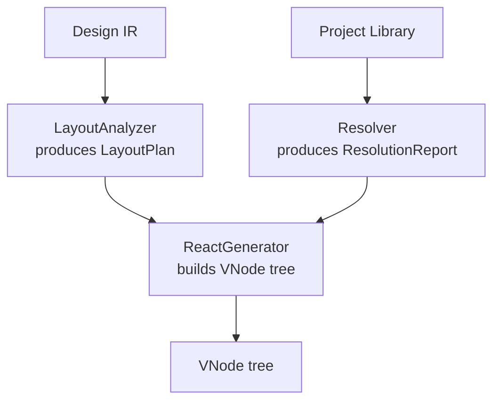
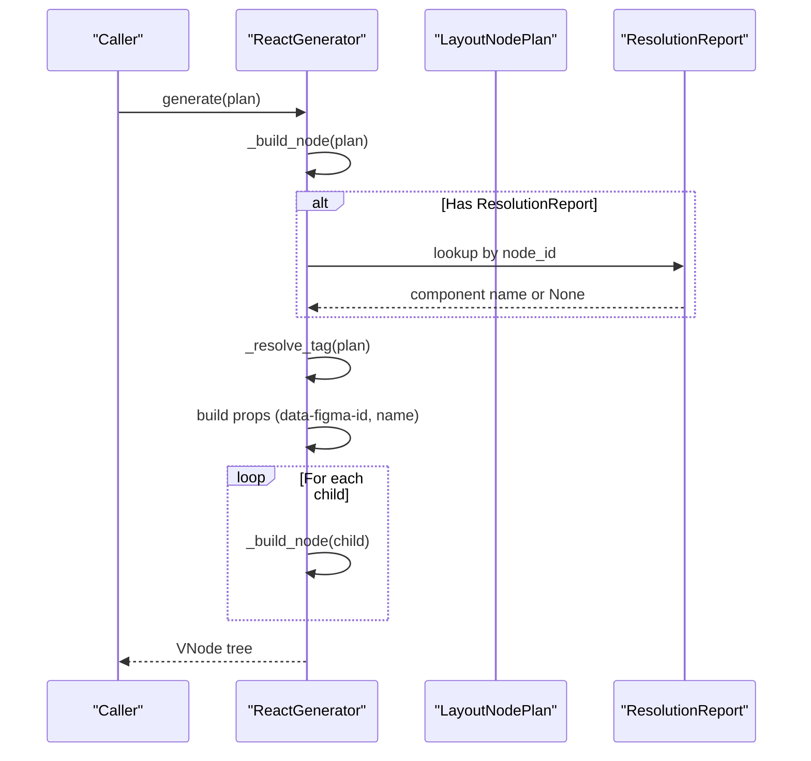
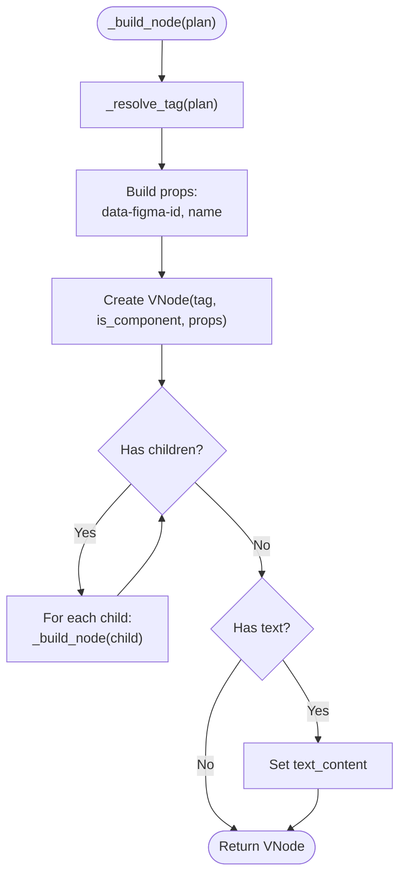
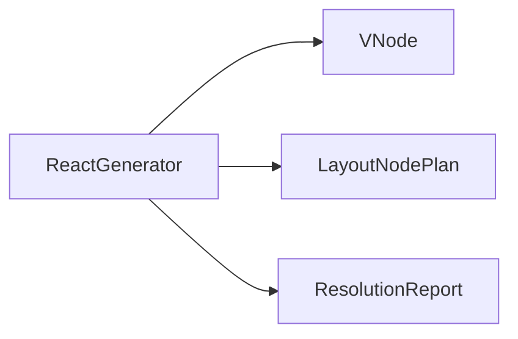

# React Component Generator

<cite>
**Referenced Files in This Document**
- [react_generator.py](file://plugin/figmaforge/core/react_generator.py)
- [generator_types.py](file://plugin/figmaforge/core/generator_types.py)
- [layout_types.py](file://plugin/figmaforge/core/layout_types.py)
- [resolver.py](file://plugin/figmaforge/core/resolver.py)
- [test_generator_snapshot.py](file://plugin/figmaforge/tests/test_generator_snapshot.py)
- [desktop-gen.json](file://plugin/figmaforge/tests/snapshots/generator/desktop-gen.json)
- [resolution-report.schema.json](file://plugin/figmaforge/schemas/resolution-report.schema.json)
</cite>

## Table of Contents
1. [Introduction](#introduction)
2. [Project Structure](#project-structure)
3. [Core Components](#core-components)
4. [Architecture Overview](#architecture-overview)
5. [Detailed Component Analysis](#detailed-component-analysis)
6. [Dependency Analysis](#dependency-analysis)
7. [Performance Considerations](#performance-considerations)
8. [Troubleshooting Guide](#troubleshooting-guide)
9. [Conclusion](#conclusion)
10. [Appendices](#appendices)

## Introduction
This document explains the React Component Generator that transforms a fully resolved LayoutPlan into a hierarchical VNode (Virtual Node) tree representing the component structure of a design. It covers how the generator builds trees, maps semantic HTML tags from Figma node names, integrates project components via a resolution report, manages props and text content, and recursively processes children. It also documents customization options for tag mapping and the relationship with the resolution pipeline that resolves project components and tokens.

## Project Structure
The generator is part of a multi-stage pipeline:
- Design IR ingestion and layout analysis produce a framework-neutral LayoutPlan.
- A separate resolver produces a ResolutionReport that maps Figma nodes to project components and instances.
- The ReactGenerator consumes either a LayoutPlan alone or a LayoutPlan plus a ResolutionReport to emit a VNode tree.

**Diagram sources**
- [layout_analyzer.py:76-120](file://plugin/figmaforge/core/layout_analyzer.py#L76-L120)
- [resolver.py:80-109](file://plugin/figmaforge/core/resolver.py#L80-L109)
- [react_generator.py:32-60](file://plugin/figmaforge/core/react_generator.py#L32-L60)

**Section sources**
- [layout_analyzer.py:76-120](file://plugin/figmaforge/core/layout_analyzer.py#L76-L120)
- [resolver.py:80-109](file://plugin/figmaforge/core/resolver.py#L80-L109)
- [react_generator.py:32-60](file://plugin/figmaforge/core/react_generator.py#L32-L60)

## Core Components
- ReactGenerator: Orchestrates conversion of a LayoutPlan into a VNode tree, optionally integrating project components via a ResolutionReport.
- VNode: Framework-neutral virtual DOM node with tag, props, style, children, and optional text content.
- LayoutNodePlan: Describes a single node’s layout semantics (display, sizing, spacing, alignment, overflow, breakpoints).
- ResolutionReport: Captures resolved components, ambiguous/missing matches, instance resolutions, variants, and token resolution.

Key responsibilities:
- Determine whether a node should be an HTML element or a project component.
- Map semantic tags based on node names when applicable.
- Attach data-figma-id and name props for traceability.
- Recursively build child VNodes and attach text content for text nodes.

**Section sources**
- [react_generator.py:32-121](file://plugin/figmaforge/core/react_generator.py#L32-L121)
- [generator_types.py:15-72](file://plugin/figmaforge/core/generator_types.py#L15-L72)
- [layout_types.py:412-476](file://plugin/figmaforge/core/layout_types.py#L412-L476)
- [resolver.py:34-78](file://plugin/figmaforge/core/resolver.py#L34-L78)

## Architecture Overview
The generator sits at the boundary between layout analysis and code emission. It receives a LayoutPlan and optionally a ResolutionReport. For each node, it decides the tag/component name, constructs props, recursively processes children, and attaches text content where appropriate.

**Diagram sources**
- [react_generator.py:58-91](file://plugin/figmaforge/core/react_generator.py#L58-L91)
- [react_generator.py:93-121](file://plugin/figmaforge/core/react_generator.py#L93-L121)
- [resolver.py:80-109](file://plugin/figmaforge/core/resolver.py#L80-L109)

## Detailed Component Analysis

### ReactGenerator
Responsibilities:
- Initialize with an optional ResolutionReport to index component mappings.
- Generate a root VNode from a LayoutNodePlan.
- Recursively build child VNodes.
- Resolve tags to either project components or semantic HTML elements.
- Attach props and text content.

Tag resolution logic:
- If a node’s Figma id exists in the resolution index, treat it as a project component and use its resolved name as the tag.
- Otherwise, map container nodes with flex/grid display and recognized names to semantic HTML tags; otherwise default to div.
- Text nodes render as span.

Props management:
- Always include data-figma-id when available.
- Include name prop when available.

Text handling:
- For text nodes, set text_content from the plan’s text characters.

Recursive processing:
- Children are processed in order and appended to the parent VNode.

Customization:
- Semantic tag mapping is controlled by a name-to-tag table. Extend this table to customize which node names map to which semantic tags.

**Diagram sources**
- [react_generator.py:62-91](file://plugin/figmaforge/core/react_generator.py#L62-L91)
- [react_generator.py:93-121](file://plugin/figmaforge/core/react_generator.py#L93-L121)

**Section sources**
- [react_generator.py:32-121](file://plugin/figmaforge/core/react_generator.py#L32-L121)

### VNode Model
Defines the framework-neutral node emitted by the generator:
- node_id: original Figma node identifier.
- tag: HTML tag or component name.
- is_component: indicates if tag references a project component.
- props: key-value attributes including data-figma-id and name.
- style: base and breakpoint styles (attached elsewhere).
- children: nested VNode list.
- text_content: string content for text nodes.

Serialization supports deterministic snapshots used by tests.

**Section sources**
- [generator_types.py:15-72](file://plugin/figmaforge/core/generator_types.py#L15-L72)

### LayoutNodePlan Integration
The generator reads:
- kind: to detect text nodes.
- display: to decide semantic tag mapping for containers.
- name: to match semantic tag table entries.
- node_id: to attach props and resolve components.
- text.characters: to populate text_content.
- children: to recurse.

**Section sources**
- [layout_types.py:412-476](file://plugin/figmaforge/core/layout_types.py#L412-L476)

### Resolution Report Integration
When a ResolutionReport is provided:
- The generator indexes resolved components and instances to map Figma ids to component names.
- During tag resolution, if a node’s id is found in the index, it emits is_component=True and uses the resolved name as the tag.
- This wires the Part-4 resolution pipeline into code generation, enabling project components to replace generic elements.

Resolution report schema includes:
- resolved, ambiguous, missing matches.
- instances with status and resolved_name.
- variants and tokens.

**Section sources**
- [react_generator.py:35-57](file://plugin/figmaforge/core/react_generator.py#L35-L57)
- [resolver.py:34-78](file://plugin/figmaforge/core/resolver.py#L34-L78)
- [resolution-report.schema.json:1-57](file://plugin/figmaforge/schemas/resolution-report.schema.json#L1-L57)

### Example VNode Structures
A typical generated VNode tree includes:
- Root page node with data-figma-id and name props.
- Header/footer mapped to semantic tags header/footer when names match.
- Text nodes rendered as spans with text_content and props.
- Nested structures preserved through recursive child processing.

These structures are validated by snapshot tests and golden files.

**Section sources**
- [test_generator_snapshot.py:36-51](file://plugin/figmaforge/tests/test_generator_snapshot.py#L36-L51)
- [desktop-gen.json:1-78](file://plugin/figmaforge/tests/snapshots/generator/desktop-gen.json#L1-L78)

## Dependency Analysis
The generator depends on:
- generator_types.VNode for output model.
- layout_types.LayoutNodePlan and constants for input semantics.
- resolver.ResolutionReport for component integration.

**Diagram sources**
- [react_generator.py:12-14](file://plugin/figmaforge/core/react_generator.py#L12-L14)
- [generator_types.py:15-72](file://plugin/figmaforge/core/generator_types.py#L15-L72)
- [layout_types.py:412-476](file://plugin/figmaforge/core/layout_types.py#L412-L476)
- [resolver.py:34-78](file://plugin/figmaforge/core/resolver.py#L34-L78)

**Section sources**
- [react_generator.py:12-14](file://plugin/figmaforge/core/react_generator.py#L12-L14)

## Performance Considerations
- Recursive traversal is linear in the number of nodes; complexity is O(N) for building the VNode tree.
- Tag resolution is constant-time per node using dictionary lookups.
- Indexing the resolution report is proportional to the number of resolved matches and instances.
- Avoid deep recursion limits by ensuring reasonable tree sizes; consider iterative approaches for extremely large designs.

[No sources needed since this section provides general guidance]

## Troubleshooting Guide
Common issues and diagnostics:
- Missing semantic tag mapping: Ensure node names match the expected tokens (header, nav, hero, main, content, section, card, aside, footer) and that the node has flex/grid display.
- Unexpected div usage: Nodes without recognized names or non-container displays fall back to div.
- Component not integrated: Verify the ResolutionReport contains a resolved entry for the node’s id; otherwise, the generator treats it as a generic element.
- Text not rendered: Confirm the node kind is text and text.characters is present; otherwise, text_content will not be set.

Validation aids:
- Snapshot tests assert deterministic output and semantic tag mapping for known nodes like Header and Footer.
- Use the test utilities to regenerate snapshots when changes are intentional.

**Section sources**
- [test_generator_snapshot.py:83-95](file://plugin/figmaforge/tests/test_generator_snapshot.py#L83-L95)
- [react_generator.py:107-121](file://plugin/figmaforge/core/react_generator.py#L107-L121)

## Conclusion
The React Component Generator converts a LayoutPlan into a structured VNode tree, mapping semantic HTML tags from Figma node names and integrating project components via a ResolutionReport. It ensures traceability with data-figma-id and name props, handles text content, and recursively processes children. Customization is achieved by extending the semantic tag mapping table. The generator fits cleanly into the broader pipeline, bridging layout analysis and code emission while preserving determinism and testability.

[No sources needed since this section summarizes without analyzing specific files]

## Appendices

### Semantic Tag Mapping Reference
Supported mappings (case-insensitive matching on node name):
- header -> header
- nav -> nav
- hero -> section
- main -> main
- content -> main
- section -> section
- card -> section
- aside -> aside
- footer -> footer

Unknown names or non-container nodes default to div.

**Section sources**
- [react_generator.py:16-29](file://plugin/figmaforge/core/react_generator.py#L16-L29)
- [react_generator.py:107-121](file://plugin/figmaforge/core/react_generator.py#L107-L121)

### Props and Text Content
- data-figma-id: attached when node_id is present.
- name: attached when name is present.
- text_content: set for text nodes from plan.text.characters.

**Section sources**
- [react_generator.py:68-90](file://plugin/figmaforge/core/react_generator.py#L68-L90)

### Resolution Workflow Summary
- Resolver analyzes IR against library to produce ResolutionReport.
- ReactGenerator indexes resolved components and instances.
- During generation, nodes matching resolved ids become project components; others follow semantic tag mapping.

**Section sources**
- [resolver.py:80-109](file://plugin/figmaforge/core/resolver.py#L80-L109)
- [react_generator.py:35-57](file://plugin/figmaforge/core/react_generator.py#L35-L57)