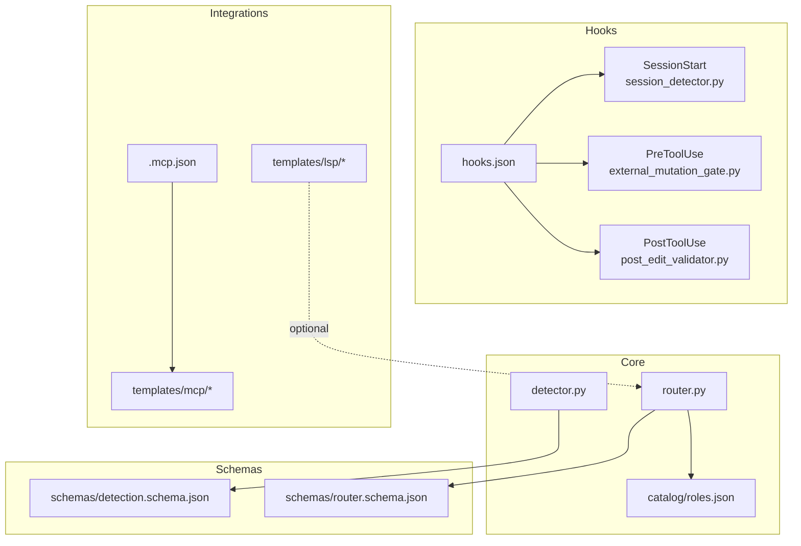
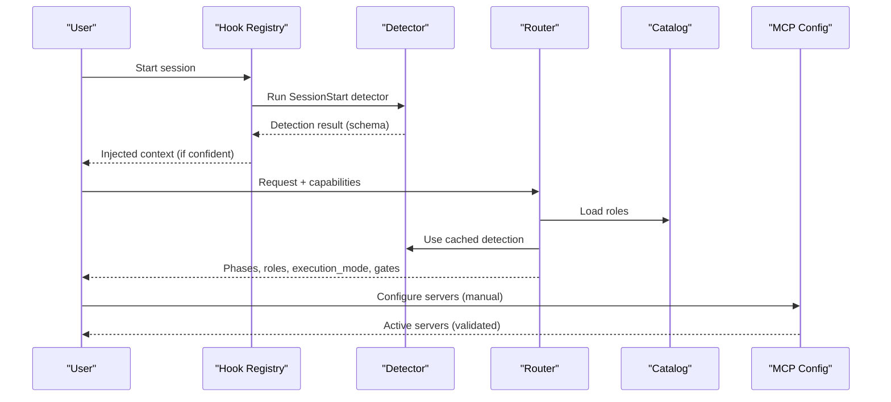
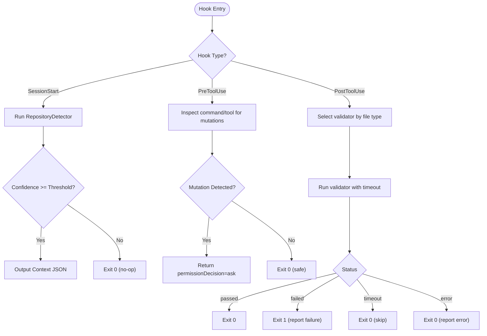
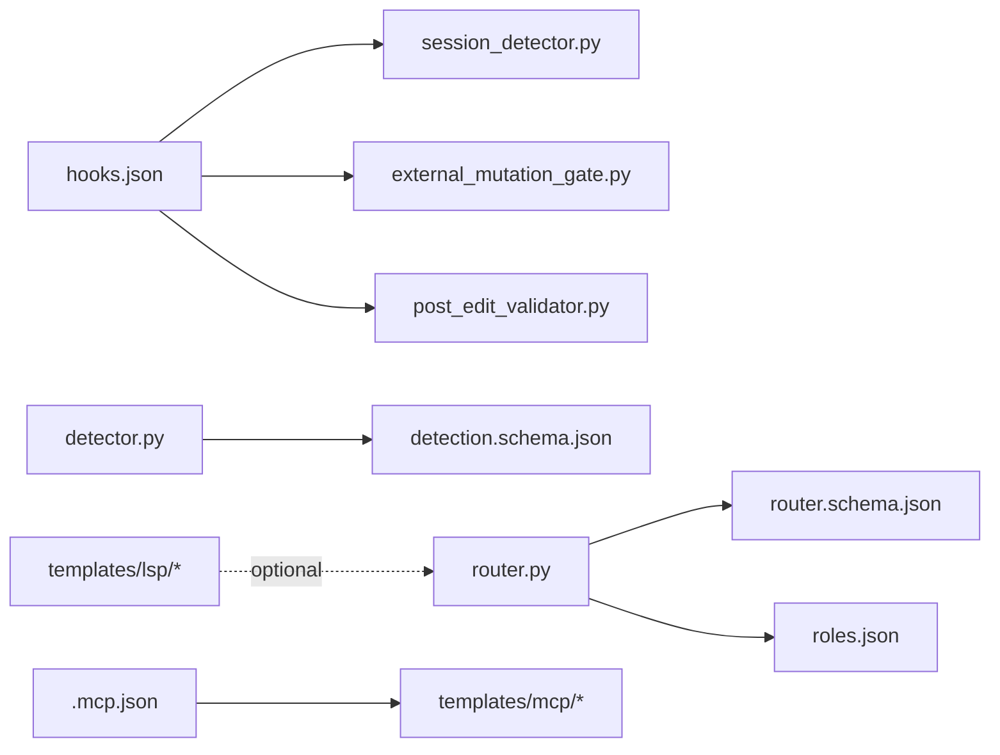

# Configuration and Customization

<cite>
**Referenced Files in This Document**
- [hooks.json](file://plugin/figmaforge/hooks/hooks.json)
- [session_detector.py](file://plugin/figmaforge/core/hooks/session_detector.py)
- [external_mutation_gate.py](file://plugin/figmaforge/core/hooks/external_mutation_gate.py)
- [post_edit_validator.py](file://plugin/figmaforge/core/hooks/post_edit_validator.py)
- [detection.schema.json](file://plugin/figmaforge/schemas/detection.schema.json)
- [router.schema.json](file://plugin/figmaforge/schemas/router.schema.json)
- [detector.py](file://plugin/figmaforge/core/detector.py)
- [router.py](file://plugin/figmaforge/core/router.py)
- [roles.json](file://plugin/figmaforge/catalog/roles.json)
- [.mcp.json](file://.mcp.json)
- [README.md (MCP templates)](file://plugin/figmaforge/templates/mcp/README.md)
- [http-oauth.example.json](file://plugin/figmaforge/templates/mcp/http-oauth.example.json)
- [custom-server.example.json](file://plugin/figmaforge/templates/lsp/custom-server.example.json)
- [mcp-template.md](file://plugin/figmaforge/skills/mcp-template.md)
- [architecture.md](file://docs/architecture.md)
</cite>

## Table of Contents
1. Introduction
2. Project Structure
3. Core Components
4. Architecture Overview
5. Detailed Component Analysis
6. Dependency Analysis
7. Performance Considerations
8. Troubleshooting Guide
9. Conclusion
10. Appendices

## Introduction
This document explains how to configure and customize FigmaForge’s detection, routing, lifecycle behavior, and integration points for MCP/LSP. It covers configuration files, schema definitions, environment variables, plugin settings, runtime options, thresholds, role scoring parameters, hook system usage, and safe template consumption patterns. Examples and best practices are included to help you tailor the system to your project safely and predictably.

## Project Structure
FigmaForge organizes configuration and customization across several layers:
- Hook registry and implementations define lifecycle hooks that run at session start, before tool use, and after edits.
- Schemas define strict contracts for detection results and router outputs.
- Detector and Router implement evidence-based stack detection and deterministic role selection with configurable thresholds.
- Catalog defines roles, domains, triggers, and capability references used by the router.
- MCP and LSP templates provide safe, inert examples for integrating external servers and language servers.
- Root-level .mcp.json configures active MCP servers for the workspace.

**Diagram sources**
- [hooks.json:1-26](file://plugin/figmaforge/hooks/hooks.json#L1-L26)
- [session_detector.py:1-60](file://plugin/figmaforge/core/hooks/session_detector.py#L1-L60)
- [external_mutation_gate.py:1-132](file://plugin/figmaforge/core/hooks/external_mutation_gate.py#L1-L132)
- [post_edit_validator.py:1-148](file://plugin/figmaforge/core/hooks/post_edit_validator.py#L1-L148)
- [detection.schema.json:1-96](file://plugin/figmaforge/schemas/detection.schema.json#L1-L96)
- [router.schema.json:1-98](file://plugin/figmaforge/schemas/router.schema.json#L1-L98)
- [detector.py:122-200](file://plugin/figmaforge/core/detector.py#L122-L200)
- [router.py:27-117](file://plugin/figmaforge/core/router.py#L27-L117)
- [roles.json:1-800](file://plugin/figmaforge/catalog/roles.json#L1-L800)
- [.mcp.json:1-12](file://.mcp.json#L1-L12)
- [README.md (MCP templates):1-34](file://plugin/figmaforge/templates/mcp/README.md#L1-L34)
- [custom-server.example.json:1-16](file://plugin/figmaforge/templates/lsp/custom-server.example.json#L1-L16)

**Section sources**
- [hooks.json:1-26](file://plugin/figmaforge/hooks/hooks.json#L1-L26)
- [detector.py:122-200](file://plugin/figmaforge/core/detector.py#L122-L200)
- [router.py:27-117](file://plugin/figmaforge/core/router.py#L27-L117)
- [roles.json:1-800](file://plugin/figmaforge/catalog/roles.json#L1-L800)
- [.mcp.json:1-12](file://.mcp.json#L1-L12)
- [README.md (MCP templates):1-34](file://plugin/figmaforge/templates/mcp/README.md#L1-L34)
- [custom-server.example.json:1-16](file://plugin/figmaforge/templates/lsp/custom-server.example.json#L1-L16)

## Core Components
- Hook system: A JSON registry maps lifecycle events to executable scripts. Hooks run at SessionStart, PreToolUse, and PostToolUse to inject context, gate mutations, and validate edits.
- Detection: Evidence-based repository scanning identifies languages, frameworks, package managers, test/build commands, CI/IaC, and MCP/LSP presence. Results conform to a strict schema and include confidence scores.
- Routing: The router scores roles from the catalog using request triggers, lifecycle phases, repository signals, deliverables, and installed capabilities. It selects up to three roles, determines execution mode, approval gates, and unloaded modules.
- Templates: Inert MCP and LSP templates guide safe integration without automatic writes or approvals.

Key configuration levers:
- Detection threshold: Controls when detection is considered actionable.
- Role scoring weights: Adjusts importance of trigger matches, phase overlap, domain relevance, deliverable matches, and installed capabilities.
- Hook behaviors: Customize mutation gating rules and post-edit validators.
- MCP/LSP configs: Define server transports, commands, args, env, and headers via templates and root config.

**Section sources**
- [hooks.json:1-26](file://plugin/figmaforge/hooks/hooks.json#L1-L26)
- [detection.schema.json:1-96](file://plugin/figmaforge/schemas/detection.schema.json#L1-L96)
- [router.schema.json:1-98](file://plugin/figmaforge/schemas/router.schema.json#L1-L98)
- [detector.py:122-200](file://plugin/figmaforge/core/detector.py#L122-L200)
- [router.py:188-302](file://plugin/figmaforge/core/router.py#L188-L302)
- [roles.json:1-800](file://plugin/figmaforge/catalog/roles.json#L1-L800)

## Architecture Overview
The runtime orchestrates detection, routing, and hooks around a safety-first design. Hooks intercept critical moments to enforce policy and validation. Detection feeds into routing, which selects roles and modes based on evidence. MCP/LSP integrations remain inert unless explicitly configured by users.

**Diagram sources**
- [hooks.json:1-26](file://plugin/figmaforge/hooks/hooks.json#L1-L26)
- [session_detector.py:17-59](file://plugin/figmaforge/core/hooks/session_detector.py#L17-L59)
- [detector.py:122-200](file://plugin/figmaforge/core/detector.py#L122-L200)
- [router.py:44-117](file://plugin/figmaforge/core/router.py#L44-L117)
- [roles.json:1-800](file://plugin/figmaforge/catalog/roles.json#L1-L800)
- [.mcp.json:1-12](file://.mcp.json#L1-L12)

## Detailed Component Analysis

### Hook System: SessionStart, PreToolUse, PostToolUse
- SessionStart: Runs repository detection and injects concise context only when there is actionable evidence (status classified and confidence above threshold).
- PreToolUse: Inspects Bash commands and MCP tool names for potential external mutations. If detected, returns an “ask” decision to require explicit approval.
- PostToolUse: Validates edited files by selecting appropriate toolchain checks (linters/formatters/type checkers) and executing them with timeouts and graceful fallbacks.

**Diagram sources**
- [hooks.json:1-26](file://plugin/figmaforge/hooks/hooks.json#L1-L26)
- [session_detector.py:17-59](file://plugin/figmaforge/core/hooks/session_detector.py#L17-L59)
- [external_mutation_gate.py:87-132](file://plugin/figmaforge/core/hooks/external_mutation_gate.py#L87-L132)
- [post_edit_validator.py:66-148](file://plugin/figmaforge/core/hooks/post_edit_validator.py#L66-L148)

**Section sources**
- [hooks.json:1-26](file://plugin/figmaforge/hooks/hooks.json#L1-L26)
- [session_detector.py:17-59](file://plugin/figmaforge/core/hooks/session_detector.py#L17-L59)
- [external_mutation_gate.py:87-132](file://plugin/figmaforge/core/hooks/external_mutation_gate.py#L87-L132)
- [post_edit_validator.py:66-148](file://plugin/figmaforge/core/hooks/post_edit_validator.py#L66-L148)

### Detection Thresholds and Evidence
- Threshold: The detector accepts a minimum confidence threshold to consider detection actionable. When below threshold, no context is injected and downstream steps may treat the repo as unclassified.
- Evidence fields: Languages, frameworks, package managers, test/build commands, CI/IaC, MCP/LSP presence, and warnings are captured to support transparent decisions.
- Schema compliance: Outputs adhere to the detection schema, ensuring consistent consumption by other components.

Customization tips:
- Increase threshold to reduce false positives in noisy repos.
- Decrease threshold to enable earlier assistance in sparse projects.
- Review warnings to understand ambiguous signals.

**Section sources**
- [detector.py:122-200](file://plugin/figmaforge/core/detector.py#L122-L200)
- [detection.schema.json:1-96](file://plugin/figmaforge/schemas/detection.schema.json#L1-L96)
- [session_detector.py:27-45](file://plugin/figmaforge/core/hooks/session_detector.py#L27-L45)

### Role Scoring Parameters and Lifecycle Behavior
- Trigger match (+4): Explicit keywords in the request align with role triggers.
- Phase overlap (+3): Request-derived lifecycle phases intersect with role phases.
- Domain relevance (+3): Detected languages map to relevant domains for the role.
- Deliverable match (+2): Request mentions expected deliverables of the role.
- Installed capability ref (+1): External skills referenced by the role are actually installed.
- Selection: Top three scored roles are chosen; phases are derived from selected roles; execution mode and approval gates are determined deterministically.

Adjusting behavior:
- Modify trigger-to-phase mappings to emphasize certain lifecycle stages.
- Tune domain-to-language mapping to reflect your stack emphasis.
- Add or remove capability refs to influence role preference when those skills are present.

**Section sources**
- [router.py:188-302](file://plugin/figmaforge/core/router.py#L188-L302)
- [router.schema.json:1-98](file://plugin/figmaforge/schemas/router.schema.json#L1-L98)
- [roles.json:1-800](file://plugin/figmaforge/catalog/roles.json#L1-L800)

### MCP Template Consumption and Safe Usage Patterns
- Templates are inert: They contain example configurations with placeholder URLs and symbolic environment variable names. No commands write `.mcp.json` automatically, and no approvals are granted.
- Manual merge: Users review and manually merge templates into their workspace `.mcp.json`.
- Security constraints: Templates avoid credentials, functioning commands, and auto-authentication.

Safe patterns:
- Always review templates before merging.
- Use symbolic environment variable names instead of secrets.
- Keep root `.mcp.json` under version control and change it intentionally.

**Section sources**
- [README.md (MCP templates):1-34](file://plugin/figmaforge/templates/mcp/README.md#L1-L34)
- [http-oauth.example.json:1-11](file://plugin/figmaforge/templates/mcp/http-oauth.example.json#L1-L11)
- [.mcp.json:1-12](file://.mcp.json#L1-L12)
- [mcp-template.md:1-31](file://plugin/figmaforge/skills/mcp-template.md#L1-L31)
- [architecture.md:349-385](file://docs/architecture.md#L349-L385)

### LSP Template Consumption and Safe Usage Patterns
- Official matrix: Supported languages have recommended plugins and required binaries.
- Custom template: For unsupported languages, a custom server template provides a starting point.
- Safety: No active `.lsp.json` is added to repo or plugin root; installation remains explicit user action.

Best practices:
- Prefer official plugins where available.
- Install local scope first; keep activation explicit.
- Validate binary availability before enabling LSP features.

**Section sources**
- [custom-server.example.json:1-16](file://plugin/figmaforge/templates/lsp/custom-server.example.json#L1-L16)
- [architecture.md:363-385](file://docs/architecture.md#L363-L385)

## Dependency Analysis
The following diagram shows key dependencies between core components and configuration artifacts.

**Diagram sources**
- [hooks.json:1-26](file://plugin/figmaforge/hooks/hooks.json#L1-L26)
- [session_detector.py:1-60](file://plugin/figmaforge/core/hooks/session_detector.py#L1-L60)
- [external_mutation_gate.py:1-132](file://plugin/figmaforge/core/hooks/external_mutation_gate.py#L1-L132)
- [post_edit_validator.py:1-148](file://plugin/figmaforge/core/hooks/post_edit_validator.py#L1-L148)
- [detection.schema.json:1-96](file://plugin/figmaforge/schemas/detection.schema.json#L1-L96)
- [router.schema.json:1-98](file://plugin/figmaforge/schemas/router.schema.json#L1-L98)
- [roles.json:1-800](file://plugin/figmaforge/catalog/roles.json#L1-L800)
- [.mcp.json:1-12](file://.mcp.json#L1-L12)
- [custom-server.example.json:1-16](file://plugin/figmaforge/templates/lsp/custom-server.example.json#L1-L16)

**Section sources**
- [hooks.json:1-26](file://plugin/figmaforge/hooks/hooks.json#L1-L26)
- [detector.py:122-200](file://plugin/figmaforge/core/detector.py#L122-L200)
- [router.py:27-117](file://plugin/figmaforge/core/router.py#L27-L117)
- [roles.json:1-800](file://plugin/figmaforge/catalog/roles.json#L1-L800)
- [.mcp.json:1-12](file://.mcp.json#L1-L12)

## Performance Considerations
- Detection cost: Scanning large repositories can be expensive. Cache detection results within a run to avoid repeated work.
- Hook overhead: Keep hooks lightweight; they run synchronously around tool calls. Avoid heavy I/O in PreToolUse and PostToolUse.
- Validator timeouts: PostToolUse runs validators with timeouts to prevent blocking. Ensure toolchains are fast and well-configured.
- Role scoring: Minimize unnecessary capability lookups; rely on cached detection and precomputed triggers/phases.

[No sources needed since this section provides general guidance]

## Troubleshooting Guide
Common issues and resolutions:
- Detection too conservative:
  - Symptom: Low confidence, no context injection.
  - Action: Lower the detection threshold or add repository signals (e.g., manifest files).
- Excessive mutation gating:
  - Symptom: Frequent “ask” prompts for routine commands.
  - Action: Review and refine mutation patterns in PreToolUse; whitelist safe commands if necessary.
- Post-edit validation failures:
  - Symptom: Validators fail due to missing binaries or slow toolchains.
  - Action: Install required toolchains locally; tune timeouts; disable non-critical validators for specific file types.
- MCP template misuse:
  - Symptom: Accidental writes to `.mcp.json` or unintended approvals.
  - Action: Follow inert template guidelines; merge manually; never invoke auto-add/login commands from templates.
- LSP not activating:
  - Symptom: Language server not engaged despite binary presence.
  - Action: Confirm binary availability; ensure explicit activation; prefer official plugins per matrix.

**Section sources**
- [session_detector.py:27-59](file://plugin/figmaforge/core/hooks/session_detector.py#L27-L59)
- [external_mutation_gate.py:87-132](file://plugin/figmaforge/core/hooks/external_mutation_gate.py#L87-L132)
- [post_edit_validator.py:66-148](file://plugin/figmaforge/core/hooks/post_edit_validator.py#L66-L148)
- [README.md (MCP templates):1-34](file://plugin/figmaforge/templates/mcp/README.md#L1-L34)
- [architecture.md:349-385](file://docs/architecture.md#L349-L385)

## Conclusion
FigmaForge’s configuration model emphasizes safety, transparency, and extensibility. Use schemas to validate outputs, adjust thresholds and scoring to fit your project’s characteristics, and leverage hooks to enforce policies and validations. Consume MCP/LSP templates carefully to integrate external services and language servers without compromising security or stability.

[No sources needed since this section summarizes without analyzing specific files]

## Appendices

### Configuration Reference Summary
- Hook registry: Maps lifecycle events to commands and descriptions.
- Detection schema: Defines fields for status, root, languages, package_managers, frameworks, test_commands, build_commands, lsp_candidates, confidence, evidence, warnings.
- Router schema: Defines phases, roles (id, title, domain, score, reason), external_skills, execution_mode, stack_status, approval_gates, unloaded_modules.
- MCP config: Workspace-level server definitions with transport, command/args/env or URL/headers.
- LSP templates: Example configurations for custom servers; follow official matrix where possible.

**Section sources**
- [hooks.json:1-26](file://plugin/figmaforge/hooks/hooks.json#L1-L26)
- [detection.schema.json:1-96](file://plugin/figmaforge/schemas/detection.schema.json#L1-L96)
- [router.schema.json:1-98](file://plugin/figmaforge/schemas/router.schema.json#L1-L98)
- [.mcp.json:1-12](file://.mcp.json#L1-L12)
- [custom-server.example.json:1-16](file://plugin/figmaforge/templates/lsp/custom-server.example.json#L1-L16)

### Best Practices Checklist
- Set detection threshold appropriate to repo size and clarity.
- Keep hooks minimal and idempotent; handle errors gracefully.
- Use role scoring to reflect your team’s priorities and stack.
- Merge MCP/LSP templates manually after review; never auto-approve or auto-connect.
- Maintain explicit activation for MCP servers and LSPs; prefer local scope installations.
- Monitor hook outcomes and validator results to tune behavior over time.

[No sources needed since this section provides general guidance]