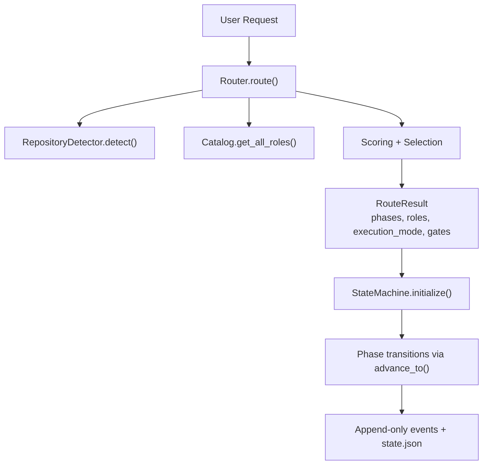
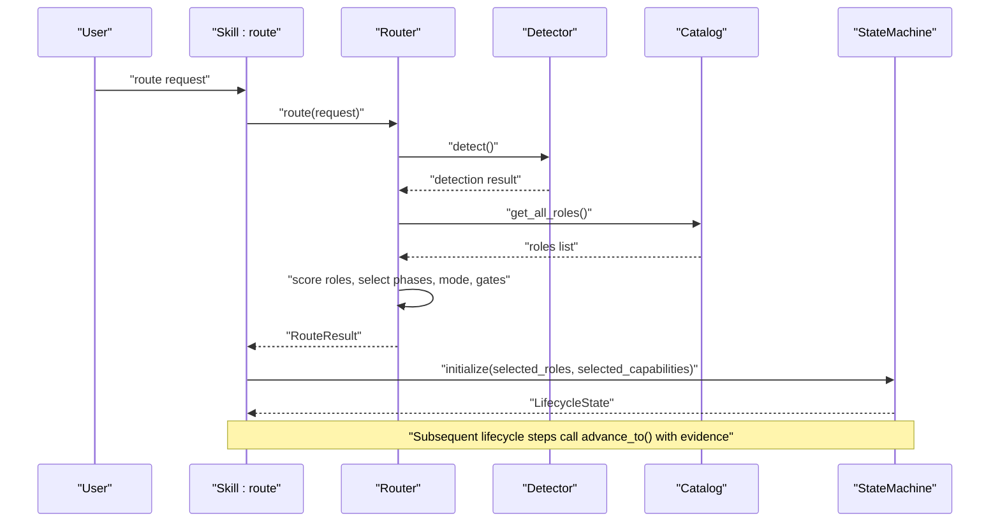
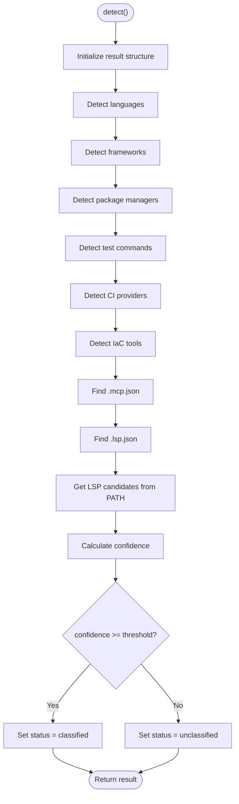
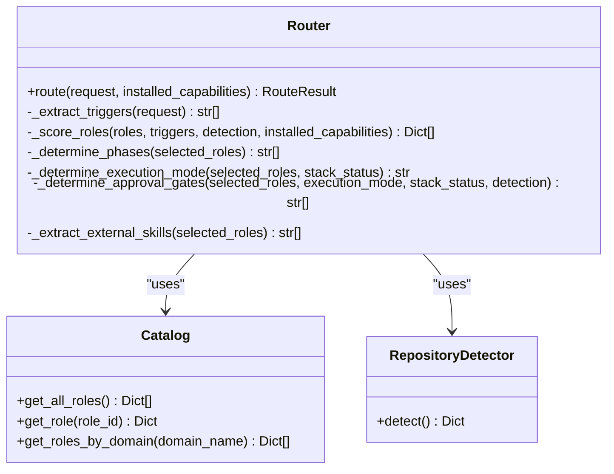
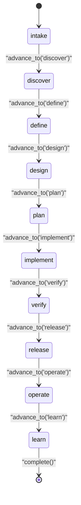
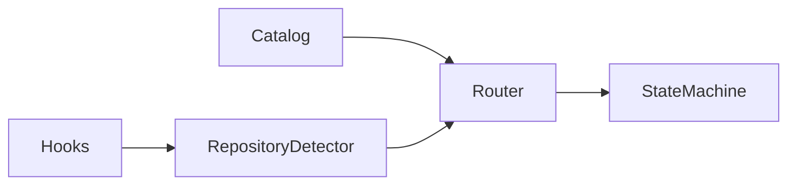
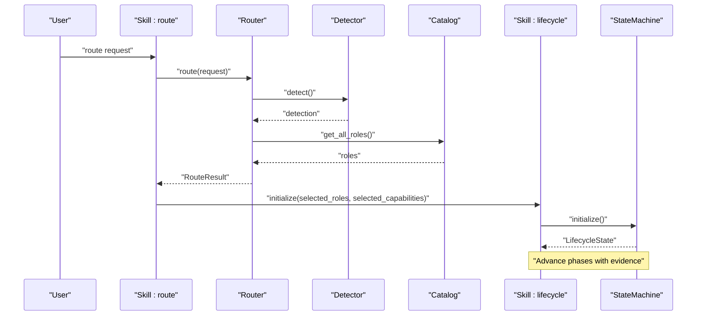

# Core Platform Components

<cite>
**Referenced Files in This Document**
- [README.md](file://README.md)
- [detector.py](file://plugin/figmaforge/core/detector.py)
- [router.py](file://plugin/figmaforge/core/router.py)
- [state.py](file://plugin/figmaforge/core/state.py)
- [catalog.py](file://plugin/figmaforge/core/catalog.py)
- [roles.json](file://plugin/figmaforge/catalog/roles.json)
- [route.md](file://plugin/figmaforge/skills/route.md)
- [lifecycle.md](file://plugin/figmaforge/skills/lifecycle.md)
- [hooks.json](file://plugin/figmaforge/hooks/hooks.json)
- [session_detector.py](file://plugin/figmaforge/core/hooks/session_detector.py)
- [test_router.py](file://plugin/figmaforge/tests/test_router.py)
- [test_state_machine.py](file://plugin/figmaforge/tests/test_state_machine.py)
</cite>

## Table of Contents
1. [Introduction](#introduction)
2. [Project Structure](#project-structure)
3. [Core Components](#core-components)
4. [Architecture Overview](#architecture-overview)
5. [Detailed Component Analysis](#detailed-component-analysis)
6. [Dependency Analysis](#dependency-analysis)
7. [Performance Considerations](#performance-considerations)
8. [Troubleshooting Guide](#troubleshooting-guide)
9. [Conclusion](#conclusion)
10. [Appendices](#appendices)

## Introduction
This document explains FigmaForge’s core platform components that power evidence-based repository detection, intelligent role routing across a catalog of 100 roles in 10 domains, and an atomic 10-phase lifecycle state machine with append-only event logging. It also covers configuration options, thresholds, customization points, and practical examples showing how these components collaborate to process user requests and route them to appropriate capabilities.

FigmaForge is designed to be deterministic and safe: it inspects the repository for concrete signals, scores candidate roles using explicit rules, enforces forward-only lifecycle transitions, and gates risky operations behind approvals.

**Section sources**
- [README.md:10-20](file://README.md#L10-L20)
- [README.md:86-113](file://README.md#L86-L113)

## Project Structure
At a high level, the core platform lives under plugin/figmaforge/core and is driven by skills and hooks:
- Detector scans file patterns to identify languages, frameworks, package managers, CI/IaC, and LSP candidates.
- Router loads the 100-role catalog, extracts triggers from user requests, scores roles deterministically, and selects phases and execution mode.
- StateMachine manages lifecycle state with atomic writes and append-only events, enforcing valid phase transitions.
- Skills (route, lifecycle) define user-facing interfaces and constraints.
- Hooks run at session boundaries to inject context and enforce safety gates.

**Diagram sources**
- [router.py:44-117](file://plugin/figmaforge/core/router.py#L44-L117)
- [detector.py:122-216](file://plugin/figmaforge/core/detector.py#L122-L216)
- [catalog.py:11-79](file://plugin/figmaforge/core/catalog.py#L11-L79)
- [state.py:125-224](file://plugin/figmaforge/core/state.py#L125-L224)

**Section sources**
- [README.md:185-253](file://README.md#L185-L253)
- [route.md:8-29](file://plugin/figmaforge/skills/route.md#L8-L29)
- [lifecycle.md:8-27](file://plugin/figmaforge/skills/lifecycle.md#L8-L27)

## Core Components
- RepositoryDetector: Evidence-based stack detection with configurable confidence threshold.
- Router: Deterministic scoring engine selecting up to three roles based on triggers, lifecycle phases, repository signals, deliverables, installed capabilities, and penalties for unclassified stacks.
- Catalog: Loader and query interface for the 100-role catalog organized by domain.
- StateMachine: Lifecycle manager enforcing forward-only transitions, recording decisions, validations, approvals, blockers, and persisting state atomically.
- Skills and Hooks: User-facing entry points and runtime safety hooks that integrate detection into sessions and gate mutations.

Key configuration and customization points:
- Detection threshold: minimum confidence to classify a repo.
- Trigger-to-phase mapping: controls which lifecycle phases are implied by request keywords.
- Language-to-domain mapping: influences relevance scoring for roles.
- Approval gates: external mutation, stack selection, language activation, project approval.
- Execution modes: direct, isolated_scout, isolated_planner.

**Section sources**
- [detector.py:122-216](file://plugin/figmaforge/core/detector.py#L122-L216)
- [router.py:27-117](file://plugin/figmaforge/core/router.py#L27-L117)
- [catalog.py:11-79](file://plugin/figmaforge/core/catalog.py#L11-L79)
- [state.py:125-224](file://plugin/figmaforge/core/state.py#L125-L224)
- [hooks.json:1-26](file://plugin/figmaforge/hooks/hooks.json#L1-L26)

## Architecture Overview
The system follows a pipeline:
1. SessionStart hook runs detector to optionally inject concise context when actionable evidence exists.
2. Skill route invokes Router.route(request), which calls RepositoryDetector.detect() once and caches results.
3. Router loads all roles from Catalog, extracts triggers from the request, scores roles, selects top candidates, determines phases, execution mode, and approval gates.
4. Skill lifecycle initializes or advances the StateMachine through evidence-driven transitions, writing state and appending events.

**Diagram sources**
- [session_detector.py:17-55](file://plugin/figmaforge/core/hooks/session_detector.py#L17-L55)
- [route.md:8-29](file://plugin/figmaforge/skills/route.md#L8-L29)
- [router.py:44-117](file://plugin/figmaforge/core/router.py#L44-L117)
- [catalog.py:11-79](file://plugin/figmaforge/core/catalog.py#L11-L79)
- [state.py:138-172](file://plugin/figmaforge/core/state.py#L138-L172)

## Detailed Component Analysis

### Evidence-Based Repository Detection
The detector walks the repository root and matches file patterns to infer languages, frameworks, package managers, test frameworks, CI providers, IaC tools, MCP/LSP presence, and available language servers. It computes a confidence score based on counts of detected signals and classifies the repo if confidence meets or exceeds a configurable threshold.

Key behaviors:
- Scans for language markers (e.g., package.json, tsconfig.json, go.mod).
- Detects frameworks and package managers via known files.
- Identifies CI and IaC tooling presence.
- Enumerates LSP candidates from PATH without auto-activating them.
- Produces warnings for scaffolding artifacts.

Configuration and customization:
- Threshold: constructor parameter controls classification sensitivity.
- Pattern sets: DETECTION_PATTERNS, FRAMEWORK_PATTERNS, PACKAGE_MANAGER_PATTERNS, TEST_FRAMEWORK_PATTERNS, CI_PATTERNS, IAC_PATTERNS can be extended to support new ecosystems.
- Confidence formula: additive weights per category; cap at 1.0.

**Diagram sources**
- [detector.py:139-216](file://plugin/figmaforge/core/detector.py#L139-L216)
- [detector.py:309-336](file://plugin/figmaforge/core/detector.py#L309-L336)

Practical example:
- Running the detector during SessionStart injects concise context only when the repo is classified with sufficient confidence, enabling downstream components to make informed decisions.

**Section sources**
- [detector.py:15-103](file://plugin/figmaforge/core/detector.py#L15-L103)
- [detector.py:122-216](file://plugin/figmaforge/core/detector.py#L122-L216)
- [detector.py:309-336](file://plugin/figmaforge/core/detector.py#L309-L336)
- [session_detector.py:17-55](file://plugin/figmaforge/core/hooks/session_detector.py#L17-L55)

### Intelligent Role Routing Engine
The router performs deterministic scoring to select up to three roles from the catalog based on:
- Explicit trigger matches in the request (+4).
- Lifecycle phase overlap between request-implied phases and role phases (+3).
- Repository signal match: detected languages map to relevant domains (+3).
- Deliverable match against request text (+2).
- Installed capability references (+1).
- Penalties when the repository is unclassified (-5 for stack-specific domains, -3 for generic unclassified with no languages).

It then:
- Determines lifecycle phases from selected roles in canonical order.
- Chooses execution mode: isolated_scout for unclassified or specific roles; isolated_planner if planning roles are present; otherwise direct.
- Computes approval gates: external mutation, stack selection, language activation, project approval.
- Extracts external skill references from capability refs.

Configuration and customization:
- Trigger words and trigger-to-phase mappings control phase inference.
- Language-to-domain mapping influences relevance scoring.
- Installed capabilities filter and boost role selection.
- Execution mode logic can be extended for new role categories.

**Diagram sources**
- [router.py:27-117](file://plugin/figmaforge/core/router.py#L27-L117)
- [catalog.py:11-79](file://plugin/figmaforge/core/catalog.py#L11-L79)
- [detector.py:122-216](file://plugin/figmaforge/core/detector.py#L122-L216)

Practical example:
- For a request like “Design a secure, testable CLI feature,” the router extracts triggers (“design”, “secure”, “test”, “cli”), maps to phases (“design”, “verify”, “implement”), scores roles accordingly, and returns phases, top roles, execution mode, and required approval gates.

**Section sources**
- [router.py:44-117](file://plugin/figmaforge/core/router.py#L44-L117)
- [router.py:119-174](file://plugin/figmaforge/core/router.py#L119-L174)
- [router.py:176-302](file://plugin/figmaforge/core/router.py#L176-L302)
- [router.py:304-430](file://plugin/figmaforge/core/router.py#L304-L430)
- [test_router.py:29-102](file://plugin/figmaforge/tests/test_router.py#L29-L102)

### 10-Phase Lifecycle State Machine
The state machine models a strict lifecycle: intake → discover → define → design → plan → implement → verify → release → operate → learn. It ensures:
- Forward-only transitions to the immediately next phase.
- Evidence-driven transitions recorded as decisions.
- Atomic state writes to .figmaforge/runs/<run-id>/state.json.
- Append-only event log entries for each transition, approval, and completion/failure.
- Support for validations, approvals, blockers, artifacts, and risk tracking.

Configuration and customization:
- Phase ordering is fixed; transitions are validated programmatically.
- Risk levels can be updated during transitions or completion.
- Approvals require explicit grant actions before proceeding past gated steps.

**Diagram sources**
- [state.py:420-451](file://plugin/figmaforge/core/state.py#L420-L451)
- [state.py:138-172](file://plugin/figmaforge/core/state.py#L138-L172)
- [state.py:174-224](file://plugin/figmaforge/core/state.py#L174-L224)
- [state.py:337-359](file://plugin/figmaforge/core/state.py#L337-L359)

Practical example:
- After routing, the lifecycle skill initializes a run with selected roles and capabilities, then advances through phases as evidence accumulates, persisting state and events after each step.

**Section sources**
- [state.py:15-70](file://plugin/figmaforge/core/state.py#L15-L70)
- [state.py:125-224](file://plugin/figmaforge/core/state.py#L125-L224)
- [state.py:226-335](file://plugin/figmaforge/core/state.py#L226-L335)
- [state.py:337-402](file://plugin/figmaforge/core/state.py#L337-L402)
- [test_state_machine.py:23-77](file://plugin/figmaforge/tests/test_state_machine.py#L23-L77)

### Configuration Options, Thresholds, and Customization Points
- Detection threshold: Controls when a repository is considered classified. Adjust in RepositoryDetector initialization.
- Trigger-to-phase mapping: Customize which request keywords imply lifecycle phases in Router.
- Language-to-domain mapping: Influence role relevance based on detected languages in Router.
- Installed capabilities: Provide capability references to boost role selection and unlock external skills.
- Approval gates: External mutation, stack selection, language activation, project approval are automatically determined based on selected roles and execution mode.
- Execution modes: Direct, isolated_scout, isolated_planner; controlled by Router logic.
- Hook behavior: SessionStart detector outputs concise context only when actionable evidence exists; PreToolUse and PostToolUse hooks enforce mutation safety and edit validation.

**Section sources**
- [detector.py:125-137](file://plugin/figmaforge/core/detector.py#L125-L137)
- [router.py:119-174](file://plugin/figmaforge/core/router.py#L119-L174)
- [router.py:335-409](file://plugin/figmaforge/core/router.py#L335-L409)
- [hooks.json:1-26](file://plugin/figmaforge/hooks/hooks.json#L1-L26)
- [session_detector.py:17-55](file://plugin/figmaforge/core/hooks/session_detector.py#L17-L55)

## Dependency Analysis
The core components have clear dependencies:
- Router depends on Catalog and RepositoryDetector.
- StateMachine is independent but consumed by lifecycle skills.
- Hooks depend on Detector to provide context and enforce safety.

**Diagram sources**
- [router.py:27-117](file://plugin/figmaforge/core/router.py#L27-L117)
- [catalog.py:11-79](file://plugin/figmaforge/core/catalog.py#L11-L79)
- [detector.py:122-216](file://plugin/figmaforge/core/detector.py#L122-L216)
- [hooks.json:1-26](file://plugin/figmaforge/hooks/hooks.json#L1-L26)

**Section sources**
- [router.py:27-117](file://plugin/figmaforge/core/router.py#L27-L117)
- [catalog.py:11-79](file://plugin/figmaforge/core/catalog.py#L11-L79)
- [detector.py:122-216](file://plugin/figmaforge/core/detector.py#L122-L216)
- [hooks.json:1-26](file://plugin/figmaforge/hooks/hooks.json#L1-L26)

## Performance Considerations
- Single detection per route: Router caches detection results to avoid redundant filesystem scans.
- Lightweight pattern matching: File pattern checks use regex conversion and directory walking; consider limiting scan depth for very large repositories.
- Deterministic scoring: O(n) over roles with constant-time checks per role; sorting top-3 is minimal overhead.
- State persistence: Atomic writes minimize corruption risk; append-only events ensure replayability.

[No sources needed since this section provides general guidance]

## Troubleshooting Guide
Common issues and resolutions:
- Unrecognized repository: Increase detection threshold or add custom patterns to Detector to improve classification.
- No roles selected: Check trigger extraction and phase mapping; ensure request contains recognizable keywords; verify installed capabilities if applicable.
- Invalid lifecycle transition: Ensure advance_to targets the immediate next phase; validate evidence before transitioning.
- Approval blocks: Review approval gates and explicitly grant necessary approvals before proceeding.
- Hook failures: Inspect SessionStart output; ensure detector finds repository root and exits non-blockingly on errors.

**Section sources**
- [detector.py:125-137](file://plugin/figmaforge/core/detector.py#L125-L137)
- [router.py:176-302](file://plugin/figmaforge/core/router.py#L176-L302)
- [state.py:174-224](file://plugin/figmaforge/core/state.py#L174-L224)
- [session_detector.py:17-55](file://plugin/figmaforge/core/hooks/session_detector.py#L17-L55)

## Conclusion
FigmaForge’s core platform combines evidence-based detection, deterministic role routing, and a robust lifecycle state machine to safely and adaptively process user requests. By leveraging explicit signals from the repository and structured scoring, it selects appropriate engineering roles and orchestrates work through a controlled, auditable lifecycle. The modular design allows customization of thresholds, mappings, and gates while maintaining safety and reproducibility.

[No sources needed since this section summarizes without analyzing specific files]

## Appendices

### Practical End-to-End Example
- User invokes the route skill with a natural language request.
- Router runs detection once, loads roles, extracts triggers, scores roles, and returns phases, top roles, execution mode, and approval gates.
- Lifecycle skill initializes a run with selected roles and capabilities, then advances through phases as evidence accumulates, persisting state and events.
- Hooks run at session start to inject concise context when actionable evidence exists and enforce mutation safety before tool usage.

**Diagram sources**
- [route.md:8-29](file://plugin/figmaforge/skills/route.md#L8-L29)
- [lifecycle.md:8-27](file://plugin/figmaforge/skills/lifecycle.md#L8-L27)
- [router.py:44-117](file://plugin/figmaforge/core/router.py#L44-L117)
- [detector.py:122-216](file://plugin/figmaforge/core/detector.py#L122-L216)
- [catalog.py:11-79](file://plugin/figmaforge/core/catalog.py#L11-L79)
- [state.py:138-172](file://plugin/figmaforge/core/state.py#L138-L172)