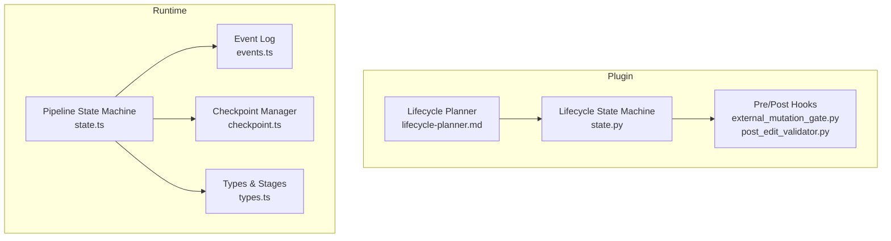
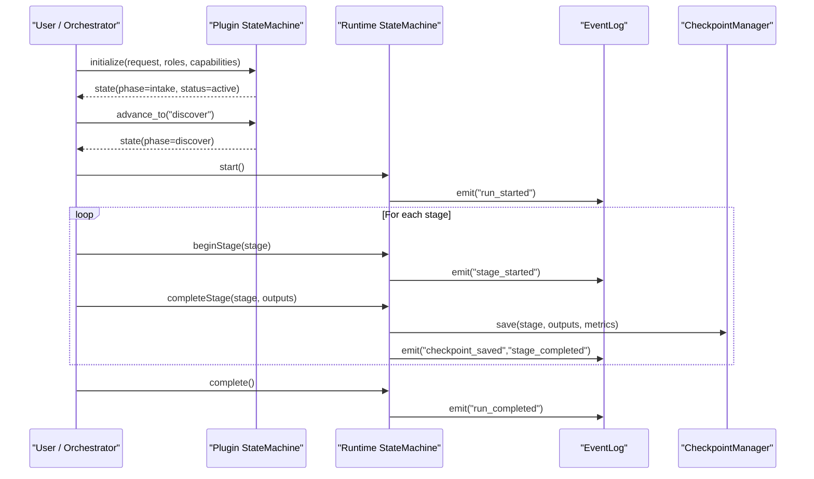
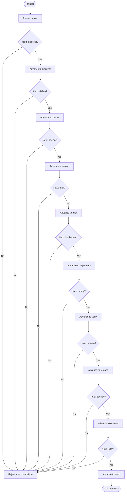
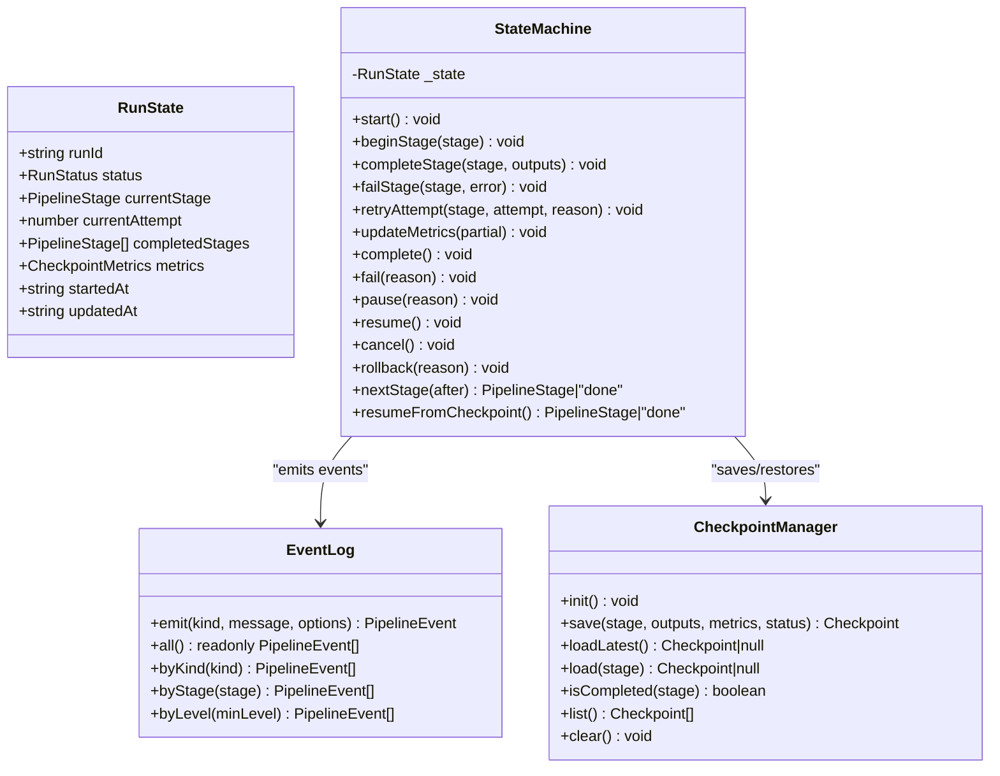
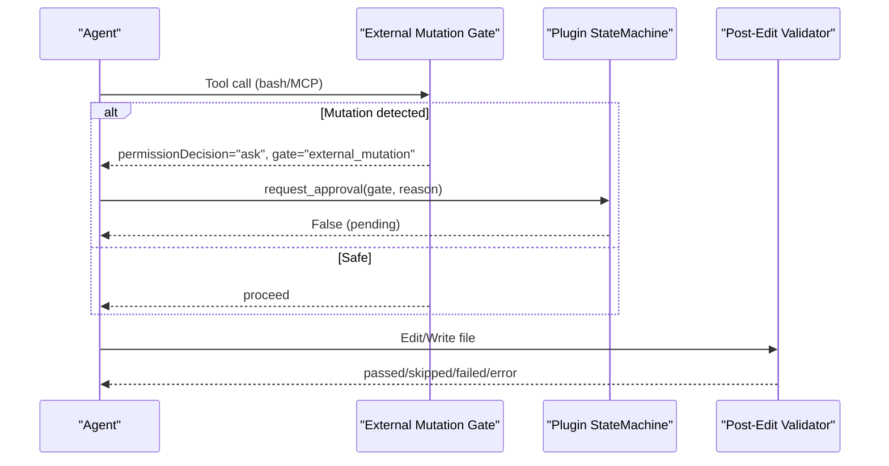
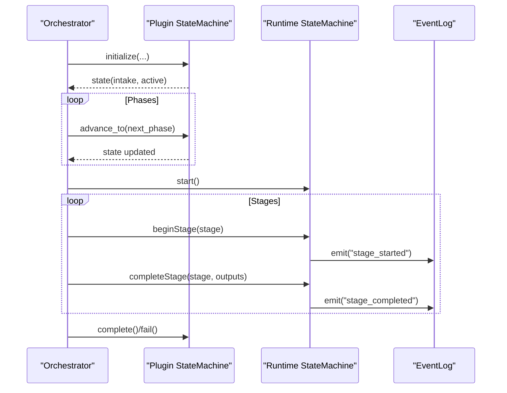
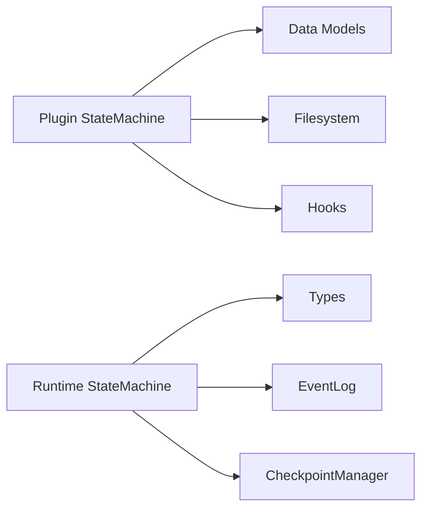

# Lifecycle State Machine

<cite>
**Referenced Files in This Document**
- [state.py](file://plugin/figmaforge/core/state.py)
- [test_state_machine.py](file://plugin/figmaforge/tests/test_state_machine.py)
- [lifecycle-planner.md](file://plugin/figmaforge/agents/lifecycle-planner.md)
- [state.ts](file://runtime/src/core/state.ts)
- [types.ts](file://runtime/src/core/types.ts)
- [events.ts](file://runtime/src/core/events.ts)
- [checkpoint.ts](file://runtime/src/core/checkpoint.ts)
- [external_mutation_gate.py](file://plugin/figmaforge/core/hooks/external_mutation_gate.py)
- [post_edit_validator.py](file://plugin/figmaforge/core/hooks/post_edit_validator.py)
</cite>

## Table of Contents
1. Introduction
2. Project Structure
3. Core Components
4. Architecture Overview
5. Detailed Component Analysis
6. Dependency Analysis
7. Performance Considerations
8. Troubleshooting Guide
9. Conclusion
10. Appendices

## Introduction
This document explains FigmaForge’s 10-phase lifecycle state machine, its atomic state transitions, append-only event logging, and approval gates that ensure workflow integrity. It covers each phase’s purpose, transition rules, validation mechanisms, error handling, recovery procedures, concurrency considerations, persistence, debugging techniques, and guidance for extending the lifecycle with custom phases and integrating external systems.

The system has two complementary layers:
- Plugin-side lifecycle (Python): a 10-phase forward-only state machine with evidence-driven transitions, approvals, blockers, validations, and persistent state writes.
- Runtime pipeline (TypeScript): a deterministic stage-based pipeline with checkpoints, events, retry, budgets, and approval gating.

## Project Structure
FigmaForge organizes lifecycle logic across plugin and runtime modules:
- Plugin core defines the 10-phase lifecycle model and state machine with persistence and approvals.
- Runtime core implements a deterministic pipeline with stages, checkpointing, events, and resumption.
- Hooks enforce safety and quality via pre- and post-execution checks.
- Agent documentation describes how to plan work across the 10 phases.

**Diagram sources**
- [state.py:125-452](file://plugin/figmaforge/core/state.py#L125-L452)
- [state.ts:48-228](file://runtime/src/core/state.ts#L48-L228)
- [types.ts:12-30](file://runtime/src/core/types.ts#L12-L30)
- [events.ts:66-138](file://runtime/src/core/events.ts#L66-L138)
- [checkpoint.ts:57-165](file://runtime/src/core/checkpoint.ts#L57-L165)
- [external_mutation_gate.py:87-132](file://plugin/figmaforge/core/hooks/external_mutation_gate.py#L87-L132)
- [post_edit_validator.py:66-148](file://plugin/figmaforge/core/hooks/post_edit_validator.py#L66-L148)
- [lifecycle-planner.md:9-27](file://plugin/figmaforge/agents/lifecycle-planner.md#L9-L27)

**Section sources**
- [state.py:125-452](file://plugin/figmaforge/core/state.py#L125-L452)
- [state.ts:48-228](file://runtime/src/core/state.ts#L48-L228)
- [types.ts:12-30](file://runtime/src/core/types.ts#L12-L30)
- [events.ts:66-138](file://runtime/src/core/events.ts#L66-L138)
- [checkpoint.ts:57-165](file://runtime/src/core/checkpoint.ts#L57-L165)
- [external_mutation_gate.py:87-132](file://plugin/figmaforge/core/hooks/external_mutation_gate.py#L87-L132)
- [post_edit_validator.py:66-148](file://plugin/figmaforge/core/hooks/post_edit_validator.py#L66-L148)
- [lifecycle-planner.md:9-27](file://plugin/figmaforge/agents/lifecycle-planner.md#L9-L27)

## Core Components
- Plugin StateMachine: Enforces forward-only transitions across 10 phases, records decisions, validations, approvals, blockers, and persists state atomically.
- Runtime StateMachine: Manages deterministic pipeline stages, status transitions, retries, metrics, checkpoints, and approval pause/resume.
- EventLog: Append-only structured event log for auditability and replay.
- CheckpointManager: Saves and restores run progress per stage for resilience.
- Hooks: Pre-tool mutation gate and post-edit validator to enforce safety and code quality.

Key responsibilities:
- Atomic state writes: Each state change is persisted as a complete snapshot.
- Evidence-driven transitions: Only adjacent forward phases are allowed; skipping or backward moves are rejected.
- Approval gates: Runs can be paused pending explicit approval and resumed after grant.
- Resilience: Checkpoints enable resume from last completed stage.
- Observability: Events provide full audit trail.

**Section sources**
- [state.py:125-452](file://plugin/figmaforge/core/state.py#L125-L452)
- [state.ts:48-228](file://runtime/src/core/state.ts#L48-L228)
- [events.ts:66-138](file://runtime/src/core/events.ts#L66-L138)
- [checkpoint.ts:57-165](file://runtime/src/core/checkpoint.ts#L57-L165)
- [external_mutation_gate.py:87-132](file://plugin/figmaforge/core/hooks/external_mutation_gate.py#L87-L132)
- [post_edit_validator.py:66-148](file://plugin/figmaforge/core/hooks/post_edit_validator.py#L66-L148)

## Architecture Overview
The lifecycle spans two cooperating machines:
- The plugin’s 10-phase lifecycle orchestrates high-level phases (intake → learn).
- The runtime’s deterministic pipeline executes concrete stages (ingest → verify), with checkpoints and events.

**Diagram sources**
- [state.py:138-224](file://plugin/figmaforge/core/state.py#L138-L224)
- [state.ts:64-136](file://runtime/src/core/state.ts#L64-L136)
- [events.ts:72-96](file://runtime/src/core/events.ts#L72-L96)
- [checkpoint.ts:72-98](file://runtime/src/core/checkpoint.ts#L72-L98)

## Detailed Component Analysis

### Plugin 10-Phase Lifecycle State Machine
- Phases: intake, discover, define, design, plan, implement, verify, release, operate, learn.
- Transitions: Forward-only to the immediately next phase; any skip or backward move raises an error.
- Evidence and Decisions: Each transition records a decision entry.
- Validations: Append validation results with pass/fail and details.
- Approvals: Request and grant approvals; default denied until explicitly granted.
- Blockers: Set and resolve blockers to gate progress.
- Persistence: Writes a complete state.json per run under .figmaforge/runs/<run_id>/state.json.

**Diagram sources**
- [state.py:420-452](file://plugin/figmaforge/core/state.py#L420-L452)
- [test_state_machine.py:39-61](file://plugin/figmaforge/tests/test_state_machine.py#L39-L61)

**Section sources**
- [state.py:125-452](file://plugin/figmaforge/core/state.py#L125-L452)
- [test_state_machine.py:23-77](file://plugin/figmaforge/tests/test_state_machine.py#L23-L77)

### Runtime Pipeline State Machine
- Stages: ingest, normalize, resolve, layout, generate, assets, render, compare, repair, verify.
- Statuses: pending, running, paused, completed, failed, cancelled, rolled_back.
- Controls: begin/complete/fail stage, retry attempts, update metrics, pause/resume for approvals, cancel, rollback.
- Checkpoints: Save outputs and metrics per stage; resume from latest valid checkpoint.
- Events: Emit structured events for all lifecycle actions.

**Diagram sources**
- [state.ts:19-28](file://runtime/src/core/state.ts#L19-L28)
- [state.ts:48-228](file://runtime/src/core/state.ts#L48-L228)
- [events.ts:66-138](file://runtime/src/core/events.ts#L66-L138)
- [checkpoint.ts:20-43](file://runtime/src/core/checkpoint.ts#L20-L43)
- [checkpoint.ts:57-165](file://runtime/src/core/checkpoint.ts#L57-L165)

**Section sources**
- [state.ts:48-228](file://runtime/src/core/state.ts#L48-L228)
- [types.ts:12-30](file://runtime/src/core/types.ts#L12-L30)
- [events.ts:66-138](file://runtime/src/core/events.ts#L66-L138)
- [checkpoint.ts:57-165](file://runtime/src/core/checkpoint.ts#L57-L165)

### Approval Gates and Safety Hooks
- External Mutation Gate: Intercepts tool calls and bash commands to detect potentially unsafe external mutations; requests permission when detected.
- Post-Edit Validator: After edits/writes, runs appropriate linters/type-checkers to validate changes before proceeding.

**Diagram sources**
- [external_mutation_gate.py:87-132](file://plugin/figmaforge/core/hooks/external_mutation_gate.py#L87-L132)
- [post_edit_validator.py:66-148](file://plugin/figmaforge/core/hooks/post_edit_validator.py#L66-L148)
- [state.py:260-315](file://plugin/figmaforge/core/state.py#L260-L315)

**Section sources**
- [external_mutation_gate.py:87-132](file://plugin/figmaforge/core/hooks/external_mutation_gate.py#L87-L132)
- [post_edit_validator.py:66-148](file://plugin/figmaforge/core/hooks/post_edit_validator.py#L66-L148)
- [state.py:260-315](file://plugin/figmaforge/core/state.py#L260-L315)

### Phase Reference and Transition Rules
- intake: Initialize run context, capture request, roles, capabilities.
- discover: Gather requirements and constraints; collect evidence.
- define: Formalize scope and acceptance criteria; add validations.
- design: Produce design artifacts; record decisions and evidence.
- plan: Create implementation plan with tasks, dependencies, risks, and gates.
- implement: Execute implementation steps; use hooks to validate edits.
- verify: Validate outputs against expectations; record validations.
- release: Prepare for deployment/release; may require approvals.
- operate: Monitor and maintain; track operational metrics.
- learn: Reflect on outcomes; archive evidence and decisions.

Transition rule: Only advance to the immediately next phase; skipping or moving backward is rejected.

**Section sources**
- [state.py:420-452](file://plugin/figmaforge/core/state.py#L420-L452)
- [lifecycle-planner.md:9-27](file://plugin/figmaforge/agents/lifecycle-planner.md#L9-L27)

### Complete Lifecycle Flow Example
A typical flow:
1. Initialize run in intake.
2. Advance through discover, define, design, plan, implement, verify, release, operate.
3. At any point, request approval if required; resume after grant.
4. Complete or fail the run; finalize in learn.

**Diagram sources**
- [state.py:138-224](file://plugin/figmaforge/core/state.py#L138-L224)
- [state.ts:64-136](file://runtime/src/core/state.ts#L64-L136)
- [events.ts:72-96](file://runtime/src/core/events.ts#L72-L96)

**Section sources**
- [state.py:138-224](file://plugin/figmaforge/core/state.py#L138-L224)
- [state.ts:64-136](file://runtime/src/core/state.ts#L64-L136)

### Custom Phase Implementations
To extend the lifecycle:
- Add a new phase name to the ordered list used by the plugin state machine’s transition validator.
- Ensure your phase-specific logic emits evidence and validations before advancing.
- If using the runtime pipeline, add a corresponding stage to the pipeline stages list and implement begin/complete/fail behavior.
- Update planners and hooks to recognize the new phase/stage where applicable.

Caution:
- Keep transitions forward-only and adjacent to preserve integrity.
- Persist state and emit events consistently.
- Use checkpoints to make new stages resumable.

**Section sources**
- [state.py:420-452](file://plugin/figmaforge/core/state.py#L420-L452)
- [types.ts:12-30](file://runtime/src/core/types.ts#L12-L30)
- [state.ts:72-99](file://runtime/src/core/state.ts#L72-L99)

### Monitoring Capabilities
- EventLog provides:
  - Full append-only audit trail with sequence numbers and timestamps.
  - Filtering by kind, stage, severity level.
  - Serialization for export and replay.
- Checkpoints provide:
  - Per-stage outputs and metrics for observability and resumption.
- State snapshots:
  - Persistent state.json files for each run.

**Section sources**
- [events.ts:66-138](file://runtime/src/core/events.ts#L66-L138)
- [checkpoint.ts:72-165](file://runtime/src/core/checkpoint.ts#L72-L165)
- [state.py:404-419](file://plugin/figmaforge/core/state.py#L404-L419)

## Dependency Analysis
- Plugin StateMachine depends on:
  - Data models (LifecycleState, Validation, Approval, Blocker, Decision).
  - Filesystem for persistence.
  - Optional hooks for safety and validation.
- Runtime StateMachine depends on:
  - Types (stages, statuses, config).
  - EventLog for observability.
  - CheckpointManager for resilience.

**Diagram sources**
- [state.py:15-70](file://plugin/figmaforge/core/state.py#L15-L70)
- [state.py:404-419](file://plugin/figmaforge/core/state.py#L404-L419)
- [state.ts:48-228](file://runtime/src/core/state.ts#L48-L228)
- [types.ts:12-30](file://runtime/src/core/types.ts#L12-L30)
- [events.ts:66-138](file://runtime/src/core/events.ts#L66-L138)
- [checkpoint.ts:57-165](file://runtime/src/core/checkpoint.ts#L57-L165)

**Section sources**
- [state.py:15-70](file://plugin/figmaforge/core/state.py#L15-L70)
- [state.py:404-419](file://plugin/figmaforge/core/state.py#L404-L419)
- [state.ts:48-228](file://runtime/src/core/state.ts#L48-L228)
- [types.ts:12-30](file://runtime/src/core/types.ts#L12-L30)
- [events.ts:66-138](file://runtime/src/core/events.ts#L66-L138)
- [checkpoint.ts:57-165](file://runtime/src/core/checkpoint.ts#L57-L165)

## Performance Considerations
- Minimize frequent state writes by batching evidence and validations where possible.
- Use checkpoints to avoid reprocessing completed stages.
- Limit event payload sizes; keep messages concise and data structured.
- Configure retry policies and budgets to prevent runaway iterations.
- Prefer incremental updates to artifacts rather than rewriting large payloads.

[No sources needed since this section provides general guidance]

## Troubleshooting Guide
Common issues and resolutions:
- Invalid transition errors:
  - Cause: Attempting to skip phases or move backward.
  - Resolution: Advance only to the next phase in order.
- Approval not granted:
  - Cause: Pending approval still marked as denied.
  - Resolution: Explicitly grant approval with a reason; then resume.
- Stage completion mismatch:
  - Cause: Trying to complete a stage that is not currently active.
  - Resolution: Begin the correct stage first; ensure ordering.
- Checkpoint corruption:
  - Cause: Partial or malformed checkpoint file.
  - Resolution: Remove corrupt checkpoint; resume from previous valid one.
- Hook failures:
  - Cause: Missing toolchain binaries or timeouts during validation.
  - Resolution: Install required tools or adjust timeouts; review hook output.

**Section sources**
- [state.py:174-198](file://plugin/figmaforge/core/state.py#L174-L198)
- [state.py:260-315](file://plugin/figmaforge/core/state.py#L260-L315)
- [state.ts:82-109](file://runtime/src/core/state.ts#L82-L109)
- [checkpoint.ts:100-135](file://runtime/src/core/checkpoint.ts#L100-L135)
- [post_edit_validator.py:93-148](file://plugin/figmaforge/core/hooks/post_edit_validator.py#L93-L148)

## Conclusion
FigmaForge’s lifecycle state machine enforces disciplined, evidence-driven progression through 10 phases with robust approvals, validations, and persistence. The runtime pipeline complements this with deterministic stages, checkpoints, and comprehensive event logging. Together, they provide integrity, resilience, and observability for complex design-to-code workflows. Extending the system involves adding phases/stages carefully while preserving forward-only transitions and consistent persistence and eventing.

[No sources needed since this section summarizes without analyzing specific files]

## Appendices

### Concurrency Considerations
- Single-run isolation: Each run uses a unique run_id; state files are scoped per run.
- Avoid concurrent writes to the same run directory; serialize operations per run.
- Use checkpoints to safely resume after interruptions; do not rely on in-memory state alone.

[No sources needed since this section provides general guidance]

### State Persistence Details
- Plugin: Writes state.json under .figmaforge/runs/<run_id>/state.json on every state mutation.
- Runtime: Persists checkpoints per stage under <outputDir>/<runId>/checkpoints/<stage>.json.

**Section sources**
- [state.py:404-419](file://plugin/figmaforge/core/state.py#L404-L419)
- [checkpoint.ts:72-98](file://runtime/src/core/checkpoint.ts#L72-L98)

### Debugging Techniques
- Inspect event logs for timeline reconstruction and filtering by severity or stage.
- Review state snapshots to understand phase, status, risk, decisions, validations, approvals, and blockers.
- Use checkpoints to identify last successful stage and resume from there.
- Leverage hooks’ outputs to diagnose validation failures or mutation detections.

**Section sources**
- [events.ts:98-138](file://runtime/src/core/events.ts#L98-L138)
- [state.py:76-122](file://plugin/figmaforge/core/state.py#L76-L122)
- [checkpoint.ts:100-165](file://runtime/src/core/checkpoint.ts#L100-L165)
- [post_edit_validator.py:106-148](file://plugin/figmaforge/core/hooks/post_edit_validator.py#L106-L148)