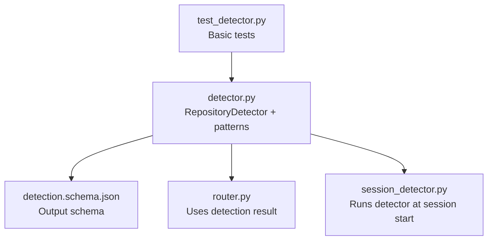
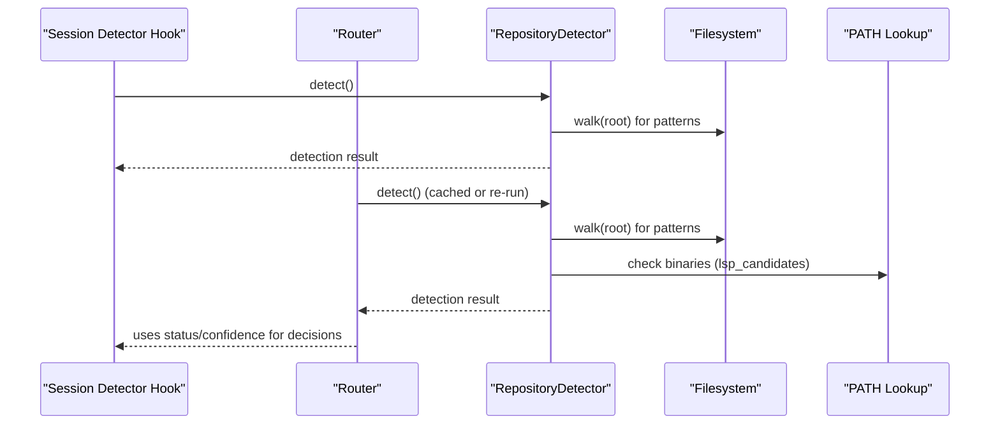
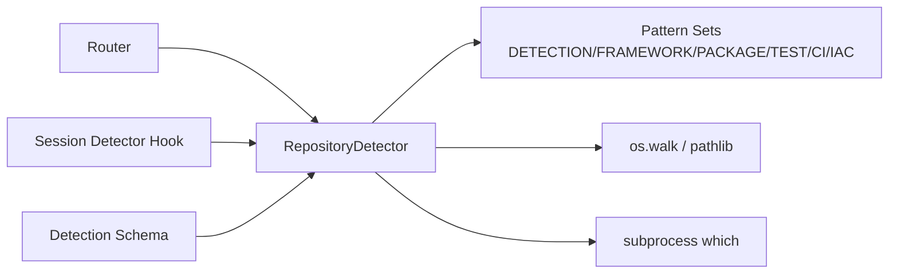

# Repository Detection System

<cite>
**Referenced Files in This Document**
- [detector.py](file://plugin/figmaforge/core/detector.py)
- [detection.schema.json](file://plugin/figmaforge/schemas/detection.schema.json)
- [test_detector.py](file://plugin/figmaforge/tests/test_detector.py)
- [session_detector.py](file://plugin/figmaforge/core/hooks/session_detector.py)
- [router.py](file://plugin/figmaforge/core/router.py)
</cite>

## Table of Contents
1. [Introduction](#introduction)
2. [Project Structure](#project-structure)
3. [Core Components](#core-components)
4. [Architecture Overview](#architecture-overview)
5. [Detailed Component Analysis](#detailed-component-analysis)
6. [Dependency Analysis](#dependency-analysis)
7. [Performance Considerations](#performance-considerations)
8. [Troubleshooting Guide](#troubleshooting-guide)
9. [Conclusion](#conclusion)
10. [Appendices](#appendices)

## Introduction
This document explains FigmaForge’s evidence-based repository detection system. It describes how the detector analyzes file patterns and project structure to identify programming languages, frameworks, package managers, test frameworks, CI providers, and infrastructure-as-code tools. It also documents the DetectionEvidence dataclass, all pattern-matching configurations, the confidence scoring algorithm, configuration options for thresholds, practical examples, and troubleshooting guidance.

## Project Structure
The detection system is implemented as a Python module within the plugin core and is consumed by other components (e.g., router and hooks). The schema defines the output contract used across the system.

**Diagram sources**
- [detector.py:1-404](file://plugin/figmaforge/core/detector.py#L1-L404)
- [detection.schema.json:1-96](file://plugin/figmaforge/schemas/detection.schema.json#L1-L96)
- [router.py:1-200](file://plugin/figmaforge/core/router.py#L1-L200)
- [session_detector.py:1-45](file://plugin/figmaforge/core/hooks/session_detector.py#L1-L45)
- [test_detector.py:1-60](file://plugin/figmaforge/tests/test_detector.py#L1-L60)

**Section sources**
- [detector.py:1-404](file://plugin/figmaforge/core/detector.py#L1-L404)
- [detection.schema.json:1-96](file://plugin/figmaforge/schemas/detection.schema.json#L1-L96)

## Core Components
- RepositoryDetector: Orchestrates detection, collects evidence, computes confidence, and returns a structured result.
- Pattern sets: DETECTION_PATTERNS, FRAMEWORK_PATTERNS, PACKAGE_MANAGER_PATTERNS, TEST_FRAMEWORK_PATTERNS, CI_PATTERNS, IAC_PATTERNS.
- DetectionEvidence: Dataclass capturing files checked and match lists per category.
- Schema: JSON schema defining the detection result contract.

Key responsibilities:
- Scan repository root recursively for file patterns.
- Detect languages, frameworks, package managers, test commands, CI providers, IaC tools.
- Compute an overall confidence score based on multiple factors.
- Provide LSP candidates available on PATH without auto-activation.

**Section sources**
- [detector.py:106-137](file://plugin/figmaforge/core/detector.py#L106-L137)
- [detector.py:139-216](file://plugin/figmaforge/core/detector.py#L139-L216)
- [detection.schema.json:1-96](file://plugin/figmaforge/schemas/detection.schema.json#L1-L96)

## Architecture Overview
The detector runs once and its result is reused downstream. The router consumes the detection result to select roles and determine execution mode. A session hook can run the detector early to inject concise context when actionable evidence exists.

**Diagram sources**
- [session_detector.py:17-45](file://plugin/figmaforge/core/hooks/session_detector.py#L17-L45)
- [router.py:44-117](file://plugin/figmaforge/core/router.py#L44-L117)
- [detector.py:139-216](file://plugin/figmaforge/core/detector.py#L139-L216)
- [detector.py:338-364](file://plugin/figmaforge/core/detector.py#L338-L364)

## Detailed Component Analysis

### DetectionEvidence dataclass
- Purpose: Captures evidence collected during detection including counts and matched categories.
- Fields include files_checked, language_matches, framework_matches, package_manager_matches, test_framework_matches, ci_matches, iac_matches, mcp_matches, lsp_matches, warnings.

Usage:
- Instantiated per detector instance to accumulate matches and warnings during scanning.

**Section sources**
- [detector.py:106-120](file://plugin/figmaforge/core/detector.py#L106-L120)

### Pattern Matching Configurations
- DETECTION_PATTERNS: Maps languages to file patterns indicating presence (e.g., JavaScript via package.json or *.js; TypeScript via tsconfig.json; Python via pyproject.toml or requirements*.txt; Go via go.mod; Rust via Cargo.toml; Java via pom.xml or Gradle files; Kotlin via build.gradle.kts; C# via csproj/sln; PHP via composer.json; Ruby via Gemfile; Elixir via mix.exs; R via *.R; Lua via *.lua; Swift via Package.swift; C/C++ via *.c/*.cpp and CMakeLists.txt).
- FRAMEWORK_PATTERNS: Maps languages to framework indicators (e.g., React/Vue/Angular via node_modules and config files; FastAPI/Django/Flask via dependencies; Express via package.json; Golang/Rust via module manifests).
- PACKAGE_MANAGER_PATTERNS: Maps ecosystems to package manager signatures (npm/pnpm/yarn/bun for JS; pip/poetry/uv for Python; go/cargo/composer/gem/mix for respective ecosystems).
- TEST_FRAMEWORK_PATTERNS: Identifies test runners via configs or modules (Jest, Vitest, pytest, JUnit, Cypress, Karma).
- CI_PATTERNS: Detects CI providers by directory or config files (GitHub Actions, GitLab CI, CircleCI, Buildkite).
- IAC_PATTERNS: Detects IaC tools by file extensions or directories (Terraform, Pulumi, CloudFormation, Kubernetes/Helm).

Pattern matching logic:
- Converts wildcard patterns to regex and scans the entire repository tree for matches.
- Framework/package manager detection is gated by detected languages to reduce false positives.

**Section sources**
- [detector.py:16-103](file://plugin/figmaforge/core/detector.py#L16-L103)
- [detector.py:228-307](file://plugin/figmaforge/core/detector.py#L228-L307)

### Confidence Scoring Algorithm
- Base confidence starts at 0.0.
- Adds weighted contributions:
  - Languages: +0.2 per language detected
  - Frameworks: +0.15 per framework detected
  - Package managers: +0.1 per package manager detected
  - Test frameworks: +0.1 per test command detected
  - CI providers: +0.15 per CI provider detected
  - IaC tools: +0.1 per IaC tool detected
  - MCP config present: +0.1
- Final score is capped at 1.0.
- Status classification:
  - If confidence >= threshold (default 0.3), status is "classified"; otherwise "unclassified".

Threshold configuration:
- Constructor accepts a threshold parameter controlling the minimum confidence required to classify the repository.

**Section sources**
- [detector.py:125-137](file://plugin/figmaforge/core/detector.py#L125-L137)
- [detector.py:309-336](file://plugin/figmaforge/core/detector.py#L309-L336)

### Detection Flow and Output Contract
- The detect method initializes a result dictionary with fields defined by the schema, runs each detection stage, calculates confidence, and sets status accordingly.
- Evidence entries are appended when specific configs like .mcp.json or .lsp.json are found.
- LSP candidates are discovered by checking PATH for known binaries mapped to detected languages.

Schema highlights:
- Required fields include status, root, languages, package_managers, frameworks, test_commands, build_commands, lsp_candidates, confidence, evidence.
- Optional warnings capture ambiguous signals.

**Section sources**
- [detector.py:139-216](file://plugin/figmaforge/core/detector.py#L139-L216)
- [detection.schema.json:1-96](file://plugin/figmaforge/schemas/detection.schema.json#L1-L96)

### Integration Points
- Router: Uses detection result to score roles and determine execution mode. Unclassified repos incur penalties depending on domain and language absence.
- Session detector hook: Runs detection at session start and injects concise context if classified with sufficient confidence.

**Section sources**
- [router.py:44-117](file://plugin/figmaforge/core/router.py#L44-L117)
- [router.py:265-287](file://plugin/figmaforge/core/router.py#L265-L287)
- [session_detector.py:17-45](file://plugin/figmaforge/core/hooks/session_detector.py#L17-L45)

### Practical Examples
Below are conceptual scenarios illustrating how different project structures are detected and classified. These examples describe expected outcomes based on the pattern rules and scoring logic.

- Example A: JavaScript/TypeScript frontend
  - Files present: package.json, tsconfig.json, vite.config.ts, node_modules/react
  - Detected: languages ["javascript", "typescript"], frameworks include React, package manager npm/yarn/pnpm depending on lockfiles, test runner Jest/Vitest if configs exist
  - Confidence increases due to multiple strong signals; likely classified above default threshold

- Example B: Python backend
  - Files present: pyproject.toml, requirements.txt, pytest.ini
  - Detected: language "python", package manager pip/poetry/uv depending on lockfiles, test framework pytest
  - Confidence increases from language, package manager, and test framework signals

- Example C: Go microservice
  - Files present: go.mod, main.go
  - Detected: language "go", package manager "go"
  - Confidence moderate; may be classified if threshold met

- Example D: Multi-language monorepo
  - Files present: package.json, tsconfig.json, pyproject.toml, go.mod
  - Detected: multiple languages and corresponding package managers; frameworks inferred where applicable
  - Higher confidence due to multiple detections

- Example E: Infrastructure-focused repo
  - Files present: .github/workflows, kubernetes/, *.tf
  - Detected: CI provider GitHub Actions, IaC tools Terraform and Kubernetes
  - Confidence includes CI and IaC contributions

Note: Actual outputs depend on exact files present and their locations. The detector walks the repository tree and applies pattern rules consistently.

[No sources needed since this section provides conceptual examples]

## Dependency Analysis
The detector depends on filesystem access and optional PATH checks for LSP binaries. Downstream consumers rely on the standardized detection result.

**Diagram sources**
- [detector.py:16-103](file://plugin/figmaforge/core/detector.py#L16-L103)
- [detector.py:366-403](file://plugin/figmaforge/core/detector.py#L366-L403)
- [router.py:44-117](file://plugin/figmaforge/core/router.py#L44-L117)
- [session_detector.py:17-45](file://plugin/figmaforge/core/hooks/session_detector.py#L17-L45)
- [detection.schema.json:1-96](file://plugin/figmaforge/schemas/detection.schema.json#L1-L96)

**Section sources**
- [detector.py:366-403](file://plugin/figmaforge/core/detector.py#L366-L403)
- [router.py:44-117](file://plugin/figmaforge/core/router.py#L44-L117)
- [session_detector.py:17-45](file://plugin/figmaforge/core/hooks/session_detector.py#L17-L45)

## Performance Considerations
- Filesystem scanning: The detector walks the repository root recursively for each pattern match. For large repositories, consider limiting scan scope or caching results if repeated calls occur.
- Binary checks: LSP candidate detection invokes external commands; failures are handled gracefully but add overhead.
- Threshold tuning: Adjusting the threshold affects classification behavior; higher thresholds require stronger evidence.

[No sources needed since this section provides general guidance]

## Troubleshooting Guide
Common issues and resolutions:

- Repository not found
  - Symptom: FileNotFoundError raised during initialization or detection.
  - Cause: Invalid root path provided to RepositoryDetector.
  - Resolution: Ensure the root path exists and is accessible.

- No languages detected
  - Symptom: Empty languages list; status remains "unclassified".
  - Causes: Missing standard manifest files or source files; patterns not matching due to non-standard layout.
  - Resolutions:
    - Add conventional files (e.g., package.json for JS/TS, pyproject.toml for Python, go.mod for Go).
    - Verify file names and extensions align with pattern expectations.
    - Check that files are not excluded by environment or permissions.

- False positives/negatives in frameworks or package managers
  - Symptom: Unexpected or missing framework/package manager detection.
  - Causes: Presence of lockfiles or directories without actual usage; language gating prevents some detections.
  - Resolutions:
    - Remove unused lockfiles or directories if they cause noise.
    - Ensure language-specific files exist to gate framework detection correctly.

- Low confidence despite many files
  - Symptom: Confidence below threshold; status "unclassified".
  - Causes: Weak signals (e.g., only generic files present).
  - Resolutions:
    - Add stronger indicators (e.g., test configs, CI workflows, IaC manifests).
    - Lower the threshold if appropriate for your use case.

- LSP candidates not detected
  - Symptom: Empty lsp_candidates list.
  - Causes: Binaries not installed or not on PATH.
  - Resolutions: Install relevant language servers and ensure they are discoverable via PATH.

- Hook does not inject context
  - Symptom: No context injected at session start.
  - Causes: Repository unclassified or confidence below configured threshold.
  - Resolutions: Improve evidence (add manifests/configs) or adjust threshold in detector instantiation.

**Section sources**
- [detector.py:125-146](file://plugin/figmaforge/core/detector.py#L125-L146)
- [detector.py:309-336](file://plugin/figmaforge/core/detector.py#L309-L336)
- [session_detector.py:17-45](file://plugin/figmaforge/core/hooks/session_detector.py#L17-L45)

## Conclusion
FigmaForge’s repository detection system uses a robust, evidence-based approach to identify project characteristics through file pattern matching and simple heuristics. The DetectionEvidence dataclass captures detailed matches, while configurable thresholds allow tuning classification sensitivity. The system integrates seamlessly with routing and session hooks to inform downstream decisions. By ensuring conventional project structures and adding strong signals (manifests, configs, CI/IaC), users can achieve reliable detection and classification.

[No sources needed since this section summarizes without analyzing specific files]

## Appendices

### Configuration Options
- Threshold: Passed to RepositoryDetector constructor to control minimum confidence for classification. Default is 0.3.
- Root path: Must point to an existing repository root.

**Section sources**
- [detector.py:125-137](file://plugin/figmaforge/core/detector.py#L125-L137)

### Usage Examples
- Basic initialization and detection:
  - Instantiate RepositoryDetector with a valid root path and call detect().
  - Inspect result fields: status, languages, package_managers, frameworks, test_commands, ci_providers, iac_tools, lsp_candidates, confidence, evidence, warnings.

- Running via session hook:
  - The session detector hook runs detection at session start and prints concise context when classified with sufficient confidence.

**Section sources**
- [test_detector.py:14-36](file://plugin/figmaforge/tests/test_detector.py#L14-L36)
- [session_detector.py:17-45](file://plugin/figmaforge/core/hooks/session_detector.py#L17-L45)