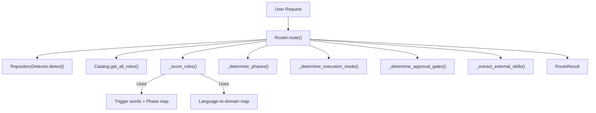
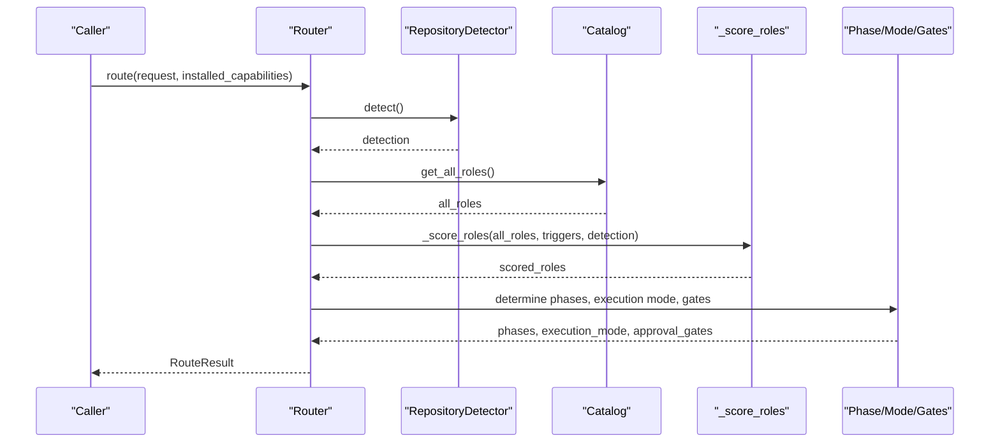
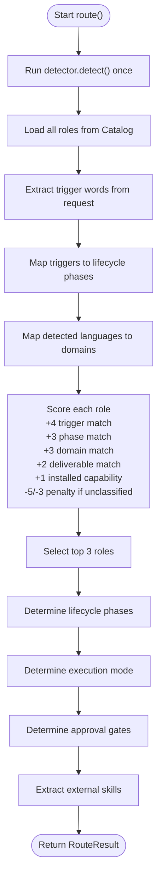
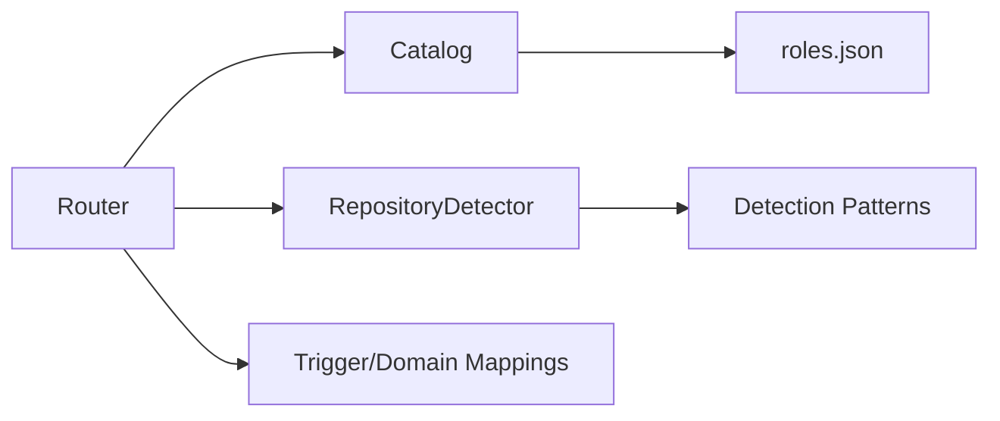

# Role Routing Engine

<cite>
**Referenced Files in This Document**
- [router.py](file://plugin/figmaforge/core/router.py)
- [catalog.py](file://plugin/figmaforge/core/catalog.py)
- [detector.py](file://plugin/figmaforge/core/detector.py)
- [roles.json](file://plugin/figmaforge/catalog/roles.json)
- [route.md](file://plugin/figmaforge/skills/route.md)
- [router.schema.json](file://plugin/figmaforge/schemas/router.schema.json)
- [test_router.py](file://plugin/figmaforge/tests/test_router.py)
</cite>

## Table of Contents
1. [Introduction](#introduction)
2. [Project Structure](#project-structure)
3. [Core Components](#core-components)
4. [Architecture Overview](#architecture-overview)
5. [Detailed Component Analysis](#detailed-component-analysis)
6. [Dependency Analysis](#dependency-analysis)
7. [Performance Considerations](#performance-considerations)
8. [Troubleshooting Guide](#troubleshooting-guide)
9. [Conclusion](#conclusion)
10. [Appendices](#appendices)

## Introduction
This document explains FigmaForge’s intelligent role routing engine: how it deterministically selects appropriate engineering roles from a catalog of 100 roles across 10 domains, based on repository characteristics and user requests. It covers the role catalog structure, trigger word processing, execution mode determination, scoring methodology, integration with repository detection results, context influence, customization of role definitions, debugging selection decisions, performance considerations, and caching strategies.

## Project Structure
The routing engine is implemented as a small, focused pipeline:
- Router orchestrates detection, scoring, phase selection, execution mode, approval gates, and external skills extraction.
- Catalog loads and exposes the 100-role catalog organized by domain.
- Detector inspects the repository to infer languages, frameworks, package managers, CI/IaC, LSP candidates, and confidence.
- The skill definition documents the expected output contract for consumers.
- A JSON schema defines the router result contract.
- Unit tests validate core behaviors like trigger extraction, phase mapping, signal matching, penalties, execution modes, and approval gates.

**Diagram sources**
- [router.py:44-117](file://plugin/figmaforge/core/router.py#L44-L117)
- [catalog.py:70-79](file://plugin/figmaforge/core/catalog.py#L70-L79)
- [detector.py:139-216](file://plugin/figmaforge/core/detector.py#L139-L216)

**Section sources**
- [router.py:44-117](file://plugin/figmaforge/core/router.py#L44-L117)
- [catalog.py:11-116](file://plugin/figmaforge/core/catalog.py#L11-L116)
- [detector.py:122-216](file://plugin/figmaforge/core/detector.py#L122-L216)
- [route.md:8-28](file://plugin/figmaforge/skills/route.md#L8-L28)
- [router.schema.json:1-98](file://plugin/figmaforge/schemas/router.schema.json#L1-L98)

## Core Components
- Router: deterministic scorer and orchestrator that converts a natural language request into a structured route plan with up to three selected roles, phases, execution mode, approval gates, and external skills.
- Catalog: loader and query interface for the 100-role catalog grouped by domain.
- Detector: evidence-based repository stack detector producing languages, frameworks, package managers, CI/IaC, LSP candidates, confidence, and classification status.
- Skill definition: describes the routing capability and its outputs.
- Schema: validates the router result shape.

Key responsibilities:
- Trigger extraction and mapping to lifecycle phases.
- Scoring roles using triggers, phases, repository signals, deliverables, installed capabilities, and penalties.
- Selecting top roles and deriving lifecycle phases.
- Determining execution mode and approval gates.
- Extracting external skill references.

**Section sources**
- [router.py:14-117](file://plugin/figmaforge/core/router.py#L14-L117)
- [catalog.py:11-116](file://plugin/figmaforge/core/catalog.py#L11-L116)
- [detector.py:122-216](file://plugin/figmaforge/core/detector.py#L122-L216)
- [route.md:8-28](file://plugin/figmaforge/skills/route.md#L8-L28)
- [router.schema.json:1-98](file://plugin/figmaforge/schemas/router.schema.json#L1-L98)

## Architecture Overview
The routing engine follows a deterministic pipeline:
1. Detect repository context once and cache the result.
2. Load all roles from the catalog.
3. Extract trigger keywords from the request and map them to lifecycle phases.
4. Derive relevant domains from detected languages.
5. Score each role using multiple signals and penalties.
6. Select the top three roles (or fallback behavior).
7. Determine lifecycle phases, execution mode, approval gates, and unloaded modules.
8. Return a validated RouteResult.

**Diagram sources**
- [router.py:44-117](file://plugin/figmaforge/core/router.py#L44-L117)
- [detector.py:139-216](file://plugin/figmaforge/core/detector.py#L139-L216)
- [catalog.py:70-79](file://plugin/figmaforge/core/catalog.py#L70-L79)

## Detailed Component Analysis

### Router: Deterministic Scoring and Execution Mode
The Router implements a deterministic scoring algorithm that evaluates every role against:
- Explicit trigger matches from the request.
- Lifecycle-phase overlap derived from triggers.
- Repository signal match via language-to-domain mapping.
- Deliverable keyword overlap with the request text.
- Installed capability reference matches.
- Penalties when the repository is unclassified or lacks language evidence.

It then selects the top three roles, determines lifecycle phases, execution mode, approval gates, and extracts external skills.

**Diagram sources**
- [router.py:44-117](file://plugin/figmaforge/core/router.py#L44-L117)
- [router.py:176-302](file://plugin/figmaforge/core/router.py#L176-L302)
- [router.py:304-430](file://plugin/figmaforge/core/router.py#L304-L430)

Key implementation details:
- Trigger extraction uses a fixed list of trigger words and returns deduplicated matches.
- Trigger-to-phase mapping ensures consistent lifecycle interpretation.
- Language-to-domain mapping connects detected languages to relevant role domains.
- Scoring weights are additive; penalties are mutually exclusive to avoid double-counting.
- Fallback behavior ensures non-empty results when only a single trigger is found.
- Execution mode logic enforces isolated execution for unclassified stacks or specific roles, planner mode for planning phases, and direct mode otherwise.
- Approval gates include external mutation, stack selection, language activation, and project approval.

**Section sources**
- [router.py:119-186](file://plugin/figmaforge/core/router.py#L119-L186)
- [router.py:188-302](file://plugin/figmaforge/core/router.py#L188-L302)
- [router.py:304-430](file://plugin/figmaforge/core/router.py#L304-L430)
- [test_router.py:29-125](file://plugin/figmaforge/tests/test_router.py#L29-L125)

### Catalog: Role Definitions Across 10 Domains
The catalog loads roles.json and provides:
- Flattened access to all roles.
- Domain-scoped queries.
- Trigger-based role lookup.
- Domain counts.

Role structure includes:
- id, title, phases, triggers, deliverables, repository_signals, risk, capability_refs, fallback_pack.
- Organized under domains such as discovery, experience, architecture, application, data, quality, delivery, governance, growth, executive.

Customization points:
- Add new roles within existing domains or create new domains.
- Adjust triggers, phases, deliverables, and capability_refs to refine routing.
- Use repository_signals to guide future enhancements beyond language-based signals.

**Section sources**
- [catalog.py:11-116](file://plugin/figmaforge/core/catalog.py#L11-L116)
- [roles.json:1-1155](file://plugin/figmaforge/catalog/roles.json#L1-L1155)

### Detector: Repository Evidence and Context
The detector scans the repository to produce:
- Languages, frameworks, package managers, test commands, CI providers, IaC tools.
- MCP and LSP configuration presence.
- LSP candidates available on PATH.
- Confidence score and classification status.

Context influences role selection through:
- Detected languages mapped to relevant domains.
- LSP candidates used to identify unloaded modules.
- Stack status driving execution mode and approval gates.

**Section sources**
- [detector.py:15-103](file://plugin/figmaforge/core/detector.py#L15-L103)
- [detector.py:122-216](file://plugin/figmaforge/core/detector.py#L122-L216)
- [detector.py:309-404](file://plugin/figmaforge/core/detector.py#L309-L404)

### Skill Definition and Output Contract
The skill definition clarifies:
- Purpose: detect context and select phases, roles, existing skills, and execution mode.
- Outputs: phases, up to three roles with scores and reasons, external skill references, execution mode, stack status, approval gates, and unloaded modules.
- Constraints: uses detector and catalog, never installs plugins or connects MCP servers, deterministic and bounded before interpretation.

The JSON schema validates the router result fields and enumerations.

**Section sources**
- [route.md:8-28](file://plugin/figmaforge/skills/route.md#L8-L28)
- [router.schema.json:1-98](file://plugin/figmaforge/schemas/router.schema.json#L1-L98)

## Dependency Analysis
The router depends on:
- Catalog for role definitions.
- Detector for repository evidence.
- Internal mappings for trigger-to-phase and language-to-domain.

**Diagram sources**
- [router.py:10-11](file://plugin/figmaforge/core/router.py#L10-L11)
- [catalog.py:14-30](file://plugin/figmaforge/core/catalog.py#L14-L30)
- [detector.py:15-103](file://plugin/figmaforge/core/detector.py#L15-L103)

Coupling and cohesion:
- Router has high cohesion around routing logic and low coupling to external systems via well-defined interfaces.
- Catalog encapsulates role loading and querying.
- Detector encapsulates filesystem scanning and pattern matching.

Potential circular dependencies:
- None observed; Router depends on Catalog and Detector, which do not depend back on Router.

External dependencies and integration points:
- Filesystem access for detection.
- PATH inspection for LSP binaries.
- JSON schema validation for outputs.

**Section sources**
- [router.py:10-11](file://plugin/figmaforge/core/router.py#L10-L11)
- [catalog.py:14-30](file://plugin/figmaforge/core/catalog.py#L14-L30)
- [detector.py:15-103](file://plugin/figmaforge/core/detector.py#L15-L103)

## Performance Considerations
- Detection is executed once per route call and cached for downstream steps to avoid redundant filesystem scans.
- Scoring iterates over all roles but uses simple string checks and dictionary lookups; complexity is O(R) where R is number of roles (100), which is negligible.
- LSP candidate detection invokes PATH checks; this is bounded and guarded by timeouts.
- Unloaded module computation is linear over a fixed set of languages.

Optimization opportunities:
- Cache detection results across multiple route calls if the repository root does not change.
- Precompute trigger-to-phase and language-to-domain maps at startup (already class-level constants).
- Limit role evaluation to domain-filtered subsets if catalogs grow significantly.

[No sources needed since this section provides general guidance]

## Troubleshooting Guide
Common issues and diagnostics:
- No roles selected: check trigger extraction and ensure request contains known trigger words; verify fallback behavior for single-trigger cases.
- Unexpected execution mode: confirm stack status and whether selected roles include planning or isolated roles.
- Missing approval gates: verify triggers like deploy/push/release/migration and stack status.
- Incorrect phase ordering: ensure phases come from selected roles and follow lifecycle order.

Debugging steps:
- Inspect triggers extracted from the request.
- Review scored roles and their reasons to understand why certain roles were chosen or penalized.
- Validate detection output for languages, frameworks, and LSP candidates.
- Confirm installed capabilities align with role capability_refs.

Relevant validations and tests:
- Trigger extraction correctness and deduplication.
- Phase mapping for design and test triggers.
- Signal matching for Python and JavaScript.
- Penalty logic avoiding double penalties.
- Execution mode determination for unclassified, direct, and planner scenarios.
- Approval gate inclusion for deployment-related triggers and unclassified stacks.

**Section sources**
- [router.py:176-302](file://plugin/figmaforge/core/router.py#L176-L302)
- [router.py:304-430](file://plugin/figmaforge/core/router.py#L304-L430)
- [test_router.py:29-125](file://plugin/figmaforge/tests/test_router.py#L29-L125)

## Conclusion
FigmaForge’s role routing engine provides a deterministic, evidence-based mechanism to select appropriate roles from a comprehensive catalog. By combining request triggers, lifecycle phases, repository signals, deliverables, and installed capabilities, it produces a structured route plan with clear execution modes and safety gates. The system is designed for extensibility through role customization and robustness through caching and validation.

[No sources needed since this section summarizes without analyzing specific files]

## Appendices

### Example Requests and Routing Outcomes
- “Design the UI” → triggers include “design”; maps to “design” phase; likely selects UX/UI roles in experience domain; execution mode depends on selected roles and stack status.
- “Fix a bug in the API” → triggers include “fix”, “bug”, “api”; maps to “implement” phase; likely selects backend/API roles in application domain; direct execution mode unless planning required.
- “Deploy the service” → triggers include “deploy”; adds external mutation gate; may select DevOps/Release roles in delivery domain; execution mode determined by stack and roles.

These examples illustrate how trigger words drive phase mapping and role selection, while repository context influences domain relevance and execution mode.

[No sources needed since this section provides conceptual examples]

### Customization of Role Definitions
To customize routing:
- Add new trigger words to the router’s trigger list and map them to lifecycle phases.
- Extend language-to-domain mapping to include additional languages or adjust domain relevance.
- Update role definitions in roles.json to refine triggers, phases, deliverables, and capability_refs.
- Introduce new domains or reorganize existing ones to better reflect organizational needs.

**Section sources**
- [router.py:119-186](file://plugin/figmaforge/core/router.py#L119-L186)
- [roles.json:1-1155](file://plugin/figmaforge/catalog/roles.json#L1-L1155)

### Caching Strategies for Role Evaluation
- Cache detector.detect() results per repository root to avoid repeated filesystem scans.
- Cache catalog loading at process startup since roles.json is static during runtime.
- Optionally memoize scoring results keyed by request hash and detection fingerprint for repeated identical requests.

[No sources needed since this section provides general guidance]