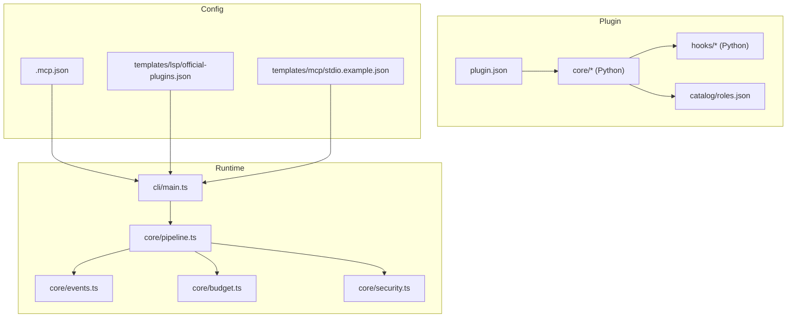
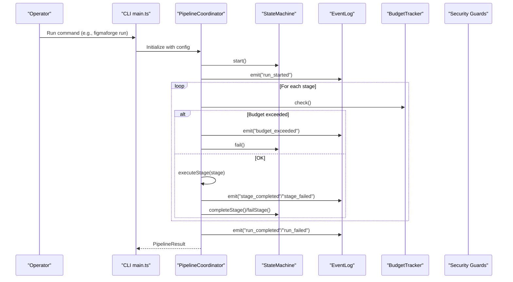
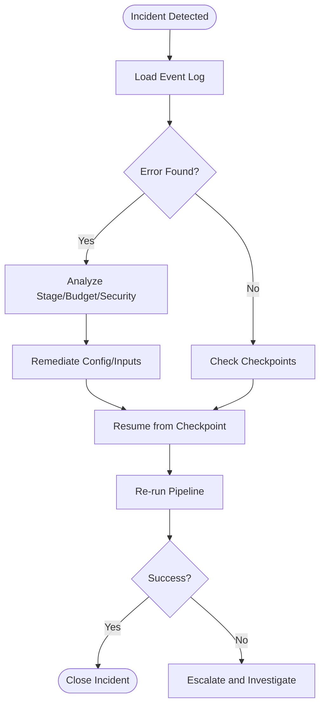
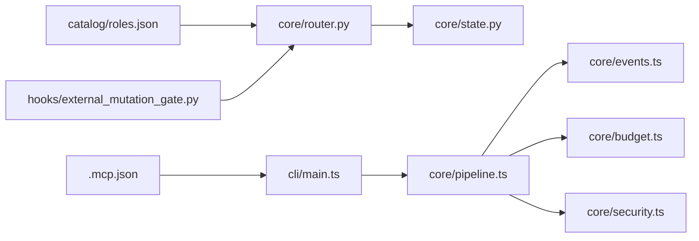

# Deployment and Operations

<cite>
**Referenced Files in This Document**
- [README.md](file://README.md)
- [CLAUDE.md](file://CLAUDE.md)
- [.mcp.json](file://.mcp.json)
- [plugin/figmaforge/.claude-plugin/plugin.json](file://plugin/figmaforge/.claude-plugin/plugin.json)
- [runtime/package.json](file://runtime/package.json)
- [runtime/src/core/pipeline.ts](file://runtime/src/core/pipeline.ts)
- [runtime/src/core/events.ts](file://runtime/src/core/events.ts)
- [runtime/src/core/budget.ts](file://runtime/src/core/budget.ts)
- [runtime/src/core/security.ts](file://runtime/src/core/security.ts)
- [runtime/src/cli/main.ts](file://runtime/src/cli/main.ts)
- [plugin/figmaforge/core/state.py](file://plugin/figmaforge/core/state.py)
- [plugin/figmaforge/core/router.py](file://plugin/figmaforge/core/router.py)
- [plugin/figmaforge/core/hooks/external_mutation_gate.py](file://plugin/figmaforge/core/hooks/external_mutation_gate.py)
- [plugin/figmaforge/catalog/roles.json](file://plugin/figmaforge/catalog/roles.json)
- [plugin/figmaforge/templates/mcp/stdio.example.json](file://plugin/figmaforge/templates/mcp/stdio.example.json)
- [plugin/figmaforge/templates/lsp/official-plugins.json](file://plugin/figmaforge/templates/lsp/official-plugins.json)
- [docs/architecture.md](file://docs/architecture.md)
</cite>

## Table of Contents
1. Introduction
2. Project Structure
3. Core Components
4. Architecture Overview
5. Detailed Component Analysis
6. Dependency Analysis
7. Performance Considerations
8. Troubleshooting Guide
9. Conclusion
10. Appendices

## Introduction
This document provides deployment and operations guidance for FigmaForge, covering installation, environment setup, configuration, maintenance (backup, rollback, updates), monitoring, troubleshooting, performance optimization, scaling, security, access controls, audit logging, and operational runbooks for incident response and recovery. It is intended for operators and platform engineers who deploy and operate the FigmaForge plugin and its TypeScript orchestration runtime.

## Project Structure
FigmaForge consists of:
- A Claude Code plugin under plugin/figmaforge that implements detection, routing, lifecycle state management, hooks, and generators.
- A TypeScript orchestration runtime under runtime that coordinates pipeline stages, budgets, checkpoints, artifacts, events, and security guards.
- Configuration files for MCP/LSP templates and plugin metadata.

**Diagram sources**
- [plugin/figmaforge/.claude-plugin/plugin.json:1-21](file://plugin/figmaforge/.claude-plugin/plugin.json#L1-L21)
- [runtime/src/cli/main.ts:291-328](file://runtime/src/cli/main.ts#L291-L328)
- [runtime/src/core/pipeline.ts:1-124](file://runtime/src/core/pipeline.ts#L1-L124)
- [runtime/src/core/events.ts:1-138](file://runtime/src/core/events.ts#L1-L138)
- [runtime/src/core/budget.ts:1-94](file://runtime/src/core/budget.ts#L1-L94)
- [runtime/src/core/security.ts:95-210](file://runtime/src/core/security.ts#L95-L210)
- [.mcp.json:1-12](file://.mcp.json#L1-L12)
- [plugin/figmaforge/templates/lsp/official-plugins.json:48-84](file://plugin/figmaforge/templates/lsp/official-plugins.json#L48-L84)
- [plugin/figmaforge/templates/mcp/stdio.example.json:1-11](file://plugin/figmaforge/templates/mcp/stdio.example.json#L1-L11)

**Section sources**
- [README.md:24-83](file://README.md#L24-L83)
- [CLAUDE.md:19-53](file://CLAUDE.md#L19-L53)
- [runtime/package.json:1-23](file://runtime/package.json#L1-L23)

## Core Components
- Plugin metadata and roles: Defines plugin identity and a catalog of roles used by the router to select capabilities based on repository signals and triggers.
- Lifecycle state machine: Tracks phases, approvals, validations, blockers, and decisions with atomic writes and append-only events.
- Orchestration runtime: Coordinates pipeline stages, enforces budgets, manages checkpoints/artifacts, logs structured events, and applies security guards.
- Hooks and gates: Pre/post hooks enforce safety policies and external mutation control.

Key responsibilities:
- Installation and loading via Claude Code plugin mechanism.
- Runtime execution through CLI commands and pipeline stages.
- Auditability via event logs and checkpoints.
- Safety via approval gates and shell/secret guards.

**Section sources**
- [plugin/figmaforge/.claude-plugin/plugin.json:1-21](file://plugin/figmaforge/.claude-plugin/plugin.json#L1-L21)
- [plugin/figmaforge/catalog/roles.json:732-763](file://plugin/figmaforge/catalog/roles.json#L732-L763)
- [plugin/figmaforge/core/state.py:125-452](file://plugin/figmaforge/core/state.py#L125-L452)
- [runtime/src/core/pipeline.ts:82-124](file://runtime/src/core/pipeline.ts#L82-L124)
- [runtime/src/core/events.ts:14-60](file://runtime/src/core/events.ts#L14-L60)
- [plugin/figmaforge/core/hooks/external_mutation_gate.py:1-70](file://plugin/figmaforge/core/hooks/external_mutation_gate.py#L1-L70)

## Architecture Overview
The runtime orchestrates a multi-stage pipeline with checkpointing, budget enforcement, and structured event logging. The plugin’s detector and router determine phases and roles, while hooks gate risky operations.

**Diagram sources**
- [runtime/src/cli/main.ts:291-328](file://runtime/src/cli/main.ts#L291-L328)
- [runtime/src/core/pipeline.ts:137-207](file://runtime/src/core/pipeline.ts#L137-L207)
- [runtime/src/core/events.ts:66-138](file://runtime/src/core/events.ts#L66-L138)
- [runtime/src/core/budget.ts:47-94](file://runtime/src/core/budget.ts#L47-L94)

## Detailed Component Analysis

### Installation and Environment Setup
- Prerequisites:
  - Python 3.8+ available on PATH for plugin components.
  - Node.js >= 20 for the runtime build and execution.
- Install and validate:
  - Validate plugin structure using the provided validation command.
  - Load the plugin in development mode via the plugin directory flag.
  - Build and test the runtime using the provided scripts.
- MCP configuration:
  - Configure MCP servers in the project-scoped .mcp.json file.
  - Use template examples for stdio-based MCP servers.

Operational notes:
- Ensure required binaries are present and accessible.
- Keep templates inert; do not embed secrets or activate services automatically.

**Section sources**
- [README.md:24-83](file://README.md#L24-L83)
- [CLAUDE.md:66-83](file://CLAUDE.md#L66-L83)
- [runtime/package.json:1-23](file://runtime/package.json#L1-L23)
- [.mcp.json:1-12](file://.mcp.json#L1-L12)
- [plugin/figmaforge/templates/mcp/stdio.example.json:1-11](file://plugin/figmaforge/templates/mcp/stdio.example.json#L1-L11)

### Configuration Management
- Plugin metadata:
  - Name, version, description, license, author, and keywords are defined in plugin.json.
- MCP/LSP templates:
  - Example MCP server configuration demonstrates environment variables and command invocation.
  - Official LSP plugins list shows language-to-server mappings and install commands.
- Runtime configuration:
  - CLI builds a runtime configuration object passed into the pipeline coordinator.

Best practices:
- Store sensitive values in environment variables, not in templates.
- Pin versions for reproducibility.
- Validate configurations before deployment.

**Section sources**
- [plugin/figmaforge/.claude-plugin/plugin.json:1-21](file://plugin/figmaforge/.claude-plugin/plugin.json#L1-L21)
- [plugin/figmaforge/templates/mcp/stdio.example.json:1-11](file://plugin/figmaforge/templates/mcp/stdio.example.json#L1-L11)
- [plugin/figmaforge/templates/lsp/official-plugins.json:48-84](file://plugin/figmaforge/templates/lsp/official-plugins.json#L48-L84)
- [runtime/src/core/pipeline.ts:89-124](file://runtime/src/core/pipeline.ts#L89-L124)

### Maintenance: Backup Procedures
- Location and contents:
  - Backups stored under a timestamped directory include repository bundle, worktree archive, manifest, checksums, and git status snapshot.
- Creation guidelines:
  - Set restrictive permissions and verify archives and hashes before proceeding.
- Scope:
  - Includes tracked and untracked files and empty extension directories; excludes parent settings and user caches.

Operational tips:
- Automate backup creation at key milestones (pre-deploy, post-update).
- Verify integrity using checksums before any restore operation.

**Section sources**
- [docs/architecture.md:520-552](file://docs/architecture.md#L520-L552)

### Maintenance: Rollback Processes
- Restore workflow:
  - Stop and preserve failed working tree.
  - Verify selected backup checksums.
  - Restore into a sibling directory first.
  - Compare restored tree to backup manifest.
  - Replace working directory only after explicit confirmation.
  - Use Git bundle to recover committed refs independently.
  - Recheck root configuration and license against pre-change hashes.

Repair-loop rollback:
- The repair loop supports rolling back to a previous iteration using history and executor rollback.

**Section sources**
- [docs/architecture.md:537-545](file://docs/architecture.md#L537-L545)
- [plugin/figmaforge/core/repair_loop.py:401-424](file://plugin/figmaforge/core/repair_loop.py#L401-L424)

### Maintenance: Update Strategies
- Plugin updates:
  - Validate updated plugin structure before reloading.
  - Test detector and core modules with existing tests.
- Runtime updates:
  - Build and run tests to ensure compatibility.
  - Use CLI commands to inspect and replay runs post-update.

Suggested strategy:
- Blue/green or canary deployments for runtime updates.
- Feature flags controlled by configuration for gradual rollout.
- Maintain backward-compatible schemas and templates.

**Section sources**
- [README.md:127-145](file://README.md#L127-L145)
- [CLAUDE.md:66-83](file://CLAUDE.md#L66-L83)
- [runtime/src/cli/main.ts:291-328](file://runtime/src/cli/main.ts#L291-L328)

### Monitoring and Observability
- Structured event log:
  - Every action emits an append-only JSON event with sequence number, timestamp, level, kind, run ID, optional task ID and stage, message, and data payload.
  - Events support filtering by kind, stage, and severity.
- Checkpoints and artifacts:
  - Pipeline saves checkpoints per stage and persists artifacts including event logs for replay.
- CLI replay:
  - Replay command reads event logs from artifacts and prints timeline with optional verbose data.

Operational recommendations:
- Centralize event logs for aggregation and alerting.
- Monitor budget exceedances and stage failures.
- Track checkpoint frequency and artifact sizes.

**Section sources**
- [runtime/src/core/events.ts:14-60](file://runtime/src/core/events.ts#L14-L60)
- [runtime/src/core/events.ts:66-138](file://runtime/src/core/events.ts#L66-L138)
- [runtime/src/core/pipeline.ts:137-207](file://runtime/src/core/pipeline.ts#L137-L207)
- [runtime/src/cli/main.ts:291-328](file://runtime/src/cli/main.ts#L291-L328)

### Security, Access Controls, and Audit Logging
- External mutation gate:
  - PreToolUse hook inspects commands and tool names for destructive or outbound actions and blocks unauthorized mutations.
- Approval gates:
  - Router generates gates for external mutations, stack selection, language activation, and project approval based on roles and execution mode.
- Secret redaction:
  - SecretGuard detects and redacts potential secrets in logs and prompts.
- Shell execution guard:
  - ShellGuard restricts allowed commands and validates arguments to prevent injection.
- Audit trail:
  - EventLog records all pipeline actions, approvals, and security violations for audit and replay.

Operational controls:
- Enforce least privilege for runtime environments.
- Review and approve high-risk gates before execution.
- Rotate credentials regularly and avoid embedding them in configs.

**Section sources**
- [plugin/figmaforge/core/hooks/external_mutation_gate.py:1-70](file://plugin/figmaforge/core/hooks/external_mutation_gate.py#L1-L70)
- [plugin/figmaforge/core/router.py:377-429](file://plugin/figmaforge/core/router.py#L377-L429)
- [runtime/src/core/security.ts:109-210](file://runtime/src/core/security.ts#L109-L210)
- [runtime/src/core/events.ts:14-60](file://runtime/src/core/events.ts#L14-L60)

### Operational Runbooks

#### Incident Response: Pipeline Failure
- Symptoms:
  - Stage failures, budget exceeded, or run marked failed.
- Steps:
  - Inspect event log for errors and context.
  - Check budget limits and adjust if necessary.
  - Resume from last checkpoint if applicable.
  - If security violation occurred, review approval logs and remediate.
  - Re-run with increased verbosity for diagnostics.

**Diagram sources**
- [runtime/src/core/pipeline.ts:137-207](file://runtime/src/core/pipeline.ts#L137-L207)
- [runtime/src/core/events.ts:66-138](file://runtime/src/core/events.ts#L66-L138)
- [runtime/src/core/budget.ts:47-94](file://runtime/src/core/budget.ts#L47-L94)

**Section sources**
- [runtime/src/core/pipeline.ts:137-207](file://runtime/src/core/pipeline.ts#L137-L207)
- [runtime/src/core/events.ts:66-138](file://runtime/src/core/events.ts#L66-L138)
- [runtime/src/core/budget.ts:47-94](file://runtime/src/core/budget.ts#L47-L94)

#### System Recovery: Rollback to Previous State
- Steps:
  - Identify target backup and verify checksums.
  - Restore into a sibling directory and compare to manifest.
  - Confirm replacement of working directory.
  - Recover Git refs from bundle if needed.
  - Re-validate root configuration and license integrity.

**Section sources**
- [docs/architecture.md:537-545](file://docs/architecture.md#L537-L545)

#### Update Rollback: Revert Runtime or Plugin
- Steps:
  - Stop new version processes.
  - Restore previous artifacts and configuration.
  - Re-run validation suite and smoke tests.
  - Resume service with known-good version.

**Section sources**
- [README.md:127-145](file://README.md#L127-L145)
- [CLAUDE.md:66-83](file://CLAUDE.md#L66-L83)

## Dependency Analysis
- Plugin dependencies:
  - Roles catalog drives router behavior and gate generation.
  - Hooks enforce safety constraints during tool use.
- Runtime dependencies:
  - Pipeline depends on state machine, event log, budget tracker, artifact store, tool registry, and security guards.
  - CLI composes runtime configuration and invokes pipeline commands.

Potential coupling:
- Router and roles introduce domain-specific triggers; changes may affect gate generation.
- Security guards constrain shell and secret handling; modifications require careful testing.

External integrations:
- MCP servers configured via .mcp.json.
- LSP plugins referenced for language support.

**Diagram sources**
- [plugin/figmaforge/catalog/roles.json:732-763](file://plugin/figmaforge/catalog/roles.json#L732-L763)
- [plugin/figmaforge/core/router.py:377-429](file://plugin/figmaforge/core/router.py#L377-L429)
- [plugin/figmaforge/core/hooks/external_mutation_gate.py:1-70](file://plugin/figmaforge/core/hooks/external_mutation_gate.py#L1-L70)
- [plugin/figmaforge/core/state.py:125-452](file://plugin/figmaforge/core/state.py#L125-L452)
- [runtime/src/cli/main.ts:291-328](file://runtime/src/cli/main.ts#L291-L328)
- [runtime/src/core/pipeline.ts:82-124](file://runtime/src/core/pipeline.ts#L82-L124)
- [runtime/src/core/events.ts:66-138](file://runtime/src/core/events.ts#L66-L138)
- [runtime/src/core/budget.ts:47-94](file://runtime/src/core/budget.ts#L47-L94)
- [runtime/src/core/security.ts:109-210](file://runtime/src/core/security.ts#L109-L210)
- [.mcp.json:1-12](file://.mcp.json#L1-L12)

**Section sources**
- [plugin/figmaforge/core/router.py:377-429](file://plugin/figmaforge/core/router.py#L377-L429)
- [runtime/src/core/pipeline.ts:82-124](file://runtime/src/core/pipeline.ts#L82-L124)

## Performance Considerations
- Budget enforcement:
  - Token, time, and iteration limits prevent runaway usage; monitor budget exceedance events.
- Checkpointing:
  - Resume from last completed stage reduces rework and improves resilience.
- Artifact management:
  - Persist outputs per stage for efficient debugging and replay.
- Concurrency:
  - Limit parallelism where appropriate to avoid resource contention.
- Caching:
  - Cache detection results and resolved assets to reduce repeated work.

[No sources needed since this section provides general guidance]

## Troubleshooting Guide
Common issues and resolutions:
- Budget exceeded:
  - Increase limits or optimize pipeline stages; review event logs for offending stages.
- Stage failure:
  - Inspect error messages and retry with adjusted inputs; resume from checkpoint.
- Security violations:
  - Review approval logs and adjust allowed commands or patterns; update security policies.
- Missing artifacts:
  - Ensure output directories exist and have write permissions; verify artifact storage paths.
- Replay failures:
  - Confirm event log exists and is valid; regenerate snapshots if outputs changed intentionally.

Diagnostic tools:
- CLI replay for timeline inspection.
- Event log filtering by kind, stage, and severity.
- Checkpoint listing and restoration.

**Section sources**
- [runtime/src/core/pipeline.ts:137-207](file://runtime/src/core/pipeline.ts#L137-L207)
- [runtime/src/core/events.ts:66-138](file://runtime/src/core/events.ts#L66-L138)
- [runtime/src/cli/main.ts:291-328](file://runtime/src/cli/main.ts#L291-L328)

## Conclusion
FigmaForge provides a robust, auditable, and secure platform for design-to-code workflows with strong operational controls. Operators should leverage backups, checkpoints, event logs, and security gates to maintain reliability and safety. Follow the documented procedures for installation, configuration, maintenance, monitoring, and incident response to ensure consistent and resilient operations.

[No sources needed since this section summarizes without analyzing specific files]

## Appendices

### Quick Reference: Key Commands and Paths
- Validate plugin: Use the provided validation command.
- Load plugin: Use the plugin directory flag.
- Build runtime: Use the build script.
- Run runtime tests: Use the test script.
- Replay runs: Use the CLI replay command with run ID.

**Section sources**
- [README.md:127-145](file://README.md#L127-L145)
- [CLAUDE.md:66-83](file://CLAUDE.md#L66-L83)
- [runtime/src/cli/main.ts:291-328](file://runtime/src/cli/main.ts#L291-L328)