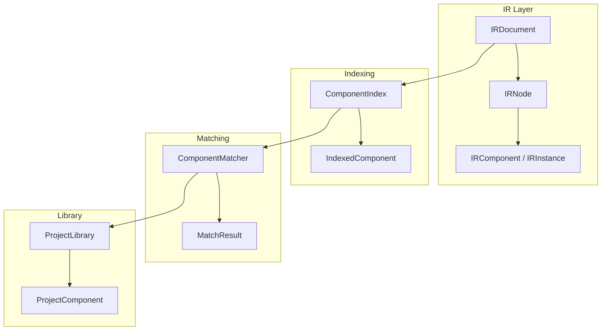
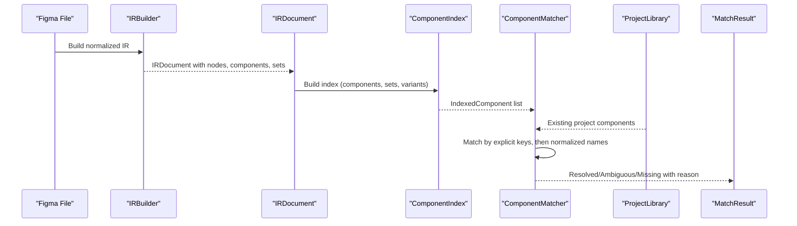
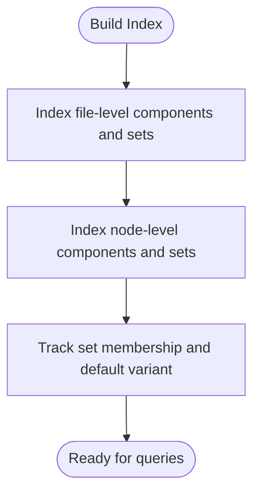
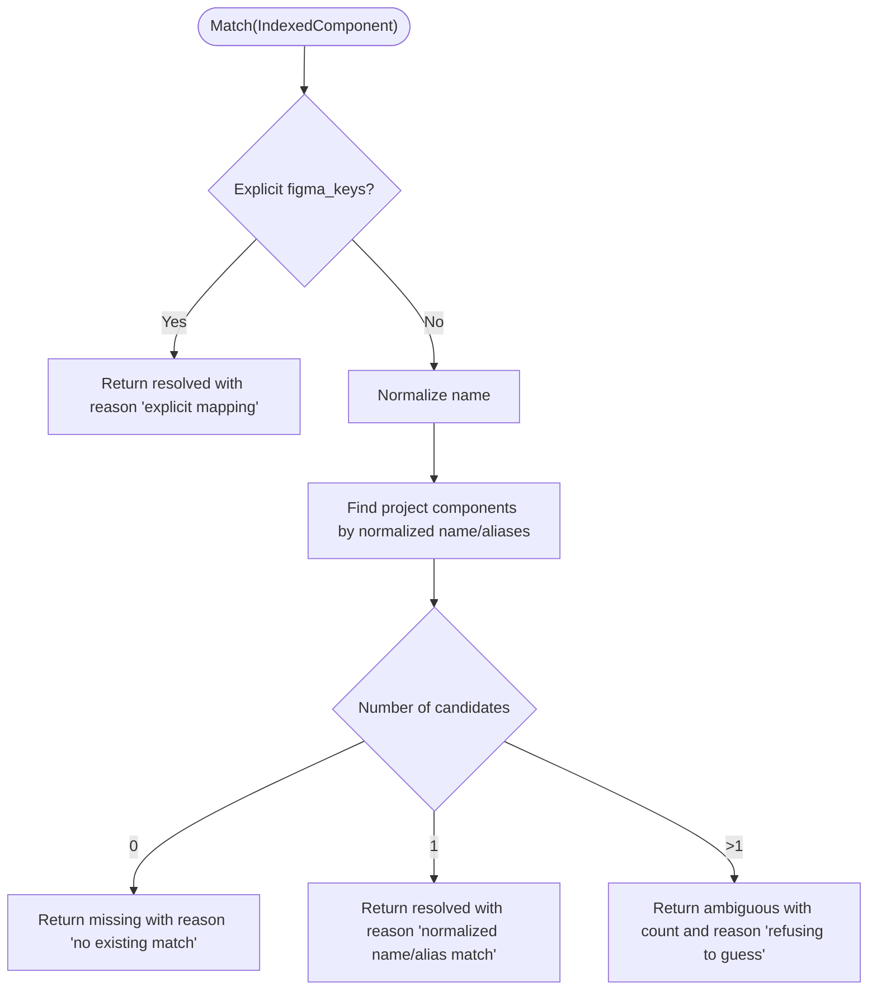
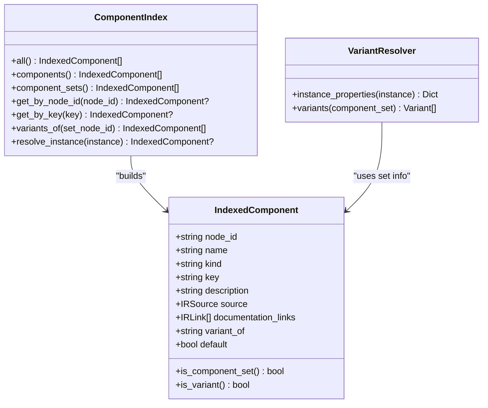
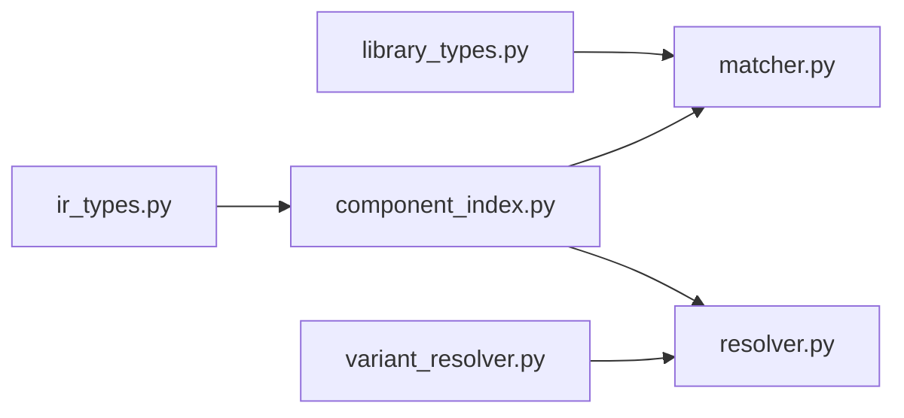

# Component Matching and Indexing

<cite>
**Referenced Files in This Document**
- [component_index.py](file://plugin/figmaforge/core/component_index.py)
- [matcher.py](file://plugin/figmaforge/core/matcher.py)
- [library_types.py](file://plugin/figmaforge/core/library_types.py)
- [ir_types.py](file://plugin/figmaforge/core/ir_types.py)
- [variant_resolver.py](file://plugin/figmaforge/core/variant_resolver.py)
- [resolver.py](file://plugin/figmaforge/core/resolver.py)
- [components.json](file://plugin/figmaforge/library/components.json)
- [variants.json](file://plugin/figmaforge/fixtures/figma/variants.json)
- [test_components.py](file://plugin/figmaforge/tests/test_components.py)
</cite>

## Table of Contents
1. [Introduction](#introduction)
2. [Project Structure](#project-structure)
3. [Core Components](#core-components)
4. [Architecture Overview](#architecture-overview)
5. [Detailed Component Analysis](#detailed-component-analysis)
6. [Dependency Analysis](#dependency-analysis)
7. [Performance Considerations](#performance-considerations)
8. [Troubleshooting Guide](#troubleshooting-guide)
9. [Conclusion](#conclusion)
10. [Appendices](#appendices)

## Introduction
This document explains the Component Matching and Indexing system that maps design components from a Figma-derived IR to existing project library components. It covers:
- How the ComponentIndex builds an index of all components, component sets, instances, and their relationships.
- How the ComponentMatcher performs deterministic, evidence-based matching using explicit overrides, name normalization, and alias matching.
- The MatchResult structure that reports resolved, ambiguous, or missing matches with reasons.
- Handling of complex hierarchies including nested instances and variant sets.
- Performance characteristics and error handling strategies for missing or conflicting definitions.

## Project Structure
The system is implemented in Python under plugin/figmaforge/core and uses JSON manifests under plugin/figmaforge/library for the project’s existing component library. Tests validate behavior against fixtures under plugin/figmaforge/fixtures/figma.

**Diagram sources**
- [ir_types.py:724-746](file://plugin/figmaforge/core/ir_types.py#L724-L746)
- [component_index.py:54-161](file://plugin/figmaforge/core/component_index.py#L54-L161)
- [matcher.py:51-128](file://plugin/figmaforge/core/matcher.py#L51-L128)
- [library_types.py:147-216](file://plugin/figmaforge/core/library_types.py#L147-L216)

**Section sources**
- [ir_types.py:57-94](file://plugin/figmaforge/core/ir_types.py#L57-L94)
- [component_index.py:54-161](file://plugin/figmaforge/core/component_index.py#L54-L161)
- [matcher.py:51-128](file://plugin/figmaforge/core/matcher.py#L51-L128)
- [library_types.py:147-216](file://plugin/figmaforge/core/library_types.py#L147-L216)

## Core Components
- IndexedComponent: A normalized representation of a component or component-set as indexed from the IR, including node id, name, kind, key, description, source, documentation links, variant_of, and default flag.
- ComponentIndex: Builds and maintains indices over the IR document for fast lookup by node id, file-level key, and variants of a set; resolves instances to their target components deterministically.
- ComponentMatcher: Maps indexed components to existing project components using explicit figma_keys overrides first, then normalized name/alias matching; returns MatchResult with status and reason.
- ProjectLibrary and ProjectComponent: Load and represent the repository’s existing components and tokens from JSON manifests; provide normalized names for matching.
- VariantResolver: Extracts variant properties from instances and component-sets, supporting both property dictionaries and parsed variant names.

Key behaviors:
- Instance resolution order: componentId (node id), mainComponent.id (node id/key), component_key (file-level key).
- Matching priority: explicit override via figma_keys, then normalized name/alias match; ambiguous results are reported rather than guessed.
- Variants are tracked per set and skipped during top-level matching to avoid duplicate matches.

**Section sources**
- [component_index.py:31-161](file://plugin/figmaforge/core/component_index.py#L31-L161)
- [matcher.py:33-128](file://plugin/figmaforge/core/matcher.py#L33-L128)
- [library_types.py:46-89](file://plugin/figmaforge/core/library_types.py#L46-L89)
- [variant_resolver.py:26-101](file://plugin/figmaforge/core/variant_resolver.py#L26-L101)

## Architecture Overview
The pipeline transforms a Figma file into a normalized IR, indexes all components and sets, and then matches them against the project library.

**Diagram sources**
- [ir_types.py:724-746](file://plugin/figmaforge/core/ir_types.py#L724-L746)
- [component_index.py:104-161](file://plugin/figmaforge/core/component_index.py#L104-L161)
- [matcher.py:58-128](file://plugin/figmaforge/core/matcher.py#L58-L128)
- [library_types.py:181-216](file://plugin/figmaforge/core/library_types.py#L181-L216)

## Detailed Component Analysis

### ComponentIndex: Building and Querying
- Index construction:
  - First pass: file-level components and component-sets populate keys and descriptions.
  - Second pass: node-level components enrich entries with source metadata and node ids.
  - Third pass: track variant membership and default variant within each component-set.
- Resolution:
  - resolve_instance tries candidate identifiers in a fixed order and returns the first hit or None if not found.
- Queries:
  - all(), components(), component_sets() return filtered lists.
  - get_by_node_id(), get_by_key() for direct lookups.
  - variants_of(set_node_id) returns child variants.

**Diagram sources**
- [component_index.py:104-161](file://plugin/figmaforge/core/component_index.py#L104-L161)

**Section sources**
- [component_index.py:54-161](file://plugin/figmaforge/core/component_index.py#L54-L161)

### ComponentMatcher: Evidence-Based Matching
- Explicit override:
  - If the indexed component’s key or node id appears in a project component’s figma_keys, it is considered resolved immediately.
- Name/alias matching:
  - Normalizes the Figma component name and compares against normalized names and aliases of project components.
- Outcomes:
  - resolved: exactly one match.
  - ambiguous: multiple matches; explicitly reported without guessing.
  - missing: no matches; explicitly reported so new components can be created deliberately.

**Diagram sources**
- [matcher.py:72-128](file://plugin/figmaforge/core/matcher.py#L72-L128)
- [library_types.py:46-89](file://plugin/figmaforge/core/library_types.py#L46-L89)

**Section sources**
- [matcher.py:33-128](file://plugin/figmaforge/core/matcher.py#L33-L128)
- [library_types.py:46-89](file://plugin/figmaforge/core/library_types.py#L46-L89)

### MatchResult: Structured Reporting
- Fields:
  - status: "resolved", "ambiguous", or "missing".
  - figma_component: node id of the Figma component.
  - figma_name: display name.
  - matches: list of matched project component ids.
  - reason: human-readable explanation.
- Usage:
  - Provides deterministic, explainable outcomes for downstream processes (e.g., generation or repair loops).

**Section sources**
- [matcher.py:33-49](file://plugin/figmaforge/core/matcher.py#L33-L49)

### Variant Handling and Complex Hierarchies
- Variants are children of a COMPONENT_SET node; they are tracked by ComponentIndex and excluded from top-level matching to avoid duplicates.
- VariantResolver extracts:
  - instance_properties from INSTANCE raw data.
  - variants from COMPONENT_SET children, parsing property=value segments and marking defaults.
- Example hierarchy:
  - Button Set (COMPONENT_SET) contains Primary/Large, Primary/Small, Secondary/Large variants.
  - An INSTANCE references a specific variant and carries componentProperties like Size=Large, State=Default.

**Diagram sources**
- [component_index.py:31-161](file://plugin/figmaforge/core/component_index.py#L31-L161)
- [variant_resolver.py:26-101](file://plugin/figmaforge/core/variant_resolver.py#L26-L101)

**Section sources**
- [variant_resolver.py:26-101](file://plugin/figmaforge/core/variant_resolver.py#L26-L101)
- [variants.json:19-31](file://plugin/figmaforge/fixtures/figma/variants.json#L19-L31)
- [variants.json:32-45](file://plugin/figmaforge/fixtures/figma/variants.json#L32-L45)

### Library Integration and Examples
- Project library manifest defines existing components with ids, names, kinds, aliases, and props.
- Example:
  - ButtonSet (component_set) with aliases ["button-set", "button group"].
  - IconSlot (component) with aliases ["icon-slot", "icon"].
  - Card and CardContainer may cause ambiguity when matching a generic "Card" due to overlapping normalized names.

**Section sources**
- [components.json:1-47](file://plugin/figmaforge/library/components.json#L1-L47)
- [test_components.py:111-125](file://plugin/figmaforge/tests/test_components.py#L111-L125)

## Dependency Analysis
- ComponentIndex depends on IR types to traverse and read nodes, components, and sets.
- ComponentMatcher depends on ComponentIndex and ProjectLibrary; uses normalize_name for deterministic comparisons.
- VariantResolver depends on IRNode raw payloads to extract variant properties and parse names.
- Resolver integrates indexing and variant extraction to produce instance resolution reports.

**Diagram sources**
- [ir_types.py:724-746](file://plugin/figmaforge/core/ir_types.py#L724-L746)
- [component_index.py:104-161](file://plugin/figmaforge/core/component_index.py#L104-L161)
- [matcher.py:58-128](file://plugin/figmaforge/core/matcher.py#L58-L128)
- [library_types.py:181-216](file://plugin/figmaforge/core/library_types.py#L181-L216)
- [variant_resolver.py:66-101](file://plugin/figmaforge/core/variant_resolver.py#L66-L101)
- [resolver.py:111-160](file://plugin/figmaforge/core/resolver.py#L111-L160)

**Section sources**
- [resolver.py:111-160](file://plugin/figmaforge/core/resolver.py#L111-L160)

## Performance Considerations
- Indexing complexity:
  - O(N) passes over document nodes to build indices and track variants; N is total nodes in the IR.
  - Lookup operations are O(1) average via hash maps keyed by node id and file-level key.
- Matching complexity:
  - For each indexed component, explicit key check is O(K) where K is number of project components; name/alias matching iterates all project components once per query.
  - Overall matching is O(M*K) where M is number of indexed components and K is number of project components.
- Caching mechanisms:
  - No explicit runtime caching beyond in-memory dictionaries used by ComponentIndex and ProjectLibrary.
  - Deterministic normalization ensures repeatable results without fuzzy matching overhead.
- Optimization opportunities:
  - Precompute normalized names for project components once at load time (already done via normalized_names property).
  - Consider building a reverse map from normalized names to project components to reduce repeated scans.

[No sources needed since this section provides general guidance]

## Troubleshooting Guide
Common issues and strategies:
- Missing component reference:
  - When resolve_instance cannot find a referenced component, it returns None; downstream code should report unresolved mappings explicitly rather than guessing.
- Ambiguous matches:
  - When multiple project components match by normalized name/alias, MatchResult.status is "ambiguous"; do not auto-select; require disambiguation via explicit figma_keys or renaming.
- Conflicting definitions:
  - Ensure unique normalized names or use explicit figma_keys to disambiguate overlapping names (e.g., Card vs CardContainer).
- Library manifest errors:
  - Invalid JSON or missing fields raise explicit errors; fix manifests to ensure deterministic loading.

**Section sources**
- [component_index.py:82-102](file://plugin/figmaforge/core/component_index.py#L82-L102)
- [matcher.py:72-128](file://plugin/figmaforge/core/matcher.py#L72-L128)
- [library_types.py:196-216](file://plugin/figmaforge/core/library_types.py#L196-L216)

## Conclusion
The Component Matching and Indexing system provides a deterministic, explainable mapping between Figma design components and existing project components. By combining explicit overrides, normalized name/alias matching, and careful handling of variants and instances, it avoids accidental duplication and surfaces ambiguities for manual resolution. The architecture is simple, efficient, and testable, with clear error handling for missing or conflicting definitions.

[No sources needed since this section summarizes without analyzing specific files]

## Appendices

### Example: Complex Component Hierarchy
- Button Set (COMPONENT_SET) with three variants:
  - Primary / Large (default)
  - Primary / Small
  - Secondary / Large
- Instances referencing variants carry componentProperties such as Size, State, Label.
- Matching:
  - Button Set resolves to project component_set "button-set".
  - Icon Slot resolves via alias to "icon-slot".
  - Generic "Card" may be ambiguous between "card" and "card-container".

**Section sources**
- [variants.json:19-31](file://plugin/figmaforge/fixtures/figma/variants.json#L19-L31)
- [variants.json:32-45](file://plugin/figmaforge/fixtures/figma/variants.json#L32-L45)
- [components.json:1-47](file://plugin/figmaforge/library/components.json#L1-L47)
- [test_components.py:111-125](file://plugin/figmaforge/tests/test_components.py#L111-L125)