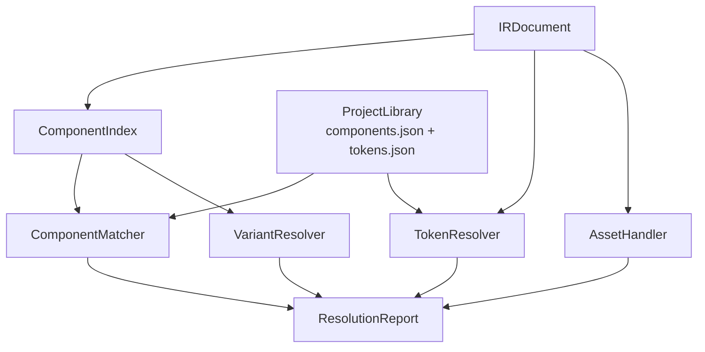
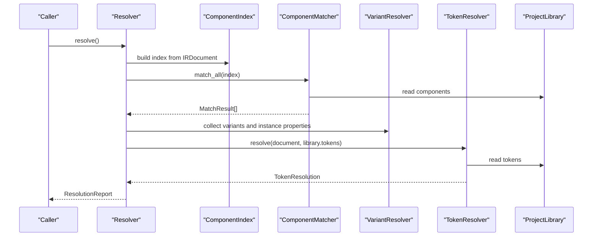
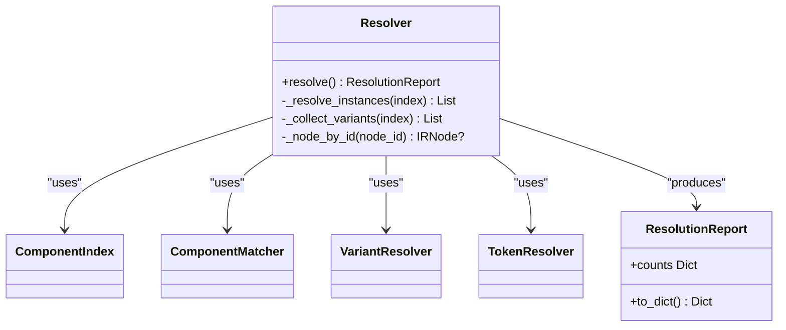
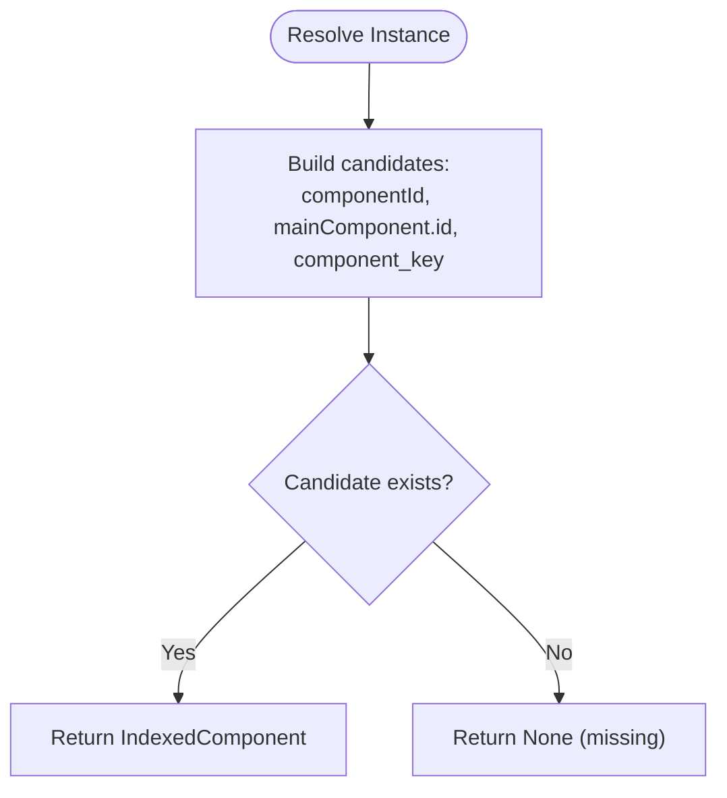
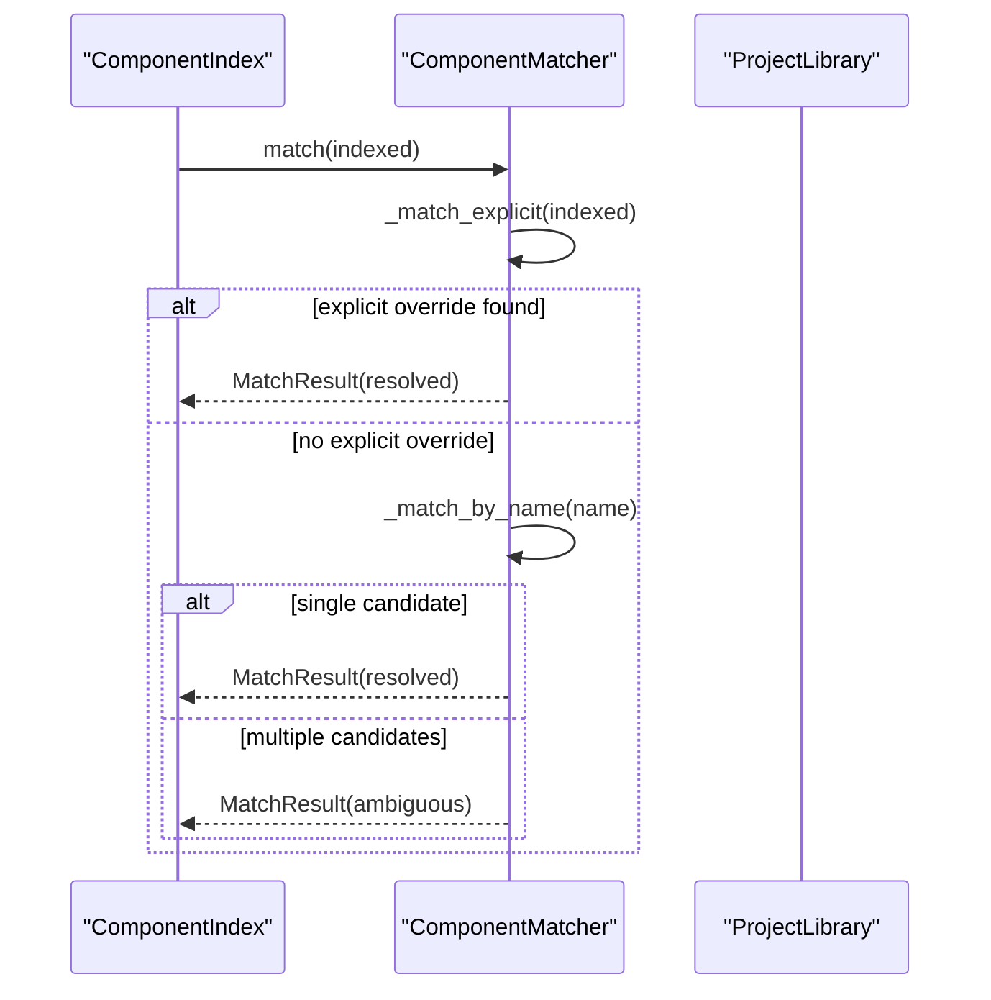
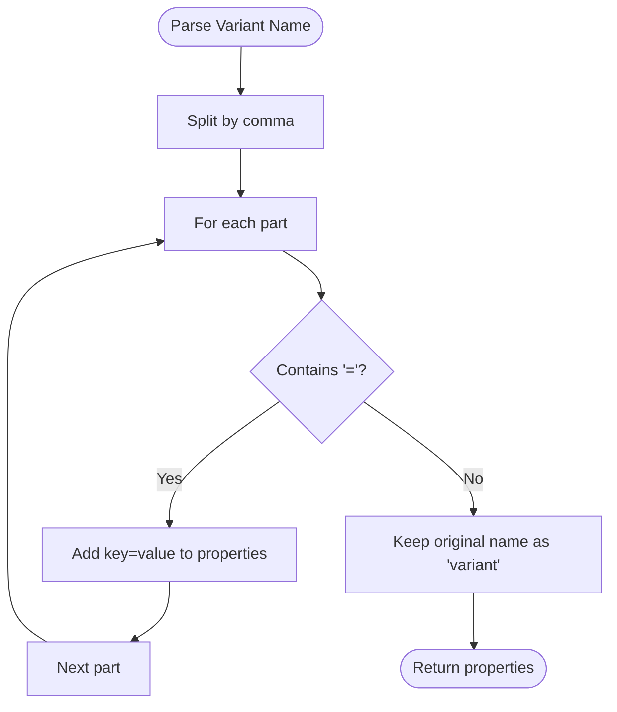
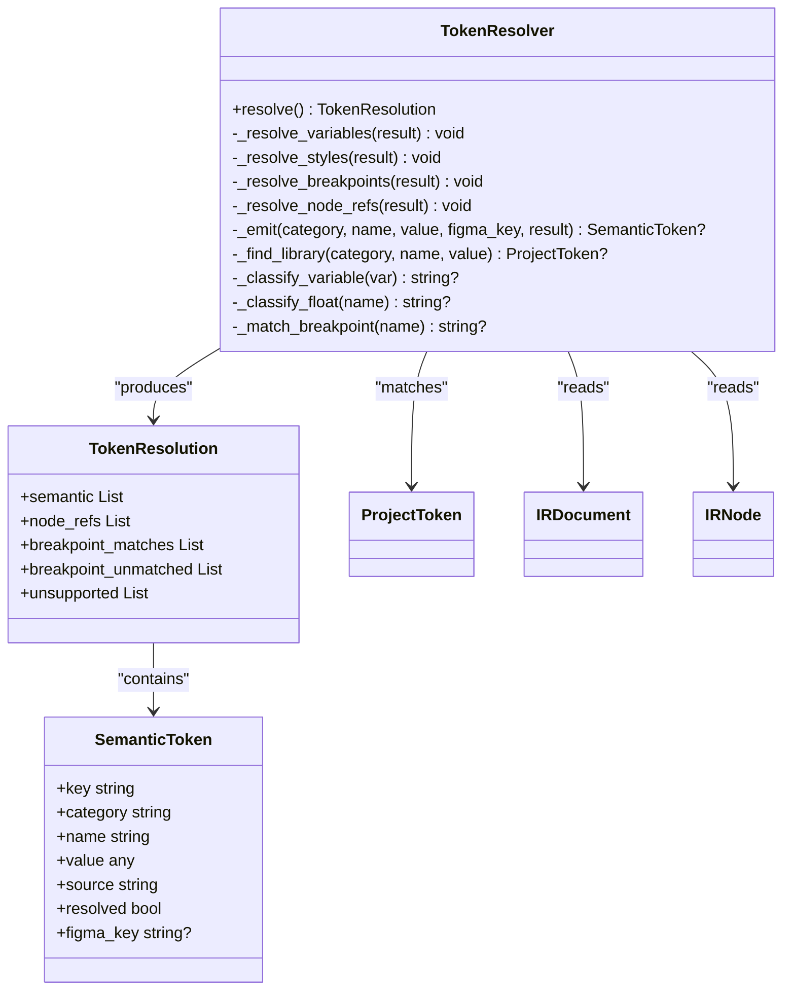
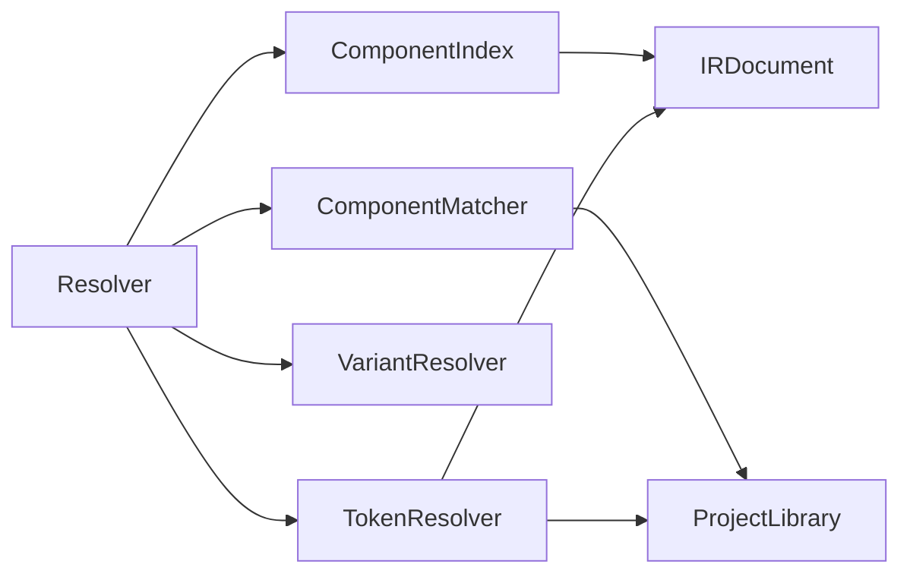

# Component Resolution System

<cite>
**Referenced Files in This Document**
- [resolver.py](file://plugin/figmaforge/core/resolver.py)
- [component_index.py](file://plugin/figmaforge/core/component_index.py)
- [matcher.py](file://plugin/figmaforge/core/matcher.py)
- [variant_resolver.py](file://plugin/figmaforge/core/variant_resolver.py)
- [token_resolver.py](file://plugin/figmaforge/core/token_resolver.py)
- [asset_handler.py](file://plugin/figmaforge/core/asset_handler.py)
- [library_types.py](file://plugin/figmaforge/core/library_types.py)
- [ir_types.py](file://plugin/figmaforge/core/ir_types.py)
- [components.json](file://plugin/figmaforge/library/components.json)
- [tokens.json](file://plugin/figmaforge/library/tokens.json)
- [test_resolution.py](file://plugin/figmaforge/tests/test_resolution.py)
- [test_tokens.py](file://plugin/figmaforge/tests/test_tokens.py)
- [test_components.py](file://plugin/figmaforge/tests/test_components.py)
</cite>

## Table of Contents
1. Introduction
2. Project Structure
3. Core Components
4. Architecture Overview
5. Detailed Component Analysis
6. Dependency Analysis
7. Performance Considerations
8. Troubleshooting Guide
9. Conclusion

## Introduction
This document explains the Component Resolution System that integrates Figma designs with a project’s existing component library, resolves design tokens from variables and styles, handles component variants and prop-based customization, and manages asset references. It covers how the resolver orchestrates indexing, matching, variant extraction, token resolution, and asset mapping to produce a deterministic, schema-validated report suitable for downstream code generation.

## Project Structure
The resolution system lives under plugin/figmaforge/core and is driven by an Intermediate Representation (IR) produced earlier in the pipeline. The key modules are:
- Resolver: orchestrates component/variant/instance/token resolution and produces a report
- ComponentIndex: indexes components and sets, tracks variants, and resolves instances
- Matcher: maps indexed components to existing project components using explicit keys or normalized names
- VariantResolver: extracts instance properties and parses variant definitions from component sets
- TokenResolver: resolves Figma variables/styles into semantic tokens and node-level token references
- AssetHandler: registers and validates image/URL references without performing downloads
- Library types and manifests: define the project’s existing components and tokens loaded from JSON

**Diagram sources**
- [resolver.py:80-109](file://plugin/figmaforge/core/resolver.py#L80-L109)
- [component_index.py:54-102](file://plugin/figmaforge/core/component_index.py#L54-L102)
- [matcher.py:51-128](file://plugin/figmaforge/core/matcher.py#L51-L128)
- [variant_resolver.py:44-101](file://plugin/figmaforge/core/variant_resolver.py#L44-L101)
- [token_resolver.py:124-146](file://plugin/figmaforge/core/token_resolver.py#L124-L146)
- [asset_handler.py:29-59](file://plugin/figmaforge/core/asset_handler.py#L29-L59)
- [library_types.py:147-216](file://plugin/figmaforge/core/library_types.py#L147-L216)

**Section sources**
- [resolver.py:1-161](file://plugin/figmaforge/core/resolver.py#L1-L161)
- [ir_types.py:724-784](file://plugin/figmaforge/core/ir_types.py#L724-L784)
- [library_types.py:181-216](file://plugin/figmaforge/core/library_types.py#L181-L216)

## Core Components
- Resolver: Builds a ComponentIndex, runs matching, collects variants and instances, resolves tokens, and returns a ResolutionReport with counts and detailed lists.
- ComponentIndex: Builds mappings by node id and file-level key, tracks component-set membership and default variants, and resolves instances deterministically.
- Matcher: Maps indexed components to project components via explicit figma_keys overrides or normalized name/alias matching; reports ambiguous matches explicitly instead of guessing.
- VariantResolver: Extracts instance properties and parses variant combinations from component set children; supports both Prop=Value parsing and fallback labels.
- TokenResolver: Resolves variables and styles into semantic tokens across seven categories, prefers existing library tokens, emits token references at node level, and reports unsupported tokens.
- AssetHandler: Registers asset URLs per node, marks downloaded assets with local paths and checksums, and lists pending assets.

**Section sources**
- [resolver.py:34-109](file://plugin/figmaforge/core/resolver.py#L34-L109)
- [component_index.py:31-102](file://plugin/figmaforge/core/component_index.py#L31-L102)
- [matcher.py:33-128](file://plugin/figmaforge/core/matcher.py#L33-L128)
- [variant_resolver.py:26-101](file://plugin/figmaforge/core/variant_resolver.py#L26-L101)
- [token_resolver.py:80-146](file://plugin/figmaforge/core/token_resolver.py#L80-L146)
- [asset_handler.py:19-59](file://plugin/figmaforge/core/asset_handler.py#L19-L59)

## Architecture Overview
The resolver coordinates four major sub-processes over the IR:
- Component indexing and matching against the project library
- Instance-to-component resolution and variant property extraction
- Semantic token resolution from variables and styles with reference emission
- Asset reference registration and validation

**Diagram sources**
- [resolver.py:80-109](file://plugin/figmaforge/core/resolver.py#L80-L109)
- [matcher.py:51-128](file://plugin/figmaforge/core/matcher.py#L51-L128)
- [token_resolver.py:124-146](file://plugin/figmaforge/core/token_resolver.py#L124-L146)
- [library_types.py:147-216](file://plugin/figmaforge/core/library_types.py#L147-L216)

## Detailed Component Analysis

### Resolver Orchestration
- Builds a ComponentIndex from the IRDocument
- Runs ComponentMatcher to map components to project library entries
- Collects variants and instance resolutions
- Invokes TokenResolver to normalize variables/styles into semantic tokens and node-level references
- Produces a ResolutionReport with counts, resolved/ambiguous/missing lists, instances, variants, and tokens

Key behaviors:
- Deterministic ordering and stable serialization for snapshot tests
- Explicit reporting of missing and ambiguous mappings
- No code generation occurs here; output is consumed by generators later

**Section sources**
- [resolver.py:80-109](file://plugin/figmaforge/core/resolver.py#L80-L109)
- [resolver.py:112-161](file://plugin/figmaforge/core/resolver.py#L112-L161)

#### Class Diagram: Resolver and Outputs

**Diagram sources**
- [resolver.py:34-109](file://plugin/figmaforge/core/resolver.py#L34-L109)

### Component Index and Instance Resolution
- Indexes all components and component-sets by node id and file-level key
- Tracks variant membership and default variants within component sets
- Resolves instances by trying componentId, mainComponent.id, and component_key in order
- Returns None when an instance references something not present in the document

Complex hierarchy handling:
- Variants are tracked under their parent set
- Default variant detection uses the set’s defaultVariant id
- Source metadata is preserved for traceability

**Section sources**
- [component_index.py:54-102](file://plugin/figmaforge/core/component_index.py#L54-L102)
- [component_index.py:105-162](file://plugin/figmaforge/core/component_index.py#L105-L162)

#### Flowchart: Instance Resolution

**Diagram sources**
- [component_index.py:82-102](file://plugin/figmaforge/core/component_index.py#L82-L102)

### Repository-Component Matching
- Priority order:
  1) Explicit override via figma_keys on project components
  2) Normalized name or alias match
- Outcomes:
  - resolved: exactly one match
  - ambiguous: multiple matches; reported explicitly
  - missing: no match; reported explicitly

Normalization:
- Uses deterministic normalization to treat separators and filler words consistently

**Section sources**
- [matcher.py:51-128](file://plugin/figmaforge/core/matcher.py#L51-L128)
- [library_types.py:46-69](file://plugin/figmaforge/core/library_types.py#L46-L69)

#### Sequence Diagram: Matching Flow

**Diagram sources**
- [matcher.py:72-128](file://plugin/figmaforge/core/matcher.py#L72-L128)

### Variant Resolver
- Extracts instance properties from raw componentProperties
- Parses variant combinations from component set child names using Prop=Value segments
- Falls back to a single variant label when no K=V segments exist
- Marks default variants based on the set’s defaultVariant id

Examples:
- Instance properties like Size, State, Label are captured
- Component set variants include parsed properties and defaults

**Section sources**
- [variant_resolver.py:44-101](file://plugin/figmaforge/core/variant_resolver.py#L44-L101)

#### Flowchart: Variant Name Parsing

**Diagram sources**
- [variant_resolver.py:83-101](file://plugin/figmaforge/core/variant_resolver.py#L83-L101)

### Token Resolution System
- Categories: color, typography, spacing, radius, shadow, opacity, breakpoint
- Sources:
  - Variables: classified by token_type or resolved_type; float variables classified by name fragments
  - Styles: mapped by token_type (FILL, TEXT, EFFECT) and matched by name to library tokens
  - Breakpoints: inferred from page/frame names using alias rules
- Rules:
  - Prefer existing library tokens by normalized name or value
  - Emit token references at node level rather than duplicating values
  - Report unsupported token types explicitly

Breakpoint matching:
- Uses alias table to map frame/page names to breakpoint sizes
- Matches longest alias to avoid ambiguity

Node-level references:
- bound_variables and style_refs are converted to token_ref entries
- Unresolved bindings include reasons

**Section sources**
- [token_resolver.py:124-146](file://plugin/figmaforge/core/token_resolver.py#L124-L146)
- [token_resolver.py:149-208](file://plugin/figmaforge/core/token_resolver.py#L149-L208)
- [token_resolver.py:210-247](file://plugin/figmaforge/core/token_resolver.py#L210-L247)
- [token_resolver.py:250-283](file://plugin/figmaforge/core/token_resolver.py#L250-L283)
- [token_resolver.py:285-374](file://plugin/figmaforge/core/token_resolver.py#L285-L374)

#### Class Diagram: Token Resolution

**Diagram sources**
- [token_resolver.py:80-146](file://plugin/figmaforge/core/token_resolver.py#L80-L146)
- [token_resolver.py:124-146](file://plugin/figmaforge/core/token_resolver.py#L124-L146)

### Asset Handler
- Registers asset URLs per node
- Marks assets as downloaded with local path and checksum
- Lists pending assets not yet downloaded
- Does not perform I/O; only manages mapping and validation

Usage pattern:
- Register URL when encountering image references
- Mark downloaded after fetching
- Iterate pending to schedule downloads

**Section sources**
- [asset_handler.py:19-59](file://plugin/figmaforge/core/asset_handler.py#L19-L59)

### Component Index System and Library Manifests
- ComponentIndex maintains mappings between design components and implementation components
- ProjectLibrary loads components.json and tokens.json
- Components have ids, names, aliases, figma_keys, props, and source paths
- Tokens have names, types, values, and sources

Example mappings:
- Button Set -> button-set
- Icon Slot -> icon-slot
- Card/CardContainer -> ambiguous if both match by name/alias

**Section sources**
- [component_index.py:54-102](file://plugin/figmaforge/core/component_index.py#L54-L102)
- [library_types.py:147-216](file://plugin/figmaforge/core/library_types.py#L147-L216)
- [components.json:1-47](file://plugin/figmaforge/library/components.json#L1-L47)
- [tokens.json:1-19](file://plugin/figmaforge/library/tokens.json#L1-L19)

## Dependency Analysis
- Resolver depends on ComponentIndex, ComponentMatcher, VariantResolver, TokenResolver, and ProjectLibrary
- ComponentIndex depends on IRDocument and IR types
- Matcher depends on ProjectLibrary and normalization utilities
- TokenResolver depends on IRDocument, IRNode, and ProjectToken
- AssetHandler is independent but used by higher layers for asset tracking

**Diagram sources**
- [resolver.py:80-109](file://plugin/figmaforge/core/resolver.py#L80-L109)
- [matcher.py:51-128](file://plugin/figmaforge/core/matcher.py#L51-L128)
- [token_resolver.py:124-146](file://plugin/figmaforge/core/token_resolver.py#L124-L146)
- [component_index.py:54-102](file://plugin/figmaforge/core/component_index.py#L54-L102)

**Section sources**
- [resolver.py:80-109](file://plugin/figmaforge/core/resolver.py#L80-L109)
- [library_types.py:181-216](file://plugin/figmaforge/core/library_types.py#L181-L216)

## Performance Considerations
- Indexing is O(N) over nodes for building component maps and variant tracking
- Matching is O(M) per indexed component against project components; normalization ensures exact matches
- Token resolution iterates variables, styles, breakpoints, and node refs once; lookups use dictionaries for O(1) average access
- AssetHandler operations are O(1) per register/mark/list call
- Large libraries benefit from preloaded ProjectLibrary and dictionary-based lookups
- Deterministic outputs reduce re-computation and enable caching at higher layers (e.g., caching IR or ResolutionReport)

[No sources needed since this section provides general guidance]

## Troubleshooting Guide
Common issues and how the system addresses them:
- Missing components:
  - Matcher reports status "missing" with reason "no existing project component matches"
  - Instances referencing absent components return None and are recorded as missing in the report
- Ambiguous matches:
  - When multiple project components match by normalized name/alias, matcher reports "ambiguous" and refuses to guess
- Unsupported tokens:
  - TokenResolver records unsupported variable/style types under unsupported with reasons
  - Node-level unresolved bindings include reasons indicating unresolved variable ids
- Breakpoint mismatches:
  - Frames/pages not matching alias rules appear in breakpoint_unmatched

Validation and diagnostics:
- ResolutionReport includes counts for quick health checks
- TokenResolution.node_refs indicate resolved/unresolved bindings
- Tests assert expected outcomes for resolved, ambiguous, missing, and unsupported cases

**Section sources**
- [matcher.py:72-128](file://plugin/figmaforge/core/matcher.py#L72-L128)
- [component_index.py:82-102](file://plugin/figmaforge/core/component_index.py#L82-L102)
- [token_resolver.py:149-208](file://plugin/figmaforge/core/token_resolver.py#L149-L208)
- [token_resolver.py:250-283](file://plugin/figmaforge/core/token_resolver.py#L250-L283)
- [test_resolution.py:31-108](file://plugin/figmaforge/tests/test_resolution.py#L31-L108)
- [test_tokens.py:33-119](file://plugin/figmaforge/tests/test_tokens.py#L33-L119)
- [test_components.py:33-148](file://plugin/figmaforge/tests/test_components.py#L33-L148)

## Conclusion
The Component Resolution System provides a deterministic, transparent bridge between Figma designs and a project’s implementation. It indexes components, matches them to existing library entries, extracts variants and instance properties, resolves tokens from variables and styles, and manages asset references. By preferring existing definitions, emitting references instead of duplicating values, and explicitly reporting ambiguous or missing mappings, it ensures reliability and maintainability for large component libraries. Downstream generators can consume the ResolutionReport to produce consistent, token-aware code.