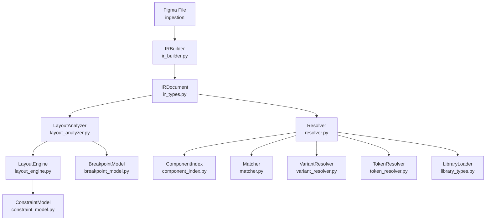
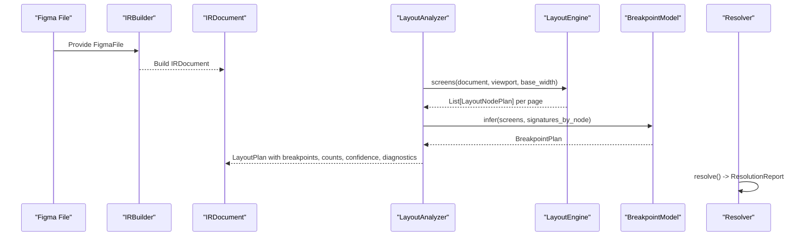
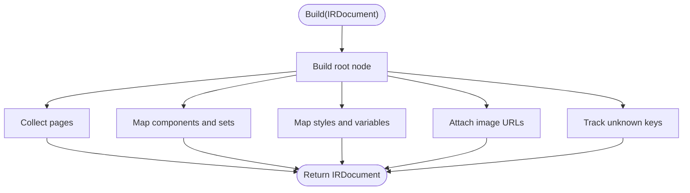
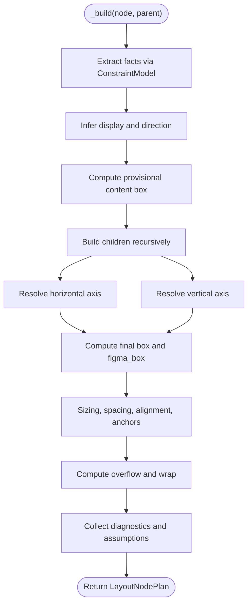
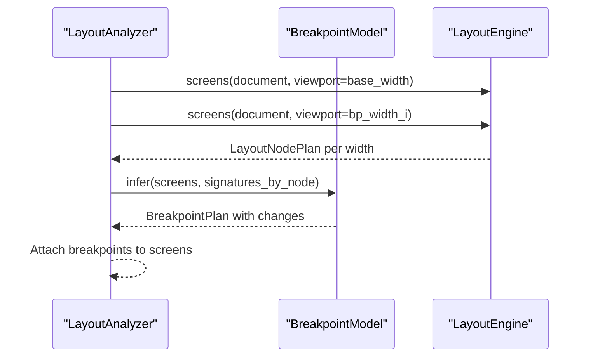
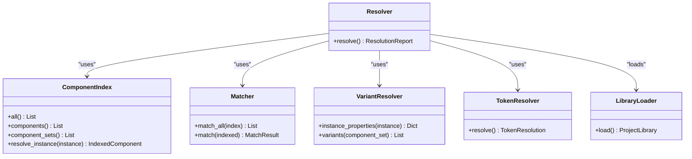
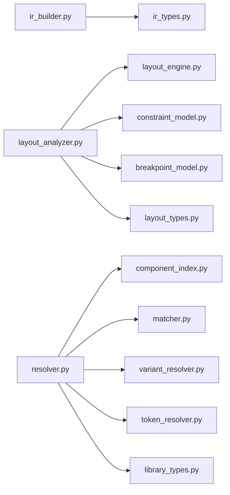

# Design Processing Pipeline

<cite>
**Referenced Files in This Document**
- [ir_builder.py](file://plugin/figmaforge/core/ir_builder.py)
- [ir_types.py](file://plugin/figmaforge/core/ir_types.py)
- [layout_analyzer.py](file://plugin/figmaforge/core/layout_analyzer.py)
- [layout_engine.py](file://plugin/figmaforge/core/layout_engine.py)
- [layout_types.py](file://plugin/figmaforge/core/layout_types.py)
- [constraint_model.py](file://plugin/figmaforge/core/constraint_model.py)
- [breakpoint_model.py](file://plugin/figmaforge/core/breakpoint_model.py)
- [resolver.py](file://plugin/figmaforge/core/resolver.py)
- [component_index.py](file://plugin/figmaforge/core/component_index.py)
- [matcher.py](file://plugin/figmaforge/core/matcher.py)
- [variant_resolver.py](file://plugin/figmaforge/core/variant_resolver.py)
- [token_resolver.py](file://plugin/figmaforge/core/token_resolver.py)
- [library_types.py](file://plugin/figmaforge/core/library_types.py)
- [README.md](file://README.md)
</cite>

## Table of Contents
1. [Introduction](#introduction)
2. [Project Structure](#project-structure)
3. [Core Components](#core-components)
4. [Architecture Overview](#architecture-overview)
5. [Detailed Component Analysis](#detailed-component-analysis)
6. [Dependency Analysis](#dependency-analysis)
7. [Performance Considerations](#performance-considerations)
8. [Troubleshooting Guide](#troubleshooting-guide)
9. [Conclusion](#conclusion)

## Introduction
This document explains FigmaForge’s design processing pipeline from normalized Figma input to responsive layout plans and component resolution. It focuses on:
- The Design IR Builder that normalizes Figma API responses into a framework-neutral intermediate representation.
- The Layout Analysis Engine that performs responsive constraint solving with breakpoint management.
- The Component Resolution System that integrates libraries, resolves tokens, handles variants, and manages assets.
It also provides concrete examples of how design files flow through the system, describes constraint-solving algorithms, and outlines performance and debugging techniques for complex designs.

## Project Structure
The pipeline is implemented as a sequence of composable modules under plugin/figmaforge/core:
- IR building: ir_builder.py + ir_types.py
- Layout analysis: layout_analyzer.py orchestrating layout_engine.py, constraint_model.py, breakpoint_model.py, and layout_types.py
- Resolution: resolver.py coordinating component_index.py, matcher.py, variant_resolver.py, token_resolver.py, and library_types.py

**Diagram sources**
- [ir_builder.py:156-207](file://plugin/figmaforge/core/ir_builder.py#L156-L207)
- [ir_types.py:724-764](file://plugin/figmaforge/core/ir_types.py#L724-L764)
- [layout_analyzer.py:76-120](file://plugin/figmaforge/core/layout_analyzer.py#L76-L120)
- [layout_engine.py:251-271](file://plugin/figmaforge/core/layout_engine.py#L251-L271)
- [constraint_model.py:108-127](file://plugin/figmaforge/core/constraint_model.py#L108-L127)
- [breakpoint_model.py:90-114](file://plugin/figmaforge/core/breakpoint_model.py#L90-L114)
- [resolver.py:88-109](file://plugin/figmaforge/core/resolver.py#L88-L109)
- [component_index.py:54-102](file://plugin/figmaforge/core/component_index.py#L54-L102)
- [matcher.py:51-128](file://plugin/figmaforge/core/matcher.py#L51-L128)
- [variant_resolver.py:44-101](file://plugin/figmaforge/core/variant_resolver.py#L44-L101)
- [token_resolver.py:124-146](file://plugin/figmaforge/core/token_resolver.py#L124-L146)
- [library_types.py:181-216](file://plugin/figmaforge/core/library_types.py#L181-L216)

**Section sources**
- [README.md:86-100](file://README.md#L86-L100)

## Core Components
- IRBuilder converts typed ingestion models (FigmaFile/Node) into a normalized IRDocument tree while preserving raw payloads and unknown keys for debugging.
- LayoutAnalyzer orchestrates screen generation, breakpoint inference, confidence scoring, diagnostics, and constraint reporting.
- LayoutEngine infers display mode, sizing, spacing, alignment, anchoring, text wrapping, overflow, and nested child placement per viewport.
- ConstraintModel extracts constraints per axis, detects contradictions and underdetermined bounds, and provides pure arithmetic primitives via BoxSolver.
- BreakpointModel builds a numeric breakpoint ladder from project tokens and diffs measured layouts across widths to emit responsive changes.
- Resolver coordinates component indexing, matching against the project library, instance-to-component resolution, variant extraction, and semantic token resolution.
- Library types define deterministic normalization utilities and load project components/tokens from JSON manifests.

**Section sources**
- [ir_builder.py:1-18](file://plugin/figmaforge/core/ir_builder.py#L1-L18)
- [ir_builder.py:156-207](file://plugin/figmaforge/core/ir_builder.py#L156-L207)
- [layout_analyzer.py:64-120](file://plugin/figmaforge/core/layout_analyzer.py#L64-L120)
- [layout_engine.py:236-390](file://plugin/figmaforge/core/layout_engine.py#L236-L390)
- [constraint_model.py:108-127](file://plugin/figmaforge/core/constraint_model.py#L108-L127)
- [breakpoint_model.py:36-114](file://plugin/figmaforge/core/breakpoint_model.py#L36-L114)
- [resolver.py:80-109](file://plugin/figmaforge/core/resolver.py#L80-L109)
- [library_types.py:181-216](file://plugin/figmaforge/core/library_types.py#L181-L216)

## Architecture Overview
The pipeline transforms raw Figma data into actionable, framework-neutral outputs:
1. IR Building: Normalizes nodes, styles, typography, tokens, assets, and prototypes into IRDocument.
2. Layout Analysis: Computes per-page screens at multiple viewports; infers breakpoints by diffing node signatures; aggregates confidence and diagnostics.
3. Resolution: Maps Figma components and instances to existing project components, extracts variants, and resolves tokens to semantic keys.

**Diagram sources**
- [ir_builder.py:156-207](file://plugin/figmaforge/core/ir_builder.py#L156-L207)
- [layout_analyzer.py:76-120](file://plugin/figmaforge/core/layout_analyzer.py#L76-L120)
- [layout_engine.py:251-271](file://plugin/figmaforge/core/layout_engine.py#L251-L271)
- [breakpoint_model.py:90-114](file://plugin/figmaforge/core/breakpoint_model.py#L90-L114)
- [resolver.py:88-109](file://plugin/figmaforge/core/resolver.py#L88-L109)

## Detailed Component Analysis

### Design IR Builder
Responsibilities:
- Normalize Figma nodes into IRNode trees with consistent fields for layout, style, typography, tokens, assets, prototype links, and annotations.
- Preserve original raw payloads and track unmapped keys for transparency.
- Build file-level maps for components, component sets, styles, variables, and assets.

Key behaviors:
- Consumes known keys and preserves unknowns via IRNode.unknown.
- Converts auto-layout modes to normalized direction and sizing hints.
- Extracts fills, borders, shadows, blurs, and gradient stops into typed structures.
- Captures bound variables and style references as token refs.
- Builds responsive constraints from Figma constraints and auto-layout sizing.

**Diagram sources**
- [ir_builder.py:156-207](file://plugin/figmaforge/core/ir_builder.py#L156-L207)
- [ir_builder.py:219-272](file://plugin/figmaforge/core/ir_builder.py#L219-L272)

**Section sources**
- [ir_builder.py:1-18](file://plugin/figmaforge/core/ir_builder.py#L1-L18)
- [ir_builder.py:156-207](file://plugin/figmaforge/core/ir_builder.py#L156-L207)
- [ir_builder.py:219-272](file://plugin/figmaforge/core/ir_builder.py#L219-L272)
- [ir_types.py:619-764](file://plugin/figmaforge/core/ir_types.py#L619-L764)

### Layout Analysis Engine
Responsibilities:
- Generate per-page screen plans for a given viewport and base width.
- Infer display mode (flex/grid/absolute), sizing per axis, spacing, alignment, anchors, text wrapping, and overflow.
- Compute child placement within solved content boxes.
- Attach diagnostics, assumptions, and confidence scores.

Algorithm highlights:
- Provisional content box computed from non-hug axes first.
- Children built against provisional box; hug axes resolved after children are measurable.
- Anchoring uses Figma constraints and offsets to compute parent-relative positions.
- Text measurement uses heuristics and flags approximate results.

**Diagram sources**
- [layout_engine.py:274-390](file://plugin/figmaforge/core/layout_engine.py#L274-L390)
- [constraint_model.py:108-127](file://plugin/figmaforge/core/constraint_model.py#L108-L127)

**Section sources**
- [layout_engine.py:236-390](file://plugin/figmaforge/core/layout_engine.py#L236-L390)
- [layout_types.py:412-522](file://plugin/figmaforge/core/layout_types.py#L412-L522)

### Responsive Constraint Solving and Breakpoints
Responsibilities:
- Build a breakpoint ladder from project tokens or defaults.
- Measure layout signatures at each width and diff consecutive runs to detect responsive changes.
- Attach breakpoint aliases to changes and report nodes with no change.

Key details:
- Signatures include width, height, sizing modes, wrap behavior, text lines, and overflow.
- Changes are emitted only when evidence shows a difference between widths.
- Analyzer computes aggregate confidence and diagnostics across all screens.

**Diagram sources**
- [layout_analyzer.py:76-120](file://plugin/figmaforge/core/layout_analyzer.py#L76-L120)
- [breakpoint_model.py:90-114](file://plugin/figmaforge/core/breakpoint_model.py#L90-L114)

**Section sources**
- [layout_analyzer.py:122-146](file://plugin/figmaforge/core/layout_analyzer.py#L122-L146)
- [breakpoint_model.py:36-114](file://plugin/figmaforge/core/breakpoint_model.py#L36-L114)
- [layout_types.py:358-405](file://plugin/figmaforge/core/layout_types.py#L358-L405)

### Component Resolution System
Responsibilities:
- Index components and component sets from the IR.
- Match Figma components to existing project components using explicit overrides and normalized name/alias matching.
- Resolve instances to their source components and collect variant properties.
- Resolve semantic tokens from variables and styles, preferring existing library tokens.

Key behaviors:
- ComponentIndex tracks variants and default variants.
- Matcher refuses ambiguous matches and reports missing mappings explicitly.
- TokenResolver classifies variables/styles into categories and emits references rather than duplicated values.
- VariantResolver parses variant names and instance property definitions deterministically.

**Diagram sources**
- [resolver.py:80-109](file://plugin/figmaforge/core/resolver.py#L80-L109)
- [component_index.py:54-102](file://plugin/figmaforge/core/component_index.py#L54-L102)
- [matcher.py:51-128](file://plugin/figmaforge/core/matcher.py#L51-L128)
- [variant_resolver.py:44-101](file://plugin/figmaforge/core/variant_resolver.py#L44-L101)
- [token_resolver.py:124-146](file://plugin/figmaforge/core/token_resolver.py#L124-L146)
- [library_types.py:181-216](file://plugin/figmaforge/core/library_types.py#L181-L216)

**Section sources**
- [resolver.py:80-109](file://plugin/figmaforge/core/resolver.py#L80-L109)
- [component_index.py:54-102](file://plugin/figmaforge/core/component_index.py#L54-L102)
- [matcher.py:51-128](file://plugin/figmaforge/core/matcher.py#L51-L128)
- [variant_resolver.py:44-101](file://plugin/figmaforge/core/variant_resolver.py#L44-L101)
- [token_resolver.py:124-146](file://plugin/figmaforge/core/token_resolver.py#L124-L146)
- [library_types.py:181-216](file://plugin/figmaforge/core/library_types.py#L181-L216)

## Dependency Analysis
High-level dependencies:
- IRBuilder depends on IR types and Figma ingestion types to produce IRDocument.
- LayoutAnalyzer depends on LayoutEngine, ConstraintModel, BreakpointModel, and Layout types.
- Resolver depends on ComponentIndex, Matcher, VariantResolver, TokenResolver, and Library types.

**Diagram sources**
- [ir_builder.py:156-207](file://plugin/figmaforge/core/ir_builder.py#L156-L207)
- [layout_analyzer.py:76-120](file://plugin/figmaforge/core/layout_analyzer.py#L76-L120)
- [resolver.py:88-109](file://plugin/figmaforge/core/resolver.py#L88-L109)

**Section sources**
- [ir_builder.py:156-207](file://plugin/figmaforge/core/ir_builder.py#L156-L207)
- [layout_analyzer.py:76-120](file://plugin/figmaforge/core/layout_analyzer.py#L76-L120)
- [resolver.py:88-109](file://plugin/figmaforge/core/resolver.py#L88-L109)

## Performance Considerations
- Deterministic and pure transformations: IRBuilder and resolvers avoid I/O and network calls during processing, enabling stable snapshots and predictable performance.
- Two-pass layout: The engine first resolves cheap axes to build a provisional content box, then measures children before resolving hug axes, reducing recomputation.
- Evidence-based breakpoints: BreakpointModel diffs measured signatures across widths, emitting changes only when there is observable difference, avoiding unnecessary work.
- Heuristic text measurement: TextMeasurer uses documented constants and flags approximate measurements; this avoids expensive font metrics while remaining transparent.
- Confidence scoring: Per-node penalties for assumptions help identify potentially expensive or uncertain computations early.

[No sources needed since this section provides general guidance]

## Troubleshooting Guide
Common issues and where to inspect them:
- Unsupported or unmapped properties: Use IRBuilder.unsupported_properties to list node IDs and unmapped raw keys; these are preserved in IRNode.unknown.
- Contradictions and underdetermined bounds: Inspect ConstraintReport for contradictions and underdetermined issues; LayoutAnalyzer aggregates these into diagnostics.
- Low confidence nodes: LayoutAnalyzer._score_confidence penalizes assumptions like absolute without anchors, fill/percent in hug containers, and grid hug approximations.
- Breakpoint mismatches: Review BreakpointPlan.changes and no_change lists to see which nodes changed across widths and why.
- Token resolution gaps: TokenResolution.node_refs show unresolved variable/style references; unsupported tokens are listed explicitly.

Practical steps:
- Run LayoutAnalyzer.analyze to get a LayoutPlan with diagnostics and confidence.
- Inspect IRDocument.raw and IRNode.unknown for unexpected Figma fields.
- Check ResolutionReport.tokens for unresolved references and unsupported token types.
- Validate library manifest loading and ensure breakpoint tokens exist if custom breakpoints are expected.

**Section sources**
- [ir_builder.py:209-216](file://plugin/figmaforge/core/ir_builder.py#L209-L216)
- [layout_analyzer.py:179-235](file://plugin/figmaforge/core/layout_analyzer.py#L179-L235)
- [constraint_model.py:183-288](file://plugin/figmaforge/core/constraint_model.py#L183-L288)
- [breakpoint_model.py:90-114](file://plugin/figmaforge/core/breakpoint_model.py#L90-L114)
- [token_resolver.py:140-146](file://plugin/figmaforge/core/token_resolver.py#L140-L146)

## Conclusion
FigmaForge’s design processing pipeline delivers a robust, deterministic path from Figma designs to framework-neutral layout plans and component resolutions. The IR Builder ensures fidelity and transparency, the Layout Analysis Engine solves constraints with honesty about assumptions, and the Component Resolution System integrates libraries and tokens without duplication. Together, they provide a clear, debuggable foundation for generating production-ready UI artifacts.

[No sources needed since this section summarizes without analyzing specific files]