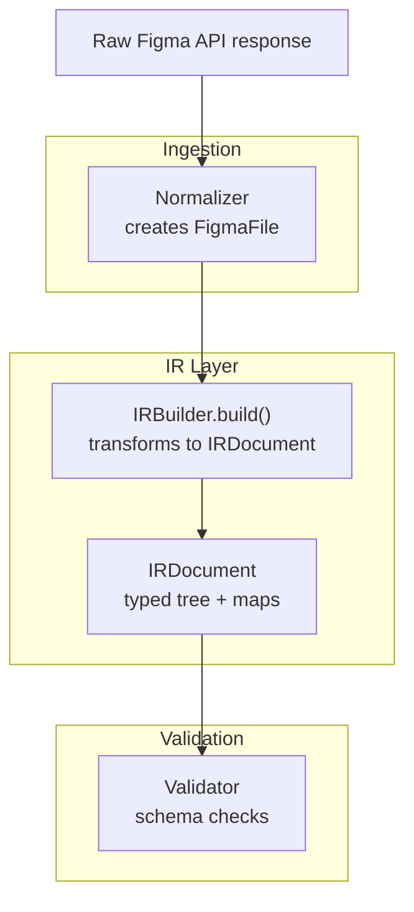
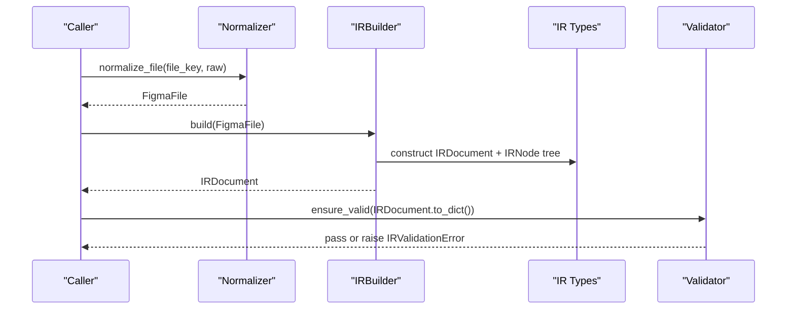
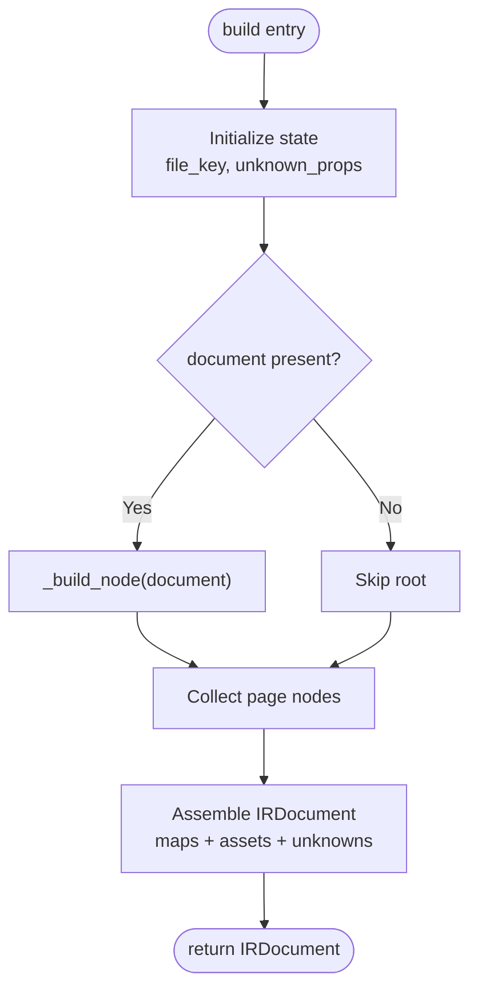
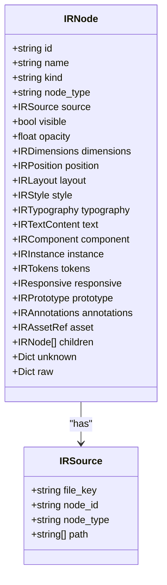
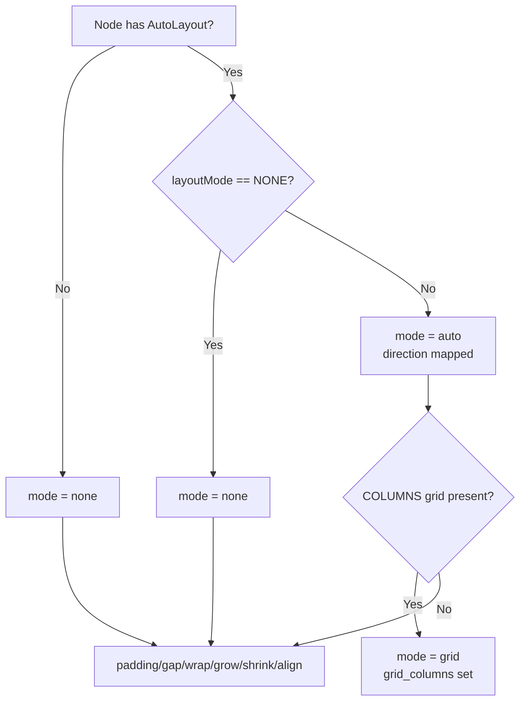
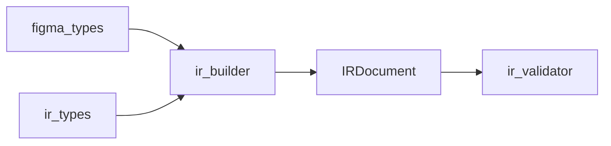

# Figma IR Builder

<cite>
**Referenced Files in This Document**
- [ir_builder.py](file://plugin/figmaforge/core/ir_builder.py)
- [ir_types.py](file://plugin/figmaforge/core/ir_types.py)
- [figma_types.py](file://plugin/figmaforge/core/figma_types.py)
- [normalizer.py](file://plugin/figmaforge/core/normalizer.py)
- [ir_validator.py](file://plugin/figmaforge/core/ir_validator.py)
- [test_ir.py](file://plugin/figmaforge/tests/test_ir.py)
- [file.json](file://plugin/figmaforge/fixtures/figma/file.json)
- [images.json](file://plugin/figmaforge/fixtures/figma/images.json)
</cite>

## Table of Contents
1. [Introduction](#introduction)
2. [Project Structure](#project-structure)
3. [Core Components](#core-components)
4. [Architecture Overview](#architecture-overview)
5. [Detailed Component Analysis](#detailed-component-analysis)
6. [Dependency Analysis](#dependency-analysis)
7. [Performance Considerations](#performance-considerations)
8. [Troubleshooting Guide](#troubleshooting-guide)
9. [Conclusion](#conclusion)
10. [Appendices](#appendices)

## Introduction
This document explains the Figma IR Builder component that normalizes Figma API responses into a framework-neutral intermediate representation (IR). It focuses on the IRBuilder class and its build method, which transforms normalized FigmaFile objects into IRDocument trees. The documentation covers node type mapping, property extraction from raw Figma data, preservation of unknown properties for debugging, handling of frames/components/instances, layout modes (auto-layout and grid), typography, styles, fills, borders, effects, assets, and token binding. It also documents the CONSUMED_NODE_KEYS and CONSUMED_FILE_KEYS constants that define which raw properties are mapped to typed IR fields, as well as error handling, validation rules, and performance considerations for large design files.

## Project Structure
The IR Builder lives in the plugin core and depends on:
- Ingestion types (FigmaFile, Node, Paint, Effect, etc.)
- IR types (IRDocument, IRNode, IRLayout, IRTypography, etc.)
- A JSON schema validator for post-build validation
- Test fixtures that demonstrate end-to-end normalization

**Diagram sources**
- [normalizer.py:35-52](file://plugin/figmaforge/core/normalizer.py#L35-L52)
- [ir_builder.py:156-207](file://plugin/figmaforge/core/ir_builder.py#L156-L207)
- [ir_types.py:725-764](file://plugin/figmaforge/core/ir_types.py#L725-L764)
- [ir_validator.py:157-183](file://plugin/figmaforge/core/ir_validator.py#L157-L183)

**Section sources**
- [normalizer.py:1-99](file://plugin/figmaforge/core/normalizer.py#L1-L99)
- [ir_builder.py:1-207](file://plugin/figmaforge/core/ir_builder.py#L1-L207)
- [ir_types.py:1-784](file://plugin/figmaforge/core/ir_types.py#L1-L784)
- [ir_validator.py:1-183](file://plugin/figmaforge/core/ir_validator.py#L1-L183)

## Core Components
- IRBuilder: Builds an IRDocument from a FigmaFile, recursively building IRNode trees and populating file-level maps (components, component sets, styles, variables, assets).
- IR types: Define the normalized shapes for nodes, layouts, typography, styles, tokens, assets, prototypes, annotations, and source metadata.
- Figma types: Define the ingestion-layer models used by IRBuilder (Node, FigmaFile, Paint, Effect, AutoLayout, etc.).
- Validator: Provides schema-based validation for serialized IR output.

Key responsibilities:
- Map Figma node types to normalized kinds.
- Extract layout, dimensions, position, style, typography, text, components, instances, tokens, responsive constraints, prototype links, annotations, and assets.
- Preserve unknown raw keys per node and per file for debugging.
- Provide unsupported_properties reporting.

**Section sources**
- [ir_builder.py:143-216](file://plugin/figmaforge/core/ir_builder.py#L143-L216)
- [ir_types.py:57-95](file://plugin/figmaforge/core/ir_types.py#L57-L95)
- [figma_types.py:320-428](file://plugin/figmaforge/core/figma_types.py#L320-L428)
- [ir_validator.py:35-183](file://plugin/figmaforge/core/ir_validator.py#L35-L183)

## Architecture Overview
The normalization pipeline is pure and deterministic: it reads already-normalized ingestion objects plus their retained raw dicts and produces a typed IRDocument without any I/O or network calls.

**Diagram sources**
- [normalizer.py:42-52](file://plugin/figmaforge/core/normalizer.py#L42-L52)
- [ir_builder.py:156-207](file://plugin/figmaforge/core/ir_builder.py#L156-L207)
- [ir_types.py:725-764](file://plugin/figmaforge/core/ir_types.py#L725-L764)
- [ir_validator.py:172-183](file://plugin/figmaforge/core/ir_validator.py#L172-L183)

## Detailed Component Analysis

### IRBuilder and build()
- Entry point: build(figma_file) constructs IRDocument with schema version, file key, name, source, root, pages, and maps for components, component sets, styles, variables, assets, prototype start node, unknowns, and raw payload.
- Root traversal: If a document exists, _build_node is called to create the root IRNode; page nodes are collected from children where kind equals page.
- Unknown tracking: For each node, unknown raw keys not in CONSUMED_NODE_KEYS are recorded under IRNode.unknown and aggregated via unsupported_properties().

**Diagram sources**
- [ir_builder.py:156-207](file://plugin/figmaforge/core/ir_builder.py#L156-L207)

**Section sources**
- [ir_builder.py:156-207](file://plugin/figmaforge/core/ir_builder.py#L156-L207)

### Node Type Mapping
- Maps raw Figma node.type to normalized kind using KIND_BY_TYPE; unknown types fall back to generic "node" while preserving original node_type.
- Used when constructing IRNode.kind during _build_node.

**Diagram sources**
- [ir_types.py:619-696](file://plugin/figmaforge/core/ir_types.py#L619-L696)
- [ir_types.py:596-612](file://plugin/figmaforge/core/ir_types.py#L596-L612)

**Section sources**
- [ir_types.py:57-95](file://plugin/figmaforge/core/ir_types.py#L57-L95)
- [ir_builder.py:219-272](file://plugin/figmaforge/core/ir_builder.py#L219-L272)

### Property Extraction and Unknown Preservation
- CONSUMED_NODE_KEYS defines all raw node keys that are explicitly mapped into typed IR fields. Any other keys present in the raw node dict are preserved under IRNode.unknown and surfaced via unsupported_properties().
- CONSUMED_FILE_KEYS defines file-level keys mapped into IRDocument fields; everything else goes to IRDocument.unknown.

Examples of consumed keys include:
- Layout: layoutMode, layoutSizingHorizontal, layoutSizingVertical, primaryAxisAlignItems, counterAxisAlignItems, primaryAxisSizingMode, counterAxisSizingMode, paddingTop, paddingRight, paddingBottom, paddingLeft, itemSpacing, layoutWrap, layoutGrow, layoutShrink, layoutAlign, layoutGrids
- Dimensions/constraints: minWidth, maxWidth, minHeight, maxHeight
- Style: cornerRadius, rectangleCornerRadii, strokeWeight, strokeAlign, strokeStyle
- Text: characters, style, textAutoResize, textAlignHorizontal, textAlignVertical
- Components/instances: componentId, mainComponent
- Tokens/annotations/links: boundVariables, styles, annotation, url, interactions

Unknown preservation:
- Each node’s unknown dict contains un-mapped raw keys.
- File-level unknowns are captured similarly.
- unsupported_properties() returns a map from node_id to sorted lists of unmapped keys.

**Section sources**
- [ir_builder.py:66-100](file://plugin/figmaforge/core/ir_builder.py#L66-L100)
- [ir_builder.py:219-231](file://plugin/figmaforge/core/ir_builder.py#L219-L231)
- [ir_builder.py:593-598](file://plugin/figmaforge/core/ir_builder.py#L593-L598)

### Layout Modes: Auto-Layout and Grid
- Auto-layout: When auto.layout_mode != "NONE", IRLayout.mode becomes "auto". Direction is mapped from HORIZONTAL -> row, VERTICAL -> column. Padding, gap, wrap, grow/shrink, align-self, sizing modes are extracted.
- Grid: If a COLUMNS layoutGrid is present and the node is not auto-layout, IRLayout.mode becomes "grid" and grid_columns captures count and gutter.

**Diagram sources**
- [ir_builder.py:275-316](file://plugin/figmaforge/core/ir_builder.py#L275-L316)

**Section sources**
- [ir_builder.py:275-316](file://plugin/figmaforge/core/ir_builder.py#L275-L316)

### Positioning and Dimensions
- Position mode is "auto" if inside an auto-layout parent; otherwise "absolute". Absolute coordinates come from absoluteBoundingBox; left/top are set when not in auto mode.
- Dimensions capture width/height from bounding box, min/max constraints, and sizing modes from auto-layout.

**Section sources**
- [ir_builder.py:318-342](file://plugin/figmaforge/core/ir_builder.py#L318-L342)

### Typography and Text Content
- Typography extracts font family, postscript name, weight, size, line height, letter spacing, text case, decoration, horizontal/vertical alignment, auto resize, and token refs for bound variable properties (fontSize, fontFamily, fontWeight, lineHeight, letterSpacing).
- Text content includes characters and hyperlink (URL or file link).

**Section sources**
- [ir_builder.py:414-448](file://plugin/figmaforge/core/ir_builder.py#L414-L448)
- [ir_types.py:382-427](file://plugin/figmaforge/core/ir_types.py#L382-L427)

### Styles: Fills, Borders, Effects
- Fills: Paint.type maps to fill kind (solid, image, gradient). Gradient stops are normalized with positions and colors. Image/video paints carry image_ref and scale/blend modes.
- Borders: Strokes become IRBorder with color, weight, visibility, alignment, and style.
- Effects: Drop shadows and inner shadows become IRShadow; layer/background blur become IRBlur.

**Section sources**
- [ir_builder.py:344-412](file://plugin/figmaforge/core/ir_builder.py#L344-L412)
- [ir_types.py:154-261](file://plugin/figmaforge/core/ir_types.py#L154-L261)

### Components and Instances
- Components: Nodes of type COMPONENT or COMPONENT_SET produce IRComponent entries with key, name, kind, node_id, description, and documentation links.
- Instances: INSTANCE nodes produce IRInstance with component_id, main_component_id, and main_component_key resolved from mainComponent.

**Section sources**
- [ir_builder.py:450-469](file://plugin/figmaforge/core/ir_builder.py#L450-L469)
- [ir_types.py:430-467](file://plugin/figmaforge/core/ir_types.py#L430-L467)

### Tokens and Variables
- Tokens: Bound variables and style references are collected into IRTokens with refs, bound_variables, and style_refs.
- Variables: File-level variables map to IRToken entries with kind, key, name, token_type, value, and resolved_type.

**Section sources**
- [ir_builder.py:471-590](file://plugin/figmaforge/core/ir_builder.py#L471-L590)
- [ir_types.py:470-525](file://plugin/figmaforge/core/ir_types.py#L470-L525)

### Assets
- Asset references are attached when either a paint carries an image_ref or the images map provides a URL keyed by node_id. IRAssetRef stores node_id, url, and image_ref.

**Section sources**
- [ir_builder.py:539-548](file://plugin/figmaforge/core/ir_builder.py#L539-L548)
- [ir_types.py:578-593](file://plugin/figmaforge/core/ir_types.py#L578-L593)

### Prototype Links and Interactions
- Prototype collects url, links (from text hyperlinks), and interactions parsed from raw interactions list.

**Section sources**
- [ir_builder.py:503-527](file://plugin/figmaforge/core/ir_builder.py#L503-L527)
- [ir_types.py:528-561](file://plugin/figmaforge/core/ir_types.py#L528-L561)

### Annotations and Developer Metadata
- Annotations capture annotation strings and developer metadata keys like devStatus, devId, figmaDevMode.

**Section sources**
- [ir_builder.py:529-537](file://plugin/figmaforge/core/ir_builder.py#L529-L537)
- [ir_types.py:564-575](file://plugin/figmaforge/core/ir_types.py#L564-L575)

### Concrete Example: Processing a Design File
Using the fixture file.json and images.json:
- The Normalizer creates a FigmaFile from the raw file response.
- IRBuilder.build constructs an IRDocument with root and pages, including frames, groups, vectors, text, components, and instances.
- Auto-layout card frame gets mode "auto", direction "column", padding, gap, and sizing modes.
- Text node "Click me" gets typography (font family Inter, size 16, line height 24) and a hyperlink.
- Instance "Primary Button" gets instance references to component "1:100".
- Assets map attaches URLs for nodes "3:4" and "2:3".
- Unknown property "backgroundColor" on the card frame is preserved under unknown and reported by unsupported_properties.

These behaviors are validated by unit tests that assert kinds, values, relationships, serialization determinism, and schema validation.

**Section sources**
- [test_ir.py:37-43](file://plugin/figmaforge/tests/test_ir.py#L37-L43)
- [test_ir.py:55-245](file://plugin/figmaforge/tests/test_ir.py#L55-L245)
- [file.json:1-200](file://plugin/figmaforge/fixtures/figma/file.json#L1-L200)
- [images.json:1-14](file://plugin/figmaforge/fixtures/figma/images.json#L1-L14)

## Dependency Analysis
The IR Builder depends on:
- Ingestion models (figma_types) for structured access to Figma data and raw payloads.
- IR models (ir_types) for normalized output structures.
- Validator (ir_validator) for schema enforcement of serialized IR.

**Diagram sources**
- [ir_builder.py:25-62](file://plugin/figmaforge/core/ir_builder.py#L25-L62)
- [ir_types.py:725-764](file://plugin/figmaforge/core/ir_types.py#L725-L764)
- [ir_validator.py:157-183](file://plugin/figmaforge/core/ir_validator.py#L157-L183)

**Section sources**
- [ir_builder.py:25-62](file://plugin/figmaforge/core/ir_builder.py#L25-L62)
- [ir_types.py:725-764](file://plugin/figmaforge/core/ir_types.py#L725-L764)
- [ir_validator.py:157-183](file://plugin/figmaforge/core/ir_validator.py#L157-L183)

## Performance Considerations
- Pure transformation: IRBuilder performs no I/O or network calls; it operates only on in-memory structures, making it suitable for batch processing.
- Linear traversal: Building the IRDocument traverses the node tree once; complexity scales with total node count.
- Defensive parsing: Numeric coercion helpers avoid exceptions and default safely, reducing overhead from malformed inputs.
- Unknown key collection: Collecting unknown keys is O(k) per node where k is number of raw keys; keep CONSUMED_NODE_KEYS up to date to minimize unnecessary unknowns.
- Large files: For very large designs, consider streaming or chunked processing at higher layers; within IRBuilder, memory usage grows with tree size. Avoid deep recursion limits by ensuring Python recursion settings accommodate deep hierarchies.

[No sources needed since this section provides general guidance]

## Troubleshooting Guide
Common issues and how to address them:
- Missing or unexpected properties: Use builder.unsupported_properties() to identify unmapped raw keys per node_id. These are preserved under IRNode.unknown for debugging.
- Validation failures: Validate IRDocument.to_dict() against the schema using ensure_valid; errors are raised as IRValidationError with details.
- Incorrect layout mode: Ensure auto-layout detection uses layoutMode and check for COLUMNS grids to switch to grid mode when appropriate.
- Asset references missing: Confirm images map is provided to IRBuilder and matches node ids; verify paint.image_ref presence for image fills.
- Typography token binding: Verify boundVariables contain expected property keys; token refs are appended to typography.token_refs.

**Section sources**
- [ir_builder.py:209-216](file://plugin/figmaforge/core/ir_builder.py#L209-L216)
- [ir_validator.py:172-183](file://plugin/figmaforge/core/ir_validator.py#L172-L183)
- [test_ir.py:226-245](file://plugin/figmaforge/tests/test_ir.py#L226-L245)

## Conclusion
The Figma IR Builder provides a robust, deterministic normalization pipeline from Figma API responses to a typed, framework-neutral IRDocument. It preserves full fidelity through raw and unknown fields, maps complex design concepts into consistent IR structures, and supports validation and debugging. By carefully maintaining CONSUMED_NODE_KEYS and CONSUMED_FILE_KEYS, the system ensures transparency about what is mapped versus what remains unparsed, enabling reliable downstream code generation and analysis.

[No sources needed since this section summarizes without analyzing specific files]

## Appendices

### Key Constants Reference
- CONSUMED_NODE_KEYS: Defines raw node keys mapped to typed IR fields (layout, dimensions, style, text, components/instances, tokens/annotations/links).
- CONSUMED_FILE_KEYS: Defines file-level keys mapped into IRDocument fields (metadata, document, components/componentSets/styles/variables, prototypeStartNode, interactions).

**Section sources**
- [ir_builder.py:66-100](file://plugin/figmaforge/core/ir_builder.py#L66-L100)