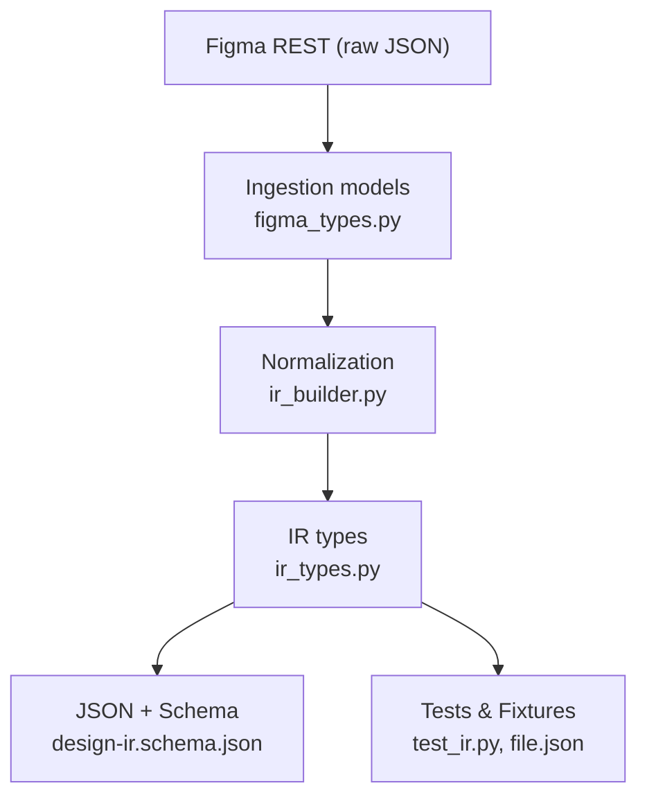
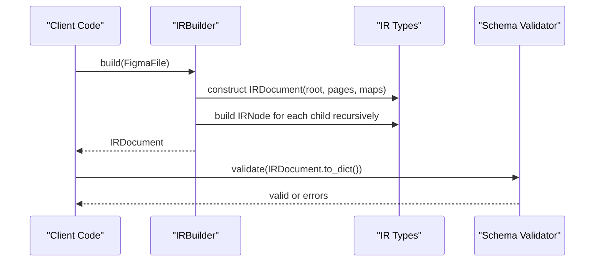
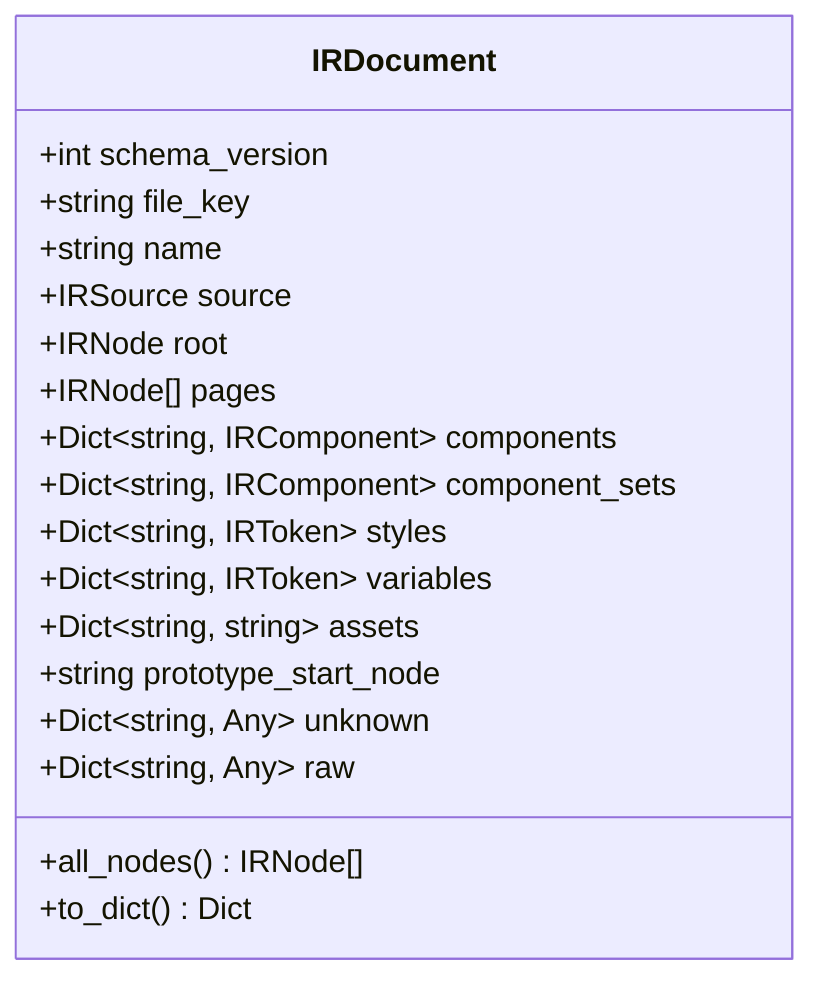
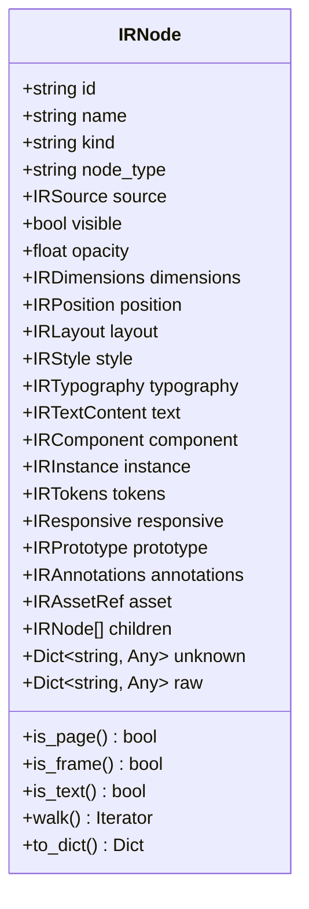
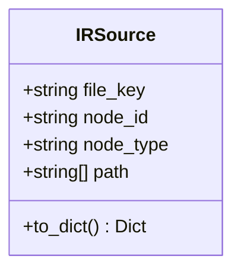
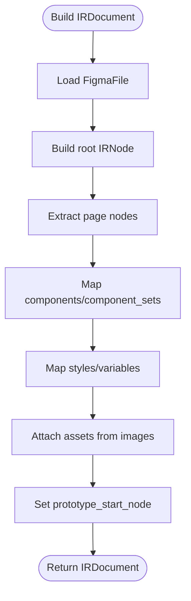
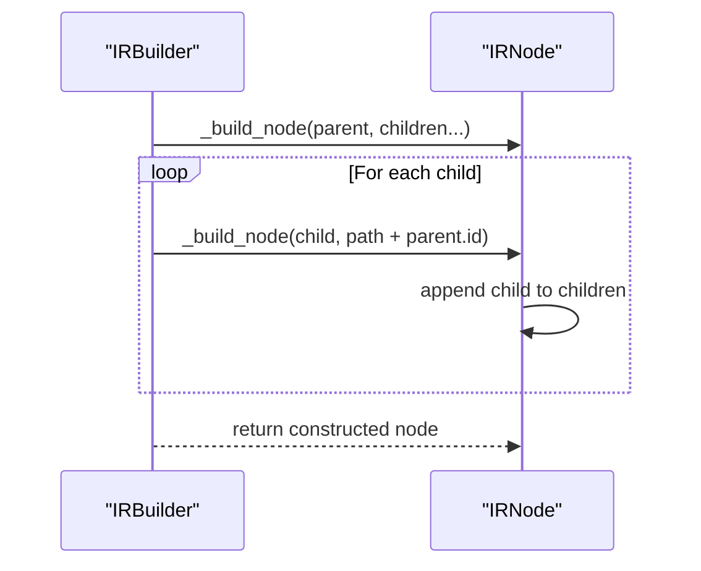
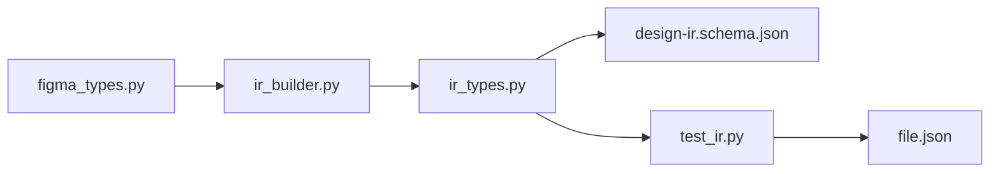

# IR Document Structure

<cite>
**Referenced Files in This Document**
- [ir_types.py](file://plugin/figmaforge/core/ir_types.py)
- [ir_builder.py](file://plugin/figmaforge/core/ir_builder.py)
- [design-ir.schema.json](file://plugin/figmaforge/schemas/design-ir.schema.json)
- [design-ir.md](file://docs/design-ir.md)
- [test_ir.py](file://plugin/figmaforge/tests/test_ir.py)
- [file.json](file://plugin/figmaforge/fixtures/figma/file.json)
</cite>

## Table of Contents
1. [Introduction](#introduction)
2. [Project Structure](#project-structure)
3. [Core Components](#core-components)
4. [Architecture Overview](#architecture-overview)
5. [Detailed Component Analysis](#detailed-component-analysis)
6. [Dependency Analysis](#dependency-analysis)
7. [Performance Considerations](#performance-considerations)
8. [Troubleshooting Guide](#troubleshooting-guide)
9. [Conclusion](#conclusion)
10. [Appendices](#appendices)

## Introduction
This document explains the Intermediate Representation (IR) used by FigmaForge to normalize Figma design data into a framework-neutral structure. The IRDocument is the root container for normalized design data and preserves the original Figma hierarchy while exposing typed, consistent fields for downstream consumers such as code generators or renderers. It also documents the IRNode hierarchy that represents the tree structure of designs, and the IRSource class that tracks provenance information for debugging and traceability.

The IR is produced from ingestion-layer models and validated against a JSON schema. All properties are preserved either as typed fields or under unknown/raw containers so nothing is silently dropped.

**Section sources**
- [design-ir.md:1-38](file://docs/design-ir.md#L1-L38)

## Project Structure
At a high level, the IR pipeline consists of:
- Ingestion layer: typed models mirroring Figma REST responses
- Normalization layer: builds an IRDocument tree from ingestion models
- Schema and validation: JSON schema and validators ensure structural integrity
- Tests and fixtures: validate behavior across all modeled areas

**Diagram sources**
- [design-ir.md:10-21](file://docs/design-ir.md#L10-L21)
- [ir_builder.py:1-18](file://plugin/figmaforge/core/ir_builder.py#L1-L18)
- [ir_types.py:1-42](file://plugin/figmaforge/core/ir_types.py#L1-L42)
- [design-ir.schema.json:1-23](file://plugin/figmaforge/schemas/design-ir.schema.json#L1-L23)

**Section sources**
- [design-ir.md:59-69](file://docs/design-ir.md#L59-L69)

## Core Components
- IRDocument: Root container with metadata, pages, components, styles, variables, assets, prototype_start_node, and the root node tree.
- IRNode: Tree node representing any Figma element with normalized properties and preserved raw/unknown data.
- IRSource: Provenance object tracking file_key, node_id, node_type, and ancestor path.
- Supporting value objects: IRColor, IRFill, IRBorder, IRShadow, IRBlur, IRStyle, IRSpacing, IRLayout, IRPosition, IRDimensions, IRTypography, IRTextContent, IRComponent, IRInstance, IRTokens, IRTokenRef, IRToken, IResponsive, IRPrototype, IRInteraction, IRLink, IRAssetRef.

These components collectively model 15 areas including documents/pages, frames/groups/sections, text, components/instances, auto-layout, positioning, dimensions, spacing, style, typography, tokens, assets, responsive constraints, prototype links, and annotations.

**Section sources**
- [ir_types.py:23-42](file://plugin/figmaforge/core/ir_types.py#L23-L42)
- [ir_types.py:725-764](file://plugin/figmaforge/core/ir_types.py#L725-L764)
- [ir_types.py:619-696](file://plugin/figmaforge/core/ir_types.py#L619-L696)
- [ir_types.py:597-611](file://plugin/figmaforge/core/ir_types.py#L597-L611)

## Architecture Overview
The normalization process transforms Figma ingestion models into an IRDocument tree. The builder constructs nodes recursively, mapping Figma properties to normalized IR fields, preserving unknowns and raw payloads for debugging.

**Diagram sources**
- [ir_builder.py:156-207](file://plugin/figmaforge/core/ir_builder.py#L156-L207)
- [ir_builder.py:219-272](file://plugin/figmaforge/core/ir_builder.py#L219-L272)
- [ir_types.py:725-764](file://plugin/figmaforge/core/ir_types.py#L725-L764)
- [design-ir.md:71-86](file://docs/design-ir.md#L71-L86)

## Detailed Component Analysis

### IRDocument
IRDocument is the top-level normalized design representation. It includes:
- schema_version: version identifier for the IR format
- file_key: original Figma file key
- name: file name
- source: IRSource describing the document origin
- root: IRNode representing the document root
- pages: list of page nodes (CANVAS nodes)
- components: map of component keys to IRComponent
- component_sets: map of component-set keys to IRComponent
- styles: map of style keys to IRToken
- variables: map of variable ids to IRToken
- assets: map of node_id to asset URL
- prototype_start_node: optional file-level prototype start node id
- unknown: unmapped file-level properties preserved verbatim
- raw: complete original file response for debugging

IRDocument provides methods to serialize to dict/json and to enumerate all nodes via walking the root.

**Diagram sources**
- [ir_types.py:725-764](file://plugin/figmaforge/core/ir_types.py#L725-L764)

**Section sources**
- [ir_types.py:725-764](file://plugin/figmaforge/core/ir_types.py#L725-L764)
- [design-ir.schema.json:8-23](file://plugin/figmaforge/schemas/design-ir.schema.json#L8-L23)

### IRNode Hierarchy
IRNode represents any node in the design tree. It includes:
- id, name, kind, node_type: identity and classification
- source: IRSource with file_key, node_id, node_type, path
- visible, opacity: visibility and transparency
- dimensions: width/height/min/max and sizing modes
- position: absolute/auto/relative placement
- layout: auto-layout/flex/grid configuration
- style: fills/borders/shadows/blurs/radius/opacity
- typography: font family/weight/size/line height/letter spacing/text case/decoration/alignment/auto resize
- text: characters and hyperlink
- component: reference to a component definition
- instance: reference to a component instance
- tokens: bound variables and style references
- responsive: constraints and sizing for scaling
- prototype: links and interactions
- annotations: developer metadata
- asset: image reference and URL
- children: list of child IRNode instances
- unknown: unmapped raw properties
- raw: complete original node dict

IRNode provides helpers like is_page, is_frame, is_text, walk traversal, and serialization.

**Diagram sources**
- [ir_types.py:619-696](file://plugin/figmaforge/core/ir_types.py#L619-L696)

**Section sources**
- [ir_types.py:619-696](file://plugin/figmaforge/core/ir_types.py#L619-L696)
- [design-ir.schema.json:25-53](file://plugin/figmaforge/schemas/design-ir.schema.json#L25-L53)

### IRSource
IRSource tracks provenance information for each node:
- file_key: originating Figma file key
- node_id: original Figma node id
- node_type: original Figma type (e.g., FRAME, TEXT)
- path: ancestor node ids from root to parent

This enables precise debugging and blame attribution during code generation.

**Diagram sources**
- [ir_types.py:597-611](file://plugin/figmaforge/core/ir_types.py#L597-L611)

**Section sources**
- [ir_types.py:597-611](file://plugin/figmaforge/core/ir_types.py#L597-L611)
- [design-ir.schema.json:54-63](file://plugin/figmaforge/schemas/design-ir.schema.json#L54-L63)

### Transformation Example: Figma File to IRDocument Tree
The IRBuilder converts a FigmaFile into an IRDocument by:
- Building the root node and extracting pages
- Mapping components/component sets/styles/variables into dictionaries
- Attaching assets from images mapping
- Preserving prototype_start_node and unknown/raw data

**Diagram sources**
- [ir_builder.py:156-207](file://plugin/figmaforge/core/ir_builder.py#L156-L207)

**Section sources**
- [ir_builder.py:156-207](file://plugin/figmaforge/core/ir_builder.py#L156-L207)
- [test_ir.py:37-43](file://plugin/figmaforge/tests/test_ir.py#L37-L43)
- [file.json:1-200](file://plugin/figmaforge/fixtures/figma/file.json#L1-L200)

### Hierarchical Relationships Preservation
The builder recursively constructs child nodes, passing the current node id as part of the path to maintain ancestry. Parent-child relationships are preserved in the IRNode.children lists and can be verified through tests.

**Diagram sources**
- [ir_builder.py:219-272](file://plugin/figmaforge/core/ir_builder.py#L219-L272)

**Section sources**
- [test_ir.py:221-224](file://plugin/figmaforge/tests/test_ir.py#L221-L224)

## Dependency Analysis
The IR system has clear dependencies between layers:
- ir_builder depends on figma_types for ingestion models and ir_types for output structures
- ir_types defines all value objects and the document/node hierarchy
- design-ir.schema.json validates the serialized IRDocument
- Tests exercise the full transformation and validate behavior

**Diagram sources**
- [ir_builder.py:25-62](file://plugin/figmaforge/core/ir_builder.py#L25-L62)
- [ir_types.py:1-42](file://plugin/figmaforge/core/ir_types.py#L1-L42)
- [design-ir.schema.json:1-23](file://plugin/figmaforge/schemas/design-ir.schema.json#L1-L23)
- [test_ir.py:18-34](file://plugin/figmaforge/tests/test_ir.py#L18-L34)

**Section sources**
- [ir_builder.py:25-62](file://plugin/figmaforge/core/ir_builder.py#L25-L62)
- [ir_types.py:1-42](file://plugin/figmaforge/core/ir_types.py#L1-L42)

## Performance Considerations
- The IRBuilder is pure and deterministic, avoiding I/O and network calls during normalization
- Serialization uses compacting functions to drop None values while preserving falsy values
- Deterministic JSON output with sorted keys ensures stable snapshots for testing
- Walking the node tree is pre-order traversal, efficient for iteration

[No sources needed since this section provides general guidance]

## Troubleshooting Guide
Common issues and how to address them:
- Unsupported properties: Use IRBuilder.unsupported_properties() to identify unmapped raw keys; these are preserved in IRNode.unknown
- Validation failures: Ensure IRDocument conforms to the JSON schema; use ensure_valid() to catch errors early
- Missing assets: Verify images mapping is provided to IRBuilder; assets may be empty if not supplied
- Source tracing: Check IRSource.path to understand node ancestry and locate issues in complex hierarchies

**Section sources**
- [ir_builder.py:209-216](file://plugin/figmaforge/core/ir_builder.py#L209-L216)
- [test_ir.py:232-239](file://plugin/figmaforge/tests/test_ir.py#L232-L239)
- [design-ir.md:174-192](file://docs/design-ir.md#L174-L192)

## Conclusion
The IRDocument serves as the canonical, normalized representation of Figma design data, providing a stable foundation for downstream processing. Its hierarchical structure preserves the original design tree while exposing typed, consistent fields. The IRSource class enables precise provenance tracking, and the comprehensive set of value objects covers all major design concepts from layouts and styling to components and prototypes. This architecture supports robust code generation, rendering, and analysis workflows.

[No sources needed since this section summarizes without analyzing specific files]

## Appendices

### Example: Button Card Transformation
A concrete example shows how a Figma frame with auto-layout, fills, borders, shadows, and bound variables transforms into normalized IR fields. The example demonstrates layout mode mapping, alignment, spacing, and token binding.

**Section sources**
- [design-ir.md:88-173](file://docs/design-ir.md#L88-L173)
- [file.json:31-136](file://plugin/figmaforge/fixtures/figma/file.json#L31-L136)

### Example: Page and Component Structure
The fixture file contains multiple pages (Buttons, Fundamentals) with various node types including instances, frames, groups, vectors, components, and component sets. Tests verify the correct mapping of kinds, properties, and relationships.

**Section sources**
- [file.json:13-184](file://plugin/figmaforge/fixtures/figma/file.json#L13-L184)
- [test_ir.py:55-96](file://plugin/figmaforge/tests/test_ir.py#L55-L96)