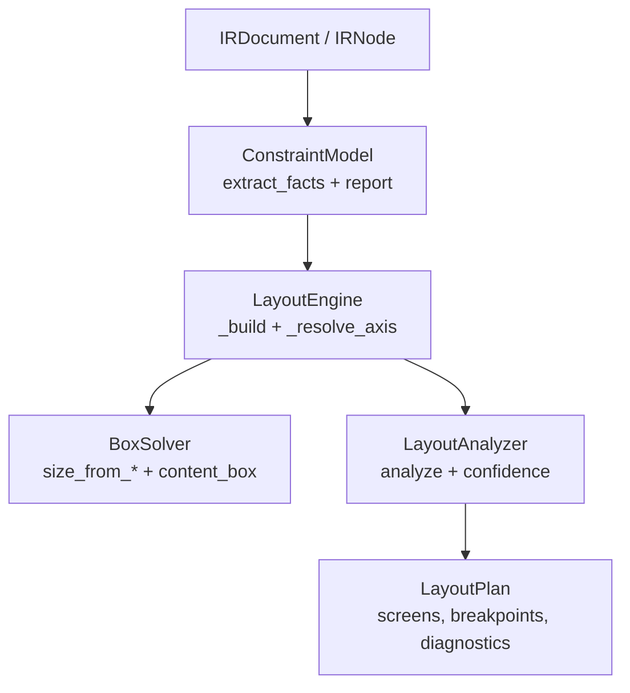
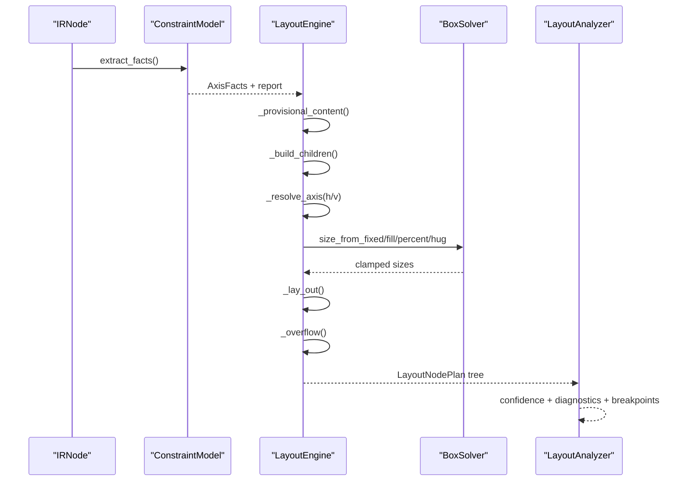
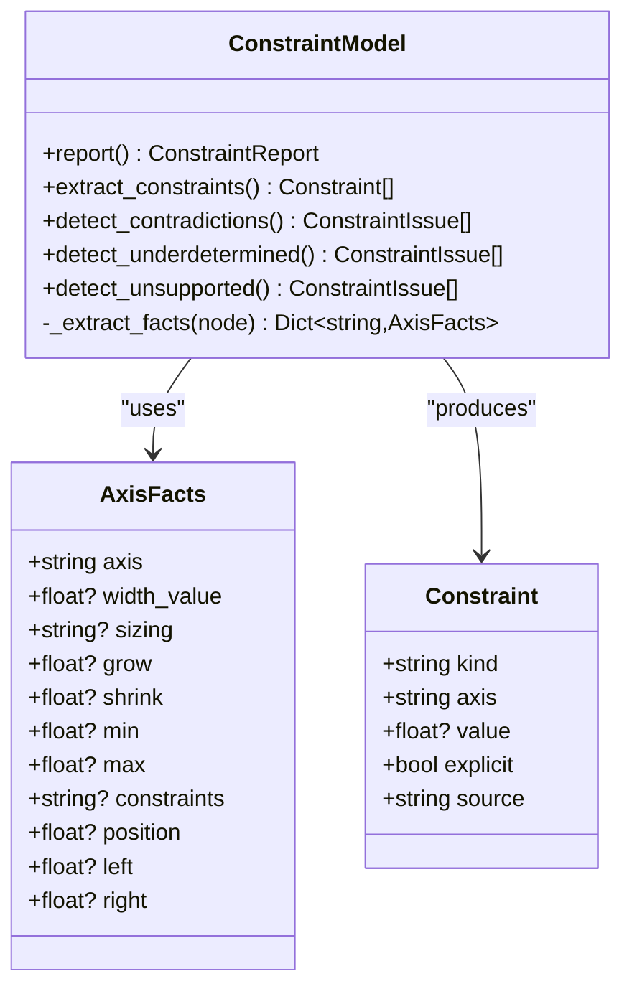
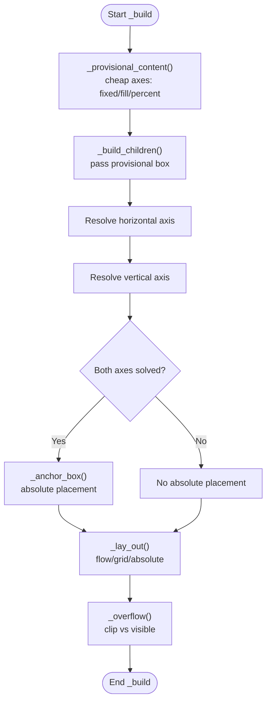
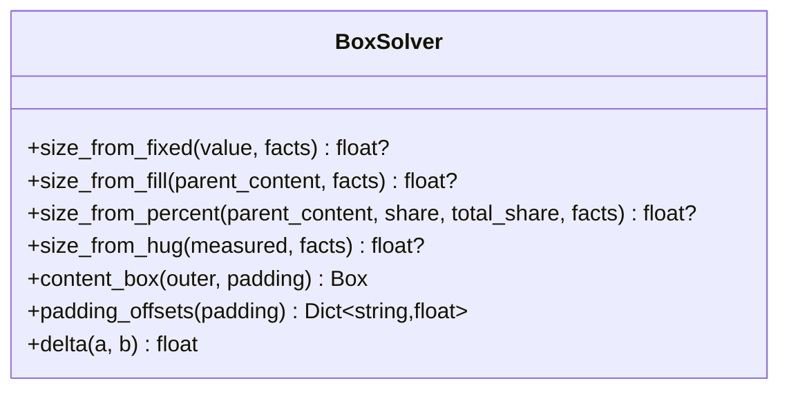
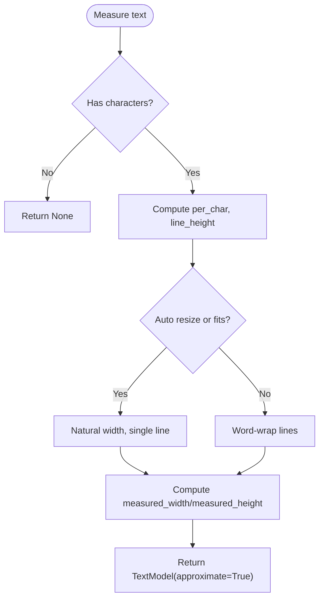
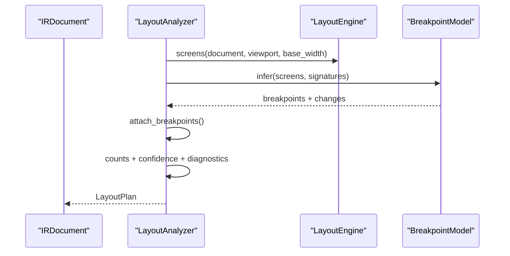
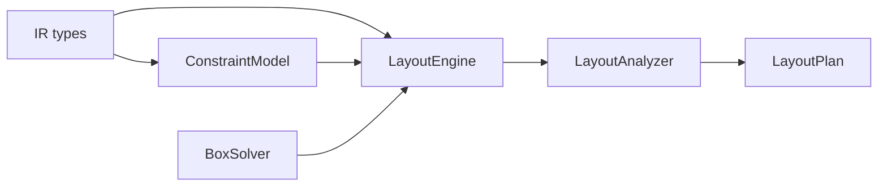

# Constraint Solving Algorithm

<cite>
**Referenced Files in This Document**
- [constraint_model.py](file://plugin/figmaforge/core/constraint_model.py)
- [layout_engine.py](file://plugin/figmaforge/core/layout_engine.py)
- [layout_analyzer.py](file://plugin/figmaforge/core/layout_analyzer.py)
- [layout_types.py](file://plugin/figmaforge/core/layout_types.py)
- [ir_types.py](file://plugin/figmaforge/core/ir_types.py)
- [layout.md](file://docs/layout.md)
</cite>

## Table of Contents
1. [Introduction](#introduction)
2. [Project Structure](#project-structure)
3. [Core Components](#core-components)
4. [Architecture Overview](#architecture-overview)
5. [Detailed Component Analysis](#detailed-component-analysis)
6. [Dependency Analysis](#dependency-analysis)
7. [Performance Considerations](#performance-considerations)
8. [Troubleshooting Guide](#troubleshooting-guide)
9. [Conclusion](#conclusion)
10. [Appendices](#appendices)

## Introduction
This document explains the constraint solving algorithm that processes normalized IR layouts to compute responsive behavior. It focuses on how the ConstraintModel extracts layout facts from Figma nodes, how the LayoutEngine resolves sizing modes (fixed/fill/hug/percent), spacing, alignment, and anchoring, and how BoxSolver computes sizes with min/max bounds and overflow handling. It also documents the resolution order, complex scenarios, and conflict resolution strategies for contradictory or underdetermined constraints.

## Project Structure
The constraint solver spans a small set of focused modules:
- IR types define the normalized input model consumed by the solver.
- ConstraintModel extracts per-axis facts and detects contradictions, underdetermination, and unsupported features.
- LayoutEngine orchestrates the four-phase resolution: provisional box, child build, axis resolution (including hug), and nested layout placement.
- LayoutAnalyzer aggregates results into a LayoutPlan with confidence, diagnostics, counts, and breakpoint changes.
- BoxSolver provides pure arithmetic primitives used throughout.

**Diagram sources**
- [constraint_model.py:108-181](file://plugin/figmaforge/core/constraint_model.py#L108-L181)
- [layout_engine.py:236-390](file://plugin/figmaforge/core/layout_engine.py#L236-L390)
- [layout_analyzer.py:64-120](file://plugin/figmaforge/core/layout_analyzer.py#L64-L120)

**Section sources**
- [layout.md:1-24](file://docs/layout.md#L1-L24)
- [ir_types.py:1-42](file://plugin/figmaforge/core/ir_types.py#L1-L42)

## Core Components
- ConstraintModel: Builds AxisFacts per axis, extracts explicit and derived constraints, and reports contradictions, underdetermined cases, and unsupported features.
- LayoutEngine: Implements the deterministic resolution order and performs text measurement, flow/grid/absolute classification, spacing, alignment, anchoring, overflow, and nested propagation.
- BoxSolver: Pure functions for clamping, content-box math, padding offsets, and delta comparison between predicted and recorded boxes.
- LayoutAnalyzer: Orchestrates engine runs across viewport widths, attaches breakpoints, computes confidence and diagnostics, and flattens constraint reports.

Key responsibilities and boundaries:
- ConstraintModel never guesses values; it only reports what cannot be solved from node fields alone.
- LayoutEngine uses BoxSolver to clamp and compute sizes deterministically.
- LayoutAnalyzer adds cross-cutting outputs like confidence and breakpoint changes without altering core solving logic.

**Section sources**
- [constraint_model.py:108-338](file://plugin/figmaforge/core/constraint_model.py#L108-L338)
- [layout_engine.py:236-390](file://plugin/figmaforge/core/layout_engine.py#L236-L390)
- [layout_analyzer.py:64-120](file://plugin/figmaforge/core/layout_analyzer.py#L64-L120)

## Architecture Overview
The solver follows a strict four-phase process per node:
1. Provisional content box from cheap non-hug axes (fixed/fill/percent).
2. Build children against the provisional box (hug axes may be None, correctly flagging underdetermined fills inside hug containers).
3. Resolve both axes using measured content extents (hug now measurable after children are built).
4. Lay out children within the solved box (flow/grid/absolute), then compute overflow.

**Diagram sources**
- [layout_engine.py:274-390](file://plugin/figmaforge/core/layout_engine.py#L274-L390)
- [constraint_model.py:108-181](file://plugin/figmaforge/core/constraint_model.py#L108-L181)
- [layout_analyzer.py:76-120](file://plugin/figmaforge/core/layout_analyzer.py#L76-L120)

## Detailed Component Analysis

### ConstraintModel: Fact Extraction and Issue Detection
- Extracts AxisFacts per axis from dimensions, responsive constraints, layout grow/shrink, position offsets, and absolute positioning mode.
- Produces a list of Constraint objects representing width/height/min/max/anchor evidence.
- Detects contradictions:
  - min > max
  - fixed value outside its own min/max
  - negative min/max
- Detects underdetermined cases:
  - FIXED sizing with no width/min declared
  - Absolute node without explicit box, min, or STRETCH anchor
- Detects unsupported raw constraints not modeled numerically.

**Diagram sources**
- [constraint_model.py:47-96](file://plugin/figmaforge/core/constraint_model.py#L47-L96)
- [constraint_model.py:108-338](file://plugin/figmaforge/core/constraint_model.py#L108-L338)

**Section sources**
- [constraint_model.py:108-338](file://plugin/figmaforge/core/constraint_model.py#L108-L338)

### LayoutEngine: Resolution Order and Sizing Modes
Resolution order:
1. Cheap non-hug axes first:
   - Fixed sizes preserved exactly, clamped by min/max.
   - Fill sizes use parent content extent, clamped by min/max.
   - Percent sizes share free space among flex-grow siblings or grid columns, clamped by min/max.
2. Build children against provisional box:
   - Hug axes expose None so children filling hug axes are flagged underdetermined.
3. Resolve hug axes from content extents:
   - Text measured via heuristic; hug uses measured content plus padding/gap.
4. Lay out children:
   - Flow/grid placement with justify/align and gaps; absolute placement anchored to parent content box.

Sizing mode decisions:
- Grid: explicit widths hold; otherwise equal shares of available space.
- Flex main axis: percent via grow ratio over total grow.
- Cross-axis fill: align_self or container align can force fill.
- Hug: computed from children/text extents; if unmeasurable, marked underdetermined.

**Diagram sources**
- [layout_engine.py:274-390](file://plugin/figmaforge/core/layout_engine.py#L274-L390)
- [layout_engine.py:393-448](file://plugin/figmaforge/core/layout_engine.py#L393-L448)
- [layout_engine.py:465-570](file://plugin/figmaforge/core/layout_engine.py#L465-L570)
- [layout_engine.py:736-821](file://plugin/figmaforge/core/layout_engine.py#L736-L821)
- [layout_engine.py:927-948](file://plugin/figmaforge/core/layout_engine.py#L927-L948)

**Section sources**
- [layout_engine.py:236-390](file://plugin/figmaforge/core/layout_engine.py#L236-L390)
- [layout_engine.py:393-570](file://plugin/figmaforge/core/layout_engine.py#L393-L570)
- [layout_engine.py:736-821](file://plugin/figmaforge/core/layout_engine.py#L736-L821)
- [layout_engine.py:927-948](file://plugin/figmaforge/core/layout_engine.py#L927-L948)

### BoxSolver: Arithmetic Primitives and Bounds Handling
- Clamping: Ensures all resolved sizes respect min/max bounds.
- Content box: Computes inner box after consuming padding.
- Padding offsets: Normalizes optional padding to four-edge floats.
- Delta: Compares predicted box to recorded Figma box to detect mismatches.

Size computation methods:
- size_from_fixed: Clamp explicit width/height by min/max.
- size_from_fill: Use parent content extent, clamp by min/max.
- size_from_percent: Compute proportional share of available space, clamp by min/max.
- size_from_hug: Use measured content or min fallback, clamp by min/max.

**Diagram sources**
- [constraint_model.py:346-425](file://plugin/figmaforge/core/constraint_model.py#L346-L425)

**Section sources**
- [constraint_model.py:346-425](file://plugin/figmaforge/core/constraint_model.py#L346-L425)

### TextMeasurer: Heuristic Measurement and Wrapping
- Measures text width and height using font size, letter spacing, and a documented character advance factor.
- Wraps text greedily by words; hard-splits long words when necessary.
- Marks measurements approximate to lower confidence appropriately.

**Diagram sources**
- [layout_engine.py:137-234](file://plugin/figmaforge/core/layout_engine.py#L137-L234)

**Section sources**
- [layout_engine.py:137-234](file://plugin/figmaforge/core/layout_engine.py#L137-L234)

### LayoutAnalyzer: Orchestration, Confidence, and Breakpoints
- Runs LayoutEngine at base width and at each breakpoint width.
- Attaches breakpoint changes where measured signatures differ.
- Computes per-node confidence based on assumptions and diagnostics.
- Flattens constraint reports across the entire plan.

**Diagram sources**
- [layout_analyzer.py:64-120](file://plugin/figmaforge/core/layout_analyzer.py#L64-L120)
- [layout_analyzer.py:123-145](file://plugin/figmaforge/core/layout_analyzer.py#L123-L145)
- [layout_analyzer.py:148-208](file://plugin/figmaforge/core/layout_analyzer.py#L148-L208)
- [layout_analyzer.py:238-257](file://plugin/figmaforge/core/layout_analyzer.py#L238-L257)

**Section sources**
- [layout_analyzer.py:64-120](file://plugin/figmaforge/core/layout_analyzer.py#L64-L120)
- [layout_analyzer.py:123-208](file://plugin/figmaforge/core/layout_analyzer.py#L123-L208)
- [layout_analyzer.py:238-257](file://plugin/figmaforge/core/layout_analyzer.py#L238-L257)

## Dependency Analysis
- LayoutEngine depends on ConstraintModel for facts and issue detection, and on BoxSolver for arithmetic.
- LayoutAnalyzer depends on LayoutEngine and BreakpointModel to produce final LayoutPlan.
- All components consume IR types and produce framework-neutral layout models.

**Diagram sources**
- [layout_engine.py:39-73](file://plugin/figmaforge/core/layout_engine.py#L39-L73)
- [constraint_model.py:26-34](file://plugin/figmaforge/core/constraint_model.py#L26-L34)
- [layout_analyzer.py:23-42](file://plugin/figmaforge/core/layout_analyzer.py#L23-L42)

**Section sources**
- [layout_engine.py:39-73](file://plugin/figmaforge/core/layout_engine.py#L39-L73)
- [constraint_model.py:26-34](file://plugin/figmaforge/core/constraint_model.py#L26-L34)
- [layout_analyzer.py:23-42](file://plugin/figmaforge/core/layout_analyzer.py#L23-L42)

## Performance Considerations
- The solver is deterministic and stdlib-only, avoiding heavy dependencies.
- Text measurement is heuristic and approximate; this reduces cost but lowers confidence.
- Provisional box computation avoids expensive hug calculations until necessary.
- Percent sizing accounts for gaps among siblings to avoid over-resolving free space.
- Min/max clamping ensures stable outcomes even when inputs vary slightly.

[No sources needed since this section provides general guidance]

## Troubleshooting Guide
Common issues and their handling:
- Contradictions: Reported as errors; zero confidence for affected nodes. Examples include min > max or fixed values outside min/max ranges.
- Underdetermined: Reported as warnings; no number contributed for unresolved bounds (e.g., hug with no measurable content, percent/fill in hug containers).
- Unsupported: Noted as info-level diagnostics (e.g., native scroll not represented in IR).
- Bounds mismatch: Predicted vs recorded Figma bounds differ beyond epsilon; diagnostic emitted.

Diagnostics are attached per node and aggregated at the document level. Confidence penalties apply for assumptions such as text heuristics, fills in hug containers, and scale anchors approximated as min.

**Section sources**
- [layout_engine.py:951-967](file://plugin/figmaforge/core/layout_engine.py#L951-L967)
- [layout_analyzer.py:179-208](file://plugin/figmaforge/core/layout_analyzer.py#L179-L208)
- [layout_analyzer.py:210-235](file://plugin/figmaforge/core/layout_analyzer.py#L210-L235)

## Conclusion
The constraint solving algorithm provides a deterministic, honest approach to responsive layout inference from normalized IR. It prioritizes cheap non-hug axes, defers hug resolution until content is measurable, and strictly respects min/max bounds while reporting contradictions and underdetermined cases. BoxSolver ensures consistent arithmetic, and LayoutAnalyzer adds confidence and breakpoint insights. This design enables robust downstream code generation and debugging through rich diagnostics and reproducible plans.

[No sources needed since this section summarizes without analyzing specific files]

## Appendices

### Complex Constraint Scenarios
- Nested auto-layouts with mixed sizing modes:
  - Parent row/column with mix of fixed, fill, hug, and percent children.
  - Percent siblings share free space after accounting for gaps; hug parents expand to fit content.
- Fluid typography with text wrapping:
  - Text nodes measure approximate widths; wrap occurs when content exceeds available width.
  - Hug text expands vertically with wrapped lines; confidence lowered due to approximation.
- Adaptive spacing with gaps:
  - Gaps subtract from free space for percent sizing; flow layout positions children with gap-aware cursors.

[No sources needed since this section doesn't analyze specific files]

### Conflict Resolution Strategies
- Contradictory constraints:
  - Detected by ConstraintModel; reported as errors; confidence set to zero.
  - Solver does not guess; fixes must come from design corrections.
- Underdetermined constraints:
  - Reported as warnings; solver refuses to invent numbers.
  - Common cases: hug with no content, percent/fill without resolved parent.
- Scale anchors:
  - Approximated as min anchors; assumption noted and confidence penalized.

**Section sources**
- [constraint_model.py:184-288](file://plugin/figmaforge/core/constraint_model.py#L184-L288)
- [layout_engine.py:554-570](file://plugin/figmaforge/core/layout_engine.py#L554-L570)
- [layout_analyzer.py:44-54](file://plugin/figmaforge/core/layout_analyzer.py#L44-L54)