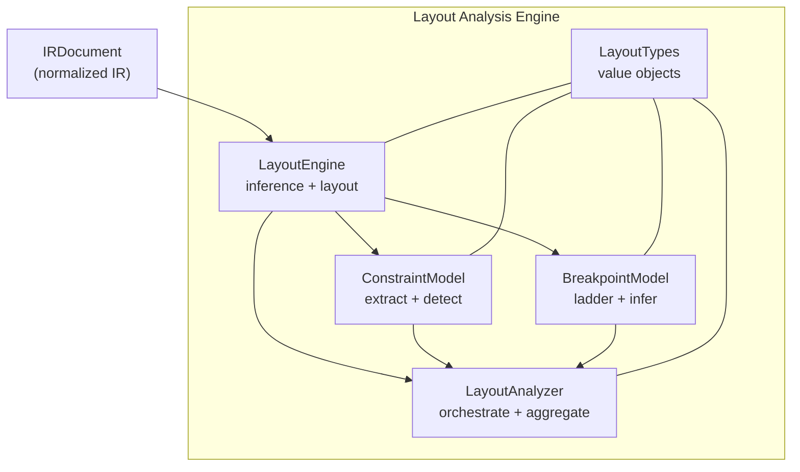
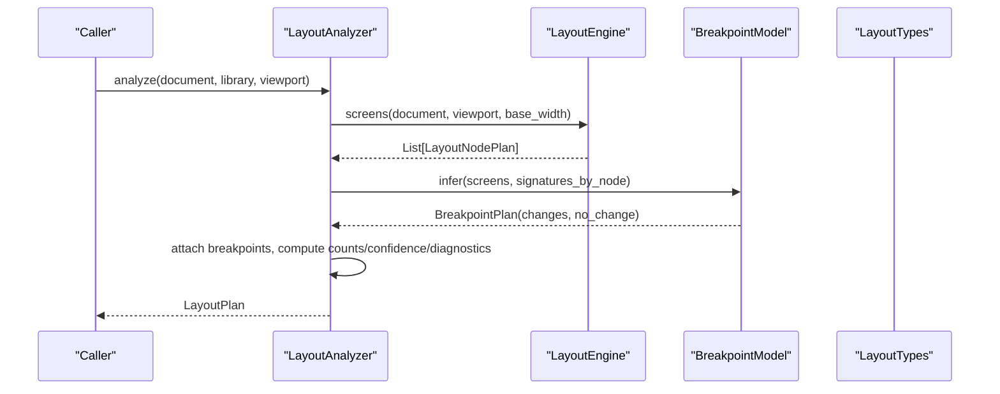
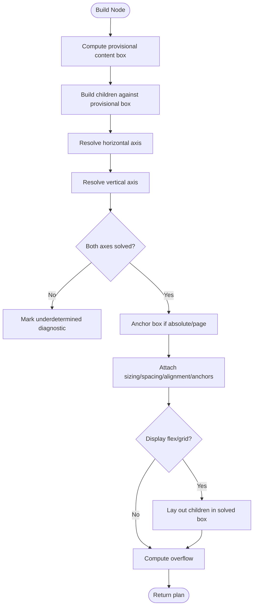
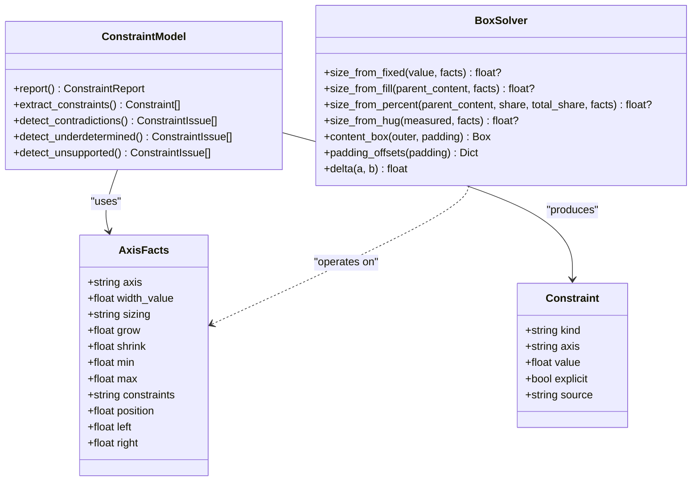
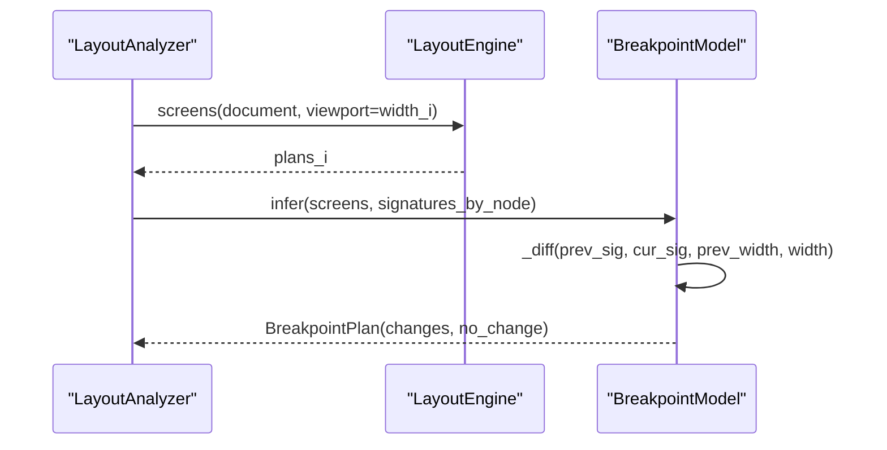
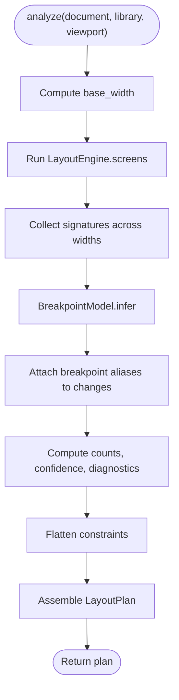
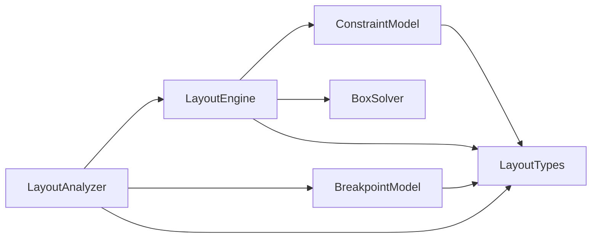

# Layout Analysis Engine

<cite>
**Referenced Files in This Document**
- [layout_analyzer.py](file://plugin/figmaforge/core/layout_analyzer.py)
- [breakpoint_model.py](file://plugin/figmaforge/core/breakpoint_model.py)
- [constraint_model.py](file://plugin/figmaforge/core/constraint_model.py)
- [layout_engine.py](file://plugin/figmaforge/core/layout_engine.py)
- [layout_types.py](file://plugin/figmaforge/core/layout_types.py)
- [ir_types.py](file://plugin/figmaforge/core/ir_types.py)
- [layout.md](file://docs/layout.md)
</cite>

## Table of Contents
1. [Introduction](#introduction)
2. [Project Structure](#project-structure)
3. [Core Components](#core-components)
4. [Architecture Overview](#architecture-overview)
5. [Detailed Component Analysis](#detailed-component-analysis)
6. [Dependency Analysis](#dependency-analysis)
7. [Performance Considerations](#performance-considerations)
8. [Troubleshooting Guide](#troubleshooting-guide)
9. [Conclusion](#conclusion)
10. [Appendices](#appendices)

## Introduction
The Layout Analysis Engine transforms a normalized Design IR into a framework-neutral, schema-validated layout plan that describes how each node should lay out across viewports. It performs responsive constraint solving with breakpoint management: it infers display modes (flex/grid/absolute), resolves per-axis sizing (fixed/fill/hug/percent), computes spacing and alignment, handles anchoring for absolute positioning, measures text wrapping heuristically, detects overflow, and propagates layout through nested hierarchies. A separate breakpoint model builds a numeric ladder from project tokens and emits only measured changes between widths. The analyzer orchestrates these parts to produce counts, confidence scores, diagnostics, and a flattened constraint report.

## Project Structure
At the heart of the engine are five core modules:
- layout_engine: Inference and layout computation over the IR tree
- constraint_model: Constraint extraction, contradiction/underdetermination detection, and pure arithmetic primitives
- breakpoint_model: Numeric breakpoint ladder and evidence-based change detection
- layout_analyzer: Orchestration producing a single LayoutPlan with cross-cutting outputs
- layout_types: Framework-neutral value objects and schemas consumed by all components

**Diagram sources**
- [layout_engine.py:236-271](file://plugin/figmaforge/core/layout_engine.py#L236-L271)
- [constraint_model.py:108-127](file://plugin/figmaforge/core/constraint_model.py#L108-L127)
- [breakpoint_model.py:36-114](file://plugin/figmaforge/core/breakpoint_model.py#L36-L114)
- [layout_analyzer.py:64-120](file://plugin/figmaforge/core/layout_analyzer.py#L64-L120)
- [layout_types.py:412-521](file://plugin/figmaforge/core/layout_types.py#L412-L521)

**Section sources**
- [layout.md:11-24](file://docs/layout.md#L11-L24)
- [layout_analyzer.py:64-120](file://plugin/figmaforge/core/layout_analyzer.py#L64-L120)

## Core Components
- LayoutEngine: Builds per-page LayoutNodePlan trees from an IRDocument at a given viewport. It classifies display modes, resolves provisional content boxes, lays out children, and computes overflow and anchors.
- ConstraintModel: Extracts constraints from IR fields and reports contradictions, underdetermined bounds, and unsupported features. Provides BoxSolver for deterministic arithmetic.
- BreakpointModel: Reads breakpoint tokens to build a numeric ladder; diffs measured signatures across widths to emit BreakpointChange entries with evidence.
- LayoutAnalyzer: Orchestrates screens generation, breakpoint inference, and aggregates counts, confidence, diagnostics, and a flattened constraint report into a LayoutPlan.
- LayoutTypes: Defines the neutral vocabulary and data structures used throughout (Box, SizingSpec, Anchoring, OverflowSpec, TextModel, LayoutNodePlan, LayoutPlan, etc.).

**Section sources**
- [layout_engine.py:236-390](file://plugin/figmaforge/core/layout_engine.py#L236-L390)
- [constraint_model.py:108-127](file://plugin/figmaforge/core/constraint_model.py#L108-L127)
- [breakpoint_model.py:36-114](file://plugin/figmaforge/core/breakpoint_model.py#L36-L114)
- [layout_analyzer.py:64-120](file://plugin/figmaforge/core/layout_analyzer.py#L64-L120)
- [layout_types.py:102-521](file://plugin/figmaforge/core/layout_types.py#L102-L521)

## Architecture Overview
The pipeline is designed around separation of concerns and determinism:
- Input: IRDocument plus optional library tokens
- Step 1: LayoutEngine.screens produces per-page plan trees at the target viewport
- Step 2: BreakpointModel.infer diffs signatures across the breakpoint ladder to find responsive changes
- Step 3: LayoutAnalyzer.analyze attaches breakpoints, computes counts/confidence/diagnostics, and returns a validated LayoutPlan

**Diagram sources**
- [layout_analyzer.py:76-120](file://plugin/figmaforge/core/layout_analyzer.py#L76-L120)
- [layout_engine.py:251-271](file://plugin/figmaforge/core/layout_engine.py#L251-L271)
- [breakpoint_model.py:90-114](file://plugin/figmaforge/core/breakpoint_model.py#L90-L114)
- [layout_types.py:480-521](file://plugin/figmaforge/core/layout_types.py#L480-L521)

## Detailed Component Analysis

### LayoutEngine: Responsive constraint solver and layout planner
Responsibilities:
- Classify display mode per node (flex/grid/absolute/none) based on IR layout and position
- Build a provisional content box using non-hug axes first so children can be laid out
- Resolve per-axis sizing: fixed, fill, hug, percent (including flex-grow and grid share)
- Compute spacing (padding/gap), alignment (justify/align/align_self), and anchoring for absolute nodes
- Measure text heuristically, determine wrap behavior, and propagate overflow
- Lay out children within solved containers and finalize positions

Key algorithms and flows:
- Provisional content box: Resolves cheap axes (fixed/fill/percent) before hug to create a known container for children
- Axis resolution: Applies priority rules (grid share, flex-grow percent, fill, hug, fixed) and clamps via min/max
- Hug resolution: Computes content extent from children/text and applies min/max clamping
- Flow/grid layout: Positions siblings with gap and alignment; grid distributes columns/rows evenly
- Anchoring: Derives left/right/top/bottom offsets relative to parent content box and supports MIN/CENTER/MAX/STRETCH/SCALE

**Diagram sources**
- [layout_engine.py:274-390](file://plugin/figmaforge/core/layout_engine.py#L274-L390)
- [layout_engine.py:393-448](file://plugin/figmaforge/core/layout_engine.py#L393-L448)
- [layout_engine.py:465-552](file://plugin/figmaforge/core/layout_engine.py#L465-L552)
- [layout_engine.py:554-602](file://plugin/figmaforge/core/layout_engine.py#L554-L602)
- [layout_engine.py:736-800](file://plugin/figmaforge/core/layout_engine.py#L736-L800)

**Section sources**
- [layout_engine.py:236-390](file://plugin/figmaforge/core/layout_engine.py#L236-L390)
- [layout_engine.py:393-800](file://plugin/figmaforge/core/layout_engine.py#L393-L800)

### ConstraintModel: Constraint extraction and conflict detection
Responsibilities:
- Extract explicit and derived constraints from IR dimensions, responsive constraints, and layout properties
- Detect contradictions (e.g., min > max, fixed outside range, negative bounds)
- Detect underdetermined cases (e.g., FIXED without width/min, absolute without box or STRETCH)
- Report unsupported features (e.g., raw layoutAlign/layoutWrap with non-string values)
- Provide BoxSolver for deterministic arithmetic: clamping, content-box math, padding offsets, delta comparison

Key behaviors:
- Constraints include width/height, min/max, and anchor indicators
- Underdetection focuses on what cannot be resolved from node fields alone; engine-level context augments this
- BoxSolver ensures consistent rounding and safe operations

**Diagram sources**
- [constraint_model.py:47-97](file://plugin/figmaforge/core/constraint_model.py#L47-L97)
- [constraint_model.py:108-127](file://plugin/figmaforge/core/constraint_model.py#L108-L127)
- [constraint_model.py:184-288](file://plugin/figmaforge/core/constraint_model.py#L184-L288)
- [constraint_model.py:346-425](file://plugin/figmaforge/core/constraint_model.py#L346-L425)

**Section sources**
- [constraint_model.py:108-288](file://plugin/figmaforge/core/constraint_model.py#L108-L288)
- [constraint_model.py:346-425](file://plugin/figmaforge/core/constraint_model.py#L346-L425)

### BreakpointModel: Responsive breakpoint ladder and change detection
Responsibilities:
- Build a numeric breakpoint ladder from project tokens or defaults (sm/md/lg)
- Infer per-node responsive changes by diffing measured signatures across consecutive widths
- Emit BreakpointChange entries with evidence describing the measured difference
- Record nodes with no change explicitly

Key behaviors:
- Signatures capture width, height, sizing modes, wrap, text lines, and overflow
- Changes are emitted only when there is measurable evidence of a difference
- Width-to-breakpoint alias mapping is attached by the analyzer

**Diagram sources**
- [breakpoint_model.py:90-114](file://plugin/figmaforge/core/breakpoint_model.py#L90-L114)
- [breakpoint_model.py:117-157](file://plugin/figmaforge/core/breakpoint_model.py#L117-L157)
- [layout_analyzer.py:123-146](file://plugin/figmaforge/core/layout_analyzer.py#L123-L146)

**Section sources**
- [breakpoint_model.py:36-114](file://plugin/figmaforge/core/breakpoint_model.py#L36-L114)
- [breakpoint_model.py:117-171](file://plugin/figmaforge/core/breakpoint_model.py#L117-L171)

### LayoutAnalyzer: Orchestration and aggregation
Responsibilities:
- Determine base width from top-level frames
- Run LayoutEngine.screens at the target viewport
- Collect signatures across the breakpoint ladder and run BreakpointModel.infer
- Attach breakpoint aliases to changes and attach them to screen plans
- Compute counts (nodes, display types, sizing modes, text metrics, diagnostics)
- Compute per-node confidence and aggregate metrics
- Flatten constraint reports across screens
- Return a complete LayoutPlan

**Diagram sources**
- [layout_analyzer.py:76-120](file://plugin/figmaforge/core/layout_analyzer.py#L76-L120)
- [layout_analyzer.py:123-146](file://plugin/figmaforge/core/layout_analyzer.py#L123-L146)
- [layout_analyzer.py:147-257](file://plugin/figmaforge/core/layout_analyzer.py#L147-L257)
- [layout_analyzer.py:260-271](file://plugin/figmaforge/core/layout_analyzer.py#L260-L271)

**Section sources**
- [layout_analyzer.py:64-120](file://plugin/figmaforge/core/layout_analyzer.py#L64-L120)
- [layout_analyzer.py:123-271](file://plugin/figmaforge/core/layout_analyzer.py#L123-L271)

### Data Models and Vocabulary
The engine uses a set of framework-neutral models to represent layout decisions and metadata:
- Box: Predicted or recorded bounds
- AxisSizing/SizingSpec: Per-axis sizing mode, value, min/max, measured size, explicit flag
- SpacingSpec: Padding, margin, gap
- AlignmentSpec: Justify, align, align_self
- Anchoring: Horizontal/vertical anchors and edge offsets
- OverflowSpec: x/y overflow modes, wrap, clipped content
- TextModel: Characters, font size, measured dimensions, wrap state, lines, approximate flag
- LayoutNodePlan: Per-node plan including display, direction, box, figma_box, sizing, spacing, alignment, anchors, text, overflow, breakpoints, confidence, assumptions, constraints, diagnostics, children
- LayoutPlan: Top-level result with viewport, base_width, screens, breakpoints, constraints, counts, confidence, diagnostics

These models ensure deterministic serialization and clear semantics for downstream generators.

**Section sources**
- [layout_types.py:102-521](file://plugin/figmaforge/core/layout_types.py#L102-L521)

## Dependency Analysis
High-level dependencies:
- LayoutAnalyzer depends on LayoutEngine and BreakpointModel
- LayoutEngine depends on ConstraintModel and BoxSolver
- All components depend on LayoutTypes for shared value objects
- IR types provide the input structure consumed by the engine

**Diagram sources**
- [layout_analyzer.py:23-42](file://plugin/figmaforge/core/layout_analyzer.py#L23-L42)
- [layout_engine.py:39-73](file://plugin/figmaforge/core/layout_engine.py#L39-L73)
- [breakpoint_model.py:20-24](file://plugin/figmaforge/core/breakpoint_model.py#L20-L24)
- [constraint_model.py:23-34](file://plugin/figmaforge/core/constraint_model.py#L23-L34)
- [layout_types.py:1-25](file://plugin/figmaforge/core/layout_types.py#L1-L25)

**Section sources**
- [layout_analyzer.py:23-42](file://plugin/figmaforge/core/layout_analyzer.py#L23-L42)
- [layout_engine.py:39-73](file://plugin/figmaforge/core/layout_engine.py#L39-L73)
- [breakpoint_model.py:20-24](file://plugin/figmaforge/core/breakpoint_model.py#L20-L24)
- [constraint_model.py:23-34](file://plugin/figmaforge/core/constraint_model.py#L23-L34)

## Performance Considerations
Strategies for analyzing large design hierarchies efficiently:
- Two-pass approach: resolve non-hug axes first to establish a provisional content box, then build children, then resolve hug axes. This avoids repeated recomputation and reduces backtracking.
- Minimal measurements: Text measurement uses a lightweight heuristic and is flagged approximate to avoid heavy glyph metrics while still providing usable sizes.
- Deterministic arithmetic: BoxSolver provides pure functions for clamping and content-box math, ensuring predictable performance and easy caching if needed.
- Evidence-only breakpoints: BreakpointModel diffs compact signatures rather than re-running full layouts per property, reducing overhead.
- Aggregation efficiency: Counts, confidence, and diagnostics are computed in single passes over the plan tree using walk() iterators.

Practical tips:
- Prefer explicit sizing where possible to reduce hug ambiguity
- Use flex-grow or grid columns to distribute space deterministically
- Keep min/max ranges consistent to avoid contradictions that zero confidence
- Limit deep nesting when possible; rely on flow/grid to manage complexity

[No sources needed since this section provides general guidance]

## Troubleshooting Guide
Common issues and how the engine surfaces them:
- Contradictions: Detected by ConstraintModel when min > max or fixed values fall outside declared ranges; confidence becomes 0.0 and diagnostics are added.
- Underdetermined bounds: Occur when hug has no measurable content or percent/fill lacks a resolved parent; engine marks box null and adds warnings.
- Unsupported features: Native scroll is not modeled in the IR; reported as info-level unsupported. Non-string layoutAlign/layoutWrap payloads are also surfaced.
- Low confidence: Heuristic text measurement, fill/percent inside hug containers, absolute nodes without anchors, and scale approximations lower confidence; analyzer aggregates min/mean and band counts.
- Bounds mismatch: If predicted box differs from recorded Figma bounds beyond epsilon, a small penalty is applied and a diagnostic is added.

Debugging steps:
- Inspect per-node diagnostics and assumptions to identify which heuristics or gaps caused uncertainty
- Review the flattened ConstraintReport for contradictions and underdetermined issues
- Check breakpoint changes and their evidence to confirm responsive behavior is measured, not invented
- Validate the LayoutPlan against the schema to catch structural issues early

**Section sources**
- [layout_analyzer.py:180-235](file://plugin/figmaforge/core/layout_analyzer.py#L180-L235)
- [constraint_model.py:184-288](file://plugin/figmaforge/core/constraint_model.py#L184-L288)
- [layout.md:43-80](file://docs/layout.md#L43-L80)

## Conclusion
The Layout Analysis Engine delivers a robust, deterministic, and honest responsive layout system. It separates inference (engine), constraint reasoning (model), responsive change detection (breakpoints), and orchestration (analyzer) to produce a comprehensive LayoutPlan. By reporting contradictions, underdetermined cases, and unsupported features instead of guessing, it maintains transparency and reliability. The evidence-based breakpoint model ensures responsive behavior is grounded in measured differences, while the confidence model quantifies certainty across the hierarchy. This foundation enables future code generators to consume a stable, framework-neutral contract for layout implementation.

[No sources needed since this section summarizes without analyzing specific files]

## Appendices

### Example Scenarios
- Nested auto-layouts: Flex/grid parents propagate direction and gap; children inherit sizing contexts; hug axes resolve bottom-up after children are built.
- Fluid typography: TextMeasurer wraps words greedily within available width; line count and measured dimensions influence hug sizing; results are marked approximate.
- Adaptive spacing: Gap and padding are accounted for in content extents; flow/grid layout subtracts gaps when computing free space for percent sizing.

[No sources needed since this section doesn't analyze specific files]