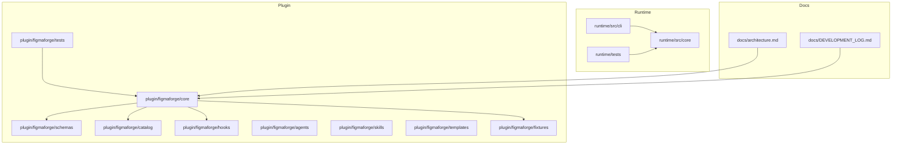
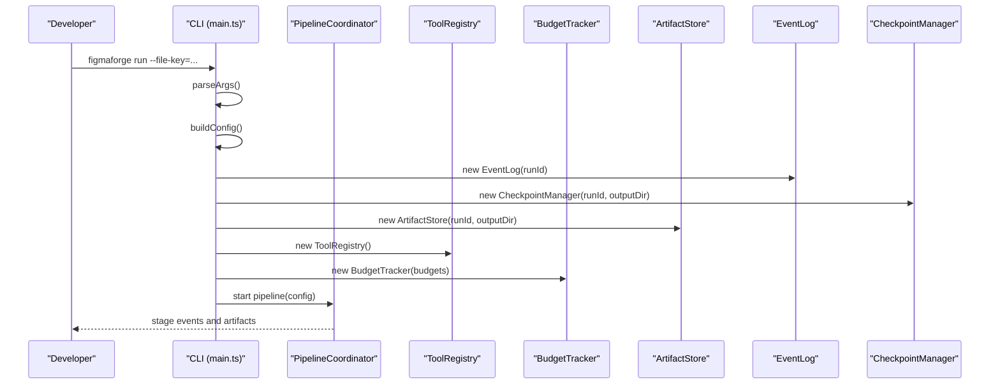
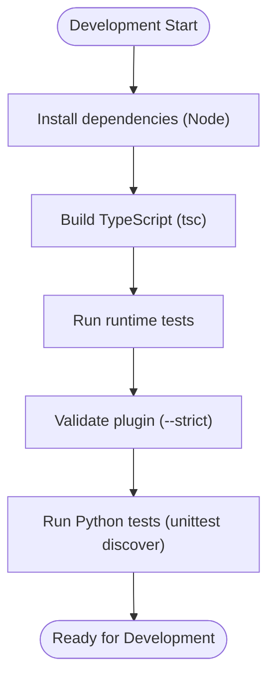
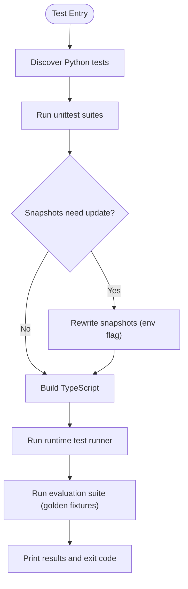
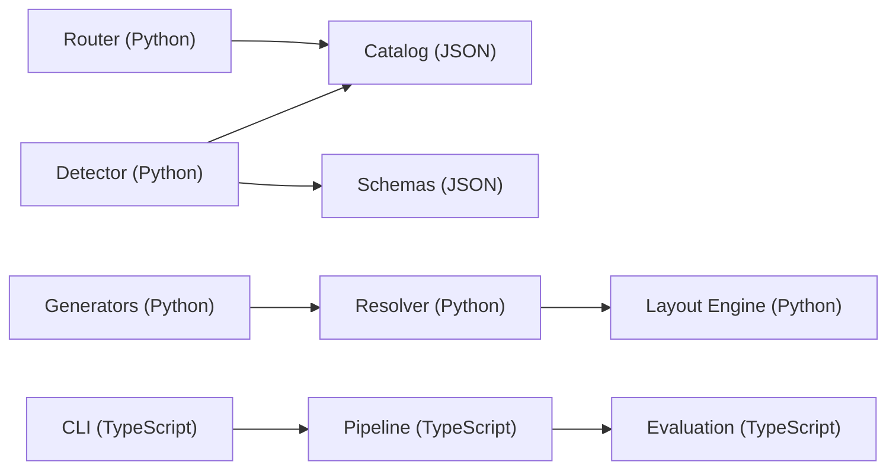

# Development Guide

<cite>
**Referenced Files in This Document**
- [README.md](file://README.md)
- [CLAUDE.md](file://CLAUDE.md)
- [plugin.json](file://plugin/figmaforge/.claude-plugin/plugin.json)
- [package.json](file://runtime/package.json)
- [tsconfig.json](file://tsconfig.json)
- [detector.py](file://plugin/figmaforge/core/detector.py)
- [test_detector.py](file://plugin/figmaforge/tests/test_detector.py)
- [test_integration.py](file://plugin/figmaforge/tests/test_integration.py)
- [test_router.py](file://plugin/figmaforge/tests/test_router.py)
- [run_all.ts](file://runtime/tests/run_all.ts)
- [test_framework.ts](file://runtime/tests/test_framework.ts)
- [main.ts](file://runtime/src/cli/main.ts)
- [evaluation.ts](file://runtime/src/core/evaluation.ts)
- [architecture.md](file://docs/architecture.md)
- [DEVELOPMENT_LOG.md](file://docs/DEVELOPMENT_LOG.md)
</cite>

## Table of Contents
1. [Introduction](#introduction)
2. [Project Structure](#project-structure)
3. [Core Components](#core-components)
4. [Architecture Overview](#architecture-overview)
5. [Detailed Component Analysis](#detailed-component-analysis)
6. [Dependency Analysis](#dependency-analysis)
7. [Performance Considerations](#performance-considerations)
8. [Troubleshooting Guide](#troubleshooting-guide)
9. [Conclusion](#conclusion)
10. [Appendices](#appendices)

## Introduction
This guide explains how to set up a local development environment, build and test FigmaForge, follow code standards, contribute via pull requests, debug issues, and extend the platform with custom detectors, routers, generators, and hooks. It also covers documentation standards, release procedures, common tasks, and troubleshooting tips.

FigmaForge is implemented as a Claude Code plugin with:
- A Python core for detection, routing, lifecycle state, hooks, design IR, layout engine, and code generation
- A TypeScript runtime for orchestration, evaluation, and CLI commands
- Extensive tests (Python unittest and a minimal TypeScript test framework)
- Deterministic golden-file snapshot testing for generator outputs

## Project Structure
At a high level:
- plugin/figmaforge: Plugin root containing Python core modules, schemas, catalogs, agents, skills, hooks, templates, fixtures, and tests
- runtime: TypeScript orchestration runtime with CLI, core modules, evaluation harness, and tests
- docs: Architecture and module-specific design documents
- Root configuration files for TypeScript compilation and plugin metadata

**Diagram sources**
- [plugin.json:1-21](file://plugin/figmaforge/.claude-plugin/plugin.json#L1-L21)
- [main.ts:1-200](file://runtime/src/cli/main.ts#L1-L200)
- [architecture.md:318-348](file://docs/architecture.md#L318-L348)

**Section sources**
- [README.md:183-254](file://README.md#L183-L254)
- [CLAUDE.md:19-53](file://CLAUDE.md#L19-L53)

## Core Components
Key components you will interact with during development:
- Detector: Evidence-based repository stack detection using file patterns and manifests
- Router: Deterministic role selection and scoring based on signals and catalog roles
- Catalog: 100 roles across 10 domains used by the router
- State Machine: Lifecycle management with atomic transitions
- Hooks: SessionStart detector, PreToolUse mutation gate, PostToolUse validator
- Design IR & Resolver: Normalized Figma design IR and component/token resolution
- Layout Engine: Responsive constraint solver and breakpoints
- Generators: React and CSS output from resolved design IR
- Runtime CLI: Orchestration commands (run, inspect, render, compare, repair, replay)

**Section sources**
- [README.md:86-115](file://README.md#L86-L115)
- [CLAUDE.md:26-43](file://CLAUDE.md#L26-L43)
- [architecture.md:318-348](file://docs/architecture.md#L318-L348)

## Architecture Overview
The system integrates a Python plugin core with a TypeScript runtime. The CLI orchestrates pipeline stages, while the plugin core performs detection, routing, lifecycle management, and code generation.

**Diagram sources**
- [main.ts:1-200](file://runtime/src/cli/main.ts#L1-L200)
- [evaluation.ts:361-389](file://runtime/src/core/evaluation.ts#L361-L389)

## Detailed Component Analysis

### Local Development Environment Setup
- Prerequisites:
  - Claude Code CLI installed
  - Python 3.8+ available on PATH
  - Node.js >= 20.0.0 for the runtime
- Validate plugin structure:
  - Run plugin validation command against the plugin directory
- Load plugin in development mode:
  - Use the plugin directory flag when launching Claude Code
- Verify Python tests:
  - Run detector tests or full test discovery from the plugin directory
- Build and run runtime tests:
  - Compile TypeScript and execute the runtime test runner

**Section sources**
- [README.md:24-53](file://README.md#L24-L53)
- [CLAUDE.md:66-83](file://CLAUDE.md#L66-L83)
- [package.json:1-23](file://runtime/package.json#L1-L23)
- [tsconfig.json:1-26](file://tsconfig.json#L1-L26)

### Build Processes
- Python plugin:
  - No external dependencies; standard library only
  - Tests executed via unittest discover
- TypeScript runtime:
  - Compilation target ES2022 with Node16 module resolution
  - Output directory dist with source maps and declarations enabled
  - Scripts: build (tsc), test (execute compiled test runner), figmaforge (CLI entry)

**Diagram sources**
- [package.json:9-17](file://runtime/package.json#L9-L17)
- [tsconfig.json:1-26](file://tsconfig.json#L1-L26)
- [CLAUDE.md:66-83](file://CLAUDE.md#L66-L83)

**Section sources**
- [package.json:1-23](file://runtime/package.json#L1-L23)
- [tsconfig.json:1-26](file://tsconfig.json#L1-L26)
- [CLAUDE.md:66-83](file://CLAUDE.md#L66-L83)

### Testing Procedures
- Python tests:
  - Discover and run all tests under plugin/figmaforge/tests
  - Run specific test modules for focused debugging
  - Regenerate golden snapshots when intentional output changes occur
- Runtime tests:
  - Custom minimal test framework with describe/runSuite/assert utilities
  - Test runner aggregates suite results and prints pass/fail counts
  - Evaluation harness runs golden fixtures and reports metrics

**Diagram sources**
- [test_framework.ts:1-176](file://runtime/tests/test_framework.ts#L1-L176)
- [run_all.ts:1-24](file://runtime/tests/run_all.ts#L1-L24)
- [evaluation.ts:361-389](file://runtime/src/core/evaluation.ts#L361-L389)
- [CLAUDE.md:66-83](file://CLAUDE.md#L66-L83)

**Section sources**
- [CLAUDE.md:92-99](file://CLAUDE.md#L92-L99)
- [test_detector.py:1-60](file://plugin/figmaforge/tests/test_detector.py#L1-L60)
- [test_integration.py:1-47](file://plugin/figmaforge/tests/test_integration.py#L1-L47)
- [test_router.py:1-69](file://plugin/figmaforge/tests/test_router.py#L1-L69)

### Code Standards
- Reuse constraints:
  - No new libraries or frameworks beyond Python stdlib and TypeScript Node stdlib
- Architecture stability:
  - Keep catalog format static unless an RFC is approved
- Evidence over inference:
  - Detection relies on explicit JSON/manifest signals
- Atomic operations:
  - Lifecycle state writes must be atomic
- Safety rules:
  - External mutation gates prevent unintended destructive actions
  - Templates remain inert without secrets or active pathways

**Section sources**
- [CLAUDE.md:85-107](file://CLAUDE.md#L85-L107)
- [architecture.md:318-348](file://docs/architecture.md#L318-L348)

### Pull Request Process and Contribution Guidelines
- Discuss architecture impact before making changes
- Run full test suite locally (Python and TypeScript)
- Make atomic, minimal coherent changes aligned with schemas
- Verify all tests pass and regenerate snapshots if outputs intentionally changed
- Update development log with change entries
- Ensure no exposed credentials or accidental active configurations

**Section sources**
- [CLAUDE.md:108-123](file://CLAUDE.md#L108-L123)

### Debugging Techniques and Development Tools
- CLI commands:
  - Use the runtime CLI to run, inspect, render, compare, repair, and replay pipelines
  - Flags support thresholds, budgets, viewport sizes, approval toggles, and verbose logging
- Event logs and checkpoints:
  - Inspect previous runs via event logs and checkpoints
- Snapshot testing:
  - Use environment flags to rewrite golden snapshots after intentional changes
- Hook inspection:
  - Review hook behavior for session detection, mutation gating, and post-edit validation

**Section sources**
- [main.ts:1-200](file://runtime/src/cli/main.ts#L1-L200)
- [CLAUDE.md:66-83](file://CLAUDE.md#L66-L83)
- [architecture.md:318-348](file://docs/architecture.md#L318-L348)

### Workflow Recommendations
- Start with detector and router tests to validate environment and signals
- Use integration tests to verify detector-catalog-router interactions
- For generator changes, update and re-run snapshot tests
- When extending hooks, ensure safety invariants are preserved
- Prefer small, focused commits with clear rationale and updated logs

**Section sources**
- [test_integration.py:1-47](file://plugin/figmaforge/tests/test_integration.py#L1-L47)
- [test_router.py:1-69](file://plugin/figmaforge/tests/test_router.py#L1-L69)
- [DEVELOPMENT_LOG.md:29-69](file://docs/DEVELOPMENT_LOG.md#L29-L69)

### Extending the Platform

#### Custom Detectors
- Add new language/framework patterns to detection logic
- Ensure patterns match existing evidence-based approach
- Write unit tests for new patterns and integrate into detector tests

**Section sources**
- [detector.py:50-77](file://plugin/figmaforge/core/detector.py#L50-L77)
- [detector.py:167-206](file://plugin/figmaforge/core/detector.py#L167-L206)
- [test_detector.py:1-60](file://plugin/figmaforge/tests/test_detector.py#L1-L60)

#### Custom Routers
- Extend trigger-to-phase mappings and language-to-domain mappings
- Adjust scoring logic to incorporate new signals
- Validate with router tests focusing on phase-match and signal-match scoring

**Section sources**
- [test_router.py:1-69](file://plugin/figmaforge/tests/test_router.py#L1-L69)
- [DEVELOPMENT_LOG.md:29-69](file://docs/DEVELOPMENT_LOG.md#L29-L69)

#### Custom Generators
- Implement new generators adhering to generator types and VNode protocol
- Use golden-file snapshots to assert deterministic output
- Integrate with resolver and layout engine outputs

**Section sources**
- [CLAUDE.md:26-43](file://CLAUDE.md#L26-L43)
- [CLAUDE.md:66-83](file://CLAUDE.md#L66-L83)

#### Custom Hooks
- Follow hook contracts defined in hooks mapping
- Ensure safety invariants (no automatic approvals, no secret exposure)
- Test hooks with integration scenarios and verify non-blocking behavior

**Section sources**
- [architecture.md:318-348](file://docs/architecture.md#L318-L348)
- [CLAUDE.md:101-107](file://CLAUDE.md#L101-L107)

### Code Review Processes
- Verify schema compliance using plugin validation
- Confirm all tests pass and snapshots are current
- Ensure changes align with architectural constraints
- Review safety rules and hook behaviors
- Update development log with verified routines

**Section sources**
- [CLAUDE.md:92-123](file://CLAUDE.md#L92-L123)

### Documentation Standards
- Maintain clarity and accuracy in architecture and module docs
- Keep development log updated with decisions and verification steps
- Avoid speculative integrations; stick to verified routines
- Preserve safety invariants and template inertness

**Section sources**
- [CLAUDE.md:108-123](file://CLAUDE.md#L108-L123)
- [DEVELOPMENT_LOG.md:29-69](file://docs/DEVELOPMENT_LOG.md#L29-L69)

### Release Procedures
- Validate plugin structure and schemas
- Run full test suites (Python and TypeScript)
- Ensure golden snapshots are current
- Confirm CLI commands work as expected
- Update version metadata in plugin manifest and package files

**Section sources**
- [plugin.json:1-21](file://plugin/figmaforge/.claude-plugin/plugin.json#L1-L21)
- [package.json:1-23](file://runtime/package.json#L1-L23)
- [CLAUDE.md:66-83](file://CLAUDE.md#L66-L83)

## Dependency Analysis
- Python core depends on:
  - Standard library modules for detection, routing, lifecycle, and generation
  - JSON schemas for validation
  - Catalog roles for routing decisions
- TypeScript runtime depends on:
  - Node.js stdlib
  - Compiled TypeScript modules
  - Evaluation harness and golden fixtures

**Diagram sources**
- [detector.py:50-77](file://plugin/figmaforge/core/detector.py#L50-L77)
- [main.ts:1-200](file://runtime/src/cli/main.ts#L1-L200)
- [evaluation.ts:361-389](file://runtime/src/core/evaluation.ts#L361-L389)

**Section sources**
- [CLAUDE.md:26-43](file://CLAUDE.md#L26-L43)
- [architecture.md:318-348](file://docs/architecture.md#L318-L348)

## Performance Considerations
- Prefer deterministic algorithms and avoid unnecessary recomputation
- Use golden snapshots to catch regressions early
- Keep detection patterns efficient and scoped to relevant files
- Limit runtime budgets and iterations to control resource usage
- Leverage checkpoints to resume long-running pipelines efficiently

[No sources needed since this section provides general guidance]

## Troubleshooting Guide
Common issues and resolutions:
- Detector initialization failures:
  - Ensure Python path and environment are correct
  - Validate detection patterns exist and match repository structure
- Router scoring anomalies:
  - Verify trigger-to-phase and language-to-domain mappings
  - Check penalty logic and cached detection results
- Generator output mismatches:
  - Regenerate snapshots after intentional changes
  - Validate sizing modes and grid properties emission
- Runtime test failures:
  - Rebuild TypeScript and rerun the test runner
  - Inspect evaluation suite results and golden fixture configs

**Section sources**
- [test_detector.py:1-60](file://plugin/figmaforge/tests/test_detector.py#L1-L60)
- [test_router.py:1-69](file://plugin/figmaforge/tests/test_router.py#L1-L69)
- [DEVELOPMENT_LOG.md:29-69](file://docs/DEVELOPMENT_LOG.md#L29-L69)
- [run_all.ts:1-24](file://runtime/tests/run_all.ts#L1-L24)
- [test_framework.ts:1-176](file://runtime/tests/test_framework.ts#L1-L176)

## Conclusion
FigmaForge provides a robust, extensible platform for adaptive engineering workflows. By following the setup, build, testing, and contribution guidelines outlined here, developers can confidently extend detectors, routers, generators, and hooks while maintaining safety and performance. Use the CLI and evaluation harness to iterate quickly, rely on golden snapshots for regression protection, and keep documentation and logs current to support collaborative development.

[No sources needed since this section summarizes without analyzing specific files]

## Appendices

### Common Development Tasks
- Set up environment and validate plugin
- Run full test suites and regenerate snapshots
- Execute CLI commands for pipeline runs and inspections
- Extend detection patterns and router mappings
- Implement new generators and validate outputs

**Section sources**
- [README.md:24-83](file://README.md#L24-L83)
- [CLAUDE.md:66-83](file://CLAUDE.md#L66-L83)
- [main.ts:1-200](file://runtime/src/cli/main.ts#L1-L200)