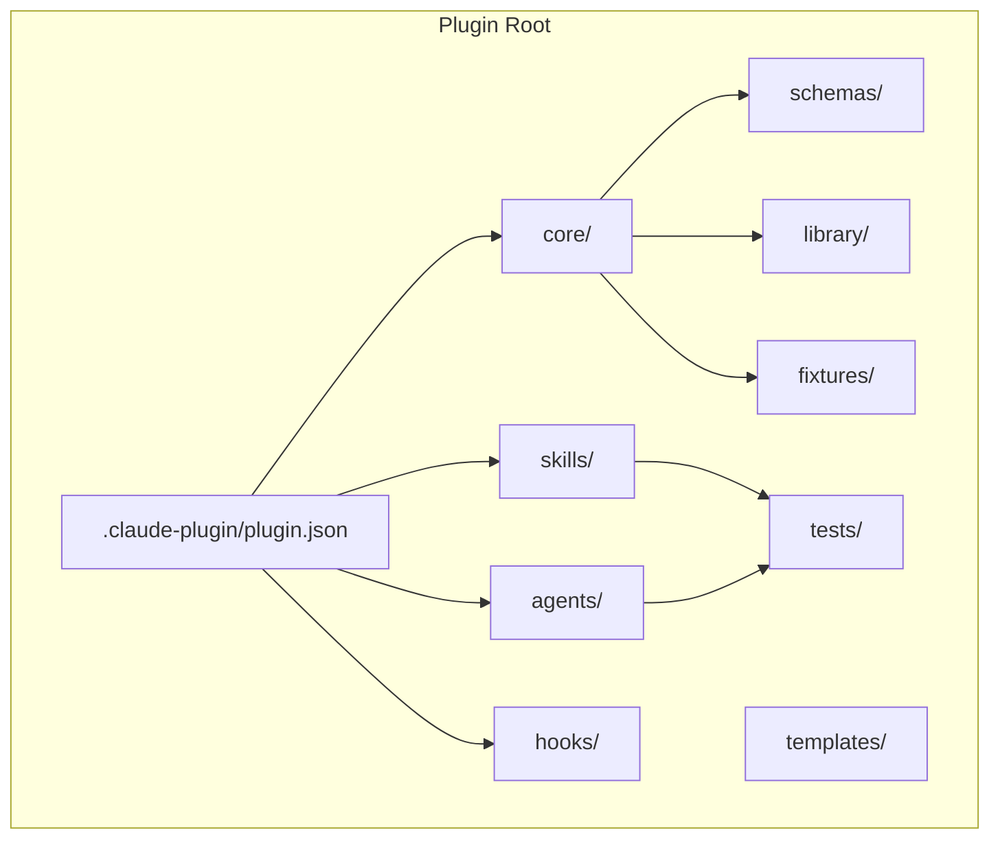
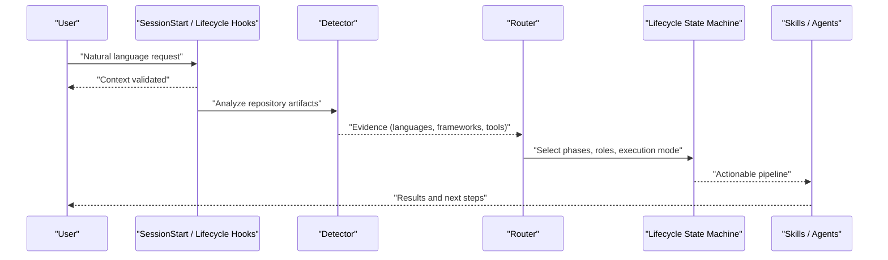
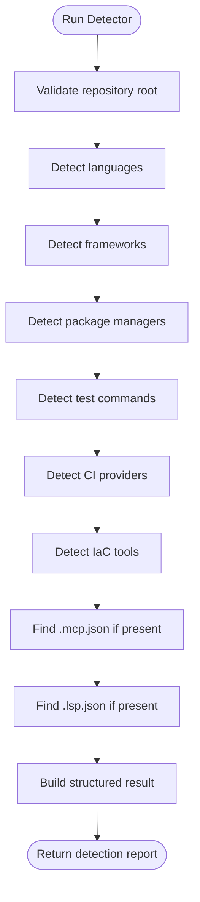
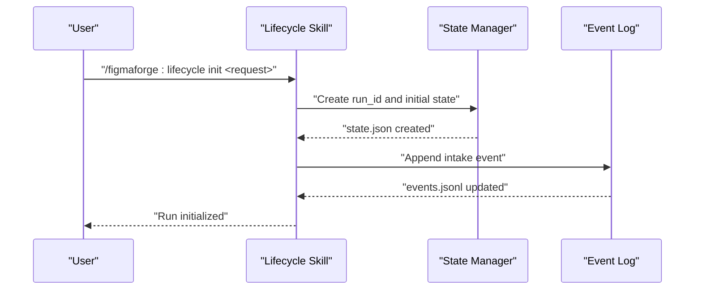
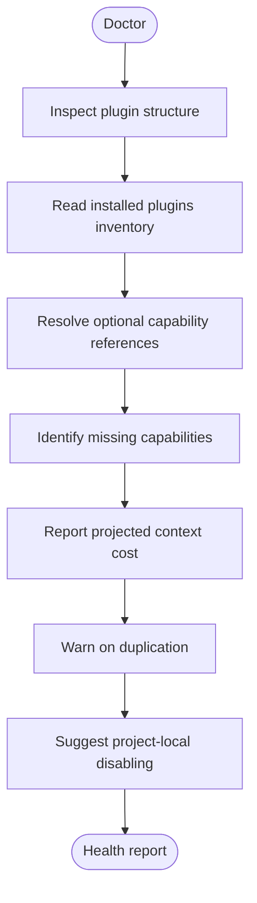
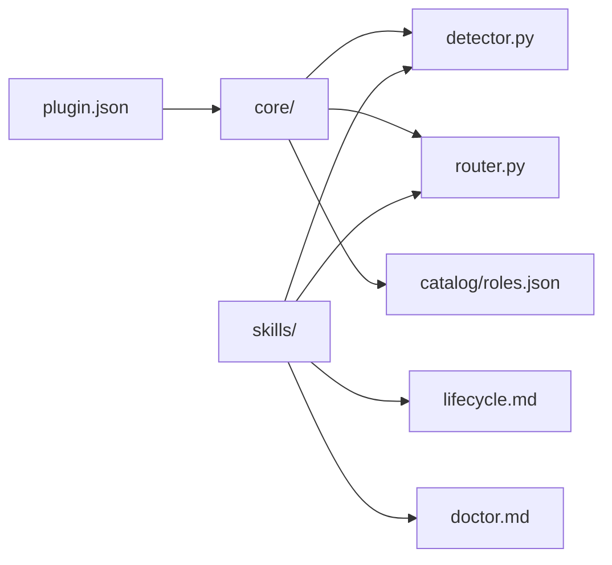

# Getting Started

<cite>
**Referenced Files in This Document**
- [README.md](file://README.md)
- [CLAUDE.md](file://CLAUDE.md)
- [plugin.json](file://plugin/figmaforge/.claude-plugin/plugin.json)
- [route.md](file://plugin/figmaforge/skills/route.md)
- [lifecycle.md](file://plugin/figmaforge/skills/lifecycle.md)
- [doctor.md](file://plugin/figmaforge/skills/doctor.md)
- [demo.md](file://plugin/figmaforge/skills/demo.md)
- [detector.py](file://plugin/figmaforge/core/detector.py)
- [architecture.md](file://docs/architecture.md)
</cite>

## Table of Contents
1. [Introduction](#introduction)
2. [Project Structure](#project-structure)
3. [Core Components](#core-components)
4. [Architecture Overview](#architecture-overview)
5. [Detailed Component Analysis](#detailed-component-analysis)
6. [Dependency Analysis](#dependency-analysis)
7. [Performance Considerations](#performance-considerations)
8. [Troubleshooting Guide](#troubleshooting-guide)
9. [Conclusion](#conclusion)
10. [Appendices](#appendices)

## Introduction
FigmaForge is a technology-agnostic, adaptive, full-lifecycle Claude Code engineering platform. It detects stack-specific signals from your repository and routes requests to appropriate capabilities without requiring per-repo authoring of agents, skills, or workflows. It also converts normalized Figma design IR into framework-neutral layout plans and generates production-quality React/CSS output.

At a high level:
- You provide a natural-language request.
- The platform inspects your repository for evidence (manifests, configs, source files).
- A deterministic router selects phases, roles, and execution mode.
- A 10-phase lifecycle manages state atomically with append-only events.
- Skills and agents guide you through routing, lifecycle management, health checks, and demos.

This guide helps you install FigmaForge, validate the plugin, run core commands, and get productive quickly.

**Section sources**
- [README.md:1-30](file://README.md#L1-L30)
- [CLAUDE.md:1-18](file://CLAUDE.md#L1-L18)

## Project Structure
FigmaForge is implemented as a Claude Code plugin under plugin/figmaforge. Key areas include:
- Core Python modules for detection, routing, lifecycle, and code generation
- Skills that expose commands like route, lifecycle, doctor, and demo
- Agents that plan and verify work
- Schemas and templates for safe configuration
- Tests and fixtures for validation

**Diagram sources**
- [plugin.json:1-21](file://plugin/figmaforge/.claude-plugin/plugin.json#L1-L21)
- [CLAUDE.md:19-55](file://CLAUDE.md#L19-L55)

**Section sources**
- [CLAUDE.md:19-55](file://CLAUDE.md#L19-L55)

## Core Components
- Detector: Evidence-based repository stack detection using file patterns and manifests.
- Router: Deterministic scoring to select phases, roles, and execution mode.
- Lifecycle: 10-phase state machine with atomic writes and append-only event logs.
- Skills: Commands for routing, lifecycle management, health checks, and demos.
- Generators: Convert normalized Figma design IR into framework-neutral layout plans and produce React/CSS output.

These components work together to turn your request into an actionable, safe, and verifiable workflow.

**Section sources**
- [detector.py:1-200](file://plugin/figmaforge/core/detector.py#L1-L200)
- [architecture.md:65-163](file://docs/architecture.md#L65-L163)
- [route.md:1-29](file://plugin/figmaforge/skills/route.md#L1-L29)
- [lifecycle.md:1-27](file://plugin/figmaforge/skills/lifecycle.md#L1-L27)

## Architecture Overview
The runtime flow starts with a user request, runs hooks, executes detector and router, then drives the lifecycle state machine to deliver outputs safely.

**Diagram sources**
- [architecture.md:21-63](file://docs/architecture.md#L21-L63)
- [CLAUDE.md:57-64](file://CLAUDE.md#L57-L64)

## Detailed Component Analysis

### Installation Prerequisites
Ensure these are available on your system:
- Claude Code CLI installed
- Python 3.8+ available on PATH
- Git repository (optional but recommended)

These prerequisites enable plugin validation, running detectors, and executing tests.

**Section sources**
- [README.md:24-31](file://README.md#L24-L31)

### Step-by-Step Installation
1. Navigate to the FigmaForge directory.
2. Validate the plugin structure with strict mode.
3. Load the plugin in development mode via Claude Code.
4. Test the detector by running its test module.

Example commands:
- Validate plugin: claude plugin validate --strict plugin/figmaforge
- Load plugin: claude --plugin-dir ./plugin/figmaforge
- Run detector test: python3 plugin/figmaforge/tests/test_detector.py

These steps confirm the plugin is correctly structured and ready for use.

**Section sources**
- [README.md:32-53](file://README.md#L32-L53)
- [CLAUDE.md:66-83](file://CLAUDE.md#L66-L83)

### Quick Start Examples
Use these common commands to explore FigmaForge:

- Route a request:
  - claude --plugin-dir ./plugin/figmaforge -p '/figmaforge:route Design a secure, testable CLI feature'
- Run the detector:
  - cd /path/to/your/repo && python3 plugin/figmaforge/core/detector.py
- Initialize lifecycle:
  - Use the lifecycle skill: /figmaforge:lifecycle init "Build user authentication"
- Check plugin health:
  - /figmaforge:doctor

These commands demonstrate routing, detection, lifecycle initialization, and health inspection.

**Section sources**
- [README.md:56-82](file://README.md#L56-L82)
- [route.md:8-29](file://plugin/figmaforge/skills/route.md#L8-L29)
- [lifecycle.md:8-27](file://plugin/figmaforge/skills/lifecycle.md#L8-L27)
- [doctor.md:8-29](file://plugin/figmaforge/skills/doctor.md#L8-L29)

### Basic Usage Patterns
- Routing: Provide a natural-language request; the route skill uses detector evidence and catalog roles to select phases and roles deterministically.
- Lifecycle: Create or advance a task run; transitions are evidence-driven and stored atomically with append-only events.
- Health: Inspect plugin structure, context cost, dependencies, and dormant integrations without modifying anything.
- Demo: Run a bounded offline demo that validates plugin structure, runs detection, exercises routing and lifecycle, and verifies MCP/LSP templates remain inert.

These patterns help you integrate FigmaForge into daily workflows safely and predictably.

**Section sources**
- [route.md:8-29](file://plugin/figmaforge/skills/route.md#L8-L29)
- [lifecycle.md:8-27](file://plugin/figmaforge/skills/lifecycle.md#L8-L27)
- [doctor.md:8-29](file://plugin/figmaforge/skills/doctor.md#L8-L29)
- [demo.md:8-35](file://plugin/figmaforge/skills/demo.md#L8-L35)

### Running the Detector
The detector inspects repository artifacts to identify languages, frameworks, package managers, test frameworks, CI providers, IaC tools, and existing MCP/LSP configurations. It returns a structured result including status, confidence, and evidence.

**Diagram sources**
- [detector.py:122-200](file://plugin/figmaforge/core/detector.py#L122-L200)

**Section sources**
- [detector.py:1-200](file://plugin/figmaforge/core/detector.py#L1-L200)

### Initializing Lifecycle
The lifecycle skill creates or advances a task run with evidence-driven transitions across intake, discover, define, design, plan, implement, verify, release, operate, and learn. State is written atomically and events are appended to a log.

**Diagram sources**
- [lifecycle.md:8-27](file://plugin/figmaforge/skills/lifecycle.md#L8-L27)
- [architecture.md:139-163](file://docs/architecture.md#L139-L163)

**Section sources**
- [lifecycle.md:8-27](file://plugin/figmaforge/skills/lifecycle.md#L8-L27)
- [architecture.md:139-163](file://docs/architecture.md#L139-L163)

### Checking Plugin Health
The doctor skill inspects plugin structure, reads installed plugins inventory, resolves optional capability references, identifies missing capabilities, reports projected context cost, warns on duplication, and suggests project-local disabling of unrelated user plugins. All operations are read-only.

**Diagram sources**
- [doctor.md:8-29](file://plugin/figmaforge/skills/doctor.md#L8-L29)

**Section sources**
- [doctor.md:8-29](file://plugin/figmaforge/skills/doctor.md#L8-L29)

## Dependency Analysis
FigmaForge’s plugin metadata declares identity and keywords for discovery. The core modules depend on Python standard library only, ensuring minimal external dependencies. Skills reference detector and catalog data to produce deterministic outputs.

**Diagram sources**
- [plugin.json:1-21](file://plugin/figmaforge/.claude-plugin/plugin.json#L1-L21)
- [CLAUDE.md:19-55](file://CLAUDE.md#L19-L55)

**Section sources**
- [plugin.json:1-21](file://plugin/figmaforge/.claude-plugin/plugin.json#L1-L21)
- [CLAUDE.md:19-55](file://CLAUDE.md#L19-L55)

## Performance Considerations
- Keep detector thresholds reasonable to avoid excessive scanning.
- Prefer targeted routing requests to reduce role scoring overhead.
- Use the doctor skill to understand projected context cost and avoid unnecessary plugin interactions.
- Reuse lifecycle runs when iterating on related tasks to minimize repeated setup.

[No sources needed since this section provides general guidance]

## Troubleshooting Guide
Common issues and resolutions:
- Plugin validation fails: Ensure the plugin directory path is correct and the Claude Code CLI is installed.
- Detector not finding expected signals: Verify repository contains manifest files or source patterns the detector recognizes.
- Lifecycle transitions blocked: Ensure required evidence exists before advancing phases; review state and events for missing requirements.
- Health report shows missing capabilities: These are optional; routing will continue gracefully without them.

For deeper diagnostics:
- Run the detector directly against your repository root.
- Use the doctor skill to inspect plugin structure and context cost.
- Review architecture documentation for phase constraints and approval gates.

**Section sources**
- [detector.py:122-200](file://plugin/figmaforge/core/detector.py#L122-L200)
- [doctor.md:8-29](file://plugin/figmaforge/skills/doctor.md#L8-L29)
- [architecture.md:139-163](file://docs/architecture.md#L139-L163)

## Conclusion
You now have the essentials to install FigmaForge, validate the plugin, run core commands, and begin using routing, lifecycle, and health features. Explore the demo skill for a bounded offline walkthrough, and consult the architecture document for deeper understanding of phases, roles, and safety invariants. Next steps include experimenting with real repositories, extending generators, and integrating MCP/LSP templates safely.

[No sources needed since this section summarizes without analyzing specific files]

## Appendices

### Quick Command Reference
- Validate plugin: claude plugin validate --strict plugin/figmaforge
- Load plugin: claude --plugin-dir ./plugin/figmaforge
- Route request: claude --plugin-dir ./plugin/figmaforge -p '/figmaforge:route <request>'
- Run detector: python3 plugin/figmaforge/core/detector.py
- Initialize lifecycle: /figmaforge:lifecycle init "<request>"
- Check health: /figmaforge:doctor
- Run demo: /figmaforge:demo

**Section sources**
- [README.md:32-82](file://README.md#L32-L82)
- [CLAUDE.md:66-83](file://CLAUDE.md#L66-L83)
- [demo.md:8-35](file://plugin/figmaforge/skills/demo.md#L8-L35)