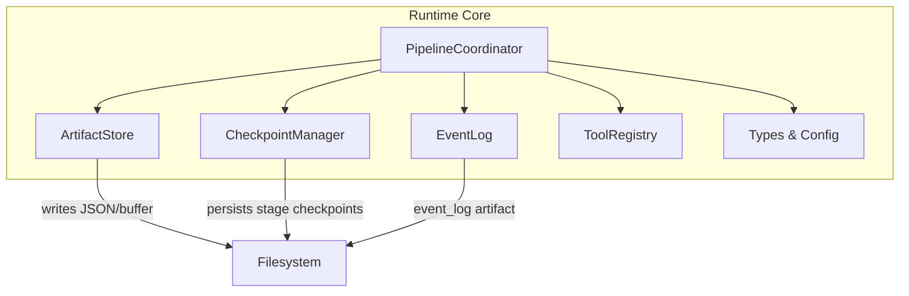
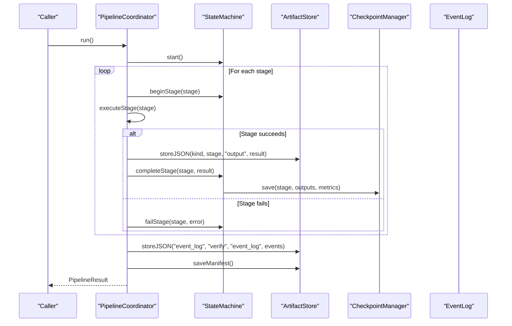
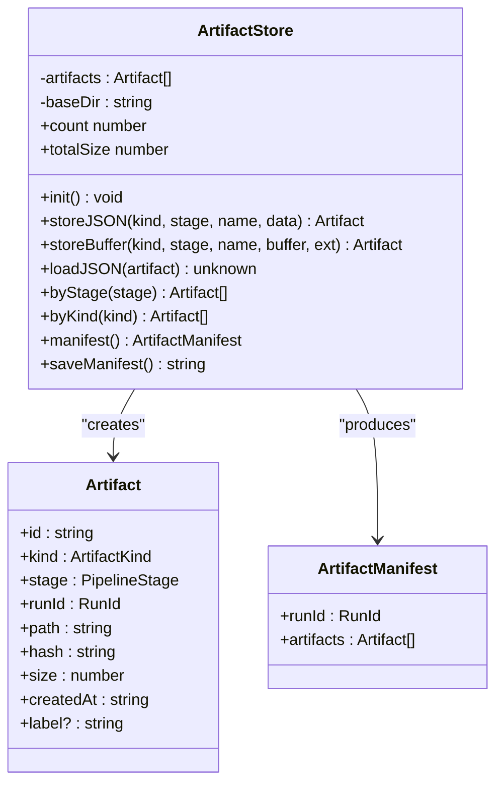
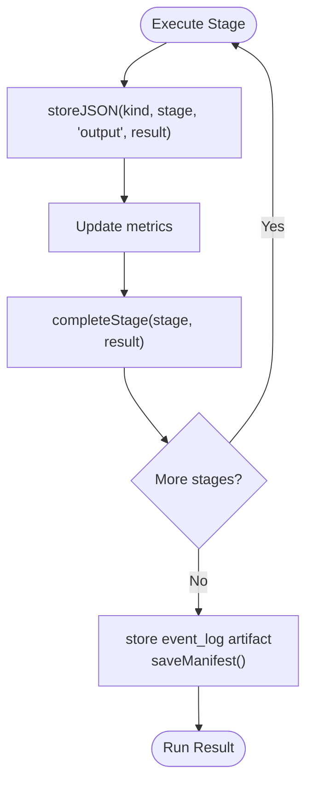
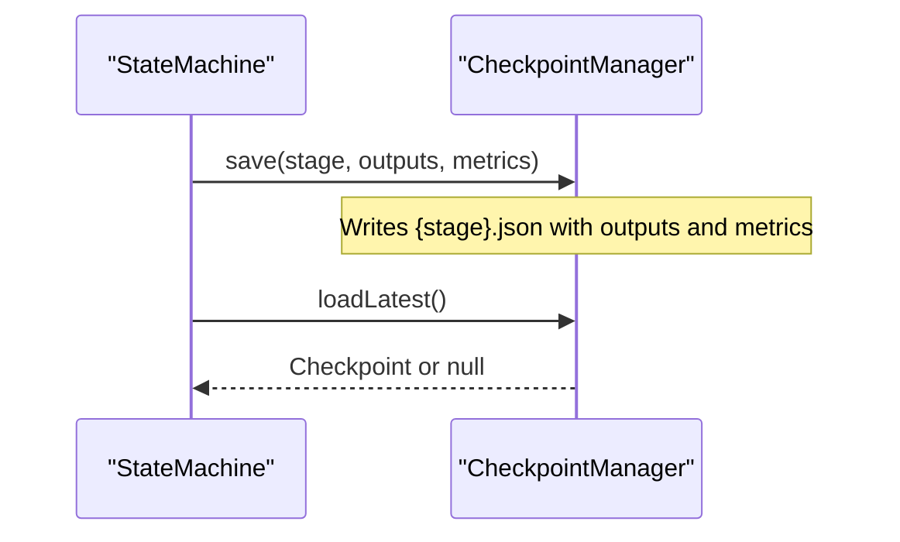
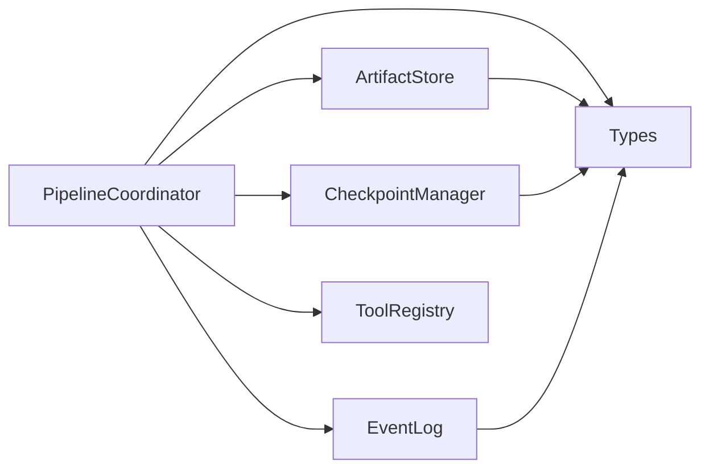

# Artifact Management

<cite>
**Referenced Files in This Document**
- [artifacts.ts](file://runtime/src/core/artifacts.ts)
- [pipeline.ts](file://runtime/src/core/pipeline.ts)
- [checkpoint.ts](file://runtime/src/core/checkpoint.ts)
- [types.ts](file://runtime/src/core/types.ts)
- [events.ts](file://runtime/src/core/events.ts)
- [tools.ts](file://runtime/src/core/tools.ts)
</cite>

## Table of Contents
1. [Introduction](#introduction)
2. [Project Structure](#project-structure)
3. [Core Components](#core-components)
4. [Architecture Overview](#architecture-overview)
5. [Detailed Component Analysis](#detailed-component-analysis)
6. [Dependency Analysis](#dependency-analysis)
7. [Performance Considerations](#performance-considerations)
8. [Troubleshooting Guide](#troubleshooting-guide)
9. [Conclusion](#conclusion)
10. [Appendices](#appendices)

## Introduction
This document explains FigmaForge’s artifact management system: how artifacts are versioned, stored, retrieved, and tracked throughout the pipeline lifecycle. It focuses on the ArtifactStore class, metadata tracking for provenance and relationships, storage strategies (local filesystem organization and naming), retrieval and filtering capabilities, lifecycle management, cleanup policies, performance considerations for large artifacts, concurrent access patterns, and backup/restore procedures.

## Project Structure
The artifact system is implemented in the runtime core module. Key files include:
- Artifacts: content-addressed storage with JSON and binary support, manifest generation, and querying by stage or kind.
- Pipeline: orchestrates stages, persists outputs as artifacts, and finalizes event logs and manifests.
- Checkpoints: resumability via per-stage checkpoints that capture outputs and metrics.
- Types: defines pipeline stages, run identifiers, and configuration used across components.
- Events: structured audit log capturing artifact-related events and pipeline transitions.
- Tools: tool registry and execution context that can write artifacts indirectly through tools.

**Diagram sources**
- [pipeline.ts:82-207](file://runtime/src/core/pipeline.ts#L82-L207)
- [artifacts.ts:65-175](file://runtime/src/core/artifacts.ts#L65-L175)
- [checkpoint.ts:57-163](file://runtime/src/core/checkpoint.ts#L57-L163)
- [events.ts:66-138](file://runtime/src/core/events.ts#L66-L138)
- [types.ts:12-24](file://runtime/src/core/types.ts#L12-L24)

**Section sources**
- [pipeline.ts:1-329](file://runtime/src/core/pipeline.ts#L1-L329)
- [artifacts.ts:1-176](file://runtime/src/core/artifacts.ts#L1-L176)
- [checkpoint.ts:1-165](file://runtime/src/core/checkpoint.ts#L1-L165)
- [types.ts:1-295](file://runtime/src/core/types.ts#L1-L295)
- [events.ts:1-138](file://runtime/src/core/events.ts#L1-L138)
- [tools.ts:1-203](file://runtime/src/core/tools.ts#L1-L203)

## Core Components
- ArtifactStore: content-addressed storage for JSON and binary artifacts under a run-scoped directory; maintains an in-memory index and writes a manifest file.
- PipelineCoordinator: executes pipeline stages, stores each stage’s output as an artifact, and finalizes the event log and manifest.
- CheckpointManager: persists per-stage checkpoints to enable resuming runs from the latest valid checkpoint.
- EventLog: append-only structured log of all actions, including artifact events.
- ToolRegistry: typed tool interface and Python bridge that can participate in artifact creation via tools.

Key responsibilities:
- Versioning: artifacts are identified by content hash (SHA-256 prefix) ensuring deterministic versions.
- Storage: local filesystem under outputDir/runId/artifacts with stage-prefixed filenames.
- Retrieval: loadJSON by artifact reference; query by stage or kind; manifest export for full inventory.
- Metadata: Artifact includes kind, stage, runId, path, hash, size, createdAt, label; manifest aggregates all artifacts per run.

**Section sources**
- [artifacts.ts:18-59](file://runtime/src/core/artifacts.ts#L18-L59)
- [artifacts.ts:65-175](file://runtime/src/core/artifacts.ts#L65-L175)
- [pipeline.ts:137-207](file://runtime/src/core/pipeline.ts#L137-L207)
- [checkpoint.ts:20-43](file://runtime/src/core/checkpoint.ts#L20-L43)
- [events.ts:16-39](file://runtime/src/core/events.ts#L16-L39)

## Architecture Overview
The pipeline coordinates stages and uses ArtifactStore to persist outputs. Each stage produces data that is serialized and stored as an artifact with a content-based ID. The pipeline also saves checkpoints after each stage completes, enabling resume. At the end of a run, the event log is persisted as an artifact and the manifest is written to disk.

**Diagram sources**
- [pipeline.ts:137-207](file://runtime/src/core/pipeline.ts#L137-L207)
- [pipeline.ts:209-281](file://runtime/src/core/pipeline.ts#L209-L281)
- [state.ts:64-99](file://runtime/src/core/state.ts#L64-L99)
- [checkpoint.ts:72-98](file://runtime/src/core/checkpoint.ts#L72-L98)
- [artifacts.ts:81-107](file://runtime/src/core/artifacts.ts#L81-L107)
- [artifacts.ts:153-164](file://runtime/src/core/artifacts.ts#L153-L164)

## Detailed Component Analysis

### ArtifactStore: Storage, Versioning, and Retrieval
- Content addressing: SHA-256 hash of serialized content determines artifact id and filename suffix.
- Directory layout: baseDir = outputDir/runId/artifacts; files named {stage}_{name}_{hash}.{ext}.
- JSON storage: storeJSON serializes data, computes hash, writes file, records Artifact metadata, updates in-memory index.
- Binary storage: storeBuffer accepts Buffer, computes hash, writes file with extension, records metadata.
- Retrieval: loadJSON reads artifact by path relative to baseDir; byStage/byKind filter in-memory index; manifest returns full list; saveManifest writes manifest.json next to artifacts folder.
- Metadata fields: id, kind, stage, runId, path, hash, size, createdAt, optional label.

**Diagram sources**
- [artifacts.ts:18-59](file://runtime/src/core/artifacts.ts#L18-L59)
- [artifacts.ts:65-175](file://runtime/src/core/artifacts.ts#L65-L175)

**Section sources**
- [artifacts.ts:81-107](file://runtime/src/core/artifacts.ts#L81-L107)
- [artifacts.ts:109-135](file://runtime/src/core/artifacts.ts#L109-L135)
- [artifacts.ts:137-175](file://runtime/src/core/artifacts.ts#L137-L175)

### Pipeline Integration: Storing Outputs and Finalizing Artifacts
- Each stage’s output is stored as an artifact using storeJSON with kind mapped from stage.
- After all stages, the event log is stored as an artifact and the manifest is saved.
- Mapping between stages and artifact kinds ensures consistent categorization.

**Diagram sources**
- [pipeline.ts:209-281](file://runtime/src/core/pipeline.ts#L209-L281)
- [pipeline.ts:296-311](file://runtime/src/core/pipeline.ts#L296-L311)
- [pipeline.ts:202-207](file://runtime/src/core/pipeline.ts#L202-L207)

**Section sources**
- [pipeline.ts:137-207](file://runtime/src/core/pipeline.ts#L137-L207)
- [pipeline.ts:209-281](file://runtime/src/core/pipeline.ts#L209-L281)
- [pipeline.ts:296-311](file://runtime/src/core/pipeline.ts#L296-L311)

### Checkpoints: Resumability and State Persistence
- After each successful stage, a checkpoint is saved containing outputs and cumulative metrics.
- On restart, the latest valid checkpoint is loaded to resume from the appropriate stage.
- Checkpoints are stored per stage as JSON files under outputDir/runId/checkpoints.

**Diagram sources**
- [state.ts:82-99](file://runtime/src/core/state.ts#L82-L99)
- [checkpoint.ts:72-98](file://runtime/src/core/checkpoint.ts#L72-L98)
- [checkpoint.ts:100-125](file://runtime/src/core/checkpoint.ts#L100-L125)

**Section sources**
- [checkpoint.ts:20-43](file://runtime/src/core/checkpoint.ts#L20-L43)
- [checkpoint.ts:57-163](file://runtime/src/core/checkpoint.ts#L57-L163)
- [state.ts:189-206](file://runtime/src/core/state.ts#L189-L206)

### Events: Audit Trail and Provenance
- EventLog records every action with sequence numbers, timestamps, levels, and structured payloads.
- An event_log artifact is persisted at the end of the run for replay and debugging.
- Events include artifact_stored and other lifecycle markers to trace provenance.

**Section sources**
- [events.ts:16-39](file://runtime/src/core/events.ts#L16-L39)
- [events.ts:66-138](file://runtime/src/core/events.ts#L66-L138)
- [pipeline.ts:202-207](file://runtime/src/core/pipeline.ts#L202-L207)

### Tools: Indirect Artifact Creation
- ToolRegistry provides a typed interface for executing tools, including a Python bridge that can produce artifacts via scripts.
- Tools receive ToolContext with runId and outputDir, enabling them to write artifacts directly if needed.

**Section sources**
- [tools.ts:19-51](file://runtime/src/core/tools.ts#L19-L51)
- [tools.ts:66-130](file://runtime/src/core/tools.ts#L66-L130)
- [tools.ts:158-203](file://runtime/src/core/tools.ts#L158-L203)

## Dependency Analysis
- PipelineCoordinator depends on ArtifactStore, CheckpointManager, EventLog, ToolRegistry, and types.
- ArtifactStore depends on Node fs/path/crypto and types for ArtifactKind and PipelineStage.
- CheckpointManager depends on types for stage ordering and persistence paths.
- EventLog depends on types for run and stage identifiers.

**Diagram sources**
- [pipeline.ts:82-124](file://runtime/src/core/pipeline.ts#L82-L124)
- [artifacts.ts:9-12](file://runtime/src/core/artifacts.ts#L9-L12)
- [checkpoint.ts:11-14](file://runtime/src/core/checkpoint.ts#L11-L14)
- [events.ts:8-9](file://runtime/src/core/events.ts#L8-L9)

**Section sources**
- [pipeline.ts:82-124](file://runtime/src/core/pipeline.ts#L82-L124)
- [artifacts.ts:9-12](file://runtime/src/core/artifacts.ts#L9-L12)
- [checkpoint.ts:11-14](file://runtime/src/core/checkpoint.ts#L11-L14)
- [events.ts:8-9](file://runtime/src/core/events.ts#L8-L9)

## Performance Considerations
- Large artifacts:
  - Prefer storing binary buffers via storeBuffer to avoid double serialization overhead.
  - Use content addressing to deduplicate identical artifacts automatically.
  - Keep labels concise; consider compressing large JSON before storing if needed.
- Concurrent access:
  - ArtifactStore uses synchronous fs operations; ensure single-writer per run or serialize writes to avoid race conditions.
  - If multiple processes write to the same runId, coordinate via external locking or separate run directories.
- I/O patterns:
  - Manifest writes occur once at the end; batch artifact creation where possible to reduce fs calls.
  - Reading artifacts via loadJSON is synchronous; consider streaming for very large files if extended later.
- Memory usage:
  - In-memory index holds all Artifact metadata; for extremely large runs, consider periodic persistence of the index.

[No sources needed since this section provides general guidance]

## Troubleshooting Guide
Common issues and resolutions:
- Missing artifacts:
  - Verify stage mapping to artifact kind and that storeJSON/storeBuffer was invoked.
  - Check that init() created the base directory and that path.join resolves correctly.
- Corrupted manifest:
  - Rebuild manifest by iterating artifacts and calling saveManifest().
- Resume failures:
  - Ensure checkpoints exist for completed stages; validate JSON integrity when loading.
- Event log not persisted:
  - Confirm finalization step stores event_log artifact and saves manifest.

Operational checks:
- List artifacts by stage/kind to verify presence and metadata.
- Inspect manifest.json for completeness and correctness.
- Review EventLog entries for errors or warnings around specific stages.

**Section sources**
- [artifacts.ts:76-79](file://runtime/src/core/artifacts.ts#L76-L79)
- [artifacts.ts:153-164](file://runtime/src/core/artifacts.ts#L153-L164)
- [checkpoint.ts:100-125](file://runtime/src/core/checkpoint.ts#L100-L125)
- [pipeline.ts:202-207](file://runtime/src/core/pipeline.ts#L202-L207)

## Conclusion
FigmaForge’s artifact management system provides robust, content-addressed storage with clear metadata, deterministic versioning, and strong integration into the pipeline lifecycle. ArtifactStore supports JSON and binary artifacts, offers filtering and manifest generation, and works alongside checkpoints and events to ensure reproducibility, resumability, and auditability. With careful attention to I/O patterns and concurrency, it scales effectively for large artifacts and complex pipelines.

[No sources needed since this section summarizes without analyzing specific files]

## Appendices

### Storage Strategies and Naming Conventions
- Base directory: outputDir/runId/artifacts
- File naming: {stage}_{name}_{hash}.{ext}
  - stage: one of the pipeline stages
  - name: human-friendly identifier passed to store methods
  - hash: first 16 characters of SHA-256 digest of content
  - ext: json for JSON artifacts; configurable for binaries (e.g., png)
- Manifest location: outputDir/runId/manifest.json

**Section sources**
- [artifacts.ts:69-74](file://runtime/src/core/artifacts.ts#L69-L74)
- [artifacts.ts:81-107](file://runtime/src/core/artifacts.ts#L81-L107)
- [artifacts.ts:109-135](file://runtime/src/core/artifacts.ts#L109-L135)
- [artifacts.ts:153-164](file://runtime/src/core/artifacts.ts#L153-L164)

### Artifact Retrieval and Query Operations
- Load by artifact reference: loadJSON(artifact)
- Filter by stage: byStage(stage)
- Filter by kind: byKind(kind)
- Full inventory: manifest()
- Persist inventory: saveManifest()

**Section sources**
- [artifacts.ts:137-175](file://runtime/src/core/artifacts.ts#L137-L175)

### Lifecycle Management and Cleanup Policies
- Lifecycle:
  - Create: storeJSON/storeBuffer during stage execution
  - Track: in-memory index updated; manifest saved at end
  - Resume: checkpoints allow restarting from last completed stage
- Cleanup:
  - Remove entire run directory to delete artifacts and checkpoints
  - Clear checkpoints explicitly via CheckpointManager.clear()
  - Delete specific artifacts by path if necessary

**Section sources**
- [checkpoint.ts:154-159](file://runtime/src/core/checkpoint.ts#L154-L159)
- [pipeline.ts:202-207](file://runtime/src/core/pipeline.ts#L202-L207)

### Backup and Restore Procedures
- Backup:
  - Copy outputDir/runId/artifacts and outputDir/runId/checkpoints
  - Optionally copy manifest.json for quick indexing
- Restore:
  - Place copied directories back under the target outputDir/runId
  - Resume pipeline; state machine will load latest checkpoint and continue

**Section sources**
- [checkpoint.ts:100-125](file://runtime/src/core/checkpoint.ts#L100-L125)
- [state.ts:189-206](file://runtime/src/core/state.ts#L189-L206)

### Examples and Usage Patterns
- Storing custom artifacts:
  - Use storeJSON for JSON objects; provide kind, stage, name, and data
  - Use storeBuffer for binary content; specify extension
- Retrieving pipeline outputs:
  - Iterate byStage or byKind to find relevant artifacts
  - Load content via loadJSON using returned Artifact references
- Managing lifecycles:
  - Rely on checkpoints for resumption
  - Save manifest at end for full inventory
- Implementing cleanup:
  - Clear checkpoints when no longer needed
  - Remove run directories for archival or rotation

**Section sources**
- [artifacts.ts:81-135](file://runtime/src/core/artifacts.ts#L81-L135)
- [artifacts.ts:137-175](file://runtime/src/core/artifacts.ts#L137-L175)
- [checkpoint.ts:72-98](file://runtime/src/core/checkpoint.ts#L72-L98)
- [pipeline.ts:202-207](file://runtime/src/core/pipeline.ts#L202-L207)