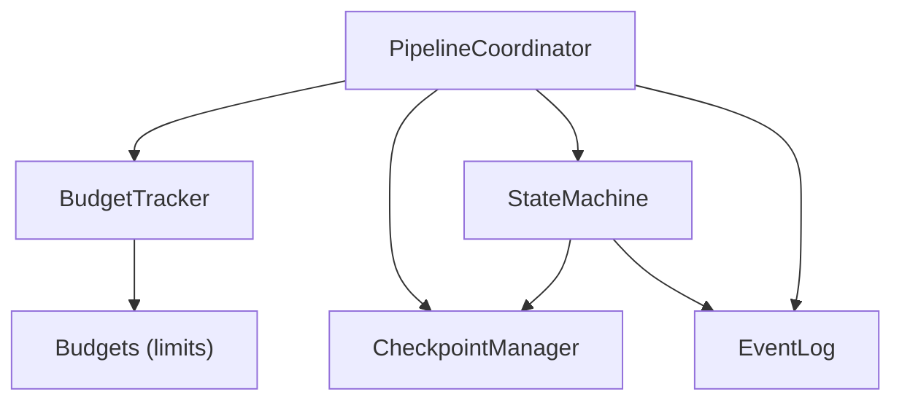
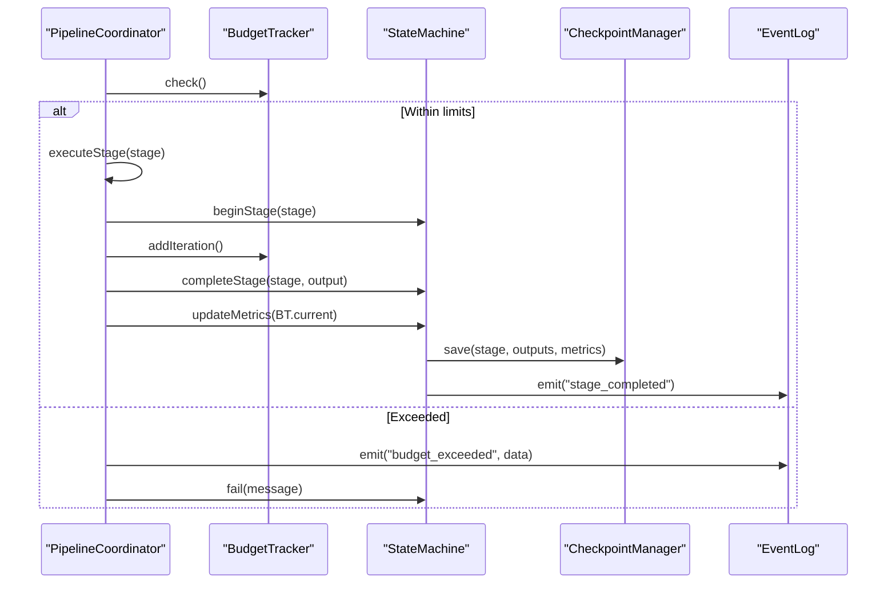
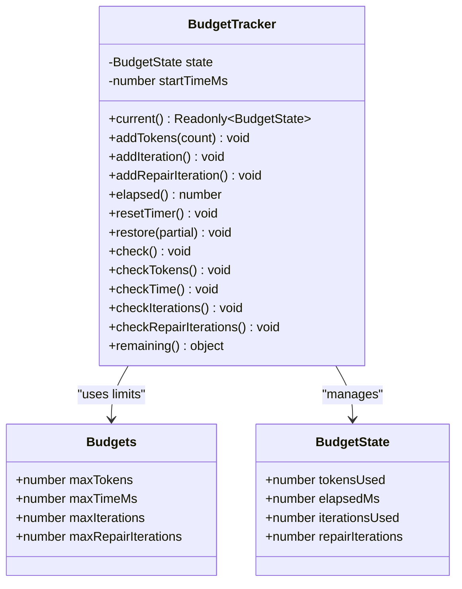
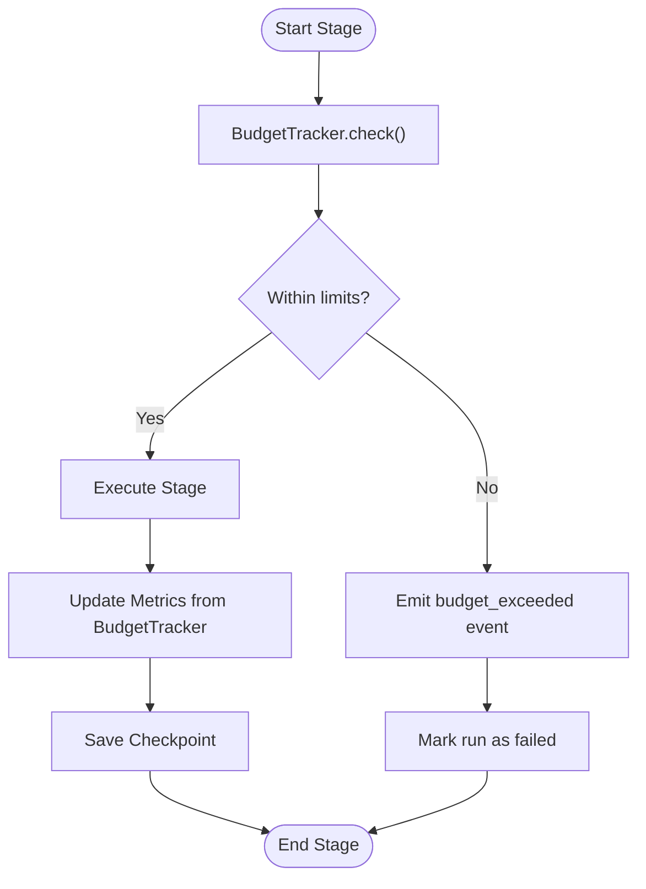
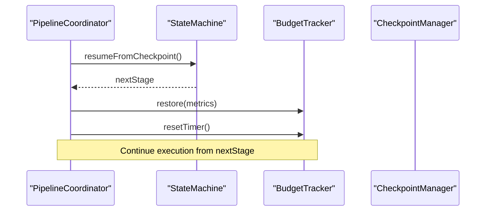
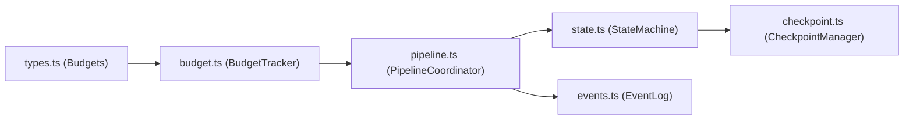

# Budget Tracking

<cite>
**Referenced Files in This Document**
- [budget.ts](file://runtime/src/core/budget.ts)
- [types.ts](file://runtime/src/core/types.ts)
- [pipeline.ts](file://runtime/src/core/pipeline.ts)
- [checkpoint.ts](file://runtime/src/core/checkpoint.ts)
- [state.ts](file://runtime/src/core/state.ts)
- [events.ts](file://runtime/src/core/events.ts)
- [test_all.ts](file://runtime/tests/test_all.ts)
</cite>

## Table of Contents
1. [Introduction](#introduction)
2. [Project Structure](#project-structure)
3. [Core Components](#core-components)
4. [Architecture Overview](#architecture-overview)
5. [Detailed Component Analysis](#detailed-component-analysis)
6. [Dependency Analysis](#dependency-analysis)
7. [Performance Considerations](#performance-considerations)
8. [Troubleshooting Guide](#troubleshooting-guide)
9. [Conclusion](#conclusion)
10. [Appendices](#appendices)

## Introduction
This document explains FigmaForge’s budget tracking system, focusing on how the BudgetTracker enforces resource limits across multiple dimensions: token usage, execution time, iteration counts, and repair attempts. It covers the configuration schema, limit definitions, threshold settings, real-time monitoring at critical pipeline points, violation handling, checkpoint-based restoration, reset operations, and cumulative tracking across runs. It also provides guidance for configuring budgets, monitoring consumption, handling exceeded errors, implementing custom checks, alerting strategies, and performance optimization techniques.

## Project Structure
The budget tracking system is implemented in the runtime core module and integrated into the pipeline coordinator. Key files include:
- Budget tracker and error types
- Type definitions for budgets and defaults
- Pipeline integration for checks and metrics updates
- Checkpoint manager for persistence and resumption
- State machine for run lifecycle and metrics synchronization
- Event log for audit trails including budget events

**Diagram sources**
- [pipeline.ts:82-124](file://runtime/src/core/pipeline.ts#L82-L124)
- [budget.ts:47-54](file://runtime/src/core/budget.ts#L47-L54)
- [checkpoint.ts:57-65](file://runtime/src/core/checkpoint.ts#L57-L65)
- [state.ts:48-57](file://runtime/src/core/state.ts#L48-L57)
- [events.ts:66-70](file://runtime/src/core/events.ts#L66-L70)

**Section sources**
- [pipeline.ts:1-329](file://runtime/src/core/pipeline.ts#L1-L329)
- [budget.ts:1-147](file://runtime/src/core/budget.ts#L1-L147)
- [types.ts:79-84](file://runtime/src/core/types.ts#L79-L84)
- [checkpoint.ts:1-165](file://runtime/src/core/checkpoint.ts#L1-L165)
- [state.ts:1-229](file://runtime/src/core/state.ts#L1-L229)
- [events.ts:1-138](file://runtime/src/core/events.ts#L1-L138)

## Core Components
- BudgetTracker: Tracks tokens, elapsed time, iterations, and repair iterations; enforces limits and exposes remaining fractions.
- Budgets: Configuration interface defining maximum allowed values per dimension.
- PipelineCoordinator: Orchestrates stages, performs budget checks before each stage, handles violations, and updates metrics.
- CheckpointManager: Persists stage outputs and cumulative metrics to support resume and restoration.
- StateMachine: Manages run state transitions, checkpoints, and metric updates.
- EventLog: Emits structured events including budget_exceeded for auditing and alerting.

Key responsibilities:
- Enforce hard limits via exceptions when thresholds are exceeded.
- Provide read-only current state and remaining budget fractions for monitoring.
- Integrate with checkpointing to restore cumulative counters after resume.
- Emit events for observability and alerting.

**Section sources**
- [budget.ts:14-19](file://runtime/src/core/budget.ts#L14-L19)
- [budget.ts:47-147](file://runtime/src/core/budget.ts#L47-L147)
- [types.ts:79-84](file://runtime/src/core/types.ts#L79-L84)
- [pipeline.ts:137-207](file://runtime/src/core/pipeline.ts#L137-L207)
- [checkpoint.ts:20-43](file://runtime/src/core/checkpoint.ts#L20-L43)
- [state.ts:122-126](file://runtime/src/core/state.ts#L122-L126)
- [events.ts:16-39](file://runtime/src/core/events.ts#L16-L39)

## Architecture Overview
Budget enforcement occurs at the start of each pipeline stage. The PipelineCoordinator invokes BudgetTracker.check() before executing a stage. If any dimension exceeds its configured limit, a BudgetExceededError is thrown, an event is emitted, and the run fails gracefully. After successful stage completion, metrics are updated from the BudgetTracker and persisted via the StateMachine and CheckpointManager.

**Diagram sources**
- [pipeline.ts:137-207](file://runtime/src/core/pipeline.ts#L137-L207)
- [state.ts:82-99](file://runtime/src/core/state.ts#L82-L99)
- [state.ts:122-126](file://runtime/src/core/state.ts#L122-L126)
- [checkpoint.ts:72-98](file://runtime/src/core/checkpoint.ts#L72-L98)
- [events.ts:66-96](file://runtime/src/core/events.ts#L66-L96)

## Detailed Component Analysis

### BudgetTracker
Tracks four dimensions:
- Tokens used
- Elapsed time since creation or last reset
- General iterations
- Repair iterations

Capabilities:
- Add usage increments for tokens, iterations, and repair iterations
- Compute elapsed time and provide current snapshot
- Reset timer for checkpoint resume scenarios
- Restore partial state from checkpoint
- Check all dimensions and throw BudgetExceededError on violations
- Report remaining budget fractions (0–1) for monitoring

Complexity:
- All operations are O(1) arithmetic and comparisons
- Memory footprint is minimal (a few numeric fields)

Error handling:
- Throws BudgetExceededError with dimension, limit, and used values for precise diagnostics

**Section sources**
- [budget.ts:14-19](file://runtime/src/core/budget.ts#L14-L19)
- [budget.ts:32-41](file://runtime/src/core/budget.ts#L32-L41)
- [budget.ts:47-92](file://runtime/src/core/budget.ts#L47-L92)
- [budget.ts:94-147](file://runtime/src/core/budget.ts#L94-L147)

#### Class Diagram

**Diagram sources**
- [budget.ts:14-19](file://runtime/src/core/budget.ts#L14-L19)
- [budget.ts:47-147](file://runtime/src/core/budget.ts#L47-L147)
- [types.ts:79-84](file://runtime/src/core/types.ts#L79-L84)

### Budget Configuration Schema and Defaults
Configuration interface defines maximum allowed values:
- maxTokens: Upper bound on accumulated tokens
- maxTimeMs: Upper bound on elapsed time in milliseconds
- maxIterations: Upper bound on general iterations
- maxRepairIterations: Upper bound on repair-specific iterations

Defaults:
- maxTokens: 1,000,000
- maxTimeMs: 300,000 (5 minutes)
- maxIterations: 20
- maxRepairIterations: 10

These defaults are provided in the core types and can be overridden via RuntimeConfig.budgets.

**Section sources**
- [types.ts:79-84](file://runtime/src/core/types.ts#L79-L84)
- [types.ts:243-248](file://runtime/src/core/types.ts#L243-L248)
- [types.ts:205-219](file://runtime/src/core/types.ts#L205-L219)

### Real-Time Monitoring and Critical Checkpoints
- Before each stage executes, the PipelineCoordinator calls BudgetTracker.check().
- On violation, it emits a budget_exceeded event with dimension, limit, and used values, then marks the run as failed.
- After each stage completes, metrics are updated from BudgetTracker and saved to checkpoints.

**Diagram sources**
- [pipeline.ts:157-190](file://runtime/src/core/pipeline.ts#L157-L190)
- [pipeline.ts:248-254](file://runtime/src/core/pipeline.ts#L248-L254)
- [state.ts:82-99](file://runtime/src/core/state.ts#L82-L99)
- [events.ts:66-96](file://runtime/src/core/events.ts#L66-L96)

**Section sources**
- [pipeline.ts:137-207](file://runtime/src/core/pipeline.ts#L137-L207)
- [state.ts:82-99](file://runtime/src/core/state.ts#L82-L99)
- [events.ts:16-39](file://runtime/src/core/events.ts#L16-L39)

### Budget Restoration from Checkpoints and Resets
- When resuming from a checkpoint, the PipelineCoordinator restores cumulative counters via BudgetTracker.restore() using metrics from the state machine and resets the timer via BudgetTracker.resetTimer().
- This ensures that resumed runs continue counting from where they left off without double-counting tokens/iterations while resetting elapsed time appropriately for the new session.

**Diagram sources**
- [pipeline.ts:148-155](file://runtime/src/core/pipeline.ts#L148-L155)
- [state.ts:189-206](file://runtime/src/core/state.ts#L189-L206)
- [budget.ts:81-92](file://runtime/src/core/budget.ts#L81-L92)

**Section sources**
- [pipeline.ts:148-155](file://runtime/src/core/pipeline.ts#L148-L155)
- [state.ts:189-206](file://runtime/src/core/state.ts#L189-L206)
- [budget.ts:81-92](file://runtime/src/core/budget.ts#L81-L92)

### Cumulative Tracking Across Multiple Runs
- Each run has its own BudgetTracker instance and cumulative counters.
- Checkpoints persist metrics per run, enabling accurate resumption within the same run.
- For multi-run scenarios, ensure separate run IDs and output directories so budgets do not cross-contaminate between runs.

**Section sources**
- [checkpoint.ts:20-43](file://runtime/src/core/checkpoint.ts#L20-L43)
- [types.ts:36-48](file://runtime/src/core/types.ts#L36-L48)

### Examples and Usage Patterns
- Configuring budget limits: Set RuntimeConfig.budgets with desired maxTokens, maxTimeMs, maxIterations, maxRepairIterations.
- Monitoring consumption: Use BudgetTracker.remaining() to get fractions of remaining resources per dimension.
- Handling exceeded errors: Catch BudgetExceededError in higher-level handlers to implement custom remediation or reporting.
- Implementing custom checks: Extend BudgetTracker or wrap stage logic to enforce additional constraints (e.g., per-stage caps) by calling specific check methods or adding pre/post hooks.

Validation examples exist in tests covering token budget exceedance, iteration tracking, repair iteration tracking, remaining calculations, and checkpoint restoration.

**Section sources**
- [types.ts:205-219](file://runtime/src/core/types.ts#L205-L219)
- [budget.ts:133-147](file://runtime/src/core/budget.ts#L133-L147)
- [test_all.ts:457-503](file://runtime/tests/test_all.ts#L457-L503)

## Dependency Analysis
BudgetTracker depends on Budgets limits and integrates tightly with the PipelineCoordinator, StateMachine, and CheckpointManager. Events are emitted through EventLog for observability.

**Diagram sources**
- [types.ts:79-84](file://runtime/src/core/types.ts#L79-L84)
- [budget.ts:47-54](file://runtime/src/core/budget.ts#L47-L54)
- [pipeline.ts:82-124](file://runtime/src/core/pipeline.ts#L82-L124)
- [state.ts:48-57](file://runtime/src/core/state.ts#L48-L57)
- [checkpoint.ts:57-65](file://runtime/src/core/checkpoint.ts#L57-L65)
- [events.ts:66-70](file://runtime/src/core/events.ts#L66-L70)

**Section sources**
- [pipeline.ts:82-124](file://runtime/src/core/pipeline.ts#L82-L124)
- [budget.ts:47-54](file://runtime/src/core/budget.ts#L47-L54)
- [state.ts:48-57](file://runtime/src/core/state.ts#L48-L57)
- [checkpoint.ts:57-65](file://runtime/src/core/checkpoint.ts#L57-L65)
- [events.ts:66-70](file://runtime/src/core/events.ts#L66-L70)

## Performance Considerations
- Budget checks are lightweight O(1) operations invoked once per stage; overhead is negligible.
- Token accounting should reflect actual model/provider usage to avoid false positives.
- Iteration accounting should align with retry loops and repair cycles to prevent premature termination.
- Time budget uses process-local elapsed time; consider resetting timers only on checkpoint resume to avoid penalizing long-running processes unnecessarily.
- Avoid excessive logging or heavy computations inside budget hooks to maintain responsiveness.

[No sources needed since this section provides general guidance]

## Troubleshooting Guide
Common issues and resolutions:
- BudgetExceededError thrown during stage execution:
  - Inspect which dimension exceeded (tokens, time_ms, iterations, repair_iterations).
  - Review logs for model invocations and iteration patterns.
  - Adjust corresponding limit in RuntimeConfig.budgets if appropriate.
- Unexpected early termination:
  - Verify that addIteration/addRepairIteration calls match expected loop semantics.
  - Ensure checkpoint restoration does not double-count counters.
- Time budget misbehavior:
  - Confirm resetTimer is called only on resume and not on every checkpoint.
  - Validate that long-running external processes are accounted for correctly.

Observability:
- Use EventLog.byKind("budget_exceeded") to collect and analyze budget violations.
- Persist event logs alongside artifacts for post-mortem analysis.

**Section sources**
- [budget.ts:32-41](file://runtime/src/core/budget.ts#L32-L41)
- [pipeline.ts:167-181](file://runtime/src/core/pipeline.ts#L167-L181)
- [events.ts:16-39](file://runtime/src/core/events.ts#L16-L39)
- [test_all.ts:457-503](file://runtime/tests/test_all.ts#L457-L503)

## Conclusion
FigmaForge’s budget tracking system provides robust, multi-dimensional enforcement of resource limits with clear error signaling, comprehensive observability, and resilient checkpoint-based resumption. By configuring appropriate limits, monitoring remaining budgets, and integrating checks at critical pipeline points, teams can ensure predictable execution costs and timely intervention when approaching constraints.

[No sources needed since this section summarizes without analyzing specific files]

## Appendices

### API Reference Summary
- BudgetTracker methods:
  - addTokens(count), addIteration(), addRepairIteration()
  - elapsed(), resetTimer(), restore(partial)
  - check(), checkTokens(), checkTime(), checkIterations(), checkRepairIterations()
  - remaining() returns fractions per dimension
- Budgets interface fields:
  - maxTokens, maxTimeMs, maxIterations, maxRepairIterations
- Default budgets:
  - maxTokens: 1,000,000
  - maxTimeMs: 300,000
  - maxIterations: 20
  - maxRepairIterations: 10

**Section sources**
- [budget.ts:47-147](file://runtime/src/core/budget.ts#L47-L147)
- [types.ts:79-84](file://runtime/src/core/types.ts#L79-L84)
- [types.ts:243-248](file://runtime/src/core/types.ts#L243-L248)

### Alerting Strategies
- Subscribe to budget_exceeded events to trigger alerts when limits are approached or breached.
- Implement thresholds for “approaching” limits by inspecting remaining() fractions and emitting warnings at configurable percentages (e.g., <20% remaining).
- Integrate with external monitoring systems by exporting event streams or metrics derived from remaining() and elapsed().

[No sources needed since this section provides general guidance]

### Optimization Techniques
- Tune iteration budgets based on observed repair loop behavior to reduce unnecessary retries.
- Align token budgets with model provider quotas to avoid unexpected failures.
- Use checkpointing strategically to allow long runs to resume without exceeding time budgets.
- Profile stages to identify high-cost operations and optimize them to stay within limits.

[No sources needed since this section provides general guidance]