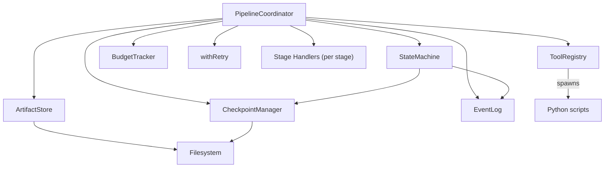
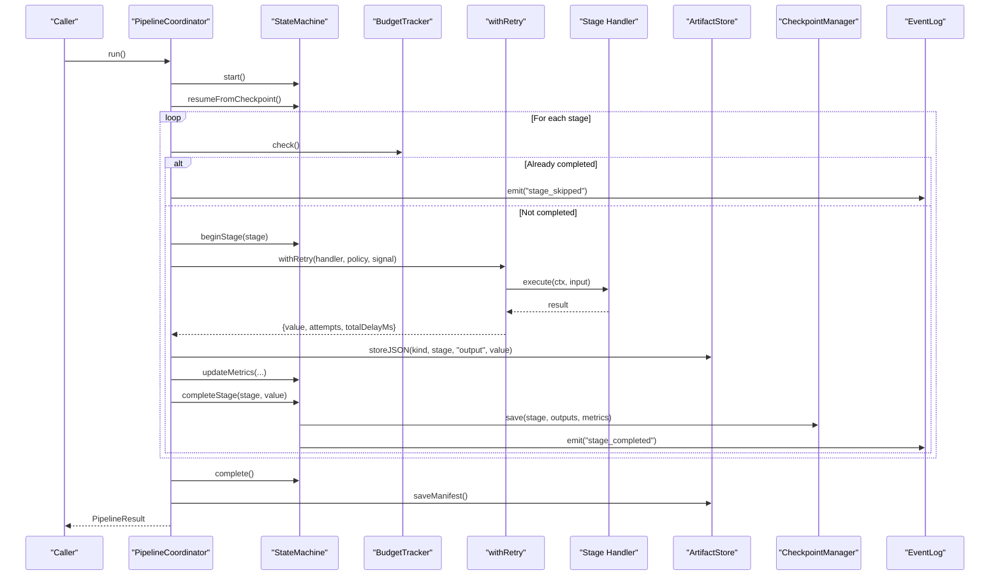
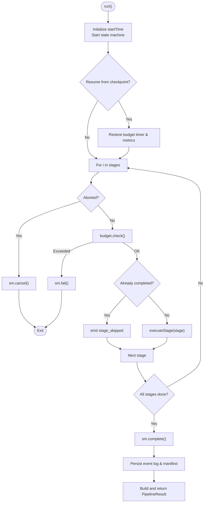
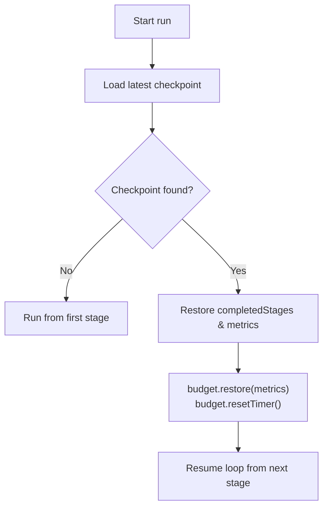
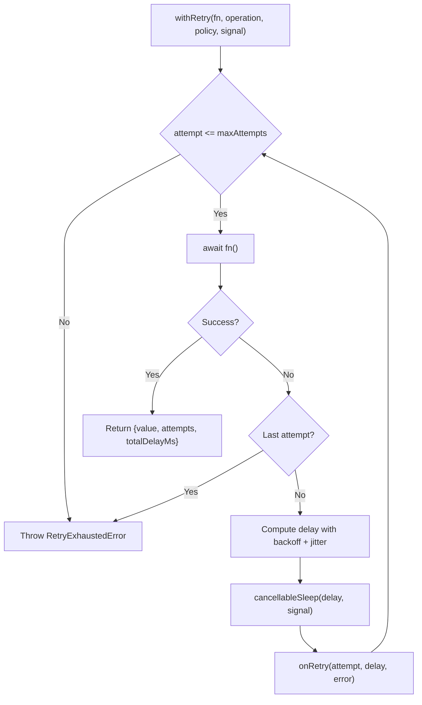
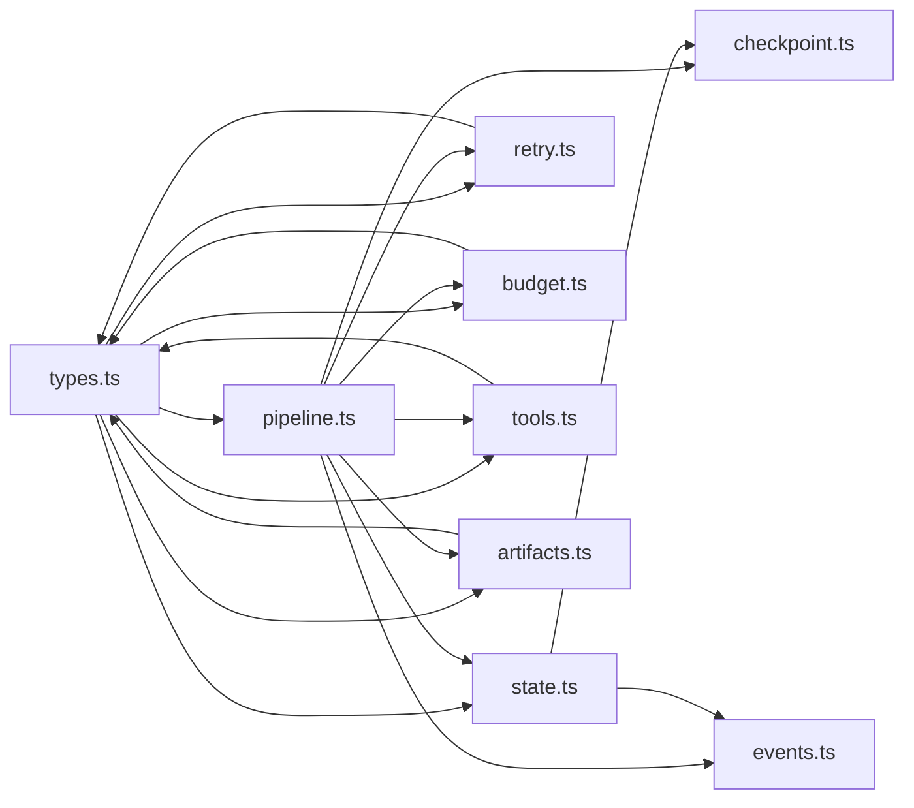

# Pipeline Orchestration

<cite>
**Referenced Files in This Document**
- [pipeline.ts](file://runtime/src/core/pipeline.ts)
- [state.ts](file://runtime/src/core/state.ts)
- [checkpoint.ts](file://runtime/src/core/checkpoint.ts)
- [retry.ts](file://runtime/src/core/retry.ts)
- [budget.ts](file://runtime/src/core/budget.ts)
- [types.ts](file://runtime/src/core/types.ts)
- [events.ts](file://runtime/src/core/events.ts)
- [tools.ts](file://runtime/src/core/tools.ts)
- [artifacts.ts](file://runtime/src/core/artifacts.ts)
</cite>

## Table of Contents
1. Introduction
2. Project Structure
3. Core Components
4. Architecture Overview
5. Detailed Component Analysis
6. Dependency Analysis
7. Performance Considerations
8. Troubleshooting Guide
9. Conclusion
10. Appendices

## Introduction
This document explains FigmaForge’s pipeline orchestration system, focusing on how the PipelineCoordinator drives workflow execution through a fixed sequence of stages: ingest, normalize, resolve, layout, generate, assets, render, compare, repair, verify. It covers the stage handler pattern, shared context management, error handling, checkpoint-based resumability, retry with exponential backoff, cancellation via abort signals, and budget enforcement at each stage. It also provides guidance for registering custom handlers, configuring pipeline options, monitoring progress, debugging, and troubleshooting common issues.

## Project Structure
The orchestration runtime is implemented under runtime/src/core. Key modules include:
- Pipeline coordinator and stage lifecycle
- Deterministic state machine
- Checkpoint manager for resumability
- Retry and timeout utilities
- Budget tracker for tokens, time, and iterations
- Event log for audit and replay
- Tool registry and Python bridge
- Artifact store for outputs and manifests
- Central type definitions and defaults

**Diagram sources**
- [pipeline.ts:82-207](file://runtime/src/core/pipeline.ts#L82-L207)
- [state.ts:48-206](file://runtime/src/core/state.ts#L48-L206)
- [checkpoint.ts:57-165](file://runtime/src/core/checkpoint.ts#L57-L165)
- [retry.ts:56-102](file://runtime/src/core/retry.ts#L56-L102)
- [budget.ts:47-148](file://runtime/src/core/budget.ts#L47-L148)
- [events.ts:66-138](file://runtime/src/core/events.ts#L66-L138)
- [tools.ts:66-203](file://runtime/src/core/tools.ts#L66-L203)
- [artifacts.ts:65-176](file://runtime/src/core/artifacts.ts#L65-L176)

**Section sources**
- [pipeline.ts:1-329](file://runtime/src/core/pipeline.ts#L1-L329)
- [types.ts:1-212](file://runtime/src/core/types.ts#L1-L212)

## Core Components
- PipelineCoordinator: Orchestrates run lifecycle, executes stages in order, manages retries, budgets, checkpoints, artifacts, events, and security context.
- StateMachine: Enforces deterministic transitions, tracks current stage/attempts, updates metrics, and coordinates checkpoint save/load.
- CheckpointManager: Persists stage outputs and metrics to disk; supports resume from latest valid checkpoint.
- withRetry: Wraps async operations with configurable exponential backoff, jitter, cancellation support, and timeout helper.
- BudgetTracker: Tracks token usage, elapsed time, iteration counts, and repair iterations; enforces limits per dimension.
- EventLog: Append-only structured event log for audit, replay, and debugging.
- ToolRegistry and Python bridge: Typed tool protocol and execution wrapper that spawns Python scripts for pipeline steps.
- ArtifactStore: Content-addressed storage for JSON and binary artifacts; maintains manifest.

Key responsibilities and interactions are detailed in the next sections.

**Section sources**
- [pipeline.ts:49-124](file://runtime/src/core/pipeline.ts#L49-L124)
- [state.ts:19-136](file://runtime/src/core/state.ts#L19-L136)
- [checkpoint.ts:20-98](file://runtime/src/core/checkpoint.ts#L20-L98)
- [retry.ts:15-102](file://runtime/src/core/retry.ts#L15-L102)
- [budget.ts:14-148](file://runtime/src/core/budget.ts#L14-L148)
- [events.ts:14-138](file://runtime/src/core/events.ts#L14-L138)
- [tools.ts:19-203](file://runtime/src/core/tools.ts#L19-L203)
- [artifacts.ts:18-176](file://runtime/src/core/artifacts.ts#L18-L176)

## Architecture Overview
The PipelineCoordinator runs a fixed sequence of stages defined by PIPELINE_STAGES. For each stage:
- Begin stage in StateMachine
- Build input from shared context
- Execute handler with retry and budget checks
- Store artifacts and update metrics
- Save checkpoint and emit events
- Proceed to next stage or complete/fail

**Diagram sources**
- [pipeline.ts:137-207](file://runtime/src/core/pipeline.ts#L137-L207)
- [pipeline.ts:209-281](file://runtime/src/core/pipeline.ts#L209-L281)
- [state.ts:64-136](file://runtime/src/core/state.ts#L64-L136)
- [checkpoint.ts:72-98](file://runtime/src/core/checkpoint.ts#L72-L98)
- [retry.ts:56-102](file://runtime/src/core/retry.ts#L56-L102)
- [artifacts.ts:81-107](file://runtime/src/core/artifacts.ts#L81-L107)

## Detailed Component Analysis

### PipelineCoordinator
- Registers stage handlers via onStage and executes them in order.
- Builds a shared PipelineContext containing config, events, checkpoints, artifacts, tools, budget, security guards, tool context, and an AbortSignal.
- Before each stage, checks cancellation and budgets; skips already-completed stages when resuming.
- Executes each stage with retry, stores artifacts, updates metrics, completes stage, and emits events.
- On completion, persists event log and artifact manifest, then returns a summary result.

**Diagram sources**
- [pipeline.ts:137-207](file://runtime/src/core/pipeline.ts#L137-L207)
- [pipeline.ts:209-281](file://runtime/src/core/pipeline.ts#L209-L281)

**Section sources**
- [pipeline.ts:82-207](file://runtime/src/core/pipeline.ts#L82-L207)
- [pipeline.ts:209-329](file://runtime/src/core/pipeline.ts#L209-L329)

### Stage Handler Pattern
- A StageHandler receives a PipelineContext and an input object derived from shared state plus stage metadata.
- Handlers must be idempotent where possible to support retries and checkpoint resume.
- Outputs are stored as artifacts keyed by stage and kind mapping.

Registration example (conceptual):
- Use PipelineCoordinator.onStage(stage, handler) to attach a function that reads/writes ctx.shared and returns a value.

Input composition:
- getStageInput copies ctx.shared into input and augments it with stage, runId, fileKey, viewport.

**Section sources**
- [pipeline.ts:49-76](file://runtime/src/core/pipeline.ts#L49-L76)
- [pipeline.ts:126-135](file://runtime/src/core/pipeline.ts#L126-L135)
- [pipeline.ts:283-294](file://runtime/src/core/pipeline.ts#L283-L294)

### Context Management and Shared State
- PipelineContext exposes config, events, checkpoints, artifacts, tools, budget, security guards, toolCtx, optional AbortSignal, and a shared Map for cross-stage data sharing.
- Stages can read/write ctx.shared to pass intermediate results without explicit parameters.

Security integration:
- Security guards (sandbox, secrets, shell, assets, approval) are exposed via ctx.security for safe operations within stages.

**Section sources**
- [pipeline.ts:58-76](file://runtime/src/core/pipeline.ts#L58-L76)
- [pipeline.ts:100-124](file://runtime/src/core/pipeline.ts#L100-L124)

### Error Handling Strategies
- Stage failures are recorded via StateMachine.failStage and emitted as events; errors are collected in the coordinator.
- Budget violations throw a specific error type and transition the run to failed.
- Retry wraps stage execution; exhaustion throws a dedicated error which bubbles up to fail the stage/run.
- Cancellation via AbortSignal short-circuits retries and stops further stages.

**Section sources**
- [pipeline.ts:167-200](file://runtime/src/core/pipeline.ts#L167-L200)
- [pipeline.ts:267-281](file://runtime/src/core/pipeline.ts#L267-L281)
- [retry.ts:25-41](file://runtime/src/core/retry.ts#L25-L41)
- [retry.ts:56-102](file://runtime/src/core/retry.ts#L56-L102)
- [budget.ts:32-41](file://runtime/src/core/budget.ts#L32-L41)

### Checkpoint Management for Resumability
- After each successful stage, StateMachine saves a checkpoint with outputs and metrics.
- On run start, StateMachine loads the latest checkpoint and restores completed stages and metrics; PipelineCoordinator restores budget timer and resumes from the next stage.
- Checkpoints are persisted per stage as JSON files under outputDir/runId/checkpoints.

**Diagram sources**
- [state.ts:189-206](file://runtime/src/core/state.ts#L189-L206)
- [checkpoint.ts:72-125](file://runtime/src/core/checkpoint.ts#L72-L125)
- [pipeline.ts:148-155](file://runtime/src/core/pipeline.ts#L148-L155)

**Section sources**
- [state.ts:82-136](file://runtime/src/core/state.ts#L82-L136)
- [state.ts:189-206](file://runtime/src/core/state.ts#L189-L206)
- [checkpoint.ts:57-165](file://runtime/src/core/checkpoint.ts#L57-L165)
- [pipeline.ts:148-155](file://runtime/src/core/pipeline.ts#L148-L155)

### Retry Logic with Exponential Backoff
- withRetry executes a function with configurable maxAttempts, baseDelayMs, backoffMultiplier, and maxDelayMs.
- Adds jitter to avoid thundering herds.
- Supports AbortSignal to cancel during sleep between attempts.
- Emits retry_attempt events via StateMachine callback.

**Diagram sources**
- [retry.ts:56-102](file://runtime/src/core/retry.ts#L56-L102)
- [retry.ts:104-128](file://runtime/src/core/retry.ts#L104-L128)

**Section sources**
- [retry.ts:56-102](file://runtime/src/core/retry.ts#L56-L102)
- [retry.ts:104-128](file://runtime/src/core/retry.ts#L104-L128)
- [pipeline.ts:227-238](file://runtime/src/core/pipeline.ts#L227-L238)

### Abort Signal Handling for Cancellation
- PipelineCoordinator sets AbortSignal on both its context and ToolContext.
- Before each stage, checks aborted flag and cancels via StateMachine.
- Retry sleeps are cancellable; cancellation throws a dedicated error.

**Section sources**
- [pipeline.ts:131-135](file://runtime/src/core/pipeline.ts#L131-L135)
- [pipeline.ts:161-165](file://runtime/src/core/pipeline.ts#L161-L165)
- [retry.ts:66-69](file://runtime/src/core/retry.ts#L66-L69)
- [retry.ts:104-128](file://runtime/src/core/retry.ts#L104-L128)

### Budget Checking at Each Stage
- Before executing each stage, PipelineCoordinator calls budget.check(), which validates tokens, time, iterations, and repair iterations against configured limits.
- On violation, emits budget_exceeded event and fails the run.

**Section sources**
- [pipeline.ts:167-181](file://runtime/src/core/pipeline.ts#L167-L181)
- [budget.ts:96-131](file://runtime/src/core/budget.ts#L96-L131)

### Monitoring Execution Progress
- EventLog records all lifecycle events (run_started, stage_started, stage_completed, stage_failed, retry_attempt, budget_exceeded, etc.).
- Events are persisted as artifacts and can be queried by kind, stage, or level.
- PipelineResult includes totals for duration, tokensUsed, artifacts, events, and checkpoints.

**Section sources**
- [events.ts:14-138](file://runtime/src/core/events.ts#L14-L138)
- [pipeline.ts:202-207](file://runtime/src/core/pipeline.ts#L202-L207)

### Tools and Python Bridge
- ToolRegistry provides typed registration and invocation with timing and error capture.
- createPythonTool spawns python3 with arguments and stdin/stdout/stderr capture, respecting AbortSignal.
- Stages can use tools to invoke existing Python pipeline logic.

**Section sources**
- [tools.ts:19-130](file://runtime/src/core/tools.ts#L19-L130)
- [tools.ts:158-203](file://runtime/src/core/tools.ts#L158-L203)

### Artifacts and Manifests
- ArtifactStore writes JSON and binary artifacts with content hashing and metadata.
- Each stage’s output is stored with a mapped artifact kind.
- At run end, manifest.json is saved summarizing all artifacts.

**Section sources**
- [artifacts.ts:18-176](file://runtime/src/core/artifacts.ts#L18-L176)
- [pipeline.ts:240-246](file://runtime/src/core/pipeline.ts#L240-L246)
- [pipeline.ts:296-311](file://runtime/src/core/pipeline.ts#L296-L311)

## Dependency Analysis
High-level dependencies among core modules:

**Diagram sources**
- [types.ts:1-212](file://runtime/src/core/types.ts#L1-L212)
- [pipeline.ts:12-27](file://runtime/src/core/pipeline.ts#L12-L27)
- [state.ts:9-13](file://runtime/src/core/state.ts#L9-L13)
- [retry.ts:8-9](file://runtime/src/core/retry.ts#L8-L9)
- [budget.ts:8-9](file://runtime/src/core/budget.ts#L8-L9)
- [tools.ts:13-14](file://runtime/src/core/tools.ts#L13-L14)
- [artifacts.ts:12-13](file://runtime/src/core/artifacts.ts#L12-L13)

**Section sources**
- [types.ts:1-212](file://runtime/src/core/types.ts#L1-L212)
- [pipeline.ts:12-27](file://runtime/src/core/pipeline.ts#L12-L27)

## Performance Considerations
- Prefer idempotent stage handlers to minimize rework on retries and checkpoint resume.
- Keep shared context payloads small to reduce checkpoint size and I/O overhead.
- Tune retry policy (maxAttempts, baseDelayMs, backoffMultiplier, maxDelayMs) based on external service stability.
- Set realistic budgets to prevent long-running runs from consuming excessive resources.
- Use ArtifactStore judiciously; large binaries (e.g., screenshots) increase disk usage and manifest size.
- Leverage checkpoint resume to avoid reprocessing expensive stages after interruptions.

[No sources needed since this section provides general guidance]

## Troubleshooting Guide
Common issues and resolutions:
- Budget exceeded: Occurs when tokens, time, iterations, or repair iterations exceed configured limits. Inspect budget dimensions and adjust limits or optimize stage performance.
- Retry exhausted: External calls may be flaky; review network reliability and consider increasing maxAttempts or adjusting backoff.
- Checkpoint corruption: If a checkpoint file is invalid, the loader skips it and falls back to earlier checkpoints or restarts from the beginning.
- Cancellation not taking effect: Ensure AbortSignal is passed to PipelineCoordinator and tools; verify that long-running operations honor the signal.
- Missing stage handler: If no handler is registered for a stage, it will be skipped and marked completed; ensure all required stages have handlers.

Useful diagnostics:
- Review EventLog entries for stage_started, stage_completed, stage_failed, retry_attempt, budget_exceeded, checkpoint_saved/loaded.
- Inspect artifacts for generated code, screenshots, diff reports, and metrics.
- Validate checkpoint files under outputDir/runId/checkpoints.

**Section sources**
- [pipeline.ts:167-200](file://runtime/src/core/pipeline.ts#L167-L200)
- [pipeline.ts:267-281](file://runtime/src/core/pipeline.ts#L267-L281)
- [checkpoint.ts:100-125](file://runtime/src/core/checkpoint.ts#L100-L125)
- [events.ts:16-39](file://runtime/src/core/events.ts#L16-L39)

## Conclusion
FigmaForge’s pipeline orchestration provides a robust, deterministic workflow engine with strong observability, resilience, and safety controls. The PipelineCoordinator coordinates stage execution, while the StateMachine ensures correct transitions and checkpointing. Retry with exponential backoff, cancellation via AbortSignal, and strict budget enforcement protect resources and improve reliability. The event log and artifact store enable deep inspection and reproducibility. By following the patterns described here, you can extend the pipeline with custom stages, configure behavior for your environment, and maintain high performance and debuggability.

[No sources needed since this section summarizes without analyzing specific files]

## Appendices

### Appendix A: Registering Custom Stage Handlers
- Create a handler function that accepts (ctx, input) and returns a Promise<object>.
- Read/write ctx.shared to pass data between stages.
- Use ctx.tools.invoke to call registered tools if needed.
- Register via PipelineCoordinator.onStage(stage, handler).

Example references:
- Handler signature and context: [pipeline.ts:49-76](file://runtime/src/core/pipeline.ts#L49-L76)
- Registration API: [pipeline.ts:126-129](file://runtime/src/core/pipeline.ts#L126-L129)
- Input composition: [pipeline.ts:283-294](file://runtime/src/core/pipeline.ts#L283-L294)

**Section sources**
- [pipeline.ts:49-76](file://runtime/src/core/pipeline.ts#L49-L76)
- [pipeline.ts:126-129](file://runtime/src/core/pipeline.ts#L126-L129)
- [pipeline.ts:283-294](file://runtime/src/core/pipeline.ts#L283-L294)

### Appendix B: Configuring Pipeline Options
- RuntimeConfig defines run identity, output paths, approved directories, retry policy, budgets, similarity threshold, viewport, and target backend.
- Defaults are provided for retry, budgets, and other settings.

References:
- Configuration types and defaults: [types.ts:105-178](file://runtime/src/core/types.ts#L105-L178)

**Section sources**
- [types.ts:105-178](file://runtime/src/core/types.ts#L105-L178)

### Appendix C: Monitoring Execution Progress
- Subscribe to or inspect EventLog entries for lifecycle and stage events.
- Query events by kind, stage, or severity level.
- Retrieve final PipelineResult for summary metrics.

References:
- Event kinds and querying: [events.ts:16-39](file://runtime/src/core/events.ts#L16-L39), [events.ts:98-128](file://runtime/src/core/events.ts#L98-L128)
- Final result fields: [pipeline.ts:313-327](file://runtime/src/core/pipeline.ts#L313-L327)

**Section sources**
- [events.ts:16-39](file://runtime/src/core/events.ts#L16-L39)
- [events.ts:98-128](file://runtime/src/core/events.ts#L98-L128)
- [pipeline.ts:313-327](file://runtime/src/core/pipeline.ts#L313-L327)

### Appendix D: Debugging Techniques
- Enable verbose event logging and filter by stage or level.
- Inspect artifacts for intermediate outputs and diffs.
- Validate checkpoints for correctness and completeness.
- Use Tool invocations to trace Python script executions and outputs.

References:
- Event filtering: [events.ts:98-128](file://runtime/src/core/events.ts#L98-L128)
- Artifact listing and loading: [artifacts.ts:143-176](file://runtime/src/core/artifacts.ts#L143-L176)
- Tool invocation tracking: [tools.ts:93-130](file://runtime/src/core/tools.ts#L93-L130)

**Section sources**
- [events.ts:98-128](file://runtime/src/core/events.ts#L98-L128)
- [artifacts.ts:143-176](file://runtime/src/core/artifacts.ts#L143-L176)
- [tools.ts:93-130](file://runtime/src/core/tools.ts#L93-L130)