# Runtime Evaluation System

<cite>
**Referenced Files in This Document**
- [main.ts](file://runtime/src/cli/main.ts)
- [types.ts](file://runtime/src/core/types.ts)
- [pipeline.ts](file://runtime/src/core/pipeline.ts)
- [artifacts.ts](file://runtime/src/core/artifacts.ts)
- [checkpoint.ts](file://runtime/src/core/checkpoint.ts)
- [security.ts](file://runtime/src/core/security.ts)
- [budget.ts](file://runtime/src/core/budget.ts)
- [retry.ts](file://runtime/src/core/retry.ts)
- [state.ts](file://runtime/src/core/state.ts)
- [events.ts](file://runtime/src/core/events.ts)
- [tools.ts](file://runtime/src/core/tools.ts)
- [package.json](file://runtime/package.json)
- [runtime-architecture.md](file://docs/runtime-architecture.md)
- [runtime-troubleshooting.md](file://docs/runtime-troubleshooting.md)
</cite>

## Table of Contents
1. Introduction
2. Project Structure
3. Core Components
4. Architecture Overview
5. Detailed Component Analysis
6. Dependency Analysis
7. Performance Considerations
8. Troubleshooting Guide
9. Conclusion
10. Appendices

## Introduction
This document explains FigmaForge’s runtime evaluation system: a TypeScript orchestration layer that drives the end-to-end pipeline from Figma input to verified code output. It covers workflow execution with checkpointing, error handling, retry logic, artifact management for version control and metadata tracking, security controls (approval gates, sandboxing, secret redaction, asset validation), budget tracking (tokens, time, iterations), and operational guidance including CLI usage, deployment considerations, and performance monitoring.

## Project Structure
The runtime is organized into a small set of focused modules under runtime/src/core, plus a CLI entry point and documentation. The core modules implement deterministic stage orchestration, state transitions, event logging, checkpoints, artifacts, budgets, retries, security boundaries, and tool invocation. The CLI wires these components together and exposes commands for running, inspecting, rendering, comparing, repairing, and replaying runs.

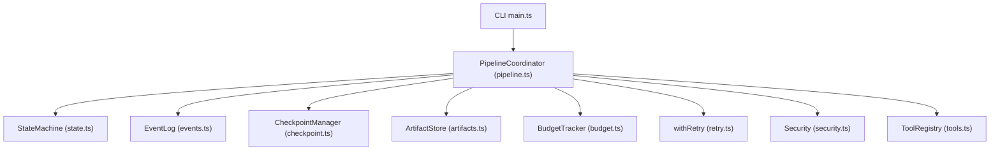

**Diagram sources**
- [main.ts:172-234](file://runtime/src/cli/main.ts#L172-L234)
- [pipeline.ts:82-207](file://runtime/src/core/pipeline.ts#L82-L207)
- [state.ts:48-206](file://runtime/src/core/state.ts#L48-L206)
- [events.ts:66-138](file://runtime/src/core/events.ts#L66-L138)
- [checkpoint.ts:57-165](file://runtime/src/core/checkpoint.ts#L57-L165)
- [artifacts.ts:65-176](file://runtime/src/core/artifacts.ts#L65-L176)
- [budget.ts:47-148](file://runtime/src/core/budget.ts#L47-L148)
- [retry.ts:56-156](file://runtime/src/core/retry.ts#L56-L156)
- [security.ts:18-401](file://runtime/src/core/security.ts#L18-L401)
- [tools.ts:66-203](file://runtime/src/core/tools.ts#L66-L203)

**Section sources**
- [runtime-architecture.md:15-51](file://docs/runtime-architecture.md#L15-L51)
- [runtime-troubleshooting.md:187-219](file://docs/runtime-troubleshooting.md#L187-L219)

## Core Components
- Pipeline stages and configuration define the deterministic flow and runtime options.
- PipelineCoordinator orchestrates stages, integrates security, budgets, retries, events, checkpoints, and artifacts.
- StateMachine enforces ordered transitions and records lifecycle events.
- EventLog provides an append-only audit trail for every action.
- CheckpointManager enables resumable runs by persisting outputs and metrics after each stage.
- ArtifactStore provides content-addressed storage with manifests and retrieval helpers.
- ToolRegistry defines typed tools and tracks invocations; includes a Python bridge for existing pipeline steps.
- BudgetTracker enforces token, time, and iteration limits with clear error signaling.
- Retry utilities add exponential backoff, jitter, cancellation support, and timeouts.
- Security module implements PathSandbox, SecretGuard, ShellGuard, AssetValidator, and ApprovalGate.

**Section sources**
- [types.ts:12-125](file://runtime/src/core/types.ts#L12-L125)
- [pipeline.ts:82-207](file://runtime/src/core/pipeline.ts#L82-L207)
- [state.ts:48-206](file://runtime/src/core/state.ts#L48-L206)
- [events.ts:66-138](file://runtime/src/core/events.ts#L66-L138)
- [checkpoint.ts:57-165](file://runtime/src/core/checkpoint.ts#L57-L165)
- [artifacts.ts:65-176](file://runtime/src/core/artifacts.ts#L65-L176)
- [tools.ts:66-203](file://runtime/src/core/tools.ts#L66-L203)
- [budget.ts:47-148](file://runtime/src/core/budget.ts#L47-L148)
- [retry.ts:56-156](file://runtime/src/core/retry.ts#L56-L156)
- [security.ts:18-401](file://runtime/src/core/security.ts#L18-L401)

## Architecture Overview
The runtime executes a fixed sequence of stages: ingest, normalize, resolve, layout, generate, assets, render, compare, repair, verify. Each stage is wrapped with retry, budget checks, and event emission. After success, outputs are stored as artifacts and a checkpoint is saved. The state machine ensures correct ordering and supports resume-from-checkpoint.

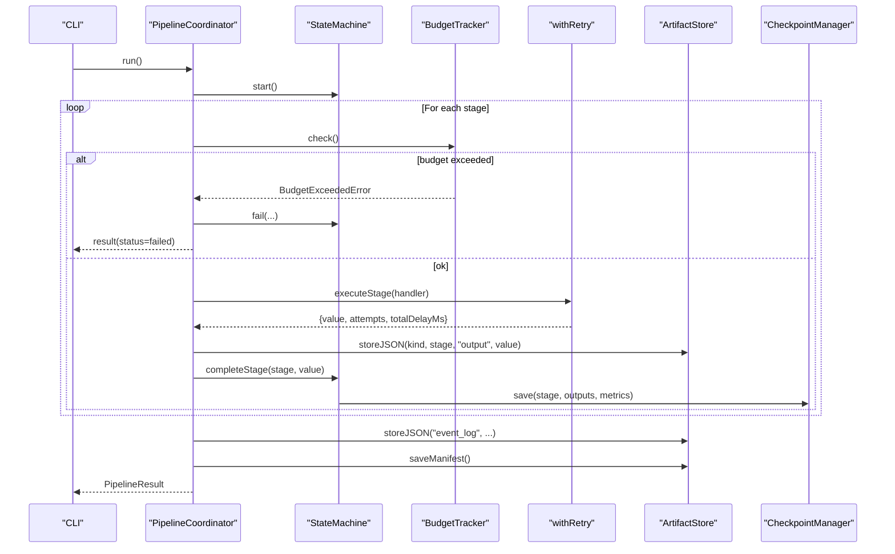

**Diagram sources**
- [pipeline.ts:137-207](file://runtime/src/core/pipeline.ts#L137-L207)
- [pipeline.ts:209-281](file://runtime/src/core/pipeline.ts#L209-L281)
- [state.ts:64-99](file://runtime/src/core/state.ts#L64-L99)
- [checkpoint.ts:72-98](file://runtime/src/core/checkpoint.ts#L72-L98)
- [artifacts.ts:81-107](file://runtime/src/core/artifacts.ts#L81-L107)
- [budget.ts:96-102](file://runtime/src/core/budget.ts#L96-L102)
- [retry.ts:56-102](file://runtime/src/core/retry.ts#L56-L102)

## Detailed Component Analysis

### Pipeline Orchestration and Stage Execution
- Stages are defined as a constant array and executed in order.
- Each stage handler receives a shared context including config, events, checkpoints, artifacts, tools, budget, security, and optional abort signal.
- Inputs are composed from shared state plus stage-specific fields.
- Outputs are persisted as artifacts and used to update metrics before completing the stage.

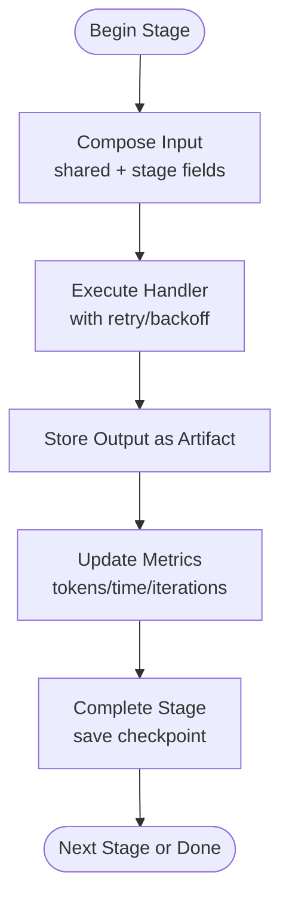

**Diagram sources**
- [pipeline.ts:283-311](file://runtime/src/core/pipeline.ts#L283-L311)
- [pipeline.ts:209-281](file://runtime/src/core/pipeline.ts#L209-L281)
- [state.ts:82-99](file://runtime/src/core/state.ts#L82-L99)
- [checkpoint.ts:72-98](file://runtime/src/core/checkpoint.ts#L72-L98)

**Section sources**
- [pipeline.ts:49-76](file://runtime/src/core/pipeline.ts#L49-L76)
- [pipeline.ts:137-207](file://runtime/src/core/pipeline.ts#L137-L207)
- [pipeline.ts:209-311](file://runtime/src/core/pipeline.ts#L209-L311)

### Checkpointing and Resumability
- After each successful stage, a checkpoint is saved containing outputs, metrics, and next stage.
- On restart, the latest valid checkpoint is loaded; completed stages are skipped and metrics restored.
- Corrupt checkpoints are ignored gracefully.

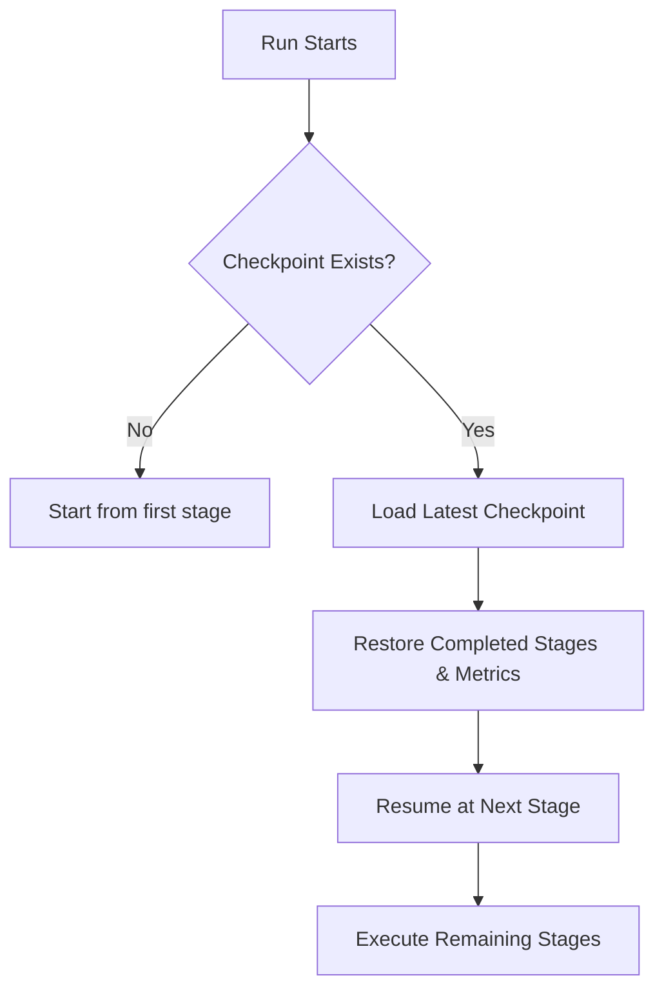

**Diagram sources**
- [checkpoint.ts:72-125](file://runtime/src/core/checkpoint.ts#L72-L125)
- [state.ts:189-206](file://runtime/src/core/state.ts#L189-L206)
- [pipeline.ts:148-155](file://runtime/src/core/pipeline.ts#L148-L155)

**Section sources**
- [checkpoint.ts:57-165](file://runtime/src/core/checkpoint.ts#L57-L165)
- [state.ts:189-206](file://runtime/src/core/state.ts#L189-L206)

### Error Handling and Retry Logic
- Each stage execution is wrapped with retry using exponential backoff and jitter.
- Cancellation via AbortSignal is supported during sleeps and operations.
- On exhaustion, a specific error type is thrown; on success, attempt counts and delays are recorded.

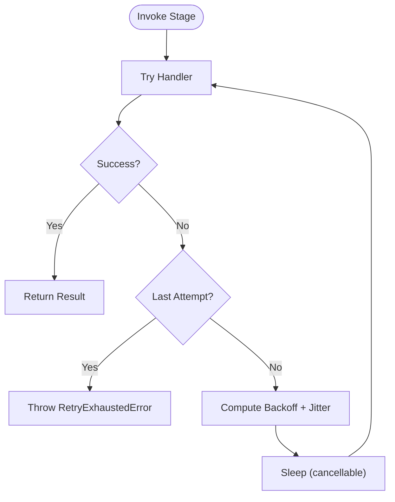

**Diagram sources**
- [retry.ts:56-102](file://runtime/src/core/retry.ts#L56-L102)
- [retry.ts:104-128](file://runtime/src/core/retry.ts#L104-L128)
- [pipeline.ts:227-238](file://runtime/src/core/pipeline.ts#L227-L238)

**Section sources**
- [retry.ts:56-156](file://runtime/src/core/retry.ts#L56-L156)
- [pipeline.ts:227-238](file://runtime/src/core/pipeline.ts#L227-L238)

### Artifact Management
- Artifacts are content-addressed by SHA-256 hash of their serialized content.
- JSON and binary buffers can be stored; each artifact records kind, stage, runId, path, hash, size, timestamp, and optional label.
- Manifests summarize all artifacts per run for discovery and auditing.

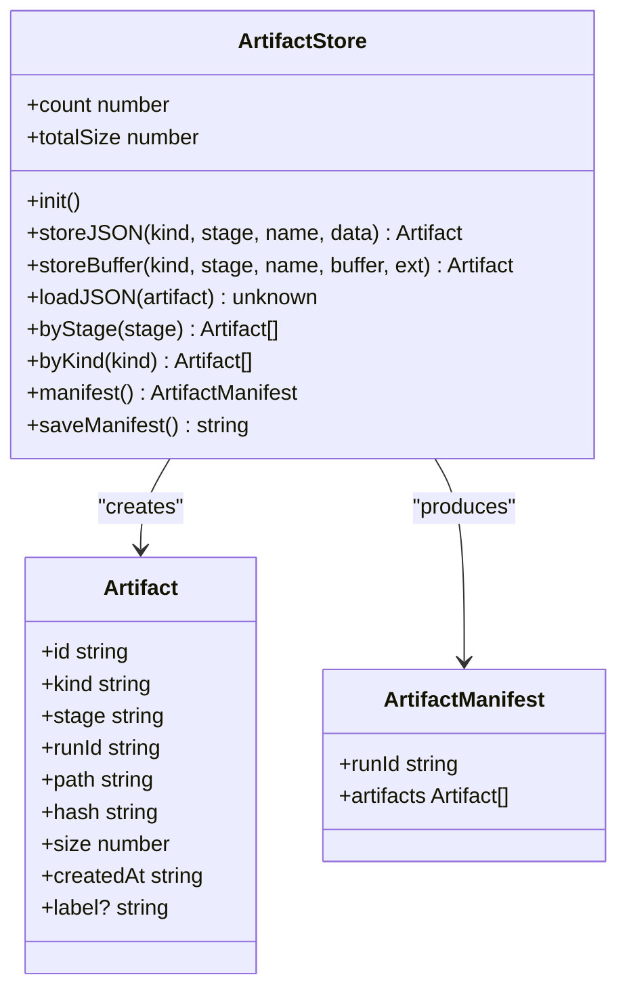

**Diagram sources**
- [artifacts.ts:18-59](file://runtime/src/core/artifacts.ts#L18-L59)
- [artifacts.ts:65-176](file://runtime/src/core/artifacts.ts#L65-L176)

**Section sources**
- [artifacts.ts:65-176](file://runtime/src/core/artifacts.ts#L65-L176)

### Security Controls
- PathSandbox restricts filesystem access to approved directories; safe read/write wrappers enforce checks.
- SecretGuard detects and redacts secrets in text and objects to prevent leakage in logs or prompts.
- ShellGuard allows only pre-approved commands and rejects dangerous argument patterns.
- AssetValidator validates external assets by size, extension/MIME proxy, and emptiness.
- ApprovalGate requires explicit consent before destructive actions; supports pre-approvals and session caching.

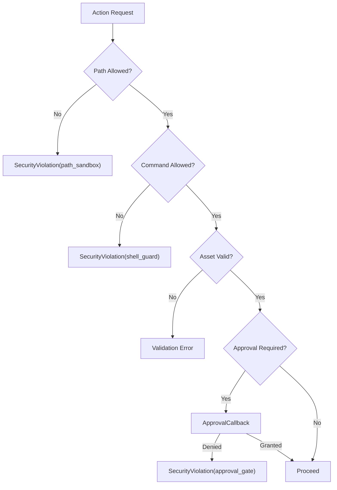

**Diagram sources**
- [security.ts:32-103](file://runtime/src/core/security.ts#L32-L103)
- [security.ts:121-179](file://runtime/src/core/security.ts#L121-L179)
- [security.ts:196-239](file://runtime/src/core/security.ts#L196-L239)
- [security.ts:262-328](file://runtime/src/core/security.ts#L262-L328)
- [security.ts:351-400](file://runtime/src/core/security.ts#L351-L400)

**Section sources**
- [security.ts:18-401](file://runtime/src/core/security.ts#L18-L401)

### Budget Tracking
- Tracks tokens, elapsed time, iterations, and repair iterations.
- Provides checks per dimension; throws a specific error when limits are exceeded.
- Supports restore from checkpoint and timer reset for resumption.

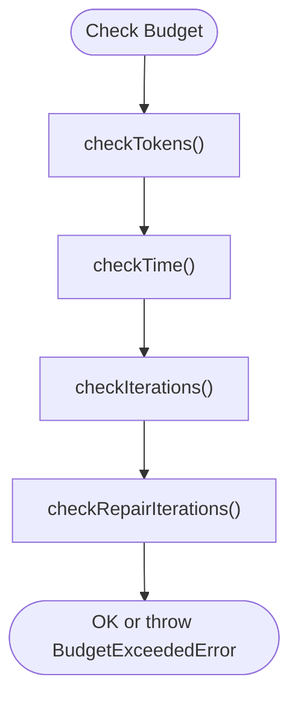

**Diagram sources**
- [budget.ts:96-131](file://runtime/src/core/budget.ts#L96-L131)
- [budget.ts:47-92](file://runtime/src/core/budget.ts#L47-L92)

**Section sources**
- [budget.ts:47-148](file://runtime/src/core/budget.ts#L47-L148)
- [types.ts:79-125](file://runtime/src/core/types.ts#L79-L125)

### Tooling and Python Bridge
- ToolRegistry manages typed tools, tracks invocations, and invokes them with timing and error capture.
- createPythonTool spawns python3 to run scripts from the plugin directory, capturing stdout/stderr and parsing JSON when available.

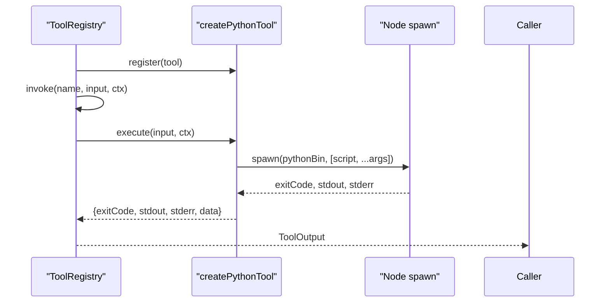

**Diagram sources**
- [tools.ts:66-130](file://runtime/src/core/tools.ts#L66-L130)
- [tools.ts:158-203](file://runtime/src/core/tools.ts#L158-L203)

**Section sources**
- [tools.ts:66-203](file://runtime/src/core/tools.ts#L66-L203)

### CLI and Operational Usage
- Commands: run, inspect, render, compare, repair, replay.
- Flags configure file key, output directory, thresholds, budgets, viewport, approval behavior, and approved directories.
- The CLI constructs the runtime components, sets up cancellation, and prints summaries.

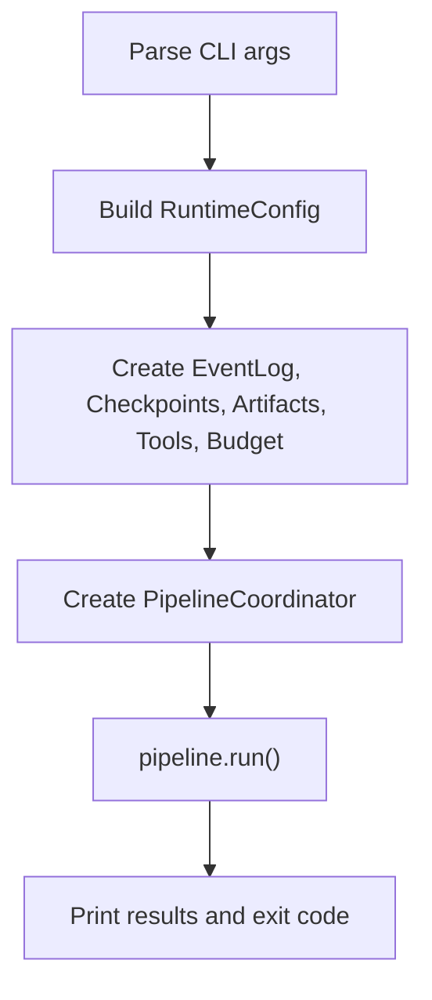

**Diagram sources**
- [main.ts:35-62](file://runtime/src/cli/main.ts#L35-L62)
- [main.ts:108-144](file://runtime/src/cli/main.ts#L108-L144)
- [main.ts:172-234](file://runtime/src/cli/main.ts#L172-L234)

**Section sources**
- [main.ts:172-234](file://runtime/src/cli/main.ts#L172-L234)
- [main.ts:236-460](file://runtime/src/cli/main.ts#L236-L460)
- [package.json:1-23](file://runtime/package.json#L1-L23)

## Dependency Analysis
- PipelineCoordinator depends on StateMachine, EventLog, CheckpointManager, ArtifactStore, ToolRegistry, BudgetTracker, and Security components.
- CLI composes these dependencies and wires them into the coordinator.
- Types define shared contracts (stages, config, model provider).

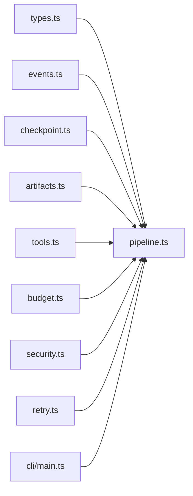

**Diagram sources**
- [pipeline.ts:12-27](file://runtime/src/core/pipeline.ts#L12-L27)
- [main.ts:16-23](file://runtime/src/cli/main.ts#L16-L23)
- [types.ts:12-125](file://runtime/src/core/types.ts#L12-L125)

**Section sources**
- [pipeline.ts:12-27](file://runtime/src/core/pipeline.ts#L12-L27)
- [main.ts:16-23](file://runtime/src/cli/main.ts#L16-L23)

## Performance Considerations
- Use minimal viewport sizes to reduce render time.
- Tune max repair iterations to balance quality vs. duration.
- Skip approval in automated environments to avoid interactive delays.
- Clean old artifacts and checkpoints between runs to manage disk usage.
- Adjust retry policies and budgets based on environment reliability and cost constraints.

[No sources needed since this section provides general guidance]

## Troubleshooting Guide
Common issues and resolutions include build errors, runtime budget exceedances, security violations, approval requirements, retry exhaustion, and checkpoint problems. Inspect event logs and checkpoints to diagnose failures; use verbose mode for detailed traces.

**Section sources**
- [runtime-troubleshooting.md:5-126](file://docs/runtime-troubleshooting.md#L5-L126)
- [runtime-troubleshooting.md:127-186](file://docs/runtime-troubleshooting.md#L127-L186)

## Conclusion
FigmaForge’s runtime provides a robust, secure, and auditable orchestration layer for visual design-to-code workflows. Deterministic stage execution, checkpoint-based resilience, content-addressed artifacts, strict security boundaries, and configurable budgets enable reliable automation and evaluation. The CLI offers practical commands for running, inspecting, and debugging pipelines, while the modular architecture supports future extensions and integrations.

[No sources needed since this section summarizes without analyzing specific files]

## Appendices

### Example: Full Pipeline Execution
- Command: figmaforge run with required flags for file key and output directory.
- Behavior: Builds config, creates runtime components, sets cancellation, runs pipeline, and reports status, duration, similarity score, repairs, tokens, artifacts, and events.

**Section sources**
- [main.ts:108-144](file://runtime/src/cli/main.ts#L108-L144)
- [main.ts:172-234](file://runtime/src/cli/main.ts#L172-L234)

### Example: Artifact Lifecycle
- Creation: Each stage stores outputs via ArtifactStore.storeJSON/storeBuffer with content hashing.
- Discovery: manifest.json lists all artifacts for a run; queries by stage/kind supported.
- Retrieval: loadJSON reads stored artifacts by path; count and totalSize provide summary stats.

**Section sources**
- [artifacts.ts:81-176](file://runtime/src/core/artifacts.ts#L81-L176)

### Example: Security Configuration
- Approved directories configured via CLI flag; PathSandbox enforces access.
- Shell execution limited to allowed commands; dangerous arguments rejected.
- Secrets automatically redacted in logs/prompts; ApprovalGate enforces consent.

**Section sources**
- [security.ts:32-103](file://runtime/src/core/security.ts#L32-L103)
- [security.ts:196-239](file://runtime/src/core/security.ts#L196-L239)
- [security.ts:121-179](file://runtime/src/core/security.ts#L121-L179)
- [security.ts:351-400](file://runtime/src/core/security.ts#L351-L400)
- [main.ts:120-143](file://runtime/src/cli/main.ts#L120-L143)

### Example: Performance Monitoring
- Monitor remaining budgets via BudgetTracker.remaining to track utilization.
- Observe event log for stage timings and retry counts.
- Use CLI replay to review event sequences and identify bottlenecks.

**Section sources**
- [budget.ts:133-148](file://runtime/src/core/budget.ts#L133-L148)
- [events.ts:66-138](file://runtime/src/core/events.ts#L66-L138)
- [main.ts:291-328](file://runtime/src/cli/main.ts#L291-L328)

### Deployment Considerations
- Node.js engine requirement enforced by package configuration.
- Zero external runtime dependencies beyond Node stdlib; Python bridge requires python3 availability.
- Ensure output directories exist and are writable; configure approved directories for sandboxing.
- Provide approval callbacks for non-interactive environments or disable approvals where appropriate.

**Section sources**
- [package.json:18-20](file://runtime/package.json#L18-L20)
- [tools.ts:158-203](file://runtime/src/core/tools.ts#L158-L203)
- [main.ts:120-143](file://runtime/src/cli/main.ts#L120-L143)