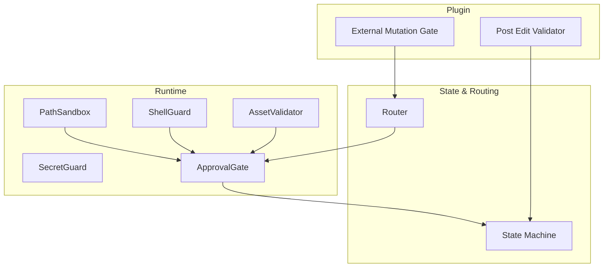
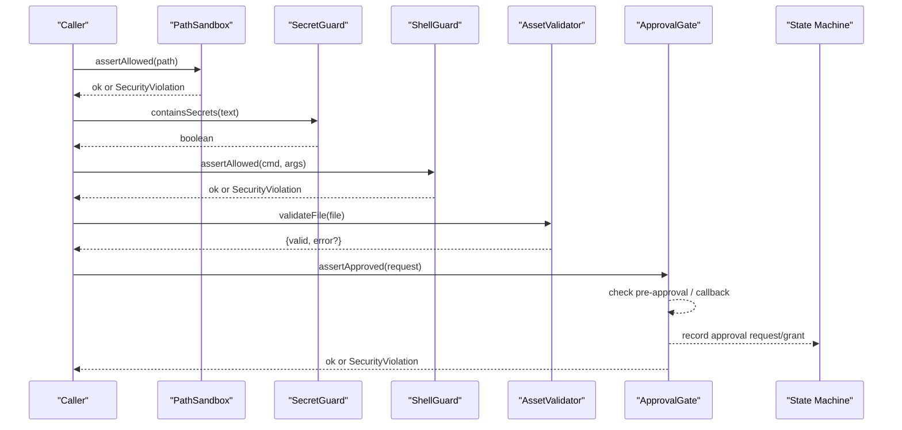
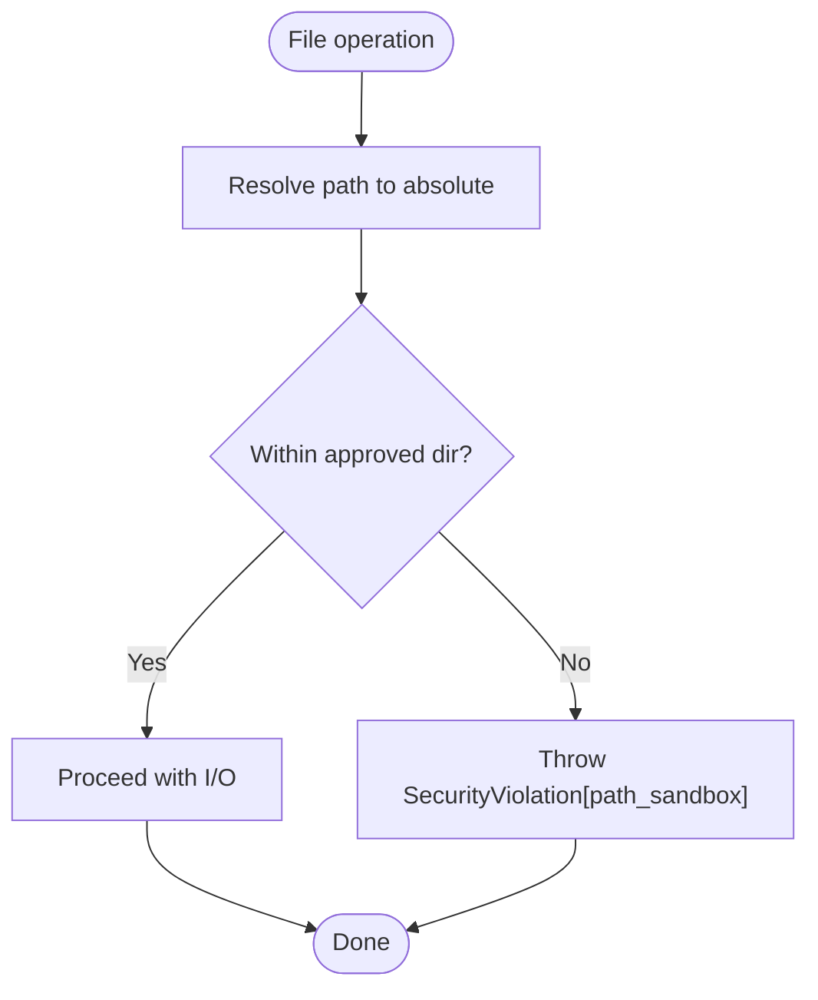
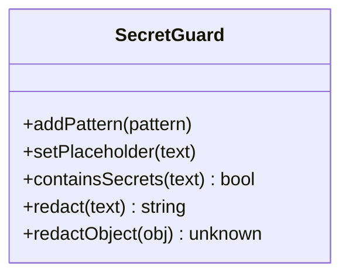
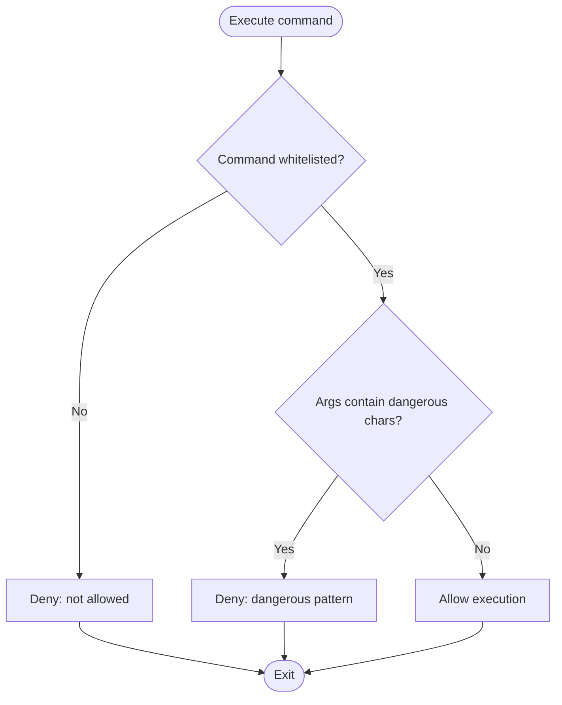
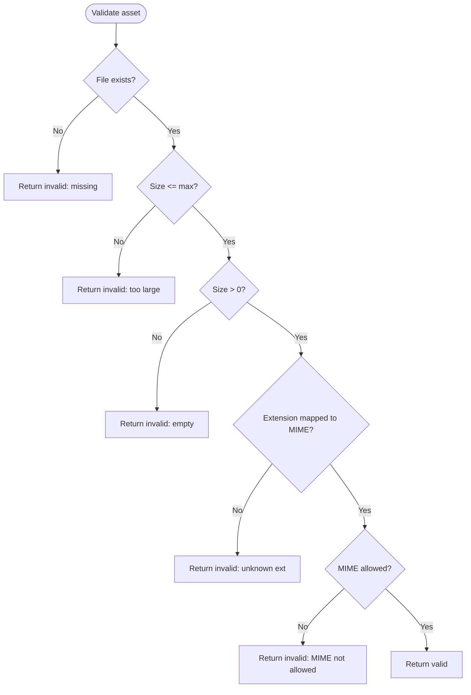
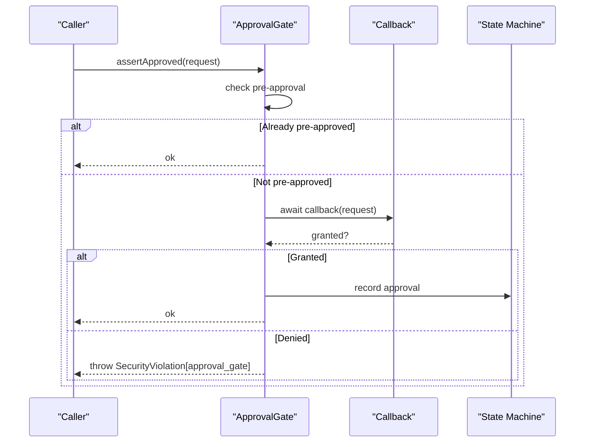
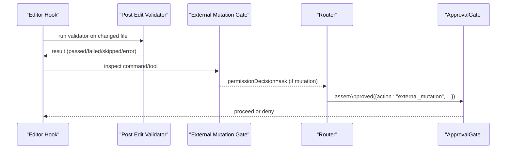
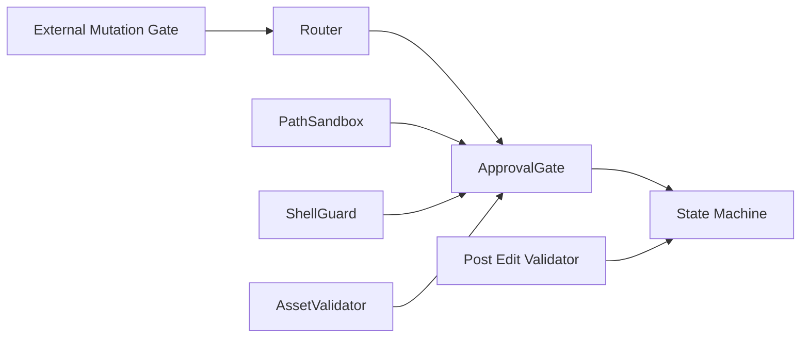

# Security Controls

<cite>
**Referenced Files in This Document**
- [security.ts](file://runtime/src/core/security.ts)
- [post_edit_validator.py](file://plugin/figmaforge/core/hooks/post_edit_validator.py)
- [external_mutation_gate.py](file://plugin/figmaforge/core/hooks/external_mutation_gate.py)
- [state.py](file://plugin/figmaforge/core/state.py)
- [router.py](file://plugin/figmaforge/core/router.py)
- [test_all.ts](file://runtime/tests/test_all.ts)
</cite>

## Table of Contents
1. [Introduction](#introduction)
2. [Project Structure](#project-structure)
3. [Core Components](#core-components)
4. [Architecture Overview](#architecture-overview)
5. [Detailed Component Analysis](#detailed-component-analysis)
6. [Dependency Analysis](#dependency-analysis)
7. [Performance Considerations](#performance-considerations)
8. [Troubleshooting Guide](#troubleshooting-guide)
9. [Conclusion](#conclusion)
10. [Appendices](#appendices)

## Introduction
This document explains FigmaForge’s multi-layered security control system and how its components work independently and together to protect file system access, sensitive data, command execution, external assets, and high-risk operations. It covers configuration options for approved directories, secret patterns, allowed commands, asset validation rules, approval workflows, audit logging, and breach detection mechanisms. It also provides examples of configuring policies, implementing custom validators, handling violations, integrating with external approval systems, and aligning with best practices and compliance requirements.

## Project Structure
Security controls are implemented across the runtime (TypeScript) and plugin (Python) layers:
- Runtime core security primitives: PathSandbox, SecretGuard, ShellGuard, AssetValidator, ApprovalGate
- Plugin hooks: post-edit validator and external mutation gate
- State management: approval records and event logs
- Router: determines when approval gates are required based on roles and context

**Diagram sources**
- [security.ts:32-103](file://runtime/src/core/security.ts#L32-L103)
- [security.ts:121-179](file://runtime/src/core/security.ts#L121-L179)
- [security.ts:196-239](file://runtime/src/core/security.ts#L196-L239)
- [security.ts:262-328](file://runtime/src/core/security.ts#L262-L328)
- [security.ts:351-400](file://runtime/src/core/security.ts#L351-L400)
- [post_edit_validator.py:19-63](file://plugin/figmaforge/core/hooks/post_edit_validator.py#L19-L63)
- [external_mutation_gate.py:12-84](file://plugin/figmaforge/core/hooks/external_mutation_gate.py#L12-L84)
- [state.py:24-32](file://plugin/figmaforge/core/state.py#L24-L32)
- [router.py:377-409](file://plugin/figmaforge/core/router.py#L377-L409)

**Section sources**
- [security.ts:1-401](file://runtime/src/core/security.ts#L1-L401)
- [post_edit_validator.py:1-148](file://plugin/figmaforge/core/hooks/post_edit_validator.py#L1-L148)
- [external_mutation_gate.py:1-132](file://plugin/figmaforge/core/hooks/external_mutation_gate.py#L1-L132)
- [state.py:1-200](file://plugin/figmaforge/core/state.py#L1-L200)
- [router.py:377-409](file://plugin/figmaforge/core/router.py#L377-L409)

## Core Components
- PathSandbox: Restricts file system access to explicitly approved directories; safe read/write wrappers enforce checks before I/O.
- SecretGuard: Detects and redacts secrets from text and objects using built-in and configurable regex patterns.
- ShellGuard: Allows only pre-approved commands and blocks dangerous argument patterns.
- AssetValidator: Validates external assets by size, MIME type mapping via extension, and emptiness checks.
- ApprovalGate: Enforces manual or programmatic consent for high-risk actions; supports pre-approvals and session-scoped caching.

These components provide defense-in-depth: filesystem isolation, secret protection, command safety, input validation, and human-in-the-loop approvals.

**Section sources**
- [security.ts:32-103](file://runtime/src/core/security.ts#L32-L103)
- [security.ts:121-179](file://runtime/src/core/security.ts#L121-L179)
- [security.ts:196-239](file://runtime/src/core/security.ts#L196-L239)
- [security.ts:262-328](file://runtime/src/core/security.ts#L262-L328)
- [security.ts:351-400](file://runtime/src/core/security.ts#L351-L400)

## Architecture Overview
The runtime security layer enforces strict boundaries around file paths, secrets, shell commands, and assets. The plugin layer adds policy-driven gates that detect risky operations and trigger approvals. The router decides which gates apply based on roles and context. The state machine records approvals and events for auditability.

**Diagram sources**
- [security.ts:47-88](file://runtime/src/core/security.ts#L47-L88)
- [security.ts:135-179](file://runtime/src/core/security.ts#L135-L179)
- [security.ts:208-239](file://runtime/src/core/security.ts#L208-L239)
- [security.ts:271-328](file://runtime/src/core/security.ts#L271-L328)
- [security.ts:369-400](file://runtime/src/core/security.ts#L369-L400)
- [state.py:260-308](file://plugin/figmaforge/core/state.py#L260-L308)

## Detailed Component Analysis

### PathSandbox: File System Isolation
- Purpose: Ensure all file reads/writes occur within approved directories.
- Key behaviors:
  - Resolves paths to absolute form and checks containment under configured directories.
  - Provides safe readFileSync and writeFileSync wrappers that enforce checks prior to I/O.
  - Supports runtime approval of additional directories.
- Configuration:
  - Initialize with an array of approved directories.
  - Use approve() to add new directories at runtime after user or policy approval.
- Error handling:
  - Throws a typed SecurityViolation with rule “path_sandbox” on unauthorized paths.
- Usage examples (by reference):
  - Allowed path checks and safe reads/writes are exercised in tests.

**Diagram sources**
- [security.ts:47-88](file://runtime/src/core/security.ts#L47-L88)

**Section sources**
- [security.ts:32-103](file://runtime/src/core/security.ts#L32-L103)
- [test_all.ts:602-631](file://runtime/tests/test_all.ts#L602-L631)

### SecretGuard: Sensitive Data Protection
- Purpose: Prevent secrets from appearing in logs, prompts, or outputs.
- Capabilities:
  - Detects secrets using built-in regex patterns and allows adding custom patterns.
  - Redacts values while preserving keys where possible.
  - Deep-redacts nested objects and arrays.
- Configuration:
  - Add custom patterns via addPattern().
  - Customize redaction placeholder via setPlaceholder().
- Error handling:
  - Non-fatal; returns booleans or sanitized strings/objects.
- Usage examples (by reference):
  - Detection and redaction behavior validated in tests.

**Diagram sources**
- [security.ts:121-179](file://runtime/src/core/security.ts#L121-L179)

**Section sources**
- [security.ts:109-179](file://runtime/src/core/security.ts#L109-L179)
- [test_all.ts:633-653](file://runtime/tests/test_all.ts#L633-L653)

### ShellGuard: Command Execution Safety
- Purpose: Restrict shell execution to a whitelist of commands and block dangerous arguments.
- Capabilities:
  - Maintains an allowlist of commands (e.g., python3, node, npx).
  - Rejects arguments containing shell metacharacters (;, &&, ||, |).
  - Supports extending the allowlist at runtime.
- Configuration:
  - Provide extra allowed commands during construction or via allow().
- Error handling:
  - Throws SecurityViolation with rule “shell_guard” for disallowed commands or dangerous arguments.
- Usage examples (by reference):
  - Tests verify allowed/denied commands and argument filtering.

**Diagram sources**
- [security.ts:196-239](file://runtime/src/core/security.ts#L196-L239)

**Section sources**
- [security.ts:185-239](file://runtime/src/core/security.ts#L185-L239)
- [test_all.ts:655-668](file://runtime/tests/test_all.ts#L655-L668)

### AssetValidator: Input Validation for External Assets
- Purpose: Validate external assets before use to prevent oversized or unsafe content.
- Capabilities:
  - Checks file existence, size limits, and emptiness.
  - Maps file extensions to MIME types and validates against an allowlist.
  - Validates buffers with size and emptiness checks.
- Configuration:
  - Set maxFileSize and allowedMimeTypes via constructor options.
- Error handling:
  - Returns structured results with valid flag and optional error messages.
- Usage examples (by reference):
  - Tests cover valid files, missing files, and empty files.

**Diagram sources**
- [security.ts:262-328](file://runtime/src/core/security.ts#L262-L328)

**Section sources**
- [security.ts:245-328](file://runtime/src/core/security.ts#L245-L328)
- [test_all.ts:670-690](file://runtime/tests/test_all.ts#L670-L690)

### ApprovalGate: Manual Intervention Points
- Purpose: Require explicit consent before performing potentially destructive or high-risk actions.
- Capabilities:
  - Pre-approve actions (e.g., via CLI flags) to bypass interactive prompts.
  - Invoke a user-defined callback to obtain consent; cache approvals per session.
  - Throw SecurityViolation if no callback is set or if denied.
- Integration:
  - Works with plugin-level gates to determine when approvals are needed.
  - Records approval requests and grants in the state machine for audit trails.
- Usage examples (by reference):
  - Tests demonstrate pre-approval, denial without callback, and callback-based approval.

**Diagram sources**
- [security.ts:351-400](file://runtime/src/core/security.ts#L351-L400)
- [state.py:260-308](file://plugin/figmaforge/core/state.py#L260-L308)

**Section sources**
- [security.ts:334-400](file://runtime/src/core/security.ts#L334-L400)
- [state.py:260-308](file://plugin/figmaforge/core/state.py#L260-L308)
- [test_all.ts:692-733](file://runtime/tests/test_all.ts#L692-L733)

### Plugin-Level Gates and Validators
- Post Edit Validator:
  - Determines a language-specific validator for edited files and executes it safely with timeouts and bounded output capture.
  - Skips gracefully if toolchain binaries are missing.
- External Mutation Gate:
  - Inspects bash commands and MCP tool names for mutations (e.g., git push, terraform apply, kubectl delete, Jira/Confluence tools).
  - Triggers an “ask” decision for external mutation gates when risky patterns are detected.

**Diagram sources**
- [post_edit_validator.py:66-147](file://plugin/figmaforge/core/hooks/post_edit_validator.py#L66-L147)
- [external_mutation_gate.py:87-127](file://plugin/figmaforge/core/hooks/external_mutation_gate.py#L87-L127)
- [router.py:377-409](file://plugin/figmaforge/core/router.py#L377-L409)
- [security.ts:369-400](file://runtime/src/core/security.ts#L369-L400)

**Section sources**
- [post_edit_validator.py:19-63](file://plugin/figmaforge/core/hooks/post_edit_validator.py#L19-L63)
- [post_edit_validator.py:66-147](file://plugin/figmaforge/core/hooks/post_edit_validator.py#L66-L147)
- [external_mutation_gate.py:12-84](file://plugin/figmaforge/core/hooks/external_mutation_gate.py#L12-L84)
- [external_mutation_gate.py:87-127](file://plugin/figmaforge/core/hooks/external_mutation_gate.py#L87-L127)
- [router.py:377-409](file://plugin/figmaforge/core/router.py#L377-L409)

## Dependency Analysis
- Coupling:
  - ApprovalGate depends on a callback and integrates with the state machine for auditability.
  - Router influences when ApprovalGate is invoked based on roles and execution mode.
  - Post Edit Validator and External Mutation Gate feed into routing and approval decisions.
- Cohesion:
  - Each component encapsulates a specific security concern (paths, secrets, commands, assets, approvals).
- External dependencies:
  - Node fs/path for filesystem operations.
  - Python subprocess for running validators and detecting mutations.

**Diagram sources**
- [router.py:377-409](file://plugin/figmaforge/core/router.py#L377-L409)
- [security.ts:351-400](file://runtime/src/core/security.ts#L351-L400)
- [state.py:260-308](file://plugin/figmaforge/core/state.py#L260-L308)
- [post_edit_validator.py:66-147](file://plugin/figmaforge/core/hooks/post_edit_validator.py#L66-L147)
- [external_mutation_gate.py:87-127](file://plugin/figmaforge/core/hooks/external_mutation_gate.py#L87-L127)

**Section sources**
- [router.py:377-409](file://plugin/figmaforge/core/router.py#L377-L409)
- [security.ts:351-400](file://runtime/src/core/security.ts#L351-L400)
- [state.py:260-308](file://plugin/figmaforge/core/state.py#L260-L308)

## Performance Considerations
- PathSandbox resolves paths once per operation; keep approved directory lists minimal to reduce checks.
- SecretGuard applies multiple regex patterns; prefer batching redactions and avoid excessive calls on hot paths.
- ShellGuard performs simple allowlist lookups and short-circuits on dangerous argument patterns; keep the allowlist tight.
- AssetValidator uses stat and extension mapping; avoid validating extremely large files repeatedly—cache results when appropriate.
- ApprovalGate callbacks can be asynchronous; ensure they are efficient and do not introduce latency bottlenecks.

## Troubleshooting Guide
Common issues and resolutions:
- Unauthorized path access:
  - Symptom: SecurityViolation[path_sandbox].
  - Resolution: Approve the directory via PathSandbox.approve() or adjust initial approved directories.
- Disallowed command:
  - Symptom: SecurityViolation[shell_guard].
  - Resolution: Add the command to the allowlist via ShellGuard.allow() or remove dangerous arguments.
- Secret exposure risk:
  - Symptom: Logs or prompts contain sensitive data.
  - Resolution: Use SecretGuard.redact() or redactObject() before logging or displaying; add custom patterns if needed.
- Invalid asset:
  - Symptom: AssetValidator returns invalid with error details.
  - Resolution: Adjust file size limits, MIME allowlist, or ensure correct file extensions.
- Missing approval:
  - Symptom: SecurityViolation[approval_gate].
  - Resolution: Provide an ApprovalGate callback or pre-approve the action; ensure the state machine records approvals.

Audit and visibility:
- The state machine records approval requests and grants with timestamps and reasons for later review.
- Post Edit Validator and External Mutation Gate produce structured results that can be logged for diagnostics.

**Section sources**
- [security.ts:18-26](file://runtime/src/core/security.ts#L18-L26)
- [security.ts:47-88](file://runtime/src/core/security.ts#L47-L88)
- [security.ts:208-239](file://runtime/src/core/security.ts#L208-L239)
- [security.ts:271-328](file://runtime/src/core/security.ts#L271-L328)
- [security.ts:369-400](file://runtime/src/core/security.ts#L369-L400)
- [state.py:260-308](file://plugin/figmaforge/core/state.py#L260-L308)
- [post_edit_validator.py:66-147](file://plugin/figmaforge/core/hooks/post_edit_validator.py#L66-L147)
- [external_mutation_gate.py:87-127](file://plugin/figmaforge/core/hooks/external_mutation_gate.py#L87-L127)

## Conclusion
FigmaForge’s security control system combines strict filesystem isolation, secret redaction, command whitelisting, asset validation, and human-in-the-loop approvals to deliver comprehensive protection. The modular design enables independent configuration and testing while allowing collaborative enforcement through routing and stateful audit trails. By following the guidance here, teams can tailor policies to their environment, integrate with external approval systems, and maintain strong security posture aligned with best practices and compliance needs.

## Appendices

### Configuration Examples (by reference)
- Approved directories:
  - Initialize PathSandbox with a list of directories; call approve() to add more at runtime.
- Secret patterns:
  - Use SecretGuard.addPattern() to extend detection; customize placeholder via setPlaceholder().
- Allowed commands:
  - Extend ShellGuard with allow() or pass extra commands at construction.
- Asset validation rules:
  - Configure AssetValidator with maxFileSize and allowedMimeTypes.

### Implementing Custom Validators
- Post Edit Validator:
  - Map file extensions to validator commands; ensure binaries are available on PATH.
  - Handle timeouts and bounded output to avoid resource exhaustion.

### Handling Security Violations
- Catch SecurityViolation instances and log sanitized messages using SecretGuard.
- Route violations to ApprovalGate for user intervention when appropriate.

### Integrating with External Approval Systems
- Provide an ApprovalGate callback that calls your external system (e.g., ticketing or workflow service).
- Record outcomes in the state machine for auditability.

### Best Practices and Compliance
- Principle of least privilege: restrict approved directories, commands, and asset types.
- Defense in depth: combine runtime guards with plugin-level gates and approvals.
- Auditability: rely on state machine records for approvals and events.
- Compliance alignment: leverage roles and triggers for security, compliance, and audit workflows.

**Section sources**
- [security.ts:32-103](file://runtime/src/core/security.ts#L32-L103)
- [security.ts:121-179](file://runtime/src/core/security.ts#L121-L179)
- [security.ts:196-239](file://runtime/src/core/security.ts#L196-L239)
- [security.ts:262-328](file://runtime/src/core/security.ts#L262-L328)
- [security.ts:351-400](file://runtime/src/core/security.ts#L351-L400)
- [post_edit_validator.py:19-63](file://plugin/figmaforge/core/hooks/post_edit_validator.py#L19-L63)
- [post_edit_validator.py:66-147](file://plugin/figmaforge/core/hooks/post_edit_validator.py#L66-L147)
- [external_mutation_gate.py:12-84](file://plugin/figmaforge/core/hooks/external_mutation_gate.py#L12-L84)
- [state.py:260-308](file://plugin/figmaforge/core/state.py#L260-L308)
- [router.py:377-409](file://plugin/figmaforge/core/router.py#L377-L409)