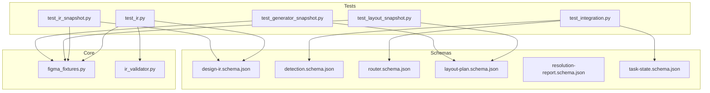
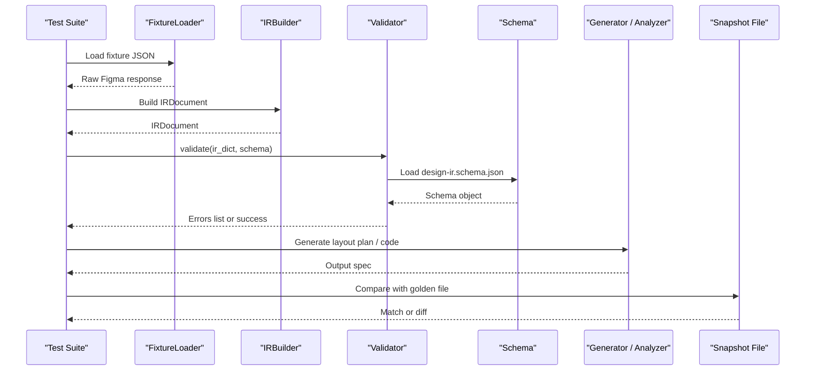
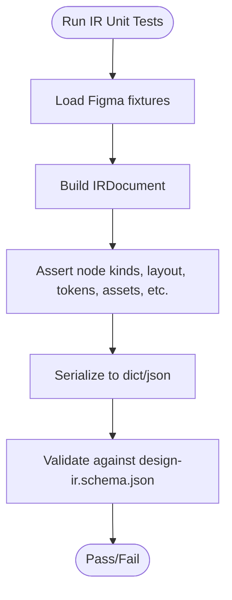
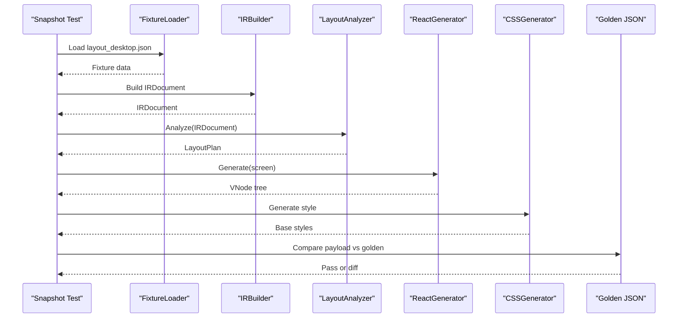
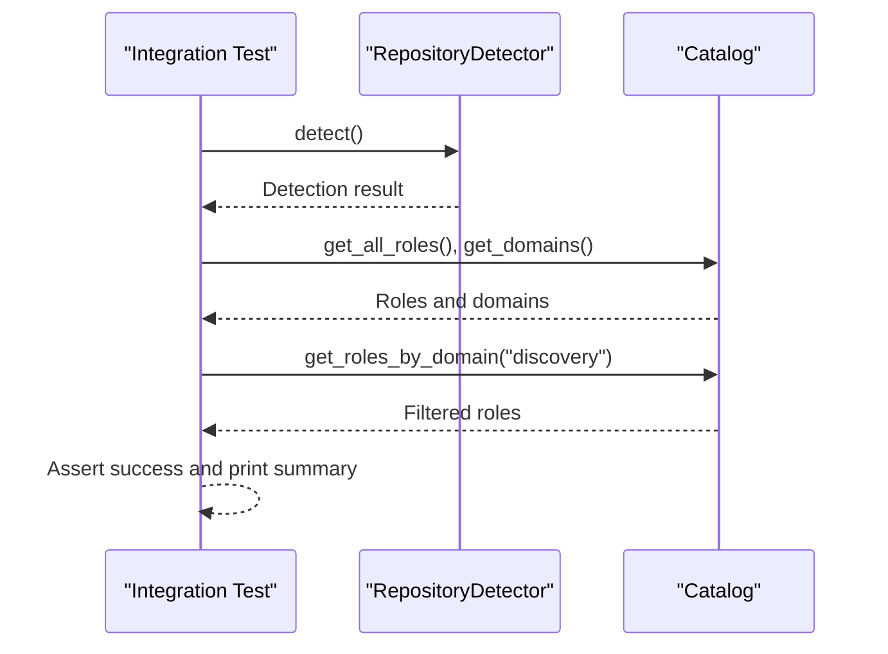
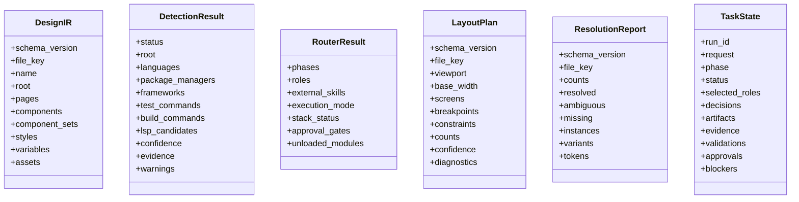
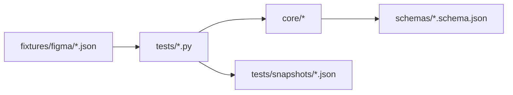

# Testing and Validation

<cite>
**Referenced Files in This Document**
- [test_ir.py](file://plugin/figmaforge/tests/test_ir.py)
- [test_integration.py](file://plugin/figmaforge/tests/test_integration.py)
- [test_ir_snapshot.py](file://plugin/figmaforge/tests/test_ir_snapshot.py)
- [test_generator_snapshot.py](file://plugin/figmaforge/tests/test_generator_snapshot.py)
- [test_layout_snapshot.py](file://plugin/figmaforge/tests/test_layout_snapshot.py)
- [ir_validator.py](file://plugin/figmaforge/core/ir_validator.py)
- [design-ir.schema.json](file://plugin/figmaforge/schemas/design-ir.schema.json)
- [detection.schema.json](file://plugin/figmaforge/schemas/detection.schema.json)
- [router.schema.json](file://plugin/figmaforge/schemas/router.schema.json)
- [task-state.schema.json](file://plugin/figmaforge/schemas/task-state.schema.json)
- [layout-plan.schema.json](file://plugin/figmaforge/schemas/layout-plan.schema.json)
- [resolution-report.schema.json](file://plugin/figmaforge/schemas/resolution-report.schema.json)
- [figma_fixtures.py](file://plugin/figmaforge/core/figma_fixtures.py)
</cite>

## Table of Contents
1. Introduction
2. Project Structure
3. Core Components
4. Architecture Overview
5. Detailed Component Analysis
6. Dependency Analysis
7. Performance Considerations
8. Troubleshooting Guide
9. Conclusion

## Introduction
This document explains FigmaForge’s testing and validation framework. It covers the organization of unit tests, integration tests, snapshot tests, and schema-based validation for design IR, detection results, router outputs, layout plans, resolution reports, and lifecycle task states. It also documents fixtures and golden files used to ensure deterministic behavior, provides guidance on writing new tests, running validations, interpreting results, debugging failures, and maintaining test quality.

## Project Structure
The testing and validation assets are organized under plugin/figmaforge:
- Tests: Python unittest suites for IR, layout, generators, router, state machine, tokens, and integration flows.
- Snapshots: Golden JSON files that capture expected outputs for IR, layout plans, generator output, and resolution reports.
- Schemas: JSON Schema (draft-07 subset) definitions for IR, detection, router, layout plan, resolution report, and task state.
- Fixtures: Deterministic Figma API responses used by tests and builders without network access.
- Validator: A dependency-free JSON-Schema validator implementation for the Design IR.

**Diagram sources**
- [test_ir.py:1-298](file://plugin/figmaforge/tests/test_ir.py#L1-L298)
- [test_integration.py:1-68](file://plugin/figmaforge/tests/test_integration.py#L1-L68)
- [test_ir_snapshot.py:1-72](file://plugin/figmaforge/tests/test_ir_snapshot.py#L1-L72)
- [test_layout_snapshot.py:1-70](file://plugin/figmaforge/tests/test_layout_snapshot.py#L1-L70)
- [test_generator_snapshot.py:1-110](file://plugin/figmaforge/tests/test_generator_snapshot.py#L1-L110)
- [figma_fixtures.py:1-52](file://plugin/figmaforge/core/figma_fixtures.py#L1-L52)
- [ir_validator.py:1-183](file://plugin/figmaforge/core/ir_validator.py#L1-L183)
- [design-ir.schema.json:1-336](file://plugin/figmaforge/schemas/design-ir.schema.json#L1-L336)
- [detection.schema.json:1-96](file://plugin/figmaforge/schemas/detection.schema.json#L1-L96)
- [router.schema.json:1-98](file://plugin/figmaforge/schemas/router.schema.json#L1-L98)
- [layout-plan.schema.json:1-196](file://plugin/figmaforge/schemas/layout-plan.schema.json#L1-L196)
- [resolution-report.schema.json:1-57](file://plugin/figmaforge/schemas/resolution-report.schema.json#L1-L57)
- [task-state.schema.json:1-133](file://plugin/figmaforge/schemas/task-state.schema.json#L1-L133)

**Section sources**
- [test_ir.py:1-298](file://plugin/figmaforge/tests/test_ir.py#L1-L298)
- [test_integration.py:1-68](file://plugin/figmaforge/tests/test_integration.py#L1-L68)
- [test_ir_snapshot.py:1-72](file://plugin/figmaforge/tests/test_ir_snapshot.py#L1-L72)
- [test_layout_snapshot.py:1-70](file://plugin/figmaforge/tests/test_layout_snapshot.py#L1-L70)
- [test_generator_snapshot.py:1-110](file://plugin/figmaforge/tests/test_generator_snapshot.py#L1-L110)
- [figma_fixtures.py:1-52](file://plugin/figmaforge/core/figma_fixtures.py#L1-L52)
- [ir_validator.py:1-183](file://plugin/figmaforge/core/ir_validator.py#L1-L183)

## Core Components
- Unit tests: Validate IR structure, serialization determinism, and schema validation rules against fixtures.
- Integration tests: Exercise detector, catalog, and routing-related behaviors using local paths and catalogs.
- Snapshot tests: Compare generated artifacts (IR, layout plan, generator output) byte-for-byte with checked-in golden files.
- Schema validation: Enforce contracts for IR, detection, router, layout plan, resolution report, and task state via a lightweight JSON-Schema subset validator.
- Fixtures: Deterministic JSON inputs representing Figma API responses to avoid network calls and ensure reproducibility.

Key responsibilities:
- ir_validator.py implements a minimal JSON-Schema validator supporting type checks, required fields, properties, items, enums, refs, and numeric bounds.
- figma_fixtures.py loads fixture JSON files safely and raises typed errors for missing or invalid fixtures.
- Test modules orchestrate builders and analyzers over fixtures and assert correctness or compare against snapshots.

**Section sources**
- [ir_validator.py:1-183](file://plugin/figmaforge/core/ir_validator.py#L1-L183)
- [figma_fixtures.py:1-52](file://plugin/figmaforge/core/figma_fixtures.py#L1-L52)
- [test_ir.py:1-298](file://plugin/figmaforge/tests/test_ir.py#L1-L298)
- [test_integration.py:1-68](file://plugin/figmaforge/tests/test_integration.py#L1-L68)
- [test_ir_snapshot.py:1-72](file://plugin/figmaforge/tests/test_ir_snapshot.py#L1-L72)
- [test_layout_snapshot.py:1-70](file://plugin/figmaforge/tests/test_layout_snapshot.py#L1-L70)
- [test_generator_snapshot.py:1-110](file://plugin/figmaforge/tests/test_generator_snapshot.py#L1-L110)

## Architecture Overview
The testing pipeline uses fixtures to build normalized IRs, then validates them against schemas and compares generated artifacts to snapshots. The integration test exercises higher-level components like detection and catalog loading.

**Diagram sources**
- [test_ir.py:1-298](file://plugin/figmaforge/tests/test_ir.py#L1-L298)
- [test_ir_snapshot.py:1-72](file://plugin/figmaforge/tests/test_ir_snapshot.py#L1-L72)
- [test_layout_snapshot.py:1-70](file://plugin/figmaforge/tests/test_layout_snapshot.py#L1-L70)
- [test_generator_snapshot.py:1-110](file://plugin/figmaforge/tests/test_generator_snapshot.py#L1-L110)
- [ir_validator.py:1-183](file://plugin/figmaforge/core/ir_validator.py#L1-L183)
- [design-ir.schema.json:1-336](file://plugin/figmaforge/schemas/design-ir.schema.json#L1-L336)

## Detailed Component Analysis

### Unit Tests for Design IR
- Build an IR from fixtures, traverse nodes, and assert structural properties such as kinds, typography, layout, tokens, assets, constraints, prototype links, annotations, source metadata, parent-child relationships, unknown properties, and unsupported property reporting.
- Validate serialization determinism and JSON safety.
- Validate schema compliance using the built-in validator and schema file; assert both positive and negative cases.

**Diagram sources**
- [test_ir.py:1-298](file://plugin/figmaforge/tests/test_ir.py#L1-L298)
- [ir_validator.py:1-183](file://plugin/figmaforge/core/ir_validator.py#L1-L183)
- [design-ir.schema.json:1-336](file://plugin/figmaforge/schemas/design-ir.schema.json#L1-L336)

**Section sources**
- [test_ir.py:1-298](file://plugin/figmaforge/tests/test_ir.py#L1-L298)

### Snapshot Tests
- IR snapshot: Normalizes a full Figma file and compares serialized IR to a golden file. Supports regeneration via environment variable.
- Layout plan snapshot: Analyzes desktop fixture into a layout plan and compares to a golden file.
- Generator snapshot: Produces per-screen VNode trees and base style maps, then compares to a golden file; includes assertions for semantic tags and Figma IDs.

**Diagram sources**
- [test_layout_snapshot.py:1-70](file://plugin/figmaforge/tests/test_layout_snapshot.py#L1-L70)
- [test_generator_snapshot.py:1-110](file://plugin/figmaforge/tests/test_generator_snapshot.py#L1-L110)
- [test_ir_snapshot.py:1-72](file://plugin/figmaforge/tests/test_ir_snapshot.py#L1-L72)

**Section sources**
- [test_ir_snapshot.py:1-72](file://plugin/figmaforge/tests/test_ir_snapshot.py#L1-L72)
- [test_layout_snapshot.py:1-70](file://plugin/figmaforge/tests/test_layout_snapshot.py#L1-L70)
- [test_generator_snapshot.py:1-110](file://plugin/figmaforge/tests/test_generator_snapshot.py#L1-L110)

### Integration Tests
- Exercises repository detection, catalog loading, and role queries. Prints status, confidence, languages, roles, and domains. Exits with non-zero on failure.

**Diagram sources**
- [test_integration.py:1-68](file://plugin/figmaforge/tests/test_integration.py#L1-L68)

**Section sources**
- [test_integration.py:1-68](file://plugin/figmaforge/tests/test_integration.py#L1-L68)

### Schema Validation System
- Design IR schema defines the contract for normalized design data, including nodes, pages, components, variables, assets, and more.
- Detection schema validates repository detection results, including languages, package managers, frameworks, commands, confidence, and evidence.
- Router schema validates role selection and execution mode decisions, phases, external skills, approval gates, and module load status.
- Layout plan schema validates responsive layout analysis outputs, including screens, breakpoints, constraints, diagnostics, and confidence.
- Resolution report schema validates component and token resolution outcomes, including matches, ambiguities, missing items, instances, variants, and token resolutions.
- Task state schema validates lifecycle run state, including phase transitions, decisions, validations, approvals, blockers, and risk levels.

**Diagram sources**
- [design-ir.schema.json:1-336](file://plugin/figmaforge/schemas/design-ir.schema.json#L1-L336)
- [detection.schema.json:1-96](file://plugin/figmaforge/schemas/detection.schema.json#L1-L96)
- [router.schema.json:1-98](file://plugin/figmaforge/schemas/router.schema.json#L1-L98)
- [layout-plan.schema.json:1-196](file://plugin/figmaforge/schemas/layout-plan.schema.json#L1-L196)
- [resolution-report.schema.json:1-57](file://plugin/figmaforge/schemas/resolution-report.schema.json#L1-L57)
- [task-state.schema.json:1-133](file://plugin/figmaforge/schemas/task-state.schema.json#L1-L133)

**Section sources**
- [design-ir.schema.json:1-336](file://plugin/figmaforge/schemas/design-ir.schema.json#L1-L336)
- [detection.schema.json:1-96](file://plugin/figmaforge/schemas/detection.schema.json#L1-L96)
- [router.schema.json:1-98](file://plugin/figmaforge/schemas/router.schema.json#L1-L98)
- [layout-plan.schema.json:1-196](file://plugin/figmaforge/schemas/layout-plan.schema.json#L1-L196)
- [resolution-report.schema.json:1-57](file://plugin/figmaforge/schemas/resolution-report.schema.json#L1-L57)
- [task-state.schema.json:1-133](file://plugin/figmaforge/schemas/task-state.schema.json#L1-L133)

## Dependency Analysis
- Tests depend on core modules (builders, analyzers, generators) and rely on fixtures for deterministic input.
- The validator depends only on the standard library and the schema file; it supports a subset of JSON Schema keywords used by the IR schema.
- Snapshot tests depend on golden files under tests/snapshots to enforce stable outputs across changes.

**Diagram sources**
- [figma_fixtures.py:1-52](file://plugin/figmaforge/core/figma_fixtures.py#L1-L52)
- [test_ir.py:1-298](file://plugin/figmaforge/tests/test_ir.py#L1-L298)
- [test_ir_snapshot.py:1-72](file://plugin/figmaforge/tests/test_ir_snapshot.py#L1-L72)
- [test_layout_snapshot.py:1-70](file://plugin/figmaforge/tests/test_layout_snapshot.py#L1-L70)
- [test_generator_snapshot.py:1-110](file://plugin/figmaforge/tests/test_generator_snapshot.py#L1-L110)

**Section sources**
- [figma_fixtures.py:1-52](file://plugin/figmaforge/core/figma_fixtures.py#L1-L52)
- [test_ir.py:1-298](file://plugin/figmaforge/tests/test_ir.py#L1-L298)
- [test_ir_snapshot.py:1-72](file://plugin/figmaforge/tests/test_ir_snapshot.py#L1-L72)
- [test_layout_snapshot.py:1-70](file://plugin/figmaforge/tests/test_layout_snapshot.py#L1-L70)
- [test_generator_snapshot.py:1-110](file://plugin/figmaforge/tests/test_generator_snapshot.py#L1-L110)

## Performance Considerations
- Use fixtures to avoid network latency and flakiness; all tests operate on local JSON files.
- Snapshot comparisons are fast and deterministic; regenerate only when intentional changes occur.
- The validator is lightweight and avoids heavy dependencies; keep schemas focused on needed keywords to maintain performance.
- For large fixtures, consider splitting tests by feature area to reduce runtime.

[No sources needed since this section provides general guidance]

## Troubleshooting Guide
Common issues and remedies:
- Missing snapshot files: Run with REWRITE_SNAPSHOTS=1 to generate the expected golden file, then review the diff before committing.
- Schema validation failures: Inspect error messages from the validator indicating missing required keys, wrong types, or unexpected properties; update either the data or the schema accordingly.
- Fixture not found or invalid JSON: Ensure the fixture exists under fixtures/figma and is valid JSON; the loader raises explicit errors for these cases.
- Non-deterministic output: Verify that serialization functions produce stable JSON (sorted keys, consistent ordering); snapshot tests will catch regressions.
- Integration test failures: Check paths and availability of catalog files; the integration test prints detailed status and exits non-zero on errors.

Debugging techniques:
- Print intermediate payloads (IR, layout plan, generator output) to inspect structure before comparison.
- Use the validator’s error list to pinpoint exact locations of schema violations.
- Regenerate snapshots incrementally to isolate which part of the pipeline changed.

Best practices:
- Keep fixtures small and representative; add new fixtures for new edge cases.
- Prefer assertions on semantics (kinds, counts, specific fields) alongside snapshots for robustness.
- Update schemas deliberately; document breaking changes in commit messages.
- Avoid randomness in tests; if necessary, seed random sources deterministically.

**Section sources**
- [test_ir_snapshot.py:1-72](file://plugin/figmaforge/tests/test_ir_snapshot.py#L1-L72)
- [test_layout_snapshot.py:1-70](file://plugin/figmaforge/tests/test_layout_snapshot.py#L1-L70)
- [test_generator_snapshot.py:1-110](file://plugin/figmaforge/tests/test_generator_snapshot.py#L1-L110)
- [ir_validator.py:1-183](file://plugin/figmaforge/core/ir_validator.py#L1-L183)
- [figma_fixtures.py:1-52](file://plugin/figmaforge/core/figma_fixtures.py#L1-L52)
- [test_integration.py:1-68](file://plugin/figmaforge/tests/test_integration.py#L1-L68)

## Conclusion
FigmaForge’s testing and validation framework combines targeted unit tests, integration tests, and comprehensive snapshot tests backed by strict JSON Schema contracts. Fixtures ensure deterministic inputs, while the lightweight validator enforces data integrity. Following the guidance here will help you write reliable tests, maintain high-quality snapshots, and confidently evolve the system while catching regressions early.